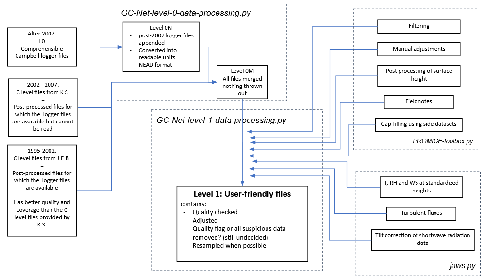

# GC-Net-Level-1-data-processing

This repository contains scripts used to flag, adjust and interpolate GC-Net data.

- [Overview of the L0 data](out/L0_overview_toc.md)
- [Overview of the L1 data](out/L1_overview_toc.md)
- [Overview of the L1 air temperature](out/L1_air_temperature_overview_toc.md)
- [Overview of the surface height data](figures/L1_overview/HS_overview.png)
- [Report of the data treatment](out/report_with_toc.md)
- [Air temperature diagnostic](out/L1_air_temperature_diagnostic_toc.md)
- [Instrument height assessment](out/L1_intrument_heights_toc.md)



## Installation

Uses [pyNEAD](https://github.com/GEUS-PROMICE/pyNEAD) and [PROMICE-AWS-toolbox](https://github.com/GEUS-PROMICE/PROMICE-AWS-toolbox)

```
pip install git+https://github.com/GEUS-PROMICE/pyNEAD.git

```

## Processing steps

### Level C

- Historical files already processed by K. Steffen
- Covers 1991-2007 period
- Original logger files available but poorly documented and changing from year to year

### Level 0

- Unaltered logger files
- Only available after 2007

### Level 0N

- AWS data translated into readable units
- Only available after 2007

### Level 0M

- Merging of the L0N and LC files

### Level 1

- Filtering of the erroneous measurements
- Adjustments applied when needed
- Quality assessment
- Derived variables available (T2m, RH2m, WS10m, SurfaceHeight)


# Processing functions

biweekly_upper_range_filter(t0, t1, adj_val)
searches for the biweekly maximum value var_max and filters all values below val_max-adj_val for these two weeks

 
