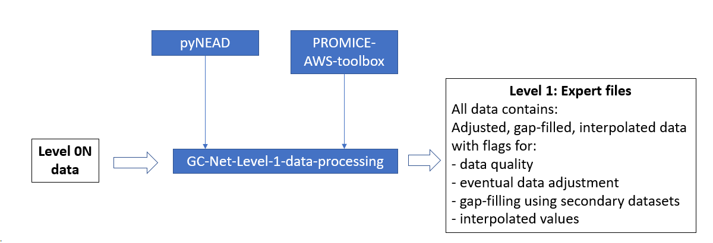

# GC-Net-Level-1-data-processing

This repository contains scripts used to flag, adjust and interpolate GC-Net data.



## Installation

Uses [pyNEAD](https://github.com/GEUS-PROMICE/pyNEAD) and [PROMICE-AWS-toolbox](https://github.com/GEUS-PROMICE/PROMICE-AWS-toolbox)

```
pip install git+https://github.com/GEUS-PROMICE/pyNEAD.git

```