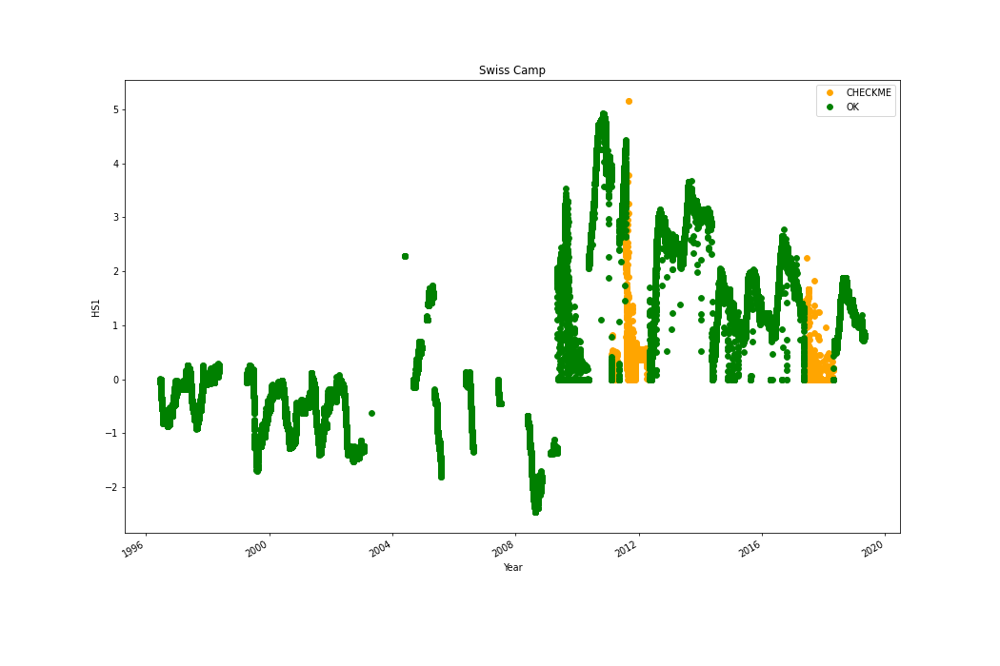
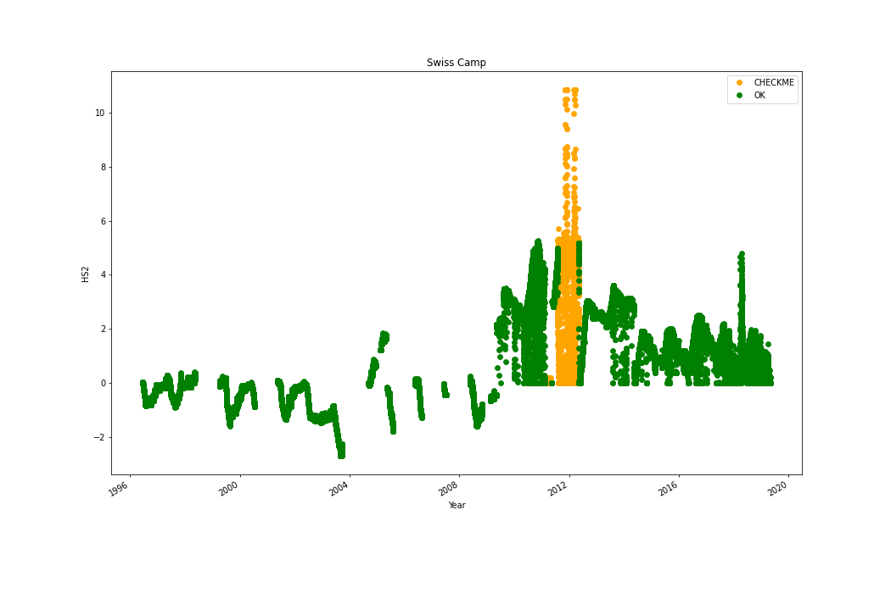
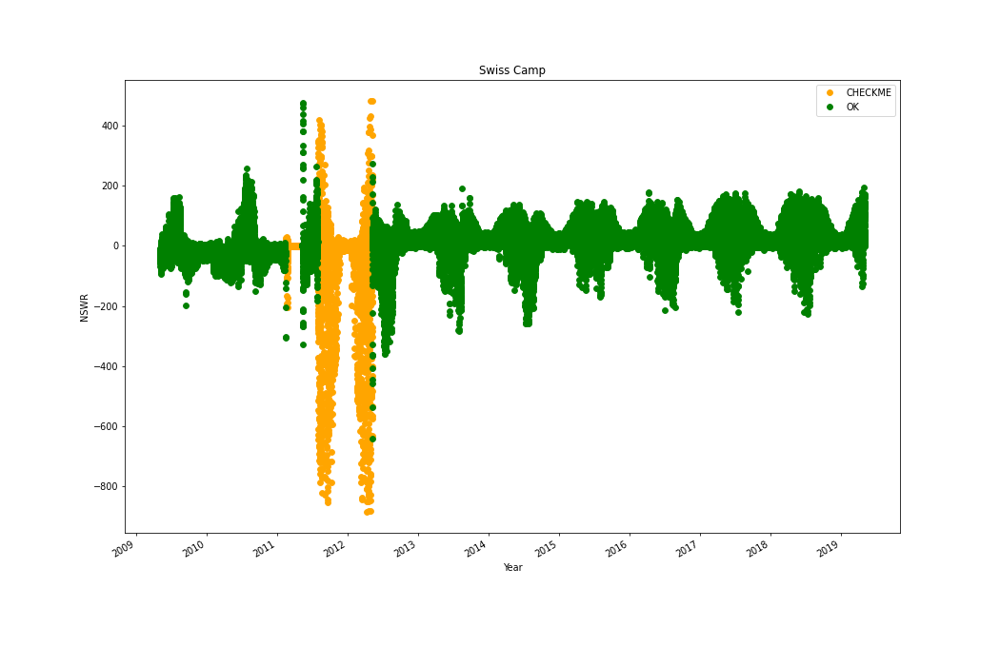

# 0 Swiss Camp 10m
## Manual flagging of data at Swiss Camp 10m
Flagging data:
|start time|end time|variable|
|-|-|-|
|2016-05-01 00:00:00+00:00|2017-06-01 00:00:00+00:00|OSWR|
 

 
|start time|end time|variable|
|-|-|-|
|2018-02-15 00:00:00+00:00|2018-05-05 00:00:00+00:00|P|
 

 
|start time|end time|variable|
|-|-|-|
|2015-05-15 00:00:00+00:00|2016-05-15 00:00:00+00:00|TA3|
 

 
## Adjusting data at Swiss Camp 10m
No data to fix at Swiss Camp 10m
# 1 Swiss Camp
## Manual flagging of data at Swiss Camp
Flagging data:
|start time|end time|variable|
|-|-|-|
|2011-02-15 00:00:00+00:00|2011-05-10 00:00:00+00:00|HS1|
|2011-08-01 00:00:00+00:00|2012-05-10 00:00:00+00:00|HS1|
|2017-05-15 00:00:00+00:00|2018-05-01 00:00:00+00:00|HS1|
 

 
|start time|end time|variable|
|-|-|-|
|2011-02-15 00:00:00+00:00|2011-05-10 00:00:00+00:00|HS2|
|2011-08-01 00:00:00+00:00|2012-05-10 00:00:00+00:00|HS2|
 

 
|start time|end time|variable|
|-|-|-|
|2009-07-01 00:00:00+00:00|2009-07-01 00:00:00+00:00|ISWR|
|2011-02-15 00:00:00+00:00|2011-05-10 00:00:00+00:00|ISWR|
 

 
|start time|end time|variable|
|-|-|-|
|2011-02-15 00:00:00+00:00|2011-05-10 00:00:00+00:00|NSWR|
|2011-08-01 00:00:00+00:00|2012-05-10 00:00:00+00:00|NSWR|
 

 
|start time|end time|variable|
|-|-|-|
|2009-07-01 00:00:00+00:00|2009-07-01 00:00:00+00:00|OSWR|
|2011-02-15 00:00:00+00:00|2011-05-10 00:00:00+00:00|OSWR|
|2011-08-01 00:00:00+00:00|2012-05-10 00:00:00+00:00|OSWR|
 

 
|start time|end time|variable|
|-|-|-|
|2015-06-01 00:00:00+00:00|2016-05-01 00:00:00+00:00|RH2|
 

 
|start time|end time|variable|
|-|-|-|
|2015-06-01 00:00:00+00:00|2016-05-01 00:00:00+00:00|VW1|
 

 
## Adjusting data at Swiss Camp
# 2 Crawford Point 1
## Manual flagging of data at Crawford Point 1
Flagging data:
Warning: IceTemperature1 not found
Warning: IceTemperature10 not found
Warning: IceTemperature2 not found
Warning: IceTemperature3 not found
Warning: IceTemperature4 not found
Warning: IceTemperature5 not found
Warning: IceTemperature6 not found
Warning: IceTemperature7 not found
Warning: IceTemperature8 not found
Warning: IceTemperature9 not found
## Adjusting data at Crawford Point 1
# 3 NASA-U
## Manual flagging of data at NASA-U
Flagging data:
|start time|end time|variable|
|-|-|-|
|2011-01-01 00:00:00+00:00|2016-07-01 00:00:00+00:00|P|
|2017-08-01 00:00:00+00:00|2018-12-31 00:00:00+00:00|P|
 

 
|start time|end time|variable|
|-|-|-|
|2017-10-01 00:00:00+00:00|2018-07-01 00:00:00+00:00|RH1|
 

 
|start time|end time|variable|
|-|-|-|
|2011-01-01 00:00:00+00:00|2012-07-01 00:00:00+00:00|RH2|
 

 
## Adjusting data at NASA-U
SnowHeight(m) not in datafile
SurfaceHeight(m) not in datafile
# 4 GITS
## Manual flagging of data at GITS
Flagging data:
|start time|end time|variable|
|-|-|-|
|2010-01-01 00:00:00+00:00|2012-05-26 00:00:00+00:00|RH1|
 

 
|start time|end time|variable|
|-|-|-|
|2010-01-01 00:00:00+00:00|2012-05-26 00:00:00+00:00|TA3|
 

 
## Adjusting data at GITS
# 5 Humboldt
## Manual flagging of data at Humboldt
No erroneous data listed for Humboldt
## Adjusting data at Humboldt
# 6 Summit
## Manual flagging of data at Summit
Flagging data:
Warning: IceTemperature1 not found
Warning: IceTemperature10 not found
Warning: IceTemperature2 not found
Warning: IceTemperature3 not found
Warning: IceTemperature4 not found
Warning: IceTemperature5 not found
Warning: IceTemperature6 not found
Warning: IceTemperature7 not found
Warning: IceTemperature8 not found
Warning: IceTemperature9 not found
## Adjusting data at Summit
### Adjusting P
|start time|end time|operation|value|
|-|-|-|-|
|2016-6-15T00:00:00+00:00|nan|add|-50.0|
 

 
SnowHeight(m) not in datafile
SurfaceHeight(m) not in datafile
# 7 Tunu-N
## Manual flagging of data at Tunu-N
Flagging data:
|start time|end time|variable|
|-|-|-|
|2011-01-01 00:00:00+00:00|2013-01-01 00:00:00+00:00|TA3|
 

 
|start time|end time|variable|
|-|-|-|
|2011-01-01 00:00:00+00:00|2013-01-01 00:00:00+00:00|TA4|
 

 
|start time|end time|variable|
|-|-|-|
|2011-01-01 00:00:00+00:00|2013-01-01 00:00:00+00:00|VW1|
 

 
## Adjusting data at Tunu-N
SnowHeight(m) not in datafile
SurfaceHeight(m) not in datafile
# 8 DYE2
## Manual flagging of data at DYE2
Flagging data:
Warning: AirPressurehPa not found
Warning: AirTemperature4C not found
Warning: IceTemperature1 not found
Warning: IceTemperature10 not found
Warning: IceTemperature2 not found
Warning: IceTemperature3 not found
Warning: IceTemperature4 not found
Warning: IceTemperature5 not found
Warning: IceTemperature6 not found
Warning: IceTemperature7 not found
Warning: IceTemperature8 not found
Warning: IceTemperature9 not found
|start time|end time|variable|
|-|-|-|
|2011-05-26 09:00:00+00:00|2013-12-28 00:00:00+00:00|P|
|2013-06-13 01:00:00+00:00|2014-10-26 00:00:00+00:00|P|
|2002-01-14 10:00:00+00:00|2003-04-29 00:00:00+00:00|P|
 

 
|start time|end time|variable|
|-|-|-|
|2009-09-09 12:00:00+00:00|2010-05-02 00:00:00+00:00|RH1|
 

 
|start time|end time|variable|
|-|-|-|
|2010-02-09 12:00:00+00:00|2010-05-02 00:00:00+00:00|RH2|
|2012-11-06 22:00:00+00:00|2013-08-14 00:00:00+00:00|RH2|
|2013-10-27 07:59:57+00:00|2014-05-20 00:00:00+00:00|RH2|
 

 
Warning: RelativeHumidity1Perc not found
Warning: RelativeHumidity2Perc not found
Warning: ShortwaveRadiationDownWm2 not found
Warning: ShortwaveRadiationUpWm2 not found
|start time|end time|variable|
|-|-|-|
|2009-06-15 01:00:00+00:00|2010-01-01 00:00:00+00:00|TA3|
 

 
|start time|end time|variable|
|-|-|-|
|2016-01-01 00:00:00+00:00|2018-01-01 00:00:00+00:00|VW2|
 

 
## Adjusting data at DYE2
SnowHeight(m) not in datafile
SurfaceHeight(m) not in datafile
# 9 JAR1
## Manual flagging of data at JAR1
No erroneous data listed for JAR1
## Adjusting data at JAR1
SnowHeight(m) not in datafile
# 10 Saddle
## Manual flagging of data at Saddle
No erroneous data listed for Saddle
## Adjusting data at Saddle
SnowHeight(m) not in datafile
SurfaceHeight(m) not in datafile
# 11 South Dome
## Manual flagging of data at South Dome
No erroneous data listed for South Dome
## Adjusting data at South Dome
No data to fix at South Dome
# 12 NASA-E
## Manual flagging of data at NASA-E
Flagging data:
|start time|end time|variable|
|-|-|-|
|2012-02-01 00:00:00+00:00|2013-06-01 00:00:00+00:00|TA3|
 

 
## Adjusting data at NASA-E
SnowHeight(m) not in datafile
SurfaceHeight(m) not in datafile
# 13 CP2
Warning: No file for station 13 CP2
# 14 NGRIP
Warning: No file for station 14 NGRIP
# 15 NASA-SE
## Manual flagging of data at NASA-SE
No erroneous data listed for NASA-SE
## Adjusting data at NASA-SE
SnowHeight(m) not in datafile
SurfaceHeight(m) not in datafile
# 16 KAR
Warning: No file for station 16 KAR
# 17 JAR 2
Warning: No file for station 17 JAR 2
# 18 KULU
Warning: No file for station 18 KULU
# 22 Petermann ELA
## Manual flagging of data at Petermann ELA
No erroneous data listed for Petermann ELA
## Adjusting data at Petermann ELA
No data to fix at Petermann ELA
# 23 NEEM
## Manual flagging of data at NEEM
Flagging data:
|start time|end time|variable|
|-|-|-|
|2014-10-01 00:00:00+00:00|2014-11-25 00:00:00+00:00|TA4|
 

 
## Adjusting data at NEEM
# 24 E-GRIP
## Manual flagging of data at E-GRIP
Flagging data:
|start time|end time|variable|
|-|-|-|
|2016-07-01 00:00:00+00:00|2018-10-01 00:00:00+00:00|ISWR|
 

 
## Adjusting data at E-GRIP
No data to fix at E-GRIP
