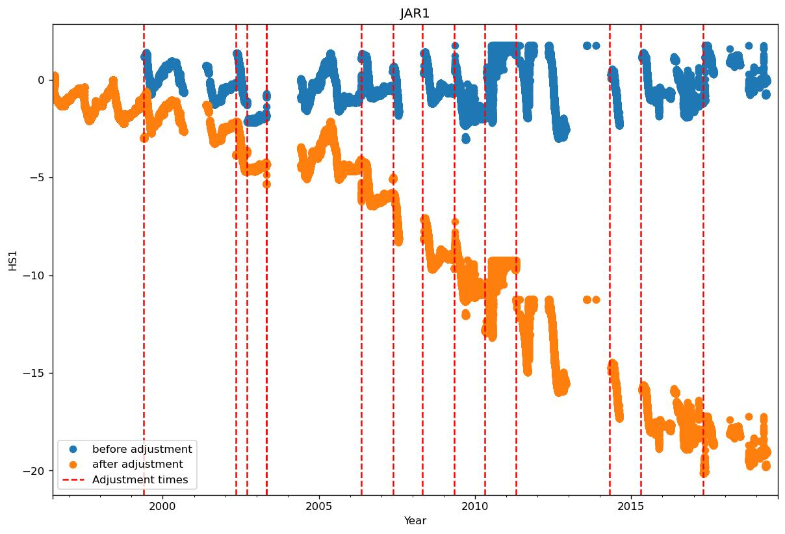

* [0 Swiss Camp 10m](#s1)
  * [Manual flagging of data at Swiss Camp 10m](#s1-1)
  * [Adjusting data at Swiss Camp 10m](#s1-2)
  * [Adjusting data at Swiss Camp 10m](#s1-3)
* [1 Swiss Camp](#s2)
  * [Manual flagging of data at Swiss Camp](#s2-1)
  * [Adjusting data at Swiss Camp](#s2-2)
  * [Adjusting data at Swiss Camp](#s2-3)
* [2 Crawford Point 1](#s3)
  * [Manual flagging of data at Crawford Point 1](#s3-1)
  * [Adjusting data at Crawford Point 1](#s3-2)
  * [Adjusting data at Crawford Point 1](#s3-3)
* [3 NASA-U](#s4)
  * [Manual flagging of data at NASA-U](#s4-1)
  * [Adjusting data at NASA-U](#s4-2)
  * [Adjusting data at NASA-U](#s4-3)
      * [Adjusting HS1](#s4-3-1)
      * [Adjusting HS2](#s4-3-2)
* [4 GITS](#s5)
  * [Manual flagging of data at GITS](#s5-1)
  * [Adjusting data at GITS](#s5-2)
  * [Adjusting data at GITS](#s5-3)
      * [Adjusting HS1](#s5-3-1)
      * [Adjusting HS2](#s5-3-2)
* [5 Humboldt](#s6)
  * [Manual flagging of data at Humboldt](#s6-1)
  * [Adjusting data at Humboldt](#s6-2)
  * [Adjusting data at Humboldt](#s6-3)
      * [Adjusting HS1](#s6-3-1)
      * [Adjusting HS2](#s6-3-2)
* [6 Summit](#s7)
  * [Manual flagging of data at Summit](#s7-1)
  * [Adjusting data at Summit](#s7-2)
  * [Adjusting data at Summit](#s7-3)
      * [Adjusting HS1](#s7-3-1)
      * [Adjusting HS2](#s7-3-2)
      * [Adjusting P](#s7-3-3)
* [7 Tunu-N](#s8)
  * [Manual flagging of data at Tunu-N](#s8-1)
  * [Adjusting data at Tunu-N](#s8-2)
  * [Adjusting data at Tunu-N](#s8-3)
      * [Adjusting HS1](#s8-3-1)
      * [Adjusting HS2](#s8-3-2)
* [8 DYE2](#s9)
  * [Manual flagging of data at DYE2](#s9-1)
  * [Adjusting data at DYE2](#s9-2)
      * [Adjusting HW1](#s9-2-1)
      * [Adjusting HW2](#s9-2-2)
  * [Adjusting data at DYE2](#s9-3)
      * [Adjusting HS1](#s9-3-1)
      * [Adjusting HS2](#s9-3-2)
* [9 JAR1](#s10)
  * [Manual flagging of data at JAR1](#s10-1)
  * [Adjusting data at JAR1](#s10-2)
  * [Adjusting data at JAR1](#s10-3)
      * [Adjusting HS1](#s10-3-1)
* [10 Saddle](#s11)
  * [Manual flagging of data at Saddle](#s11-1)
  * [Adjusting data at Saddle](#s11-2)
  * [Adjusting data at Saddle](#s11-3)
      * [Adjusting HS1](#s11-3-1)
      * [Adjusting HS2](#s11-3-2)
* [11 South Dome](#s12)
  * [Manual flagging of data at South Dome](#s12-1)
  * [Adjusting data at South Dome](#s12-2)
  * [Adjusting data at South Dome](#s12-3)
* [12 NASA-E](#s13)
  * [Manual flagging of data at NASA-E](#s13-1)
  * [Adjusting data at NASA-E](#s13-2)
  * [Adjusting data at NASA-E](#s13-3)
      * [Adjusting HS1](#s13-3-1)
      * [Adjusting HS2](#s13-3-2)
* [13 CP2](#s14)
* [14 NGRIP](#s15)
* [15 NASA-SE](#s16)
  * [Manual flagging of data at NASA-SE](#s16-1)
  * [Adjusting data at NASA-SE](#s16-2)
  * [Adjusting data at NASA-SE](#s16-3)
      * [Adjusting HS1](#s16-3-1)
      * [Adjusting HS2](#s16-3-2)
* [16 KAR](#s17)
* [17 JAR 2](#s18)
* [18 KULU](#s19)
* [22 Petermann ELA](#s20)
  * [Manual flagging of data at Petermann ELA](#s20-1)
  * [Adjusting data at Petermann ELA](#s20-2)
  * [Adjusting data at Petermann ELA](#s20-3)
      * [Adjusting TA2](#s20-3-1)
      * [Adjusting TA3](#s20-3-2)
      * [Adjusting TA4](#s20-3-3)
* [23 NEEM](#s21)
  * [Manual flagging of data at NEEM](#s21-1)
  * [Adjusting data at NEEM](#s21-2)
  * [Adjusting data at NEEM](#s21-3)
* [24 E-GRIP](#s22)
  * [Manual flagging of data at E-GRIP](#s22-1)
  * [Adjusting data at E-GRIP](#s22-2)
  * [Adjusting data at E-GRIP](#s22-3)
# <a id='s1' />0 Swiss Camp 10m
## <a id='s1-1' />Manual flagging of data at Swiss Camp 10m
Flagging data:
|start time|end time|variable|
|-|-|-|
|2016-05-01 00:00:00+00:00|2017-06-01 00:00:00+00:00|OSWR|
 

 
|start time|end time|variable|
|-|-|-|
|2018-02-15 00:00:00+00:00|2018-05-05 00:00:00+00:00|P|
 

 
|start time|end time|variable|
|-|-|-|
|2015-05-15 00:00:00+00:00|2016-05-15 00:00:00+00:00|TA3|
 

 
## <a id='s1-2' />Adjusting data at Swiss Camp 10m
No data to fix at Swiss Camp 10m
## <a id='s1-3' />Adjusting data at Swiss Camp 10m
No data to fix at Swiss Camp 10m
# <a id='s2' />1 Swiss Camp
## <a id='s2-1' />Manual flagging of data at Swiss Camp
Flagging data:
Warning: HS1 not found
Warning: HS2 not found
|start time|end time|variable|
|-|-|-|
|2009-07-01 00:00:00+00:00|2009-07-01 00:00:00+00:00|ISWR|
|2011-02-15 00:00:00+00:00|2011-05-10 00:00:00+00:00|ISWR|
 

 
|start time|end time|variable|
|-|-|-|
|2009-07-01 00:00:00+00:00|2009-07-01 00:00:00+00:00|OSWR|
|2011-02-15 00:00:00+00:00|2011-05-10 00:00:00+00:00|OSWR|
|2011-08-01 00:00:00+00:00|2012-05-10 00:00:00+00:00|OSWR|
 

 
|start time|end time|variable|
|-|-|-|
|2015-06-01 00:00:00+00:00|2016-05-01 00:00:00+00:00|RH2|
 

 
|start time|end time|variable|
|-|-|-|
|2015-06-01 00:00:00+00:00|2016-05-01 00:00:00+00:00|VW1|
 

 
## <a id='s2-2' />Adjusting data at Swiss Camp
## <a id='s2-3' />Adjusting data at Swiss Camp
# <a id='s3' />2 Crawford Point 1
## <a id='s3-1' />Manual flagging of data at Crawford Point 1
Flagging data:
|start time|end time|variable|
|-|-|-|
|2004-06-01 00:00:00+00:00|2019-01-01 00:00:00+00:00|TS1|
|1998-01-01 00:00:00+00:00|1999-01-01 00:00:00+00:00|TS1|
|2000-07-29 18:00:00+00:00|2000-08-10 00:00:00+00:00|TS1|
 

 
|start time|end time|variable|
|-|-|-|
|2010-01-01 00:00:00+00:00|2011-01-01 00:00:00+00:00|TS10|
|2000-08-01 00:00:00+00:00|2000-08-10 00:00:00+00:00|TS10|
|2000-08-01 00:00:00+00:00|2000-08-10 00:00:00+00:00|TS10|
|2004-06-01 00:00:00+00:00|2019-01-01 00:00:00+00:00|TS10|
|1998-01-01 00:00:00+00:00|1999-01-01 00:00:00+00:00|TS10|
 

 
|start time|end time|variable|
|-|-|-|
|2010-01-01 00:00:00+00:00|2011-01-01 00:00:00+00:00|TS2|
|2000-08-01 00:00:00+00:00|2000-08-10 00:00:00+00:00|TS2|
|2004-06-01 00:00:00+00:00|2019-01-01 00:00:00+00:00|TS2|
|1998-01-01 00:00:00+00:00|1999-01-01 00:00:00+00:00|TS2|
 

 
|start time|end time|variable|
|-|-|-|
|2010-01-01 00:00:00+00:00|2011-01-01 00:00:00+00:00|TS3|
|2000-08-01 00:00:00+00:00|2000-08-10 00:00:00+00:00|TS3|
|2004-06-01 00:00:00+00:00|2019-01-01 00:00:00+00:00|TS3|
|1998-01-01 00:00:00+00:00|1999-01-01 00:00:00+00:00|TS3|
|2000-10-26 04:00:00+00:00|2000-11-08 00:00:00+00:00|TS3|
|2001-09-05 06:00:00+00:00|2002-08-14 00:00:00+00:00|TS3|
|2003-10-14 08:00:00+00:00|2004-04-21 00:00:00+00:00|TS3|
 

 
|start time|end time|variable|
|-|-|-|
|2010-01-01 00:00:00+00:00|2011-01-01 00:00:00+00:00|TS4|
|2000-08-01 00:00:00+00:00|2000-08-10 00:00:00+00:00|TS4|
|2002-10-15 00:00:00+00:00|2002-11-05 00:00:00+00:00|TS4|
|2003-10-05 00:00:00+00:00|2003-11-30 00:00:00+00:00|TS4|
|2004-06-01 00:00:00+00:00|2019-01-01 00:00:00+00:00|TS4|
|1998-01-01 00:00:00+00:00|1999-01-01 00:00:00+00:00|TS4|
 

 
|start time|end time|variable|
|-|-|-|
|2010-01-01 00:00:00+00:00|2011-01-01 00:00:00+00:00|TS5|
|2000-08-01 00:00:00+00:00|2000-08-10 00:00:00+00:00|TS5|
|2004-06-01 00:00:00+00:00|2019-01-01 00:00:00+00:00|TS5|
|1998-01-01 00:00:00+00:00|1999-01-01 00:00:00+00:00|TS5|
 

 
|start time|end time|variable|
|-|-|-|
|2010-01-01 00:00:00+00:00|2011-01-01 00:00:00+00:00|TS6|
|2000-08-01 00:00:00+00:00|2000-08-10 00:00:00+00:00|TS6|
|2004-06-01 00:00:00+00:00|2019-01-01 00:00:00+00:00|TS6|
|1998-01-01 00:00:00+00:00|1999-01-01 00:00:00+00:00|TS6|
 

 
|start time|end time|variable|
|-|-|-|
|2010-01-01 00:00:00+00:00|2011-01-01 00:00:00+00:00|TS7|
|2000-08-01 00:00:00+00:00|2000-08-10 00:00:00+00:00|TS7|
|2004-06-01 00:00:00+00:00|2019-01-01 00:00:00+00:00|TS7|
|1998-01-01 00:00:00+00:00|1999-01-01 00:00:00+00:00|TS7|
|2003-09-30 17:00:00+00:00|2003-12-13 00:00:00+00:00|TS7|
 

 
|start time|end time|variable|
|-|-|-|
|2010-01-01 00:00:00+00:00|2011-01-01 00:00:00+00:00|TS8|
|2000-08-01 00:00:00+00:00|2000-08-10 00:00:00+00:00|TS8|
|2001-09-10 00:00:00+00:00|2001-12-01 00:00:00+00:00|TS8|
|2002-02-01 00:00:00+00:00|2002-07-20 00:00:00+00:00|TS8|
|2000-10-20 00:00:00+00:00|2000-11-10 00:00:00+00:00|TS8|
|2002-10-15 00:00:00+00:00|2002-11-05 00:00:00+00:00|TS8|
|2003-10-05 00:00:00+00:00|2004-06-30 00:00:00+00:00|TS8|
|2004-06-01 00:00:00+00:00|2019-01-01 00:00:00+00:00|TS8|
|1998-01-01 00:00:00+00:00|1999-01-01 00:00:00+00:00|TS8|
 

 
|start time|end time|variable|
|-|-|-|
|2010-01-01 00:00:00+00:00|2011-01-01 00:00:00+00:00|TS9|
|2000-08-01 00:00:00+00:00|2000-08-10 00:00:00+00:00|TS9|
|2004-06-01 00:00:00+00:00|2019-01-01 00:00:00+00:00|TS9|
|1998-01-01 00:00:00+00:00|1999-01-01 00:00:00+00:00|TS9|
 

 
## <a id='s3-2' />Adjusting data at Crawford Point 1
## <a id='s3-3' />Adjusting data at Crawford Point 1
# <a id='s4' />3 NASA-U
## <a id='s4-1' />Manual flagging of data at NASA-U
Flagging data:
|start time|end time|variable|
|-|-|-|
|2011-01-01 00:00:00+00:00|2016-07-01 00:00:00+00:00|P|
|2017-08-01 00:00:00+00:00|2018-12-31 00:00:00+00:00|P|
 

 
|start time|end time|variable|
|-|-|-|
|2017-10-01 00:00:00+00:00|2018-07-01 00:00:00+00:00|RH1|
 

 
|start time|end time|variable|
|-|-|-|
|2011-01-01 00:00:00+00:00|2012-07-01 00:00:00+00:00|RH2|
 

 
## <a id='s4-2' />Adjusting data at NASA-U
## <a id='s4-3' />Adjusting data at NASA-U
### <a id='s4-3-1' />Adjusting HS1
|start time|end time|operation|value|
|-|-|-|-|
|19960529T00:00:00+00:00|nan|add|1.25|
|20030603T16:00:00+00:00|nan|add|8.0|
|20050525T00:00:00+00:00|nan|add|2.5|
|20090420T16:00:00+00:00|nan|add|1.0|
|20110601T22:00:00+00:00|nan|add|1.7|
|20140531T00:00:00+00:00|nan|add|3.0|
 

 
### <a id='s4-3-2' />Adjusting HS2
|start time|end time|operation|value|
|-|-|-|-|
|19960529T00:00:00+00:00|nan|add|1.25|
|19970522T00:00:00+00:00|nan|add|1.25|
|20030603T16:00:00+00:00|nan|add|4.0|
|20050525T00:00:00+00:00|nan|add|2.0|
|20090420T16:00:00+00:00|nan|add|4.7|
|20110601T22:00:00+00:00|nan|add|1.58|
|20150115T00:00:00+00:00|nan|add|3.5|
 

 
# <a id='s5' />4 GITS
## <a id='s5-1' />Manual flagging of data at GITS
Flagging data:
|start time|end time|variable|
|-|-|-|
|2007-01-01 00:00:00+00:00|2014-05-01 00:00:00+00:00|P|
|1995-01-01 00:00:00+00:00|1996-05-01 00:00:00+00:00|P|
 

 
|start time|end time|variable|
|-|-|-|
|2010-01-01 00:00:00+00:00|2012-05-26 00:00:00+00:00|RH1|
 

 
|start time|end time|variable|
|-|-|-|
|2010-01-01 00:00:00+00:00|2012-05-26 00:00:00+00:00|TA3|
 

 
|start time|end time|variable|
|-|-|-|
|2007-01-01 00:00:00+00:00|2014-05-01 00:00:00+00:00|VW2|
 

 
## <a id='s5-2' />Adjusting data at GITS
## <a id='s5-3' />Adjusting data at GITS
### <a id='s5-3-1' />Adjusting HS1
|start time|end time|operation|value|
|-|-|-|-|
|19970306T00:00:00+00:00|nan|add|1.25|
|19990515T00:00:00+00:00|nan|add|1.25|
|20010515T00:00:00+00:00|nan|add|1.25|
|20100515T00:00:00+00:00|nan|add|10.25|
|20140515T00:00:00+00:00|nan|add|1.25|
|20160515T00:00:00+00:00|nan|add|1.25|
 

 
### <a id='s5-3-2' />Adjusting HS2
|start time|end time|operation|value|
|-|-|-|-|
|19970306T00:00:00+00:00|nan|add|1.25|
|19990515T00:00:00+00:00|nan|add|1.25|
|20010515T00:00:00+00:00|nan|add|1.25|
|20100515T00:00:00+00:00|nan|add|10.25|
|20140515T00:00:00+00:00|nan|add|1.25|
|20160515T00:00:00+00:00|nan|add|1.25|
 

 
# <a id='s6' />5 Humboldt
## <a id='s6-1' />Manual flagging of data at Humboldt
No erroneous data listed for Humboldt
## <a id='s6-2' />Adjusting data at Humboldt
## <a id='s6-3' />Adjusting data at Humboldt
### <a id='s6-3-1' />Adjusting HS1
|start time|end time|operation|value|
|-|-|-|-|
|20030522T00:00:00+00:00|nan|add|2|
|20100301T00:00:00+00:00|nan|add|2|
|20150326T00:00:00+00:00|nan|add|2|
 

 
### <a id='s6-3-2' />Adjusting HS2
|start time|end time|operation|value|
|-|-|-|-|
|20030522T00:00:00+00:00|nan|add|2|
|20100301T00:00:00+00:00|nan|add|2|
|20150326T00:00:00+00:00|nan|add|2|
 

 
# <a id='s7' />6 Summit
## <a id='s7-1' />Manual flagging of data at Summit
Flagging data:
|start time|end time|variable|
|-|-|-|
|2010-05-18 00:00:00+00:00|2022-01-01 00:00:00+00:00|TS1|
|1999-05-01 00:00:00+00:00|1999-05-15 00:00:00+00:00|TS1|
 

 
|start time|end time|variable|
|-|-|-|
|2010-05-18 00:00:00+00:00|2022-01-01 00:00:00+00:00|TS10|
|1999-05-01 00:00:00+00:00|1999-05-15 00:00:00+00:00|TS10|
 

 
|start time|end time|variable|
|-|-|-|
|2010-05-18 00:00:00+00:00|2022-01-01 00:00:00+00:00|TS2|
|1999-05-01 00:00:00+00:00|1999-05-15 00:00:00+00:00|TS2|
 

 
|start time|end time|variable|
|-|-|-|
|2010-05-18 00:00:00+00:00|2022-01-01 00:00:00+00:00|TS3|
|1999-05-01 00:00:00+00:00|1999-05-15 00:00:00+00:00|TS3|
 

 
|start time|end time|variable|
|-|-|-|
|2010-05-18 00:00:00+00:00|2022-01-01 00:00:00+00:00|TS4|
|1999-05-01 00:00:00+00:00|1999-05-15 00:00:00+00:00|TS4|
 

 
|start time|end time|variable|
|-|-|-|
|2010-05-18 00:00:00+00:00|2022-01-01 00:00:00+00:00|TS5|
|1999-05-01 00:00:00+00:00|1999-05-15 00:00:00+00:00|TS5|
 

 
|start time|end time|variable|
|-|-|-|
|2010-05-18 00:00:00+00:00|2022-01-01 00:00:00+00:00|TS6|
|1999-05-01 00:00:00+00:00|1999-05-15 00:00:00+00:00|TS6|
 

 
|start time|end time|variable|
|-|-|-|
|2010-05-18 00:00:00+00:00|2022-01-01 00:00:00+00:00|TS7|
|1999-05-01 00:00:00+00:00|1999-05-15 00:00:00+00:00|TS7|
 

 
|start time|end time|variable|
|-|-|-|
|2010-05-18 00:00:00+00:00|2022-01-01 00:00:00+00:00|TS8|
|1999-05-01 00:00:00+00:00|1999-05-15 00:00:00+00:00|TS8|
 

 
|start time|end time|variable|
|-|-|-|
|2010-05-18 00:00:00+00:00|2022-01-01 00:00:00+00:00|TS9|
|1999-05-01 00:00:00+00:00|1999-05-15 00:00:00+00:00|TS9|
 

 
## <a id='s7-2' />Adjusting data at Summit
## <a id='s7-3' />Adjusting data at Summit
### <a id='s7-3-1' />Adjusting HS1
|start time|end time|operation|value|
|-|-|-|-|
|2000-06-09T00:00:00+00:00|nan|add|0.8|
|2001-06-10T00:00:00+00:00|nan|add|2.0|
|2005-05-23T00:00:00+00:00|nan|add|2.5|
|2008-09-13T21:00:00+00:00|nan|add|0.5|
|2009-05-19T21:00:00+00:00|nan|add|0.5|
|2010-08-16T21:00:00+00:00|nan|add|3.1|
|2016-05-22T21:00:00+00:00|nan|add|2.9|
 

 
### <a id='s7-3-2' />Adjusting HS2
|start time|end time|operation|value|
|-|-|-|-|
|2000-05-09T00:00:00+00:00|nan|add|2.2|
|2001-06-10T12:00:00+00:00|nan|add|2.1|
|2005-05-26T14:00:00+00:00|nan|add|2.5|
|2010-08-18T14:00:00+00:00|nan|add|3.4|
|2016-05-22T14:00:00+00:00|nan|add|2.5|
 

 
### <a id='s7-3-3' />Adjusting P
|start time|end time|operation|value|
|-|-|-|-|
|2016-05-22T00:00:00+00:00|nan|add|-50.0|
 

 
# <a id='s8' />7 Tunu-N
## <a id='s8-1' />Manual flagging of data at Tunu-N
Flagging data:
|start time|end time|variable|
|-|-|-|
|2011-01-01 00:00:00+00:00|2013-01-01 00:00:00+00:00|TA3|
 

 
|start time|end time|variable|
|-|-|-|
|2011-01-01 00:00:00+00:00|2013-01-01 00:00:00+00:00|TA4|
 

 
|start time|end time|variable|
|-|-|-|
|2011-01-01 00:00:00+00:00|2013-01-01 00:00:00+00:00|VW1|
 

 
## <a id='s8-2' />Adjusting data at Tunu-N
## <a id='s8-3' />Adjusting data at Tunu-N
### <a id='s8-3-1' />Adjusting HS1
|start time|end time|operation|value|
|-|-|-|-|
|2003-06-02T19:30:00+00:00|nan|add|0.52|
|2004-10-16T17:00:00+00:00|nan|add|-3.5|
|2015-05-29T00:00:00+00:00|nan|add|-0.5|
 

 
### <a id='s8-3-2' />Adjusting HS2
|start time|end time|operation|value|
|-|-|-|-|
|2004-10-16T17:00:00+00:00|nan|add|-3.0|
|2015-05-29T00:00:00+00:00|nan|add|-1.0|
 

 
# <a id='s9' />8 DYE2
## <a id='s9-1' />Manual flagging of data at DYE2
Flagging data:
|start time|end time|variable|
|-|-|-|
|2002-05-19 01:00:00+00:00|2003-05-09 00:00:00+00:00|HW1|
|2015-06-07 01:00:00+00:00|2018-05-07 00:00:00+00:00|HW1|
 

 
|start time|end time|variable|
|-|-|-|
|2010-03-25 01:00:00+00:00|2014-05-23 00:00:00+00:00|HW2|
|2018-06-01 01:00:00+00:00|2019-05-20 00:00:00+00:00|HW2|
 

 
|start time|end time|variable|
|-|-|-|
|2004-06-15 01:00:00+00:00|2004-08-25 00:00:00+00:00|ISWR|
|2012-05-07 18:00:00+00:00|2012-05-12 00:00:00+00:00|ISWR|
|2004-05-09 15:00:00+00:00|2005-06-10 00:00:00+00:00|ISWR|
 

 
Warning: OSR not found
|start time|end time|variable|
|-|-|-|
|2004-05-09 15:00:00+00:00|2005-06-10 00:00:00+00:00|OSWR|
 

 
|start time|end time|variable|
|-|-|-|
|2011-05-26 09:00:00+00:00|2013-12-28 00:00:00+00:00|P|
|2010-05-21 07:00:02+00:00|2010-09-25 00:00:00+00:00|P|
|2013-06-13 01:00:00+00:00|2014-10-26 00:00:00+00:00|P|
|2002-01-14 10:00:00+00:00|2003-04-29 00:00:00+00:00|P|
 

 
|start time|end time|variable|
|-|-|-|
|2009-09-09 12:00:00+00:00|2010-05-02 00:00:00+00:00|RH1|
|1999-04-19 21:00:00+00:00|1999-10-17 00:00:00+00:00|RH1|
 

 
|start time|end time|variable|
|-|-|-|
|2010-02-09 12:00:00+00:00|2010-05-02 00:00:00+00:00|RH2|
|2012-11-06 22:00:00+00:00|2013-08-14 00:00:00+00:00|RH2|
|2013-10-27 07:59:57+00:00|2014-05-20 00:00:00+00:00|RH2|
|2012-02-11 04:59:00+00:00|2012-11-06 00:00:00+00:00|RH2|
|2016-01-01 00:00:00+00:00|2018-01-01 00:00:00+00:00|RH2|
 

 
|start time|end time|variable|
|-|-|-|
|2009-06-15 01:00:00+00:00|2010-01-01 00:00:00+00:00|TA3|
 

 
|start time|end time|variable|
|-|-|-|
|1996-09-14 22:00:00+00:00|1996-10-10 00:00:00+00:00|TA4|
|2009-05-19 21:00:00+00:00|2009-07-19 00:00:00+00:00|TA4|
 

 
|start time|end time|variable|
|-|-|-|
|2010-01-01 00:00:00+00:00|2020-01-01 00:00:00+00:00|TS1|
|2000-05-12 00:00:00+00:00|2000-05-18 00:00:00+00:00|TS1|
 

 
|start time|end time|variable|
|-|-|-|
|2010-01-01 00:00:00+00:00|2020-01-01 00:00:00+00:00|TS10|
|2000-05-01 00:00:00+00:00|2001-04-17 00:00:00+00:00|TS10|
|2000-05-12 00:00:00+00:00|2000-05-18 00:00:00+00:00|TS10|
 

 
|start time|end time|variable|
|-|-|-|
|2010-01-01 00:00:00+00:00|2020-01-01 00:00:00+00:00|TS2|
|2000-05-12 00:00:00+00:00|2000-05-18 00:00:00+00:00|TS2|
 

 
|start time|end time|variable|
|-|-|-|
|2010-01-01 00:00:00+00:00|2020-01-01 00:00:00+00:00|TS3|
|2000-05-12 00:00:00+00:00|2000-05-18 00:00:00+00:00|TS3|
 

 
|start time|end time|variable|
|-|-|-|
|2010-01-01 00:00:00+00:00|2020-01-01 00:00:00+00:00|TS4|
|2000-05-12 00:00:00+00:00|2000-05-18 00:00:00+00:00|TS4|
 

 
|start time|end time|variable|
|-|-|-|
|2010-01-01 00:00:00+00:00|2020-01-01 00:00:00+00:00|TS5|
|2001-03-10 00:00:00+00:00|2001-04-20 00:00:00+00:00|TS5|
|2000-05-12 00:00:00+00:00|2000-05-18 00:00:00+00:00|TS5|
 

 
|start time|end time|variable|
|-|-|-|
|2010-01-01 00:00:00+00:00|2020-01-01 00:00:00+00:00|TS6|
|2000-05-12 00:00:00+00:00|2000-05-18 00:00:00+00:00|TS6|
 

 
|start time|end time|variable|
|-|-|-|
|2010-01-01 00:00:00+00:00|2020-01-01 00:00:00+00:00|TS7|
|2000-05-12 00:00:00+00:00|2000-05-18 00:00:00+00:00|TS7|
 

 
|start time|end time|variable|
|-|-|-|
|2010-01-01 00:00:00+00:00|2020-01-01 00:00:00+00:00|TS8|
|2000-05-12 00:00:00+00:00|2000-05-18 00:00:00+00:00|TS8|
 

 
|start time|end time|variable|
|-|-|-|
|2010-01-01 00:00:00+00:00|2020-01-01 00:00:00+00:00|TS9|
|1999-12-01 00:00:00+00:00|1999-12-10 00:00:00+00:00|TS9|
|2000-05-01 00:00:00+00:00|2001-04-17 00:00:00+00:00|TS9|
|2000-05-12 00:00:00+00:00|2000-05-18 00:00:00+00:00|TS9|
 

 
|start time|end time|variable|
|-|-|-|
|2016-01-01 00:00:00+00:00|2018-01-01 00:00:00+00:00|VW2|
 

 
## <a id='s9-2' />Adjusting data at DYE2
### <a id='s9-2-1' />Adjusting HW1
|start time|end time|operation|value|
|-|-|-|-|
|1998-04-28T00:00:00+00:00|2000-05-12T00:00:00+00:00|add|0.5|
|2009-05-12T00:00:00+00:00|2010-05-12T00:00:00+00:00|upper_range_filter|0.2|
|2010-09-20T00:00:00+00:00|2020-09-20T00:00:00+00:00|upper_range_filter|0.4|
 

 
### <a id='s9-2-2' />Adjusting HW2
|start time|end time|operation|value|
|-|-|-|-|
|1996-05-15T00:00:00+00:00|1998-04-28T00:00:00+00:00|add|0.5|
|2009-06-01T00:00:00+00:00|2010-05-12T00:00:00+00:00|upper_range_filter|0.4|
|2010-01-01T00:00:00+00:00|2020-09-20T00:00:00+00:00|upper_range_filter|0.4|
 

 
## <a id='s9-3' />Adjusting data at DYE2
### <a id='s9-3-1' />Adjusting HS1
|start time|end time|operation|value|
|-|-|-|-|
|1998-04-28T00:00:00+00:00|nan|add|1.0|
|2000-05-12T00:00:00+00:00|nan|add|2.2|
|2001-06-15T13:00:00+00:00|nan|add|1.7|
|2003-05-09T00:00:00+00:00|nan|add|2.0|
|2006-05-10T00:00:00+00:00|nan|add|2.2|
|2010-04-28T00:00:00+00:00|nan|add|2.6|
 

 
### <a id='s9-3-2' />Adjusting HS2
|start time|end time|operation|value|
|-|-|-|-|
|1998-04-20T00:00:00+00:00|nan|add|2.0|
|2000-05-12T13:00:00+00:00|nan|add|2.2|
|2004-06-01T00:00:00+00:00|nan|add|0.75|
|2006-05-07T00:00:00+00:00|nan|add|2.5|
|2014-05-25T16:00:00+00:00|nan|add|6.0|
|2017-05-25T00:00:00+00:00|nan|add|2.0|
 

 
# <a id='s10' />9 JAR1
## <a id='s10-1' />Manual flagging of data at JAR1
No erroneous data listed for JAR1
## <a id='s10-2' />Adjusting data at JAR1
## <a id='s10-3' />Adjusting data at JAR1
### <a id='s10-3-1' />Adjusting HS1
|start time|end time|operation|value|
|-|-|-|-|
|2009-01-01T00:00:00+00:00|2017-01-01T00:00:00+00:00|add|-400|
 

 
# <a id='s11' />10 Saddle
## <a id='s11-1' />Manual flagging of data at Saddle
Flagging data:
|start time|end time|variable|
|-|-|-|
|2010-01-01 00:00:00+00:00|2020-01-01 00:00:00+00:00|RH2|
 

 
|start time|end time|variable|
|-|-|-|
|2009-01-01 00:00:00+00:00|2010-01-01 00:00:00+00:00|VW1|
 

 
|start time|end time|variable|
|-|-|-|
|2009-01-01 00:00:00+00:00|2010-01-01 00:00:00+00:00|VW2|
 

 
## <a id='s11-2' />Adjusting data at Saddle
## <a id='s11-3' />Adjusting data at Saddle
### <a id='s11-3-1' />Adjusting HS1
|start time|end time|operation|value|
|-|-|-|-|
|2003-05-01T00:00:00+00:00|nan|add|-6.0|
|2010-05-01T00:00:00+00:00|nan|add|-6.5|
|2013-05-21T16:00:00+00:00|nan|add|-4.0|
|2015-05-20T16:00:00+00:00|nan|add|-1.8|
|2016-05-26T00:00:00+00:00|nan|add|-1.6|
 

 
### <a id='s11-3-2' />Adjusting HS2
|start time|end time|operation|value|
|-|-|-|-|
|2003-05-01T00:00:00+00:00|nan|add|-6.0|
|2010-05-01T00:00:00+00:00|nan|add|-6.5|
|2013-05-21T16:00:00+00:00|nan|add|-3.0|
|2015-05-20T16:00:00+00:00|nan|add|-2.05|
 

 
# <a id='s12' />11 South Dome
## <a id='s12-1' />Manual flagging of data at South Dome
No erroneous data listed for South Dome
## <a id='s12-2' />Adjusting data at South Dome
No data to fix at South Dome
## <a id='s12-3' />Adjusting data at South Dome
No data to fix at South Dome
# <a id='s13' />12 NASA-E
## <a id='s13-1' />Manual flagging of data at NASA-E
Flagging data:
|start time|end time|variable|
|-|-|-|
|2012-02-01 00:00:00+00:00|2013-06-01 00:00:00+00:00|RH1|
 

 
|start time|end time|variable|
|-|-|-|
|2012-02-01 00:00:00+00:00|2013-06-01 00:00:00+00:00|TA3|
 

 
## <a id='s13-2' />Adjusting data at NASA-E
## <a id='s13-3' />Adjusting data at NASA-E
### <a id='s13-3-1' />Adjusting HS1
|start time|end time|operation|value|
|-|-|-|-|
|2001-06-08T13:00:00+00:00|nan|add|0.2|
|2009-10-01T15:00:00+00:00|nan|add|-4.7|
|2010-05-01T15:00:00+00:00|nan|add|-0.5|
 

 
### <a id='s13-3-2' />Adjusting HS2
|start time|end time|operation|value|
|-|-|-|-|
|2009-10-01T15:00:00+00:00|nan|add|-4.5|
|2015-05-15T15:00:00+00:00|nan|add|-0.5|
 

 
# <a id='s14' />13 CP2
Warning: No file for station 13 CP2
# <a id='s15' />14 NGRIP
Warning: No file for station 14 NGRIP
# <a id='s16' />15 NASA-SE
## <a id='s16-1' />Manual flagging of data at NASA-SE
No erroneous data listed for NASA-SE
## <a id='s16-2' />Adjusting data at NASA-SE
## <a id='s16-3' />Adjusting data at NASA-SE
### <a id='s16-3-1' />Adjusting HS1
|start time|end time|operation|value|
|-|-|-|-|
|1998-04-24T19:59:00+00:00|nan|add|-0.15|
|2007-07-05T19:00:00+00:00|nan|add|-13.06|
|2009-01-01T00:00:00+00:00|nan|add|-3.73|
|2016-05-22T00:00:00+00:00|nan|add|-8.0|
 

 
### <a id='s16-3-2' />Adjusting HS2
|start time|end time|operation|value|
|-|-|-|-|
|2007-07-05T19:00:00+00:00|nan|add|-13.3|
|2009-01-01T00:00:00+00:00|nan|add|-1.5|
|2010-04-30T23:00:00+00:00|nan|add|-2.0|
|2014-05-25T19:59:00+00:00|nan|add|-5.05|
|2016-05-22T00:00:00+00:00|nan|add|-3.0|
 

 
# <a id='s17' />16 KAR
Warning: No file for station 16 KAR
# <a id='s18' />17 JAR 2
Warning: No file for station 17 JAR 2
# <a id='s19' />18 KULU
Warning: No file for station 18 KULU
# <a id='s20' />22 Petermann ELA
## <a id='s20-1' />Manual flagging of data at Petermann ELA
Flagging data:
|start time|end time|variable|
|-|-|-|
|2003-01-01 00:00:00+00:00|2011-05-23 00:00:00+00:00|RH1|
 

 
|start time|end time|variable|
|-|-|-|
|2003-01-01 00:00:00+00:00|2011-05-01 00:00:00+00:00|RH2|
 

 
## <a id='s20-2' />Adjusting data at Petermann ELA
## <a id='s20-3' />Adjusting data at Petermann ELA
### <a id='s20-3-1' />Adjusting TA2
|start time|end time|operation|value|
|-|-|-|-|
|2003-05-23T07:00:00+00:00|nan|max_filter|11|
 

 
### <a id='s20-3-2' />Adjusting TA3
|start time|end time|operation|value|
|-|-|-|-|
|2003-05-23T07:00:00+00:00|nan|max_filter|11|
 

 
### <a id='s20-3-3' />Adjusting TA4
|start time|end time|operation|value|
|-|-|-|-|
|2003-05-23T07:00:00+00:00|nan|max_filter|11|
 

 
# <a id='s21' />23 NEEM
## <a id='s21-1' />Manual flagging of data at NEEM
Flagging data:
|start time|end time|variable|
|-|-|-|
|2009-01-01 00:00:00+00:00|2017-01-01 00:00:00+00:00|P|
 

 
|start time|end time|variable|
|-|-|-|
|2017-02-01 00:00:00+00:00|2018-05-01 00:00:00+00:00|RH2|
 

 
|start time|end time|variable|
|-|-|-|
|2017-02-01 00:00:00+00:00|2018-05-01 00:00:00+00:00|TA4|
 

 
## <a id='s21-2' />Adjusting data at NEEM
## <a id='s21-3' />Adjusting data at NEEM
# <a id='s22' />24 E-GRIP
## <a id='s22-1' />Manual flagging of data at E-GRIP
Flagging data:
|start time|end time|variable|
|-|-|-|
|2016-01-01 00:00:00+00:00|2019-10-01 00:00:00+00:00|ISWR|
 

 
|start time|end time|variable|
|-|-|-|
|2016-01-01 00:00:00+00:00|2019-10-01 00:00:00+00:00|OSWR|
 

 
## <a id='s22-2' />Adjusting data at E-GRIP
No data to fix at E-GRIP
## <a id='s22-3' />Adjusting data at E-GRIP
No data to fix at E-GRIP
