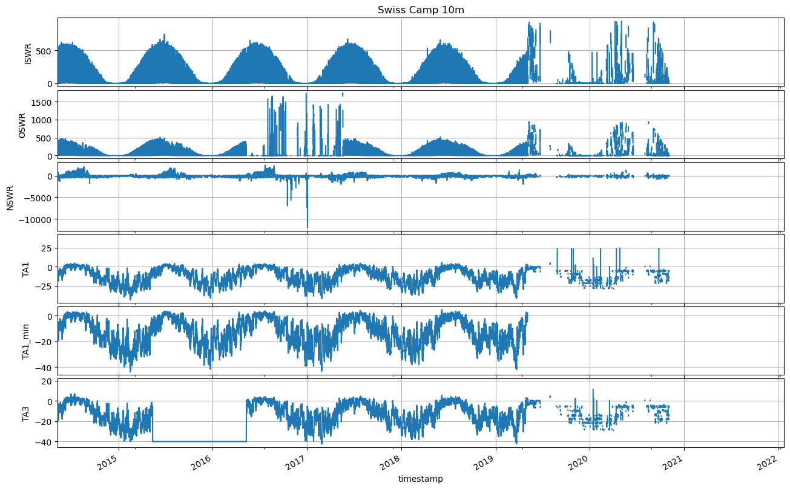
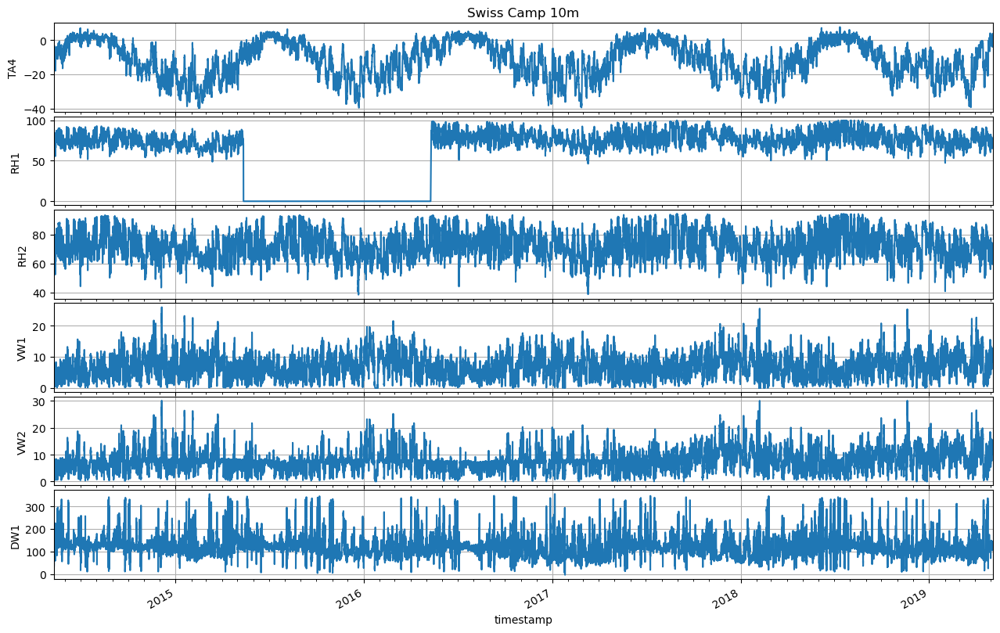

# 0 Swiss Camp 10m

# 1 Swiss Camp

# 2 Crawford Point 1

# 3 NASA-U

# 4 GITS

# 5 Humboldt

# 6 Summit

# 7 Tunu-N

# 8 DYE2

# 9 JAR1

# 10 Saddle

# 11 South Dome

# 12 NASA-E

# 13 CP2
Warning: No file for station 13 CP2
# 14 NGRIP
Warning: No file for station 14 NGRIP
# 15 NASA-SE

# 16 KAR
Warning: No file for station 16 KAR
# 17 JAR 2
Warning: No file for station 17 JAR 2
# 18 KULU
Warning: No file for station 18 KULU
# 22 Petermann ELA

