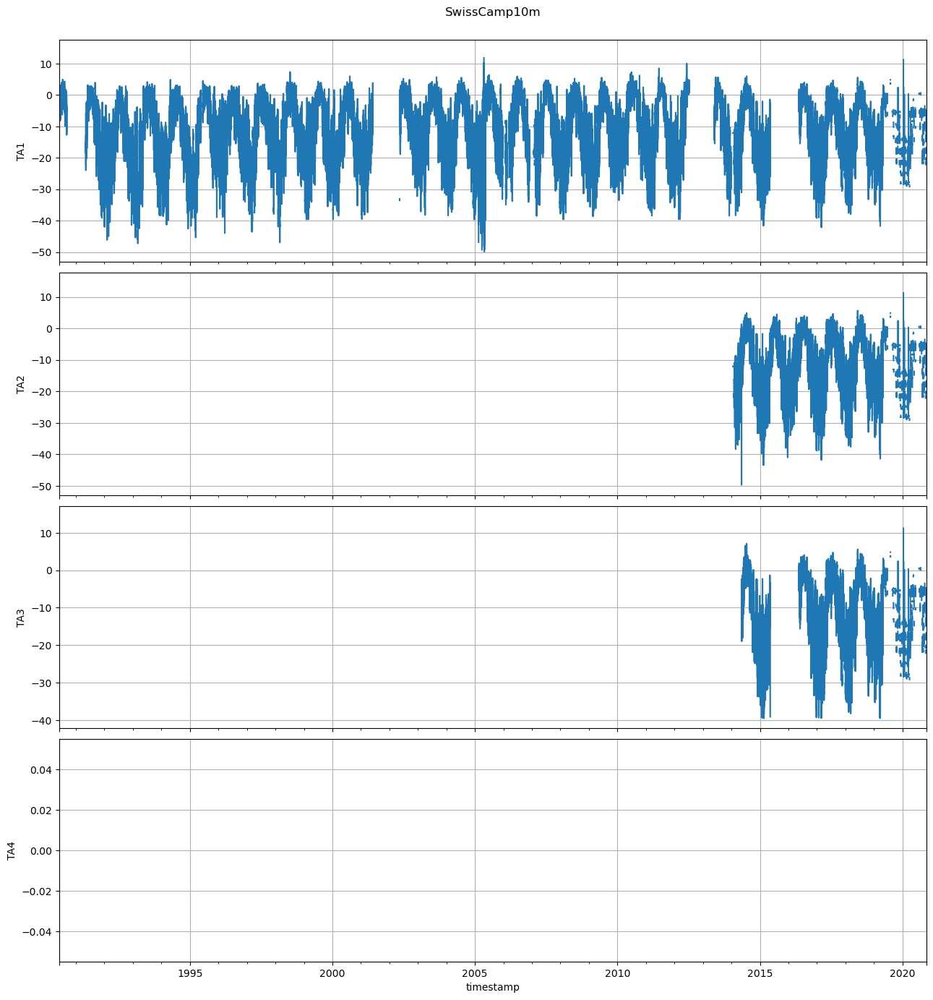
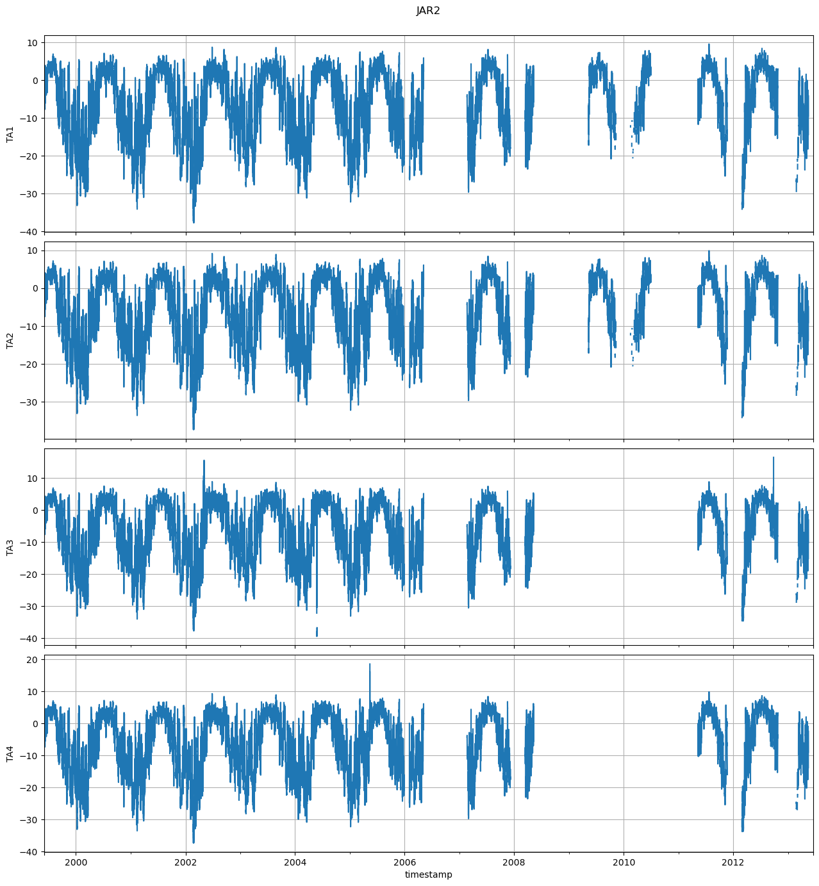
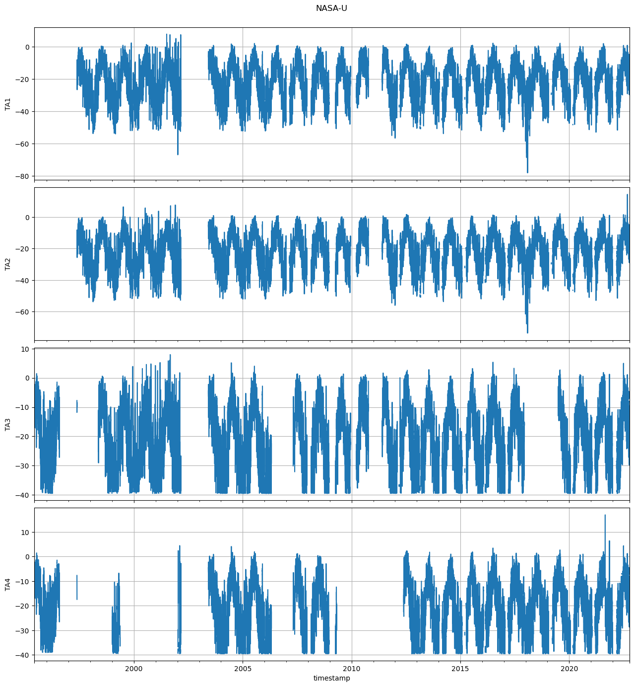
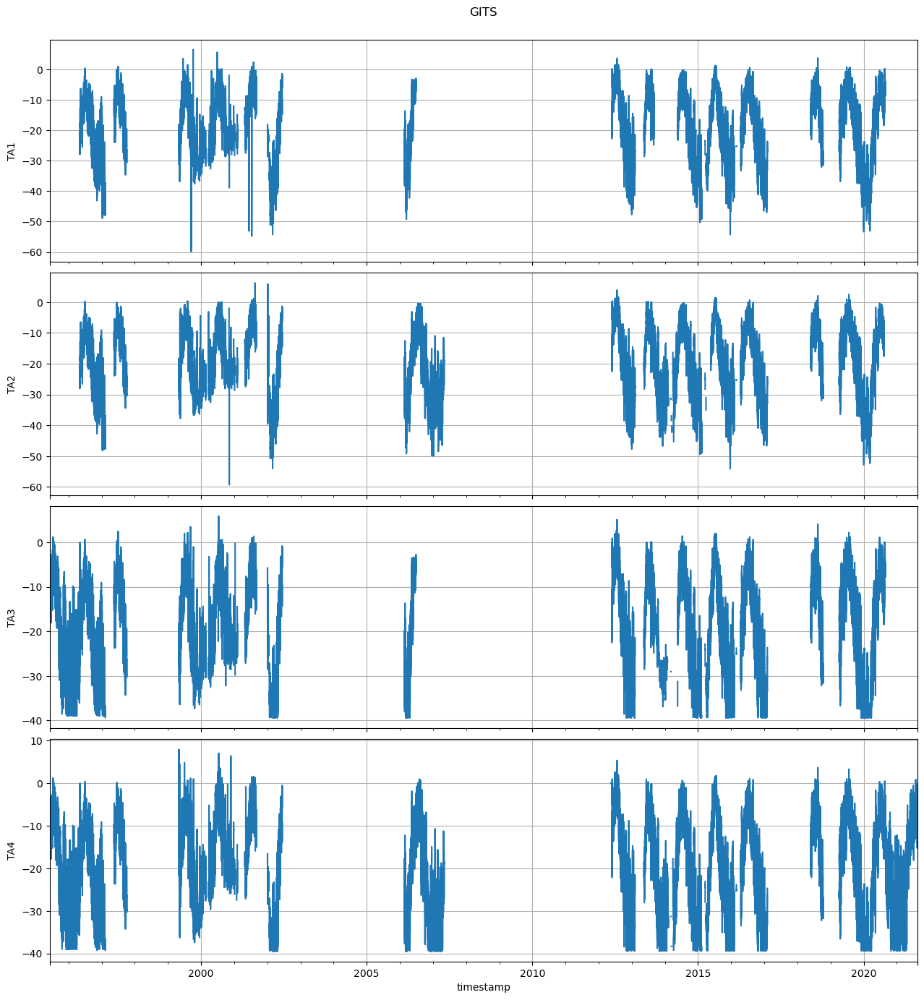
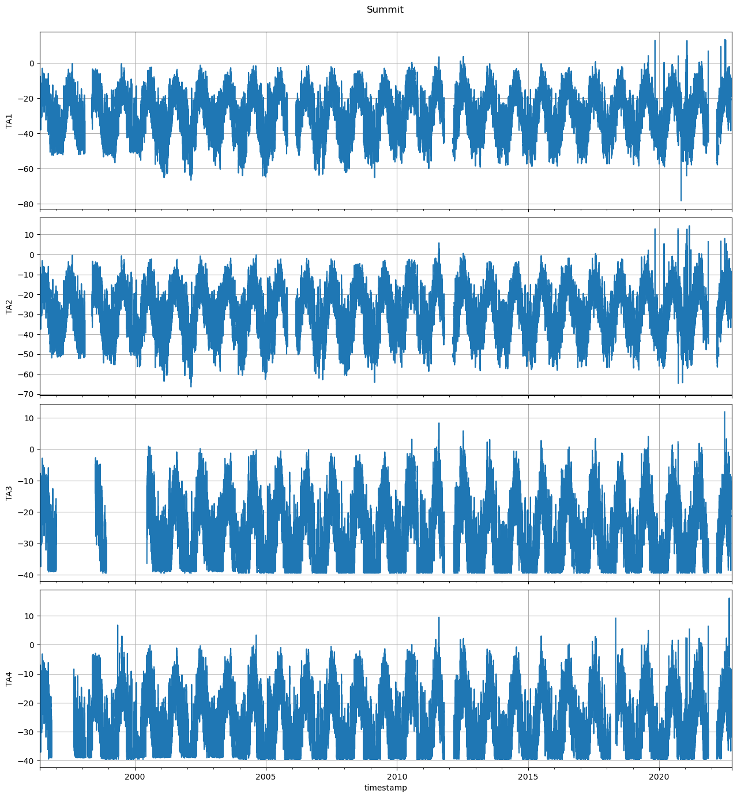
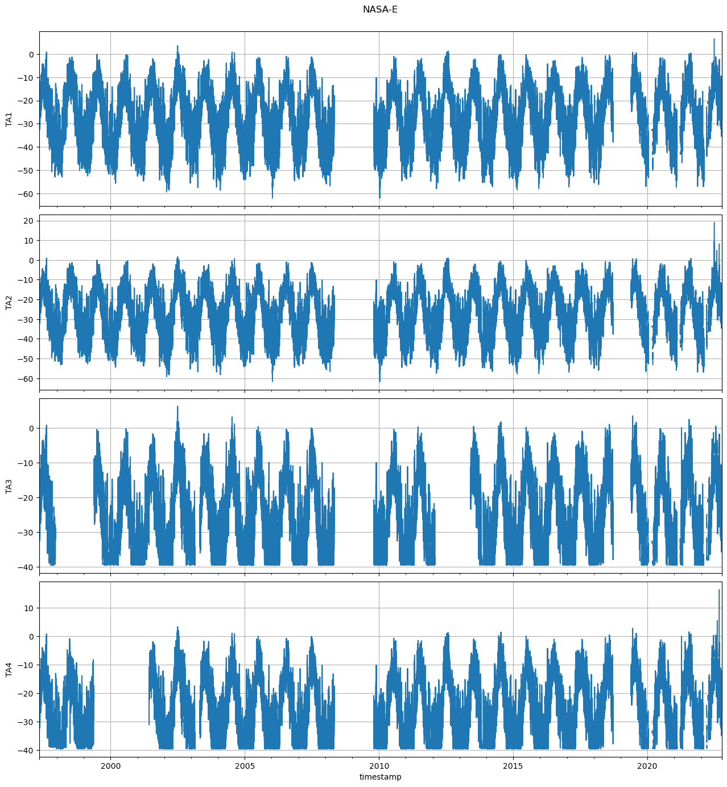
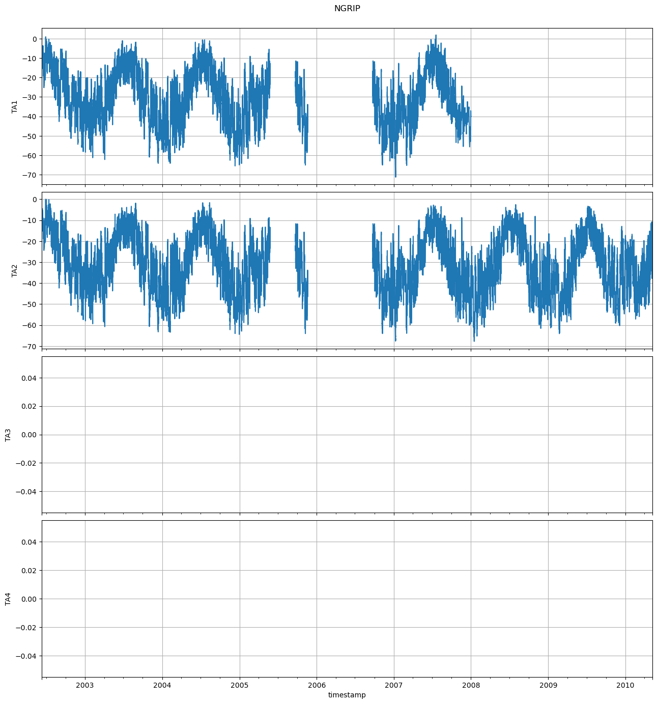
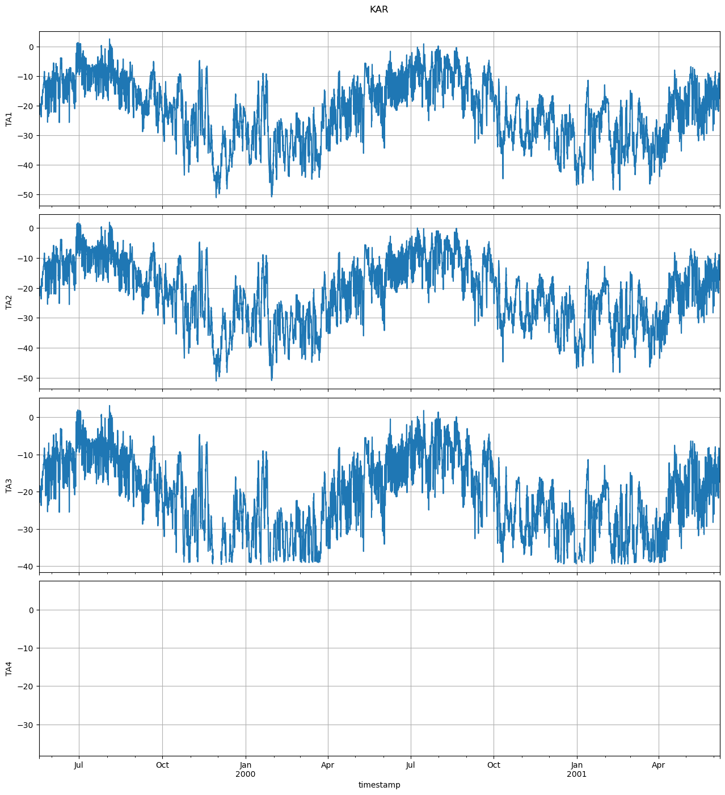
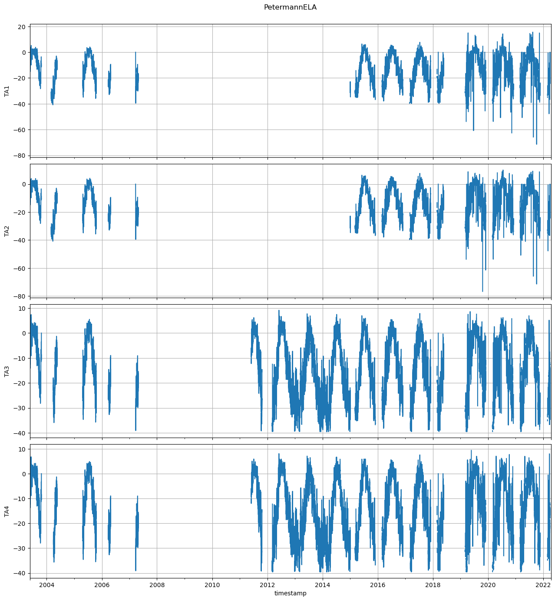
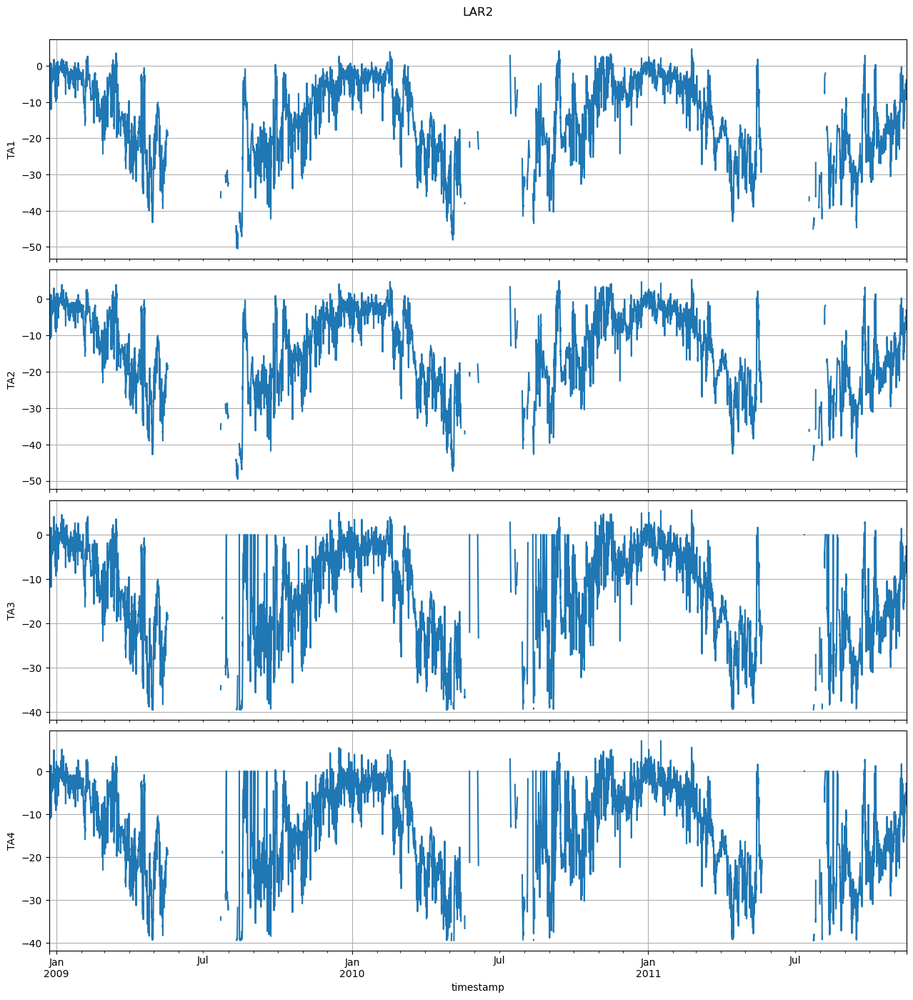

# 0 Swiss Camp 10m

# 1 Swiss Camp

# 9 JAR1

# 17 JAR2

# 19 JAR3

# 2 Crawford Point 1

# 13 CP2

# 3 NASA-U

# 4 GITS

# 5 Humboldt

# 6 Summit

# 7 Tunu-N

# 8 DYE-2

# 10 Saddle

# 11 South Dome

# 12 NASA-E

# 15 NASA-SE

# 14 NGRIP

# 23 NEEM

# 24 EastGRIP

# 16 KAR

# 18 KULU

# 20 Aurora

# 21 Petermann Glacier

# 22 Petermann ELA

# 33 SMS-PET

# 25 SMS1

# 26 SMS2

# 27 SMS3

# 28 SMS4

# 29 SMS5

# 30 LAR1

# 31 LAR2

# 32 LAR3
