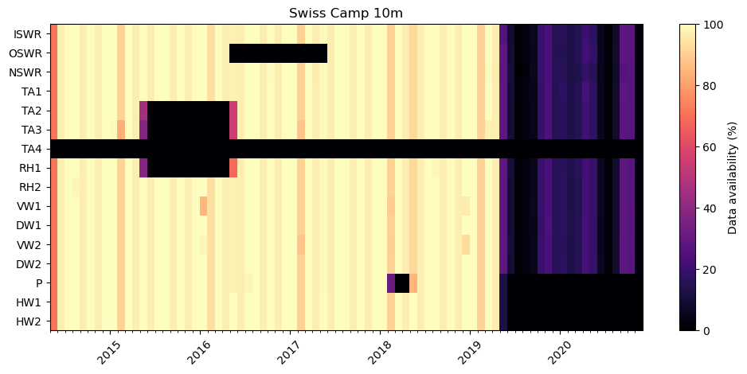
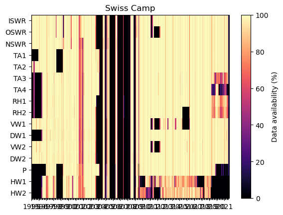
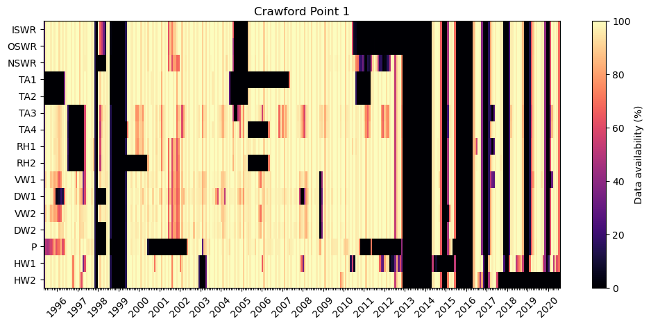
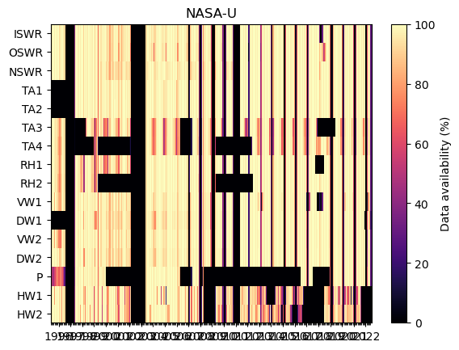

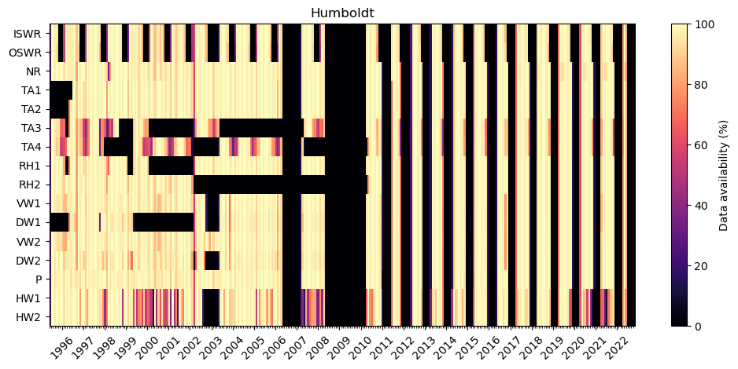
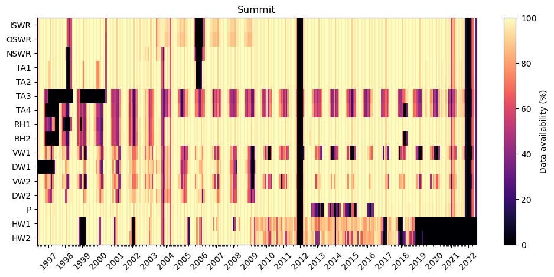
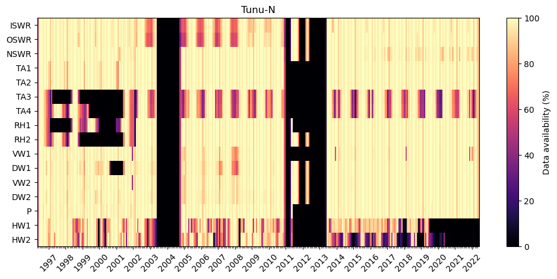
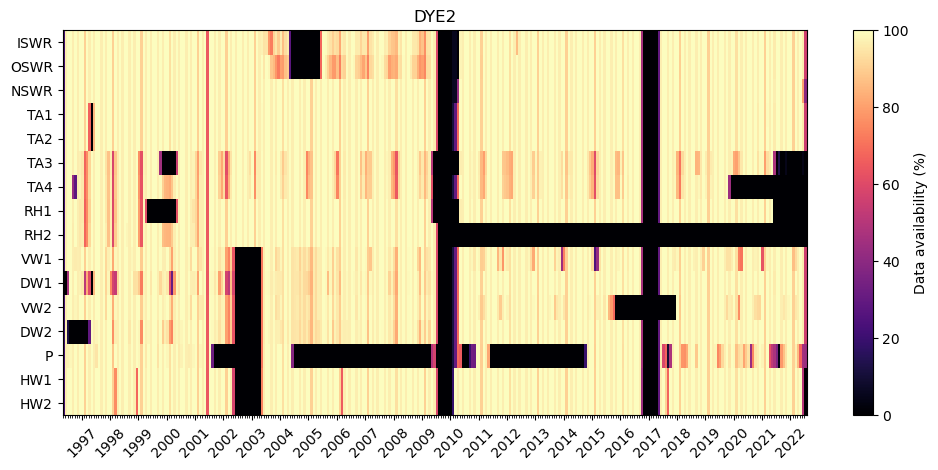
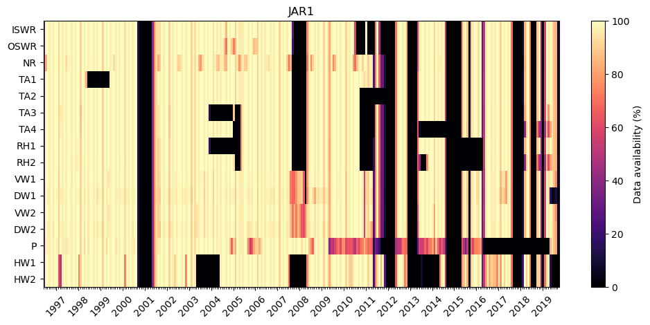
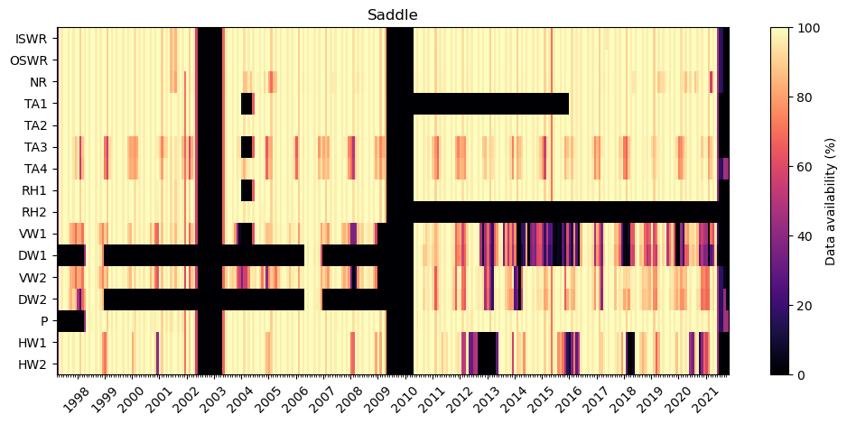
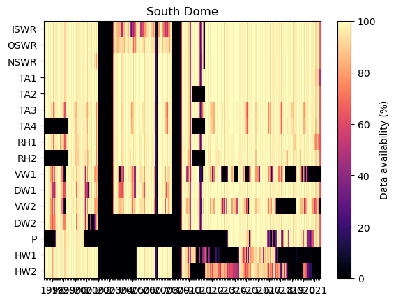
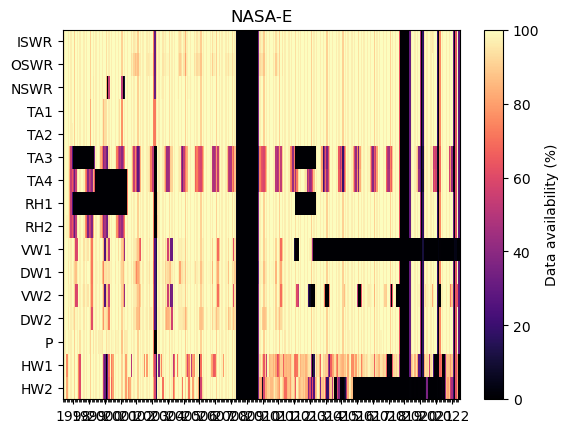
Warning: No file for station 13 CP2
Warning: No file for station 14 NGRIP
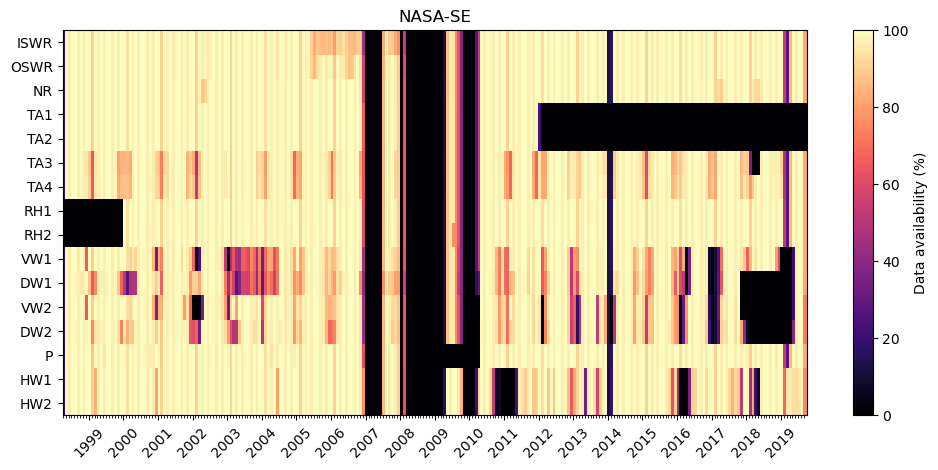
Warning: No file for station 16 KAR
Warning: No file for station 17 JAR 2
Warning: No file for station 18 KULU
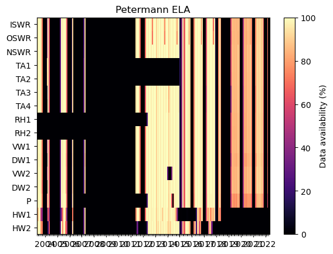
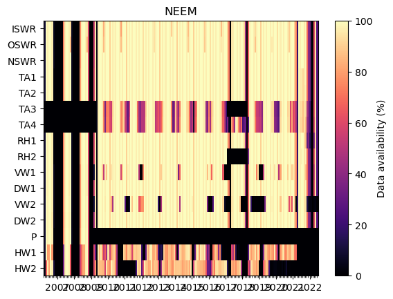
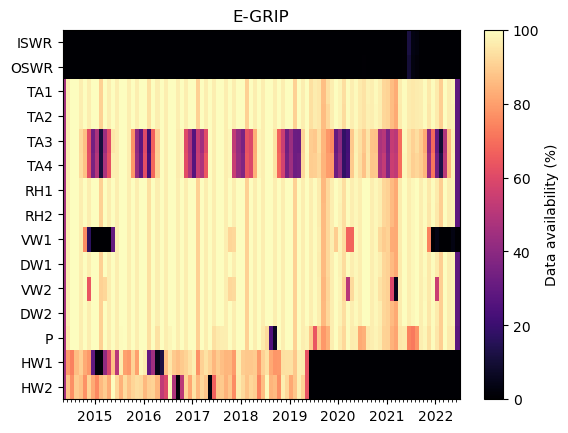