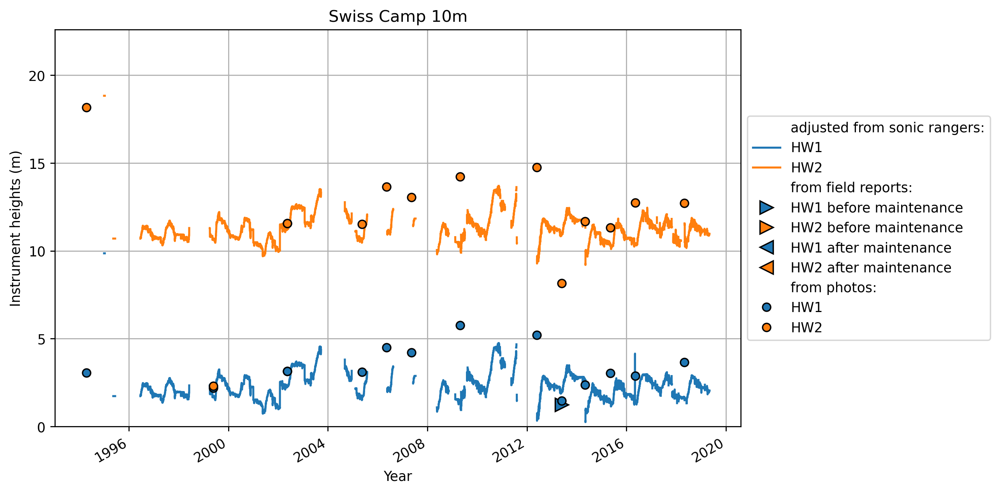
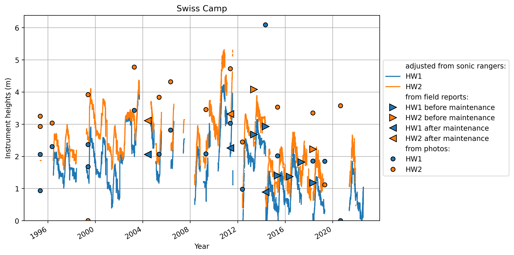
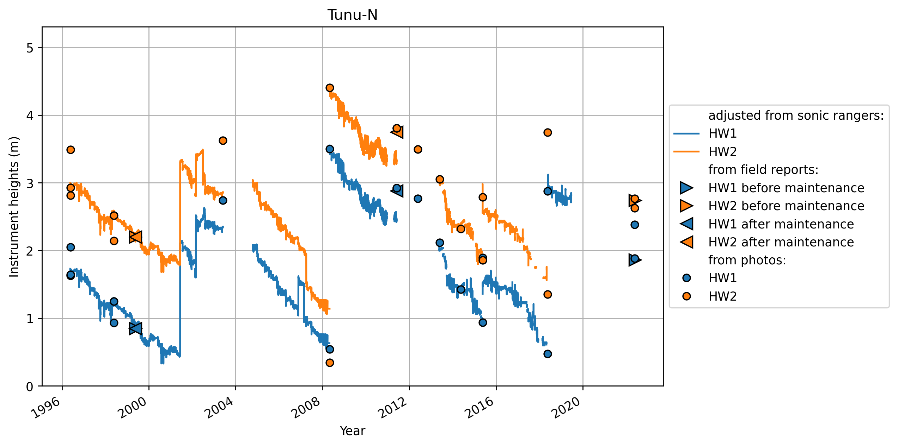
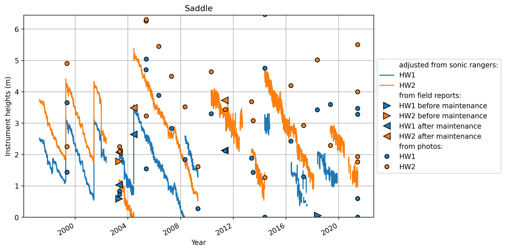
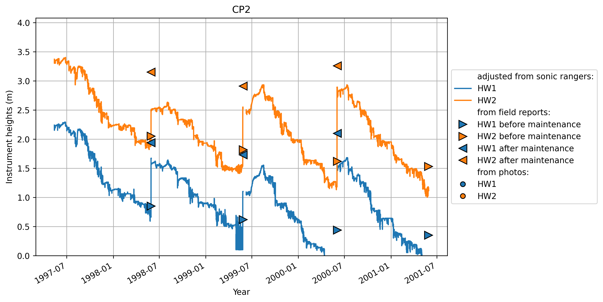
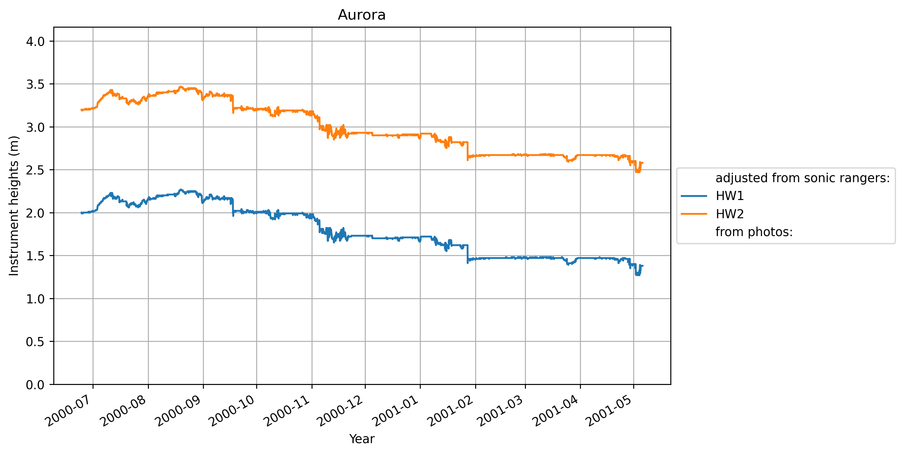
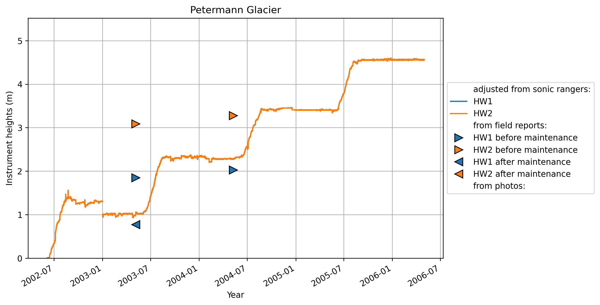
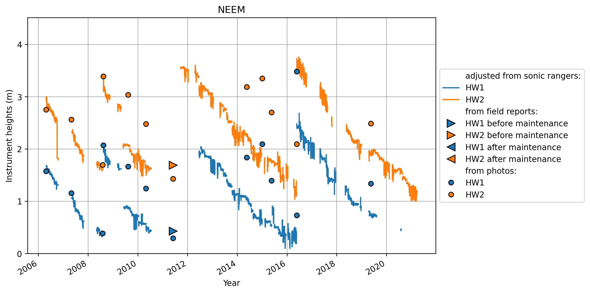
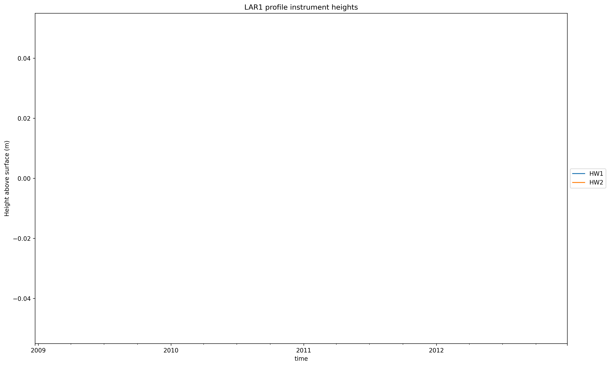

# 0 Swiss Camp 10m

# 1 Swiss Camp

# 2 Crawford Point 1

# 3 NASA-U

# 4 GITS

# 5 Humboldt

# 6 Summit

# 7 Tunu-N

# 8 DYE2

# 9 JAR1

# 10 Saddle

# 11 South Dome

# 12 NASA-E

# 13 CP2

# 14 NGRIP

# 15 NASA-SE

# 16 KAR
no intrument height reported at  KAR

# 17 JAR2

# 18 KULU
no intrument height reported at  KULU

# 19 JAR3
no intrument height reported at  JAR3

# 20 Aurora
no intrument height reported at  Aurora

# 21 Petermann Glacier

# 22 Petermann ELA
no intrument height reported at  Petermann ELA

# 23 NEEM
no intrument height reported at  NEEM

# 24 E-GRIP
no intrument height reported at  E-GRIP

# 30 LAR1
no intrument height reported at  LAR1

# 31 LAR2
no intrument height reported at  LAR2

# 32 LAR3
no intrument height reported at  LAR3
