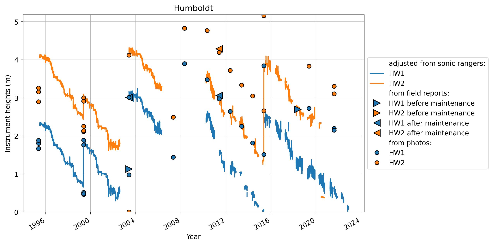
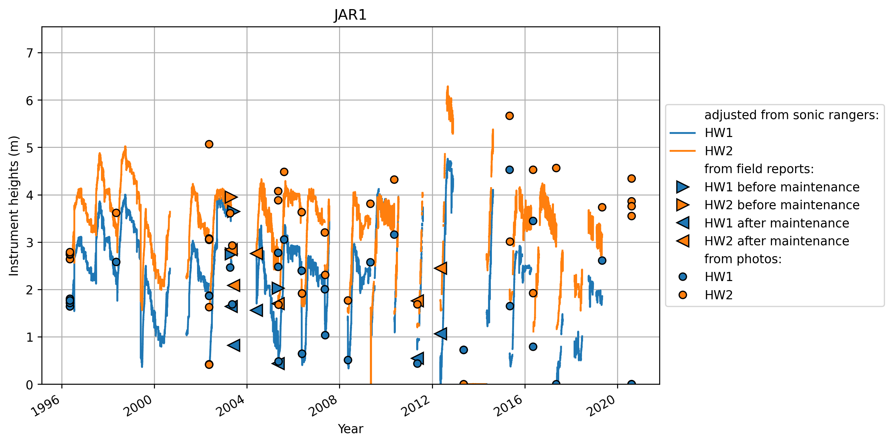
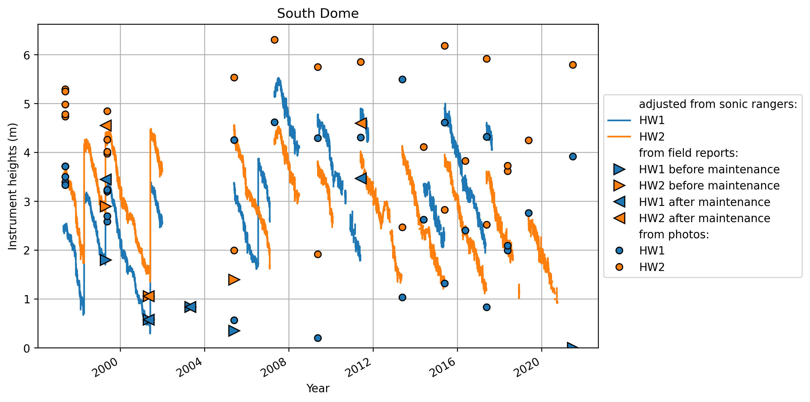
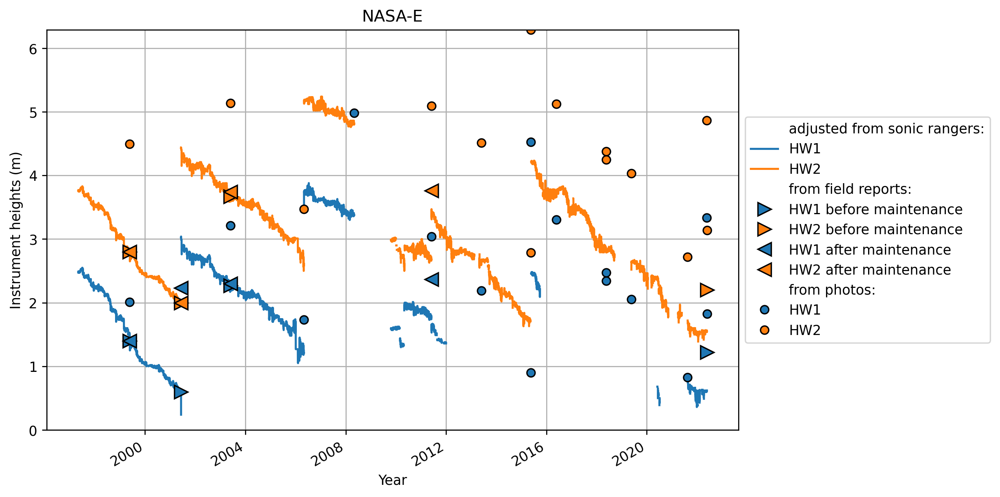
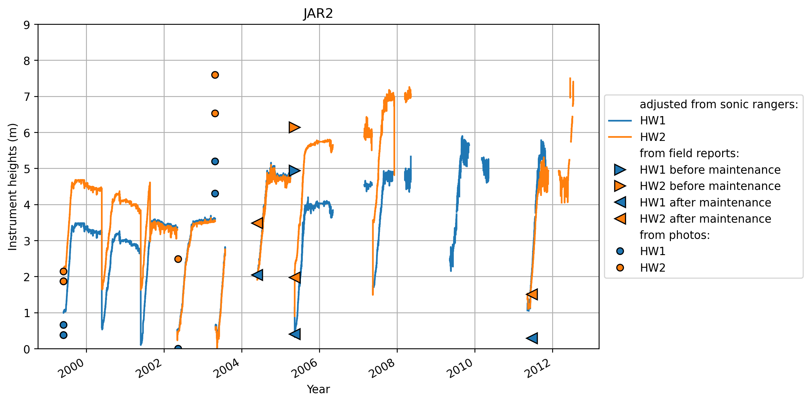
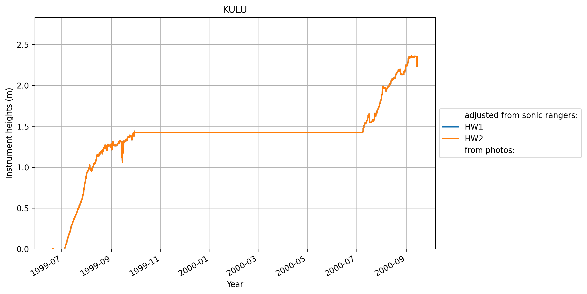
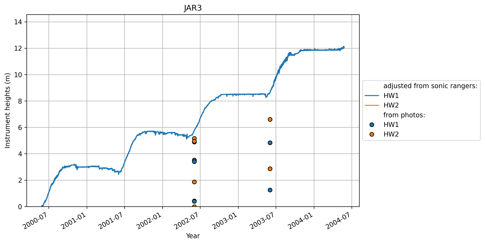
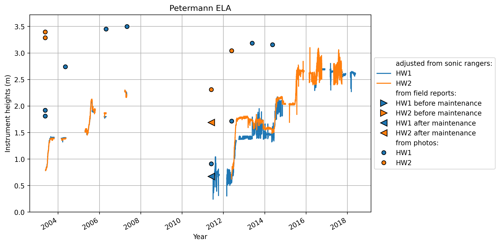

* [0 Swiss Camp 10m](#s1)
* [1 Swiss Camp](#s2)
* [2 Crawford Point 1](#s3)
* [3 NASA-U](#s4)
* [4 GITS](#s5)
* [5 Humboldt](#s6)
* [6 Summit](#s7)
* [7 Tunu-N](#s8)
* [8 DYE2](#s9)
* [9 JAR1](#s10)
* [10 Saddle](#s11)
* [11 South Dome](#s12)
* [12 NASA-E](#s13)
* [13 CP2](#s14)
* [14 NGRIP](#s15)
* [15 NASA-SE](#s16)
* [16 KAR](#s17)
* [17 JAR2](#s18)
* [18 KULU](#s19)
* [19 JAR3](#s20)
* [20 Aurora](#s21)
* [21 Petermann Glacier](#s22)
* [22 Petermann ELA](#s23)
* [23 NEEM](#s24)
* [24 E-GRIP](#s25)
* [30 LAR1](#s26)
* [31 LAR2](#s27)
* [32 LAR3](#s28)
# <a id='s1' />0 Swiss Camp 10m

# <a id='s2' />1 Swiss Camp

# <a id='s3' />2 Crawford Point 1

# <a id='s4' />3 NASA-U

# <a id='s5' />4 GITS

# <a id='s6' />5 Humboldt

# <a id='s7' />6 Summit

# <a id='s8' />7 Tunu-N

# <a id='s9' />8 DYE2

# <a id='s10' />9 JAR1

# <a id='s11' />10 Saddle

# <a id='s12' />11 South Dome

# <a id='s13' />12 NASA-E

# <a id='s14' />13 CP2

# <a id='s15' />14 NGRIP

# <a id='s16' />15 NASA-SE

# <a id='s17' />16 KAR
no intrument height reported at  KAR

# <a id='s18' />17 JAR2

# <a id='s19' />18 KULU
no intrument height reported at  KULU

# <a id='s20' />19 JAR3
no intrument height reported at  JAR3

# <a id='s21' />20 Aurora
no intrument height reported at  Aurora

# <a id='s22' />21 Petermann Glacier

# <a id='s23' />22 Petermann ELA
no intrument height reported at  Petermann ELA

# <a id='s24' />23 NEEM
no intrument height reported at  NEEM

# <a id='s25' />24 E-GRIP
no intrument height reported at  E-GRIP

# <a id='s26' />30 LAR1
no intrument height reported at  LAR1

# <a id='s27' />31 LAR2
no intrument height reported at  LAR2

# <a id='s28' />32 LAR3
no intrument height reported at  LAR3
