# 0 Swiss Camp 10m
## Manual flagging of data at Swiss Camp 10m
Flagging data:
|start time|end time|variable|
|-|-|-|
|1997-05-22 00:00:00+00:00|1998-05-22 00:00:00+00:00|OSWR|
|2001-06-03 00:00:00+00:00|2002-05-11 00:00:00+00:00|ISWR|
|2001-06-03 00:00:00+00:00|2002-05-11 00:00:00+00:00|OSWR|
|2001-06-03 00:00:00+00:00|2002-05-11 00:00:00+00:00|TA1|
|2001-06-03 00:00:00+00:00|2002-05-11 00:00:00+00:00|TA2|
|2001-06-03 00:00:00+00:00|2002-05-11 00:00:00+00:00|DW1|
|2001-06-03 00:00:00+00:00|2002-05-11 00:00:00+00:00|DW2|
|2011-01-01 00:00:00+00:00|2012-12-31 00:00:00+00:00|DW2|
|2001-06-03 00:00:00+00:00|2002-05-11 00:00:00+00:00|VW1|
|2001-06-03 00:00:00+00:00|2002-05-11 00:00:00+00:00|RH1|
|2001-06-03 00:00:00+00:00|2002-05-11 00:00:00+00:00|RH2|
|2005-02-04 00:00:00+00:00|2005-05-15 00:00:00+00:00|RH1|
|2016-05-01 00:00:00+00:00|2017-06-01 00:00:00+00:00|OSWR|
|2015-05-15 00:00:00+00:00|2016-05-15 00:00:00+00:00|TA3|
|2015-05-15 00:00:00+00:00|2016-05-15 00:00:00+00:00|TA1|
|2018-02-15 00:00:00+00:00|2018-05-05 00:00:00+00:00|P|
|2017-08-21 00:00:00+00:00|2018-05-05 00:00:00+00:00|HW2|
|2012-07-11 00:00:00+00:00|2013-05-26 00:00:00+00:00|TA1|
|2012-07-11 00:00:00+00:00|2013-05-26 00:00:00+00:00|TA2|
|2012-07-11 00:00:00+00:00|2013-05-26 00:00:00+00:00|TA3|
|2012-07-11 00:00:00+00:00|2013-05-26 00:00:00+00:00|TA4|
|2012-07-11 00:00:00+00:00|2013-05-26 00:00:00+00:00|RH1|
|2012-07-11 00:00:00+00:00|2013-05-26 00:00:00+00:00|RH2|
|2012-07-11 00:00:00+00:00|2013-05-26 00:00:00+00:00|VW1|
|2012-07-11 00:00:00+00:00|2013-05-26 00:00:00+00:00|VW2|
|2012-07-11 00:00:00+00:00|2013-05-26 00:00:00+00:00|DW1|
|2012-07-11 00:00:00+00:00|2013-05-26 00:00:00+00:00|DW2|
|2012-07-11 00:00:00+00:00|2013-05-26 00:00:00+00:00|ISWR|
|2012-07-11 00:00:00+00:00|2013-05-26 00:00:00+00:00|OSWR|
|2012-07-11 00:00:00+00:00|2013-05-26 00:00:00+00:00|NR|
|2012-07-11 00:00:00+00:00|2013-05-26 00:00:00+00:00|HW1|
|2012-07-11 00:00:00+00:00|2013-05-26 00:00:00+00:00|HW2|
## Adjusting data at Swiss Camp 10m
### Adjusting DW1
|start time|end time|operation|value|number of removed samples|
|-|-|-|-|-|
|1998-05-01 00:00:00+00:00|2002-01-01 00:00:00+00:00|rotate|-100.0|0|
 
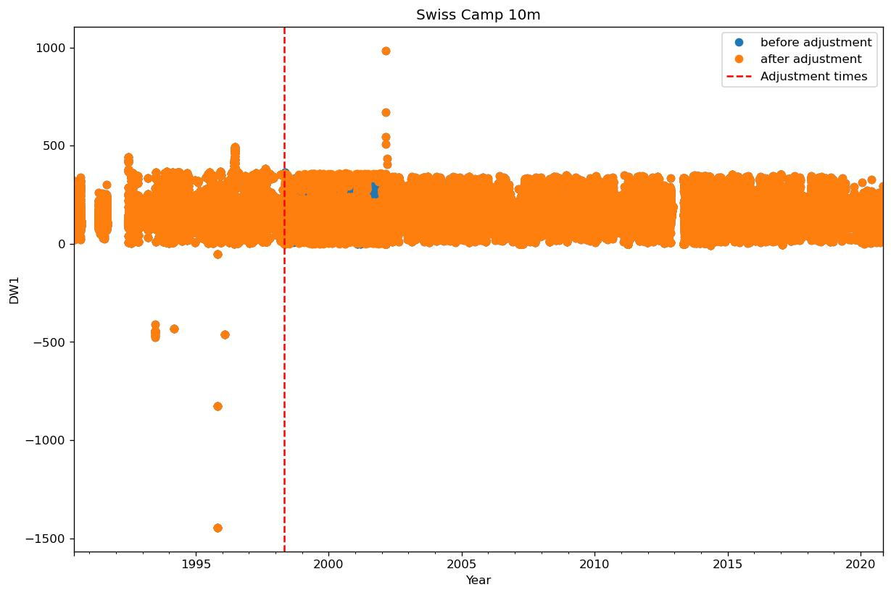
 
### Adjusting DW2
|start time|end time|operation|value|number of removed samples|
|-|-|-|-|-|
|1998-05-01 00:00:00+00:00|2002-01-01 00:00:00+00:00|rotate|-100.0|0|
 

 
### Adjusting HW1
|start time|end time|operation|value|number of removed samples|
|-|-|-|-|-|
|2014-01-01 00:00:00+00:00|2020-11-03 21:00:00+00:00|air_temp_sonic_correction|0.0|0|
|2014-01-01 00:00:00+00:00|2020-11-03 21:00:00+00:00|biweekly_upper_range_filter|0.5|2602|
|2014-01-01 00:00:00+00:00|2020-11-03 21:00:00+00:00|hampel_filter|2.0|3797|
 
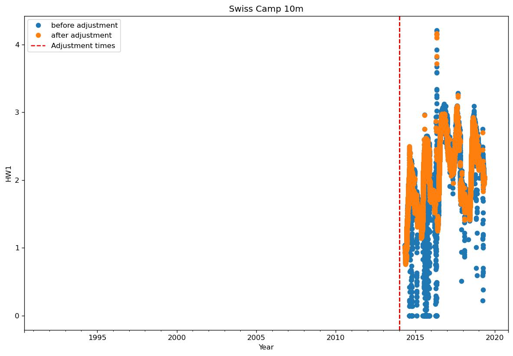
 
### Adjusting HW2
|start time|end time|operation|value|number of removed samples|
|-|-|-|-|-|
|2014-01-01 00:00:00+00:00|2020-11-03 21:00:00+00:00|air_temp_sonic_correction|0.0|0|
|2014-01-01 00:00:00+00:00|2020-11-03 21:00:00+00:00|biweekly_upper_range_filter|0.5|8516|
|2014-01-01 00:00:00+00:00|2020-11-03 21:00:00+00:00|hampel_filter|2.0|2730|
|2014-05-09 21:00:00+00:00|2020-11-03 21:00:00+00:00|add|9.0|0|
 
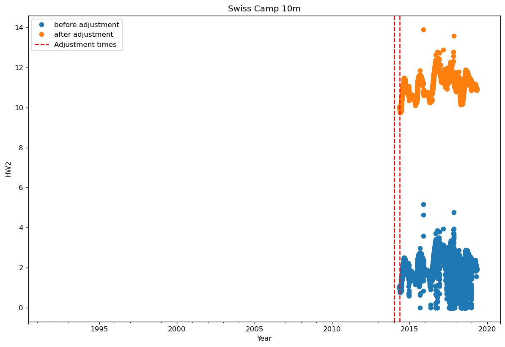
 
### Adjusting P
|start time|end time|operation|value|number of removed samples|
|-|-|-|-|-|
|2014-01-01 00:00:00+00:00|2019-05-05 00:00:00+00:00|add|-96.5|0|
 
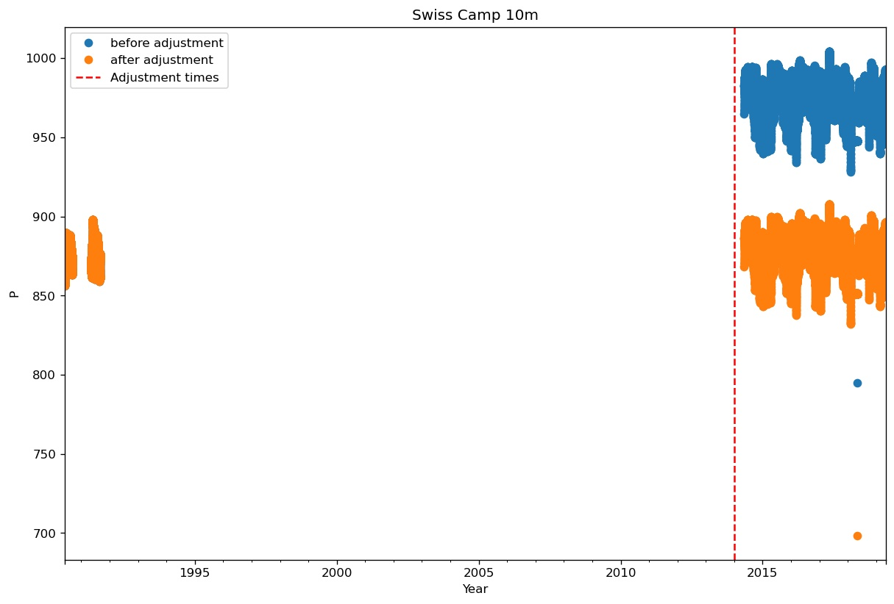
 
### Adjusting RH1
|start time|end time|operation|value|number of removed samples|
|-|-|-|-|-|
|1990-06-01 01:00:00+00:00|2005-01-01 00:00:00+00:00|swap_with_RH2|0.0|38279|
 
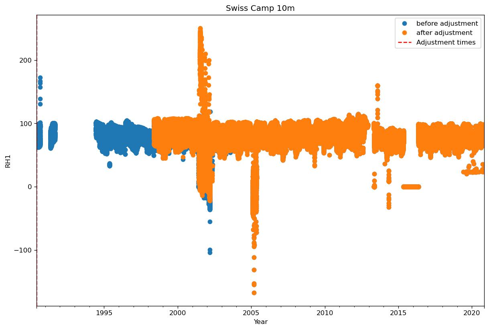
 
### Adjusting TA1
|start time|end time|operation|value|number of removed samples|
|-|-|-|-|-|
|2014-01-01 00:00:00+00:00|2020-11-03 21:00:00+00:00|swap_with_TA2|0.0|0|
 
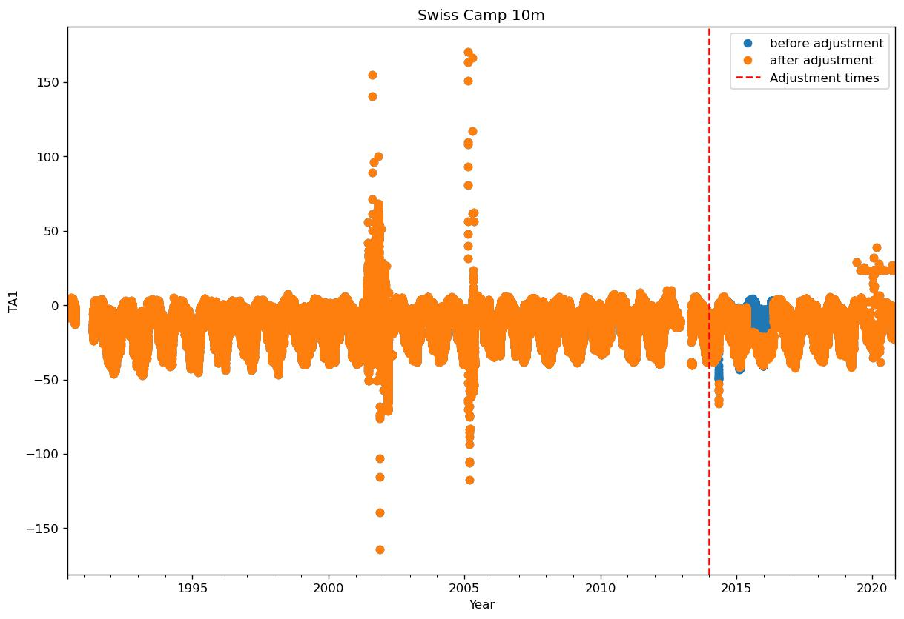
 
# 1 Swiss Camp
## Manual flagging of data at Swiss Camp
Flagging data:
|start time|end time|variable|
|-|-|-|
|2015-06-01 00:00:00+00:00|2016-05-01 00:00:00+00:00|RH1|
|2009-07-01 00:00:00+00:00|2009-07-01 00:00:00+00:00|ISWR|
|2009-07-01 00:00:00+00:00|2009-07-01 00:00:00+00:00|OSWR|
|2011-02-15 00:00:00+00:00|2011-05-10 00:00:00+00:00|OSWR|
|2011-08-01 00:00:00+00:00|2012-05-10 00:00:00+00:00|OSWR|
|2011-02-15 00:00:00+00:00|2011-05-10 00:00:00+00:00|ISWR|
|2015-06-01 00:00:00+00:00|2016-05-01 00:00:00+00:00|VW1|
Warning: HS1 not found
Warning: HS1 not found
Warning: HS2 not found
Warning: HS2 not found
Warning: HS1 not found
|1995-01-01 00:00:00+00:00|1996-06-23 00:00:00+00:00|HW1|
|1998-06-04 00:00:00+00:00|1999-04-02 00:00:00+00:00|HW1|
|2017-07-29 00:00:00+00:00|2018-04-28 00:00:00+00:00|HW1|
|2011-08-14 00:00:00+00:00|2012-05-24 00:00:00+00:00|HW2|
|2011-08-14 00:00:00+00:00|2012-05-24 00:00:00+00:00|HW1|
|2003-09-21 00:00:00+00:00|2004-05-01 00:00:00+00:00|TA1|
|2003-09-21 00:00:00+00:00|2004-05-01 00:00:00+00:00|TA2|
|2003-09-21 00:00:00+00:00|2004-05-01 00:00:00+00:00|TA3|
|2003-09-21 00:00:00+00:00|2004-05-01 00:00:00+00:00|TA4|
|2020-09-21 00:00:00+00:00|2022-08-03 19:00:00+00:00|TA4|
## Adjusting data at Swiss Camp
### Adjusting HW1
|start time|end time|operation|value|number of removed samples|
|-|-|-|-|-|
|1996-01-01 00:00:00+00:00|1996-08-01 00:00:00+00:00|air_temp_sonic_anticorrection|0.0|0|
|2009-01-01 00:00:00+00:00|2011-07-15 00:00:00+00:00|min_filter|1.0|7677|
|2009-05-01 00:00:00+00:00|2022-08-03 19:00:00+00:00|add|-0.5|0|
|2009-05-15 00:00:00+00:00|2022-08-03 19:00:00+00:00|air_temp_sonic_correction|0.0|0|
|2009-05-15 00:00:00+00:00|2022-08-03 19:00:00+00:00|biweekly_upper_range_filter|0.5|5337|
|2009-05-15 00:00:00+00:00|2022-08-03 19:00:00+00:00|hampel_filter|2.0|706|
 
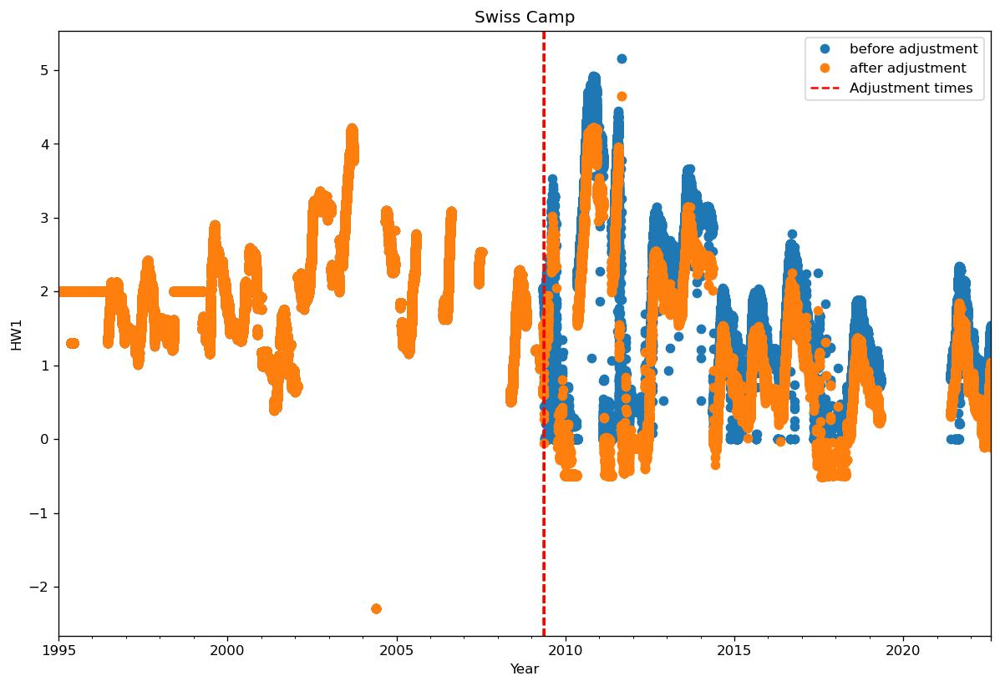
 
### Adjusting HW2
|start time|end time|operation|value|number of removed samples|
|-|-|-|-|-|
|1995-01-12 00:00:00+00:00|2000-01-01 00:00:00+00:00|max_filter|8.0|19148|
|1996-01-01 00:00:00+00:00|1996-08-01 00:00:00+00:00|air_temp_sonic_anticorrection|0.0|0|
|2009-01-01 00:00:00+00:00|2012-01-15 00:00:00+00:00|min_filter|1.0|2949|
|2009-05-01 00:00:00+00:00|2022-08-03 19:00:00+00:00|add|0.3|0|
|2009-05-15 00:00:00+00:00|2022-08-03 19:00:00+00:00|air_temp_sonic_correction|0.0|0|
|2009-05-15 00:00:00+00:00|2022-08-03 19:00:00+00:00|biweekly_upper_range_filter|0.5|12071|
|2009-05-15 00:00:00+00:00|2022-08-03 19:00:00+00:00|hampel_filter|2.0|3607|
|2018-03-12 00:00:00+00:00|2018-05-12 00:00:00+00:00|max_filter|0.77|430|
 
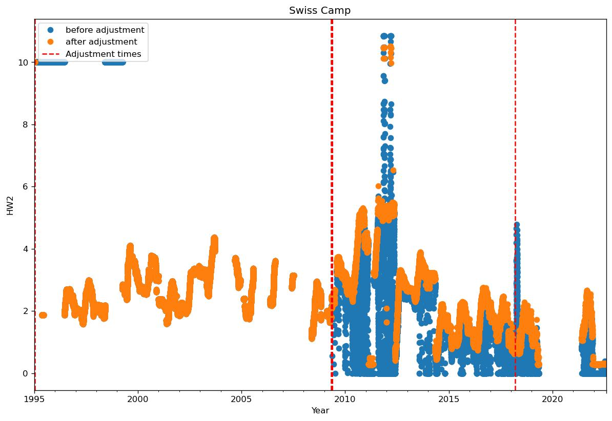
 
### Adjusting ISWR
|start time|end time|operation|value|number of removed samples|
|-|-|-|-|-|
|2012-05-10 00:00:00+00:00|2022-08-03 19:00:00+00:00|swap_with_OSWR|0.0|0|
 
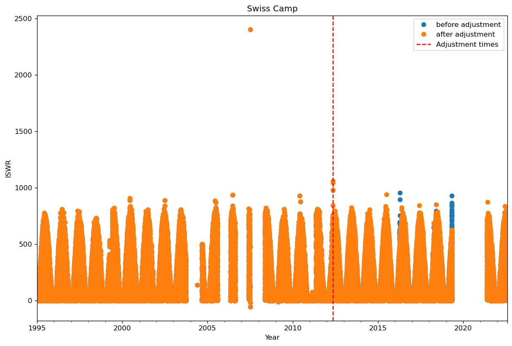
 
### Adjusting OSWR
|start time|end time|operation|value|number of removed samples|
|-|-|-|-|-|
|2009-05-07 00:00:00+00:00|2022-08-03 19:00:00+00:00|multiply|0.934|0|
 
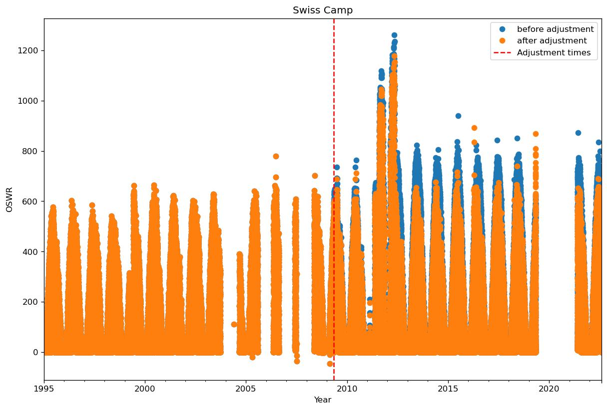
 
### Adjusting P
|start time|end time|operation|value|number of removed samples|
|-|-|-|-|-|
|2019-11-15 00:00:00+00:00|2022-08-03 19:00:00+00:00|min_filter|856.0|5228|
 
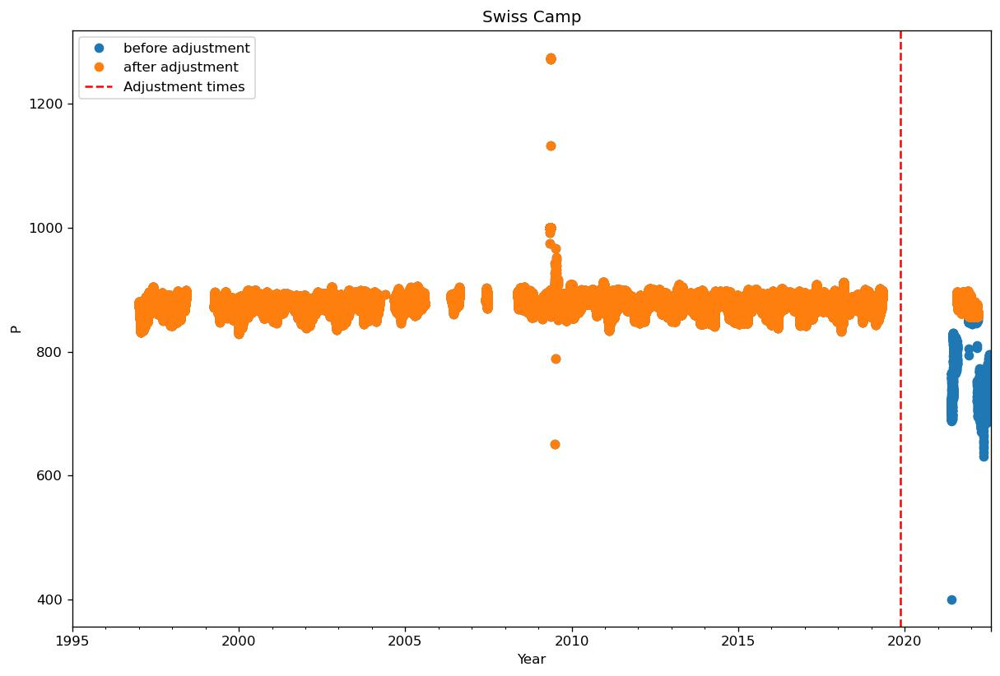
 
### Adjusting RH1
|start time|end time|operation|value|number of removed samples|
|-|-|-|-|-|
|2005-05-09 00:00:00+00:00|2022-08-03 19:00:00+00:00|swap_with_RH2|0.0|0|
|1996-01-01 00:00:00+00:00|2011-01-01 00:00:00+00:00|ice_to_water|0.0|0|
 
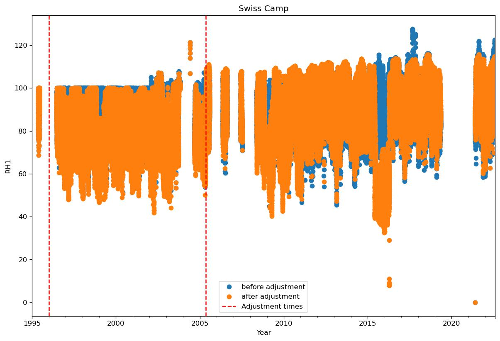
 
### Adjusting RH2
|start time|end time|operation|value|number of removed samples|
|-|-|-|-|-|
|1996-01-01 00:00:00+00:00|2011-01-01 00:00:00+00:00|ice_to_water|0.0|0|
 
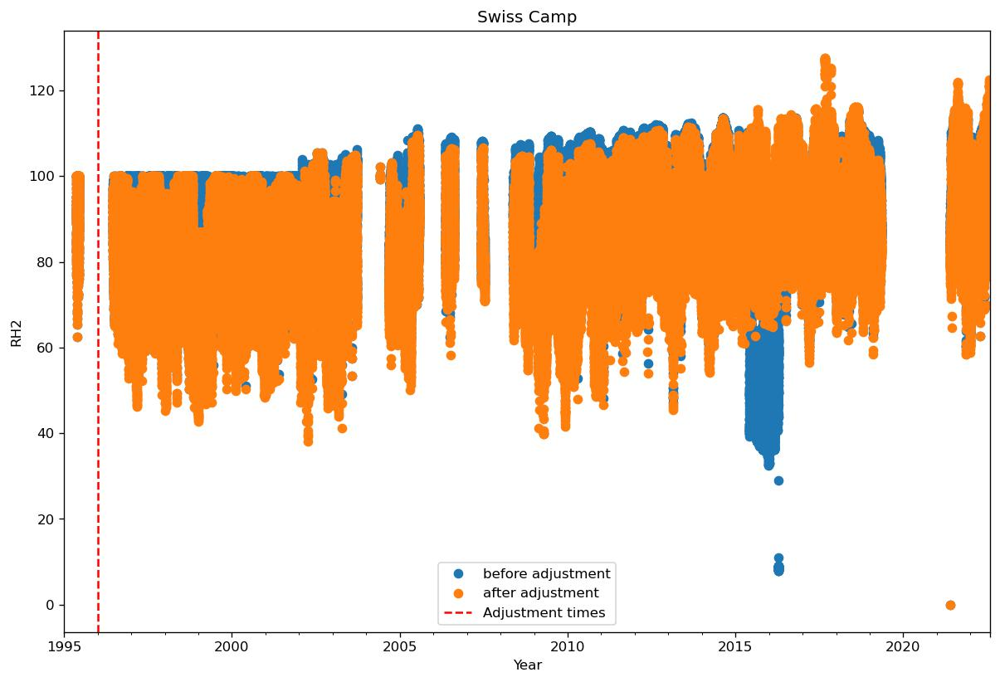
 
### Adjusting HS1
|start time|end time|operation|value|number of removed samples|
|-|-|-|-|-|
|1999-01-01 00:00:00+00:00|2022-08-03 19:00:00+00:00|add|-0.75|0|
|2000-12-31 00:00:00+00:00|2022-08-03 19:00:00+00:00|add|-0.7|0|
|2001-05-17 00:00:00+00:00|2022-08-03 19:00:00+00:00|add|-0.3|0|
|2002-01-25 19:30:00+00:00|2022-08-03 19:00:00+00:00|add|1.5|0|
|2003-01-19 00:00:00+00:00|2022-08-03 19:00:00+00:00|add|-0.6|0|
|2003-04-27 00:00:00+00:00|2022-08-03 19:00:00+00:00|add|0.4|0|
|2004-01-01 00:00:00+00:00|2022-08-03 19:00:00+00:00|add|-0.5|0|
|2011-08-01 00:00:00+00:00|2022-08-03 19:00:00+00:00|add|-3.0|0|
|2014-05-08 00:00:00+00:00|2022-08-03 19:00:00+00:00|add|-2.0|0|
 
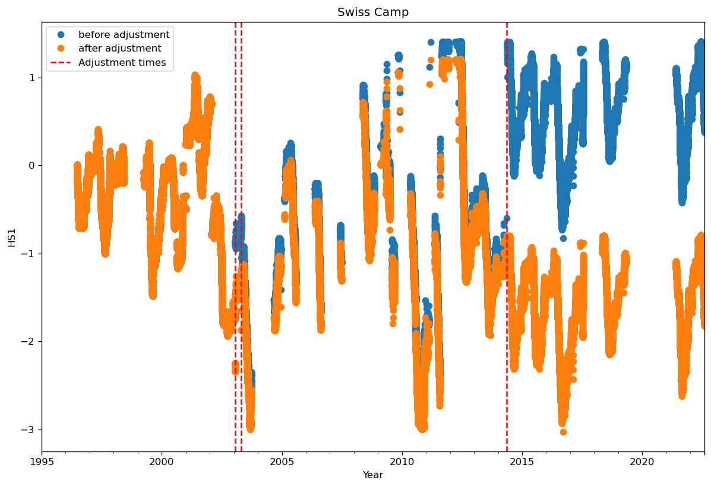
 
### Adjusting HS2
|start time|end time|operation|value|number of removed samples|
|-|-|-|-|-|
|2000-12-31 00:00:00+00:00|2022-08-03 19:00:00+00:00|add|-0.8|0|
|2001-05-17 00:00:00+00:00|2022-08-03 19:00:00+00:00|add|-0.3|0|
|2011-08-01 00:00:00+00:00|2022-08-03 19:00:00+00:00|add|-3.0|0|
|2014-05-08 00:00:00+00:00|2022-08-03 19:00:00+00:00|add|-2.0|0|
 
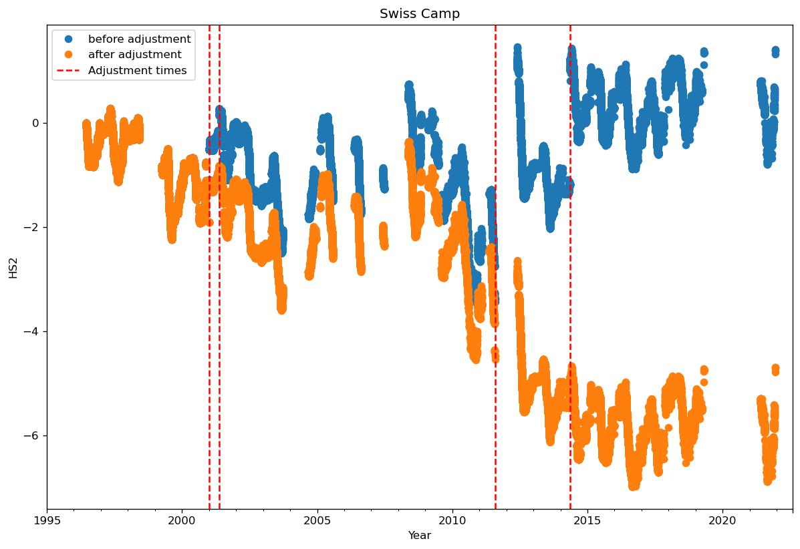
 
# 9 JAR1
## Manual flagging of data at JAR1
Flagging data:
|start time|end time|variable|
|-|-|-|
|2007-09-02 00:00:00+00:00|2008-05-08 00:00:00+00:00|TA1|
|2007-09-02 00:00:00+00:00|2008-05-08 00:00:00+00:00|TA2|
|2007-09-02 00:00:00+00:00|2008-05-08 00:00:00+00:00|TA3|
|2007-09-02 00:00:00+00:00|2008-05-08 00:00:00+00:00|TA4|
|2007-09-02 00:00:00+00:00|2008-05-08 00:00:00+00:00|RH1|
|2007-09-02 00:00:00+00:00|2008-05-08 00:00:00+00:00|RH2|
|2010-10-01 00:00:00+00:00|2011-05-04 00:00:00+00:00|RH1|
|2010-10-01 00:00:00+00:00|2011-05-04 00:00:00+00:00|RH2|
|2010-10-01 00:00:00+00:00|2012-05-04 00:00:00+00:00|TA2|
|2010-10-01 00:00:00+00:00|2011-06-05 00:00:00+00:00|TA4|
|2010-10-01 00:00:00+00:00|2011-06-05 00:00:00+00:00|TA3|
|2013-10-01 00:00:00+00:00|2014-10-05 00:00:00+00:00|TA4|
|2005-05-08 00:00:00+00:00|2005-05-08 21:00:00+00:00|HW2|
|2011-09-06 00:00:00+00:00|2012-01-30 00:00:00+00:00|HW2|
|2012-08-01 00:00:00+00:00|2012-08-13 00:00:00+00:00|HW2|
|2015-08-24 00:00:00+00:00|2015-08-30 00:00:00+00:00|HW2|
|2011-05-01 00:00:00+00:00|2011-06-01 00:00:00+00:00|HW1|
|2011-09-09 00:00:00+00:00|2012-01-01 00:00:00+00:00|HW1|
|2013-07-01 00:00:00+00:00|2013-08-01 00:00:00+00:00|HW1|
|2011-08-16 00:00:00+00:00|2012-01-01 00:00:00+00:00|ISWR|
|2011-08-16 00:00:00+00:00|2012-01-01 00:00:00+00:00|OSWR|
|2010-07-19 00:00:00+00:00|2011-05-06 00:00:00+00:00|TA1|
|2010-07-19 00:00:00+00:00|2011-05-06 00:00:00+00:00|TA2|
|2010-07-19 00:00:00+00:00|2011-05-06 00:00:00+00:00|TA3|
|2010-07-19 00:00:00+00:00|2011-05-06 00:00:00+00:00|TA4|
|2010-07-19 00:00:00+00:00|2011-05-06 00:00:00+00:00|RH1|
|2010-07-19 00:00:00+00:00|2011-05-06 00:00:00+00:00|RH2|
|2010-07-19 00:00:00+00:00|2011-05-06 00:00:00+00:00|VW1|
|2010-07-19 00:00:00+00:00|2011-05-06 00:00:00+00:00|VW2|
|2010-07-19 00:00:00+00:00|2011-05-06 00:00:00+00:00|DW1|
|2010-07-19 00:00:00+00:00|2011-05-06 00:00:00+00:00|DW2|
|2010-07-19 00:00:00+00:00|2011-05-06 00:00:00+00:00|HW1|
|2010-07-19 00:00:00+00:00|2011-05-06 00:00:00+00:00|HW2|
|2010-07-19 00:00:00+00:00|2011-05-06 00:00:00+00:00|ISWR|
|2010-07-19 00:00:00+00:00|2011-05-06 00:00:00+00:00|OSWR|
|2010-07-19 00:00:00+00:00|2011-05-06 00:00:00+00:00|NR|
|1999-06-01 00:00:00+00:00|2001-06-01 00:00:00+00:00|TS1|
|1999-06-01 00:00:00+00:00|2001-06-01 00:00:00+00:00|TS2|
|1999-06-01 00:00:00+00:00|2001-06-01 00:00:00+00:00|TS3|
|1999-06-01 00:00:00+00:00|2001-06-01 00:00:00+00:00|TS4|
|1999-06-01 00:00:00+00:00|2001-06-01 00:00:00+00:00|TS5|
|1999-06-01 00:00:00+00:00|2001-06-01 00:00:00+00:00|TS6|
|1999-06-01 00:00:00+00:00|2001-06-01 00:00:00+00:00|TS7|
|1999-06-01 00:00:00+00:00|2001-06-01 00:00:00+00:00|TS8|
|1999-06-01 00:00:00+00:00|2001-06-01 00:00:00+00:00|TS9|
|1999-06-01 00:00:00+00:00|2001-06-01 00:00:00+00:00|TS10|
|2003-06-01 00:00:00+00:00|2019-09-08 01:00:00+00:00|TS1|
|2003-06-01 00:00:00+00:00|2019-09-08 01:00:00+00:00|TS2|
|2003-06-01 00:00:00+00:00|2019-09-08 01:00:00+00:00|TS3|
|2003-06-01 00:00:00+00:00|2019-09-08 01:00:00+00:00|TS4|
|2003-06-01 00:00:00+00:00|2019-09-08 01:00:00+00:00|TS5|
|2003-06-01 00:00:00+00:00|2019-09-08 01:00:00+00:00|TS6|
|2003-06-01 00:00:00+00:00|2019-09-08 01:00:00+00:00|TS7|
|2003-06-01 00:00:00+00:00|2019-09-08 01:00:00+00:00|TS8|
|2003-06-01 00:00:00+00:00|2019-09-08 01:00:00+00:00|TS9|
|2003-06-01 00:00:00+00:00|2019-09-08 01:00:00+00:00|TS10|
## Adjusting data at JAR1
### Adjusting DW1
|start time|end time|operation|value|number of removed samples|
|-|-|-|-|-|
|2011-06-01 00:00:00+00:00|2012-05-09 00:00:00+00:00|time_shift|-745.0|555|
|2003-04-24 00:00:00+00:00|2005-05-07 00:00:00+00:00|time_shift|24.0|17|
 
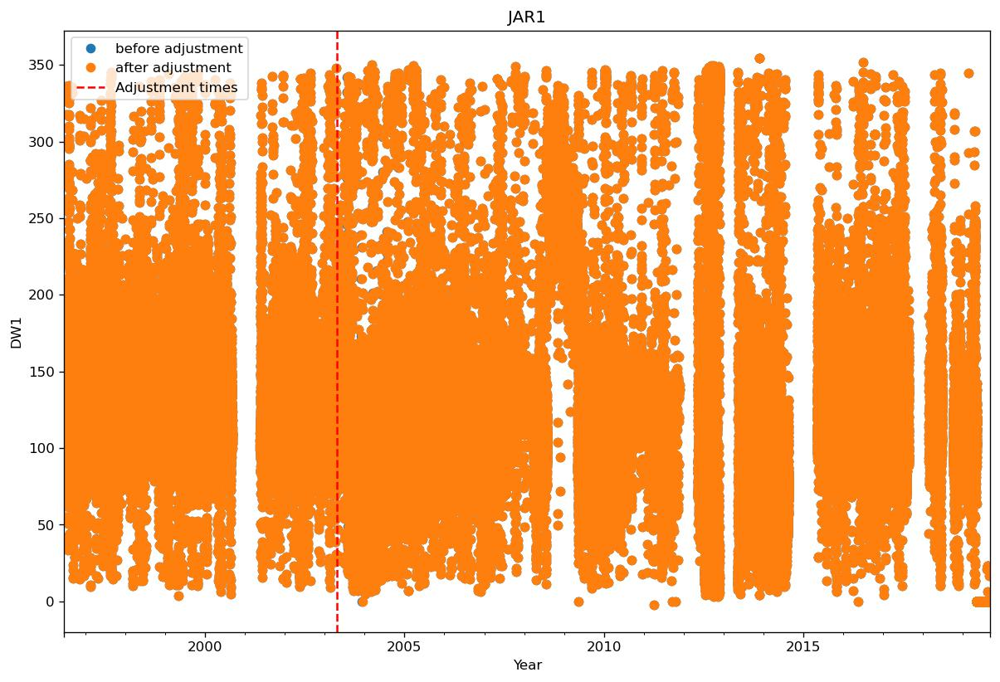
 
### Adjusting DW2
|start time|end time|operation|value|number of removed samples|
|-|-|-|-|-|
|2011-06-01 00:00:00+00:00|2012-05-09 00:00:00+00:00|time_shift|-745.0|555|
|2003-04-24 00:00:00+00:00|2005-05-07 00:00:00+00:00|time_shift|24.0|17|
 
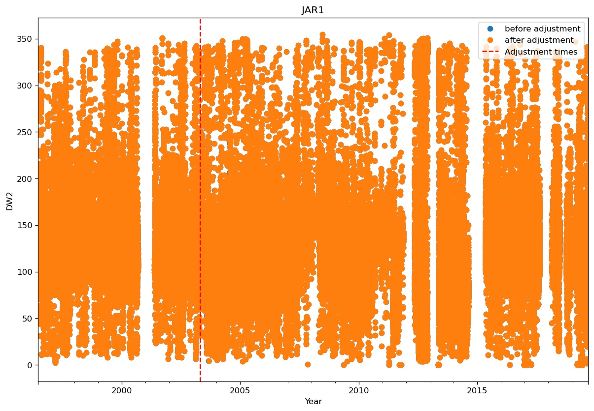
 
### Adjusting HW1
|start time|end time|operation|value|number of removed samples|
|-|-|-|-|-|
|2009-05-15 00:00:00+00:00|2019-09-08 01:00:00+00:00|air_temp_sonic_correction|0.0|0|
|2009-05-15 00:00:00+00:00|2019-09-08 01:00:00+00:00|hampel_filter|2.0|3173|
|2009-08-14 00:00:00+00:00|2010-05-01 00:00:00+00:00|biweekly_upper_range_filter|0.3|468|
|2010-06-11 00:00:00+00:00|2010-06-21 00:00:00+00:00|min_filter|2.21|12|
|2010-07-08 00:00:00+00:00|2010-07-19 00:00:00+00:00|min_filter|3.35|31|
|2018-10-01 00:00:00+00:00|2018-10-10 00:00:00+00:00|min_filter|2.17|16|
|2011-06-01 00:00:00+00:00|2012-05-09 00:00:00+00:00|time_shift|-745.0|553|
|2003-04-24 00:00:00+00:00|2005-05-07 00:00:00+00:00|time_shift|24.0|17|
 

 
### Adjusting HW2
|start time|end time|operation|value|number of removed samples|
|-|-|-|-|-|
|2009-05-15 00:00:00+00:00|2019-09-08 01:00:00+00:00|air_temp_sonic_correction|0.0|0|
|2009-05-15 00:00:00+00:00|2019-09-08 01:00:00+00:00|biweekly_upper_range_filter|0.5|16888|
|2009-05-15 00:00:00+00:00|2019-09-08 01:00:00+00:00|hampel_filter|2.0|533|
|2011-06-01 00:00:00+00:00|2012-05-09 00:00:00+00:00|time_shift|-745.0|518|
|2003-04-24 00:00:00+00:00|2005-05-07 00:00:00+00:00|time_shift|24.0|17|
 

 
### Adjusting ISWR
|start time|end time|operation|value|number of removed samples|
|-|-|-|-|-|
|2011-06-01 00:00:00+00:00|2012-05-09 00:00:00+00:00|time_shift|-745.0|554|
|2003-04-24 00:00:00+00:00|2005-05-07 00:00:00+00:00|time_shift|24.0|16|
 
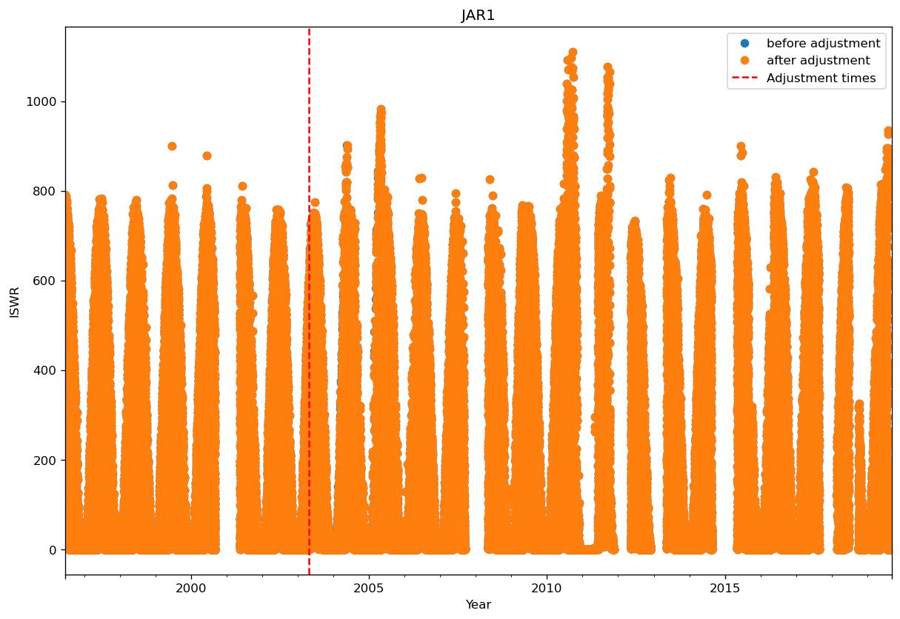
 
### Adjusting NR
|start time|end time|operation|value|number of removed samples|
|-|-|-|-|-|
|2011-06-01 00:00:00+00:00|2012-05-09 00:00:00+00:00|time_shift|-745.0|553|
|2003-04-24 00:00:00+00:00|2005-05-07 00:00:00+00:00|time_shift|24.0|14|
 

 
### Adjusting OSWR
|start time|end time|operation|value|number of removed samples|
|-|-|-|-|-|
|2009-05-06 00:00:00+00:00|2019-09-08 01:00:00+00:00|multiply|0.934|0|
|2011-06-01 00:00:00+00:00|2012-05-09 00:00:00+00:00|time_shift|-745.0|553|
|2003-04-24 00:00:00+00:00|2005-05-07 00:00:00+00:00|time_shift|24.0|17|
 
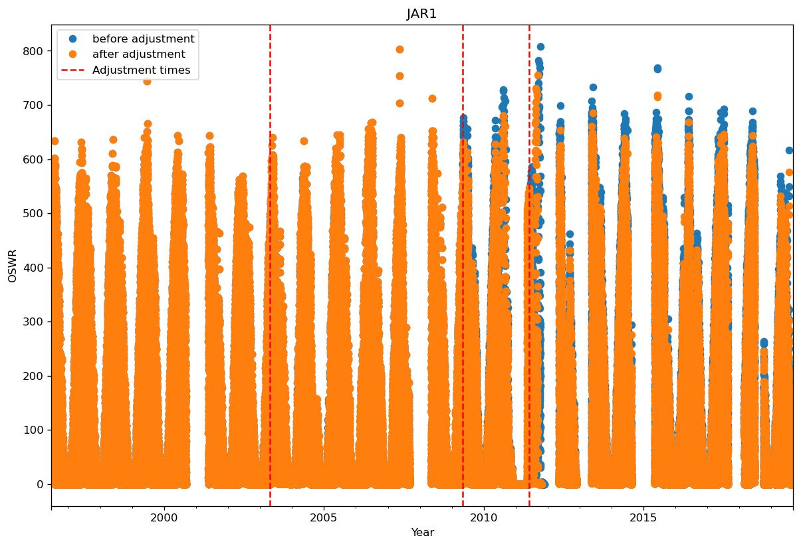
 
### Adjusting P
|start time|end time|operation|value|number of removed samples|
|-|-|-|-|-|
|2011-06-01 00:00:00+00:00|2012-05-09 00:00:00+00:00|time_shift|-745.0|555|
|2003-04-24 00:00:00+00:00|2005-05-07 00:00:00+00:00|time_shift|24.0|17|
 
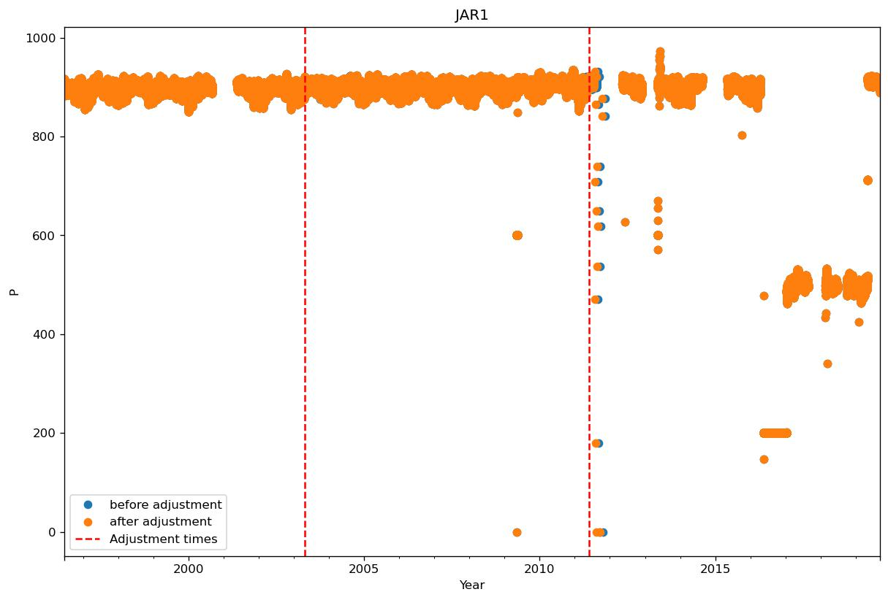
 
### Adjusting RH1
|start time|end time|operation|value|number of removed samples|
|-|-|-|-|-|
|2011-06-01 00:00:00+00:00|2012-05-09 00:00:00+00:00|time_shift|-745.0|555|
|2003-04-24 00:00:00+00:00|2005-05-07 00:00:00+00:00|time_shift|24.0|1|
 
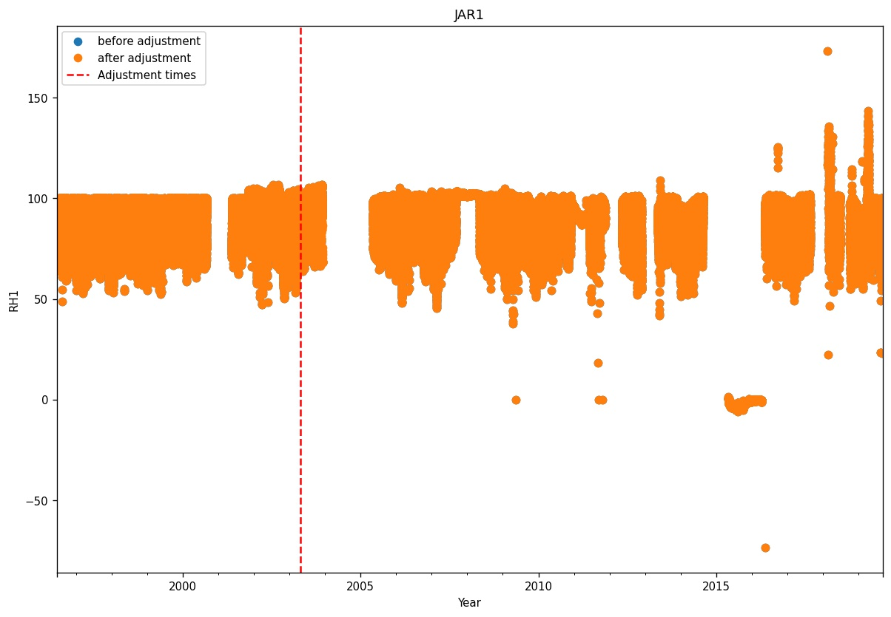
 
### Adjusting RH2
|start time|end time|operation|value|number of removed samples|
|-|-|-|-|-|
|2012-05-15 00:00:00+00:00|2019-09-08 01:00:00+00:00|swap_with_RH1|0.0|-1670|
|2011-06-01 00:00:00+00:00|2012-05-09 00:00:00+00:00|time_shift|-745.0|555|
|2003-04-24 00:00:00+00:00|2005-05-07 00:00:00+00:00|time_shift|24.0|1|
 
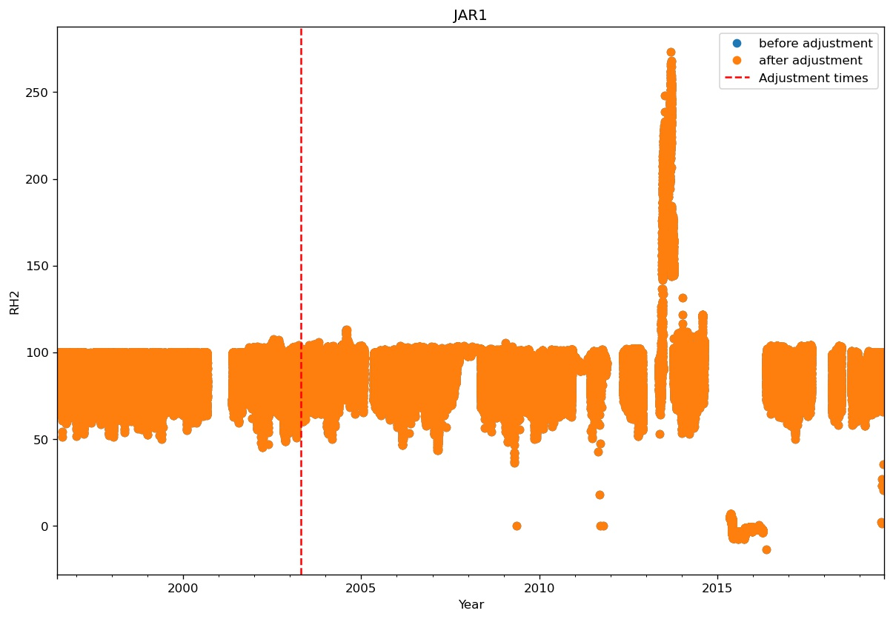
 
### Adjusting TA1
|start time|end time|operation|value|number of removed samples|
|-|-|-|-|-|
|2011-06-01 00:00:00+00:00|2012-05-09 00:00:00+00:00|time_shift|-745.0|555|
|2003-04-24 00:00:00+00:00|2005-05-07 00:00:00+00:00|time_shift|24.0|17|
 
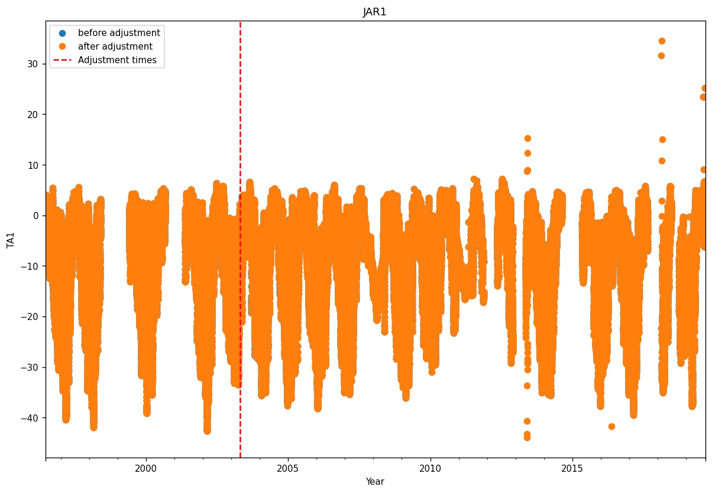
 
### Adjusting TA2
|start time|end time|operation|value|number of removed samples|
|-|-|-|-|-|
|2011-06-01 00:00:00+00:00|2012-05-09 00:00:00+00:00|time_shift|-745.0|555|
|2003-04-24 00:00:00+00:00|2005-05-07 00:00:00+00:00|time_shift|24.0|17|
 
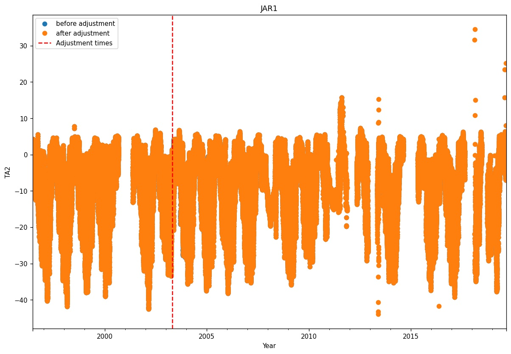
 
### Adjusting TA3
|start time|end time|operation|value|number of removed samples|
|-|-|-|-|-|
|2005-01-01 00:00:00+00:00|2013-01-01 00:00:00+00:00|swap_with_TA4|0.0|-654|
|2011-06-01 00:00:00+00:00|2012-05-09 00:00:00+00:00|time_shift|-745.0|555|
|2018-02-01 00:00:00+00:00|2019-12-20 00:00:00+00:00|max_filter|9.0|215|
|2003-04-24 00:00:00+00:00|2005-05-07 00:00:00+00:00|time_shift|24.0|1|
 

 
### Adjusting TA4
|start time|end time|operation|value|number of removed samples|
|-|-|-|-|-|
|2011-06-01 00:00:00+00:00|2012-05-09 00:00:00+00:00|time_shift|-745.0|555|
|2013-02-01 00:00:00+00:00|2015-12-20 00:00:00+00:00|max_filter|9.0|3469|
|2003-04-24 00:00:00+00:00|2005-05-07 00:00:00+00:00|time_shift|24.0|1|
 

 
### Adjusting TA5
|start time|end time|operation|value|number of removed samples|
|-|-|-|-|-|
|2011-06-01 00:00:00+00:00|2012-05-09 00:00:00+00:00|time_shift|-745.0|338|
|2003-04-24 00:00:00+00:00|2005-05-07 00:00:00+00:00|time_shift|24.0|0|
 
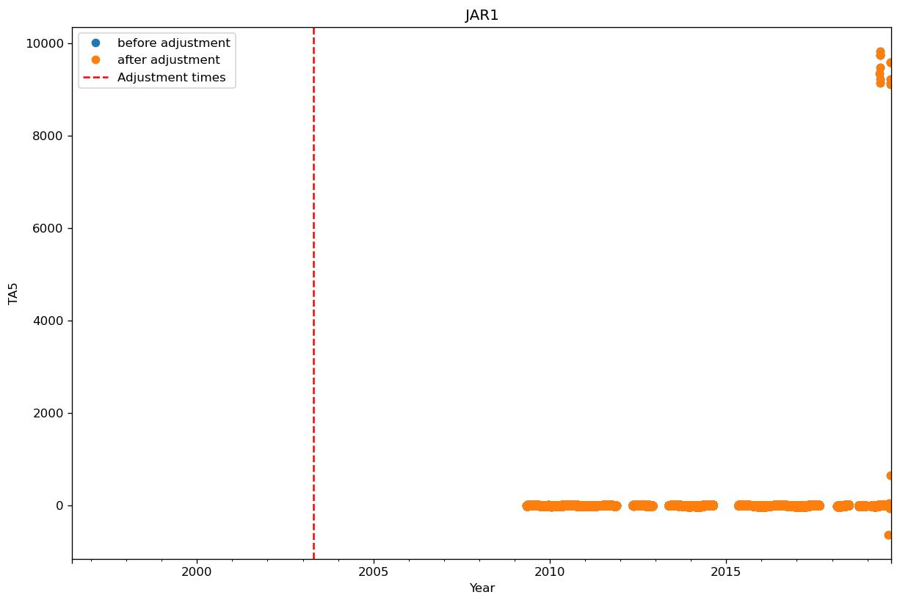
 
### Adjusting TS1
|start time|end time|operation|value|number of removed samples|
|-|-|-|-|-|
|2011-06-01 00:00:00+00:00|2012-05-09 00:00:00+00:00|time_shift|-745.0|211|
|2003-04-24 00:00:00+00:00|2005-05-07 00:00:00+00:00|time_shift|24.0|17|
 
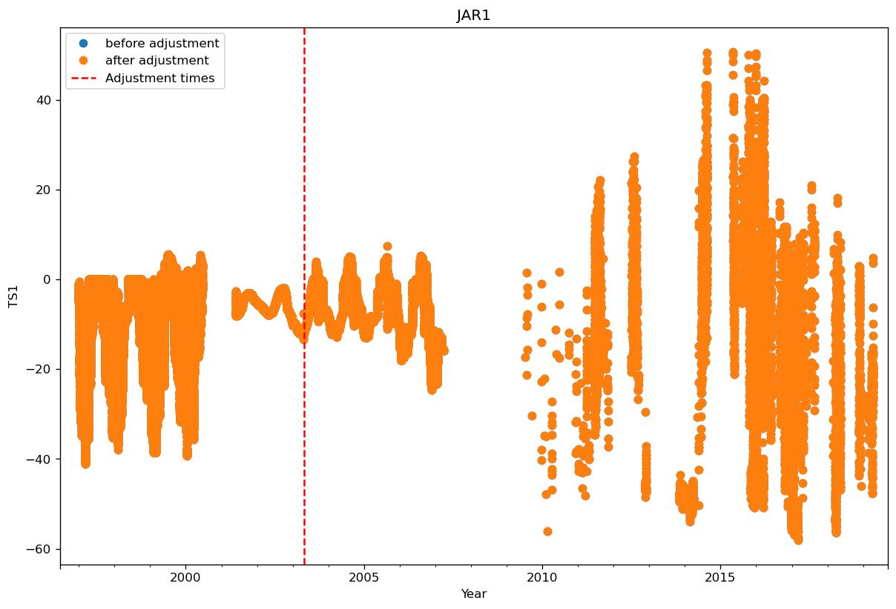
 
### Adjusting TS10
|start time|end time|operation|value|number of removed samples|
|-|-|-|-|-|
|2011-06-01 00:00:00+00:00|2012-05-09 00:00:00+00:00|time_shift|-745.0|23|
|2003-04-24 00:00:00+00:00|2005-05-07 00:00:00+00:00|time_shift|24.0|17|
 
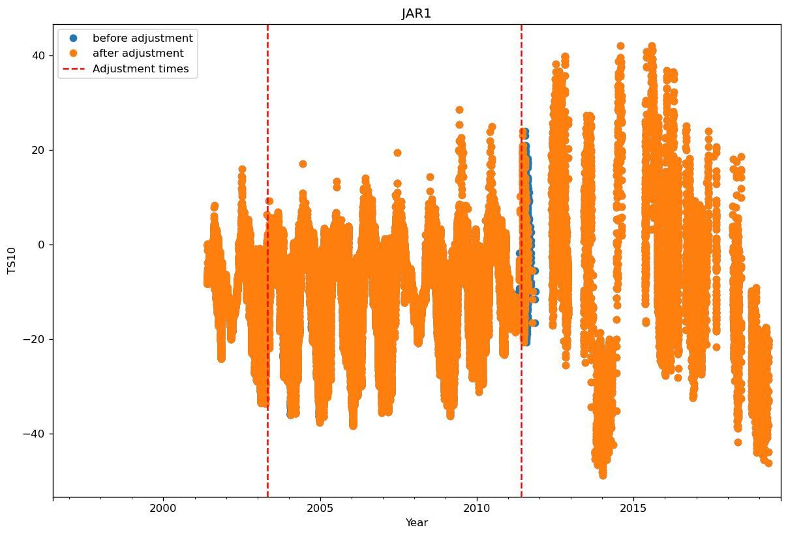
 
### Adjusting TS2
|start time|end time|operation|value|number of removed samples|
|-|-|-|-|-|
|2011-06-01 00:00:00+00:00|2012-05-09 00:00:00+00:00|time_shift|-745.0|231|
|2003-04-24 00:00:00+00:00|2005-05-07 00:00:00+00:00|time_shift|24.0|17|
 
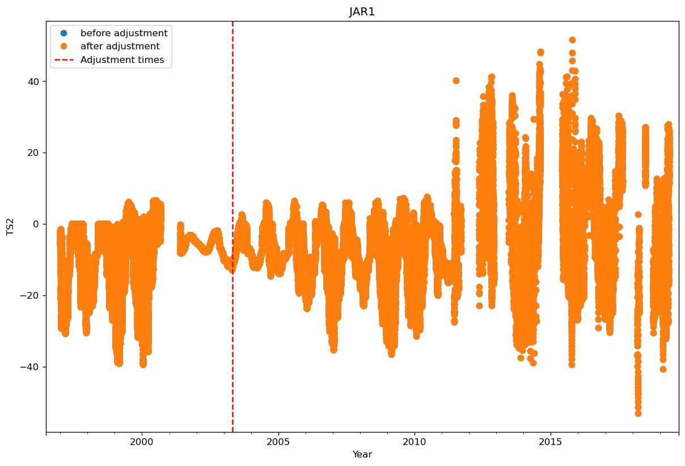
 
### Adjusting TS3
|start time|end time|operation|value|number of removed samples|
|-|-|-|-|-|
|2011-06-01 00:00:00+00:00|2012-05-09 00:00:00+00:00|time_shift|-745.0|4|
|2003-04-24 00:00:00+00:00|2005-05-07 00:00:00+00:00|time_shift|24.0|17|
 
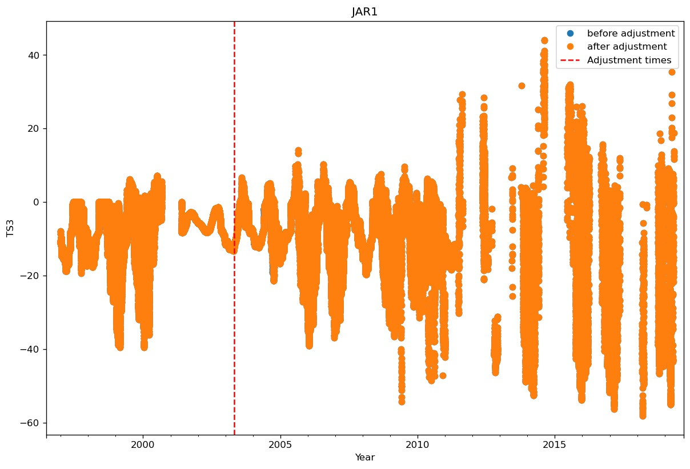
 
### Adjusting TS4
|start time|end time|operation|value|number of removed samples|
|-|-|-|-|-|
|2011-06-01 00:00:00+00:00|2012-05-09 00:00:00+00:00|time_shift|-745.0|110|
|2003-04-24 00:00:00+00:00|2005-05-07 00:00:00+00:00|time_shift|24.0|17|
 
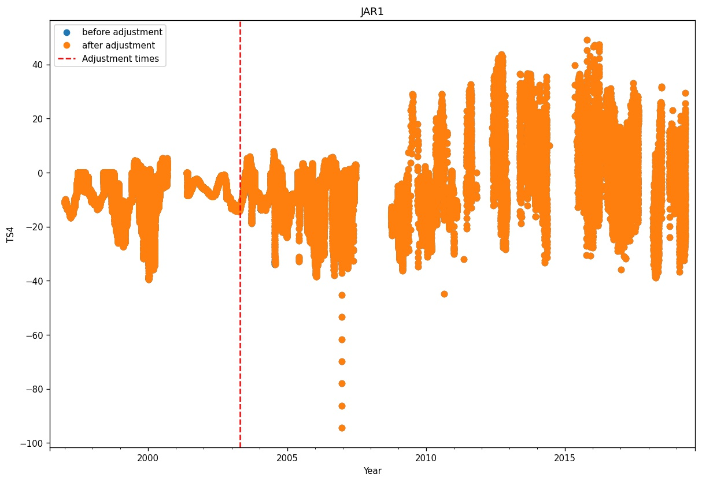
 
### Adjusting TS5
|start time|end time|operation|value|number of removed samples|
|-|-|-|-|-|
|2011-06-01 00:00:00+00:00|2012-05-09 00:00:00+00:00|time_shift|-745.0|123|
|2003-04-24 00:00:00+00:00|2005-05-07 00:00:00+00:00|time_shift|24.0|17|
 
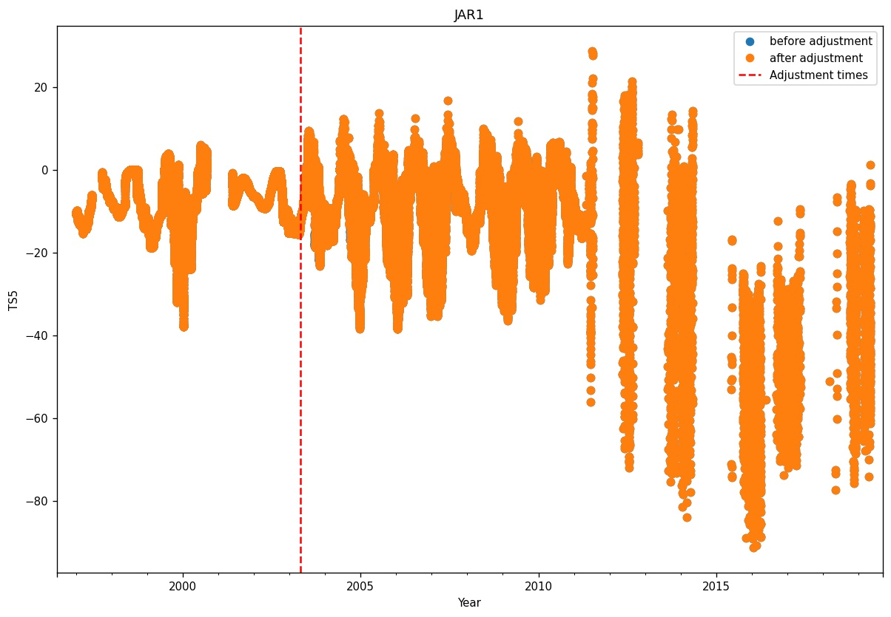
 
### Adjusting TS6
|start time|end time|operation|value|number of removed samples|
|-|-|-|-|-|
|2011-06-01 00:00:00+00:00|2012-05-09 00:00:00+00:00|time_shift|-745.0|19|
|2003-04-24 00:00:00+00:00|2005-05-07 00:00:00+00:00|time_shift|24.0|17|
 
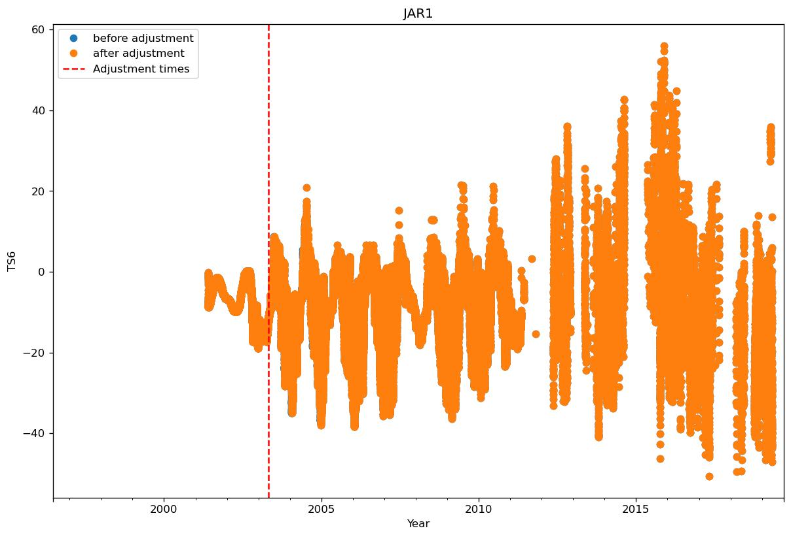
 
### Adjusting TS7
|start time|end time|operation|value|number of removed samples|
|-|-|-|-|-|
|2011-06-01 00:00:00+00:00|2012-05-09 00:00:00+00:00|time_shift|-745.0|34|
|2003-04-24 00:00:00+00:00|2005-05-07 00:00:00+00:00|time_shift|24.0|17|
 
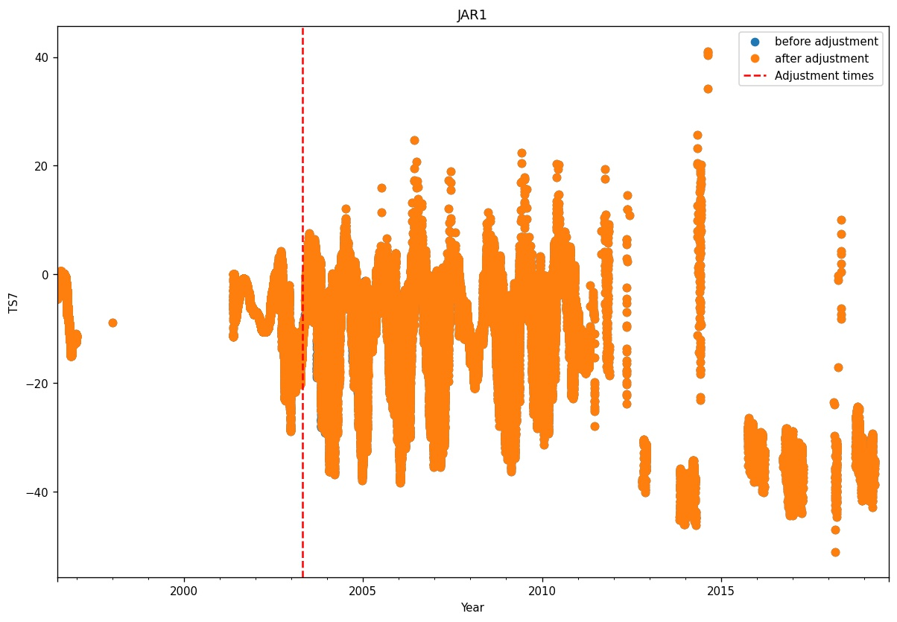
 
### Adjusting TS8
|start time|end time|operation|value|number of removed samples|
|-|-|-|-|-|
|2011-06-01 00:00:00+00:00|2012-05-09 00:00:00+00:00|time_shift|-745.0|13|
|2003-04-24 00:00:00+00:00|2005-05-07 00:00:00+00:00|time_shift|24.0|17|
 
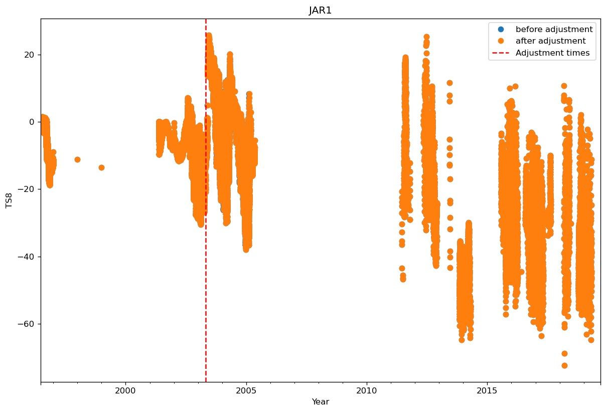
 
### Adjusting TS9
|start time|end time|operation|value|number of removed samples|
|-|-|-|-|-|
|2011-06-01 00:00:00+00:00|2012-05-09 00:00:00+00:00|time_shift|-745.0|60|
|2003-04-24 00:00:00+00:00|2005-05-07 00:00:00+00:00|time_shift|24.0|17|
 
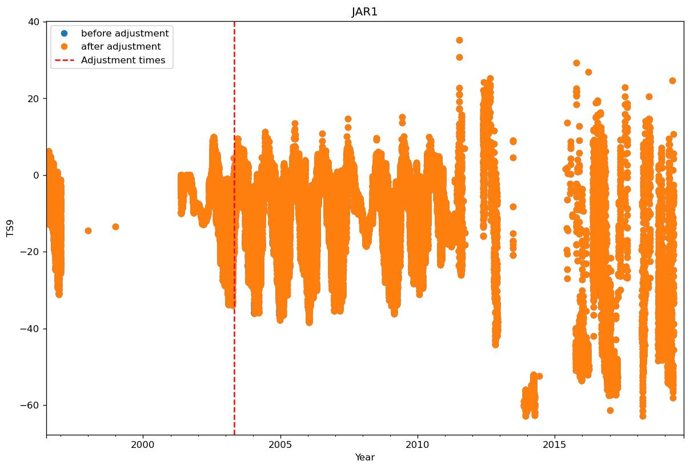
 
### Adjusting V
|start time|end time|operation|value|number of removed samples|
|-|-|-|-|-|
|2011-06-01 00:00:00+00:00|2012-05-09 00:00:00+00:00|time_shift|-745.0|555|
|2003-04-24 00:00:00+00:00|2005-05-07 00:00:00+00:00|time_shift|24.0|17|
 
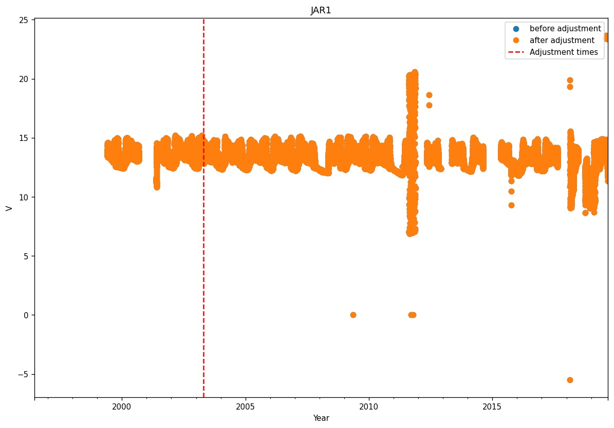
 
### Adjusting VW1
|start time|end time|operation|value|number of removed samples|
|-|-|-|-|-|
|2011-06-01 00:00:00+00:00|2012-05-09 00:00:00+00:00|time_shift|-745.0|555|
|2003-04-24 00:00:00+00:00|2005-05-07 00:00:00+00:00|time_shift|24.0|17|
 
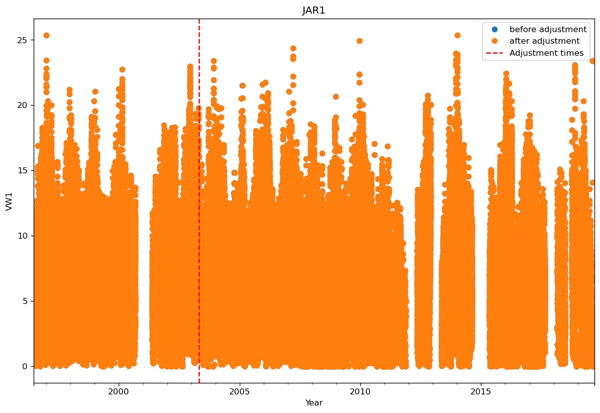
 
### Adjusting VW2
|start time|end time|operation|value|number of removed samples|
|-|-|-|-|-|
|2011-06-01 00:00:00+00:00|2012-05-09 00:00:00+00:00|time_shift|-745.0|555|
|2003-04-24 00:00:00+00:00|2005-05-07 00:00:00+00:00|time_shift|24.0|17|
 
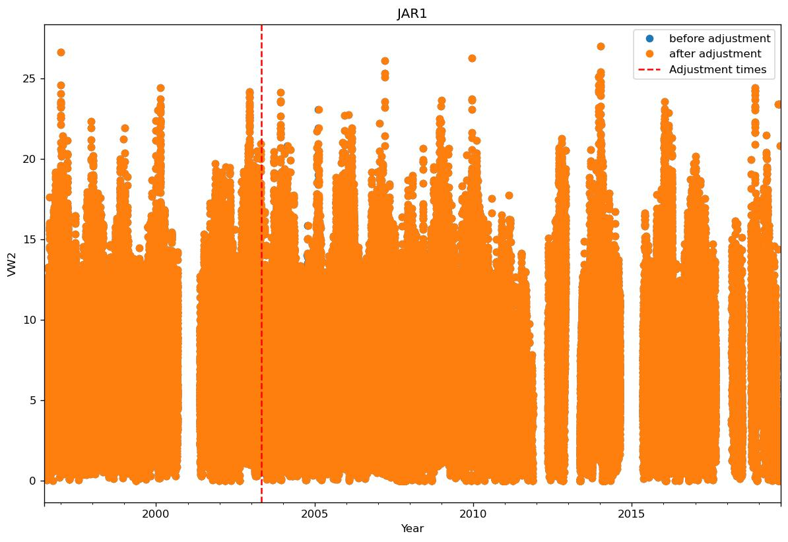
 
# 17 JAR2
## Manual flagging of data at JAR2
Flagging data:
|start time|end time|variable|
|-|-|-|
|2011-01-01 00:00:00+00:00|2013-06-16 08:00:00+00:00|VW1|
|2011-01-01 00:00:00+00:00|2013-06-16 08:00:00+00:00|DW1|
|2012-07-15 00:00:00+00:00|2012-07-17 00:00:00+00:00|HW2|
|2012-08-16 00:00:00+00:00|2013-06-16 08:00:00+00:00|HW2|
|2002-05-07 00:00:00+00:00|2002-05-07 08:00:00+00:00|HW1|
|2002-05-07 00:00:00+00:00|2002-05-07 08:00:00+00:00|HW2|
|2004-05-01 00:00:00+00:00|2004-05-27 11:00:00+00:00|HW1|
|2004-05-01 00:00:00+00:00|2004-05-27 11:00:00+00:00|HW2|
|2010-07-01 00:00:00+00:00|2011-06-10 11:00:00+00:00|TA1|
|2010-07-01 00:00:00+00:00|2011-06-10 11:00:00+00:00|TA2|
|2010-07-01 00:00:00+00:00|2011-06-10 11:00:00+00:00|TA3|
|2010-07-01 00:00:00+00:00|2011-06-10 11:00:00+00:00|HW1|
|2010-07-01 00:00:00+00:00|2011-06-10 11:00:00+00:00|HW2|
|2010-07-01 00:00:00+00:00|2011-06-10 11:00:00+00:00|RH1|
|2010-07-01 00:00:00+00:00|2011-06-10 11:00:00+00:00|RH2|
|2010-07-01 00:00:00+00:00|2011-06-10 11:00:00+00:00|VW1|
|2010-07-01 00:00:00+00:00|2011-06-10 11:00:00+00:00|VW2|
|2010-07-01 00:00:00+00:00|2011-06-10 11:00:00+00:00|DW1|
|2010-07-01 00:00:00+00:00|2011-06-10 11:00:00+00:00|DW2|
|2010-07-01 00:00:00+00:00|2011-06-10 11:00:00+00:00|ISWR|
|2010-07-01 00:00:00+00:00|2011-06-10 11:00:00+00:00|OSWR|
|2010-07-01 00:00:00+00:00|2011-06-10 11:00:00+00:00|NR|
|2008-05-07 00:00:00+00:00|2011-06-10 11:00:00+00:00|TA4|
|2008-05-07 00:00:00+00:00|2011-06-10 11:00:00+00:00|TA3|
|2007-01-01 00:00:00+00:00|2013-06-16 08:00:00+00:00|TS1|
|2007-01-01 00:00:00+00:00|2013-06-16 08:00:00+00:00|TS2|
|2007-01-01 00:00:00+00:00|2013-06-16 08:00:00+00:00|TS3|
|2007-01-01 00:00:00+00:00|2013-06-16 08:00:00+00:00|TS4|
|2007-01-01 00:00:00+00:00|2013-06-16 08:00:00+00:00|TS5|
|2007-01-01 00:00:00+00:00|2013-06-16 08:00:00+00:00|TS6|
|2007-01-01 00:00:00+00:00|2013-06-16 08:00:00+00:00|TS7|
|2007-01-01 00:00:00+00:00|2013-06-16 08:00:00+00:00|TS8|
|2007-01-01 00:00:00+00:00|2013-06-16 08:00:00+00:00|TS9|
|2007-01-01 00:00:00+00:00|2013-06-16 08:00:00+00:00|TS10|
## Adjusting data at JAR2
### Adjusting DW1
|start time|end time|operation|value|number of removed samples|
|-|-|-|-|-|
|2011-05-01 00:00:00+00:00|2013-06-16 08:00:00+00:00|time_shift|-749.0|3|
|2008-01-01 00:00:00+00:00|2009-01-01 00:00:00+00:00|time_shift|63.0|0|
 
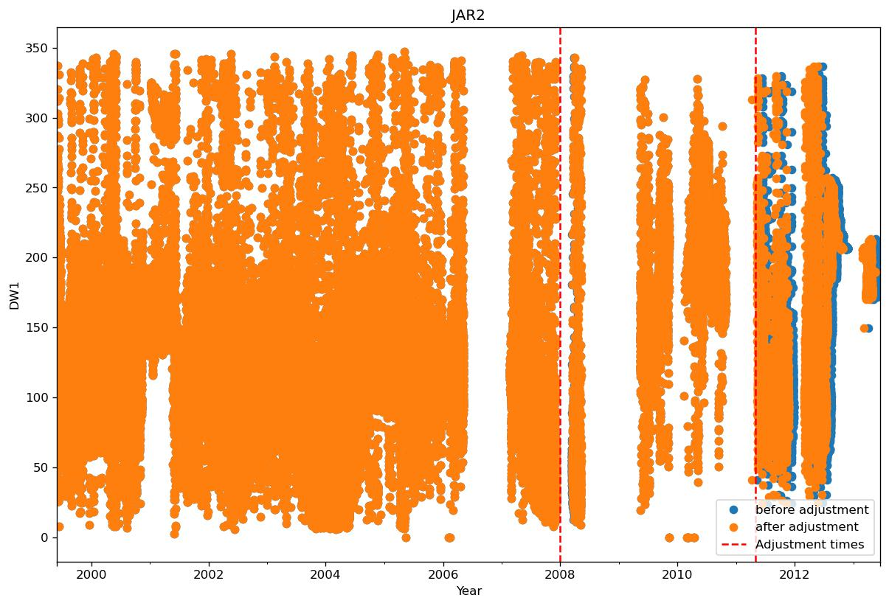
 
### Adjusting DW2
|start time|end time|operation|value|number of removed samples|
|-|-|-|-|-|
|2011-05-01 00:00:00+00:00|2013-06-16 08:00:00+00:00|time_shift|-749.0|3|
|2008-01-01 00:00:00+00:00|2009-01-01 00:00:00+00:00|time_shift|63.0|0|
 
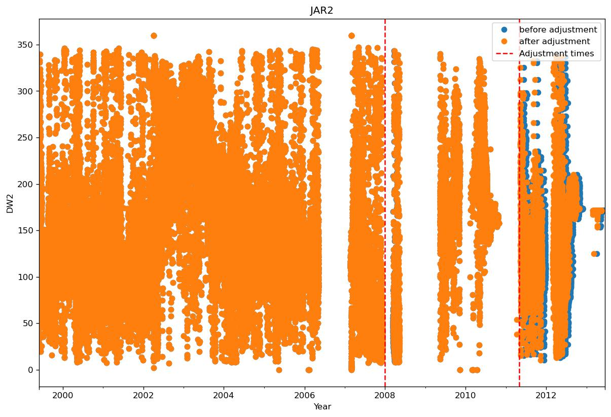
 
### Adjusting HW1
|start time|end time|operation|value|number of removed samples|
|-|-|-|-|-|
|1999-04-19 00:00:00+00:00|2000-01-01 00:00:00+00:00|min_filter|0.5|10|
|2007-01-01 00:00:00+00:00|2013-06-16 08:00:00+00:00|max_filter|5.9|520|
|2008-01-01 00:00:00+00:00|2013-06-16 08:00:00+00:00|min_filter|1.05|4183|
|2008-01-01 00:00:00+00:00|2013-06-16 08:00:00+00:00|biweekly_upper_range_filter|0.7|732|
|2011-05-01 00:00:00+00:00|2013-06-16 08:00:00+00:00|time_shift|-749.0|1|
|2008-01-01 00:00:00+00:00|2009-01-01 00:00:00+00:00|time_shift|63.0|0|
 
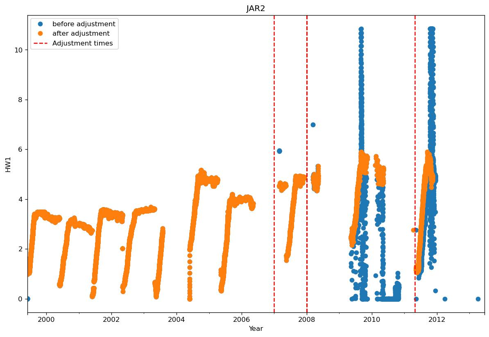
 
### Adjusting HW2
|start time|end time|operation|value|number of removed samples|
|-|-|-|-|-|
|1999-04-19 00:00:00+00:00|2000-01-01 00:00:00+00:00|min_filter|0.5|10|
|2008-01-01 00:00:00+00:00|2013-06-16 08:00:00+00:00|min_filter|0.5|9993|
|2008-01-01 00:00:00+00:00|2013-06-16 08:00:00+00:00|max_filter|7.5|58|
|2008-01-01 00:00:00+00:00|2013-06-16 08:00:00+00:00|biweekly_upper_range_filter|0.7|3917|
|2011-05-01 00:00:00+00:00|2013-06-16 08:00:00+00:00|time_shift|-749.0|1|
|2008-01-01 00:00:00+00:00|2009-01-01 00:00:00+00:00|time_shift|63.0|0|
 
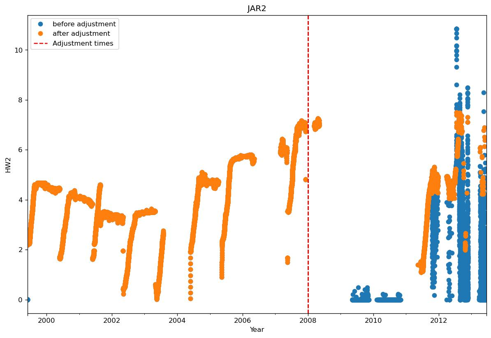
 
### Adjusting ISWR
|start time|end time|operation|value|number of removed samples|
|-|-|-|-|-|
|2009-01-01 00:00:00+00:00|2013-06-16 08:00:00+00:00|multiply|0.5|0|
|2011-05-01 00:00:00+00:00|2013-06-16 08:00:00+00:00|time_shift|-749.0|3|
|2008-01-01 00:00:00+00:00|2009-01-01 00:00:00+00:00|time_shift|63.0|0|
 

 
### Adjusting NR
|start time|end time|operation|value|number of removed samples|
|-|-|-|-|-|
|2011-05-01 00:00:00+00:00|2013-06-16 08:00:00+00:00|time_shift|-749.0|3|
|2008-01-01 00:00:00+00:00|2009-01-01 00:00:00+00:00|time_shift|63.0|0|
 

 
### Adjusting OSWR
|start time|end time|operation|value|number of removed samples|
|-|-|-|-|-|
|2009-01-01 00:00:00+00:00|2013-06-16 08:00:00+00:00|multiply|0.5|0|
|2011-05-01 00:00:00+00:00|2013-06-16 08:00:00+00:00|time_shift|-749.0|3|
|2008-01-01 00:00:00+00:00|2009-01-01 00:00:00+00:00|time_shift|63.0|0|
 
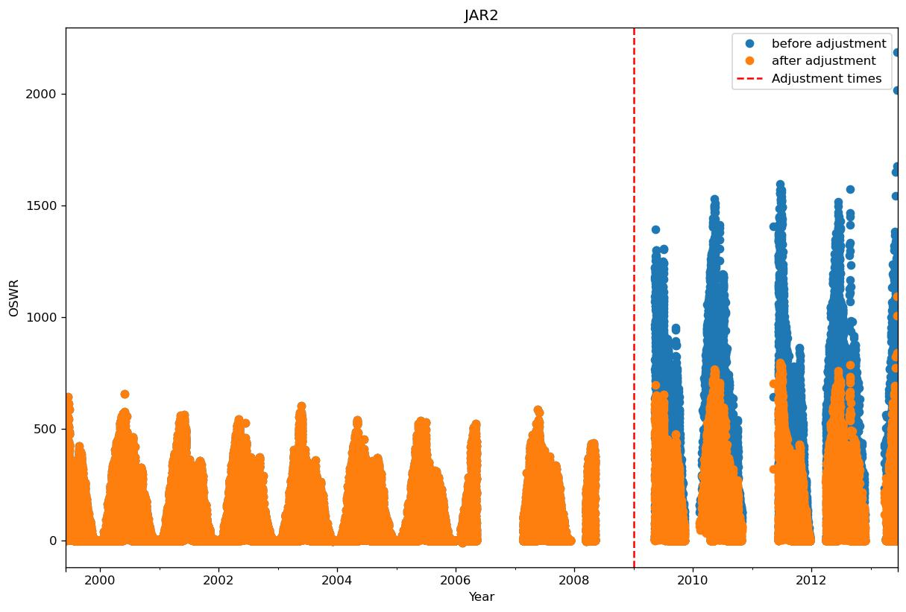
 
### Adjusting P
|start time|end time|operation|value|number of removed samples|
|-|-|-|-|-|
|2011-05-01 00:00:00+00:00|2013-06-16 08:00:00+00:00|time_shift|-749.0|3|
|2008-01-01 00:00:00+00:00|2009-01-01 00:00:00+00:00|time_shift|63.0|0|
 
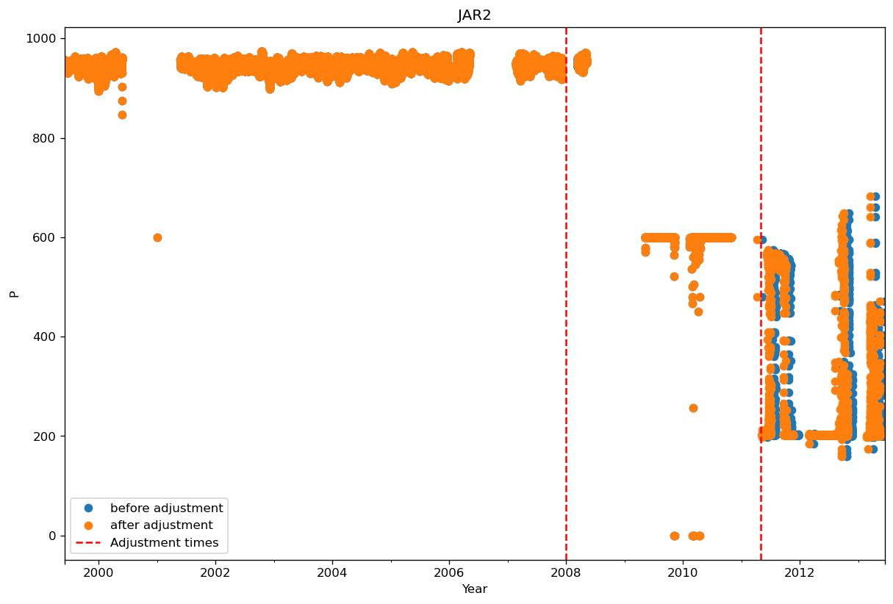
 
### Adjusting RH1
|start time|end time|operation|value|number of removed samples|
|-|-|-|-|-|
|2002-05-07 00:00:00+00:00|2013-06-16 08:00:00+00:00|swap_with_RH2|0.0|-19|
|1999-06-02 03:00:00+00:00|2013-06-16 08:00:00+00:00|ice_to_water|0.0|0|
|2011-05-01 00:00:00+00:00|2013-06-16 08:00:00+00:00|time_shift|-749.0|3|
|2008-01-01 00:00:00+00:00|2009-01-01 00:00:00+00:00|time_shift|63.0|0|
 
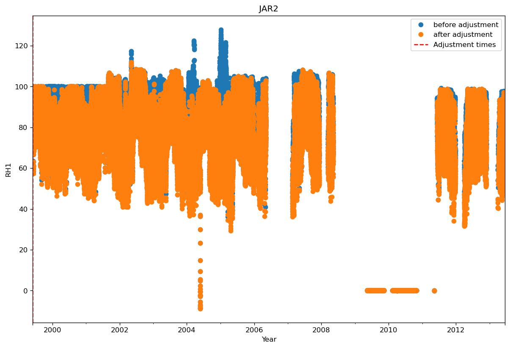
 
### Adjusting RH2
|start time|end time|operation|value|number of removed samples|
|-|-|-|-|-|
|1999-06-02 03:00:00+00:00|2013-06-16 08:00:00+00:00|ice_to_water|0.0|0|
|2011-05-01 00:00:00+00:00|2013-06-16 08:00:00+00:00|time_shift|-749.0|3|
|2008-01-01 00:00:00+00:00|2009-01-01 00:00:00+00:00|time_shift|63.0|0|
 
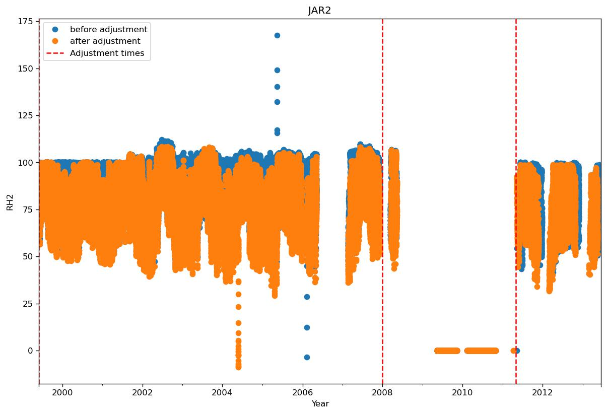
 
### Adjusting TA1
|start time|end time|operation|value|number of removed samples|
|-|-|-|-|-|
|2011-05-01 00:00:00+00:00|2013-06-16 08:00:00+00:00|time_shift|-749.0|3|
|2008-01-01 00:00:00+00:00|2009-01-01 00:00:00+00:00|time_shift|63.0|0|
 
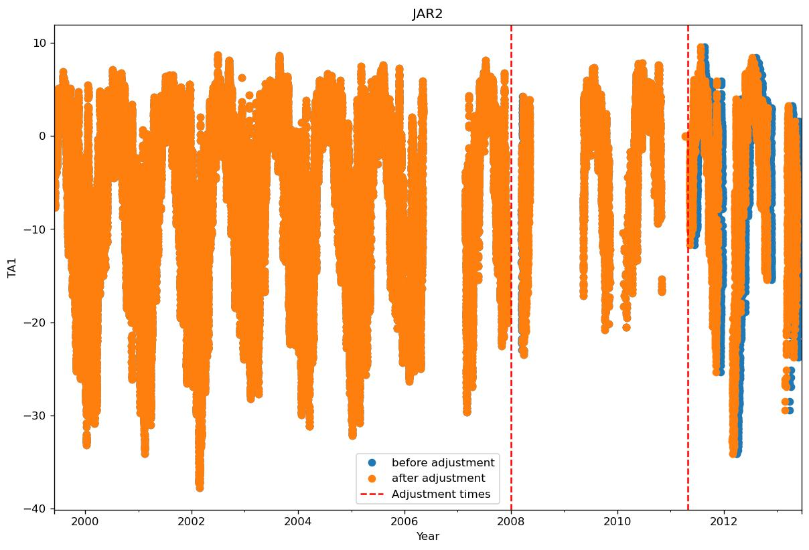
 
### Adjusting TA2
|start time|end time|operation|value|number of removed samples|
|-|-|-|-|-|
|2011-05-01 00:00:00+00:00|2013-06-16 08:00:00+00:00|time_shift|-749.0|3|
|2008-01-01 00:00:00+00:00|2009-01-01 00:00:00+00:00|time_shift|63.0|0|
 
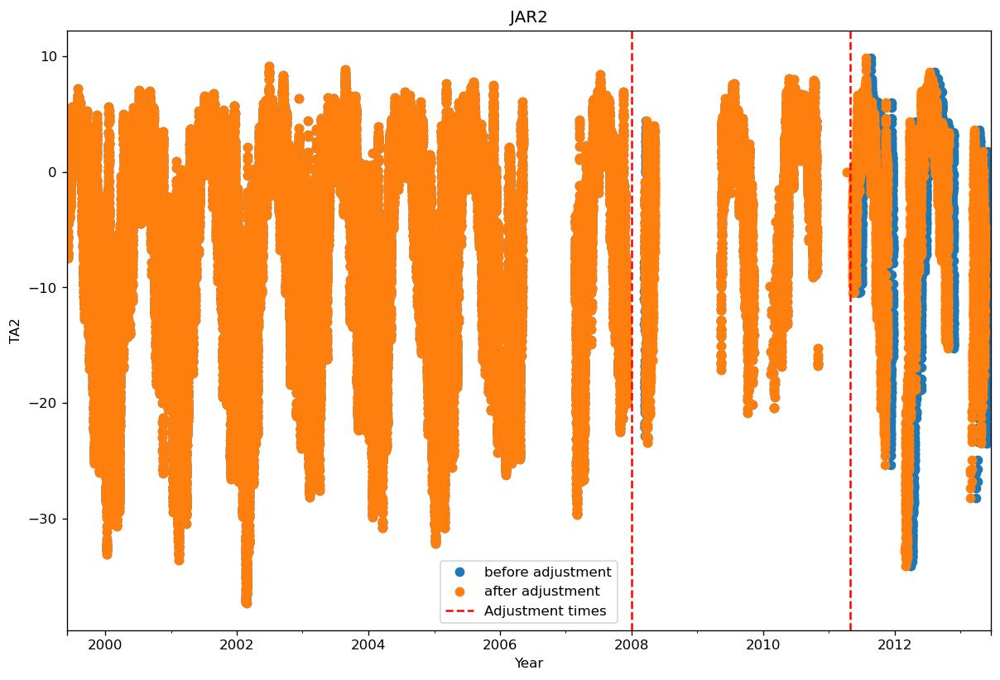
 
### Adjusting TA3
|start time|end time|operation|value|number of removed samples|
|-|-|-|-|-|
|2011-05-01 00:00:00+00:00|2013-06-16 08:00:00+00:00|time_shift|-749.0|3|
|2008-01-01 00:00:00+00:00|2009-01-01 00:00:00+00:00|time_shift|63.0|0|
 
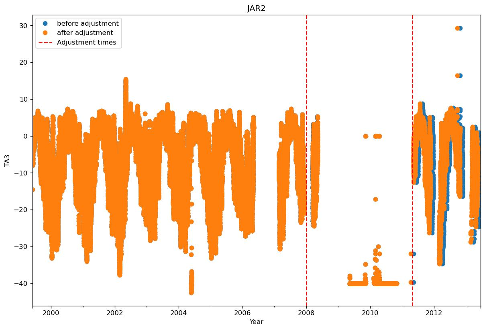
 
### Adjusting TA4
|start time|end time|operation|value|number of removed samples|
|-|-|-|-|-|
|2011-05-01 00:00:00+00:00|2013-06-16 08:00:00+00:00|time_shift|-749.0|3|
|2008-01-01 00:00:00+00:00|2009-01-01 00:00:00+00:00|time_shift|63.0|0|
 
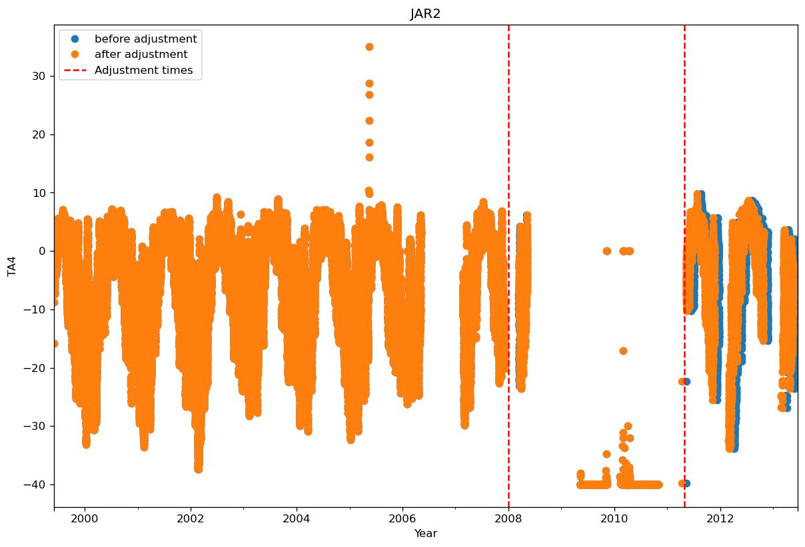
 
### Adjusting TA5
|start time|end time|operation|value|number of removed samples|
|-|-|-|-|-|
|2011-05-01 00:00:00+00:00|2013-06-16 08:00:00+00:00|time_shift|-749.0|3|
|2008-01-01 00:00:00+00:00|2009-01-01 00:00:00+00:00|time_shift|63.0|0|
 

 
### Adjusting TS1
|start time|end time|operation|value|number of removed samples|
|-|-|-|-|-|
|2011-05-01 00:00:00+00:00|2013-06-16 08:00:00+00:00|time_shift|-749.0|3|
|2008-01-01 00:00:00+00:00|2009-01-01 00:00:00+00:00|time_shift|63.0|0|
 

 
### Adjusting TS10
|start time|end time|operation|value|number of removed samples|
|-|-|-|-|-|
|2011-05-01 00:00:00+00:00|2013-06-16 08:00:00+00:00|time_shift|-749.0|0|
|2008-01-01 00:00:00+00:00|2009-01-01 00:00:00+00:00|time_shift|63.0|0|
 

 
### Adjusting TS2
|start time|end time|operation|value|number of removed samples|
|-|-|-|-|-|
|2011-05-01 00:00:00+00:00|2013-06-16 08:00:00+00:00|time_shift|-749.0|1|
|2008-01-01 00:00:00+00:00|2009-01-01 00:00:00+00:00|time_shift|63.0|0|
 

 
### Adjusting TS3
|start time|end time|operation|value|number of removed samples|
|-|-|-|-|-|
|2011-05-01 00:00:00+00:00|2013-06-16 08:00:00+00:00|time_shift|-749.0|3|
|2008-01-01 00:00:00+00:00|2009-01-01 00:00:00+00:00|time_shift|63.0|0|
 

 
### Adjusting TS4
|start time|end time|operation|value|number of removed samples|
|-|-|-|-|-|
|2011-05-01 00:00:00+00:00|2013-06-16 08:00:00+00:00|time_shift|-749.0|3|
|2008-01-01 00:00:00+00:00|2009-01-01 00:00:00+00:00|time_shift|63.0|0|
 

 
### Adjusting TS5
|start time|end time|operation|value|number of removed samples|
|-|-|-|-|-|
|2011-05-01 00:00:00+00:00|2013-06-16 08:00:00+00:00|time_shift|-749.0|3|
|2008-01-01 00:00:00+00:00|2009-01-01 00:00:00+00:00|time_shift|63.0|0|
 

 
### Adjusting TS6
|start time|end time|operation|value|number of removed samples|
|-|-|-|-|-|
|2011-05-01 00:00:00+00:00|2013-06-16 08:00:00+00:00|time_shift|-749.0|3|
|2008-01-01 00:00:00+00:00|2009-01-01 00:00:00+00:00|time_shift|63.0|0|
 

 
### Adjusting TS7
|start time|end time|operation|value|number of removed samples|
|-|-|-|-|-|
|2011-05-01 00:00:00+00:00|2013-06-16 08:00:00+00:00|time_shift|-749.0|0|
|2008-01-01 00:00:00+00:00|2009-01-01 00:00:00+00:00|time_shift|63.0|0|
 

 
### Adjusting TS8
|start time|end time|operation|value|number of removed samples|
|-|-|-|-|-|
|2011-05-01 00:00:00+00:00|2013-06-16 08:00:00+00:00|time_shift|-749.0|0|
|2008-01-01 00:00:00+00:00|2009-01-01 00:00:00+00:00|time_shift|63.0|0|
 

 
### Adjusting TS9
|start time|end time|operation|value|number of removed samples|
|-|-|-|-|-|
|2011-05-01 00:00:00+00:00|2013-06-16 08:00:00+00:00|time_shift|-749.0|0|
|2008-01-01 00:00:00+00:00|2009-01-01 00:00:00+00:00|time_shift|63.0|0|
 

 
### Adjusting V
|start time|end time|operation|value|number of removed samples|
|-|-|-|-|-|
|2011-05-01 00:00:00+00:00|2013-06-16 08:00:00+00:00|time_shift|-749.0|3|
|2008-01-01 00:00:00+00:00|2009-01-01 00:00:00+00:00|time_shift|63.0|0|
 

 
### Adjusting VW1
|start time|end time|operation|value|number of removed samples|
|-|-|-|-|-|
|2004-05-07 00:00:00+00:00|2005-05-14 00:00:00+00:00|swap_with_VW2|0.0|-459|
|2011-05-01 00:00:00+00:00|2013-06-16 08:00:00+00:00|time_shift|-749.0|3|
|2008-01-01 00:00:00+00:00|2009-01-01 00:00:00+00:00|time_shift|63.0|0|
 

 
### Adjusting VW2
|start time|end time|operation|value|number of removed samples|
|-|-|-|-|-|
|2011-05-01 00:00:00+00:00|2013-06-16 08:00:00+00:00|time_shift|-749.0|3|
|2008-01-01 00:00:00+00:00|2009-01-01 00:00:00+00:00|time_shift|63.0|0|
 

 
# 19 JAR3
## Manual flagging of data at JAR3
Flagging data:
|start time|end time|variable|
|-|-|-|
|2011-01-01 00:00:00+00:00|2004-05-25 13:00:00+00:00|VW1|
|2011-01-01 00:00:00+00:00|2004-05-25 13:00:00+00:00|DW1|
|2007-01-01 00:00:00+00:00|2004-05-25 13:00:00+00:00|TS1|
|2007-01-01 00:00:00+00:00|2004-05-25 13:00:00+00:00|TS2|
|2007-01-01 00:00:00+00:00|2004-05-25 13:00:00+00:00|TS3|
|2007-01-01 00:00:00+00:00|2004-05-25 13:00:00+00:00|TS4|
|2007-01-01 00:00:00+00:00|2004-05-25 13:00:00+00:00|TS5|
|2007-01-01 00:00:00+00:00|2004-05-25 13:00:00+00:00|TS6|
|2007-01-01 00:00:00+00:00|2004-05-25 13:00:00+00:00|TS7|
|2007-01-01 00:00:00+00:00|2004-05-25 13:00:00+00:00|TS8|
|2007-01-01 00:00:00+00:00|2004-05-25 13:00:00+00:00|TS9|
|2007-01-01 00:00:00+00:00|2004-05-25 13:00:00+00:00|TS10|
## Adjusting data at JAR3
### Adjusting P
|start time|end time|operation|value|number of removed samples|
|-|-|-|-|-|
|2002-05-06 15:00:00+00:00|2004-05-25 13:00:00+00:00|add|70.0|0|
 

 
# 2 Crawford Point 1
## Manual flagging of data at Crawford Point 1
Flagging data:
|start time|end time|variable|
|-|-|-|
|1998-01-01 00:00:00+00:00|1998-05-31 00:00:00+00:00|ISWR|
|1998-01-01 00:00:00+00:00|1998-05-31 00:00:00+00:00|OSWR|
|2011-05-25 00:00:00+00:00|2012-11-01 00:00:00+00:00|P|
|2008-06-01 00:00:00+00:00|2013-01-01 00:00:00+00:00|DW1|
|2008-06-01 00:00:00+00:00|2013-01-01 00:00:00+00:00|DW2|
|2004-11-16 00:00:00+00:00|2005-05-04 00:00:00+00:00|RH1|
|2004-11-16 00:00:00+00:00|2005-05-04 00:00:00+00:00|RH2|
|2005-01-01 00:00:00+00:00|2007-05-10 00:00:00+00:00|TA1|
|2017-03-10 00:00:00+00:00|2017-05-22 00:00:00+00:00|TA3|
|2015-06-01 00:00:00+00:00|2015-07-01 00:00:00+00:00|HW1|
|2017-07-26 00:00:00+00:00|2020-01-01 00:00:00+00:00|HW2|
|2000-08-01 00:00:00+00:00|2000-08-10 00:00:00+00:00|TS1|
|2000-08-01 00:00:00+00:00|2000-08-10 00:00:00+00:00|TS2|
|2000-08-01 00:00:00+00:00|2000-08-10 00:00:00+00:00|TS3|
|2000-08-01 00:00:00+00:00|2000-08-10 00:00:00+00:00|TS4|
|2000-08-01 00:00:00+00:00|2000-08-10 00:00:00+00:00|TS5|
|2000-08-01 00:00:00+00:00|2000-08-10 00:00:00+00:00|TS6|
|2000-08-01 00:00:00+00:00|2000-08-10 00:00:00+00:00|TS7|
|2000-08-01 00:00:00+00:00|2000-08-10 00:00:00+00:00|TS8|
|2000-08-01 00:00:00+00:00|2000-08-10 00:00:00+00:00|TS9|
|2000-08-01 00:00:00+00:00|2000-08-10 00:00:00+00:00|TS10|
|2002-10-15 00:00:00+00:00|2002-11-05 00:00:00+00:00|TS4|
|2003-10-05 00:00:00+00:00|2003-11-30 00:00:00+00:00|TS4|
|2001-09-10 00:00:00+00:00|2001-12-01 00:00:00+00:00|TS8|
|2002-02-01 00:00:00+00:00|2002-07-20 00:00:00+00:00|TS8|
|2000-10-20 00:00:00+00:00|2000-11-10 00:00:00+00:00|TS8|
|2002-10-15 00:00:00+00:00|2002-11-05 00:00:00+00:00|TS8|
|2003-10-05 00:00:00+00:00|2004-06-30 00:00:00+00:00|TS8|
|1998-01-01 00:00:00+00:00|1999-01-01 00:00:00+00:00|TS1|
|1998-01-01 00:00:00+00:00|1999-01-01 00:00:00+00:00|TS2|
|1998-01-01 00:00:00+00:00|1999-01-01 00:00:00+00:00|TS3|
|1998-01-01 00:00:00+00:00|1999-01-01 00:00:00+00:00|TS4|
|1998-01-01 00:00:00+00:00|1999-01-01 00:00:00+00:00|TS5|
|1998-01-01 00:00:00+00:00|1999-01-01 00:00:00+00:00|TS6|
|1998-01-01 00:00:00+00:00|1999-01-01 00:00:00+00:00|TS7|
|1998-01-01 00:00:00+00:00|1999-01-01 00:00:00+00:00|TS8|
|1998-01-01 00:00:00+00:00|1999-01-01 00:00:00+00:00|TS9|
|1998-01-01 00:00:00+00:00|1999-01-01 00:00:00+00:00|TS10|
|2000-10-26 04:00:00+00:00|2000-11-08 00:00:00+00:00|TS3|
|2001-09-05 06:00:00+00:00|2002-08-14 00:00:00+00:00|TS3|
|2003-10-14 08:00:00+00:00|2004-04-21 00:00:00+00:00|TS3|
|2000-07-29 18:00:00+00:00|2000-08-10 00:00:00+00:00|TS1|
|2003-09-30 17:00:00+00:00|2003-12-13 00:00:00+00:00|TS7|
|2008-06-01 00:00:00+00:00|2020-07-22 09:00:00+00:00|TS1|
|2008-06-01 00:00:00+00:00|2020-07-22 09:00:00+00:00|TS2|
|2008-06-01 00:00:00+00:00|2020-07-22 09:00:00+00:00|TS3|
|2008-06-01 00:00:00+00:00|2020-07-22 09:00:00+00:00|TS4|
|2008-06-01 00:00:00+00:00|2020-07-22 09:00:00+00:00|TS5|
|2008-06-01 00:00:00+00:00|2020-07-22 09:00:00+00:00|TS6|
|2008-06-01 00:00:00+00:00|2020-07-22 09:00:00+00:00|TS7|
|2008-06-01 00:00:00+00:00|2020-07-22 09:00:00+00:00|TS8|
|2008-06-01 00:00:00+00:00|2020-07-22 09:00:00+00:00|TS9|
|2008-06-01 00:00:00+00:00|2020-07-22 09:00:00+00:00|TS10|
## Adjusting data at Crawford Point 1
### Adjusting DW1
|start time|end time|operation|value|number of removed samples|
|-|-|-|-|-|
|2008-06-12 00:00:00+00:00|2009-04-27 00:00:00+00:00|time_shift|24.0|19|
|2003-04-19 14:00:00+00:00|2004-06-09 00:00:00+00:00|time_shift|24.0|25|
|1999-08-09 00:00:00+00:00|2000-06-04 06:00:00+00:00|time_shift|24.0|7|
|1990-01-01 16:00:00+00:00|1990-09-26 14:00:00+00:00|time_shift|180552.0|6431|
 

 
### Adjusting DW2
|start time|end time|operation|value|number of removed samples|
|-|-|-|-|-|
|2008-06-12 00:00:00+00:00|2009-04-27 00:00:00+00:00|time_shift|24.0|19|
|2003-04-19 14:00:00+00:00|2004-06-09 00:00:00+00:00|time_shift|24.0|25|
|1999-08-09 00:00:00+00:00|2000-06-04 06:00:00+00:00|time_shift|24.0|7|
|1990-01-01 16:00:00+00:00|1990-09-26 14:00:00+00:00|time_shift|180552.0|6431|
 

 
### Adjusting HW1
|start time|end time|operation|value|number of removed samples|
|-|-|-|-|-|
|2002-01-01 00:00:00+00:00|2003-01-01 00:00:00+00:00|add|-0.3|0|
|2002-09-24 00:00:00+00:00|2003-01-01 00:00:00+00:00|add|-0.94|0|
|2009-05-15 00:00:00+00:00|2020-07-22 09:00:00+00:00|air_temp_sonic_correction|0.0|0|
|2009-05-15 00:00:00+00:00|2020-07-22 09:00:00+00:00|biweekly_upper_range_filter|0.5|19346|
|2009-05-15 00:00:00+00:00|2020-07-22 09:00:00+00:00|hampel_filter|2.0|2185|
|2008-06-12 00:00:00+00:00|2009-04-27 00:00:00+00:00|time_shift|24.0|25|
|2003-04-19 14:00:00+00:00|2004-06-09 00:00:00+00:00|time_shift|24.0|24|
|1999-08-09 00:00:00+00:00|2000-06-04 06:00:00+00:00|time_shift|24.0|25|
|1990-01-01 16:00:00+00:00|1990-09-26 14:00:00+00:00|time_shift|180552.0|6431|
 

 
### Adjusting HW2
|start time|end time|operation|value|number of removed samples|
|-|-|-|-|-|
|2002-01-01 00:00:00+00:00|2003-01-01 00:00:00+00:00|add|-1.0|0|
|2009-05-15 00:00:00+00:00|2020-07-22 09:00:00+00:00|air_temp_sonic_correction|0.0|0|
|2009-05-15 00:00:00+00:00|2020-07-22 09:00:00+00:00|biweekly_upper_range_filter|0.5|6643|
|2009-05-15 00:00:00+00:00|2020-07-22 09:00:00+00:00|hampel_filter|2.0|1943|
|2008-06-12 00:00:00+00:00|2009-04-27 00:00:00+00:00|time_shift|24.0|25|
|2003-04-19 14:00:00+00:00|2004-06-09 00:00:00+00:00|time_shift|24.0|24|
|1999-08-09 00:00:00+00:00|2000-06-04 06:00:00+00:00|time_shift|24.0|25|
|1990-01-01 16:00:00+00:00|1990-09-26 14:00:00+00:00|time_shift|180552.0|5857|
 

 
### Adjusting ISWR
|start time|end time|operation|value|number of removed samples|
|-|-|-|-|-|
|2012-01-01 00:00:00+00:00|2020-07-22 09:00:00+00:00|swap_with_OSWR|0.0|0|
|2008-06-12 00:00:00+00:00|2009-04-27 00:00:00+00:00|time_shift|24.0|19|
|2003-04-19 14:00:00+00:00|2004-06-09 00:00:00+00:00|time_shift|24.0|25|
|1999-08-09 00:00:00+00:00|2000-06-04 06:00:00+00:00|time_shift|24.0|7|
|1990-01-01 16:00:00+00:00|1990-09-26 14:00:00+00:00|time_shift|180552.0|14|
 

 
### Adjusting NR
|start time|end time|operation|value|number of removed samples|
|-|-|-|-|-|
|2008-06-12 00:00:00+00:00|2009-04-27 00:00:00+00:00|time_shift|24.0|19|
|2003-04-19 14:00:00+00:00|2004-06-09 00:00:00+00:00|time_shift|24.0|25|
|1999-08-09 00:00:00+00:00|2000-06-04 06:00:00+00:00|time_shift|24.0|7|
|1990-01-01 16:00:00+00:00|1990-09-26 14:00:00+00:00|time_shift|180552.0|1769|
 

 
### Adjusting OSWR
|start time|end time|operation|value|number of removed samples|
|-|-|-|-|-|
|2008-06-12 00:00:00+00:00|2009-04-27 00:00:00+00:00|time_shift|24.0|19|
|2010-05-09 00:00:00+00:00|2020-07-22 09:00:00+00:00|multiply|0.934|0|
|2003-04-19 14:00:00+00:00|2004-06-09 00:00:00+00:00|time_shift|24.0|25|
|1999-08-09 00:00:00+00:00|2000-06-04 06:00:00+00:00|time_shift|24.0|7|
|1990-01-01 16:00:00+00:00|1990-09-26 14:00:00+00:00|time_shift|180552.0|22|
 

 
### Adjusting P
|start time|end time|operation|value|number of removed samples|
|-|-|-|-|-|
|2008-06-12 00:00:00+00:00|2009-04-27 00:00:00+00:00|time_shift|24.0|25|
|1999-01-01 00:00:00+00:00|2010-05-09 19:00:00+00:00|add|-12.0|0|
|2003-04-19 14:00:00+00:00|2004-06-09 00:00:00+00:00|time_shift|24.0|24|
|1999-08-09 00:00:00+00:00|2000-06-04 06:00:00+00:00|time_shift|24.0|1|
|1990-01-01 16:00:00+00:00|1990-09-26 14:00:00+00:00|time_shift|180552.0|6431|
 

 
### Adjusting RH1
|start time|end time|operation|value|number of removed samples|
|-|-|-|-|-|
|2008-06-12 00:00:00+00:00|2009-04-27 00:00:00+00:00|time_shift|24.0|19|
|1996-01-01 00:00:00+00:00|2010-05-16 00:00:00+00:00|ice_to_water|0.0|0|
|2003-04-19 14:00:00+00:00|2004-06-09 00:00:00+00:00|time_shift|24.0|25|
|1999-08-09 00:00:00+00:00|2000-06-04 06:00:00+00:00|time_shift|24.0|7|
|1990-01-01 16:00:00+00:00|1990-09-26 14:00:00+00:00|time_shift|180552.0|6419|
 

 
### Adjusting RH2
|start time|end time|operation|value|number of removed samples|
|-|-|-|-|-|
|2008-06-12 00:00:00+00:00|2009-04-27 00:00:00+00:00|time_shift|24.0|19|
|1996-01-01 00:00:00+00:00|2010-05-16 00:00:00+00:00|ice_to_water|0.0|0|
|2003-04-19 14:00:00+00:00|2004-06-09 00:00:00+00:00|time_shift|24.0|25|
|1999-08-09 00:00:00+00:00|2000-06-04 06:00:00+00:00|time_shift|24.0|4|
|1990-01-01 16:00:00+00:00|1990-09-26 14:00:00+00:00|time_shift|180552.0|6431|
 

 
### Adjusting TA1
|start time|end time|operation|value|number of removed samples|
|-|-|-|-|-|
|2008-06-12 00:00:00+00:00|2009-04-27 00:00:00+00:00|time_shift|24.0|19|
|2003-04-19 14:00:00+00:00|2004-06-09 00:00:00+00:00|time_shift|24.0|25|
|1999-08-09 00:00:00+00:00|2000-06-04 06:00:00+00:00|time_shift|24.0|25|
|1990-01-01 16:00:00+00:00|1990-09-26 14:00:00+00:00|time_shift|180552.0|0|
 

 
### Adjusting TA2
|start time|end time|operation|value|number of removed samples|
|-|-|-|-|-|
|2008-06-12 00:00:00+00:00|2009-04-27 00:00:00+00:00|time_shift|24.0|19|
|2003-04-19 14:00:00+00:00|2004-06-09 00:00:00+00:00|time_shift|24.0|25|
|1999-08-09 00:00:00+00:00|2000-06-04 06:00:00+00:00|time_shift|24.0|25|
|1990-01-01 16:00:00+00:00|1990-09-26 14:00:00+00:00|time_shift|180552.0|0|
 

 
### Adjusting TA3
|start time|end time|operation|value|number of removed samples|
|-|-|-|-|-|
|1990-01-01 16:00:00+00:00|1999-01-01 00:00:00+00:00|swap_with_TA4|0.0|45|
|2006-01-01 00:00:00+00:00|2007-04-26 00:00:00+00:00|swap_with_TA4|0.0|3087|
|2008-06-12 00:00:00+00:00|2009-04-27 00:00:00+00:00|time_shift|24.0|19|
|2003-04-19 14:00:00+00:00|2004-06-09 00:00:00+00:00|time_shift|24.0|25|
|1999-08-09 00:00:00+00:00|2000-06-04 06:00:00+00:00|time_shift|24.0|25|
|1990-01-01 16:00:00+00:00|1990-09-26 14:00:00+00:00|time_shift|180552.0|6431|
 

 
### Adjusting TA4
|start time|end time|operation|value|number of removed samples|
|-|-|-|-|-|
|2008-06-12 00:00:00+00:00|2009-04-27 00:00:00+00:00|time_shift|24.0|19|
|2003-04-19 14:00:00+00:00|2004-06-09 00:00:00+00:00|time_shift|24.0|25|
|1999-08-09 00:00:00+00:00|2000-06-04 06:00:00+00:00|time_shift|24.0|25|
|1990-01-01 16:00:00+00:00|1990-09-26 14:00:00+00:00|time_shift|180552.0|6429|
 

 
### Adjusting TA5
|start time|end time|operation|value|number of removed samples|
|-|-|-|-|-|
|2008-06-12 00:00:00+00:00|2009-04-27 00:00:00+00:00|time_shift|24.0|0|
|2003-04-19 14:00:00+00:00|2004-06-09 00:00:00+00:00|time_shift|24.0|0|
|1999-08-09 00:00:00+00:00|2000-06-04 06:00:00+00:00|time_shift|24.0|0|
|1990-01-01 16:00:00+00:00|1990-09-26 14:00:00+00:00|time_shift|180552.0|0|
 

 
### Adjusting TS1
|start time|end time|operation|value|number of removed samples|
|-|-|-|-|-|
|2008-06-12 00:00:00+00:00|2009-04-27 00:00:00+00:00|time_shift|24.0|0|
|2003-04-19 14:00:00+00:00|2004-06-09 00:00:00+00:00|time_shift|24.0|25|
|1999-08-09 00:00:00+00:00|2000-06-04 06:00:00+00:00|time_shift|24.0|25|
|1990-01-01 16:00:00+00:00|1990-09-26 14:00:00+00:00|time_shift|180552.0|0|
 

 
### Adjusting TS10
|start time|end time|operation|value|number of removed samples|
|-|-|-|-|-|
|2008-06-12 00:00:00+00:00|2009-04-27 00:00:00+00:00|time_shift|24.0|0|
|2003-04-19 14:00:00+00:00|2004-06-09 00:00:00+00:00|time_shift|24.0|25|
|1999-08-09 00:00:00+00:00|2000-06-04 06:00:00+00:00|time_shift|24.0|25|
|1990-01-01 16:00:00+00:00|1990-09-26 14:00:00+00:00|time_shift|180552.0|0|
 

 
### Adjusting TS2
|start time|end time|operation|value|number of removed samples|
|-|-|-|-|-|
|2008-06-12 00:00:00+00:00|2009-04-27 00:00:00+00:00|time_shift|24.0|0|
|2003-04-19 14:00:00+00:00|2004-06-09 00:00:00+00:00|time_shift|24.0|25|
|1999-08-09 00:00:00+00:00|2000-06-04 06:00:00+00:00|time_shift|24.0|25|
|1990-01-01 16:00:00+00:00|1990-09-26 14:00:00+00:00|time_shift|180552.0|0|
 

 
### Adjusting TS3
|start time|end time|operation|value|number of removed samples|
|-|-|-|-|-|
|2008-06-12 00:00:00+00:00|2009-04-27 00:00:00+00:00|time_shift|24.0|0|
|2003-04-19 14:00:00+00:00|2004-06-09 00:00:00+00:00|time_shift|24.0|25|
|1999-08-09 00:00:00+00:00|2000-06-04 06:00:00+00:00|time_shift|24.0|25|
|1990-01-01 16:00:00+00:00|1990-09-26 14:00:00+00:00|time_shift|180552.0|0|
 

 
### Adjusting TS4
|start time|end time|operation|value|number of removed samples|
|-|-|-|-|-|
|2008-06-12 00:00:00+00:00|2009-04-27 00:00:00+00:00|time_shift|24.0|0|
|2003-04-19 14:00:00+00:00|2004-06-09 00:00:00+00:00|time_shift|24.0|25|
|1999-08-09 00:00:00+00:00|2000-06-04 06:00:00+00:00|time_shift|24.0|25|
|1990-01-01 16:00:00+00:00|1990-09-26 14:00:00+00:00|time_shift|180552.0|0|
 

 
### Adjusting TS5
|start time|end time|operation|value|number of removed samples|
|-|-|-|-|-|
|2008-06-12 00:00:00+00:00|2009-04-27 00:00:00+00:00|time_shift|24.0|0|
|2003-04-19 14:00:00+00:00|2004-06-09 00:00:00+00:00|time_shift|24.0|25|
|1999-08-09 00:00:00+00:00|2000-06-04 06:00:00+00:00|time_shift|24.0|25|
|1990-01-01 16:00:00+00:00|1990-09-26 14:00:00+00:00|time_shift|180552.0|0|
 

 
### Adjusting TS6
|start time|end time|operation|value|number of removed samples|
|-|-|-|-|-|
|2008-06-12 00:00:00+00:00|2009-04-27 00:00:00+00:00|time_shift|24.0|0|
|2003-04-19 14:00:00+00:00|2004-06-09 00:00:00+00:00|time_shift|24.0|25|
|1999-08-09 00:00:00+00:00|2000-06-04 06:00:00+00:00|time_shift|24.0|25|
|1990-01-01 16:00:00+00:00|1990-09-26 14:00:00+00:00|time_shift|180552.0|0|
 

 
### Adjusting TS7
|start time|end time|operation|value|number of removed samples|
|-|-|-|-|-|
|2008-06-12 00:00:00+00:00|2009-04-27 00:00:00+00:00|time_shift|24.0|0|
|2003-04-19 14:00:00+00:00|2004-06-09 00:00:00+00:00|time_shift|24.0|25|
|1999-08-09 00:00:00+00:00|2000-06-04 06:00:00+00:00|time_shift|24.0|25|
|1990-01-01 16:00:00+00:00|1990-09-26 14:00:00+00:00|time_shift|180552.0|0|
 

 
### Adjusting TS8
|start time|end time|operation|value|number of removed samples|
|-|-|-|-|-|
|2008-06-12 00:00:00+00:00|2009-04-27 00:00:00+00:00|time_shift|24.0|0|
|2003-04-19 14:00:00+00:00|2004-06-09 00:00:00+00:00|time_shift|24.0|25|
|1999-08-09 00:00:00+00:00|2000-06-04 06:00:00+00:00|time_shift|24.0|25|
|1990-01-01 16:00:00+00:00|1990-09-26 14:00:00+00:00|time_shift|180552.0|0|
 

 
### Adjusting TS9
|start time|end time|operation|value|number of removed samples|
|-|-|-|-|-|
|2008-06-12 00:00:00+00:00|2009-04-27 00:00:00+00:00|time_shift|24.0|0|
|2003-04-19 14:00:00+00:00|2004-06-09 00:00:00+00:00|time_shift|24.0|25|
|1999-08-09 00:00:00+00:00|2000-06-04 06:00:00+00:00|time_shift|24.0|25|
|1990-01-01 16:00:00+00:00|1990-09-26 14:00:00+00:00|time_shift|180552.0|0|
 

 
### Adjusting V
|start time|end time|operation|value|number of removed samples|
|-|-|-|-|-|
|2008-06-12 00:00:00+00:00|2009-04-27 00:00:00+00:00|time_shift|24.0|0|
|2003-04-19 14:00:00+00:00|2004-06-09 00:00:00+00:00|time_shift|24.0|0|
|1999-08-09 00:00:00+00:00|2000-06-04 06:00:00+00:00|time_shift|24.0|25|
|1990-01-01 16:00:00+00:00|1990-09-26 14:00:00+00:00|time_shift|180552.0|6431|
 

 
### Adjusting VW1
|start time|end time|operation|value|number of removed samples|
|-|-|-|-|-|
|2008-06-12 00:00:00+00:00|2009-04-27 00:00:00+00:00|time_shift|24.0|19|
|2003-04-19 14:00:00+00:00|2004-06-09 00:00:00+00:00|time_shift|24.0|25|
|1999-08-09 00:00:00+00:00|2000-06-04 06:00:00+00:00|time_shift|24.0|7|
|1990-01-01 16:00:00+00:00|1990-09-26 14:00:00+00:00|time_shift|180552.0|6431|
 

 
### Adjusting VW2
|start time|end time|operation|value|number of removed samples|
|-|-|-|-|-|
|2008-06-12 00:00:00+00:00|2009-04-27 00:00:00+00:00|time_shift|24.0|19|
|2003-04-19 14:00:00+00:00|2004-06-09 00:00:00+00:00|time_shift|24.0|25|
|1999-08-09 00:00:00+00:00|2000-06-04 06:00:00+00:00|time_shift|24.0|7|
|1990-01-01 16:00:00+00:00|1990-09-26 14:00:00+00:00|time_shift|180552.0|6431|
 

 
### Adjusting HS1
|start time|end time|operation|value|number of removed samples|
|-|-|-|-|-|
|1997-05-13 09:00:00+00:00|2020-07-22 09:00:00+00:00|add|2.5|0|
|1998-09-05 00:00:00+00:00|2020-07-22 09:00:00+00:00|add|3.0|0|
|2001-05-28 18:00:00+00:00|2020-07-22 09:00:00+00:00|add|2.0|0|
|2003-04-11 00:00:00+00:00|2020-07-22 09:00:00+00:00|add|2.8|0|
|2005-05-03 08:00:00+00:00|2020-07-22 09:00:00+00:00|add|3.0|0|
|2008-05-05 14:00:00+00:00|2020-07-22 09:00:00+00:00|add|2.7|0|
|2009-12-13 00:00:00+00:00|2020-07-22 09:00:00+00:00|add|1.0|0|
|2010-05-08 00:00:00+00:00|2020-07-22 09:00:00+00:00|add|0.7|0|
|2011-01-01 00:00:00+00:00|2020-07-22 09:00:00+00:00|add|3.5|0|
|2017-05-21 00:00:00+00:00|2020-07-22 09:00:00+00:00|add|3.0|0|
|2008-06-12 00:00:00+00:00|2009-04-27 00:00:00+00:00|time_shift|24.0|24|
|2003-04-19 14:00:00+00:00|2004-06-09 00:00:00+00:00|time_shift|24.0|24|
|1999-08-09 00:00:00+00:00|2000-06-04 06:00:00+00:00|time_shift|24.0|24|
|1990-01-01 16:00:00+00:00|1990-09-26 14:00:00+00:00|time_shift|180552.0|0|
 

 
### Adjusting HS2
|start time|end time|operation|value|number of removed samples|
|-|-|-|-|-|
|1997-05-13 09:00:00+00:00|2020-07-22 09:00:00+00:00|add|2.5|0|
|1998-09-05 00:00:00+00:00|2020-07-22 09:00:00+00:00|add|3.0|0|
|2001-05-28 18:00:00+00:00|2020-07-22 09:00:00+00:00|add|2.0|0|
|2003-04-11 00:00:00+00:00|2020-07-22 09:00:00+00:00|add|2.5|0|
|2005-05-03 08:00:00+00:00|2020-07-22 09:00:00+00:00|add|3.6|0|
|2008-05-05 14:00:00+00:00|2020-07-22 09:00:00+00:00|add|3.0|0|
|2009-12-10 00:00:00+00:00|2020-07-22 09:00:00+00:00|add|0.3|0|
|2010-05-11 00:00:00+00:00|2020-07-22 09:00:00+00:00|add|-2.5|0|
|2011-05-02 22:00:00+00:00|2020-07-22 09:00:00+00:00|add|3.5|0|
|2017-05-21 00:00:00+00:00|2020-07-22 09:00:00+00:00|add|2.2|0|
|2008-06-12 00:00:00+00:00|2009-04-27 00:00:00+00:00|time_shift|24.0|24|
|2003-04-19 14:00:00+00:00|2004-06-09 00:00:00+00:00|time_shift|24.0|24|
|1999-08-09 00:00:00+00:00|2000-06-04 06:00:00+00:00|time_shift|24.0|24|
|1990-01-01 16:00:00+00:00|1990-09-26 14:00:00+00:00|time_shift|180552.0|0|
 

 
# 13 CP2
## Manual flagging of data at CP2
No erroneous data listed for CP2
## Adjusting data at CP2
### Adjusting HW1
|start time|end time|operation|value|number of removed samples|
|-|-|-|-|-|
|1997-01-01 00:00:00+00:00|2001-05-29 13:00:00+00:00|add|-3.0|0|
|1998-05-30 00:00:00+00:00|2001-05-29 13:00:00+00:00|add|1.0|0|
|1999-05-27 00:00:00+00:00|2001-05-29 13:00:00+00:00|add|1.0|0|
|2000-06-02 00:00:00+00:00|2001-05-29 13:00:00+00:00|add|1.7|0|
 

 
### Adjusting HW2
|start time|end time|operation|value|number of removed samples|
|-|-|-|-|-|
|1997-01-01 00:00:00+00:00|2001-05-29 13:00:00+00:00|add|-3.0|0|
|1998-05-30 00:00:00+00:00|2001-05-29 13:00:00+00:00|add|1.0|0|
|1999-05-27 00:00:00+00:00|2001-05-29 13:00:00+00:00|add|1.0|0|
|2000-06-02 00:00:00+00:00|2001-05-29 13:00:00+00:00|add|1.7|0|
 

 
### Adjusting RH1
|start time|end time|operation|value|number of removed samples|
|-|-|-|-|-|
|1995-01-01 00:00:00+00:00|2011-05-30 00:00:00+00:00|ice_to_water|0.0|0|
 

 
### Adjusting RH2
|start time|end time|operation|value|number of removed samples|
|-|-|-|-|-|
|1995-01-01 00:00:00+00:00|2011-05-30 00:00:00+00:00|ice_to_water|0.0|0|
 

 
### Adjusting TA1
|start time|end time|operation|value|number of removed samples|
|-|-|-|-|-|
|1997-01-01 00:00:00+00:00|2001-05-29 13:00:00+00:00|swap_with_TA2|0.0|0|
 

 
### Adjusting HS1
|start time|end time|operation|value|number of removed samples|
|-|-|-|-|-|
|1998-05-30 00:00:00+00:00|2001-05-29 13:00:00+00:00|add|1.0|0|
|1999-05-27 00:00:00+00:00|2001-05-29 13:00:00+00:00|add|1.0|0|
|2000-06-02 00:00:00+00:00|2001-05-29 13:00:00+00:00|add|1.7|0|
 

 
### Adjusting HS2
|start time|end time|operation|value|number of removed samples|
|-|-|-|-|-|
|1998-05-30 00:00:00+00:00|2001-05-29 13:00:00+00:00|add|1.0|0|
|1999-05-27 00:00:00+00:00|2001-05-29 13:00:00+00:00|add|1.0|0|
|2000-06-02 00:00:00+00:00|2001-05-29 13:00:00+00:00|add|1.7|0|
 

 
# 3 NASA-U
## Manual flagging of data at NASA-U
Flagging data:
|start time|end time|variable|
|-|-|-|
|2017-12-11 00:00:00+00:00|2019-07-01 00:00:00+00:00|TA3|
|2011-01-01 00:00:00+00:00|2012-05-25 00:00:00+00:00|TA4|
|2011-01-01 00:00:00+00:00|2016-07-01 00:00:00+00:00|P|
|2017-08-01 00:00:00+00:00|2018-12-31 00:00:00+00:00|P|
|2017-10-01 00:00:00+00:00|2018-07-01 00:00:00+00:00|RH2|
|2011-01-01 00:00:00+00:00|2012-07-01 00:00:00+00:00|RH2|
|2013-09-01 00:00:00+00:00|2014-05-21 00:00:00+00:00|HW1|
|2016-11-14 00:00:00+00:00|2018-07-01 00:00:00+00:00|HW1|
|2015-10-10 00:00:00+00:00|2016-02-14 00:00:00+00:00|HW2|
|2016-09-04 00:00:00+00:00|2017-05-02 00:00:00+00:00|HW2|
|2017-10-07 00:00:00+00:00|2018-05-19 00:00:00+00:00|HW2|
|2017-01-01 00:00:00+00:00|2017-04-09 00:00:00+00:00|ISWR|
|2022-01-01 00:00:00+00:00|2022-10-07 05:00:00+00:00|DW1|
|2022-01-01 00:00:00+00:00|2022-10-07 05:00:00+00:00|DW2|
|2010-01-01 00:00:00+00:00|2022-10-07 05:00:00+00:00|TS1|
|2010-01-01 00:00:00+00:00|2022-10-07 05:00:00+00:00|TS2|
|2010-01-01 00:00:00+00:00|2022-10-07 05:00:00+00:00|TS3|
|2010-01-01 00:00:00+00:00|2022-10-07 05:00:00+00:00|TS4|
|2010-01-01 00:00:00+00:00|2022-10-07 05:00:00+00:00|TS5|
|2010-01-01 00:00:00+00:00|2022-10-07 05:00:00+00:00|TS6|
|2010-01-01 00:00:00+00:00|2022-10-07 05:00:00+00:00|TS7|
|2010-01-01 00:00:00+00:00|2022-10-07 05:00:00+00:00|TS8|
|2010-01-01 00:00:00+00:00|2022-10-07 05:00:00+00:00|TS9|
|2010-01-01 00:00:00+00:00|2022-10-07 05:00:00+00:00|TS10|
|1995-01-01 00:00:00+00:00|1999-05-21 00:00:00+00:00|TS1|
|1995-01-01 00:00:00+00:00|1999-05-21 00:00:00+00:00|TS2|
|1995-01-01 00:00:00+00:00|1999-05-21 00:00:00+00:00|TS3|
|1995-01-01 00:00:00+00:00|1999-05-21 00:00:00+00:00|TS4|
|1995-01-01 00:00:00+00:00|1999-05-21 00:00:00+00:00|TS5|
|1995-01-01 00:00:00+00:00|1999-05-21 00:00:00+00:00|TS6|
|1995-01-01 00:00:00+00:00|1999-05-21 00:00:00+00:00|TS7|
|1995-01-01 00:00:00+00:00|1999-05-21 00:00:00+00:00|TS8|
|1995-01-01 00:00:00+00:00|1999-05-21 00:00:00+00:00|TS9|
|1995-01-01 00:00:00+00:00|1999-05-21 00:00:00+00:00|TS10|
|2006-04-26 00:00:00+00:00|2007-04-28 00:00:00+00:00|TS1|
|2006-04-26 00:00:00+00:00|2007-04-28 00:00:00+00:00|TS2|
|2006-04-26 00:00:00+00:00|2007-04-28 00:00:00+00:00|TS3|
|2006-04-26 00:00:00+00:00|2007-04-28 00:00:00+00:00|TS4|
|2006-04-26 00:00:00+00:00|2007-04-28 00:00:00+00:00|TS5|
|2006-04-26 00:00:00+00:00|2007-04-28 00:00:00+00:00|TS6|
|2006-04-26 00:00:00+00:00|2007-04-28 00:00:00+00:00|TS7|
|2006-04-26 00:00:00+00:00|2007-04-28 00:00:00+00:00|TS8|
|2006-04-26 00:00:00+00:00|2007-04-28 00:00:00+00:00|TS9|
|2006-04-26 00:00:00+00:00|2007-04-28 00:00:00+00:00|TS10|
## Adjusting data at NASA-U
### Adjusting DW1
|start time|end time|operation|value|number of removed samples|
|-|-|-|-|-|
|2010-03-20 00:00:00+00:00|2010-10-11 00:00:00+00:00|time_shift|48.0|4|
 

 
### Adjusting DW2
|start time|end time|operation|value|number of removed samples|
|-|-|-|-|-|
|2010-03-20 00:00:00+00:00|2010-10-11 00:00:00+00:00|time_shift|48.0|4|
 

 
### Adjusting HW1
|start time|end time|operation|value|number of removed samples|
|-|-|-|-|-|
|2007-02-12 00:00:00+00:00|2007-04-16 00:00:00+00:00|min_filter|3.2|168|
|2007-08-01 00:00:00+00:00|2007-12-16 00:00:00+00:00|min_filter|2.75|21|
|2008-02-01 00:00:00+00:00|2008-04-30 00:00:00+00:00|min_filter|2.46|797|
|2009-05-15 00:00:00+00:00|2022-10-07 05:00:00+00:00|air_temp_sonic_correction|0.0|0|
|2009-05-15 00:00:00+00:00|2016-10-09 00:00:00+00:00|biweekly_upper_range_filter|0.3|5873|
|2009-05-15 00:00:00+00:00|2022-10-07 05:00:00+00:00|hampel_filter|2.0|4828|
|2011-04-01 00:00:00+00:00|2023-01-01 00:00:00+00:00|min_filter|1.39|8199|
|2013-07-01 00:00:00+00:00|2014-07-01 00:00:00+00:00|min_filter|3.0|1|
|2018-05-21 00:00:00+00:00|2022-10-07 05:00:00+00:00|biweekly_upper_range_filter|0.3|1424|
|2010-03-20 00:00:00+00:00|2010-10-11 00:00:00+00:00|time_shift|48.0|3|
 

 
### Adjusting HW2
|start time|end time|operation|value|number of removed samples|
|-|-|-|-|-|
|2007-02-12 00:00:00+00:00|2007-04-16 00:00:00+00:00|min_filter|4.3|204|
|2007-08-01 00:00:00+00:00|2007-12-16 00:00:00+00:00|min_filter|3.72|19|
|2008-02-01 00:00:00+00:00|2008-04-30 00:00:00+00:00|min_filter|3.44|791|
|2009-05-15 00:00:00+00:00|2022-10-07 05:00:00+00:00|air_temp_sonic_correction|0.0|0|
|2009-05-15 00:00:00+00:00|2022-10-07 05:00:00+00:00|biweekly_upper_range_filter|0.3|22656|
|2009-05-15 00:00:00+00:00|2022-10-07 05:00:00+00:00|hampel_filter|2.0|3429|
|2011-04-01 00:00:00+00:00|2023-01-01 00:00:00+00:00|min_filter|2.23|10|
|2011-04-01 00:00:00+00:00|2023-01-01 00:00:00+00:00|max_filter|5.6|42|
|2010-03-20 00:00:00+00:00|2010-10-11 00:00:00+00:00|time_shift|48.0|0|
 

 
### Adjusting ISWR
|start time|end time|operation|value|number of removed samples|
|-|-|-|-|-|
|2010-03-20 00:00:00+00:00|2010-10-11 00:00:00+00:00|time_shift|48.0|4|
 

 
### Adjusting NR
|start time|end time|operation|value|number of removed samples|
|-|-|-|-|-|
|2010-03-20 00:00:00+00:00|2010-10-11 00:00:00+00:00|time_shift|48.0|4|
 

 
### Adjusting OSWR
|start time|end time|operation|value|number of removed samples|
|-|-|-|-|-|
|2003-01-01 00:00:00+00:00|2018-05-22 00:00:00+00:00|multiply|2.76205|0|
|2011-05-31 00:00:00+00:00|2022-10-07 05:00:00+00:00|multiply|0.934|0|
|2010-03-20 00:00:00+00:00|2010-10-11 00:00:00+00:00|time_shift|48.0|4|
 

 
### Adjusting P
|start time|end time|operation|value|number of removed samples|
|-|-|-|-|-|
|1999-05-14 00:00:00+00:00|2000-01-01 00:00:00+00:00|add|-30.0|0|
|2000-01-01 00:00:00+00:00|2005-05-26 00:00:00+00:00|add|-15.0|0|
|2016-07-01 00:00:00+00:00|2022-10-07 05:00:00+00:00|add|-40.0|0|
|2021-08-17 00:00:00+00:00|2022-05-17 00:00:00+00:00|add|45.0|0|
|2010-03-20 00:00:00+00:00|2010-10-11 00:00:00+00:00|time_shift|48.0|0|
 

 
### Adjusting RH1
|start time|end time|operation|value|number of removed samples|
|-|-|-|-|-|
|2012-05-09 00:00:00+00:00|2022-10-07 05:00:00+00:00|swap_with_RH2|0.0|-362|
|1995-01-01 00:00:00+00:00|2011-05-30 00:00:00+00:00|ice_to_water|0.0|0|
|2010-03-20 00:00:00+00:00|2010-10-11 00:00:00+00:00|time_shift|48.0|4|
 

 
### Adjusting RH2
|start time|end time|operation|value|number of removed samples|
|-|-|-|-|-|
|1995-01-01 00:00:00+00:00|2011-05-30 00:00:00+00:00|ice_to_water|0.0|0|
|2010-03-20 00:00:00+00:00|2010-10-11 00:00:00+00:00|time_shift|48.0|0|
 

 
### Adjusting TA1
|start time|end time|operation|value|number of removed samples|
|-|-|-|-|-|
|2010-03-20 00:00:00+00:00|2010-10-11 00:00:00+00:00|time_shift|48.0|4|
 

 
### Adjusting TA2
|start time|end time|operation|value|number of removed samples|
|-|-|-|-|-|
|2010-03-20 00:00:00+00:00|2010-10-11 00:00:00+00:00|time_shift|48.0|4|
 

 
### Adjusting TA3
|start time|end time|operation|value|number of removed samples|
|-|-|-|-|-|
|2010-03-20 00:00:00+00:00|2010-10-11 00:00:00+00:00|time_shift|48.0|4|
 

 
### Adjusting TA4
|start time|end time|operation|value|number of removed samples|
|-|-|-|-|-|
|2010-03-20 00:00:00+00:00|2010-10-11 00:00:00+00:00|time_shift|48.0|0|
 

 
### Adjusting TA5
|start time|end time|operation|value|number of removed samples|
|-|-|-|-|-|
|2010-03-20 00:00:00+00:00|2010-10-11 00:00:00+00:00|time_shift|48.0|0|
 

 
### Adjusting TS1
|start time|end time|operation|value|number of removed samples|
|-|-|-|-|-|
|2010-03-20 00:00:00+00:00|2010-10-11 00:00:00+00:00|time_shift|48.0|0|
 

 
### Adjusting TS10
|start time|end time|operation|value|number of removed samples|
|-|-|-|-|-|
|2010-03-20 00:00:00+00:00|2010-10-11 00:00:00+00:00|time_shift|48.0|4|
 

 
### Adjusting TS2
|start time|end time|operation|value|number of removed samples|
|-|-|-|-|-|
|2010-03-20 00:00:00+00:00|2010-10-11 00:00:00+00:00|time_shift|48.0|0|
 

 
### Adjusting TS3
|start time|end time|operation|value|number of removed samples|
|-|-|-|-|-|
|2010-03-20 00:00:00+00:00|2010-10-11 00:00:00+00:00|time_shift|48.0|0|
 

 
### Adjusting TS4
|start time|end time|operation|value|number of removed samples|
|-|-|-|-|-|
|2010-03-20 00:00:00+00:00|2010-10-11 00:00:00+00:00|time_shift|48.0|4|
 

 
### Adjusting TS5
|start time|end time|operation|value|number of removed samples|
|-|-|-|-|-|
|2010-03-20 00:00:00+00:00|2010-10-11 00:00:00+00:00|time_shift|48.0|4|
 

 
### Adjusting TS6
|start time|end time|operation|value|number of removed samples|
|-|-|-|-|-|
|2010-03-20 00:00:00+00:00|2010-10-11 00:00:00+00:00|time_shift|48.0|4|
 

 
### Adjusting TS7
|start time|end time|operation|value|number of removed samples|
|-|-|-|-|-|
|2010-03-20 00:00:00+00:00|2010-10-11 00:00:00+00:00|time_shift|48.0|4|
 

 
### Adjusting TS8
|start time|end time|operation|value|number of removed samples|
|-|-|-|-|-|
|2010-03-20 00:00:00+00:00|2010-10-11 00:00:00+00:00|time_shift|48.0|4|
 

 
### Adjusting TS9
|start time|end time|operation|value|number of removed samples|
|-|-|-|-|-|
|2010-03-20 00:00:00+00:00|2010-10-11 00:00:00+00:00|time_shift|48.0|4|
 

 
### Adjusting V
|start time|end time|operation|value|number of removed samples|
|-|-|-|-|-|
|2010-03-20 00:00:00+00:00|2010-10-11 00:00:00+00:00|time_shift|48.0|4|
 

 
### Adjusting VW1
|start time|end time|operation|value|number of removed samples|
|-|-|-|-|-|
|2010-03-20 00:00:00+00:00|2010-10-11 00:00:00+00:00|time_shift|48.0|4|
 

 
### Adjusting VW2
|start time|end time|operation|value|number of removed samples|
|-|-|-|-|-|
|2010-03-20 00:00:00+00:00|2010-10-11 00:00:00+00:00|time_shift|48.0|4|
 

 
### Adjusting HS1
|start time|end time|operation|value|number of removed samples|
|-|-|-|-|-|
|1997-01-01 00:00:00+00:00|2022-10-07 05:00:00+00:00|add|1.7|0|
|1999-05-14 16:00:00+00:00|2022-10-07 05:00:00+00:00|add|2.3|0|
|2003-06-02 17:00:00+00:00|2022-10-07 05:00:00+00:00|add|4.0|0|
|2005-05-25 00:00:00+00:00|2022-10-07 05:00:00+00:00|add|2.8|0|
|2009-04-20 16:00:00+00:00|2022-10-07 05:00:00+00:00|add|1.8|0|
|2011-05-31 22:00:00+00:00|2022-10-07 05:00:00+00:00|add|0.7|0|
|2013-05-25 22:00:00+00:00|2022-10-07 05:00:00+00:00|add|2.3|0|
|2018-01-01 00:00:00+00:00|2022-10-07 05:00:00+00:00|add|2.7|0|
|2010-03-20 00:00:00+00:00|2010-10-11 00:00:00+00:00|time_shift|48.0|48|
 

 
### Adjusting HS2
|start time|end time|operation|value|number of removed samples|
|-|-|-|-|-|
|1997-01-01 00:00:00+00:00|2022-10-07 05:00:00+00:00|add|2.0|0|
|1999-05-14 16:00:00+00:00|2022-10-07 05:00:00+00:00|add|1.9|0|
|2003-06-02 17:00:00+00:00|2022-10-07 05:00:00+00:00|add|4.0|0|
|2005-05-25 00:00:00+00:00|2022-10-07 05:00:00+00:00|add|2.7|0|
|2009-04-20 16:00:00+00:00|2022-10-07 05:00:00+00:00|add|2.0|0|
|2011-05-31 22:00:00+00:00|2022-10-07 05:00:00+00:00|add|0.58|0|
|2013-06-04 00:00:00+00:00|2022-10-07 05:00:00+00:00|add|2.5|0|
|2018-01-01 00:00:00+00:00|2022-10-07 05:00:00+00:00|add|2.5|0|
|2010-03-20 00:00:00+00:00|2010-10-11 00:00:00+00:00|time_shift|48.0|44|
 

 
# 4 GITS
## Manual flagging of data at GITS
Flagging data:
|start time|end time|variable|
|-|-|-|
|1997-02-15 00:00:00+00:00|1997-05-18 00:00:00+00:00|HW1|
|2016-04-21 00:00:00+00:00|2016-04-25 00:00:00+00:00|HW2|
|2016-04-21 00:00:00+00:00|2016-04-25 00:00:00+00:00|HW1|
Warning: HS1 not found
|2011-05-25 00:00:00+00:00|2013-01-01 00:00:00+00:00|P|
|2006-06-28 00:00:00+00:00|2007-07-05 00:00:00+00:00|TA1|
|2006-06-28 00:00:00+00:00|2007-07-05 00:00:00+00:00|TA3|
|2006-06-28 00:00:00+00:00|2007-07-05 00:00:00+00:00|RH1|
|2013-09-04 00:00:00+00:00|2014-05-21 00:00:00+00:00|TA1|
|2010-01-01 00:00:00+00:00|2012-05-26 00:00:00+00:00|TA1|
|2010-01-01 00:00:00+00:00|2012-05-26 00:00:00+00:00|TA2|
|2010-01-01 00:00:00+00:00|2012-05-26 00:00:00+00:00|TA3|
|2014-04-15 00:00:00+00:00|2014-05-21 00:00:00+00:00|TA3|
|2010-01-01 00:00:00+00:00|2012-05-26 00:00:00+00:00|RH1|
|2020-08-23 00:00:00+00:00|2021-08-30 00:00:00+00:00|RH1|
|2007-01-01 00:00:00+00:00|2014-05-01 00:00:00+00:00|VW2|
|2007-01-01 00:00:00+00:00|2014-05-01 00:00:00+00:00|P|
|1995-01-01 00:00:00+00:00|1996-05-01 00:00:00+00:00|P|
|2016-11-22 00:00:00+00:00|2016-12-29 00:00:00+00:00|VW2|
|2016-11-22 00:00:00+00:00|2016-12-07 00:00:00+00:00|VW1|
|2016-11-22 00:00:00+00:00|2017-01-02 00:00:00+00:00|VW1|
|2012-01-01 00:00:00+00:00|2014-06-01 00:00:00+00:00|DW2|
|2014-01-01 00:00:00+00:00|2014-04-26 00:00:00+00:00|ISWR|
|2015-08-23 00:00:00+00:00|2016-04-06 00:00:00+00:00|HW2|
|2016-06-07 00:00:00+00:00|2018-05-15 00:00:00+00:00|HW2|
|2010-01-01 00:00:00+00:00|2021-08-13 12:00:00+00:00|TS1|
|2010-01-01 00:00:00+00:00|2021-08-13 12:00:00+00:00|TS2|
|2010-01-01 00:00:00+00:00|2021-08-13 12:00:00+00:00|TS3|
|2010-01-01 00:00:00+00:00|2021-08-13 12:00:00+00:00|TS4|
|2010-01-01 00:00:00+00:00|2021-08-13 12:00:00+00:00|TS5|
|2010-01-01 00:00:00+00:00|2021-08-13 12:00:00+00:00|TS6|
|2010-01-01 00:00:00+00:00|2021-08-13 12:00:00+00:00|TS7|
|2010-01-01 00:00:00+00:00|2021-08-13 12:00:00+00:00|TS8|
|2010-01-01 00:00:00+00:00|2021-08-13 12:00:00+00:00|TS9|
|2010-01-01 00:00:00+00:00|2021-08-13 12:00:00+00:00|TS10|
|2019-10-28 00:00:00+00:00|2021-08-13 12:00:00+00:00|DW2|
|2020-08-10 00:00:00+00:00|2021-08-13 12:00:00+00:00|ISWR|
|2020-08-10 00:00:00+00:00|2021-08-13 12:00:00+00:00|OSWR|
|2020-08-29 00:00:00+00:00|2021-08-13 12:00:00+00:00|TA1|
|2020-08-29 00:00:00+00:00|2021-08-13 12:00:00+00:00|TA2|
|2020-08-29 00:00:00+00:00|2021-08-13 12:00:00+00:00|TA3|
|2020-08-29 00:00:00+00:00|2021-08-13 12:00:00+00:00|RH2|
## Adjusting data at GITS
### Adjusting DW1
|start time|end time|operation|value|number of removed samples|
|-|-|-|-|-|
|2019-03-14 00:00:00+00:00|2019-04-29 01:00:00+00:00|time_shift|520.0|520|
 

 
### Adjusting DW2
|start time|end time|operation|value|number of removed samples|
|-|-|-|-|-|
|2019-03-14 00:00:00+00:00|2019-04-29 01:00:00+00:00|time_shift|520.0|520|
 

 
### Adjusting HW1
|start time|end time|operation|value|number of removed samples|
|-|-|-|-|-|
|2009-05-15 00:00:00+00:00|2021-08-13 12:00:00+00:00|swap_with_HW2|0.5|15892|
|2009-05-15 00:00:00+00:00|2021-08-13 12:00:00+00:00|air_temp_sonic_correction|0.0|0|
|2009-05-15 00:00:00+00:00|2021-08-13 12:00:00+00:00|biweekly_upper_range_filter|0.5|5688|
|2009-05-15 00:00:00+00:00|2021-08-13 12:00:00+00:00|hampel_filter|2.0|2284|
|2019-01-01 00:00:00+00:00|2021-08-13 12:00:00+00:00|max_filter|2.6|0|
|2019-03-14 00:00:00+00:00|2019-04-29 01:00:00+00:00|time_shift|520.0|8|
 

 
### Adjusting HW2
|start time|end time|operation|value|number of removed samples|
|-|-|-|-|-|
|2009-05-15 00:00:00+00:00|2021-08-13 12:00:00+00:00|max_filter|4.8|602|
|2009-05-15 00:00:00+00:00|2021-08-13 12:00:00+00:00|biweekly_upper_range_filter|0.5|19907|
|2009-05-15 00:00:00+00:00|2021-08-13 12:00:00+00:00|hampel_filter|2.0|2789|
|2019-01-01 00:00:00+00:00|2021-08-13 12:00:00+00:00|max_filter|2.6|1317|
|2019-03-14 00:00:00+00:00|2019-04-29 01:00:00+00:00|time_shift|520.0|487|
 

 
### Adjusting ISWR
|start time|end time|operation|value|number of removed samples|
|-|-|-|-|-|
|2019-03-14 00:00:00+00:00|2019-04-29 01:00:00+00:00|time_shift|520.0|520|
 

 
### Adjusting NR
|start time|end time|operation|value|number of removed samples|
|-|-|-|-|-|
|2019-03-14 00:00:00+00:00|2019-04-29 01:00:00+00:00|time_shift|520.0|520|
 

 
### Adjusting OSWR
|start time|end time|operation|value|number of removed samples|
|-|-|-|-|-|
|2012-01-01 00:00:00+00:00|2021-08-13 12:00:00+00:00|multiply|0.934|0|
|2019-03-14 00:00:00+00:00|2019-04-29 01:00:00+00:00|time_shift|520.0|520|
 

 
### Adjusting P
|start time|end time|operation|value|number of removed samples|
|-|-|-|-|-|
|2019-03-14 00:00:00+00:00|2019-04-29 01:00:00+00:00|time_shift|520.0|520|
 

 
### Adjusting RH1
|start time|end time|operation|value|number of removed samples|
|-|-|-|-|-|
|1995-01-01 00:00:00+00:00|2010-01-01 00:00:00+00:00|ice_to_water|0.0|0|
|2019-03-14 00:00:00+00:00|2019-04-29 01:00:00+00:00|time_shift|520.0|520|
 

 
### Adjusting RH2
|start time|end time|operation|value|number of removed samples|
|-|-|-|-|-|
|1995-01-01 00:00:00+00:00|2010-01-01 00:00:00+00:00|ice_to_water|0.0|0|
|2019-03-14 00:00:00+00:00|2019-04-29 01:00:00+00:00|time_shift|520.0|520|
 

 
### Adjusting TA1
|start time|end time|operation|value|number of removed samples|
|-|-|-|-|-|
|2019-03-14 00:00:00+00:00|2019-04-29 01:00:00+00:00|time_shift|520.0|520|
 

 
### Adjusting TA2
|start time|end time|operation|value|number of removed samples|
|-|-|-|-|-|
|2019-03-14 00:00:00+00:00|2019-04-29 01:00:00+00:00|time_shift|520.0|520|
 

 
### Adjusting TA3
|start time|end time|operation|value|number of removed samples|
|-|-|-|-|-|
|1990-01-01 00:00:00+00:00|2021-08-13 12:00:00+00:00|min_filter|-39.4|7184|
|2005-01-01 00:00:00+00:00|2008-01-01 00:00:00+00:00|add|-2.8|0|
|2019-03-14 00:00:00+00:00|2019-04-29 01:00:00+00:00|time_shift|520.0|520|
 

 
### Adjusting TA4
|start time|end time|operation|value|number of removed samples|
|-|-|-|-|-|
|1990-01-01 00:00:00+00:00|2021-08-13 12:00:00+00:00|min_filter|-39.4|5789|
|2001-01-01 00:00:00+00:00|2008-01-01 00:00:00+00:00|add|-2.8|0|
|2019-03-14 00:00:00+00:00|2019-04-29 01:00:00+00:00|time_shift|520.0|520|
 

 
### Adjusting TA5
|start time|end time|operation|value|number of removed samples|
|-|-|-|-|-|
|2019-03-14 00:00:00+00:00|2019-04-29 01:00:00+00:00|time_shift|520.0|0|
 

 
### Adjusting TS1
|start time|end time|operation|value|number of removed samples|
|-|-|-|-|-|
|2019-03-14 00:00:00+00:00|2019-04-29 01:00:00+00:00|time_shift|520.0|0|
 

 
### Adjusting TS10
|start time|end time|operation|value|number of removed samples|
|-|-|-|-|-|
|2019-03-14 00:00:00+00:00|2019-04-29 01:00:00+00:00|time_shift|520.0|0|
 

 
### Adjusting TS2
|start time|end time|operation|value|number of removed samples|
|-|-|-|-|-|
|2019-03-14 00:00:00+00:00|2019-04-29 01:00:00+00:00|time_shift|520.0|0|
 

 
### Adjusting TS3
|start time|end time|operation|value|number of removed samples|
|-|-|-|-|-|
|2019-03-14 00:00:00+00:00|2019-04-29 01:00:00+00:00|time_shift|520.0|0|
 

 
### Adjusting TS4
|start time|end time|operation|value|number of removed samples|
|-|-|-|-|-|
|2019-03-14 00:00:00+00:00|2019-04-29 01:00:00+00:00|time_shift|520.0|0|
 

 
### Adjusting TS5
|start time|end time|operation|value|number of removed samples|
|-|-|-|-|-|
|2019-03-14 00:00:00+00:00|2019-04-29 01:00:00+00:00|time_shift|520.0|0|
 

 
### Adjusting TS6
|start time|end time|operation|value|number of removed samples|
|-|-|-|-|-|
|2019-03-14 00:00:00+00:00|2019-04-29 01:00:00+00:00|time_shift|520.0|0|
 

 
### Adjusting TS7
|start time|end time|operation|value|number of removed samples|
|-|-|-|-|-|
|2019-03-14 00:00:00+00:00|2019-04-29 01:00:00+00:00|time_shift|520.0|0|
 

 
### Adjusting TS8
|start time|end time|operation|value|number of removed samples|
|-|-|-|-|-|
|2019-03-14 00:00:00+00:00|2019-04-29 01:00:00+00:00|time_shift|520.0|0|
 

 
### Adjusting TS9
|start time|end time|operation|value|number of removed samples|
|-|-|-|-|-|
|2019-03-14 00:00:00+00:00|2019-04-29 01:00:00+00:00|time_shift|520.0|0|
 

 
### Adjusting V
|start time|end time|operation|value|number of removed samples|
|-|-|-|-|-|
|2019-03-14 00:00:00+00:00|2019-04-29 01:00:00+00:00|time_shift|520.0|520|
 

 
### Adjusting VW1
|start time|end time|operation|value|number of removed samples|
|-|-|-|-|-|
|2019-03-14 00:00:00+00:00|2019-04-29 01:00:00+00:00|time_shift|520.0|520|
 

 
### Adjusting VW2
|start time|end time|operation|value|number of removed samples|
|-|-|-|-|-|
|2019-03-14 00:00:00+00:00|2019-04-29 01:00:00+00:00|time_shift|520.0|520|
 

 
### Adjusting HS1
|start time|end time|operation|value|number of removed samples|
|-|-|-|-|-|
|1996-05-07 00:00:00+00:00|2021-08-13 12:00:00+00:00|add|0.8|0|
|1997-05-01 11:00:00+00:00|2021-08-13 12:00:00+00:00|add|1.0|0|
|1999-05-01 00:00:00+00:00|2021-08-13 12:00:00+00:00|add|3.5|0|
|2010-05-03 00:00:00+00:00|2021-08-13 12:00:00+00:00|add|9.0|0|
|2014-05-15 00:00:00+00:00|2021-08-13 12:00:00+00:00|add|1.25|0|
|2016-05-15 00:00:00+00:00|2021-08-13 12:00:00+00:00|add|2.0|0|
|2019-03-14 00:00:00+00:00|2019-04-29 01:00:00+00:00|time_shift|520.0|0|
 

 
### Adjusting HS2
|start time|end time|operation|value|number of removed samples|
|-|-|-|-|-|
|1997-05-01 00:00:00+00:00|2021-08-13 12:00:00+00:00|add|1.0|0|
|1999-05-01 00:00:00+00:00|2021-08-13 12:00:00+00:00|add|3.5|0|
|2010-05-03 00:00:00+00:00|2021-08-13 12:00:00+00:00|add|9.25|0|
|2014-05-15 00:00:00+00:00|2021-08-13 12:00:00+00:00|add|2.25|0|
|2016-05-23 00:00:00+00:00|2021-08-13 12:00:00+00:00|add|2.0|0|
|2019-03-14 00:00:00+00:00|2019-04-29 01:00:00+00:00|time_shift|520.0|352|
 

 
# 5 Humboldt
## Manual flagging of data at Humboldt
Flagging data:
|start time|end time|variable|
|-|-|-|
|1990-01-01 00:00:00+00:00|1996-07-01 00:00:00+00:00|TA1|
|2007-03-01 00:00:00+00:00|2007-05-04 00:00:00+00:00|TA3|
|2010-05-18 00:00:00+00:00|2022-01-01 00:00:00+00:00|TS1|
|2010-05-18 00:00:00+00:00|2022-01-01 00:00:00+00:00|TS2|
|2010-05-18 00:00:00+00:00|2022-01-01 00:00:00+00:00|TS3|
|2010-05-18 00:00:00+00:00|2022-01-01 00:00:00+00:00|TS4|
|2010-05-18 00:00:00+00:00|2022-01-01 00:00:00+00:00|TS5|
|2010-05-18 00:00:00+00:00|2022-01-01 00:00:00+00:00|TS6|
|2010-05-18 00:00:00+00:00|2022-01-01 00:00:00+00:00|TS7|
|2010-05-18 00:00:00+00:00|2022-01-01 00:00:00+00:00|TS8|
|2010-05-18 00:00:00+00:00|2022-01-01 00:00:00+00:00|TS9|
|2010-05-18 00:00:00+00:00|2022-01-01 00:00:00+00:00|TS10|
## Adjusting data at Humboldt
### Adjusting DW1
|start time|end time|operation|value|number of removed samples|
|-|-|-|-|-|
|2021-12-01 00:00:00+00:00|2022-06-16 00:00:00+00:00|time_shift|2954.0|2954|
|2020-08-10 00:00:00+00:00|2020-12-24 12:00:00+00:00|time_shift|5604.0|3220|
|2019-12-10 00:00:00+00:00|2020-08-10 00:00:00+00:00|time_shift|2954.0|2824|
|2018-12-06 00:00:00+00:00|2019-01-19 20:00:00+00:00|time_shift|2954.0|1047|
|2017-08-10 00:00:00+00:00|2017-10-04 00:00:00+00:00|time_shift|5611.0|1272|
|2016-12-03 00:00:00+00:00|2017-08-10 00:00:00+00:00|time_shift|2943.0|2802|
|2015-01-01 00:00:00+00:00|2015-02-18 06:00:00+00:00|time_shift|2198.0|845|
|2005-01-02 00:00:00+00:00|2006-05-04 00:00:00+00:00|time_shift|-48.0|48|
|2004-08-08 00:00:00+00:00|2005-01-01 00:00:00+00:00|time_shift|-24.0|25|
 

 
### Adjusting DW2
|start time|end time|operation|value|number of removed samples|
|-|-|-|-|-|
|2021-12-01 00:00:00+00:00|2022-06-16 00:00:00+00:00|time_shift|2954.0|248|
|2020-08-10 00:00:00+00:00|2020-12-24 12:00:00+00:00|time_shift|5604.0|3220|
|2019-12-10 00:00:00+00:00|2020-08-10 00:00:00+00:00|time_shift|2954.0|2824|
|2018-12-06 00:00:00+00:00|2019-01-19 20:00:00+00:00|time_shift|2954.0|1047|
|2017-08-10 00:00:00+00:00|2017-10-04 00:00:00+00:00|time_shift|5611.0|1272|
|2016-12-03 00:00:00+00:00|2017-08-10 00:00:00+00:00|time_shift|2943.0|2802|
|2015-01-01 00:00:00+00:00|2015-02-18 06:00:00+00:00|time_shift|2198.0|845|
|2005-01-02 00:00:00+00:00|2006-05-04 00:00:00+00:00|time_shift|-48.0|48|
|2004-08-08 00:00:00+00:00|2005-01-01 00:00:00+00:00|time_shift|-24.0|25|
 

 
### Adjusting HW1
|start time|end time|operation|value|number of removed samples|
|-|-|-|-|-|
|2021-12-01 00:00:00+00:00|2022-06-16 00:00:00+00:00|time_shift|2954.0|248|
|2009-05-15 00:00:00+00:00|2022-02-23 06:00:00+00:00|air_temp_sonic_correction|0.0|0|
|2009-05-15 00:00:00+00:00|2022-02-23 06:00:00+00:00|biweekly_upper_range_filter|0.3|10801|
|2009-05-15 00:00:00+00:00|2022-02-23 06:00:00+00:00|hampel_filter|2.0|2563|
|2020-08-10 00:00:00+00:00|2020-12-24 12:00:00+00:00|time_shift|5604.0|1012|
|2019-12-10 00:00:00+00:00|2020-08-10 00:00:00+00:00|time_shift|2954.0|1102|
|2018-12-06 00:00:00+00:00|2019-01-19 20:00:00+00:00|time_shift|2954.0|984|
|2017-08-10 00:00:00+00:00|2017-10-04 00:00:00+00:00|time_shift|5611.0|1093|
|2016-12-03 00:00:00+00:00|2017-08-10 00:00:00+00:00|time_shift|2943.0|1242|
|2015-01-01 00:00:00+00:00|2015-02-18 06:00:00+00:00|time_shift|2198.0|785|
|2005-01-02 00:00:00+00:00|2006-05-04 00:00:00+00:00|time_shift|-48.0|48|
|2004-08-08 00:00:00+00:00|2005-01-01 00:00:00+00:00|time_shift|-24.0|25|
 

 
### Adjusting HW2
|start time|end time|operation|value|number of removed samples|
|-|-|-|-|-|
|2021-12-01 00:00:00+00:00|2022-06-16 00:00:00+00:00|time_shift|2954.0|248|
|1995-05-15 00:00:00+00:00|1999-05-04 00:00:00+00:00|add|-0.5|0|
|2009-05-15 00:00:00+00:00|2022-02-23 06:00:00+00:00|air_temp_sonic_correction|0.0|0|
|2009-05-15 00:00:00+00:00|2022-02-23 06:00:00+00:00|add|1.8|0|
|2009-05-15 00:00:00+00:00|2022-02-23 06:00:00+00:00|biweekly_upper_range_filter|0.3|8817|
|2009-05-15 00:00:00+00:00|2022-02-23 06:00:00+00:00|hampel_filter|2.0|3877|
|2020-08-10 00:00:00+00:00|2020-12-24 12:00:00+00:00|time_shift|5604.0|1545|
|2019-12-10 00:00:00+00:00|2020-08-10 00:00:00+00:00|time_shift|2954.0|1826|
|2018-12-06 00:00:00+00:00|2019-01-19 20:00:00+00:00|time_shift|2954.0|1012|
|2017-08-10 00:00:00+00:00|2017-10-04 00:00:00+00:00|time_shift|5611.0|1157|
|2016-12-03 00:00:00+00:00|2017-08-10 00:00:00+00:00|time_shift|2943.0|2196|
|2015-01-01 00:00:00+00:00|2015-02-18 06:00:00+00:00|time_shift|2198.0|747|
|2005-01-02 00:00:00+00:00|2006-05-04 00:00:00+00:00|time_shift|-48.0|48|
|2004-08-08 00:00:00+00:00|2005-01-01 00:00:00+00:00|time_shift|-24.0|25|
 

 
### Adjusting ISWR
|start time|end time|operation|value|number of removed samples|
|-|-|-|-|-|
|2021-12-01 00:00:00+00:00|2022-06-16 00:00:00+00:00|time_shift|2954.0|248|
|2020-08-10 00:00:00+00:00|2020-12-24 12:00:00+00:00|time_shift|5604.0|3220|
|2019-12-10 00:00:00+00:00|2020-08-10 00:00:00+00:00|time_shift|2954.0|2824|
|2018-12-06 00:00:00+00:00|2019-01-19 20:00:00+00:00|time_shift|2954.0|1047|
|2017-08-10 00:00:00+00:00|2017-10-04 00:00:00+00:00|time_shift|5611.0|1272|
|2016-12-03 00:00:00+00:00|2017-08-10 00:00:00+00:00|time_shift|2943.0|2802|
|2015-01-01 00:00:00+00:00|2015-02-18 06:00:00+00:00|time_shift|2198.0|845|
|2005-01-02 00:00:00+00:00|2006-05-04 00:00:00+00:00|time_shift|-48.0|48|
|2004-08-08 00:00:00+00:00|2005-01-01 00:00:00+00:00|time_shift|-24.0|25|
 

 
### Adjusting NR
|start time|end time|operation|value|number of removed samples|
|-|-|-|-|-|
|2021-12-01 00:00:00+00:00|2022-06-16 00:00:00+00:00|time_shift|2954.0|248|
|2020-08-10 00:00:00+00:00|2020-12-24 12:00:00+00:00|time_shift|5604.0|3220|
|2019-12-10 00:00:00+00:00|2020-08-10 00:00:00+00:00|time_shift|2954.0|2824|
|2018-12-06 00:00:00+00:00|2019-01-19 20:00:00+00:00|time_shift|2954.0|1047|
|2017-08-10 00:00:00+00:00|2017-10-04 00:00:00+00:00|time_shift|5611.0|1272|
|2016-12-03 00:00:00+00:00|2017-08-10 00:00:00+00:00|time_shift|2943.0|2802|
|2015-01-01 00:00:00+00:00|2015-02-18 06:00:00+00:00|time_shift|2198.0|845|
|2005-01-02 00:00:00+00:00|2006-05-04 00:00:00+00:00|time_shift|-48.0|48|
|2004-08-08 00:00:00+00:00|2005-01-01 00:00:00+00:00|time_shift|-24.0|25|
 

 
### Adjusting OSWR
|start time|end time|operation|value|number of removed samples|
|-|-|-|-|-|
|2021-12-01 00:00:00+00:00|2022-06-16 00:00:00+00:00|time_shift|2954.0|248|
|2020-08-10 00:00:00+00:00|2020-12-24 12:00:00+00:00|time_shift|5604.0|3220|
|2011-06-01 00:00:00+00:00|2022-02-23 06:00:00+00:00|multiply|0.93|0|
|2019-12-10 00:00:00+00:00|2020-08-10 00:00:00+00:00|time_shift|2954.0|2824|
|2018-12-06 00:00:00+00:00|2019-01-19 20:00:00+00:00|time_shift|2954.0|1047|
|2017-08-10 00:00:00+00:00|2017-10-04 00:00:00+00:00|time_shift|5611.0|1272|
|2016-12-03 00:00:00+00:00|2017-08-10 00:00:00+00:00|time_shift|2943.0|2802|
|2015-01-01 00:00:00+00:00|2015-02-18 06:00:00+00:00|time_shift|2198.0|845|
|2005-01-02 00:00:00+00:00|2006-05-04 00:00:00+00:00|time_shift|-48.0|48|
|2004-08-08 00:00:00+00:00|2005-01-01 00:00:00+00:00|time_shift|-24.0|25|
 

 
### Adjusting P
|start time|end time|operation|value|number of removed samples|
|-|-|-|-|-|
|2021-12-01 00:00:00+00:00|2022-06-16 00:00:00+00:00|time_shift|2954.0|248|
|2020-08-10 00:00:00+00:00|2020-12-24 12:00:00+00:00|time_shift|5604.0|3220|
|2019-12-10 00:00:00+00:00|2020-08-10 00:00:00+00:00|time_shift|2954.0|2824|
|2018-12-06 00:00:00+00:00|2019-01-19 20:00:00+00:00|time_shift|2954.0|1047|
|2017-08-10 00:00:00+00:00|2017-10-04 00:00:00+00:00|time_shift|5611.0|1272|
|2016-12-03 00:00:00+00:00|2017-08-10 00:00:00+00:00|time_shift|2943.0|2802|
|2015-01-01 00:00:00+00:00|2015-02-18 06:00:00+00:00|time_shift|2198.0|845|
|2005-01-02 00:00:00+00:00|2006-05-04 00:00:00+00:00|time_shift|-48.0|48|
|2004-08-08 00:00:00+00:00|2005-01-01 00:00:00+00:00|time_shift|-24.0|25|
 

 
### Adjusting RH1
|start time|end time|operation|value|number of removed samples|
|-|-|-|-|-|
|1999-01-01 00:00:00+00:00|2022-02-23 06:00:00+00:00|swap_with_RH2|0.0|26594|
|2021-12-01 00:00:00+00:00|2022-06-16 00:00:00+00:00|time_shift|2954.0|248|
|2020-08-10 00:00:00+00:00|2020-12-24 12:00:00+00:00|time_shift|5604.0|3220|
|1995-01-01 00:00:00+00:00|2012-08-19 00:00:00+00:00|ice_to_water|0.0|0|
|2019-12-10 00:00:00+00:00|2020-08-10 00:00:00+00:00|time_shift|2954.0|2824|
|2018-12-06 00:00:00+00:00|2019-01-19 20:00:00+00:00|time_shift|2954.0|1047|
|2017-08-10 00:00:00+00:00|2017-10-04 00:00:00+00:00|time_shift|5611.0|1272|
|2016-12-03 00:00:00+00:00|2017-08-10 00:00:00+00:00|time_shift|2943.0|2802|
|2015-01-01 00:00:00+00:00|2015-02-18 06:00:00+00:00|time_shift|2198.0|845|
|2005-01-02 00:00:00+00:00|2006-05-04 00:00:00+00:00|time_shift|-48.0|0|
|2004-08-08 00:00:00+00:00|2005-01-01 00:00:00+00:00|time_shift|-24.0|0|
 

 
### Adjusting RH2
|start time|end time|operation|value|number of removed samples|
|-|-|-|-|-|
|2021-12-01 00:00:00+00:00|2022-06-16 00:00:00+00:00|time_shift|2954.0|248|
|2020-08-10 00:00:00+00:00|2020-12-24 12:00:00+00:00|time_shift|5604.0|3220|
|1995-01-01 00:00:00+00:00|2012-08-19 00:00:00+00:00|ice_to_water|0.0|0|
|2019-12-10 00:00:00+00:00|2020-08-10 00:00:00+00:00|time_shift|2954.0|2824|
|2018-12-06 00:00:00+00:00|2019-01-19 20:00:00+00:00|time_shift|2954.0|1047|
|2017-08-10 00:00:00+00:00|2017-10-04 00:00:00+00:00|time_shift|5611.0|1272|
|2016-12-03 00:00:00+00:00|2017-08-10 00:00:00+00:00|time_shift|2943.0|2802|
|2015-01-01 00:00:00+00:00|2015-02-18 06:00:00+00:00|time_shift|2198.0|845|
|2005-01-02 00:00:00+00:00|2006-05-04 00:00:00+00:00|time_shift|-48.0|48|
|2004-08-08 00:00:00+00:00|2005-01-01 00:00:00+00:00|time_shift|-24.0|25|
 

 
### Adjusting TA1
|start time|end time|operation|value|number of removed samples|
|-|-|-|-|-|
|2021-12-01 00:00:00+00:00|2022-06-16 00:00:00+00:00|time_shift|2954.0|248|
|2020-08-10 00:00:00+00:00|2020-12-24 12:00:00+00:00|time_shift|5604.0|3220|
|2019-12-10 00:00:00+00:00|2020-08-10 00:00:00+00:00|time_shift|2954.0|2824|
|2018-12-06 00:00:00+00:00|2019-01-19 20:00:00+00:00|time_shift|2954.0|1047|
|2017-08-10 00:00:00+00:00|2017-10-04 00:00:00+00:00|time_shift|5611.0|1272|
|2016-12-03 00:00:00+00:00|2017-08-10 00:00:00+00:00|time_shift|2943.0|2802|
|2015-01-01 00:00:00+00:00|2015-02-18 06:00:00+00:00|time_shift|2198.0|845|
|2005-01-02 00:00:00+00:00|2006-05-04 00:00:00+00:00|time_shift|-48.0|48|
|2004-08-08 00:00:00+00:00|2005-01-01 00:00:00+00:00|time_shift|-24.0|25|
 

 
### Adjusting TA2
|start time|end time|operation|value|number of removed samples|
|-|-|-|-|-|
|2021-12-01 00:00:00+00:00|2022-06-16 00:00:00+00:00|time_shift|2954.0|248|
|2020-08-10 00:00:00+00:00|2020-12-24 12:00:00+00:00|time_shift|5604.0|3220|
|2019-12-10 00:00:00+00:00|2020-08-10 00:00:00+00:00|time_shift|2954.0|2824|
|2018-12-06 00:00:00+00:00|2019-01-19 20:00:00+00:00|time_shift|2954.0|1047|
|2017-08-10 00:00:00+00:00|2017-10-04 00:00:00+00:00|time_shift|5611.0|1272|
|2016-12-03 00:00:00+00:00|2017-08-10 00:00:00+00:00|time_shift|2943.0|2802|
|2015-01-01 00:00:00+00:00|2015-02-18 06:00:00+00:00|time_shift|2198.0|845|
|2005-01-02 00:00:00+00:00|2006-05-04 00:00:00+00:00|time_shift|-48.0|48|
|2004-08-08 00:00:00+00:00|2005-01-01 00:00:00+00:00|time_shift|-24.0|25|
 

 
### Adjusting TA3
|start time|end time|operation|value|number of removed samples|
|-|-|-|-|-|
|2021-12-01 00:00:00+00:00|2022-06-16 00:00:00+00:00|time_shift|2954.0|248|
|2020-08-10 00:00:00+00:00|2020-12-24 12:00:00+00:00|time_shift|5604.0|3220|
|2019-12-10 00:00:00+00:00|2020-08-10 00:00:00+00:00|time_shift|2954.0|2824|
|2018-12-06 00:00:00+00:00|2019-01-19 20:00:00+00:00|time_shift|2954.0|1047|
|2017-08-10 00:00:00+00:00|2017-10-04 00:00:00+00:00|time_shift|5611.0|1272|
|2016-12-03 00:00:00+00:00|2017-08-10 00:00:00+00:00|time_shift|2943.0|2802|
|2015-01-01 00:00:00+00:00|2015-02-18 06:00:00+00:00|time_shift|2198.0|845|
|2005-01-02 00:00:00+00:00|2006-05-04 00:00:00+00:00|time_shift|-48.0|0|
|2004-08-08 00:00:00+00:00|2005-01-01 00:00:00+00:00|time_shift|-24.0|0|
 

 
### Adjusting TA4
|start time|end time|operation|value|number of removed samples|
|-|-|-|-|-|
|2021-12-01 00:00:00+00:00|2022-06-16 00:00:00+00:00|time_shift|2954.0|248|
|2020-08-10 00:00:00+00:00|2020-12-24 12:00:00+00:00|time_shift|5604.0|3220|
|2019-12-10 00:00:00+00:00|2020-08-10 00:00:00+00:00|time_shift|2954.0|2824|
|2018-12-06 00:00:00+00:00|2019-01-19 20:00:00+00:00|time_shift|2954.0|1047|
|2017-08-10 00:00:00+00:00|2017-10-04 00:00:00+00:00|time_shift|5611.0|1272|
|2016-12-03 00:00:00+00:00|2017-08-10 00:00:00+00:00|time_shift|2943.0|2802|
|2015-01-01 00:00:00+00:00|2015-02-18 06:00:00+00:00|time_shift|2198.0|845|
|2005-01-02 00:00:00+00:00|2006-05-04 00:00:00+00:00|time_shift|-48.0|48|
|2004-08-08 00:00:00+00:00|2005-01-01 00:00:00+00:00|time_shift|-24.0|25|
 

 
### Adjusting TS1
|start time|end time|operation|value|number of removed samples|
|-|-|-|-|-|
|2021-12-01 00:00:00+00:00|2022-06-16 00:00:00+00:00|time_shift|2954.0|0|
|2020-08-10 00:00:00+00:00|2020-12-24 12:00:00+00:00|time_shift|5604.0|0|
|2019-12-10 00:00:00+00:00|2020-08-10 00:00:00+00:00|time_shift|2954.0|0|
|2018-12-06 00:00:00+00:00|2019-01-19 20:00:00+00:00|time_shift|2954.0|0|
|2017-08-10 00:00:00+00:00|2017-10-04 00:00:00+00:00|time_shift|5611.0|0|
|2016-12-03 00:00:00+00:00|2017-08-10 00:00:00+00:00|time_shift|2943.0|0|
|2015-01-01 00:00:00+00:00|2015-02-18 06:00:00+00:00|time_shift|2198.0|0|
|2005-01-02 00:00:00+00:00|2006-05-04 00:00:00+00:00|time_shift|-48.0|48|
|2004-08-08 00:00:00+00:00|2005-01-01 00:00:00+00:00|time_shift|-24.0|25|
 

 
### Adjusting TS10
|start time|end time|operation|value|number of removed samples|
|-|-|-|-|-|
|2021-12-01 00:00:00+00:00|2022-06-16 00:00:00+00:00|time_shift|2954.0|0|
|2020-08-10 00:00:00+00:00|2020-12-24 12:00:00+00:00|time_shift|5604.0|0|
|2019-12-10 00:00:00+00:00|2020-08-10 00:00:00+00:00|time_shift|2954.0|0|
|2018-12-06 00:00:00+00:00|2019-01-19 20:00:00+00:00|time_shift|2954.0|0|
|2017-08-10 00:00:00+00:00|2017-10-04 00:00:00+00:00|time_shift|5611.0|0|
|2016-12-03 00:00:00+00:00|2017-08-10 00:00:00+00:00|time_shift|2943.0|0|
|2015-01-01 00:00:00+00:00|2015-02-18 06:00:00+00:00|time_shift|2198.0|0|
|2005-01-02 00:00:00+00:00|2006-05-04 00:00:00+00:00|time_shift|-48.0|48|
|2004-08-08 00:00:00+00:00|2005-01-01 00:00:00+00:00|time_shift|-24.0|25|
 

 
### Adjusting TS2
|start time|end time|operation|value|number of removed samples|
|-|-|-|-|-|
|2021-12-01 00:00:00+00:00|2022-06-16 00:00:00+00:00|time_shift|2954.0|0|
|2020-08-10 00:00:00+00:00|2020-12-24 12:00:00+00:00|time_shift|5604.0|0|
|2019-12-10 00:00:00+00:00|2020-08-10 00:00:00+00:00|time_shift|2954.0|0|
|2018-12-06 00:00:00+00:00|2019-01-19 20:00:00+00:00|time_shift|2954.0|0|
|2017-08-10 00:00:00+00:00|2017-10-04 00:00:00+00:00|time_shift|5611.0|0|
|2016-12-03 00:00:00+00:00|2017-08-10 00:00:00+00:00|time_shift|2943.0|0|
|2015-01-01 00:00:00+00:00|2015-02-18 06:00:00+00:00|time_shift|2198.0|0|
|2005-01-02 00:00:00+00:00|2006-05-04 00:00:00+00:00|time_shift|-48.0|48|
|2004-08-08 00:00:00+00:00|2005-01-01 00:00:00+00:00|time_shift|-24.0|25|
 

 
### Adjusting TS3
|start time|end time|operation|value|number of removed samples|
|-|-|-|-|-|
|2021-12-01 00:00:00+00:00|2022-06-16 00:00:00+00:00|time_shift|2954.0|0|
|2020-08-10 00:00:00+00:00|2020-12-24 12:00:00+00:00|time_shift|5604.0|0|
|2019-12-10 00:00:00+00:00|2020-08-10 00:00:00+00:00|time_shift|2954.0|0|
|2018-12-06 00:00:00+00:00|2019-01-19 20:00:00+00:00|time_shift|2954.0|0|
|2017-08-10 00:00:00+00:00|2017-10-04 00:00:00+00:00|time_shift|5611.0|0|
|2016-12-03 00:00:00+00:00|2017-08-10 00:00:00+00:00|time_shift|2943.0|0|
|2015-01-01 00:00:00+00:00|2015-02-18 06:00:00+00:00|time_shift|2198.0|0|
|2005-01-02 00:00:00+00:00|2006-05-04 00:00:00+00:00|time_shift|-48.0|48|
|2004-08-08 00:00:00+00:00|2005-01-01 00:00:00+00:00|time_shift|-24.0|25|
 

 
### Adjusting TS4
|start time|end time|operation|value|number of removed samples|
|-|-|-|-|-|
|2021-12-01 00:00:00+00:00|2022-06-16 00:00:00+00:00|time_shift|2954.0|0|
|2020-08-10 00:00:00+00:00|2020-12-24 12:00:00+00:00|time_shift|5604.0|0|
|2019-12-10 00:00:00+00:00|2020-08-10 00:00:00+00:00|time_shift|2954.0|0|
|2018-12-06 00:00:00+00:00|2019-01-19 20:00:00+00:00|time_shift|2954.0|0|
|2017-08-10 00:00:00+00:00|2017-10-04 00:00:00+00:00|time_shift|5611.0|0|
|2016-12-03 00:00:00+00:00|2017-08-10 00:00:00+00:00|time_shift|2943.0|0|
|2015-01-01 00:00:00+00:00|2015-02-18 06:00:00+00:00|time_shift|2198.0|0|
|2005-01-02 00:00:00+00:00|2006-05-04 00:00:00+00:00|time_shift|-48.0|48|
|2004-08-08 00:00:00+00:00|2005-01-01 00:00:00+00:00|time_shift|-24.0|25|
 

 
### Adjusting TS5
|start time|end time|operation|value|number of removed samples|
|-|-|-|-|-|
|2021-12-01 00:00:00+00:00|2022-06-16 00:00:00+00:00|time_shift|2954.0|0|
|2020-08-10 00:00:00+00:00|2020-12-24 12:00:00+00:00|time_shift|5604.0|0|
|2019-12-10 00:00:00+00:00|2020-08-10 00:00:00+00:00|time_shift|2954.0|0|
|2018-12-06 00:00:00+00:00|2019-01-19 20:00:00+00:00|time_shift|2954.0|0|
|2017-08-10 00:00:00+00:00|2017-10-04 00:00:00+00:00|time_shift|5611.0|0|
|2016-12-03 00:00:00+00:00|2017-08-10 00:00:00+00:00|time_shift|2943.0|0|
|2015-01-01 00:00:00+00:00|2015-02-18 06:00:00+00:00|time_shift|2198.0|0|
|2005-01-02 00:00:00+00:00|2006-05-04 00:00:00+00:00|time_shift|-48.0|48|
|2004-08-08 00:00:00+00:00|2005-01-01 00:00:00+00:00|time_shift|-24.0|25|
 

 
### Adjusting TS6
|start time|end time|operation|value|number of removed samples|
|-|-|-|-|-|
|2021-12-01 00:00:00+00:00|2022-06-16 00:00:00+00:00|time_shift|2954.0|0|
|2020-08-10 00:00:00+00:00|2020-12-24 12:00:00+00:00|time_shift|5604.0|0|
|2019-12-10 00:00:00+00:00|2020-08-10 00:00:00+00:00|time_shift|2954.0|0|
|2018-12-06 00:00:00+00:00|2019-01-19 20:00:00+00:00|time_shift|2954.0|0|
|2017-08-10 00:00:00+00:00|2017-10-04 00:00:00+00:00|time_shift|5611.0|0|
|2016-12-03 00:00:00+00:00|2017-08-10 00:00:00+00:00|time_shift|2943.0|0|
|2015-01-01 00:00:00+00:00|2015-02-18 06:00:00+00:00|time_shift|2198.0|0|
|2005-01-02 00:00:00+00:00|2006-05-04 00:00:00+00:00|time_shift|-48.0|48|
|2004-08-08 00:00:00+00:00|2005-01-01 00:00:00+00:00|time_shift|-24.0|25|
 

 
### Adjusting TS7
|start time|end time|operation|value|number of removed samples|
|-|-|-|-|-|
|2021-12-01 00:00:00+00:00|2022-06-16 00:00:00+00:00|time_shift|2954.0|0|
|2020-08-10 00:00:00+00:00|2020-12-24 12:00:00+00:00|time_shift|5604.0|0|
|2019-12-10 00:00:00+00:00|2020-08-10 00:00:00+00:00|time_shift|2954.0|0|
|2018-12-06 00:00:00+00:00|2019-01-19 20:00:00+00:00|time_shift|2954.0|0|
|2017-08-10 00:00:00+00:00|2017-10-04 00:00:00+00:00|time_shift|5611.0|0|
|2016-12-03 00:00:00+00:00|2017-08-10 00:00:00+00:00|time_shift|2943.0|0|
|2015-01-01 00:00:00+00:00|2015-02-18 06:00:00+00:00|time_shift|2198.0|0|
|2005-01-02 00:00:00+00:00|2006-05-04 00:00:00+00:00|time_shift|-48.0|48|
|2004-08-08 00:00:00+00:00|2005-01-01 00:00:00+00:00|time_shift|-24.0|25|
 

 
### Adjusting TS8
|start time|end time|operation|value|number of removed samples|
|-|-|-|-|-|
|2021-12-01 00:00:00+00:00|2022-06-16 00:00:00+00:00|time_shift|2954.0|0|
|2020-08-10 00:00:00+00:00|2020-12-24 12:00:00+00:00|time_shift|5604.0|0|
|2019-12-10 00:00:00+00:00|2020-08-10 00:00:00+00:00|time_shift|2954.0|0|
|2018-12-06 00:00:00+00:00|2019-01-19 20:00:00+00:00|time_shift|2954.0|0|
|2017-08-10 00:00:00+00:00|2017-10-04 00:00:00+00:00|time_shift|5611.0|0|
|2016-12-03 00:00:00+00:00|2017-08-10 00:00:00+00:00|time_shift|2943.0|0|
|2015-01-01 00:00:00+00:00|2015-02-18 06:00:00+00:00|time_shift|2198.0|0|
|2005-01-02 00:00:00+00:00|2006-05-04 00:00:00+00:00|time_shift|-48.0|48|
|2004-08-08 00:00:00+00:00|2005-01-01 00:00:00+00:00|time_shift|-24.0|25|
 

 
### Adjusting TS9
|start time|end time|operation|value|number of removed samples|
|-|-|-|-|-|
|2021-12-01 00:00:00+00:00|2022-06-16 00:00:00+00:00|time_shift|2954.0|0|
|2020-08-10 00:00:00+00:00|2020-12-24 12:00:00+00:00|time_shift|5604.0|0|
|2019-12-10 00:00:00+00:00|2020-08-10 00:00:00+00:00|time_shift|2954.0|0|
|2018-12-06 00:00:00+00:00|2019-01-19 20:00:00+00:00|time_shift|2954.0|0|
|2017-08-10 00:00:00+00:00|2017-10-04 00:00:00+00:00|time_shift|5611.0|0|
|2016-12-03 00:00:00+00:00|2017-08-10 00:00:00+00:00|time_shift|2943.0|0|
|2015-01-01 00:00:00+00:00|2015-02-18 06:00:00+00:00|time_shift|2198.0|0|
|2005-01-02 00:00:00+00:00|2006-05-04 00:00:00+00:00|time_shift|-48.0|48|
|2004-08-08 00:00:00+00:00|2005-01-01 00:00:00+00:00|time_shift|-24.0|25|
 

 
### Adjusting V
|start time|end time|operation|value|number of removed samples|
|-|-|-|-|-|
|2021-12-01 00:00:00+00:00|2022-06-16 00:00:00+00:00|time_shift|2954.0|248|
|2020-08-10 00:00:00+00:00|2020-12-24 12:00:00+00:00|time_shift|5604.0|3220|
|2019-12-10 00:00:00+00:00|2020-08-10 00:00:00+00:00|time_shift|2954.0|2824|
|2018-12-06 00:00:00+00:00|2019-01-19 20:00:00+00:00|time_shift|2954.0|1047|
|2017-08-10 00:00:00+00:00|2017-10-04 00:00:00+00:00|time_shift|5611.0|1272|
|2016-12-03 00:00:00+00:00|2017-08-10 00:00:00+00:00|time_shift|2943.0|2802|
|2015-01-01 00:00:00+00:00|2015-02-18 06:00:00+00:00|time_shift|2198.0|845|
|2005-01-02 00:00:00+00:00|2006-05-04 00:00:00+00:00|time_shift|-48.0|48|
|2004-08-08 00:00:00+00:00|2005-01-01 00:00:00+00:00|time_shift|-24.0|25|
 

 
### Adjusting VW1
|start time|end time|operation|value|number of removed samples|
|-|-|-|-|-|
|2021-12-01 00:00:00+00:00|2022-06-16 00:00:00+00:00|time_shift|2954.0|248|
|2020-08-10 00:00:00+00:00|2020-12-24 12:00:00+00:00|time_shift|5604.0|3220|
|2019-12-10 00:00:00+00:00|2020-08-10 00:00:00+00:00|time_shift|2954.0|2824|
|2018-12-06 00:00:00+00:00|2019-01-19 20:00:00+00:00|time_shift|2954.0|1047|
|2017-08-10 00:00:00+00:00|2017-10-04 00:00:00+00:00|time_shift|5611.0|1272|
|2016-12-03 00:00:00+00:00|2017-08-10 00:00:00+00:00|time_shift|2943.0|2802|
|2015-01-01 00:00:00+00:00|2015-02-18 06:00:00+00:00|time_shift|2198.0|845|
|2005-01-02 00:00:00+00:00|2006-05-04 00:00:00+00:00|time_shift|-48.0|48|
|2004-08-08 00:00:00+00:00|2005-01-01 00:00:00+00:00|time_shift|-24.0|25|
 

 
### Adjusting VW2
|start time|end time|operation|value|number of removed samples|
|-|-|-|-|-|
|2021-12-01 00:00:00+00:00|2022-06-16 00:00:00+00:00|time_shift|2954.0|248|
|2020-08-10 00:00:00+00:00|2020-12-24 12:00:00+00:00|time_shift|5604.0|3220|
|2019-12-10 00:00:00+00:00|2020-08-10 00:00:00+00:00|time_shift|2954.0|2824|
|2018-12-06 00:00:00+00:00|2019-01-19 20:00:00+00:00|time_shift|2954.0|1047|
|2017-08-10 00:00:00+00:00|2017-10-04 00:00:00+00:00|time_shift|5611.0|1272|
|2016-12-03 00:00:00+00:00|2017-08-10 00:00:00+00:00|time_shift|2943.0|2802|
|2015-01-01 00:00:00+00:00|2015-02-18 06:00:00+00:00|time_shift|2198.0|845|
|2005-01-02 00:00:00+00:00|2006-05-04 00:00:00+00:00|time_shift|-48.0|48|
|2004-08-08 00:00:00+00:00|2005-01-01 00:00:00+00:00|time_shift|-24.0|25|
 

 
### Adjusting HS1
|start time|end time|operation|value|number of removed samples|
|-|-|-|-|-|
|1999-05-03 00:00:00+00:00|2022-10-17 02:00:00+00:00|add|1.2|0|
|2003-05-22 00:00:00+00:00|2022-10-17 02:00:00+00:00|add|3.0|0|
|2007-05-13 00:00:00+00:00|2022-10-17 02:00:00+00:00|add|1.0|0|
|2010-03-01 00:00:00+00:00|2022-10-17 02:00:00+00:00|add|3.0|0|
|2015-03-26 00:00:00+00:00|2022-10-17 02:00:00+00:00|add|2.0|0|
|2021-12-01 00:00:00+00:00|2022-06-16 00:00:00+00:00|time_shift|2954.0|1690|
|2020-08-10 00:00:00+00:00|2020-12-24 12:00:00+00:00|time_shift|5604.0|1058|
|2019-12-10 00:00:00+00:00|2020-08-10 00:00:00+00:00|time_shift|2954.0|1716|
|2018-12-06 00:00:00+00:00|2019-01-19 20:00:00+00:00|time_shift|2954.0|0|
|2017-08-10 00:00:00+00:00|2017-10-04 00:00:00+00:00|time_shift|5611.0|781|
|2016-12-03 00:00:00+00:00|2017-08-10 00:00:00+00:00|time_shift|2943.0|2327|
|2015-01-01 00:00:00+00:00|2015-02-18 06:00:00+00:00|time_shift|2198.0|0|
|2005-01-02 00:00:00+00:00|2006-05-04 00:00:00+00:00|time_shift|-48.0|48|
|2004-08-08 00:00:00+00:00|2005-01-01 00:00:00+00:00|time_shift|-24.0|25|
 

 
### Adjusting HS2
|start time|end time|operation|value|number of removed samples|
|-|-|-|-|-|
|2021-12-01 00:00:00+00:00|2022-06-16 00:00:00+00:00|time_shift|2954.0|170|
|1995-05-15 00:00:00+00:00|1999-05-04 00:00:00+00:00|add|-0.5|0|
|1999-05-03 00:00:00+00:00|2022-10-17 02:00:00+00:00|add|0.6|0|
|2003-05-22 00:00:00+00:00|2022-10-17 02:00:00+00:00|add|3.0|0|
|2009-05-15 00:00:00+00:00|2022-10-17 02:00:00+00:00|add|1.8|0|
|2010-03-01 00:00:00+00:00|2022-10-17 02:00:00+00:00|add|3.0|0|
|2011-02-25 00:00:00+00:00|2022-10-17 02:00:00+00:00|add|-1.0|0|
|2015-03-26 00:00:00+00:00|2022-10-17 02:00:00+00:00|add|2.0|0|
|2020-08-10 00:00:00+00:00|2020-12-24 12:00:00+00:00|time_shift|5604.0|34|
|2019-12-10 00:00:00+00:00|2020-08-10 00:00:00+00:00|time_shift|2954.0|1348|
|2018-12-06 00:00:00+00:00|2019-01-19 20:00:00+00:00|time_shift|2954.0|0|
|2017-08-10 00:00:00+00:00|2017-10-04 00:00:00+00:00|time_shift|5611.0|1142|
|2016-12-03 00:00:00+00:00|2017-08-10 00:00:00+00:00|time_shift|2943.0|2546|
|2015-01-01 00:00:00+00:00|2015-02-18 06:00:00+00:00|time_shift|2198.0|0|
|2005-01-02 00:00:00+00:00|2006-05-04 00:00:00+00:00|time_shift|-48.0|48|
|2004-08-08 00:00:00+00:00|2005-01-01 00:00:00+00:00|time_shift|-24.0|25|
 

 
# 6 Summit
## Manual flagging of data at Summit
Flagging data:
|start time|end time|variable|
|-|-|-|
|1997-05-21 00:00:00+00:00|1998-07-01 00:00:00+00:00|TA3|
|2017-11-17 00:00:00+00:00|2018-02-23 00:00:00+00:00|HW1|
|2018-11-10 00:00:00+00:00|2019-06-09 00:00:00+00:00|HW1|
|2017-12-17 00:00:00+00:00|2018-02-19 00:00:00+00:00|HW2|
|2018-11-20 00:00:00+00:00|2019-04-09 00:00:00+00:00|HW2|
|2012-09-10 00:00:00+00:00|2013-06-07 00:00:00+00:00|HW2|
|2013-10-08 00:00:00+00:00|2014-05-17 00:00:00+00:00|HW2|
|2014-08-11 00:00:00+00:00|2015-05-24 00:00:00+00:00|HW2|
|2015-12-28 00:00:00+00:00|2016-05-23 00:00:00+00:00|HW2|
|2010-05-18 00:00:00+00:00|2022-01-01 00:00:00+00:00|TS1|
|2010-05-18 00:00:00+00:00|2022-01-01 00:00:00+00:00|TS2|
|2010-05-18 00:00:00+00:00|2022-01-01 00:00:00+00:00|TS3|
|2010-05-18 00:00:00+00:00|2022-01-01 00:00:00+00:00|TS4|
|2010-05-18 00:00:00+00:00|2022-01-01 00:00:00+00:00|TS5|
|2010-05-18 00:00:00+00:00|2022-01-01 00:00:00+00:00|TS6|
|2010-05-18 00:00:00+00:00|2022-01-01 00:00:00+00:00|TS7|
|2010-05-18 00:00:00+00:00|2022-01-01 00:00:00+00:00|TS8|
|2010-05-18 00:00:00+00:00|2022-01-01 00:00:00+00:00|TS9|
|2010-05-18 00:00:00+00:00|2022-01-01 00:00:00+00:00|TS10|
|1999-05-01 00:00:00+00:00|1999-05-15 00:00:00+00:00|TS1|
|1999-05-01 00:00:00+00:00|1999-05-15 00:00:00+00:00|TS2|
|1999-05-01 00:00:00+00:00|1999-05-15 00:00:00+00:00|TS3|
|1999-05-01 00:00:00+00:00|1999-05-15 00:00:00+00:00|TS4|
|1999-05-01 00:00:00+00:00|1999-05-15 00:00:00+00:00|TS5|
|1999-05-01 00:00:00+00:00|1999-05-15 00:00:00+00:00|TS6|
|1999-05-01 00:00:00+00:00|1999-05-15 00:00:00+00:00|TS7|
|1999-05-01 00:00:00+00:00|1999-05-15 00:00:00+00:00|TS8|
|1999-05-01 00:00:00+00:00|1999-05-15 00:00:00+00:00|TS9|
|1999-05-01 00:00:00+00:00|1999-05-15 00:00:00+00:00|TS10|
## Adjusting data at Summit
### Adjusting HW1
|start time|end time|operation|value|number of removed samples|
|-|-|-|-|-|
|2001-06-15 16:00:00+00:00|2003-12-13 17:00:00+00:00|add|0.78|0|
|2003-12-13 17:05:00+00:00|2005-05-04 19:00:00+00:00|add|0.37|0|
|2004-12-13 17:05:00+00:00|2005-07-04 19:00:00+00:00|min_filter|-4.0|0|
|2005-05-26 07:00:00+00:00|2008-09-13 01:05:00+00:00|add|0.72|0|
|2009-05-15 00:00:00+00:00|2022-10-07 03:00:00+00:00|air_temp_sonic_correction|0.0|0|
|2009-05-15 00:00:00+00:00|2022-10-07 03:00:00+00:00|biweekly_upper_range_filter|0.3|13009|
|2009-05-15 00:00:00+00:00|2022-10-07 03:00:00+00:00|hampel_filter|2.0|5776|
|2009-05-19 19:00:00+00:00|2010-08-06 23:05:00+00:00|add|-0.39|0|
|2010-08-16 19:00:00+00:00|2022-10-07 03:00:00+00:00|add|-0.4|0|
 

 
### Adjusting HW2
|start time|end time|operation|value|number of removed samples|
|-|-|-|-|-|
|2001-06-15 16:00:00+00:00|2003-12-13 17:00:00+00:00|add|0.62|0|
|2003-12-13 17:05:00+00:00|2004-03-02 16:05:00+00:00|add|0.84|0|
|2004-08-19 17:05:00+00:00|2005-05-04 21:00:00+00:00|add|0.84|0|
|2005-05-26 07:00:00+00:00|2010-08-06 23:05:00+00:00|add|0.39|0|
|2005-10-08 14:00:00+00:00|2006-03-17 14:05:00+00:00|add|0.87|0|
|2009-05-15 00:00:00+00:00|2022-10-07 03:00:00+00:00|air_temp_sonic_correction|0.0|0|
|2009-05-15 00:00:00+00:00|2022-10-07 03:00:00+00:00|biweekly_upper_range_filter|0.3|18067|
|2009-05-15 00:00:00+00:00|2022-10-07 03:00:00+00:00|hampel_filter|2.0|4119|
|2009-05-19 19:00:00+00:00|2010-08-06 23:05:00+00:00|add|-0.39|0|
|2010-08-16 19:00:00+00:00|2022-10-07 03:00:00+00:00|add|0.3|0|
 

 
### Adjusting OSWR
|start time|end time|operation|value|number of removed samples|
|-|-|-|-|-|
|2009-05-19 00:00:00+00:00|2022-10-07 03:00:00+00:00|multiply|0.91|0|
 

 
### Adjusting P
|start time|end time|operation|value|number of removed samples|
|-|-|-|-|-|
|2016-05-22 00:00:00+00:00|2022-10-07 03:00:00+00:00|add|-61.0|0|
|2019-04-28 00:00:00+00:00|2022-10-07 03:00:00+00:00|add|38.0|0|
|2019-04-29 00:00:00+00:00|2022-10-07 03:00:00+00:00|add|21.0|0|
|2022-04-29 00:00:00+00:00|2022-10-07 03:00:00+00:00|add|-61.0|0|
 

 
### Adjusting RH1
|start time|end time|operation|value|number of removed samples|
|-|-|-|-|-|
|2018-05-15 00:00:00+00:00|2022-10-07 03:00:00+00:00|swap_with_RH2|0.0|7|
|1996-01-01 00:00:00+00:00|2009-05-19 00:00:00+00:00|ice_to_water|0.0|0|
 

 
### Adjusting RH2
|start time|end time|operation|value|number of removed samples|
|-|-|-|-|-|
|1996-01-01 00:00:00+00:00|2009-05-19 00:00:00+00:00|ice_to_water|0.0|0|
 

 
# 7 Tunu-N
## Manual flagging of data at Tunu-N
Flagging data:
|start time|end time|variable|
|-|-|-|
|2011-01-01 00:00:00+00:00|2013-01-01 00:00:00+00:00|VW1|
|2011-01-01 00:00:00+00:00|2013-01-01 00:00:00+00:00|TA1|
|2011-01-01 00:00:00+00:00|2013-01-01 00:00:00+00:00|TA2|
|2011-01-01 00:00:00+00:00|2013-01-01 00:00:00+00:00|TA3|
|2011-01-01 00:00:00+00:00|2013-01-01 00:00:00+00:00|TA4|
|2014-01-01 00:00:00+00:00|2014-04-26 00:00:00+00:00|ISWR|
|2014-01-01 00:00:00+00:00|2014-04-26 00:00:00+00:00|OSWR|
|2011-06-10 00:00:00+00:00|2013-05-23 00:00:00+00:00|HW1|
|2017-01-16 00:00:00+00:00|2017-01-30 00:00:00+00:00|HW1|
|2011-06-10 00:00:00+00:00|2013-05-23 00:00:00+00:00|HW2|
|2008-04-30 00:00:00+00:00|2008-05-01 00:00:00+00:00|HW2|
|2013-12-07 00:00:00+00:00|2013-12-08 00:00:00+00:00|HW2|
|2014-05-05 00:00:00+00:00|2014-05-19 00:00:00+00:00|HW2|
|2013-01-10 00:00:00+00:00|2022-05-27 13:00:00+00:00|DW2|
|2020-01-10 00:00:00+00:00|2022-05-27 13:00:00+00:00|HW1|
|2020-01-10 00:00:00+00:00|2022-05-27 13:00:00+00:00|HW2|
## Adjusting data at Tunu-N
### Adjusting DW1
|start time|end time|operation|value|number of removed samples|
|-|-|-|-|-|
|2011-06-01 00:00:00+00:00|2012-06-01 00:00:00+00:00|rotate|90.0|0|
 

 
### Adjusting DW2
|start time|end time|operation|value|number of removed samples|
|-|-|-|-|-|
|2011-06-01 00:00:00+00:00|2012-06-01 00:00:00+00:00|rotate|90.0|0|
 

 
### Adjusting HW1
|start time|end time|operation|value|number of removed samples|
|-|-|-|-|-|
|2002-02-15 00:00:00+00:00|2002-02-16 00:00:00+00:00|max_filter|1.8|4|
|2008-04-28 00:00:00+00:00|2008-05-12 00:00:00+00:00|min_filter|3.42|71|
|2009-05-15 00:00:00+00:00|2022-05-27 13:00:00+00:00|air_temp_sonic_correction|0.0|0|
|2009-05-15 00:00:00+00:00|2022-05-27 13:00:00+00:00|biweekly_upper_range_filter|0.2|13942|
|2009-05-15 00:00:00+00:00|2022-05-27 13:00:00+00:00|hampel_filter|2.0|3757|
|2013-01-01 00:00:00+00:00|2022-05-27 13:00:00+00:00|add|-0.2|0|
|2017-01-01 00:00:00+00:00|2022-05-27 13:00:00+00:00|min_filter|0.6|23792|
 

 
### Adjusting HW2
|start time|end time|operation|value|number of removed samples|
|-|-|-|-|-|
|2009-05-15 00:00:00+00:00|2022-05-27 13:00:00+00:00|air_temp_sonic_correction|0.0|0|
|2009-05-15 00:00:00+00:00|2022-05-27 13:00:00+00:00|biweekly_upper_range_filter|0.2|39546|
|2009-05-15 00:00:00+00:00|2022-05-27 13:00:00+00:00|hampel_filter|2.0|1656|
|2013-01-01 00:00:00+00:00|2022-05-27 13:00:00+00:00|add|1.3|0|
|2015-05-22 00:00:00+00:00|2022-05-27 13:00:00+00:00|add|-0.4|0|
|2017-01-01 00:00:00+00:00|2022-05-27 13:00:00+00:00|max_filter|3.01|6332|
|2018-05-22 00:00:00+00:00|2022-05-27 13:00:00+00:00|add|-0.3|0|
 

 
### Adjusting P
|start time|end time|operation|value|number of removed samples|
|-|-|-|-|-|
|2021-01-05 00:00:00+00:00|2022-09-09 00:00:00+00:00|grad_filter|5.0|0|
 

 
### Adjusting RH1
|start time|end time|operation|value|number of removed samples|
|-|-|-|-|-|
|1990-01-01 00:00:00+00:00|2012-01-01 00:00:00+00:00|swap_with_RH2|0.0|2656|
|1996-01-01 00:00:00+00:00|2011-01-01 00:00:00+00:00|ice_to_water|0.0|0|
 

 
### Adjusting RH2
|start time|end time|operation|value|number of removed samples|
|-|-|-|-|-|
|1996-01-01 00:00:00+00:00|2011-01-01 00:00:00+00:00|ice_to_water|0.0|0|
 

 
# 8 DYE-2
## Manual flagging of data at DYE-2
Flagging data:
|start time|end time|variable|
|-|-|-|
|2002-05-19 01:00:00+00:00|2003-05-09 00:00:00+00:00|HW1|
|2015-06-07 01:00:00+00:00|2018-05-07 00:00:00+00:00|HW1|
|2002-01-01 01:00:00+00:00|2003-05-09 00:00:00+00:00|HW2|
|2010-03-25 01:00:00+00:00|2014-05-23 00:00:00+00:00|HW2|
|2018-06-01 01:00:00+00:00|2019-05-20 00:00:00+00:00|HW2|
|1999-10-15 01:00:00+00:00|2000-05-15 00:00:00+00:00|TA3|
|2009-06-15 01:00:00+00:00|2010-05-02 00:00:00+00:00|TA3|
|2018-09-27 01:00:00+00:00|2018-10-05 00:00:00+00:00|TA3|
Warning: OSR not found
|2004-06-15 01:00:00+00:00|2004-08-25 00:00:00+00:00|ISWR|
|2011-05-26 09:00:00+00:00|2013-12-28 00:00:00+00:00|P|
|2010-05-21 07:00:02+00:00|2010-09-25 00:00:00+00:00|P|
|1996-09-14 22:00:00+00:00|1996-10-10 00:00:00+00:00|TA4|
|2009-05-19 21:00:00+00:00|2009-07-19 00:00:00+00:00|TA4|
|2009-09-09 12:00:00+00:00|2010-05-02 00:00:00+00:00|RH1|
|2010-02-09 12:00:00+00:00|2010-05-02 00:00:00+00:00|RH2|
|2012-11-06 22:00:00+00:00|2013-08-14 00:00:00+00:00|RH2|
|2013-10-27 07:59:57+00:00|2014-05-20 00:00:00+00:00|RH2|
|2013-06-13 01:00:00+00:00|2014-10-26 00:00:00+00:00|P|
|2002-01-14 10:00:00+00:00|2003-04-29 00:00:00+00:00|P|
|1999-04-19 21:00:00+00:00|1999-10-17 00:00:00+00:00|RH1|
|2012-02-11 04:59:00+00:00|2012-11-06 00:00:00+00:00|RH2|
|2012-05-07 18:00:00+00:00|2012-05-12 00:00:00+00:00|ISWR|
|2004-05-09 15:00:00+00:00|2005-06-10 00:00:00+00:00|ISWR|
|2004-05-09 15:00:00+00:00|2005-06-10 00:00:00+00:00|OSWR|
|2016-01-01 00:00:00+00:00|2018-01-01 00:00:00+00:00|VW2|
|2016-01-01 00:00:00+00:00|2018-01-01 00:00:00+00:00|RH2|
|2021-06-01 00:00:00+00:00|2022-10-07 05:00:00+00:00|RH1|
|2010-01-01 00:00:00+00:00|2022-10-07 05:00:00+00:00|RH2|
|2022-06-15 00:00:00+00:00|2022-10-07 05:00:00+00:00|P|
|2017-06-15 00:00:00+00:00|2022-10-07 05:00:00+00:00|VW2|
|2010-01-01 00:00:00+00:00|2022-10-07 05:00:00+00:00|TS1|
|2010-01-01 00:00:00+00:00|2022-10-07 05:00:00+00:00|TS2|
|2010-01-01 00:00:00+00:00|2022-10-07 05:00:00+00:00|TS3|
|2010-01-01 00:00:00+00:00|2022-10-07 05:00:00+00:00|TS4|
|2010-01-01 00:00:00+00:00|2022-10-07 05:00:00+00:00|TS5|
|2010-01-01 00:00:00+00:00|2022-10-07 05:00:00+00:00|TS6|
|2010-01-01 00:00:00+00:00|2022-10-07 05:00:00+00:00|TS7|
|2010-01-01 00:00:00+00:00|2022-10-07 05:00:00+00:00|TS8|
|2010-01-01 00:00:00+00:00|2022-10-07 05:00:00+00:00|TS9|
|2010-01-01 00:00:00+00:00|2022-10-07 05:00:00+00:00|TS10|
|2001-03-10 00:00:00+00:00|2001-04-20 00:00:00+00:00|TS5|
|1999-12-01 00:00:00+00:00|1999-12-10 00:00:00+00:00|TS9|
|2000-05-01 00:00:00+00:00|2001-04-17 00:00:00+00:00|TS9|
|2000-05-01 00:00:00+00:00|2001-04-17 00:00:00+00:00|TS10|
|2000-05-12 00:00:00+00:00|2000-05-18 00:00:00+00:00|TS1|
|2000-05-12 00:00:00+00:00|2000-05-18 00:00:00+00:00|TS2|
|2000-05-12 00:00:00+00:00|2000-05-18 00:00:00+00:00|TS3|
|2000-05-12 00:00:00+00:00|2000-05-18 00:00:00+00:00|TS4|
|2000-05-12 00:00:00+00:00|2000-05-18 00:00:00+00:00|TS5|
|2000-05-12 00:00:00+00:00|2000-05-18 00:00:00+00:00|TS6|
|2000-05-12 00:00:00+00:00|2000-05-18 00:00:00+00:00|TS7|
|2000-05-12 00:00:00+00:00|2000-05-18 00:00:00+00:00|TS8|
|2000-05-12 00:00:00+00:00|2000-05-18 00:00:00+00:00|TS9|
|2000-05-12 00:00:00+00:00|2000-05-18 00:00:00+00:00|TS10|
## Adjusting data at DYE-2
### Adjusting HW1
|start time|end time|operation|value|number of removed samples|
|-|-|-|-|-|
|1999-12-29 00:00:00+00:00|1999-12-31 00:00:00+00:00|min_filter|0.63|20|
|2001-06-04 00:00:00+00:00|2001-06-06 00:00:00+00:00|min_filter|1.45|1|
|2001-06-15 00:00:00+00:00|2002-05-20 12:00:00+00:00|add|-1.5|0|
|2009-05-16 00:00:00+00:00|2022-10-07 05:00:00+00:00|air_temp_sonic_correction|0.0|10|
|2009-05-16 00:00:00+00:00|2010-01-01 00:00:00+00:00|biweekly_upper_range_filter|0.15|626|
|2009-05-16 00:00:00+00:00|2022-09-20 00:00:00+00:00|hampel_filter|2.0|7865|
|2010-01-01 00:00:00+00:00|2010-05-12 00:00:00+00:00|biweekly_upper_range_filter|0.3|345|
|2010-05-10 00:00:00+00:00|2022-09-20 00:00:00+00:00|min_filter|1.4|26158|
|2010-05-12 00:00:00+00:00|2020-09-20 00:00:00+00:00|biweekly_upper_range_filter|0.4|694|
 

 
### Adjusting HW2
|start time|end time|operation|value|number of removed samples|
|-|-|-|-|-|
|1999-12-29 00:00:00+00:00|1999-12-31 00:00:00+00:00|min_filter|1.75|20|
|2001-06-04 00:00:00+00:00|2001-06-06 00:00:00+00:00|max_filter|2.7|4|
|2001-06-15 00:00:00+00:00|2002-05-20 12:00:00+00:00|add|-0.86|0|
|2003-05-10 00:00:00+00:00|2004-06-13 00:00:00+00:00|add|0.49|0|
|2009-05-16 00:00:00+00:00|2022-10-07 05:00:00+00:00|air_temp_sonic_correction|0.0|9|
|2009-05-16 00:00:00+00:00|2010-05-12 00:00:00+00:00|biweekly_upper_range_filter|0.2|443|
|2009-05-16 00:00:00+00:00|2020-09-20 00:00:00+00:00|hampel_filter|2.0|5701|
|2010-05-12 00:00:00+00:00|2020-09-20 00:00:00+00:00|biweekly_upper_range_filter|0.4|4540|
|2017-05-21 00:00:00+00:00|2022-09-20 00:00:00+00:00|min_filter|1.8|5245|
|2018-10-01 00:00:00+00:00|2022-12-31 00:00:00+00:00|max_filter|100.0|1|
 

 
### Adjusting OSWR
|start time|end time|operation|value|number of removed samples|
|-|-|-|-|-|
|2009-05-16 00:00:00+00:00|2022-10-07 05:00:00+00:00|multiply|0.934|0|
 

 
### Adjusting RH1
|start time|end time|operation|value|number of removed samples|
|-|-|-|-|-|
|1996-01-01 00:00:00+00:00|2010-01-01 00:00:00+00:00|ice_to_water|0.0|0|
 

 
### Adjusting RH2
|start time|end time|operation|value|number of removed samples|
|-|-|-|-|-|
|1996-01-01 00:00:00+00:00|2010-01-01 00:00:00+00:00|ice_to_water|0.0|0|
 

 
### Adjusting TA1
|start time|end time|operation|value|number of removed samples|
|-|-|-|-|-|
|1990-01-01 00:00:00+00:00|2022-10-07 05:00:00+00:00|min_filter|-80.0|10|
|2019-10-01 00:00:00+00:00|2022-12-31 00:00:00+00:00|max_filter|4.0|26|
|2022-06-14 00:00:00+00:00|2022-10-07 05:00:00+00:00|min_filter|-25.0|70|
 

 
### Adjusting TA2
|start time|end time|operation|value|number of removed samples|
|-|-|-|-|-|
|2019-10-01 00:00:00+00:00|2022-12-31 00:00:00+00:00|max_filter|4.0|24|
|2022-06-14 00:00:00+00:00|2022-10-07 05:00:00+00:00|min_filter|-25.0|71|
 

 
### Adjusting HS1
|start time|end time|operation|value|number of removed samples|
|-|-|-|-|-|
|1998-04-26 17:00:00+00:00|2022-10-07 05:00:00+00:00|add|1.24|0|
|2000-05-13 00:00:00+00:00|2022-10-07 05:00:00+00:00|add|2.4|0|
|2003-05-09 00:00:00+00:00|2022-10-07 05:00:00+00:00|add|4.0|0|
|2006-05-07 16:00:00+00:00|2022-10-07 05:00:00+00:00|add|2.5|0|
|2009-05-16 20:00:00+00:00|2022-10-07 05:00:00+00:00|add|0.5|0|
|2010-05-01 03:00:00+00:00|2022-10-07 05:00:00+00:00|add|2.6|0|
|2017-05-22 20:00:00+00:00|2022-10-07 05:00:00+00:00|add|2.3|0|
|2021-06-15 10:00:00+00:00|2022-10-07 05:00:00+00:00|add|2.1|0|
 

 
### Adjusting HS2
|start time|end time|operation|value|number of removed samples|
|-|-|-|-|-|
|1998-04-26 17:00:00+00:00|2022-10-07 05:00:00+00:00|add|0.9|0|
|2000-05-13 00:00:00+00:00|2022-10-07 05:00:00+00:00|add|2.45|0|
|2003-05-09 00:00:00+00:00|2022-10-07 05:00:00+00:00|add|3.65|0|
|2006-05-07 16:00:00+00:00|2022-10-07 05:00:00+00:00|add|2.5|0|
|2010-05-01 03:00:00+00:00|2022-10-07 05:00:00+00:00|add|2.6|0|
|2017-05-22 20:00:00+00:00|2022-10-07 05:00:00+00:00|add|2.5|0|
|2021-06-15 10:00:00+00:00|2022-10-07 05:00:00+00:00|add|2.1|0|
 

 
# 10 Saddle
## Manual flagging of data at Saddle
Flagging data:
|start time|end time|variable|
|-|-|-|
|2010-01-01 00:00:00+00:00|2016-01-01 00:00:00+00:00|TA1|
|2010-01-01 00:00:00+00:00|2021-10-16 17:00:00+00:00|RH2|
|2009-01-01 00:00:00+00:00|2010-01-01 00:00:00+00:00|VW1|
|2009-01-01 00:00:00+00:00|2010-01-01 00:00:00+00:00|VW2|
|2012-09-18 00:00:00+00:00|2013-05-19 00:00:00+00:00|HW2|
|2014-10-09 00:00:00+00:00|2016-05-15 00:00:00+00:00|HW1|
|2017-08-16 00:00:00+00:00|2018-05-26 00:00:00+00:00|HW1|
|2019-12-01 00:00:00+00:00|2021-10-16 17:00:00+00:00|HW1|
|2005-05-14 00:00:00+00:00|2005-05-26 00:00:00+00:00|HW1|
|2010-04-01 00:00:00+00:00|2021-10-16 17:00:00+00:00|TS1|
|2010-04-01 00:00:00+00:00|2021-10-16 17:00:00+00:00|TS2|
|2010-04-01 00:00:00+00:00|2021-10-16 17:00:00+00:00|TS3|
|2010-04-01 00:00:00+00:00|2021-10-16 17:00:00+00:00|TS4|
|2010-04-01 00:00:00+00:00|2021-10-16 17:00:00+00:00|TS5|
|2010-04-01 00:00:00+00:00|2021-10-16 17:00:00+00:00|TS6|
|2010-04-01 00:00:00+00:00|2021-10-16 17:00:00+00:00|TS7|
|2010-04-01 00:00:00+00:00|2021-10-16 17:00:00+00:00|TS8|
|2010-04-01 00:00:00+00:00|2021-10-16 17:00:00+00:00|TS9|
|2010-04-01 00:00:00+00:00|2021-10-16 17:00:00+00:00|TS10|
|1999-01-01 00:00:00+00:00|2006-05-01 00:00:00+00:00|DW1|
|1999-01-01 00:00:00+00:00|2006-05-01 00:00:00+00:00|DW2|
|2007-01-01 00:00:00+00:00|2010-01-01 00:00:00+00:00|DW1|
|2007-01-01 00:00:00+00:00|2010-01-01 00:00:00+00:00|DW2|
|2021-06-14 00:00:00+00:00|2021-10-16 17:00:00+00:00|TA1|
|2021-06-14 00:00:00+00:00|2021-10-16 17:00:00+00:00|TA2|
|2021-06-14 00:00:00+00:00|2021-10-16 17:00:00+00:00|TA3|
|2021-06-14 00:00:00+00:00|2021-10-16 17:00:00+00:00|RH1|
|2021-06-14 00:00:00+00:00|2021-10-16 17:00:00+00:00|VW1|
|2021-06-14 00:00:00+00:00|2021-10-16 17:00:00+00:00|DW1|
|2004-01-03 00:00:00+00:00|2004-06-11 00:00:00+00:00|TA1|
|2004-01-03 00:00:00+00:00|2004-06-11 00:00:00+00:00|VW1|
|2004-01-03 00:00:00+00:00|2004-06-11 00:00:00+00:00|TA3|
|2004-01-03 00:00:00+00:00|2004-06-11 00:00:00+00:00|RH1|
## Adjusting data at Saddle
### Adjusting HW1
|start time|end time|operation|value|number of removed samples|
|-|-|-|-|-|
|2005-05-26 17:00:00+00:00|2007-05-27 17:00:00+00:00|add|-2.5|0|
|2009-05-15 00:00:00+00:00|2021-10-16 17:00:00+00:00|air_temp_sonic_correction|0.0|0|
|2009-05-15 00:00:00+00:00|2021-10-16 17:00:00+00:00|biweekly_upper_range_filter|0.5|34735|
|2009-05-15 00:00:00+00:00|2021-10-16 17:00:00+00:00|hampel_filter|2.0|1091|
 

 
### Adjusting HW2
|start time|end time|operation|value|number of removed samples|
|-|-|-|-|-|
|2004-06-12 08:00:00+00:00|2004-10-14 13:00:00+00:00|add|2.5|0|
|2005-01-30 16:00:00+00:00|2005-03-28 15:00:00+00:00|add|2.5|0|
|2009-05-15 00:00:00+00:00|2021-10-16 17:00:00+00:00|air_temp_sonic_correction|0.0|0|
|2009-05-15 00:00:00+00:00|2021-10-16 17:00:00+00:00|biweekly_upper_range_filter|0.5|17172|
|2009-05-15 00:00:00+00:00|2021-10-16 17:00:00+00:00|hampel_filter|2.0|1092|
|2019-05-15 00:00:00+00:00|2021-10-16 17:00:00+00:00|min_filter|0.5|3215|
 

 
### Adjusting OSWR
|start time|end time|operation|value|number of removed samples|
|-|-|-|-|-|
|2010-04-30 00:00:00+00:00|2021-10-16 17:00:00+00:00|multiply|0.934|0|
 

 
### Adjusting RH1
|start time|end time|operation|value|number of removed samples|
|-|-|-|-|-|
|1996-01-01 00:00:00+00:00|2010-01-01 00:00:00+00:00|ice_to_water|0.0|0|
 

 
### Adjusting RH2
|start time|end time|operation|value|number of removed samples|
|-|-|-|-|-|
|1996-01-01 00:00:00+00:00|2010-01-01 00:00:00+00:00|ice_to_water|0.0|0|
 

 
### Adjusting TA1
|start time|end time|operation|value|number of removed samples|
|-|-|-|-|-|
|1990-01-01 00:00:00+00:00|1999-01-01 00:00:00+00:00|swap_with_TA2|0.0|0|
|2000-06-01 00:00:00+00:00|2021-10-16 17:00:00+00:00|swap_with_TA2|0.0|0|
 

 
### Adjusting HS1
|start time|end time|operation|value|number of removed samples|
|-|-|-|-|-|
|1998-04-17 14:00:00+00:00|2021-10-16 17:00:00+00:00|add|0.4|0|
|1999-04-16 16:00:00+00:00|2021-10-16 17:00:00+00:00|add|2.1|0|
|2001-06-05 16:00:00+00:00|2021-10-16 17:00:00+00:00|add|2.6|0|
|2002-06-07 16:00:00+00:00|2021-10-16 17:00:00+00:00|add|0.5|0|
|2004-06-12 13:00:00+00:00|2021-10-16 17:00:00+00:00|add|2.5|0|
|2008-04-28 16:00:00+00:00|2021-10-16 17:00:00+00:00|add|2.5|0|
|2010-01-07 16:00:00+00:00|2021-10-16 17:00:00+00:00|add|4.0|0|
|2014-05-21 16:00:00+00:00|2021-10-16 17:00:00+00:00|add|2.5|0|
|2018-04-24 16:00:00+00:00|2021-10-16 17:00:00+00:00|add|1.5|0|
 

 
### Adjusting HS2
|start time|end time|operation|value|number of removed samples|
|-|-|-|-|-|
|1999-04-16 16:00:00+00:00|2021-10-16 17:00:00+00:00|add|2.5|0|
|2001-06-05 16:00:00+00:00|2021-10-16 17:00:00+00:00|add|2.5|0|
|2001-12-25 01:00:00+00:00|2021-10-16 17:00:00+00:00|add|-1.0|0|
|2004-06-12 08:00:00+00:00|2021-10-16 17:00:00+00:00|add|5.0|0|
|2010-01-07 16:00:00+00:00|2021-10-16 17:00:00+00:00|add|4.0|0|
|2014-05-24 16:00:00+00:00|2021-10-16 17:00:00+00:00|add|4.0|0|
|2018-03-01 16:00:00+00:00|2021-10-16 17:00:00+00:00|add|2.0|0|
 

 
# 11 South Dome
## Manual flagging of data at South Dome
Flagging data:
|start time|end time|variable|
|-|-|-|
|2000-10-01 00:00:00+00:00|2013-05-21 00:00:00+00:00|P|
|1996-01-01 00:00:00+00:00|1999-06-01 00:00:00+00:00|TA4|
|2010-05-01 00:00:00+00:00|2011-06-01 00:00:00+00:00|TA4|
|2010-12-18 00:00:00+00:00|2011-06-01 00:00:00+00:00|TA1|
|2010-05-01 00:00:00+00:00|2011-06-01 00:00:00+00:00|TA2|
|2011-11-01 00:00:00+00:00|2012-03-12 00:00:00+00:00|HW1|
|2012-09-01 00:00:00+00:00|2014-05-12 00:00:00+00:00|HW1|
|2018-01-01 00:00:00+00:00|2018-05-12 00:00:00+00:00|HW1|
|1996-01-01 00:00:00+00:00|1999-06-01 00:00:00+00:00|RH2|
|2010-05-01 00:00:00+00:00|2011-06-01 00:00:00+00:00|RH2|
|2017-08-26 00:00:00+00:00|2021-06-21 16:00:00+00:00|HW1|
|2010-10-01 00:00:00+00:00|2010-12-01 00:00:00+00:00|HW1|
|2011-10-13 00:00:00+00:00|2012-10-01 00:00:00+00:00|HW1|
|2020-11-01 00:00:00+00:00|2021-06-21 16:00:00+00:00|TA1|
|2020-11-01 00:00:00+00:00|2021-06-21 16:00:00+00:00|TA3|
|2019-03-01 00:00:00+00:00|2021-06-21 16:00:00+00:00|VW1|
|2019-03-01 00:00:00+00:00|2021-06-21 16:00:00+00:00|DW1|
|2019-03-01 00:00:00+00:00|2019-05-15 00:00:00+00:00|TA3|
|2008-07-01 00:00:00+00:00|2021-06-21 16:00:00+00:00|TS1|
|2008-07-01 00:00:00+00:00|2021-06-21 16:00:00+00:00|TS2|
|2008-07-01 00:00:00+00:00|2021-06-21 16:00:00+00:00|TS3|
|2008-07-01 00:00:00+00:00|2021-06-21 16:00:00+00:00|TS4|
|2008-07-01 00:00:00+00:00|2021-06-21 16:00:00+00:00|TS5|
|2008-07-01 00:00:00+00:00|2021-06-21 16:00:00+00:00|TS6|
|2008-07-01 00:00:00+00:00|2021-06-21 16:00:00+00:00|TS7|
|2008-07-01 00:00:00+00:00|2021-06-21 16:00:00+00:00|TS8|
|2008-07-01 00:00:00+00:00|2021-06-21 16:00:00+00:00|TS9|
|2008-07-01 00:00:00+00:00|2021-06-21 16:00:00+00:00|TS10|
## Adjusting data at South Dome
### Adjusting HW1
|start time|end time|operation|value|number of removed samples|
|-|-|-|-|-|
|1995-05-26 20:00:00+00:00|2021-06-21 16:00:00+00:00|max_filter|20.0|1|
|1996-05-15 00:00:00+00:00|2021-06-21 16:00:00+00:00|air_temp_sonic_correction|0.0|0|
|2009-05-15 00:00:00+00:00|2021-06-21 16:00:00+00:00|biweekly_upper_range_filter|0.3|58166|
|2009-05-15 00:00:00+00:00|2021-06-21 16:00:00+00:00|hampel_filter|2.0|1032|
 

 
### Adjusting HW2
|start time|end time|operation|value|number of removed samples|
|-|-|-|-|-|
|1995-05-26 20:00:00+00:00|2021-06-21 16:00:00+00:00|max_filter|20.0|1|
|1996-05-15 00:00:00+00:00|2021-06-21 16:00:00+00:00|air_temp_sonic_correction|0.0|0|
|2009-05-15 00:00:00+00:00|2021-06-21 16:00:00+00:00|biweekly_upper_range_filter|0.3|11549|
|2009-05-15 00:00:00+00:00|2021-06-21 16:00:00+00:00|hampel_filter|2.0|82|
 

 
### Adjusting OSWR
|start time|end time|operation|value|number of removed samples|
|-|-|-|-|-|
|2009-05-15 00:00:00+00:00|2021-06-21 16:00:00+00:00|multiply|0.934|0|
 

 
### Adjusting RH1
|start time|end time|operation|value|number of removed samples|
|-|-|-|-|-|
|1996-01-01 00:00:00+00:00|2009-01-01 00:00:00+00:00|ice_to_water|0.0|0|
 

 
### Adjusting RH2
|start time|end time|operation|value|number of removed samples|
|-|-|-|-|-|
|1996-01-01 00:00:00+00:00|2009-01-01 00:00:00+00:00|ice_to_water|0.0|0|
 

 
### Adjusting TS4
|start time|end time|operation|value|number of removed samples|
|-|-|-|-|-|
|2007-06-13 16:00:00+00:00|2008-07-01 00:00:00+00:00|biweekly_upper_range_filter|1.3|1600|
 

 
### Adjusting HS1
|start time|end time|operation|value|number of removed samples|
|-|-|-|-|-|
|1998-04-17 17:00:00+00:00|2021-06-21 16:00:00+00:00|add|2.35|0|
|1999-04-22 21:30:00+00:00|2021-06-21 16:00:00+00:00|add|1.55|0|
|2001-06-07 11:00:00+00:00|2021-06-21 16:00:00+00:00|add|3.0|0|
|2005-05-26 20:00:00+00:00|2021-06-21 16:00:00+00:00|add|6.0|0|
|2006-07-20 21:30:00+00:00|2021-06-21 16:00:00+00:00|add|2.1|0|
|2007-04-23 01:00:00+00:00|2021-06-21 16:00:00+00:00|add|3.4|0|
|2009-05-15 22:00:00+00:00|2021-06-21 16:00:00+00:00|add|2.0|0|
|2011-05-28 18:00:00+00:00|2021-06-21 16:00:00+00:00|add|3.0|0|
|2013-05-19 20:00:00+00:00|2021-06-21 16:00:00+00:00|add|2.6|0|
|2015-05-25 20:00:00+00:00|2021-06-21 16:00:00+00:00|add|2.5|0|
|2017-05-22 15:00:00+00:00|2021-06-21 16:00:00+00:00|add|2.3|0|
|2019-05-01 00:00:00+00:00|2021-06-21 16:00:00+00:00|add|2.0|0|
 

 
### Adjusting HS2
|start time|end time|operation|value|number of removed samples|
|-|-|-|-|-|
|1998-04-17 17:00:00+00:00|2021-06-21 16:00:00+00:00|add|2.4|0|
|1999-04-22 21:30:00+00:00|2021-06-21 16:00:00+00:00|add|1.55|0|
|2001-06-07 11:00:00+00:00|2021-06-21 16:00:00+00:00|add|3.0|0|
|2005-05-26 20:00:00+00:00|2021-06-21 16:00:00+00:00|add|6.0|0|
|2007-04-23 01:00:00+00:00|2021-06-21 16:00:00+00:00|add|3.4|0|
|2009-05-15 22:00:00+00:00|2021-06-21 16:00:00+00:00|add|1.5|0|
|2011-05-28 18:00:00+00:00|2021-06-21 16:00:00+00:00|add|3.0|0|
|2013-05-19 18:00:00+00:00|2021-06-21 16:00:00+00:00|add|3.0|0|
|2015-05-23 00:00:00+00:00|2021-06-21 16:00:00+00:00|add|3.0|0|
|2017-05-22 15:00:00+00:00|2021-06-21 16:00:00+00:00|add|2.3|0|
|2019-05-01 00:00:00+00:00|2021-06-21 16:00:00+00:00|add|2.0|0|
 

 
# 12 NASA-E
## Manual flagging of data at NASA-E
Flagging data:
|start time|end time|variable|
|-|-|-|
|2012-02-01 00:00:00+00:00|2013-06-01 00:00:00+00:00|TA3|
|2012-02-01 00:00:00+00:00|2013-06-01 00:00:00+00:00|RH1|
|1998-04-12 00:00:00+00:00|1998-11-15 00:00:00+00:00|TA3|
|2001-06-07 00:00:00+00:00|2001-06-08 00:00:00+00:00|TA4|
|2015-09-29 00:00:00+00:00|2019-07-01 00:00:00+00:00|HW1|
|2016-08-29 00:00:00+00:00|2019-01-01 00:00:00+00:00|HW1|
|2011-06-05 00:00:00+00:00|2019-05-22 00:00:00+00:00|DW2|
|2013-03-14 00:00:00+00:00|2019-05-22 00:00:00+00:00|DW1|
|2013-03-14 00:00:00+00:00|2022-10-07 06:00:00+00:00|VW1|
|2012-12-05 00:00:00+00:00|2013-02-01 00:00:00+00:00|VW2|
|2019-05-22 00:00:00+00:00|2022-10-07 06:00:00+00:00|DW1|
|2011-06-05 00:00:00+00:00|2022-10-07 06:00:00+00:00|TS9|
|2011-06-05 00:00:00+00:00|2022-10-07 06:00:00+00:00|TS10|
## Adjusting data at NASA-E
### Adjusting DW2
|start time|end time|operation|value|number of removed samples|
|-|-|-|-|-|
|2019-05-22 00:00:00+00:00|2022-10-07 06:00:00+00:00|swap_with_DW1|0.0|1|
 

 
### Adjusting HW1
|start time|end time|operation|value|number of removed samples|
|-|-|-|-|-|
|2011-06-02 00:00:00+00:00|2022-10-07 06:00:00+00:00|swap_with_HW2|nan|-2108|
|2009-05-15 00:00:00+00:00|2022-10-07 06:00:00+00:00|hampel_filter|2.0|13735|
|2011-05-15 00:00:00+00:00|2019-05-15 00:00:00+00:00|min_filter|1.5|35174|
|2011-06-02 00:00:00+00:00|2022-10-07 06:00:00+00:00|air_temp_sonic_correction|0.0|0|
|2011-06-02 00:00:00+00:00|2022-10-07 06:00:00+00:00|biweekly_upper_range_filter|0.2|14929|
|2011-06-02 00:00:00+00:00|2022-10-07 06:00:00+00:00|hampel_filter|2.0|19|
|2019-01-15 00:00:00+00:00|2019-09-15 00:00:00+00:00|max_filter|1.5|54|
 

 
### Adjusting HW2
|start time|end time|operation|value|number of removed samples|
|-|-|-|-|-|
|2009-05-15 00:00:00+00:00|2022-10-07 06:00:00+00:00|hampel_filter|2.0|11655|
|2011-06-02 00:00:00+00:00|2022-10-07 06:00:00+00:00|air_temp_sonic_correction|0.0|0|
|2011-06-02 00:00:00+00:00|2022-10-07 06:00:00+00:00|biweekly_upper_range_filter|0.2|3665|
|2011-06-02 00:00:00+00:00|2022-10-07 06:00:00+00:00|hampel_filter|2.0|288|
|2014-01-15 00:00:00+00:00|2014-09-15 00:00:00+00:00|min_filter|1.5|33|
|2017-12-06 00:00:00+00:00|2018-03-25 00:00:00+00:00|add|2.5|0|
 

 
### Adjusting OSWR
|start time|end time|operation|value|number of removed samples|
|-|-|-|-|-|
|2011-06-02 00:00:00+00:00|2022-10-07 06:00:00+00:00|multiply|0.934|0|
 

 
### Adjusting RH1
|start time|end time|operation|value|number of removed samples|
|-|-|-|-|-|
|1996-01-01 00:00:00+00:00|2011-06-01 00:00:00+00:00|ice_to_water|0.0|0|
 

 
### Adjusting RH2
|start time|end time|operation|value|number of removed samples|
|-|-|-|-|-|
|1996-01-01 00:00:00+00:00|2011-06-01 00:00:00+00:00|ice_to_water|0.0|0|
 

 
### Adjusting HS1
|start time|end time|operation|value|number of removed samples|
|-|-|-|-|-|
|2001-06-08 16:00:00+00:00|2022-10-07 06:00:00+00:00|add|2.5|0|
|2006-05-03 17:00:00+00:00|2022-10-07 06:00:00+00:00|add|2.4|0|
|2009-05-09 00:00:00+00:00|2022-10-07 06:00:00+00:00|add|-1.0|0|
|2009-05-09 00:00:00+00:00|2010-04-29 00:00:00+00:00|add|-0.5|0|
|2015-05-26 03:00:00+00:00|2022-10-07 06:00:00+00:00|add|2.0|0|
|2021-07-01 00:00:00+00:00|2022-10-07 06:00:00+00:00|add|0.9|0|
 

 
### Adjusting HS2
|start time|end time|operation|value|number of removed samples|
|-|-|-|-|-|
|2001-06-08 16:00:00+00:00|2022-10-07 06:00:00+00:00|add|2.5|0|
|2006-05-03 18:00:00+00:00|2022-10-07 06:00:00+00:00|add|2.4|0|
|2009-05-09 00:00:00+00:00|2022-10-07 06:00:00+00:00|add|-1.6|0|
|2011-06-02 00:00:00+00:00|2022-10-07 06:00:00+00:00|add|0.7|0|
|2015-05-26 03:00:00+00:00|2022-10-07 06:00:00+00:00|add|2.5|0|
 

 
# 15 NASA-SE
## Manual flagging of data at NASA-SE
Flagging data:
|start time|end time|variable|
|-|-|-|
|2012-01-08 00:00:00+00:00|2021-06-01 00:00:00+00:00|TA1|
|2012-01-08 00:00:00+00:00|2021-06-01 00:00:00+00:00|TA2|
|2018-02-15 00:00:00+00:00|2018-05-31 00:00:00+00:00|TA3|
|2009-01-01 00:00:00+00:00|2011-05-19 00:00:00+00:00|HW1|
|2015-07-01 00:00:00+00:00|2016-05-19 00:00:00+00:00|HW1|
|2011-01-01 00:00:00+00:00|2011-05-26 00:00:00+00:00|HW2|
|2016-01-15 00:00:00+00:00|2016-05-19 00:00:00+00:00|HW2|
|2017-08-18 00:00:00+00:00|2018-05-26 00:00:00+00:00|HW2|
|2009-11-01 00:00:00+00:00|2010-04-30 00:00:00+00:00|VW1|
|2019-01-01 00:00:00+00:00|2019-05-26 00:00:00+00:00|VW2|
|2017-11-01 00:00:00+00:00|2019-05-26 00:00:00+00:00|VW1|
|2017-11-01 00:00:00+00:00|2019-05-26 00:00:00+00:00|DW1|
|2010-05-01 00:00:00+00:00|2019-09-26 09:00:00+00:00|TS1|
|2010-05-01 00:00:00+00:00|2019-09-26 09:00:00+00:00|TS2|
|2010-05-01 00:00:00+00:00|2019-09-26 09:00:00+00:00|TS3|
|2010-05-01 00:00:00+00:00|2019-09-26 09:00:00+00:00|TS4|
|2010-05-01 00:00:00+00:00|2019-09-26 09:00:00+00:00|TS5|
|2010-05-01 00:00:00+00:00|2019-09-26 09:00:00+00:00|TS6|
|2010-05-01 00:00:00+00:00|2019-09-26 09:00:00+00:00|TS7|
|2010-05-01 00:00:00+00:00|2019-09-26 09:00:00+00:00|TS8|
|2010-05-01 00:00:00+00:00|2019-09-26 09:00:00+00:00|TS9|
|2010-05-01 00:00:00+00:00|2019-09-26 09:00:00+00:00|TS10|
|2011-05-29 00:00:00+00:00|2011-05-30 00:00:00+00:00|HW1|
|2003-05-10 08:00:00+00:00|2003-05-10 14:00:00+00:00|HW2|
|2012-11-01 00:00:00+00:00|2013-07-01 00:00:00+00:00|HW2|
## Adjusting data at NASA-SE
### Adjusting HW1
|start time|end time|operation|value|number of removed samples|
|-|-|-|-|-|
|1998-04-24 20:00:00+00:00|2019-09-26 09:00:00+00:00|min_filter|0.1|22161|
|1998-04-24 20:00:00+00:00|2019-09-26 09:00:00+00:00|max_filter|5.8|18|
|2002-05-18 00:00:00+00:00|2003-05-10 09:00:00+00:00|add|3.0|0|
|2003-05-10 09:00:00+00:00|2004-06-11 09:00:00+00:00|add|0.5|0|
|2004-06-11 09:00:00+00:00|2005-05-27 09:00:00+00:00|add|3.0|0|
|2005-05-27 09:00:00+00:00|2009-05-27 09:00:00+00:00|add|-1.0|0|
|2009-05-15 00:00:00+00:00|2019-09-26 09:00:00+00:00|air_temp_sonic_correction|0.0|0|
|2009-05-15 00:00:00+00:00|2019-09-26 09:00:00+00:00|biweekly_upper_range_filter|0.5|17037|
|2009-05-15 00:00:00+00:00|2019-09-26 09:00:00+00:00|hampel_filter|2.0|4303|
|2013-05-01 00:00:00+00:00|2013-07-01 00:00:00+00:00|min_filter|1.4|0|
 

 
### Adjusting HW2
|start time|end time|operation|value|number of removed samples|
|-|-|-|-|-|
|1998-04-24 20:00:00+00:00|2019-09-26 09:00:00+00:00|min_filter|0.1|29460|
|1998-04-24 20:00:00+00:00|2019-09-26 09:00:00+00:00|max_filter|5.8|0|
|2002-05-18 00:00:00+00:00|2003-05-10 09:00:00+00:00|add|3.0|0|
|2003-05-10 09:00:00+00:00|2004-06-11 09:00:00+00:00|add|1.5|0|
|2004-06-11 09:00:00+00:00|2005-05-27 09:00:00+00:00|add|4.0|0|
|2005-05-27 09:00:00+00:00|2009-05-27 09:00:00+00:00|add|-1.0|0|
|2009-05-15 00:00:00+00:00|2019-09-26 09:00:00+00:00|air_temp_sonic_correction|0.0|0|
|2009-05-15 00:00:00+00:00|2019-09-26 09:00:00+00:00|biweekly_upper_range_filter|0.5|4660|
|2009-05-15 00:00:00+00:00|2019-09-26 09:00:00+00:00|hampel_filter|2.0|2834|
 

 
### Adjusting OSWR
|start time|end time|operation|value|number of removed samples|
|-|-|-|-|-|
|2009-04-26 00:00:00+00:00|2019-09-26 09:00:00+00:00|multiply|0.934|0|
 

 
### Adjusting RH1
|start time|end time|operation|value|number of removed samples|
|-|-|-|-|-|
|2015-01-01 00:00:00+00:00|2019-09-26 09:00:00+00:00|swap_with_RH2|0.0|0|
|1996-01-01 00:00:00+00:00|2009-01-01 00:00:00+00:00|ice_to_water|0.0|0|
 

 
### Adjusting RH2
|start time|end time|operation|value|number of removed samples|
|-|-|-|-|-|
|1996-01-01 00:00:00+00:00|2009-01-01 00:00:00+00:00|ice_to_water|0.0|0|
 

 
### Adjusting VW1
|start time|end time|operation|value|number of removed samples|
|-|-|-|-|-|
|2009-01-01 00:00:00+00:00|2019-09-26 09:00:00+00:00|swap_with_VW2|0.0|0|
 

 
# 14 NGRIP
## Manual flagging of data at NGRIP
Flagging data:
|start time|end time|variable|
|-|-|-|
|2005-09-01 00:00:00+00:00|2006-01-01 00:00:00+00:00|HS1|
|2005-09-01 00:00:00+00:00|2006-01-01 00:00:00+00:00|HS2|
|2008-01-01 00:00:00+00:00|2010-05-08 13:00:00+00:00|TA1|
|2008-01-01 00:00:00+00:00|2010-05-08 13:00:00+00:00|VW1|
|2008-01-01 00:00:00+00:00|2010-05-08 13:00:00+00:00|RH1|
|2002-10-01 00:00:00+00:00|2003-04-01 00:00:00+00:00|VW1|
|2002-10-01 00:00:00+00:00|2003-04-01 00:00:00+00:00|VW2|
|2002-10-01 00:00:00+00:00|2003-04-01 00:00:00+00:00|DW1|
|2002-10-01 00:00:00+00:00|2003-04-01 00:00:00+00:00|DW2|
## Adjusting data at NGRIP
### Adjusting RH1
|start time|end time|operation|value|number of removed samples|
|-|-|-|-|-|
|2002-06-09 18:00:00+00:00|2006-05-15 00:00:00+00:00|swap_with_RH2|0.0|0|
|1995-01-01 00:00:00+00:00|2011-05-30 00:00:00+00:00|ice_to_water|0.0|0|
 

 
### Adjusting RH2
|start time|end time|operation|value|number of removed samples|
|-|-|-|-|-|
|1995-01-01 00:00:00+00:00|2011-05-30 00:00:00+00:00|ice_to_water|0.0|0|
 

 
### Adjusting HS1
|start time|end time|operation|value|number of removed samples|
|-|-|-|-|-|
|2005-07-01 00:00:00+00:00|2006-01-01 00:00:00+00:00|add|-0.5|0|
|2007-11-16 12:00:00+00:00|2008-04-02 14:00:00+00:00|add|1.5|0|
|2009-08-12 18:00:00+00:00|2010-05-08 13:00:00+00:00|add|1.5|0|
 

 
# 23 NEEM
## Manual flagging of data at NEEM
Flagging data:
|start time|end time|variable|
|-|-|-|
|2009-01-01 00:00:00+00:00|2017-01-01 00:00:00+00:00|P|
|2017-02-01 00:00:00+00:00|2018-05-01 00:00:00+00:00|RH1|
|2017-02-01 00:00:00+00:00|2018-05-01 00:00:00+00:00|RH2|
|2017-02-01 00:00:00+00:00|2018-05-09 00:00:00+00:00|TA3|
|2018-05-04 00:00:00+00:00|2018-05-24 00:00:00+00:00|TA4|
|2010-07-15 00:00:00+00:00|2010-12-01 00:00:00+00:00|HW1|
|2010-07-15 00:00:00+00:00|2011-09-24 00:00:00+00:00|HW2|
|2013-02-05 00:00:00+00:00|2013-03-17 00:00:00+00:00|HW2|
|2017-12-26 00:00:00+00:00|2018-04-01 00:00:00+00:00|HW2|
|2019-01-01 00:00:00+00:00|2019-04-10 00:00:00+00:00|HW2|
|2010-08-06 00:00:00+00:00|2012-06-18 00:00:00+00:00|HW1|
|2007-06-01 00:00:00+00:00|2022-10-07 05:00:00+00:00|TS1|
|2007-06-01 00:00:00+00:00|2022-10-07 05:00:00+00:00|TS2|
|2007-06-01 00:00:00+00:00|2022-10-07 05:00:00+00:00|TS3|
|2007-06-01 00:00:00+00:00|2022-10-07 05:00:00+00:00|TS4|
|2007-06-01 00:00:00+00:00|2022-10-07 05:00:00+00:00|TS5|
|2007-06-01 00:00:00+00:00|2022-10-07 05:00:00+00:00|TS6|
|2007-06-01 00:00:00+00:00|2022-10-07 05:00:00+00:00|TS7|
|2007-06-01 00:00:00+00:00|2022-10-07 05:00:00+00:00|TS8|
|2007-06-01 00:00:00+00:00|2022-10-07 05:00:00+00:00|TS9|
|2007-06-01 00:00:00+00:00|2022-10-07 05:00:00+00:00|TS10|
|2011-01-01 00:00:00+00:00|2011-05-19 00:00:00+00:00|ISWR|
|2011-01-01 00:00:00+00:00|2011-05-19 00:00:00+00:00|OSWR|
|2014-01-01 00:00:00+00:00|2014-05-06 00:00:00+00:00|ISWR|
|2014-01-01 00:00:00+00:00|2014-05-06 00:00:00+00:00|OSWR|
|2016-01-01 00:00:00+00:00|2016-04-16 00:00:00+00:00|ISWR|
|2016-01-01 00:00:00+00:00|2016-04-16 00:00:00+00:00|OSWR|
|2011-06-08 00:00:00+00:00|2011-07-04 00:00:00+00:00|VW2|
|2011-11-05 00:00:00+00:00|2011-11-13 00:00:00+00:00|VW1|
|2011-11-05 00:00:00+00:00|2011-11-13 00:00:00+00:00|VW2|
|2011-11-21 00:00:00+00:00|2012-02-10 00:00:00+00:00|VW1|
|2011-11-21 00:00:00+00:00|2012-02-10 00:00:00+00:00|VW2|
|2017-01-01 00:00:00+00:00|2017-04-01 00:00:00+00:00|VW1|
|2017-01-01 00:00:00+00:00|2017-04-01 00:00:00+00:00|VW2|
|2018-01-01 00:00:00+00:00|2018-04-01 00:00:00+00:00|VW2|
|2022-01-01 00:00:00+00:00|2022-10-07 05:00:00+00:00|RH2|
|2020-11-01 00:00:00+00:00|2022-10-07 05:00:00+00:00|TA1|
|2020-11-01 00:00:00+00:00|2022-10-07 05:00:00+00:00|TA3|
|2020-11-01 00:00:00+00:00|2022-10-07 05:00:00+00:00|RH1|
|2020-11-01 00:00:00+00:00|2022-10-07 05:00:00+00:00|VW2|
|2020-11-01 00:00:00+00:00|2022-10-07 05:00:00+00:00|DW2|
|2015-01-01 00:00:00+00:00|2018-05-01 00:00:00+00:00|TA4|
## Adjusting data at NEEM
### Adjusting DW1
|start time|end time|operation|value|number of removed samples|
|-|-|-|-|-|
|2022-04-01 00:00:00+00:00|2022-10-07 05:00:00+00:00|rotate|-185.0|0|
 

 
### Adjusting HW1
|start time|end time|operation|value|number of removed samples|
|-|-|-|-|-|
|2009-05-30 23:00:00+00:00|2022-10-07 05:00:00+00:00|swap_with_HW2|nan|8|
|2009-05-15 00:00:00+00:00|2022-10-07 05:00:00+00:00|air_temp_sonic_correction|0.0|0|
|2009-05-15 00:00:00+00:00|2022-10-07 05:00:00+00:00|biweekly_upper_range_filter|0.3|31041|
|2009-05-15 00:00:00+00:00|2022-10-07 05:00:00+00:00|min_filter|0.1|5797|
|2009-05-15 00:00:00+00:00|2022-10-07 05:00:00+00:00|hampel_filter|2.0|5643|
|2011-01-01 00:00:00+00:00|2011-07-01 00:00:00+00:00|max_filter|0.6|65|
|2013-01-01 00:00:00+00:00|2015-07-01 00:00:00+00:00|min_filter|0.5|105|
 

 
### Adjusting HW2
|start time|end time|operation|value|number of removed samples|
|-|-|-|-|-|
|2009-05-15 00:00:00+00:00|2022-10-07 05:00:00+00:00|air_temp_sonic_correction|0.0|0|
|2009-05-15 00:00:00+00:00|2022-10-07 05:00:00+00:00|biweekly_upper_range_filter|0.3|16989|
|2009-05-15 00:00:00+00:00|2022-10-07 05:00:00+00:00|hampel_filter|2.0|6258|
 

 
### Adjusting OSWR
|start time|end time|operation|value|number of removed samples|
|-|-|-|-|-|
|2009-05-30 00:00:00+00:00|2022-10-07 05:00:00+00:00|multiply|0.934|0|
 

 
### Adjusting RH1
|start time|end time|operation|value|number of removed samples|
|-|-|-|-|-|
|2009-05-01 00:00:00+00:00|2022-10-07 05:00:00+00:00|swap_with_RH2|0.0|-360|
|1996-01-01 00:00:00+00:00|2009-05-15 00:00:00+00:00|ice_to_water|0.0|0|
 

 
### Adjusting RH2
|start time|end time|operation|value|number of removed samples|
|-|-|-|-|-|
|1996-01-01 00:00:00+00:00|2009-05-15 00:00:00+00:00|ice_to_water|0.0|0|
 

 
### Adjusting HS1
|start time|end time|operation|value|number of removed samples|
|-|-|-|-|-|
|2008-08-13 00:00:00+00:00|2022-10-07 05:00:00+00:00|add|1.8|0|
|2009-05-30 00:00:00+00:00|2022-10-07 05:00:00+00:00|add|-0.5|0|
|2011-07-06 00:00:00+00:00|2022-10-07 05:00:00+00:00|add|3.0|0|
|2016-05-23 00:00:00+00:00|2022-10-07 05:00:00+00:00|add|2.0|0|
 

 
### Adjusting HS2
|start time|end time|operation|value|number of removed samples|
|-|-|-|-|-|
|2008-08-13 00:00:00+00:00|2022-10-07 05:00:00+00:00|add|1.8|0|
|2009-05-30 00:00:00+00:00|2022-10-07 05:00:00+00:00|add|-0.5|0|
|2011-07-06 00:00:00+00:00|2022-10-07 05:00:00+00:00|add|3.0|0|
|2016-05-23 00:00:00+00:00|2022-10-07 05:00:00+00:00|add|2.5|0|
 

 
# 24 EastGRIP
## Manual flagging of data at EastGRIP
Flagging data:
|start time|end time|variable|
|-|-|-|
|2022-04-01 00:00:00+00:00|2022-10-07 05:00:00+00:00|TA3|
|2022-04-01 00:00:00+00:00|2022-10-07 05:00:00+00:00|RH1|
|2021-04-24 00:00:00+00:00|2022-10-07 05:00:00+00:00|HW2|
|2016-04-15 00:00:00+00:00|2016-05-15 00:00:00+00:00|HW1|
|2020-12-05 00:00:00+00:00|2022-10-07 05:00:00+00:00|HW1|
|2021-11-11 00:00:00+00:00|2022-10-07 05:00:00+00:00|VW1|
|2021-11-11 00:00:00+00:00|2022-10-07 05:00:00+00:00|DW1|
Warning: ISWR not found
Warning: OSWR not found
## Adjusting data at EastGRIP
### Adjusting DW1
|start time|end time|operation|value|number of removed samples|
|-|-|-|-|-|
|2014-01-01 00:00:00+00:00|2022-10-07 05:00:00+00:00|multiply|-1.0|0|
|2014-01-01 00:00:00+00:00|2022-10-07 05:00:00+00:00|rotate|20.0|0|
|2014-01-01 00:00:00+00:00|2022-10-07 05:00:00+00:00|rotate|30.0|0|
|2019-05-22 00:00:00+00:00|2022-10-07 05:00:00+00:00|rotate|185.0|0|
 

 
### Adjusting HW1
|start time|end time|operation|value|number of removed samples|
|-|-|-|-|-|
|2014-01-01 00:00:00+00:00|2022-10-07 05:00:00+00:00|air_temp_sonic_correction|0.0|0|
|2014-01-01 00:00:00+00:00|2022-10-07 05:00:00+00:00|biweekly_upper_range_filter|0.4|9327|
|2014-01-01 00:00:00+00:00|2022-10-07 05:00:00+00:00|hampel_filter|3.0|2186|
|2014-10-01 00:00:00+00:00|2015-06-01 00:00:00+00:00|max_filter|0.7|161|
|2014-10-01 00:00:00+00:00|2015-06-01 00:00:00+00:00|min_filter|0.5|799|
|2016-05-15 00:00:00+00:00|2016-06-25 00:00:00+00:00|max_filter|2.36|68|
|2016-05-15 00:00:00+00:00|2016-06-25 00:00:00+00:00|min_filter|2.2|63|
 

 
### Adjusting HW2
|start time|end time|operation|value|number of removed samples|
|-|-|-|-|-|
|2014-01-01 00:00:00+00:00|2022-10-07 05:00:00+00:00|air_temp_sonic_correction|0.0|0|
|2014-01-01 00:00:00+00:00|2022-10-07 05:00:00+00:00|biweekly_upper_range_filter|0.4|6813|
|2014-01-01 00:00:00+00:00|2022-10-07 05:00:00+00:00|hampel_filter|3.0|3159|
|2014-01-01 00:00:00+00:00|2022-10-07 05:00:00+00:00|add|1.2|0|
 

 
### Adjusting P
|start time|end time|operation|value|number of removed samples|
|-|-|-|-|-|
|2016-04-01 00:00:00+00:00|2016-10-01 00:00:00+00:00|biweekly_upper_range_filter|0.8|4076|
|2017-04-01 00:00:00+00:00|2017-10-01 00:00:00+00:00|biweekly_upper_range_filter|0.8|4098|
|2018-04-01 00:00:00+00:00|2018-10-01 00:00:00+00:00|biweekly_upper_range_filter|0.8|3262|
|2019-04-01 00:00:00+00:00|2019-10-01 00:00:00+00:00|biweekly_upper_range_filter|0.8|4046|
|2020-04-01 00:00:00+00:00|2020-10-01 00:00:00+00:00|biweekly_upper_range_filter|0.8|4272|
|2021-04-01 00:00:00+00:00|2021-10-01 00:00:00+00:00|biweekly_upper_range_filter|0.8|4144|
 

 
### Adjusting TA1
|start time|end time|operation|value|number of removed samples|
|-|-|-|-|-|
|2021-11-01 00:00:00+00:00|2022-04-20 00:00:00+00:00|min_filter|-40.0|1938|
 

 
# 16 KAR
## Manual flagging of data at KAR
Flagging data:
|start time|end time|variable|
|-|-|-|
|1999-05-17 17:00:00+00:00|2001-06-07 13:00:00+00:00|RH2|
## Adjusting data at KAR
### Adjusting RH1
|start time|end time|operation|value|number of removed samples|
|-|-|-|-|-|
|1995-01-01 00:00:00+00:00|2011-05-30 00:00:00+00:00|ice_to_water|0.0|0|
 

 
### Adjusting RH2
|start time|end time|operation|value|number of removed samples|
|-|-|-|-|-|
|1995-01-01 00:00:00+00:00|2011-05-30 00:00:00+00:00|ice_to_water|0.0|0|
 

 
# 18 KULU
## Manual flagging of data at KULU
No erroneous data listed for KULU
## Adjusting data at KULU
### Adjusting RH1
|start time|end time|operation|value|number of removed samples|
|-|-|-|-|-|
|1995-01-01 00:00:00+00:00|2011-05-30 00:00:00+00:00|ice_to_water|0.0|0|
 

 
### Adjusting RH2
|start time|end time|operation|value|number of removed samples|
|-|-|-|-|-|
|1995-01-01 00:00:00+00:00|2011-05-30 00:00:00+00:00|ice_to_water|0.0|0|
 

 
# 20 Aurora
## Manual flagging of data at Aurora
Flagging data:
|start time|end time|variable|
|-|-|-|
|2000-06-24 14:00:00+00:00|2001-05-06 00:00:00+00:00|OSWR|
## Adjusting data at Aurora
### Adjusting RH1
|start time|end time|operation|value|number of removed samples|
|-|-|-|-|-|
|2000-06-24 14:00:00+00:00|2001-05-06 00:00:00+00:00|ice_to_water|0.0|0|
 

 
### Adjusting RH2
|start time|end time|operation|value|number of removed samples|
|-|-|-|-|-|
|2000-06-24 14:00:00+00:00|2001-05-06 00:00:00+00:00|ice_to_water|0.0|0|
# 21 Petermann Glacier
## Manual flagging of data at Petermann Glacier
Flagging data:
|start time|end time|variable|
|-|-|-|
|2005-06-19 00:00:00+00:00|2005-08-13 00:00:00+00:00|TA3|
|2005-06-19 00:00:00+00:00|2005-08-13 00:00:00+00:00|TA4|
|2002-08-31 00:00:00+00:00|2002-09-06 00:00:00+00:00|TS1|
|2002-08-31 00:00:00+00:00|2002-09-06 00:00:00+00:00|TS2|
|2002-08-31 00:00:00+00:00|2002-09-06 00:00:00+00:00|TS3|
|2002-08-31 00:00:00+00:00|2002-09-06 00:00:00+00:00|TS4|
|2002-08-31 00:00:00+00:00|2002-09-06 00:00:00+00:00|TS5|
|2002-08-31 00:00:00+00:00|2002-09-06 00:00:00+00:00|TS6|
|2002-08-31 00:00:00+00:00|2002-09-06 00:00:00+00:00|TS7|
|2002-08-31 00:00:00+00:00|2002-09-06 00:00:00+00:00|TS8|
|2002-08-31 00:00:00+00:00|2002-09-06 00:00:00+00:00|TS9|
|2002-08-31 00:00:00+00:00|2002-09-06 00:00:00+00:00|TS10|
## Adjusting data at Petermann Glacier
### Adjusting RH1
|start time|end time|operation|value|number of removed samples|
|-|-|-|-|-|
|1995-01-01 00:00:00+00:00|2011-05-30 00:00:00+00:00|ice_to_water|0.0|0|
 

 
### Adjusting RH2
|start time|end time|operation|value|number of removed samples|
|-|-|-|-|-|
|1995-01-01 00:00:00+00:00|2011-05-30 00:00:00+00:00|ice_to_water|0.0|0|
 

 
### Adjusting HS1
|start time|end time|operation|value|number of removed samples|
|-|-|-|-|-|
|2003-01-01 00:00:00+00:00|2006-05-01 11:00:00+00:00|add|-0.3|0|
 

 
### Adjusting HS2
|start time|end time|operation|value|number of removed samples|
|-|-|-|-|-|
|2003-01-01 00:00:00+00:00|2006-05-01 11:00:00+00:00|add|-0.3|0|
 

 
# 22 Petermann ELA
## Manual flagging of data at Petermann ELA
Flagging data:
|start time|end time|variable|
|-|-|-|
|2003-01-01 00:00:00+00:00|2011-05-23 00:00:00+00:00|RH1|
|2003-01-01 00:00:00+00:00|2011-05-01 00:00:00+00:00|RH2|
|2011-01-01 00:00:00+00:00|2015-01-01 00:00:00+00:00|TA1|
|2011-01-01 00:00:00+00:00|2015-01-01 00:00:00+00:00|TA2|
|2010-01-01 00:00:00+00:00|2022-04-12 18:00:00+00:00|VW1|
|2011-06-01 00:00:00+00:00|2011-07-04 00:00:00+00:00|HW1|
|2011-06-01 00:00:00+00:00|2012-05-25 00:00:00+00:00|HW2|
## Adjusting data at Petermann ELA
### Adjusting HW1
|start time|end time|operation|value|number of removed samples|
|-|-|-|-|-|
|2007-03-01 00:00:00+00:00|2007-04-10 00:00:00+00:00|min_filter|2.26|10|
|2009-05-15 00:00:00+00:00|2022-04-12 18:00:00+00:00|air_temp_sonic_correction|0.0|0|
|2011-09-01 00:00:00+00:00|2012-05-01 00:00:00+00:00|max_filter|0.81|129|
|2012-08-16 00:00:00+00:00|2014-05-01 00:00:00+00:00|min_filter|1.37|1903|
|2012-08-16 00:00:00+00:00|2013-05-26 00:00:00+00:00|max_filter|1.43|810|
|2013-01-01 00:00:00+00:00|2022-04-12 18:00:00+00:00|min_filter|1.0|10480|
|2014-01-01 00:00:00+00:00|2015-01-01 00:00:00+00:00|max_filter|2.17|21|
|2014-01-01 00:00:00+00:00|2015-01-01 00:00:00+00:00|biweekly_upper_range_filter|0.3|849|
|2016-01-01 00:00:00+00:00|2022-04-12 18:00:00+00:00|biweekly_upper_range_filter|0.5|5|
|2016-01-01 00:00:00+00:00|2022-04-12 18:00:00+00:00|hampel_filter|2.0|1515|
 

 
### Adjusting HW2
|start time|end time|operation|value|number of removed samples|
|-|-|-|-|-|
|2007-03-01 00:00:00+00:00|2007-04-10 00:00:00+00:00|min_filter|2.26|21|
|2009-05-15 00:00:00+00:00|2022-04-12 18:00:00+00:00|air_temp_sonic_correction|0.0|0|
|2012-08-16 00:00:00+00:00|2014-05-01 00:00:00+00:00|min_filter|1.55|92|
|2015-07-01 00:00:00+00:00|2016-01-01 00:00:00+00:00|min_filter|1.4|3|
|2016-01-01 00:00:00+00:00|2022-04-12 18:00:00+00:00|biweekly_upper_range_filter|0.5|7096|
|2016-01-01 00:00:00+00:00|2019-01-01 00:00:00+00:00|max_filter|3.12|156|
|2016-01-01 00:00:00+00:00|2019-01-01 00:00:00+00:00|min_filter|2.4|928|
|2016-01-01 00:00:00+00:00|2022-04-12 18:00:00+00:00|hampel_filter|2.0|22|
 

 
### Adjusting TA2
|start time|end time|operation|value|number of removed samples|
|-|-|-|-|-|
|2003-05-23 07:00:00+00:00|2022-04-12 18:00:00+00:00|max_filter|11.0|20|
 

 
### Adjusting TA3
|start time|end time|operation|value|number of removed samples|
|-|-|-|-|-|
|2003-05-23 07:00:00+00:00|2022-04-12 18:00:00+00:00|max_filter|11.0|9|
 

 
### Adjusting TA4
|start time|end time|operation|value|number of removed samples|
|-|-|-|-|-|
|2003-05-23 07:00:00+00:00|2022-04-12 18:00:00+00:00|max_filter|11.0|9|
 

 
# 33 SMS-PET
## Manual flagging of data at SMS-PET
No erroneous data listed for SMS-PET
## Adjusting data at SMS-PET
### Adjusting HW1
|start time|end time|operation|value|number of removed samples|
|-|-|-|-|-|
|2002-06-02 02:00:00+00:00|2004-05-14 15:00:00+00:00|air_temp_sonic_correction|0.0|0|
|2002-06-02 02:00:00+00:00|2004-05-14 15:00:00+00:00|min_filter|0.7|40|
|2002-07-15 00:00:00+00:00|2003-05-07 15:30:00+00:00|biweekly_upper_range_filter|0.4|40|
|2003-09-01 00:00:00+00:00|2004-05-15 00:00:00+00:00|biweekly_upper_range_filter|0.4|96|
 

 
# 25 SMS1
## Manual flagging of data at SMS1
Flagging data:
|start time|end time|variable|
|-|-|-|
|2004-05-27 17:30:00+00:00|2004-05-27 19:30:00+00:00|HW1|
## Adjusting data at SMS1
### Adjusting HW1
|start time|end time|operation|value|number of removed samples|
|-|-|-|-|-|
|2001-09-01 00:00:00+00:00|2002-05-15 00:00:00+00:00|biweekly_upper_range_filter|0.4|175|
|2002-01-01 00:00:00+00:00|2006-01-15 03:00:00+00:00|air_temp_sonic_correction|0.0|0|
|2002-01-01 00:00:00+00:00|2006-01-15 03:00:00+00:00|min_filter|0.9|211|
|2002-01-01 00:00:00+00:00|2006-01-15 03:00:00+00:00|max_filter|3.75|18|
|2002-09-01 00:00:00+00:00|2003-05-01 00:00:00+00:00|biweekly_upper_range_filter|0.4|7|
|2003-08-01 00:00:00+00:00|2004-05-15 00:00:00+00:00|max_filter|3.4|95|
|2003-08-01 00:00:00+00:00|2004-05-15 00:00:00+00:00|biweekly_upper_range_filter|0.4|294|
|2004-08-01 00:00:00+00:00|2005-05-15 00:00:00+00:00|biweekly_upper_range_filter|0.4|1606|
|2005-09-01 00:00:00+00:00|2006-05-15 00:00:00+00:00|min_filter|2.9|290|
 

 
# 26 SMS2
## Manual flagging of data at SMS2
No erroneous data listed for SMS2
## Adjusting data at SMS2
### Adjusting HW1
|start time|end time|operation|value|number of removed samples|
|-|-|-|-|-|
|2003-04-24 04:00:00+00:00|2006-05-10 15:00:00+00:00|air_temp_sonic_correction|0.0|0|
|2003-04-24 04:00:00+00:00|2006-05-10 15:00:00+00:00|min_filter|0.1|6660|
|2003-04-24 04:00:00+00:00|2006-05-10 15:00:00+00:00|max_filter|5.0|0|
|2003-08-01 00:00:00+00:00|2004-05-15 00:00:00+00:00|biweekly_upper_range_filter|0.4|447|
|2004-08-26 00:00:00+00:00|2005-05-15 00:00:00+00:00|biweekly_upper_range_filter|0.4|240|
|2005-09-01 00:00:00+00:00|2006-05-15 00:00:00+00:00|biweekly_upper_range_filter|0.4|404|
 

 
# 27 SMS3
## Manual flagging of data at SMS3
No erroneous data listed for SMS3
## Adjusting data at SMS3
### Adjusting HW1
|start time|end time|operation|value|number of removed samples|
|-|-|-|-|-|
|2001-05-22 21:00:00+00:00|2006-05-10 15:00:00+00:00|air_temp_sonic_correction|0.0|0|
|2001-05-22 21:00:00+00:00|2006-05-10 15:00:00+00:00|min_filter|0.5|5324|
|2001-09-01 00:00:00+00:00|2002-05-15 00:00:00+00:00|biweekly_upper_range_filter|0.4|254|
|2002-07-15 00:00:00+00:00|2003-05-01 00:00:00+00:00|biweekly_upper_range_filter|0.4|1342|
|2003-09-01 00:00:00+00:00|2004-05-15 00:00:00+00:00|biweekly_upper_range_filter|0.4|186|
|2004-07-15 00:00:00+00:00|2005-05-15 00:00:00+00:00|biweekly_upper_range_filter|0.4|189|
|2005-07-11 00:00:00+00:00|2005-07-16 00:00:00+00:00|min_filter|1.8|3|
|2005-09-01 00:00:00+00:00|2006-05-15 00:00:00+00:00|biweekly_upper_range_filter|0.4|223|
 

 
# 28 SMS4
## Manual flagging of data at SMS4
No erroneous data listed for SMS4
## Adjusting data at SMS4
No data to fix at SMS4
# 29 SMS5
## Manual flagging of data at SMS5
No erroneous data listed for SMS5
## Adjusting data at SMS5
No data to fix at SMS5
# 30 LAR1
## Manual flagging of data at LAR1
Flagging data:
|start time|end time|variable|
|-|-|-|
## Adjusting data at LAR1
### Adjusting ISWR
|start time|end time|operation|value|number of removed samples|
|-|-|-|-|-|
|2008-12-23 00:00:00+00:00|2012-12-25 23:00:00+00:00|multiply|2.688|0|
 

 
### Adjusting OSWR
|start time|end time|operation|value|number of removed samples|
|-|-|-|-|-|
|2008-12-23 00:00:00+00:00|2012-12-25 23:00:00+00:00|multiply|2.2756|0|
 

 
### Adjusting RH1
|start time|end time|operation|value|number of removed samples|
|-|-|-|-|-|
|2008-12-23 00:00:00+00:00|2012-12-25 23:00:00+00:00|ice_to_water|0.0|0|
 

 
### Adjusting RH2
|start time|end time|operation|value|number of removed samples|
|-|-|-|-|-|
|2008-12-23 00:00:00+00:00|2012-12-25 23:00:00+00:00|ice_to_water|0.0|0|
 

 
# 31 LAR2
## Manual flagging of data at LAR2
No erroneous data listed for LAR2
## Adjusting data at LAR2
### Adjusting ISWR
|start time|end time|operation|value|number of removed samples|
|-|-|-|-|-|
|2008-12-22 20:00:00+00:00|2011-11-15 13:00:00+00:00|multiply|2.68|0|
 

 
### Adjusting OSWR
|start time|end time|operation|value|number of removed samples|
|-|-|-|-|-|
|2008-12-22 20:00:00+00:00|2011-11-15 13:00:00+00:00|multiply|2.88|0|
 

 
### Adjusting RH1
|start time|end time|operation|value|number of removed samples|
|-|-|-|-|-|
|2008-12-22 20:00:00+00:00|2011-11-15 13:00:00+00:00|ice_to_water|0.0|0|
 

 
### Adjusting RH2
|start time|end time|operation|value|number of removed samples|
|-|-|-|-|-|
|2008-12-22 20:00:00+00:00|2011-11-15 13:00:00+00:00|ice_to_water|0.0|0|
 

 
# 32 LAR3
## Manual flagging of data at LAR3
Flagging data:
|start time|end time|variable|
|-|-|-|
|2009-08-10 14:00:00+00:00|2011-11-08 14:00:00+00:00|RH2|
## Adjusting data at LAR3
### Adjusting RH1
|start time|end time|operation|value|number of removed samples|
|-|-|-|-|-|
|2009-08-10 14:00:00+00:00|2011-11-08 14:00:00+00:00|ice_to_water|0.0|0|
 

 
### Adjusting RH2
|start time|end time|operation|value|number of removed samples|
|-|-|-|-|-|
|2009-08-10 14:00:00+00:00|2011-11-08 14:00:00+00:00|ice_to_water|0.0|0|
 

 
