# 0 Swiss Camp 10m
## Manual flagging of data at Swiss Camp 10m
Flagging data:
|start time|end time|variable|
|-|-|-|
|2017-08-21 00:00:00+00:00|2018-05-05 00:00:00+00:00|HW2|
 
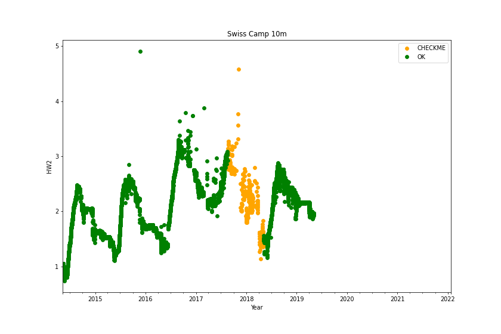
 
|start time|end time|variable|
|-|-|-|
|2016-05-01 00:00:00+00:00|2017-06-01 00:00:00+00:00|OSWR|
 
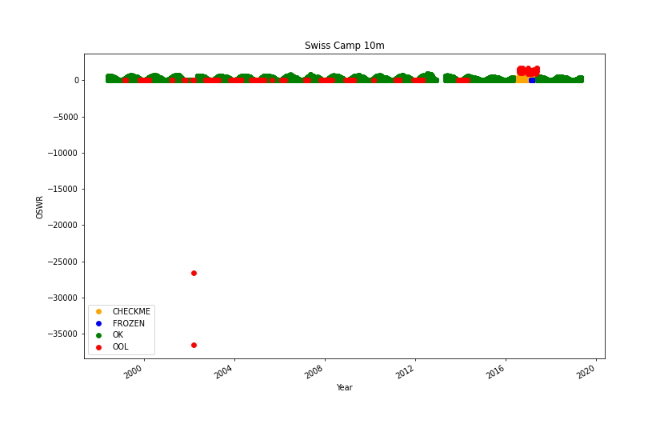
 
|start time|end time|variable|
|-|-|-|
|2018-02-15 00:00:00+00:00|2018-05-05 00:00:00+00:00|P|
 
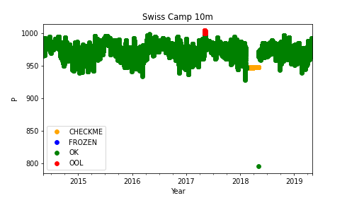
 
|start time|end time|variable|
|-|-|-|
|2015-05-15 00:00:00+00:00|2016-05-15 00:00:00+00:00|TA3|
 
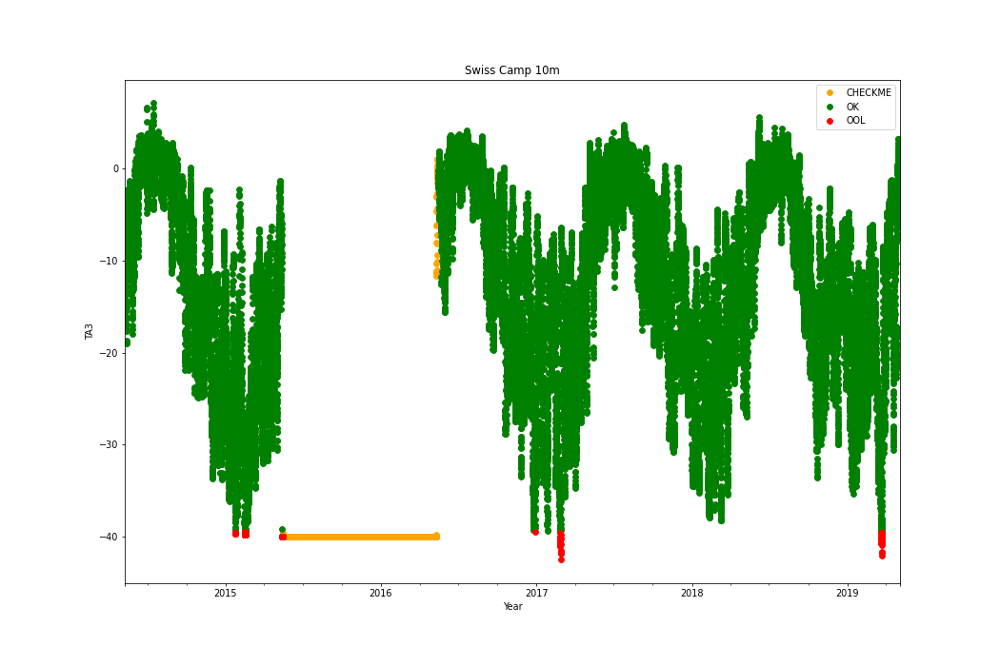
 
## Adjusting data at Swiss Camp 10m
### Adjusting HW1
|start time|end time|operation|value|number of removed samples|
|-|-|-|-|-|
|2014-01-01T00:00:00+00:00|2022-01-23T07:00:00+00:00|air_temp_sonic_correction|0.0|0|
|2014-01-01T00:00:00+00:00|2022-01-23T07:00:00+00:00|biweekly_upper_range_filter|0.5|2151|
|2014-01-01T00:00:00+00:00|2022-01-23T07:00:00+00:00|hampel_filter|2.0|3817|
 
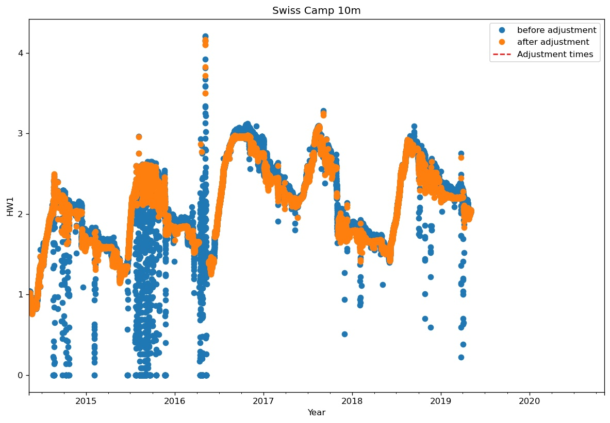
 
### Adjusting HW2
|start time|end time|operation|value|number of removed samples|
|-|-|-|-|-|
|2014-01-01T00:00:00+00:00|2022-01-23T07:00:00+00:00|air_temp_sonic_correction|0.0|0|
|2014-01-01T00:00:00+00:00|2022-01-23T07:00:00+00:00|biweekly_upper_range_filter|0.5|3605|
|2014-01-01T00:00:00+00:00|2022-01-23T07:00:00+00:00|hampel_filter|2.0|2798|
 
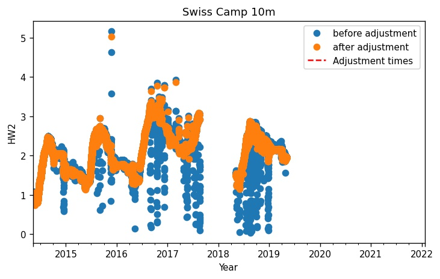
 
## Adjusting data at Swiss Camp 10m
# 1 Swiss Camp
## Manual flagging of data at Swiss Camp
Flagging data:
Warning: HS1 not found
Warning: HS2 not found
|start time|end time|variable|
|-|-|-|
|1995-01-01 00:00:00+00:00|1996-06-23 00:00:00+00:00|HW1|
|1998-06-04 00:00:00+00:00|1999-04-02 00:00:00+00:00|HW1|
 
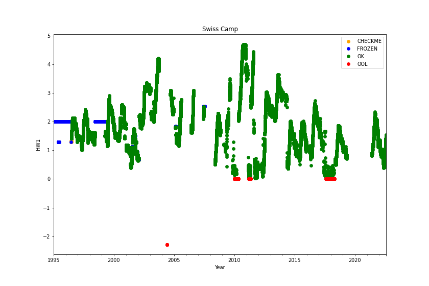
 
|start time|end time|variable|
|-|-|-|
|2011-08-14 00:00:00+00:00|2012-05-24 00:00:00+00:00|HW2|
 
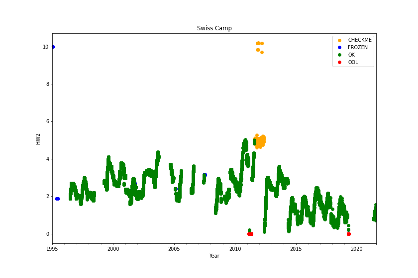
 
|start time|end time|variable|
|-|-|-|
|2009-07-01 00:00:00+00:00|2009-07-01 00:00:00+00:00|ISWR|
|2011-02-15 00:00:00+00:00|2011-05-10 00:00:00+00:00|ISWR|
 
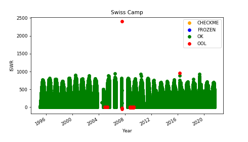
 
|start time|end time|variable|
|-|-|-|
|2009-07-01 00:00:00+00:00|2009-07-01 00:00:00+00:00|OSWR|
|2011-02-15 00:00:00+00:00|2011-05-10 00:00:00+00:00|OSWR|
|2011-08-01 00:00:00+00:00|2012-05-10 00:00:00+00:00|OSWR|
 
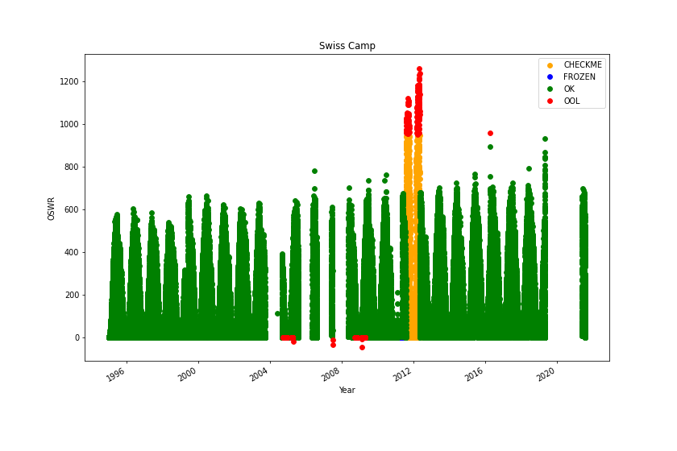
 
|start time|end time|variable|
|-|-|-|
|2015-06-01 00:00:00+00:00|2016-05-01 00:00:00+00:00|RH2|
 
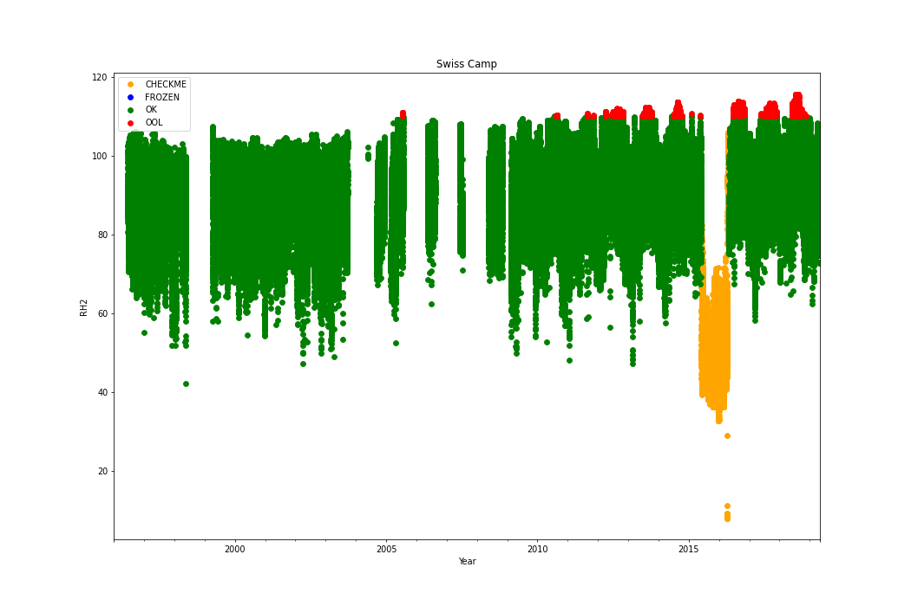
 
|start time|end time|variable|
|-|-|-|
|2015-06-01 00:00:00+00:00|2016-05-01 00:00:00+00:00|VW1|
 
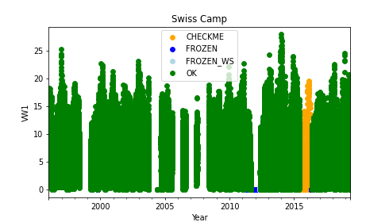
 
## Adjusting data at Swiss Camp
### Adjusting HW1
|start time|end time|operation|value|number of removed samples|
|-|-|-|-|-|
|2009-05-15T00:00:00+00:00|2021-08-05T14:00:00+00:00|air_temp_sonic_correction|0.0|0|
|2009-05-15T00:00:00+00:00|2021-08-05T14:00:00+00:00|biweekly_upper_range_filter|0.5|4199|
|2009-05-15T00:00:00+00:00|2021-08-05T14:00:00+00:00|hampel_filter|2.0|686|
 
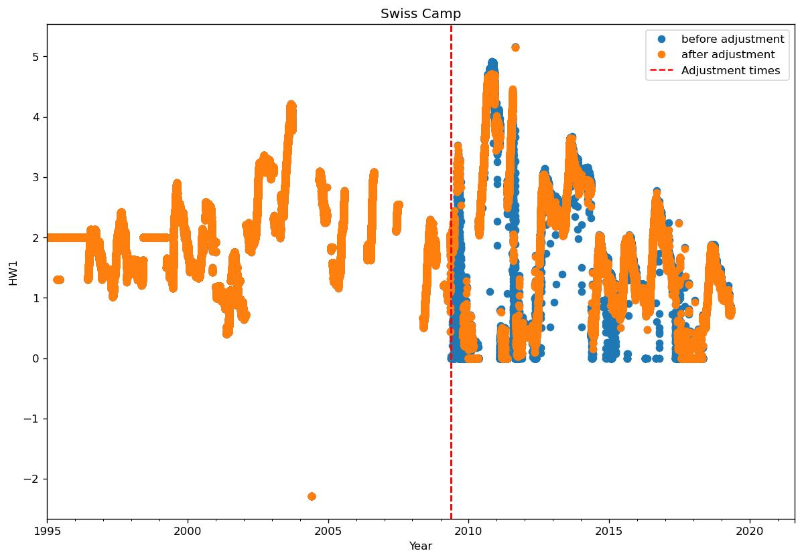
 
### Adjusting HW2
|start time|end time|operation|value|number of removed samples|
|-|-|-|-|-|
|1995-01-12T00:00:00+00:00|2000-01-01T00:00:00+00:00|max_filter|8.0|19148|
|2009-05-15T00:00:00+00:00|2021-08-05T14:00:00+00:00|air_temp_sonic_correction|0.0|0|
|2009-05-15T00:00:00+00:00|2021-08-05T14:00:00+00:00|biweekly_upper_range_filter|0.5|5298|
|2009-05-15T00:00:00+00:00|2021-08-05T14:00:00+00:00|hampel_filter|2.0|3274|
|2018-03-12T00:00:00+00:00|2018-05-12T00:00:00+00:00|max_filter|0.77|13|
 
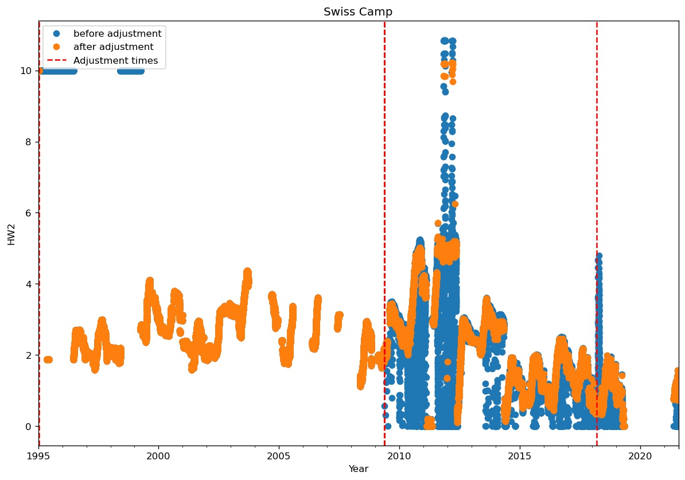
 
## Adjusting data at Swiss Camp
# 2 Crawford Point 1
## Manual flagging of data at Crawford Point 1
Flagging data:
|start time|end time|variable|
|-|-|-|
|2017-07-26 00:00:00+00:00|2020-01-01 00:00:00+00:00|HW2|
 
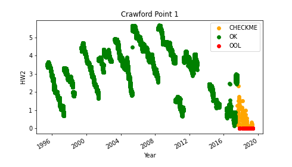
 
|start time|end time|variable|
|-|-|-|
|2005-01-01 00:00:00+00:00|2007-05-10 00:00:00+00:00|TA1|
 
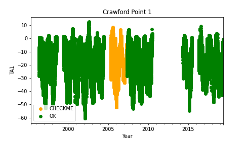
 
|start time|end time|variable|
|-|-|-|
|2017-03-10 00:00:00+00:00|2017-05-22 00:00:00+00:00|TA3|
 
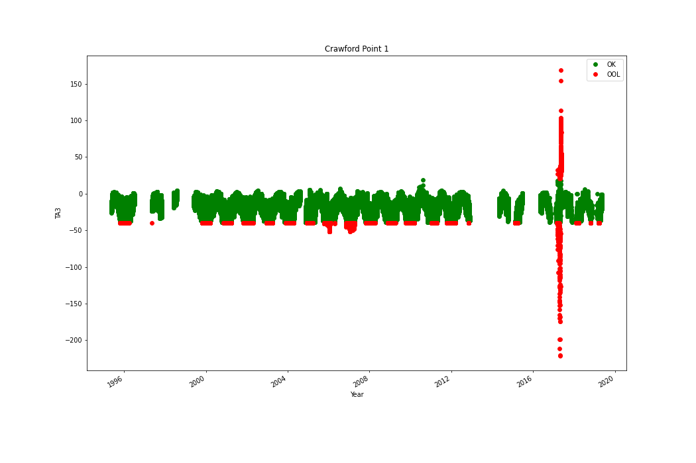
 
|start time|end time|variable|
|-|-|-|
|2004-06-01 00:00:00+00:00|2019-01-01 00:00:00+00:00|TS1|
|1998-01-01 00:00:00+00:00|1999-01-01 00:00:00+00:00|TS1|
|2000-07-29 18:00:00+00:00|2000-08-10 00:00:00+00:00|TS1|
 
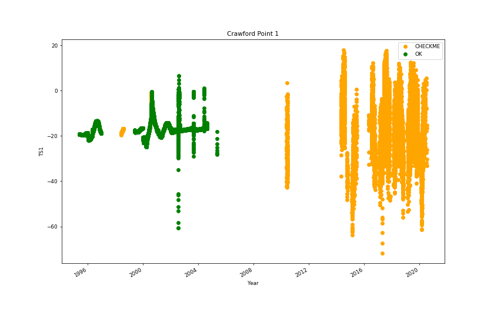
 
|start time|end time|variable|
|-|-|-|
|2010-01-01 00:00:00+00:00|2011-01-01 00:00:00+00:00|TS10|
|2000-08-01 00:00:00+00:00|2000-08-10 00:00:00+00:00|TS10|
|2000-08-01 00:00:00+00:00|2000-08-10 00:00:00+00:00|TS10|
|2004-06-01 00:00:00+00:00|2019-01-01 00:00:00+00:00|TS10|
|1998-01-01 00:00:00+00:00|1999-01-01 00:00:00+00:00|TS10|
 
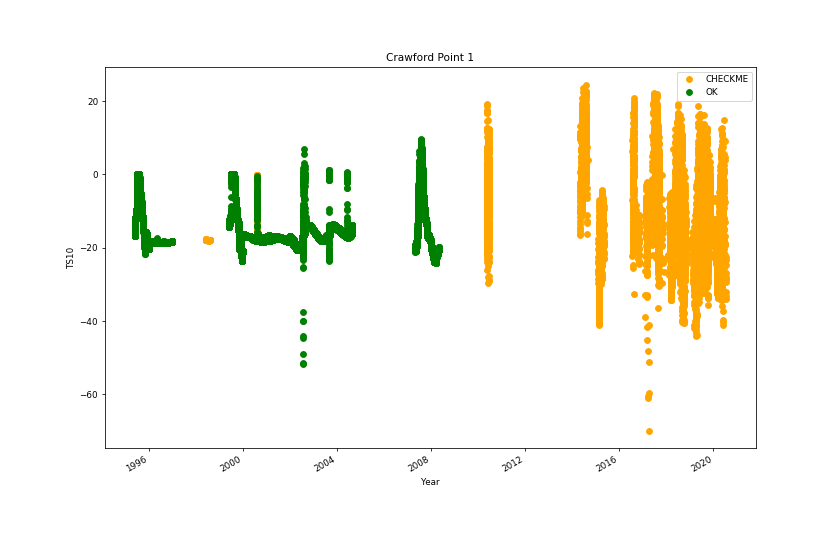
 
|start time|end time|variable|
|-|-|-|
|2010-01-01 00:00:00+00:00|2011-01-01 00:00:00+00:00|TS2|
|2000-08-01 00:00:00+00:00|2000-08-10 00:00:00+00:00|TS2|
|2004-06-01 00:00:00+00:00|2019-01-01 00:00:00+00:00|TS2|
|1998-01-01 00:00:00+00:00|1999-01-01 00:00:00+00:00|TS2|
 
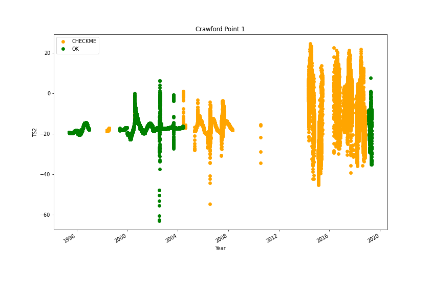
 
|start time|end time|variable|
|-|-|-|
|2010-01-01 00:00:00+00:00|2011-01-01 00:00:00+00:00|TS3|
|2000-08-01 00:00:00+00:00|2000-08-10 00:00:00+00:00|TS3|
|2004-06-01 00:00:00+00:00|2019-01-01 00:00:00+00:00|TS3|
|1998-01-01 00:00:00+00:00|1999-01-01 00:00:00+00:00|TS3|
|2000-10-26 04:00:00+00:00|2000-11-08 00:00:00+00:00|TS3|
|2001-09-05 06:00:00+00:00|2002-08-14 00:00:00+00:00|TS3|
|2003-10-14 08:00:00+00:00|2004-04-21 00:00:00+00:00|TS3|
 
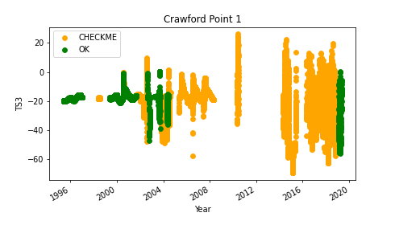
 
|start time|end time|variable|
|-|-|-|
|2010-01-01 00:00:00+00:00|2011-01-01 00:00:00+00:00|TS4|
|2000-08-01 00:00:00+00:00|2000-08-10 00:00:00+00:00|TS4|
|2002-10-15 00:00:00+00:00|2002-11-05 00:00:00+00:00|TS4|
|2003-10-05 00:00:00+00:00|2003-11-30 00:00:00+00:00|TS4|
|2004-06-01 00:00:00+00:00|2019-01-01 00:00:00+00:00|TS4|
|1998-01-01 00:00:00+00:00|1999-01-01 00:00:00+00:00|TS4|
 
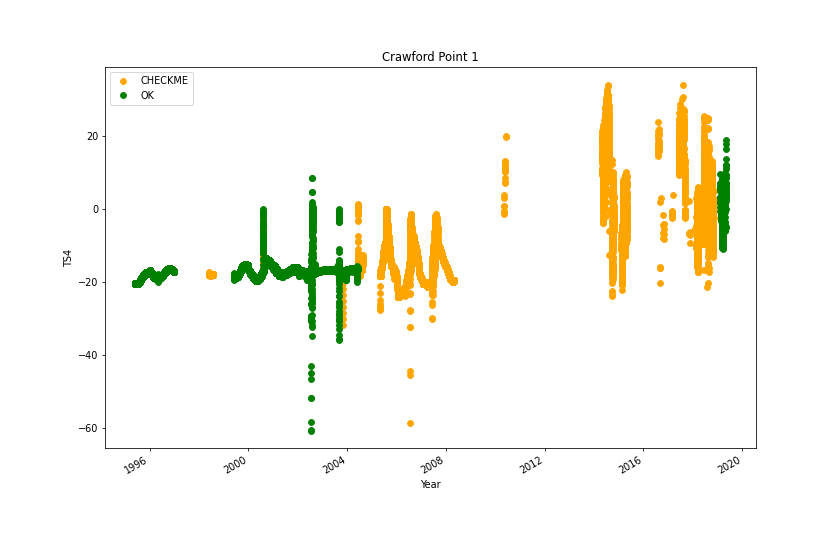
 
|start time|end time|variable|
|-|-|-|
|2010-01-01 00:00:00+00:00|2011-01-01 00:00:00+00:00|TS5|
|2000-08-01 00:00:00+00:00|2000-08-10 00:00:00+00:00|TS5|
|2004-06-01 00:00:00+00:00|2019-01-01 00:00:00+00:00|TS5|
|1998-01-01 00:00:00+00:00|1999-01-01 00:00:00+00:00|TS5|
 
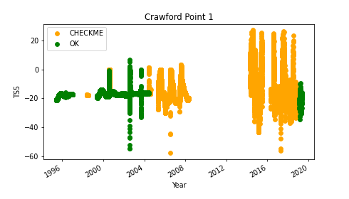
 
|start time|end time|variable|
|-|-|-|
|2010-01-01 00:00:00+00:00|2011-01-01 00:00:00+00:00|TS6|
|2000-08-01 00:00:00+00:00|2000-08-10 00:00:00+00:00|TS6|
|2004-06-01 00:00:00+00:00|2019-01-01 00:00:00+00:00|TS6|
|1998-01-01 00:00:00+00:00|1999-01-01 00:00:00+00:00|TS6|
 
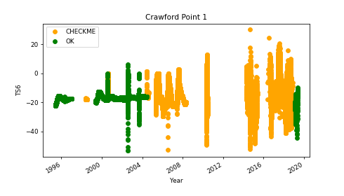
 
|start time|end time|variable|
|-|-|-|
|2010-01-01 00:00:00+00:00|2011-01-01 00:00:00+00:00|TS7|
|2000-08-01 00:00:00+00:00|2000-08-10 00:00:00+00:00|TS7|
|2004-06-01 00:00:00+00:00|2019-01-01 00:00:00+00:00|TS7|
|1998-01-01 00:00:00+00:00|1999-01-01 00:00:00+00:00|TS7|
|2003-09-30 17:00:00+00:00|2003-12-13 00:00:00+00:00|TS7|
 
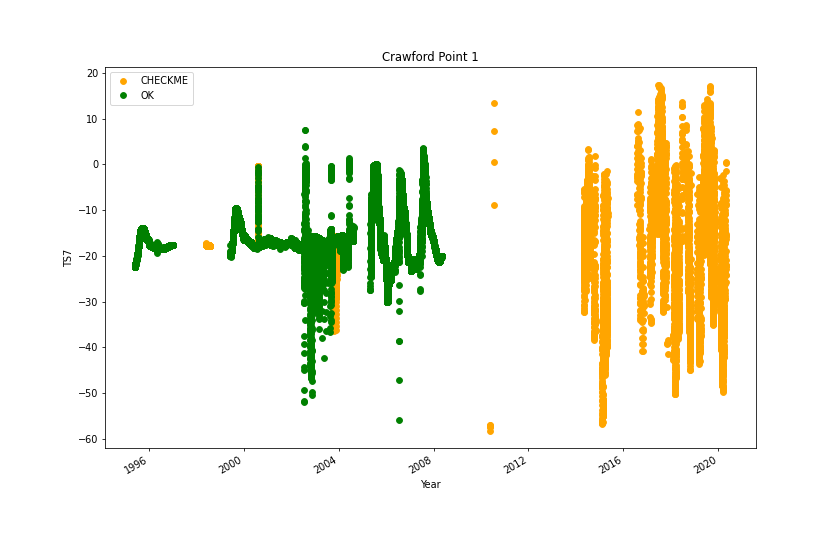
 
|start time|end time|variable|
|-|-|-|
|2010-01-01 00:00:00+00:00|2011-01-01 00:00:00+00:00|TS8|
|2000-08-01 00:00:00+00:00|2000-08-10 00:00:00+00:00|TS8|
|2001-09-10 00:00:00+00:00|2001-12-01 00:00:00+00:00|TS8|
|2002-02-01 00:00:00+00:00|2002-07-20 00:00:00+00:00|TS8|
|2000-10-20 00:00:00+00:00|2000-11-10 00:00:00+00:00|TS8|
|2002-10-15 00:00:00+00:00|2002-11-05 00:00:00+00:00|TS8|
|2003-10-05 00:00:00+00:00|2004-06-30 00:00:00+00:00|TS8|
|2004-06-01 00:00:00+00:00|2019-01-01 00:00:00+00:00|TS8|
|1998-01-01 00:00:00+00:00|1999-01-01 00:00:00+00:00|TS8|
 
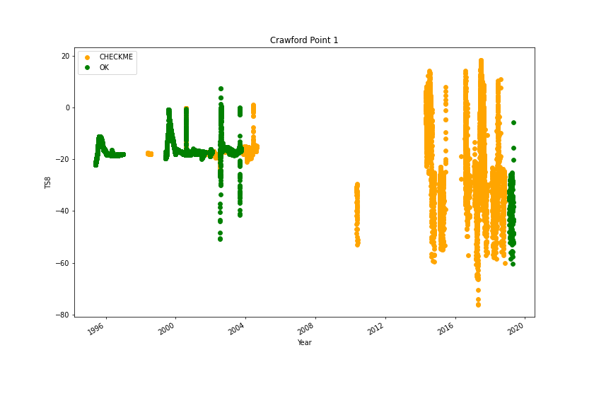
 
|start time|end time|variable|
|-|-|-|
|2010-01-01 00:00:00+00:00|2011-01-01 00:00:00+00:00|TS9|
|2000-08-01 00:00:00+00:00|2000-08-10 00:00:00+00:00|TS9|
|2004-06-01 00:00:00+00:00|2019-01-01 00:00:00+00:00|TS9|
|1998-01-01 00:00:00+00:00|1999-01-01 00:00:00+00:00|TS9|
 
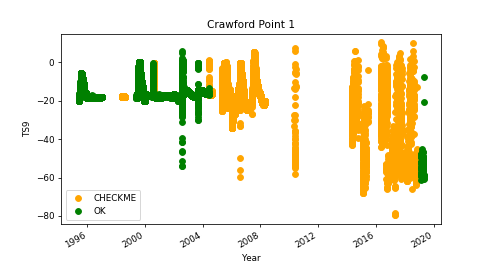
 
## Adjusting data at Crawford Point 1
### Adjusting HW1
|start time|end time|operation|value|number of removed samples|
|-|-|-|-|-|
|2009-05-15T00:00:00+00:00|2019-05-11T16:00:00+00:00|air_temp_sonic_correction|0.0|0|
|2009-05-15T00:00:00+00:00|2019-05-11T16:00:00+00:00|biweekly_upper_range_filter|0.5|17788|
|2009-05-15T00:00:00+00:00|2019-05-11T16:00:00+00:00|hampel_filter|2.0|2108|
 

 
### Adjusting HW2
|start time|end time|operation|value|number of removed samples|
|-|-|-|-|-|
|2009-05-15T00:00:00+00:00|2019-05-11T16:00:00+00:00|air_temp_sonic_correction|0.0|0|
|2009-05-15T00:00:00+00:00|2019-05-11T16:00:00+00:00|biweekly_upper_range_filter|0.5|1825|
|2009-05-15T00:00:00+00:00|2019-05-11T16:00:00+00:00|hampel_filter|2.0|1513|
 
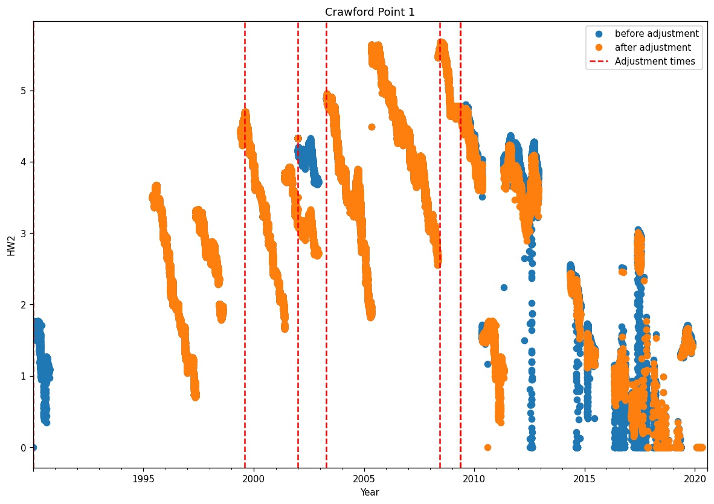
 
## Adjusting data at Crawford Point 1
### Adjusting HS1
|start time|end time|operation|value|number of removed samples|
|-|-|-|-|-|
|19970513T16:00:00+00:00|2019-05-11T16:00:00+00:00|add|1.5|0|
|19980605T00:00:00+00:00|2019-05-11T16:00:00+00:00|add|3.0|0|
|20010526T00:00:00+00:00|2019-05-11T16:00:00+00:00|add|2.0|0|
|20020926T00:00:00+00:00|2019-05-11T16:00:00+00:00|add|1.0|0|
|20030411T00:00:00+00:00|2019-05-11T16:00:00+00:00|add|1.5|0|
|20050501T03:00:00+00:00|2019-05-11T16:00:00+00:00|add|3.0|0|
|20080505T00:00:00+00:00|2019-05-11T16:00:00+00:00|add|3.0|0|
|20091210T00:00:00+00:00|2019-05-11T16:00:00+00:00|add|1.0|0|
 
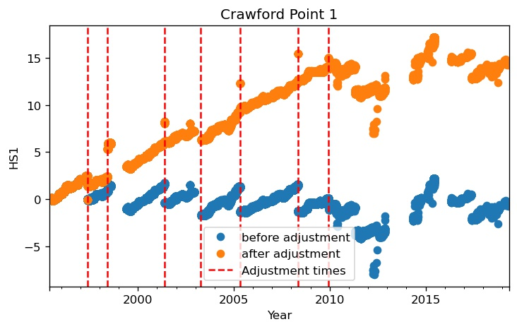
 
### Adjusting HS2
|start time|end time|operation|value|number of removed samples|
|-|-|-|-|-|
|19970513T16:00:00+00:00|2019-05-11T16:00:00+00:00|add|1.5|0|
|19980605T00:00:00+00:00|2019-05-11T16:00:00+00:00|add|3.0|0|
|20010526T00:00:00+00:00|2019-05-11T16:00:00+00:00|add|2.0|0|
|20020926T00:00:00+00:00|2019-05-11T16:00:00+00:00|add|1.0|0|
|20030411T00:00:00+00:00|2019-05-11T16:00:00+00:00|add|1.5|0|
|20050501T03:00:00+00:00|2019-05-11T16:00:00+00:00|add|3.0|0|
|20080505T00:00:00+00:00|2019-05-11T16:00:00+00:00|add|3.0|0|
|20091210T00:00:00+00:00|2019-05-11T16:00:00+00:00|add|1.0|0|
|20100511T00:00:00+00:00|2019-05-11T16:00:00+00:00|add|-2.5|0|
|20110428T00:00:00+00:00|2019-05-11T16:00:00+00:00|add|2.5|0|
 
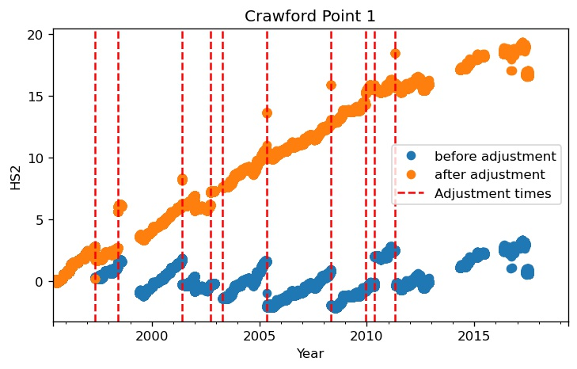
 
# 3 NASA-U
## Manual flagging of data at NASA-U
Flagging data:
|start time|end time|variable|
|-|-|-|
|2013-09-01 00:00:00+00:00|2014-05-21 00:00:00+00:00|HW1|
|2016-10-10 00:00:00+00:00|2018-07-01 00:00:00+00:00|HW1|
 
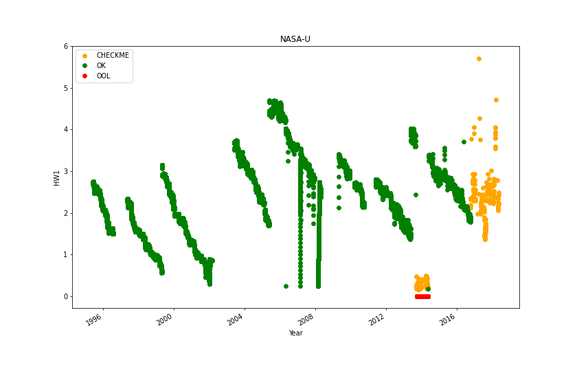
 
|start time|end time|variable|
|-|-|-|
|2016-10-10 00:00:00+00:00|2018-07-01 00:00:00+00:00|HW2|
 
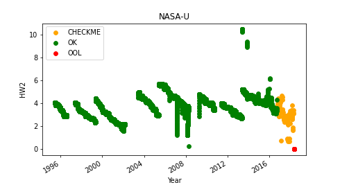
 
|start time|end time|variable|
|-|-|-|
|2011-01-01 00:00:00+00:00|2016-07-01 00:00:00+00:00|P|
|2017-08-01 00:00:00+00:00|2018-12-31 00:00:00+00:00|P|
 
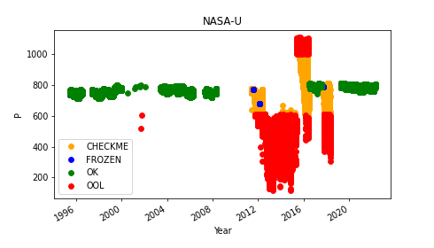
 
|start time|end time|variable|
|-|-|-|
|2017-10-01 00:00:00+00:00|2018-07-01 00:00:00+00:00|RH1|
 
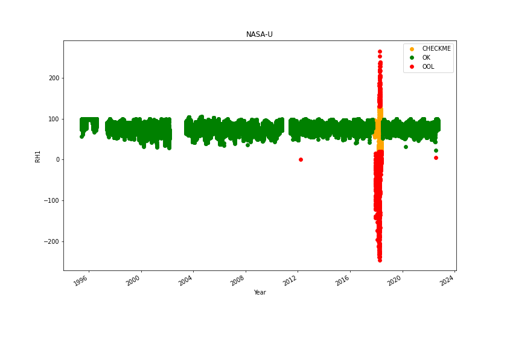
 
|start time|end time|variable|
|-|-|-|
|2011-01-01 00:00:00+00:00|2012-07-01 00:00:00+00:00|RH2|
 
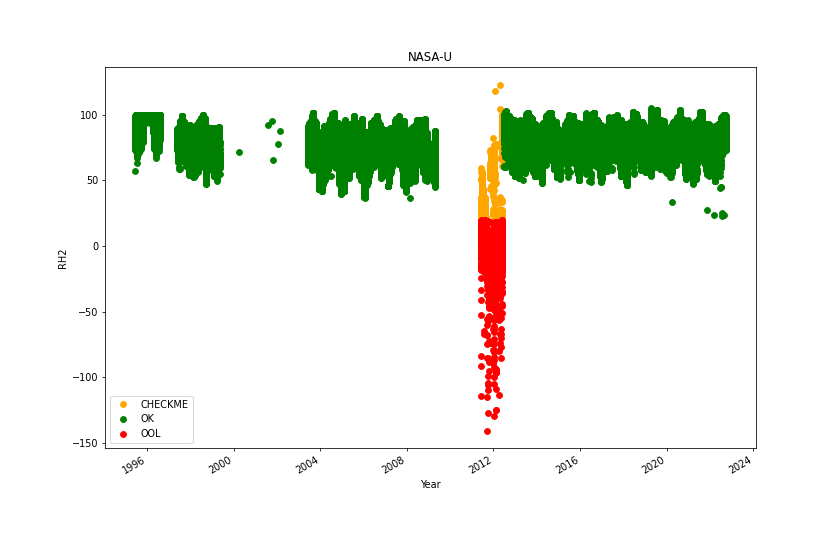
 
|start time|end time|variable|
|-|-|-|
|2017-12-11 00:00:00+00:00|2019-07-01 00:00:00+00:00|TA3|
 
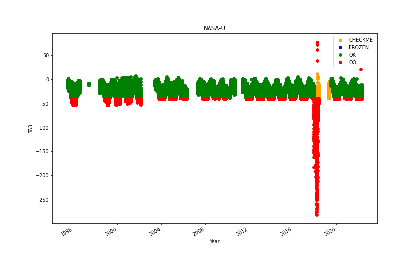
 
|start time|end time|variable|
|-|-|-|
|2011-01-01 00:00:00+00:00|2012-05-25 00:00:00+00:00|TA4|
 
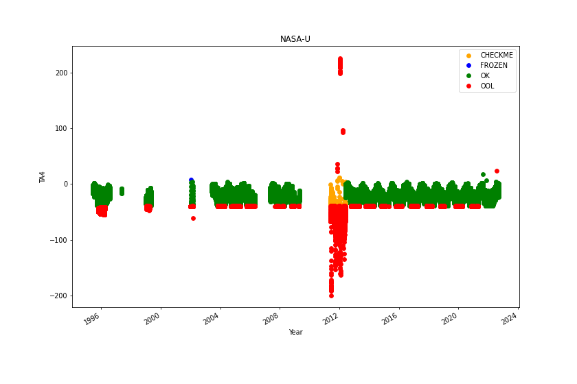
 
## Adjusting data at NASA-U
### Adjusting HW1
|start time|end time|operation|value|number of removed samples|
|-|-|-|-|-|
|2009-05-15T00:00:00+00:00|2022-04-25T23:00:00+00:00|air_temp_sonic_correction|0.0|0|
|2009-05-15T00:00:00+00:00|2022-04-25T23:00:00+00:00|biweekly_upper_range_filter|0.3|2950|
|2009-05-15T00:00:00+00:00|2022-04-25T23:00:00+00:00|hampel_filter|2.0|1913|
 
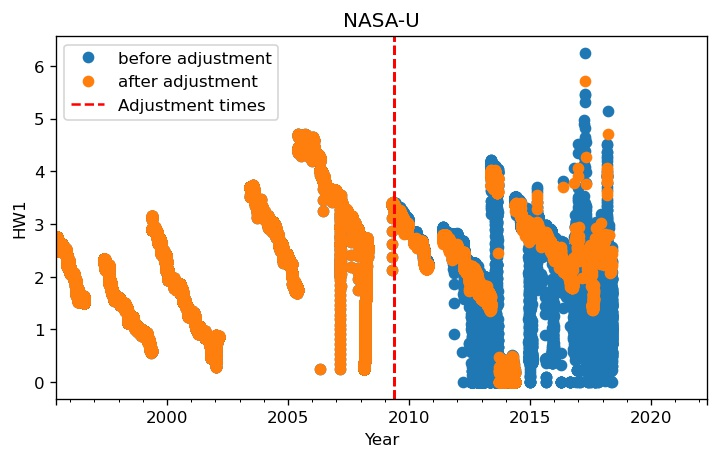
 
### Adjusting HW2
|start time|end time|operation|value|number of removed samples|
|-|-|-|-|-|
|2009-05-15T00:00:00+00:00|2022-04-25T23:00:00+00:00|air_temp_sonic_correction|0.0|0|
|2009-05-15T00:00:00+00:00|2022-04-25T23:00:00+00:00|biweekly_upper_range_filter|0.3|9723|
|2009-05-15T00:00:00+00:00|2022-04-25T23:00:00+00:00|hampel_filter|2.0|2010|
 
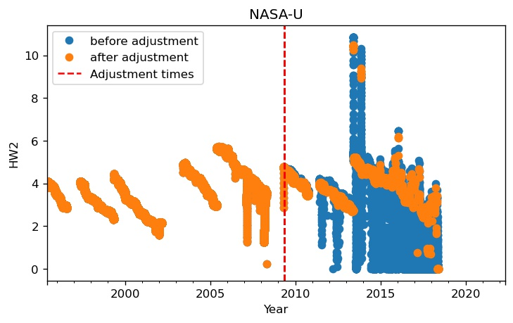
 
## Adjusting data at NASA-U
### Adjusting HS1
|start time|end time|operation|value|number of removed samples|
|-|-|-|-|-|
|19960529T00:00:00+00:00|2022-04-25T23:00:00+00:00|add|1.25|0|
|20030603T16:00:00+00:00|2022-04-25T23:00:00+00:00|add|8.0|0|
|20050525T00:00:00+00:00|2022-04-25T23:00:00+00:00|add|2.5|0|
|20090420T16:00:00+00:00|2022-04-25T23:00:00+00:00|add|1.0|0|
|20110601T22:00:00+00:00|2022-04-25T23:00:00+00:00|add|1.7|0|
|20140531T00:00:00+00:00|2022-04-25T23:00:00+00:00|add|3.0|0|
 
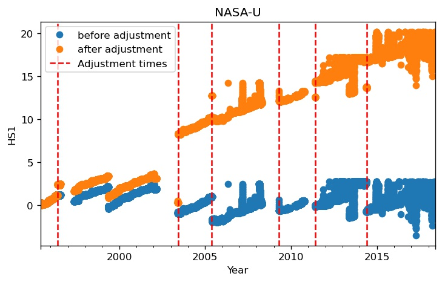
 
### Adjusting HS2
|start time|end time|operation|value|number of removed samples|
|-|-|-|-|-|
|19960529T00:00:00+00:00|2022-04-25T23:00:00+00:00|add|1.25|0|
|19970522T00:00:00+00:00|2022-04-25T23:00:00+00:00|add|1.25|0|
|20030603T16:00:00+00:00|2022-04-25T23:00:00+00:00|add|4.0|0|
|20050525T00:00:00+00:00|2022-04-25T23:00:00+00:00|add|2.0|0|
|20090420T16:00:00+00:00|2022-04-25T23:00:00+00:00|add|4.7|0|
|20110601T22:00:00+00:00|2022-04-25T23:00:00+00:00|add|1.58|0|
|20150115T00:00:00+00:00|2022-04-25T23:00:00+00:00|add|3.5|0|
 
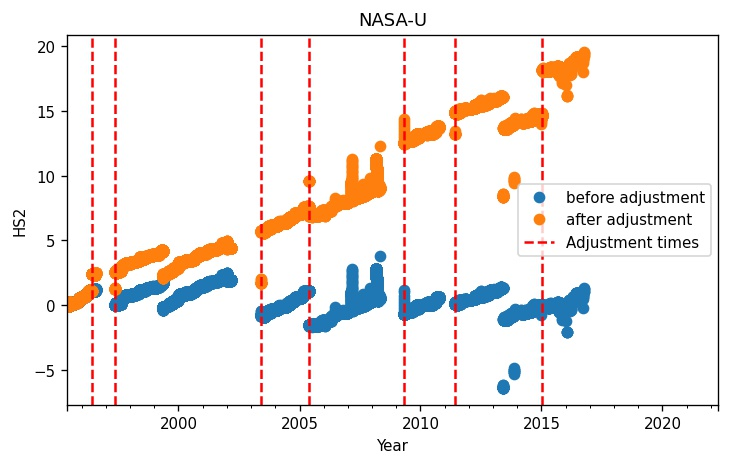
 
# 4 GITS
## Manual flagging of data at GITS
Flagging data:
|start time|end time|variable|
|-|-|-|
|2015-08-23 00:00:00+00:00|2016-04-06 00:00:00+00:00|HW1|
|2016-06-07 00:00:00+00:00|2018-05-15 00:00:00+00:00|HW1|
 
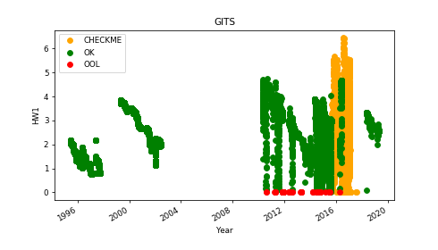
 
|start time|end time|variable|
|-|-|-|
|2007-01-01 00:00:00+00:00|2014-05-01 00:00:00+00:00|P|
|1995-01-01 00:00:00+00:00|1996-05-01 00:00:00+00:00|P|
 
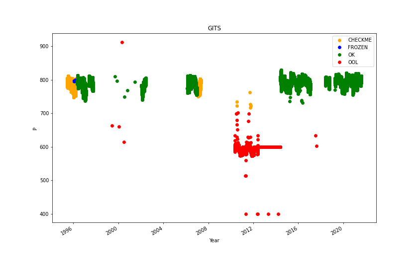
 
|start time|end time|variable|
|-|-|-|
|2010-01-01 00:00:00+00:00|2012-05-26 00:00:00+00:00|RH1|
 
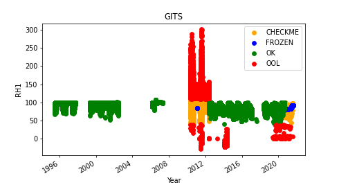
 
|start time|end time|variable|
|-|-|-|
|2010-01-01 00:00:00+00:00|2012-05-26 00:00:00+00:00|TA3|
|2014-04-15 00:00:00+00:00|2014-05-21 00:00:00+00:00|TA3|
 
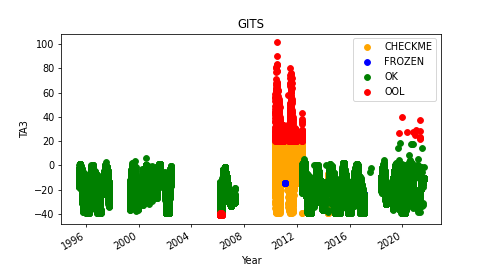
 
|start time|end time|variable|
|-|-|-|
|2007-01-01 00:00:00+00:00|2014-05-01 00:00:00+00:00|VW2|
 
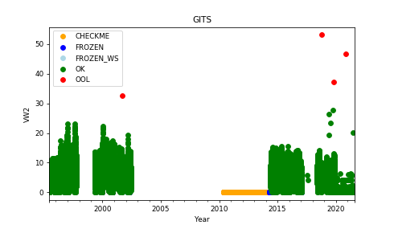
 
## Adjusting data at GITS
### Adjusting HW1
|start time|end time|operation|value|number of removed samples|
|-|-|-|-|-|
|2009-05-15T00:00:00+00:00|2021-08-13T11:00:00+00:00|air_temp_sonic_correction|0.0|6020|
|2009-05-15T00:00:00+00:00|2021-08-13T11:00:00+00:00|biweekly_upper_range_filter|0.5|5592|
|2009-05-15T00:00:00+00:00|2021-08-13T11:00:00+00:00|hampel_filter|2.0|2038|
 
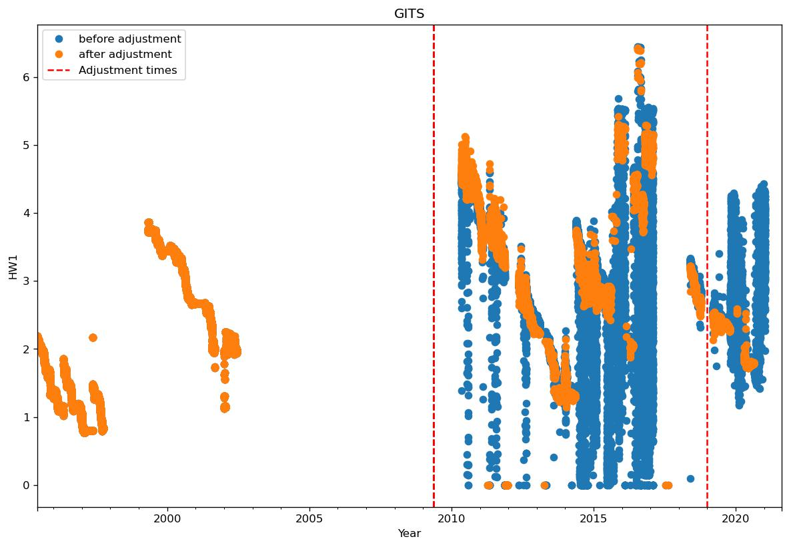
 
### Adjusting HW2
|start time|end time|operation|value|number of removed samples|
|-|-|-|-|-|
|2009-05-15T00:00:00+00:00|2021-08-13T11:00:00+00:00|air_temp_sonic_correction|0.0|5883|
|2009-05-15T00:00:00+00:00|2021-08-13T11:00:00+00:00|biweekly_upper_range_filter|0.5|1570|
|2009-05-15T00:00:00+00:00|2021-08-13T11:00:00+00:00|hampel_filter|2.0|2440|
 
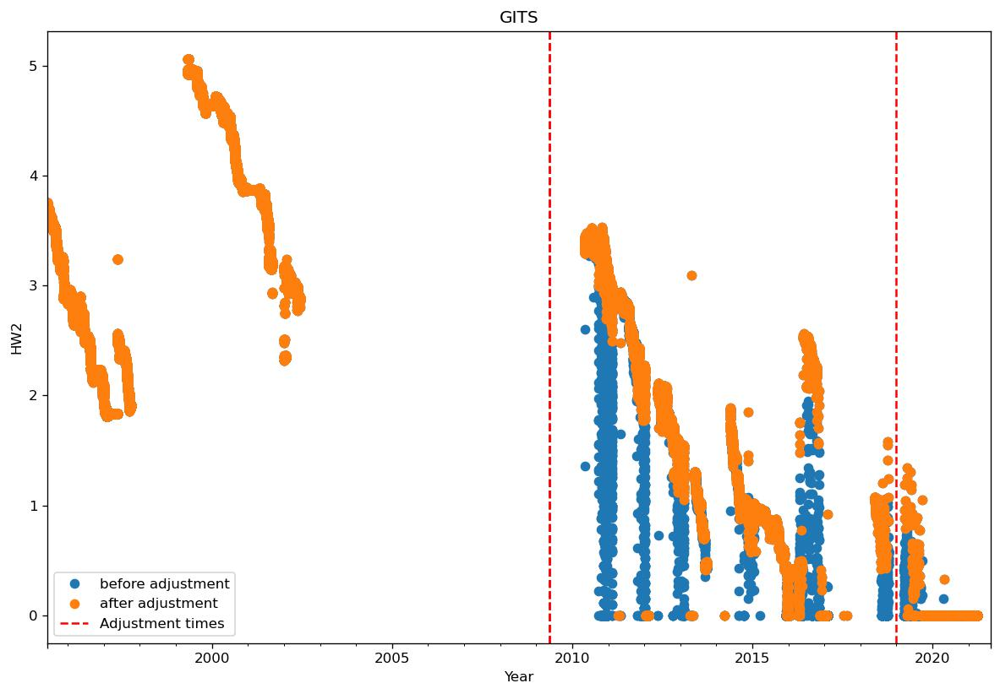
 
## Adjusting data at GITS
### Adjusting HS1
|start time|end time|operation|value|number of removed samples|
|-|-|-|-|-|
|19970306T00:00:00+00:00|2021-08-13T11:00:00+00:00|add|1.25|0|
|19990515T00:00:00+00:00|2021-08-13T11:00:00+00:00|add|1.25|0|
|20010515T00:00:00+00:00|2021-08-13T11:00:00+00:00|add|1.25|0|
|20100515T00:00:00+00:00|2021-08-13T11:00:00+00:00|add|10.25|0|
|20140515T00:00:00+00:00|2021-08-13T11:00:00+00:00|add|1.25|0|
|20160515T00:00:00+00:00|2021-08-13T11:00:00+00:00|add|1.25|0|
 
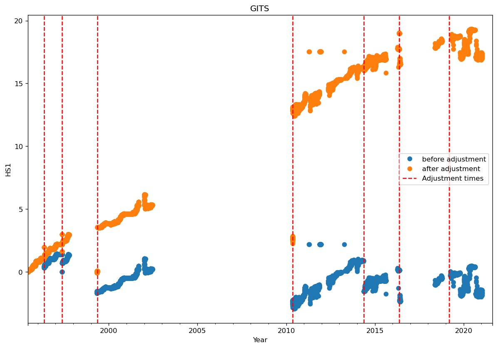
 
### Adjusting HS2
|start time|end time|operation|value|number of removed samples|
|-|-|-|-|-|
|19970306T00:00:00+00:00|2021-08-13T11:00:00+00:00|add|1.25|0|
|19990515T00:00:00+00:00|2021-08-13T11:00:00+00:00|add|1.25|0|
|20010515T00:00:00+00:00|2021-08-13T11:00:00+00:00|add|1.25|0|
|20100515T00:00:00+00:00|2021-08-13T11:00:00+00:00|add|10.25|0|
|20140515T00:00:00+00:00|2021-08-13T11:00:00+00:00|add|1.25|0|
|20160515T00:00:00+00:00|2021-08-13T11:00:00+00:00|add|1.25|0|
 
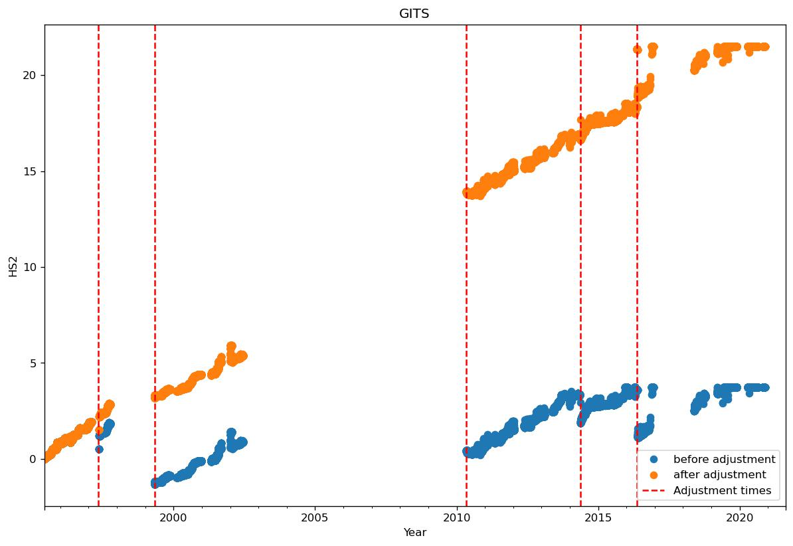
 
### Adjusting TA3
|start time|end time|operation|value|number of removed samples|
|-|-|-|-|-|
|19900101T00:00:00+00:00|2021-08-13T11:00:00+00:00|min_filter|-39.4|114|
|20050101T00:00:00+00:00|20080101T00:00:00+00:00|add|-2.8|0|
 
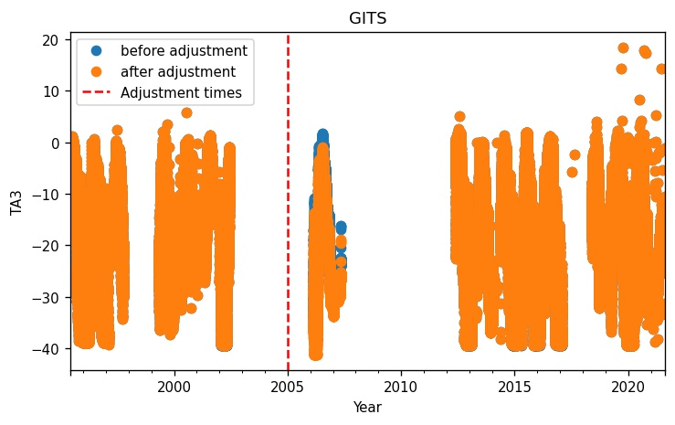
 
### Adjusting TA4
|start time|end time|operation|value|number of removed samples|
|-|-|-|-|-|
|19900101T00:00:00+00:00|2021-08-13T11:00:00+00:00|min_filter|-39.4|116|
|20010101T00:00:00+00:00|20080101T00:00:00+00:00|add|-2.8|0|
 
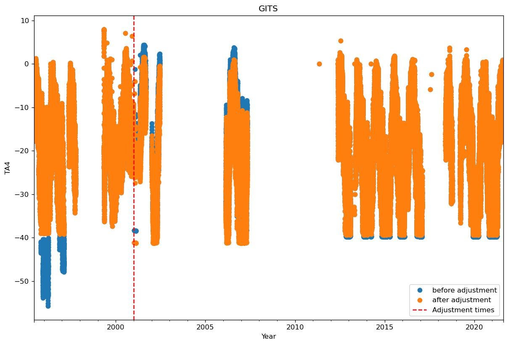
 
# 5 Humboldt
## Manual flagging of data at Humboldt
Flagging data:
|start time|end time|variable|
|-|-|-|
|1990-01-01 00:00:00+00:00|1996-07-01 00:00:00+00:00|TA1|
 
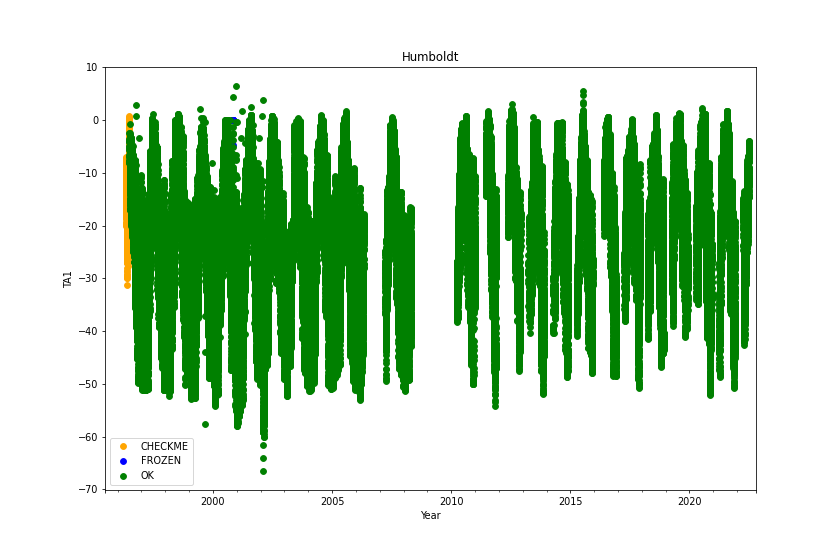
 
|start time|end time|variable|
|-|-|-|
|2007-03-01 00:00:00+00:00|2007-05-04 00:00:00+00:00|TA3|
 
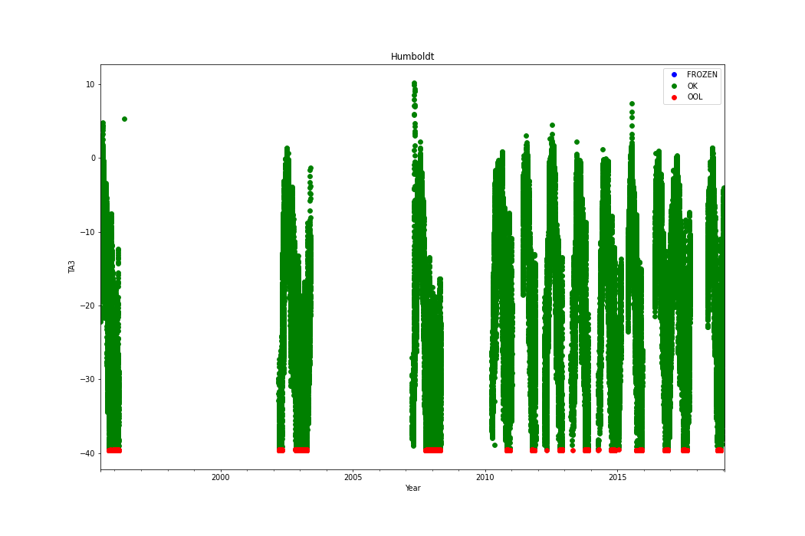
 
## Adjusting data at Humboldt
### Adjusting HW1
|start time|end time|operation|value|number of removed samples|
|-|-|-|-|-|
|2009-05-15T00:00:00+00:00|2021-12-24T20:00:00+00:00|air_temp_sonic_correction|0.0|0|
|2009-05-15T00:00:00+00:00|2021-12-24T20:00:00+00:00|biweekly_upper_range_filter|0.3|3071|
|2009-05-15T00:00:00+00:00|2021-12-24T20:00:00+00:00|hampel_filter|2.0|2688|
 
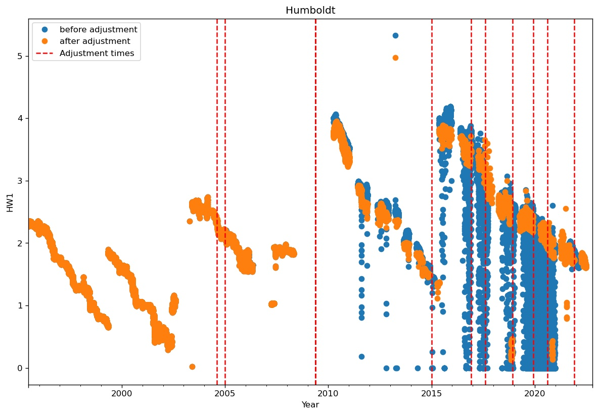
 
### Adjusting HW2
|start time|end time|operation|value|number of removed samples|
|-|-|-|-|-|
|2009-05-15T00:00:00+00:00|2021-12-24T20:00:00+00:00|air_temp_sonic_correction|0.0|0|
|2009-05-15T00:00:00+00:00|2021-12-24T20:00:00+00:00|biweekly_upper_range_filter|0.3|3270|
|2009-05-15T00:00:00+00:00|2021-12-24T20:00:00+00:00|hampel_filter|2.0|3725|
 
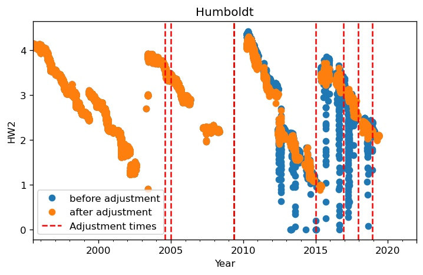
 
## Adjusting data at Humboldt
### Adjusting HS1
|start time|end time|operation|value|number of removed samples|
|-|-|-|-|-|
|20030522T00:00:00+00:00|2021-12-24T20:00:00+00:00|add|2.0|0|
|20100301T00:00:00+00:00|2021-12-24T20:00:00+00:00|add|2.0|0|
|20150326T00:00:00+00:00|2021-12-24T20:00:00+00:00|add|2.0|0|
 
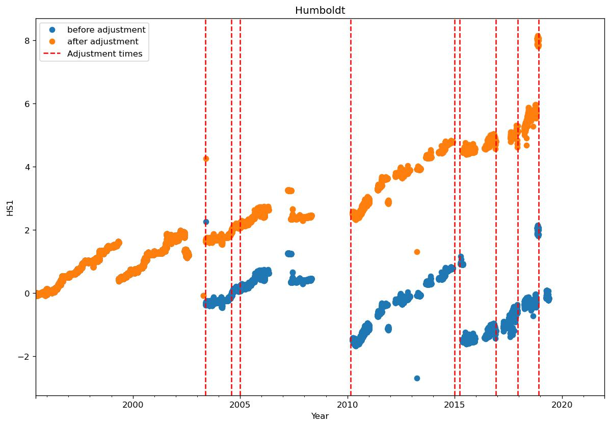
 
### Adjusting HS2
|start time|end time|operation|value|number of removed samples|
|-|-|-|-|-|
|20030522T00:00:00+00:00|2021-12-24T20:00:00+00:00|add|2.0|0|
|20100301T00:00:00+00:00|2021-12-24T20:00:00+00:00|add|2.0|0|
|20150326T00:00:00+00:00|2021-12-24T20:00:00+00:00|add|2.0|0|
 
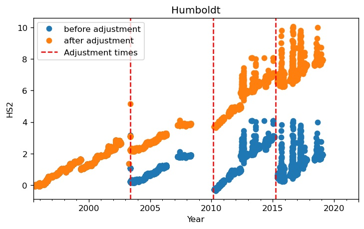
 
# 6 Summit
## Manual flagging of data at Summit
Flagging data:
|start time|end time|variable|
|-|-|-|
|2017-11-17 00:00:00+00:00|2018-02-23 00:00:00+00:00|HW1|
|2018-11-10 00:00:00+00:00|2019-06-09 00:00:00+00:00|HW1|
 
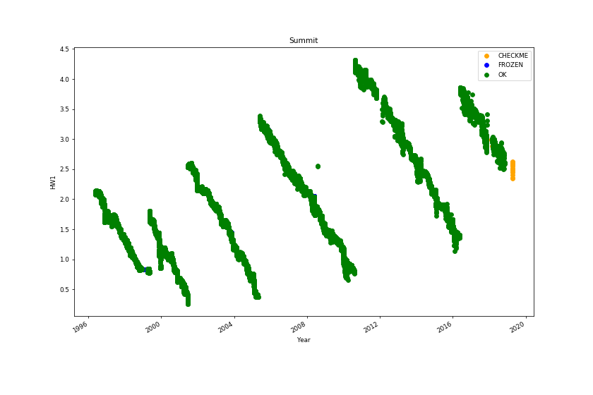
 
|start time|end time|variable|
|-|-|-|
|2017-12-17 00:00:00+00:00|2018-02-19 00:00:00+00:00|HW2|
|2018-11-20 00:00:00+00:00|2019-04-09 00:00:00+00:00|HW2|
 
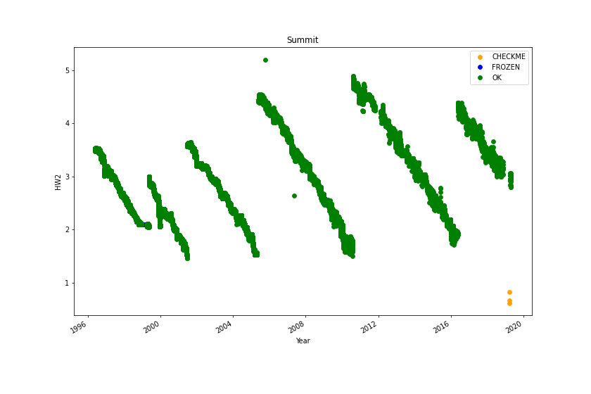
 
|start time|end time|variable|
|-|-|-|
|1997-05-21 00:00:00+00:00|1998-07-01 00:00:00+00:00|TA3|
 
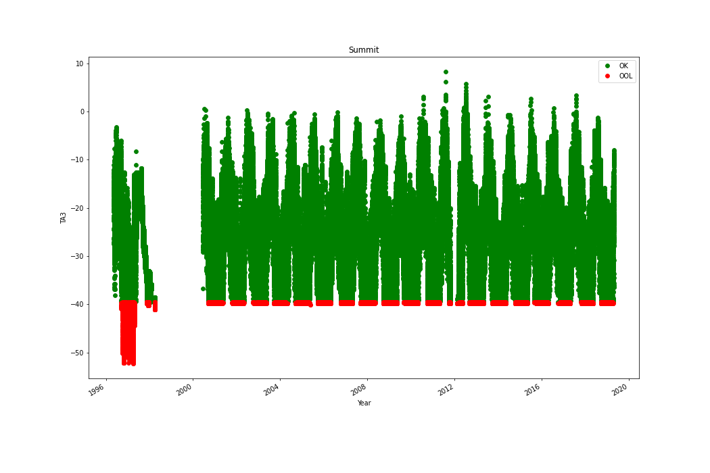
 
|start time|end time|variable|
|-|-|-|
|2010-05-18 00:00:00+00:00|2022-01-01 00:00:00+00:00|TS1|
|1999-05-01 00:00:00+00:00|1999-05-15 00:00:00+00:00|TS1|
 
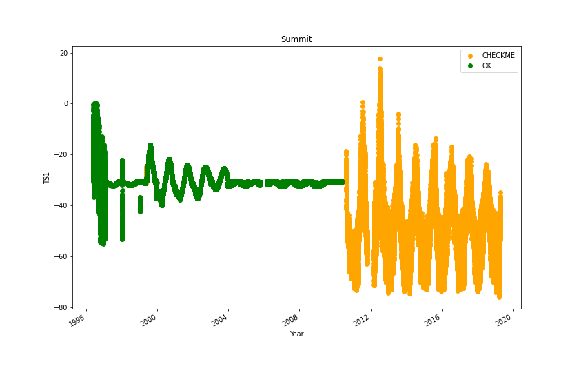
 
|start time|end time|variable|
|-|-|-|
|2010-05-18 00:00:00+00:00|2022-01-01 00:00:00+00:00|TS10|
|1999-05-01 00:00:00+00:00|1999-05-15 00:00:00+00:00|TS10|
 
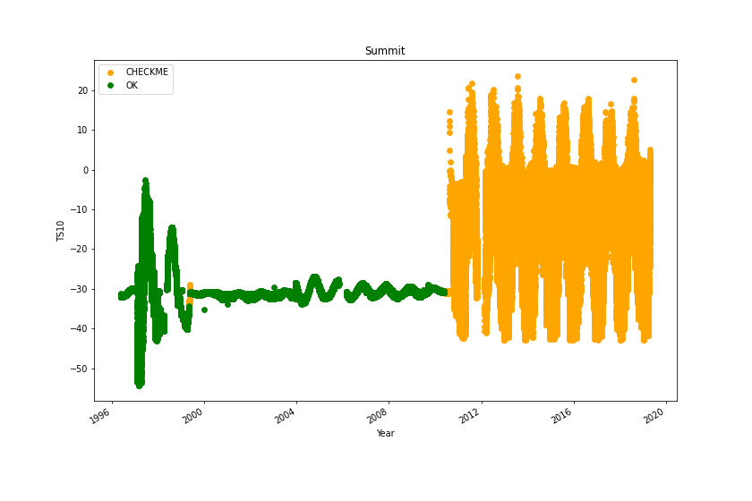
 
|start time|end time|variable|
|-|-|-|
|2010-05-18 00:00:00+00:00|2022-01-01 00:00:00+00:00|TS2|
|1999-05-01 00:00:00+00:00|1999-05-15 00:00:00+00:00|TS2|
 
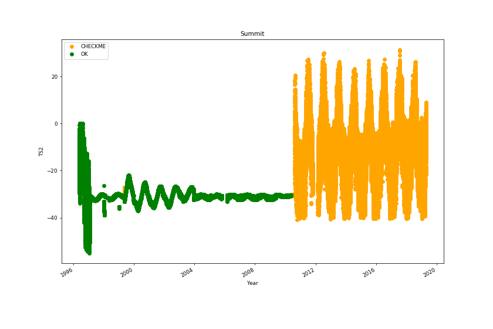
 
|start time|end time|variable|
|-|-|-|
|2010-05-18 00:00:00+00:00|2022-01-01 00:00:00+00:00|TS3|
|1999-05-01 00:00:00+00:00|1999-05-15 00:00:00+00:00|TS3|
 
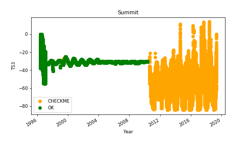
 
|start time|end time|variable|
|-|-|-|
|2010-05-18 00:00:00+00:00|2022-01-01 00:00:00+00:00|TS4|
|1999-05-01 00:00:00+00:00|1999-05-15 00:00:00+00:00|TS4|
 
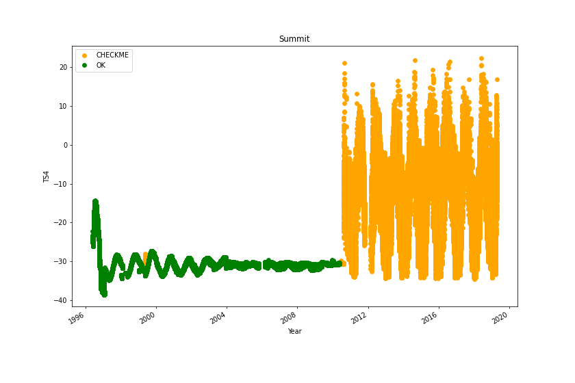
 
|start time|end time|variable|
|-|-|-|
|2010-05-18 00:00:00+00:00|2022-01-01 00:00:00+00:00|TS5|
|1999-05-01 00:00:00+00:00|1999-05-15 00:00:00+00:00|TS5|
 
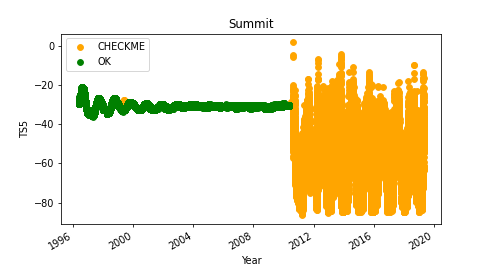
 
|start time|end time|variable|
|-|-|-|
|2010-05-18 00:00:00+00:00|2022-01-01 00:00:00+00:00|TS6|
|1999-05-01 00:00:00+00:00|1999-05-15 00:00:00+00:00|TS6|
 
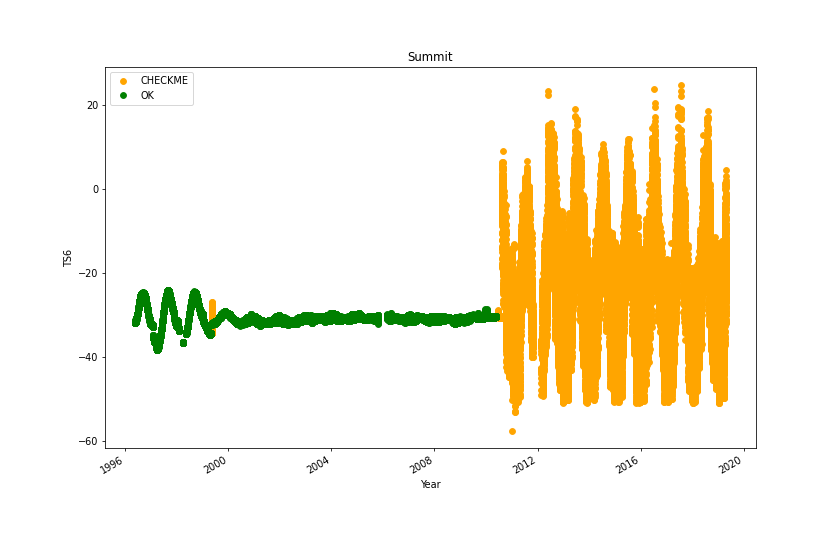
 
|start time|end time|variable|
|-|-|-|
|2010-05-18 00:00:00+00:00|2022-01-01 00:00:00+00:00|TS7|
|1999-05-01 00:00:00+00:00|1999-05-15 00:00:00+00:00|TS7|
 
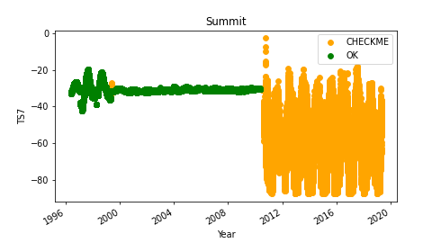
 
|start time|end time|variable|
|-|-|-|
|2010-05-18 00:00:00+00:00|2022-01-01 00:00:00+00:00|TS8|
|1999-05-01 00:00:00+00:00|1999-05-15 00:00:00+00:00|TS8|
 
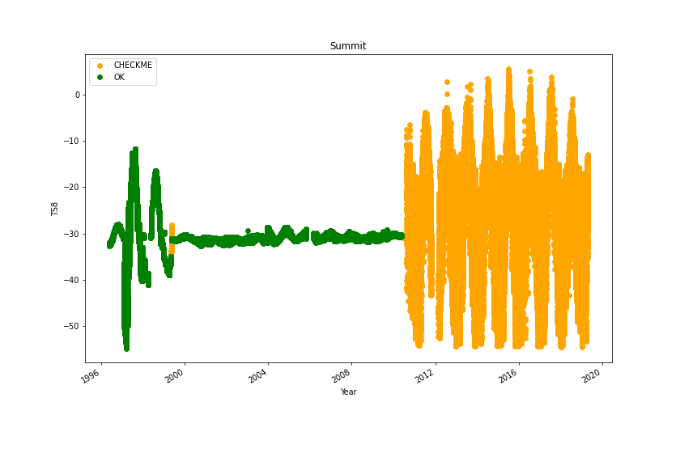
 
|start time|end time|variable|
|-|-|-|
|2010-05-18 00:00:00+00:00|2022-01-01 00:00:00+00:00|TS9|
|1999-05-01 00:00:00+00:00|1999-05-15 00:00:00+00:00|TS9|
 
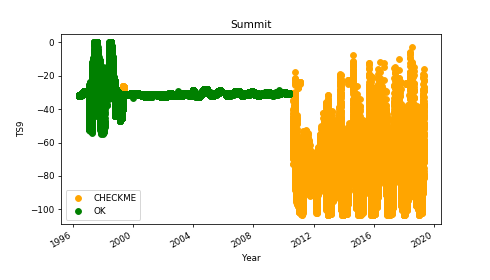
 
## Adjusting data at Summit
### Adjusting HW1
|start time|end time|operation|value|number of removed samples|
|-|-|-|-|-|
|2009-05-15T00:00:00+00:00|2022-04-25T23:00:00+00:00|air_temp_sonic_correction|0.0|0|
|2009-05-15T00:00:00+00:00|2022-04-25T23:00:00+00:00|biweekly_upper_range_filter|0.3|4990|
|2009-05-15T00:00:00+00:00|2022-04-25T23:00:00+00:00|hampel_filter|2.0|5705|
 
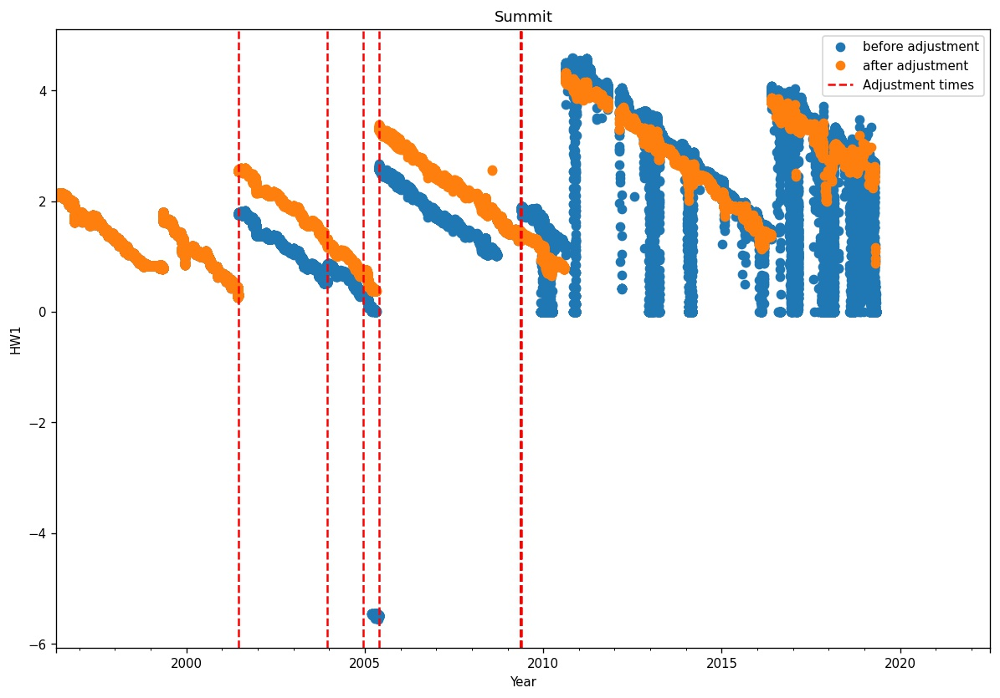
 
### Adjusting HW2
|start time|end time|operation|value|number of removed samples|
|-|-|-|-|-|
|2009-05-15T00:00:00+00:00|2022-04-25T23:00:00+00:00|air_temp_sonic_correction|0.0|0|
|2009-05-15T00:00:00+00:00|2022-04-25T23:00:00+00:00|biweekly_upper_range_filter|0.3|10020|
|2009-05-15T00:00:00+00:00|2022-04-25T23:00:00+00:00|hampel_filter|2.0|4187|
 
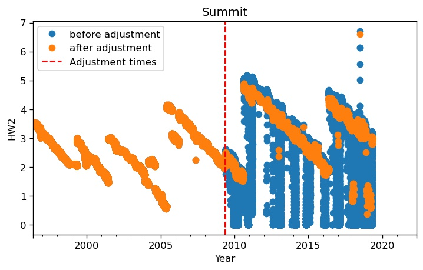
 
## Adjusting data at Summit
### Adjusting HS1
|start time|end time|operation|value|number of removed samples|
|-|-|-|-|-|
|2000-06-09T00:00:00+00:00|2022-04-25T23:00:00+00:00|add|0.8|0|
|2001-06-10T00:00:00+00:00|2022-04-25T23:00:00+00:00|add|2.0|0|
|2005-05-23T00:00:00+00:00|2022-04-25T23:00:00+00:00|add|2.5|0|
|2008-09-13T21:00:00+00:00|2022-04-25T23:00:00+00:00|add|0.5|0|
|2009-05-19T21:00:00+00:00|2022-04-25T23:00:00+00:00|add|0.5|0|
|2010-08-16T21:00:00+00:00|2022-04-25T23:00:00+00:00|add|3.1|0|
|2016-05-22T21:00:00+00:00|2022-04-25T23:00:00+00:00|add|2.9|0|
 
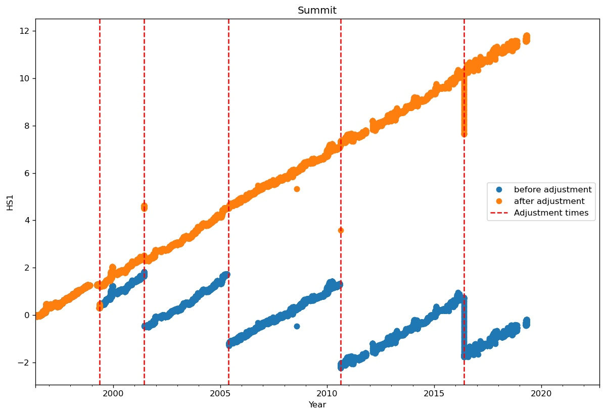
 
### Adjusting HS2
|start time|end time|operation|value|number of removed samples|
|-|-|-|-|-|
|2000-05-09T00:00:00+00:00|2022-04-25T23:00:00+00:00|add|2.2|0|
|2001-06-10T12:00:00+00:00|2022-04-25T23:00:00+00:00|add|2.1|0|
|2005-05-26T14:00:00+00:00|2022-04-25T23:00:00+00:00|add|2.5|0|
|2010-08-18T14:00:00+00:00|2022-04-25T23:00:00+00:00|add|3.4|0|
|2016-05-22T14:00:00+00:00|2022-04-25T23:00:00+00:00|add|2.5|0|
 
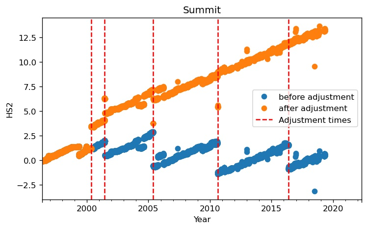
 
### Adjusting P
|start time|end time|operation|value|number of removed samples|
|-|-|-|-|-|
|2016-05-22T00:00:00+00:00|2022-04-25T23:00:00+00:00|add|-61.0|0|
 
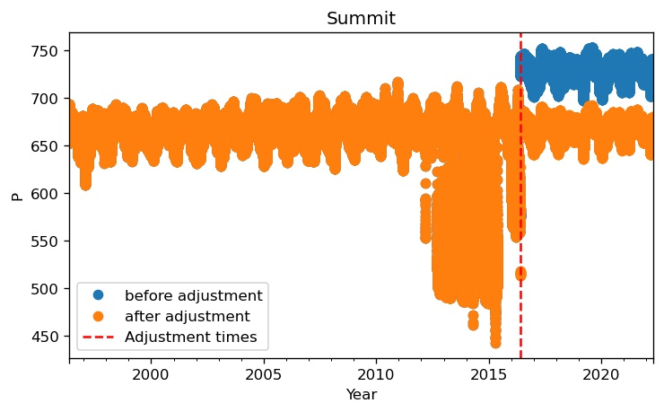
 
# 7 Tunu-N
## Manual flagging of data at Tunu-N
Flagging data:
|start time|end time|variable|
|-|-|-|
|2011-06-10 00:00:00+00:00|2013-05-23 00:00:00+00:00|HW1|
 
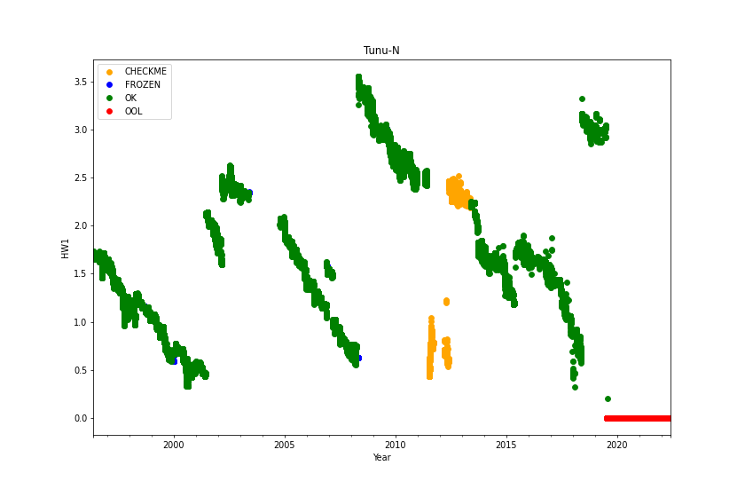
 
|start time|end time|variable|
|-|-|-|
|2011-06-10 00:00:00+00:00|2013-05-23 00:00:00+00:00|HW2|
 
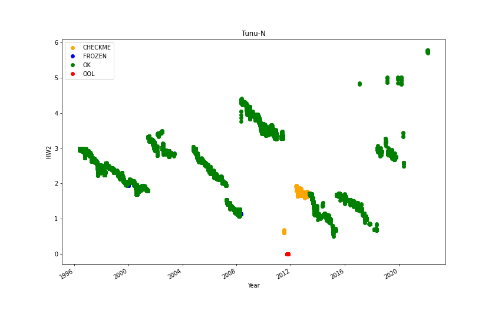
 
|start time|end time|variable|
|-|-|-|
|2011-01-01 00:00:00+00:00|2013-01-01 00:00:00+00:00|TA1|
 
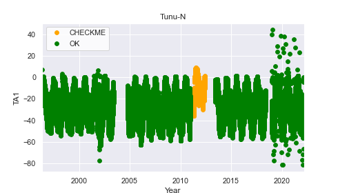
 
|start time|end time|variable|
|-|-|-|
|2011-01-01 00:00:00+00:00|2013-01-01 00:00:00+00:00|TA2|
 
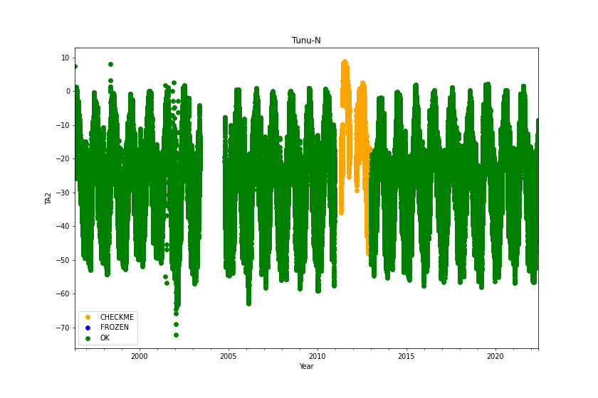
 
|start time|end time|variable|
|-|-|-|
|2011-01-01 00:00:00+00:00|2013-01-01 00:00:00+00:00|TA3|
 
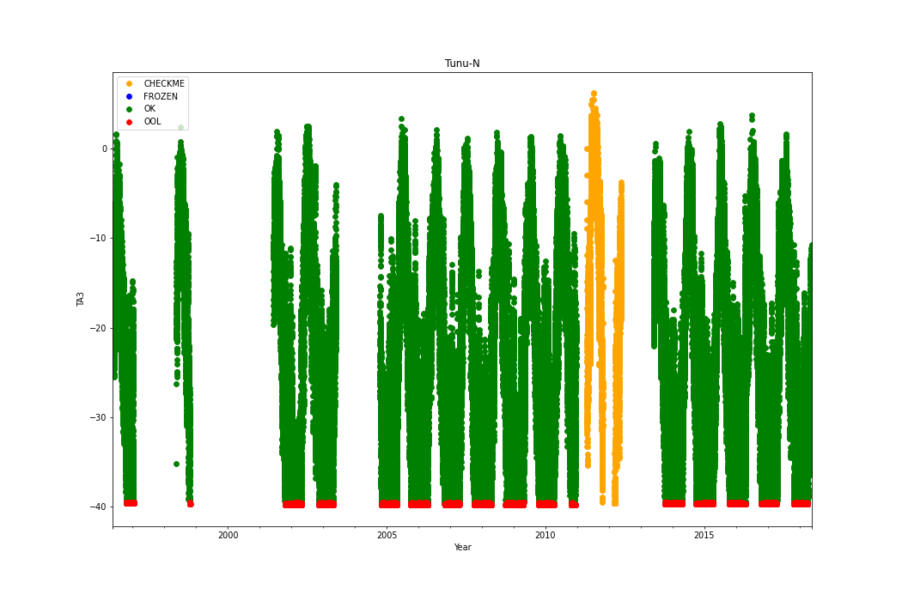
 
|start time|end time|variable|
|-|-|-|
|2011-01-01 00:00:00+00:00|2013-01-01 00:00:00+00:00|TA4|
 
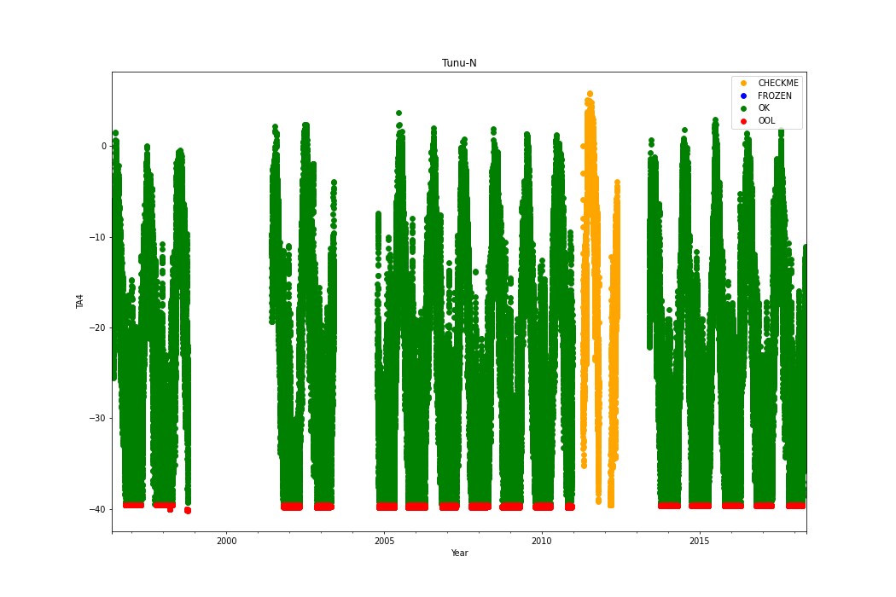
 
|start time|end time|variable|
|-|-|-|
|2011-01-01 00:00:00+00:00|2013-01-01 00:00:00+00:00|VW1|
 
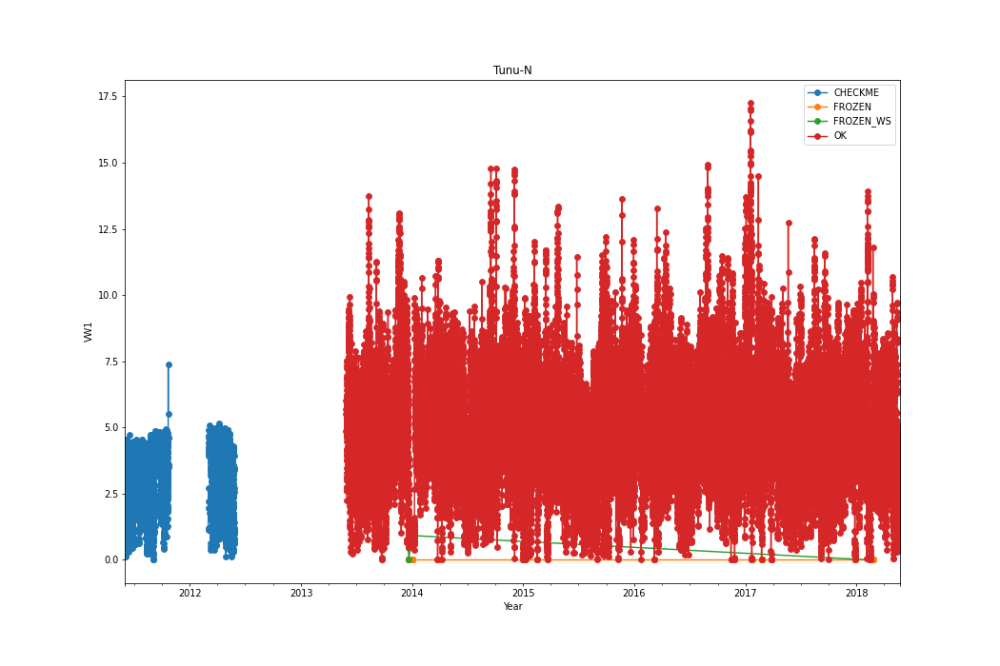
 
## Adjusting data at Tunu-N
### Adjusting HW1
|start time|end time|operation|value|number of removed samples|
|-|-|-|-|-|
|2009-05-15T00:00:00+00:00|2022-03-14T04:00:00+00:00|air_temp_sonic_correction|0.0|0|
|2009-05-15T00:00:00+00:00|2022-03-14T04:00:00+00:00|biweekly_upper_range_filter|0.2|4160|
|2009-05-15T00:00:00+00:00|2022-03-14T04:00:00+00:00|hampel_filter|2.0|3332|
 
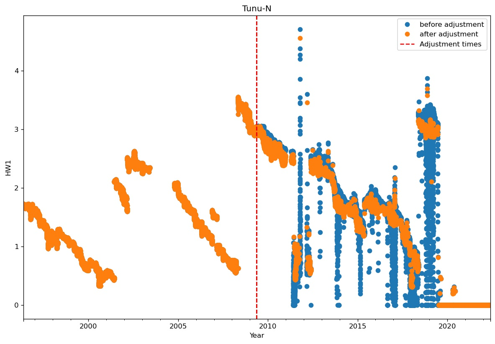
 
### Adjusting HW2
|start time|end time|operation|value|number of removed samples|
|-|-|-|-|-|
|2009-05-15T00:00:00+00:00|2022-03-14T04:00:00+00:00|air_temp_sonic_correction|0.0|0|
|2009-05-15T00:00:00+00:00|2022-03-14T04:00:00+00:00|biweekly_upper_range_filter|0.2|6077|
|2009-05-15T00:00:00+00:00|2022-03-14T04:00:00+00:00|hampel_filter|2.0|1466|
 
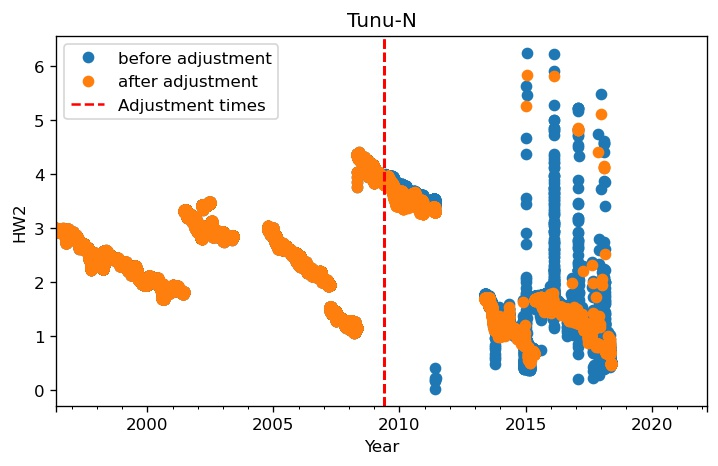
 
## Adjusting data at Tunu-N
### Adjusting HS1
|start time|end time|operation|value|number of removed samples|
|-|-|-|-|-|
|20010607T16:00:00+00:00|2022-03-14T04:00:00+00:00|add|2.0|0|
|20080426T16:00:00+00:00|2022-03-14T04:00:00+00:00|add|3.0|0|
 
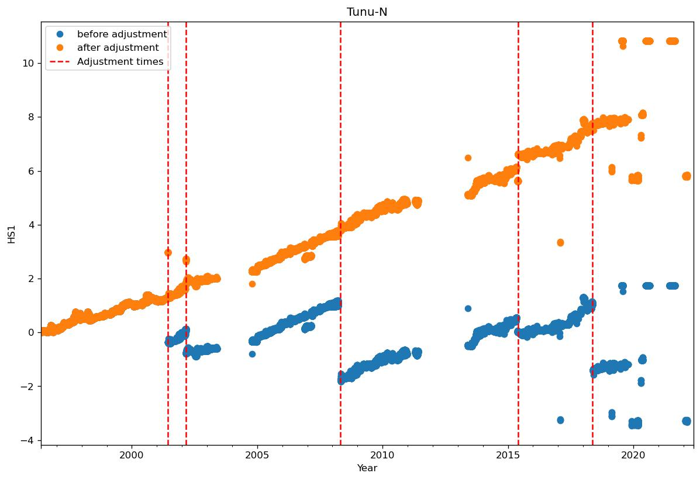
 
### Adjusting HS2
|start time|end time|operation|value|number of removed samples|
|-|-|-|-|-|
|20010607T16:00:00+00:00|2022-03-14T04:00:00+00:00|add|2.2|0|
|20040513T16:00:00+00:00|2022-03-14T04:00:00+00:00|add|1.0|0|
|20070405T16:00:00+00:00|2022-03-14T04:00:00+00:00|add|-0.5|0|
|20080501T00:00:00+00:00|2022-03-14T04:00:00+00:00|add|3.2|0|
|20130213T16:00:00+00:00|2022-03-14T04:00:00+00:00|add|-1.5|0|
|20150525T16:00:00+00:00|2022-03-14T04:00:00+00:00|add|1.0|0|
 
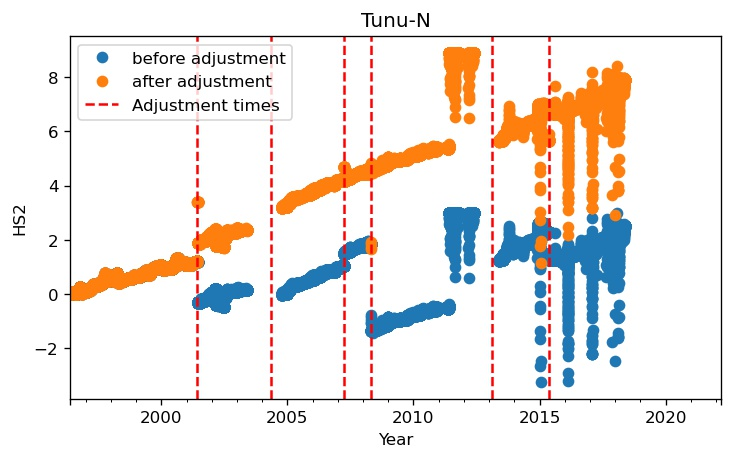
 
### Adjusting P
|start time|end time|operation|value|number of removed samples|
|-|-|-|-|-|
|2021-01-05T00:00:00+00:00|2022-09-09T00:00:00+00:00|grad_filter|5.0|12|
 
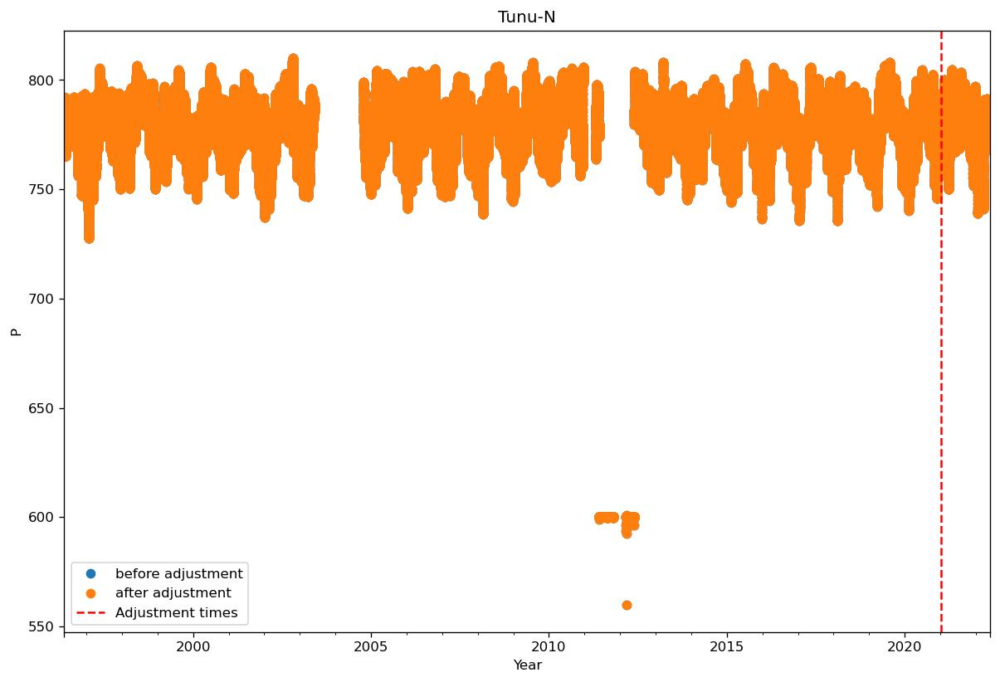
 
### Adjusting TA3
|start time|end time|operation|value|number of removed samples|
|-|-|-|-|-|
|1990-01-01T00:00:00+00:00|1999-01-01T00:00:00+00:00|min_filter|-39.3|30|
 
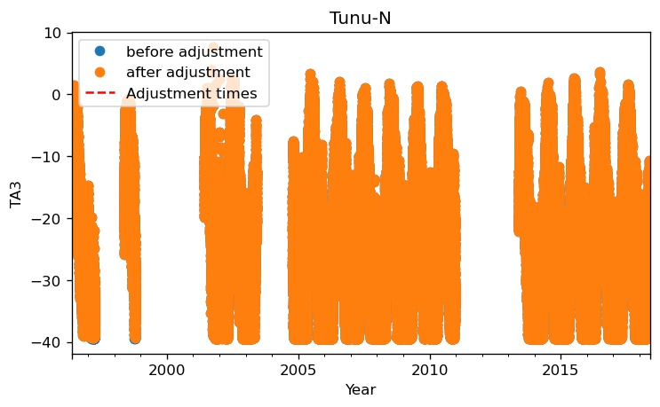
 
### Adjusting TA4
|start time|end time|operation|value|number of removed samples|
|-|-|-|-|-|
|1990-01-01T00:00:00+00:00|1999-01-01T00:00:00+00:00|min_filter|-39.3|47|
 
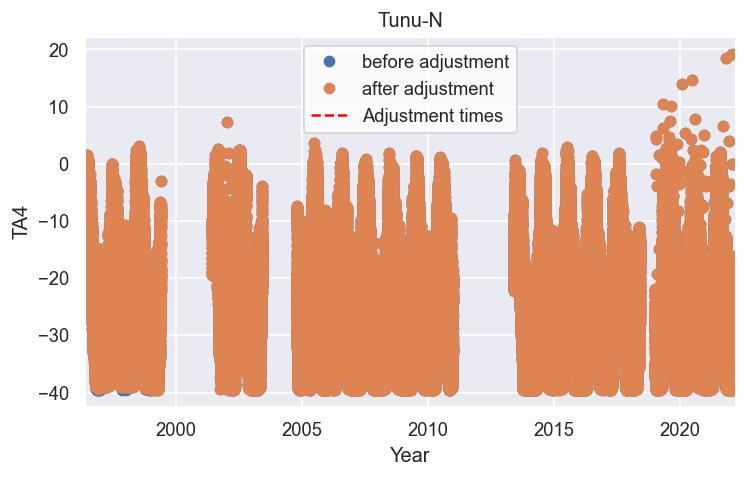
 
# 8 DYE2
## Manual flagging of data at DYE2
Flagging data:
|start time|end time|variable|
|-|-|-|
|2002-05-19 01:00:00+00:00|2003-05-09 00:00:00+00:00|HW1|
|2015-06-07 01:00:00+00:00|2018-05-07 00:00:00+00:00|HW1|
 
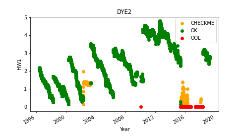
 
|start time|end time|variable|
|-|-|-|
|2002-01-01 01:00:00+00:00|2003-05-09 00:00:00+00:00|HW2|
|2010-03-25 01:00:00+00:00|2014-05-23 00:00:00+00:00|HW2|
|2018-06-01 01:00:00+00:00|2019-05-20 00:00:00+00:00|HW2|
 
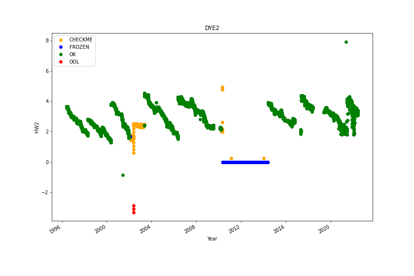
 
|start time|end time|variable|
|-|-|-|
|2004-06-15 01:00:00+00:00|2004-08-25 00:00:00+00:00|ISWR|
|2012-05-07 18:00:00+00:00|2012-05-12 00:00:00+00:00|ISWR|
|2004-05-09 15:00:00+00:00|2005-06-10 00:00:00+00:00|ISWR|
 
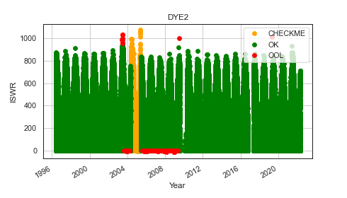
 
Warning: OSR not found
|start time|end time|variable|
|-|-|-|
|2004-05-09 15:00:00+00:00|2005-06-10 00:00:00+00:00|OSWR|
 

 
|start time|end time|variable|
|-|-|-|
|2011-05-26 09:00:00+00:00|2013-12-28 00:00:00+00:00|P|
|2010-05-21 07:00:02+00:00|2010-09-25 00:00:00+00:00|P|
|2013-06-13 01:00:00+00:00|2014-10-26 00:00:00+00:00|P|
|2002-01-14 10:00:00+00:00|2003-04-29 00:00:00+00:00|P|
 
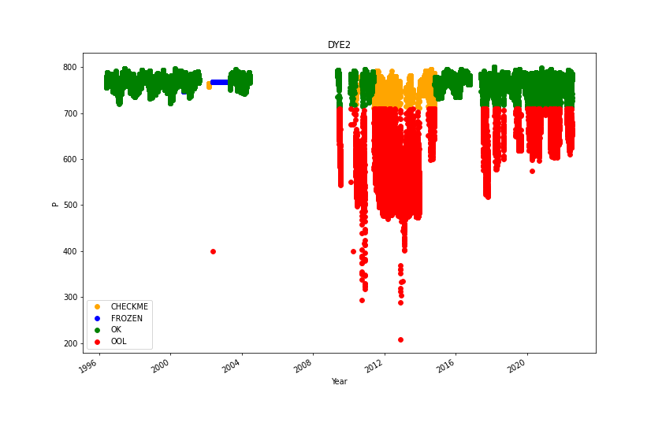
 
|start time|end time|variable|
|-|-|-|
|2009-09-09 12:00:00+00:00|2010-05-02 00:00:00+00:00|RH1|
|1999-04-19 21:00:00+00:00|1999-10-17 00:00:00+00:00|RH1|
 
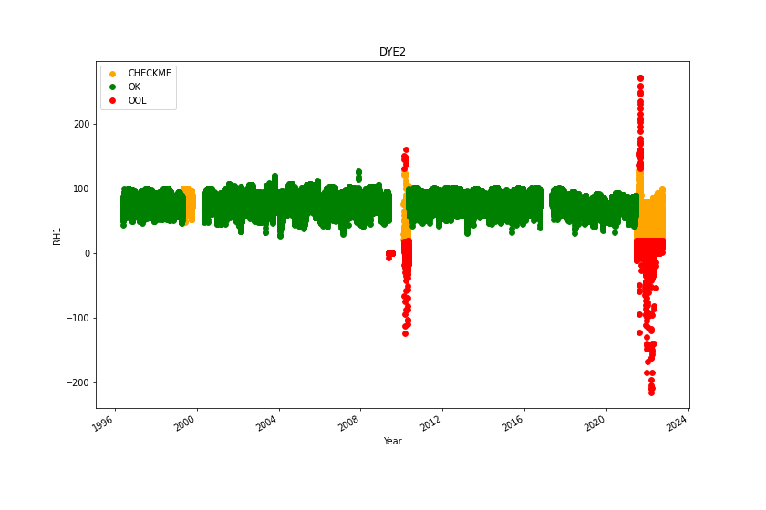
 
|start time|end time|variable|
|-|-|-|
|2010-02-09 12:00:00+00:00|2010-05-02 00:00:00+00:00|RH2|
|2012-11-06 22:00:00+00:00|2013-08-14 00:00:00+00:00|RH2|
|2013-10-27 07:59:57+00:00|2014-05-20 00:00:00+00:00|RH2|
|2012-02-11 04:59:00+00:00|2012-11-06 00:00:00+00:00|RH2|
|2016-01-01 00:00:00+00:00|2018-01-01 00:00:00+00:00|RH2|
 
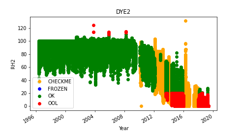
 
|start time|end time|variable|
|-|-|-|
|1999-10-15 01:00:00+00:00|2000-05-15 00:00:00+00:00|TA3|
|2009-06-15 01:00:00+00:00|2010-05-02 00:00:00+00:00|TA3|
|2018-09-27 01:00:00+00:00|2018-10-05 00:00:00+00:00|TA3|
 
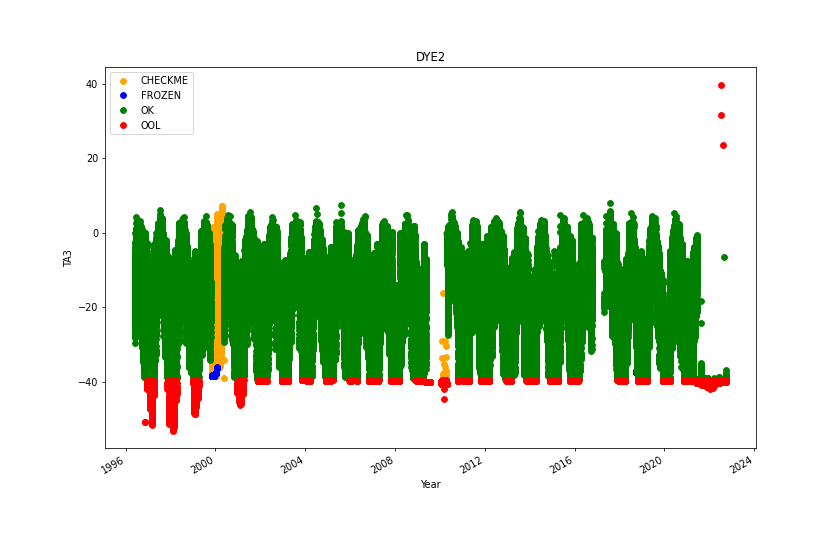
 
|start time|end time|variable|
|-|-|-|
|1996-09-14 22:00:00+00:00|1996-10-10 00:00:00+00:00|TA4|
|2009-05-19 21:00:00+00:00|2009-07-19 00:00:00+00:00|TA4|
 
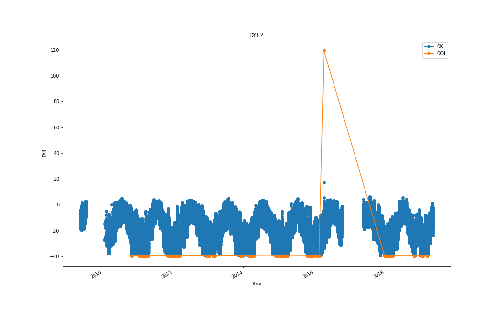
 
|start time|end time|variable|
|-|-|-|
|2010-01-01 00:00:00+00:00|2020-01-01 00:00:00+00:00|TS1|
|2000-05-12 00:00:00+00:00|2000-05-18 00:00:00+00:00|TS1|
 
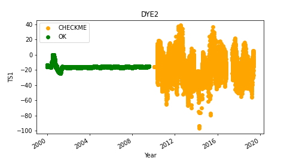
 
|start time|end time|variable|
|-|-|-|
|2010-01-01 00:00:00+00:00|2020-01-01 00:00:00+00:00|TS10|
|2000-05-01 00:00:00+00:00|2001-04-17 00:00:00+00:00|TS10|
|2000-05-12 00:00:00+00:00|2000-05-18 00:00:00+00:00|TS10|
 
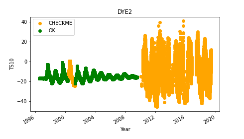
 
|start time|end time|variable|
|-|-|-|
|2010-01-01 00:00:00+00:00|2020-01-01 00:00:00+00:00|TS2|
|2000-05-12 00:00:00+00:00|2000-05-18 00:00:00+00:00|TS2|
 
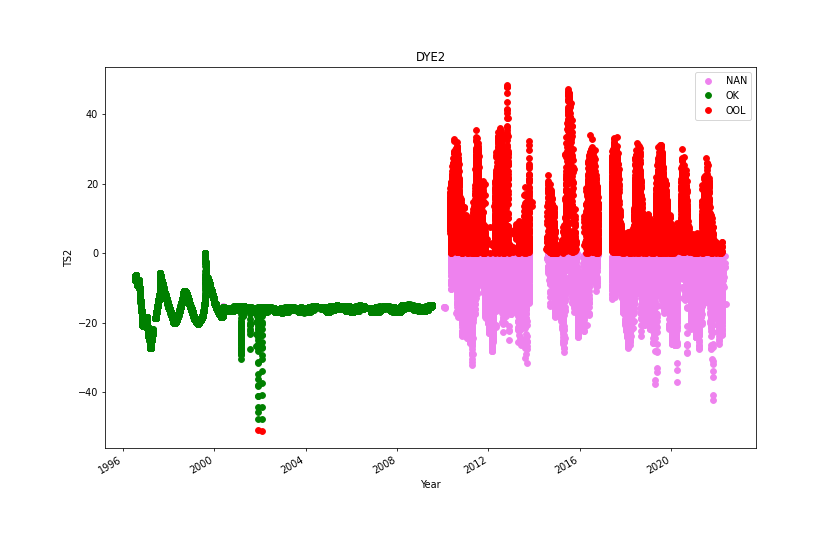
 
|start time|end time|variable|
|-|-|-|
|2010-01-01 00:00:00+00:00|2020-01-01 00:00:00+00:00|TS3|
|2000-05-12 00:00:00+00:00|2000-05-18 00:00:00+00:00|TS3|
 
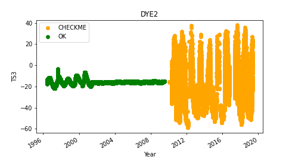
 
|start time|end time|variable|
|-|-|-|
|2010-01-01 00:00:00+00:00|2020-01-01 00:00:00+00:00|TS4|
|2000-05-12 00:00:00+00:00|2000-05-18 00:00:00+00:00|TS4|
 
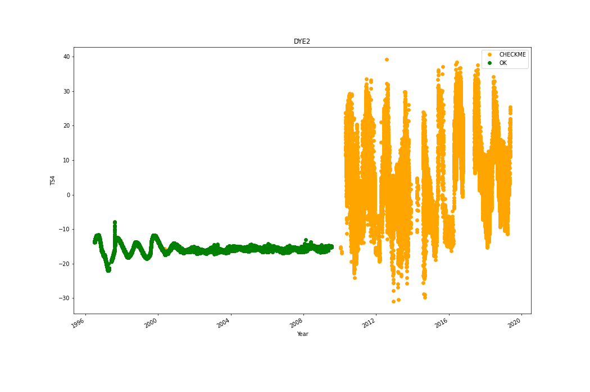
 
|start time|end time|variable|
|-|-|-|
|2010-01-01 00:00:00+00:00|2020-01-01 00:00:00+00:00|TS5|
|2001-03-10 00:00:00+00:00|2001-04-20 00:00:00+00:00|TS5|
|2000-05-12 00:00:00+00:00|2000-05-18 00:00:00+00:00|TS5|
 
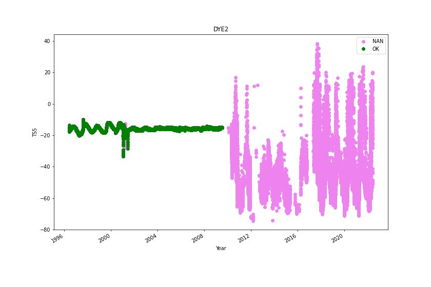
 
|start time|end time|variable|
|-|-|-|
|2010-01-01 00:00:00+00:00|2020-01-01 00:00:00+00:00|TS6|
|2000-05-12 00:00:00+00:00|2000-05-18 00:00:00+00:00|TS6|
 

 
|start time|end time|variable|
|-|-|-|
|2010-01-01 00:00:00+00:00|2020-01-01 00:00:00+00:00|TS7|
|2000-05-12 00:00:00+00:00|2000-05-18 00:00:00+00:00|TS7|
 
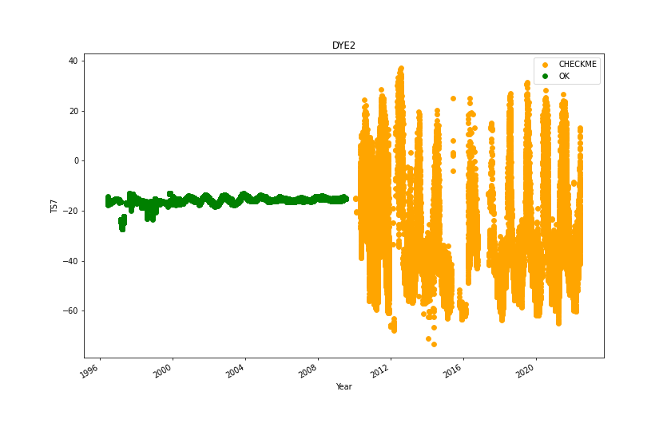
 
|start time|end time|variable|
|-|-|-|
|2010-01-01 00:00:00+00:00|2020-01-01 00:00:00+00:00|TS8|
|2000-05-12 00:00:00+00:00|2000-05-18 00:00:00+00:00|TS8|
 
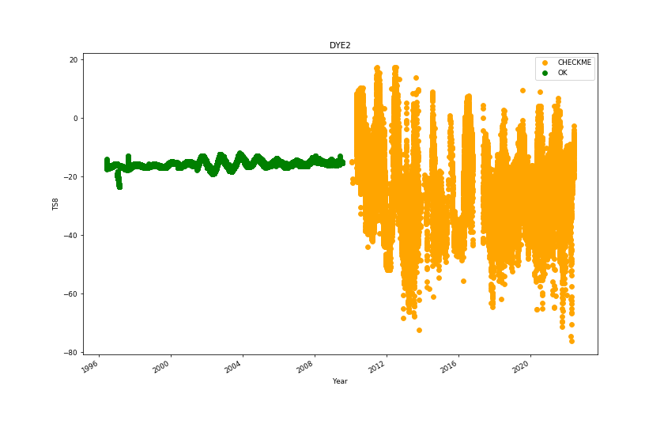
 
|start time|end time|variable|
|-|-|-|
|2010-01-01 00:00:00+00:00|2020-01-01 00:00:00+00:00|TS9|
|1999-12-01 00:00:00+00:00|1999-12-10 00:00:00+00:00|TS9|
|2000-05-01 00:00:00+00:00|2001-04-17 00:00:00+00:00|TS9|
|2000-05-12 00:00:00+00:00|2000-05-18 00:00:00+00:00|TS9|
 
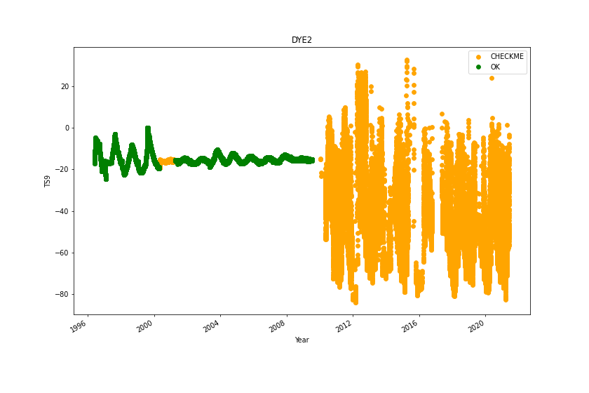
 
|start time|end time|variable|
|-|-|-|
|2016-01-01 00:00:00+00:00|2018-01-01 00:00:00+00:00|VW2|
 
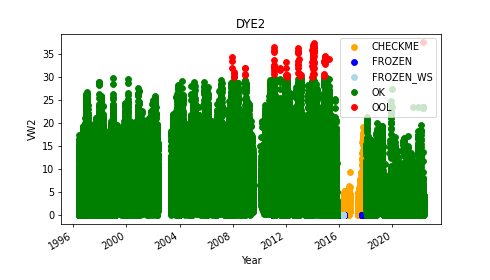
 
## Adjusting data at DYE2
### Adjusting HW1
|start time|end time|operation|value|number of removed samples|
|-|-|-|-|-|
|1999-12-29T00:00:00+00:00|1999-12-31T00:00:00+00:00|min_filter|0.63|20|
|2001-06-04T00:00:00+00:00|2001-06-06T00:00:00+00:00|min_filter|1.45|1|
|2001-06-15T00:00:00+00:00|2002-05-20T12:00:00+00:00|add|-1.5|0|
|2009-05-16T00:00:00+00:00|2022-04-25T23:00:00+00:00|air_temp_sonic_correction|0.0|9|
|2009-05-16T00:00:00+00:00|2010-01-01T00:00:00+00:00|biweekly_upper_range_filter|0.15|457|
|2009-05-16T00:00:00+00:00|2020-09-20T00:00:00+00:00|hampel_filter|2.0|4982|
|2010-01-01T00:00:00+00:00|2010-05-12T00:00:00+00:00|biweekly_upper_range_filter|0.3|216|
|2010-05-12T00:00:00+00:00|2020-09-20T00:00:00+00:00|biweekly_upper_range_filter|0.4|985|
 
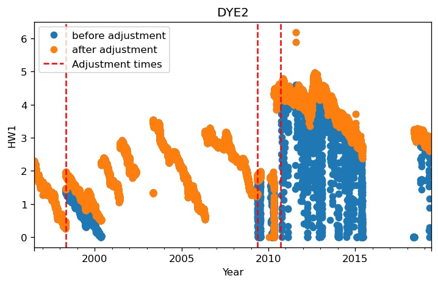
 
### Adjusting HW2
|start time|end time|operation|value|number of removed samples|
|-|-|-|-|-|
|1999-12-29T00:00:00+00:00|1999-12-31T00:00:00+00:00|min_filter|1.75|20|
|2001-06-04T00:00:00+00:00|2001-06-06T00:00:00+00:00|max_filter|2.7|4|
|2001-06-15T00:00:00+00:00|2002-05-20T12:00:00+00:00|add|-0.86|0|
|2003-05-10T00:00:00+00:00|2004-06-13T00:00:00+00:00|add|0.49|0|
|2009-05-16T00:00:00+00:00|2022-04-25T23:00:00+00:00|air_temp_sonic_correction|0.0|8|
|2009-05-16T00:00:00+00:00|2010-05-12T00:00:00+00:00|biweekly_upper_range_filter|0.2|119|
|2009-05-16T00:00:00+00:00|2020-09-20T00:00:00+00:00|hampel_filter|2.0|3033|
|2010-05-12T00:00:00+00:00|2020-09-20T00:00:00+00:00|biweekly_upper_range_filter|0.4|847|
 
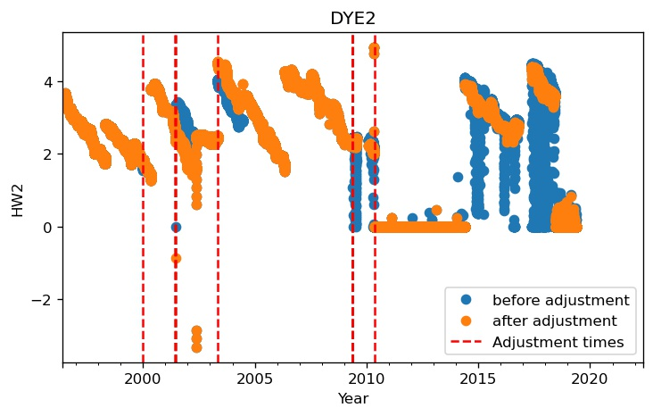
 
## Adjusting data at DYE2
### Adjusting HS1
|start time|end time|operation|value|number of removed samples|
|-|-|-|-|-|
|1998-04-28T00:00:00+00:00|2022-04-25T23:00:00+00:00|add|1.0|0|
|2000-05-12T00:00:00+00:00|2022-04-25T23:00:00+00:00|add|2.2|0|
|2001-06-15T13:00:00+00:00|2022-04-25T23:00:00+00:00|add|1.7|0|
|2003-05-09T00:00:00+00:00|2022-04-25T23:00:00+00:00|add|2.0|0|
|2006-05-10T00:00:00+00:00|2022-04-25T23:00:00+00:00|add|2.2|0|
|2010-04-28T00:00:00+00:00|2022-04-25T23:00:00+00:00|add|2.6|0|
 
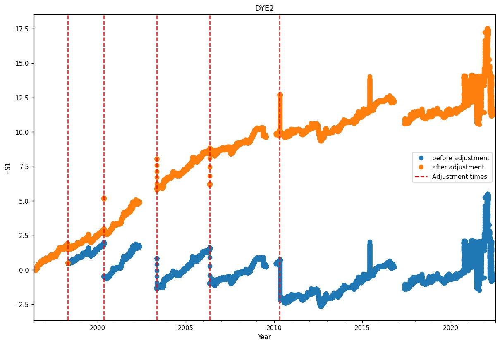
 
### Adjusting HS2
|start time|end time|operation|value|number of removed samples|
|-|-|-|-|-|
|1998-04-20T00:00:00+00:00|2022-04-25T23:00:00+00:00|add|2.0|0|
|2000-05-12T13:00:00+00:00|2022-04-25T23:00:00+00:00|add|2.2|0|
|2003-05-09T00:00:00+00:00|2022-04-25T23:00:00+00:00|add|1.5|0|
|2004-06-01T00:00:00+00:00|2022-04-25T23:00:00+00:00|add|0.75|0|
|2006-05-07T00:00:00+00:00|2022-04-25T23:00:00+00:00|add|2.5|0|
|2014-05-25T16:00:00+00:00|2022-04-25T23:00:00+00:00|add|6.0|0|
|2017-05-25T00:00:00+00:00|2022-04-25T23:00:00+00:00|add|2.0|0|
 
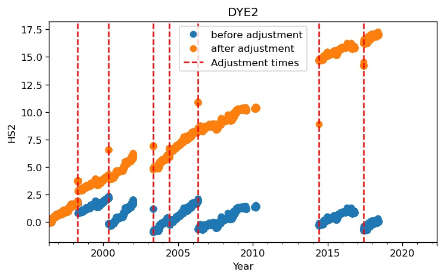
 
### Adjusting P
|start time|end time|operation|value|number of removed samples|
|-|-|-|-|-|
|2008-01-01T00:00:00+00:00|2022-04-25T23:00:00+00:00|add|-199.653|0|
 
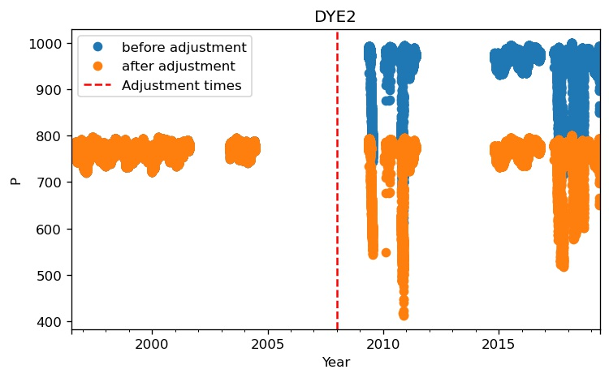
 
### Adjusting TA1
|start time|end time|operation|value|number of removed samples|
|-|-|-|-|-|
|1990-01-01T00:00:00+00:00|2022-04-25T23:00:00+00:00|min_filter|-80.0|10|
|2020-10-01T00:00:00+00:00|2021-12-31T00:00:00+00:00|max_filter|4.0|5|
 
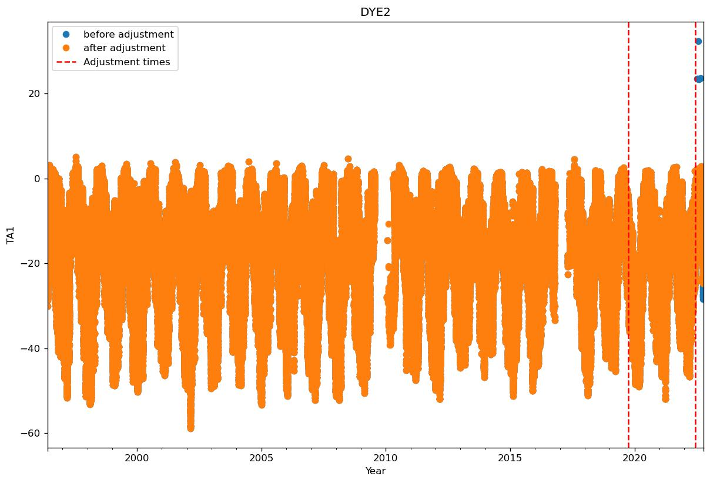
 
### Adjusting TA2
|start time|end time|operation|value|number of removed samples|
|-|-|-|-|-|
|2020-10-01T00:00:00+00:00|2021-12-31T00:00:00+00:00|max_filter|4.0|3|
 
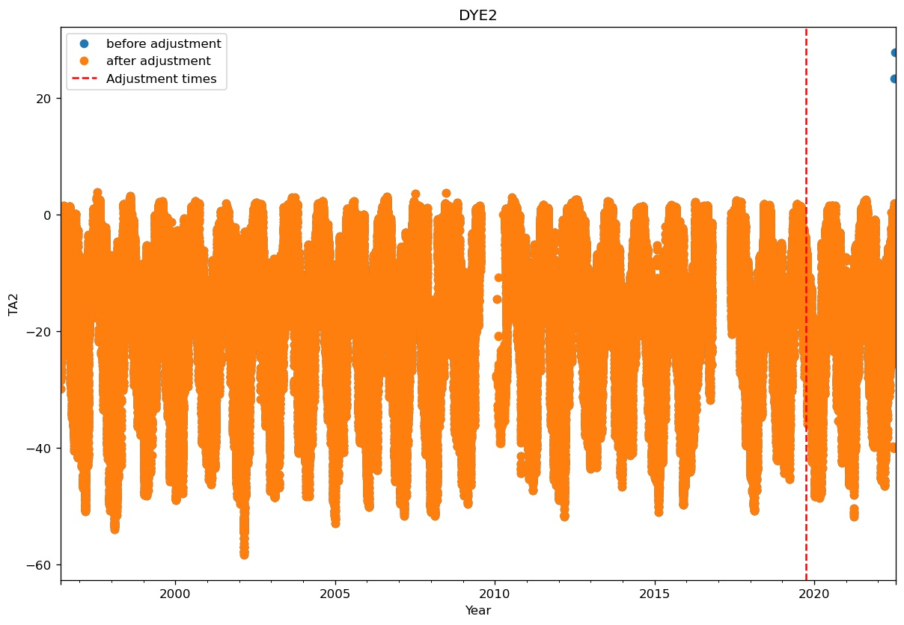
 
# 9 JAR1
## Manual flagging of data at JAR1
Flagging data:
|start time|end time|variable|
|-|-|-|
|2007-10-01 00:00:00+00:00|2008-05-07 00:00:00+00:00|TA2|
|2010-10-01 00:00:00+00:00|2012-05-04 00:00:00+00:00|TA2|
 
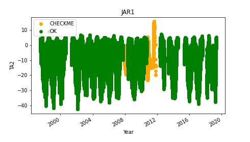
 
|start time|end time|variable|
|-|-|-|
|2007-10-01 00:00:00+00:00|2008-05-07 00:00:00+00:00|TA4|
|2010-10-01 00:00:00+00:00|2011-06-05 00:00:00+00:00|TA4|
 
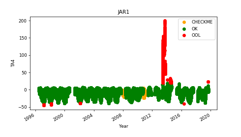
 
## Adjusting data at JAR1
### Adjusting HW1
|start time|end time|operation|value|number of removed samples|
|-|-|-|-|-|
|2009-05-15T00:00:00+00:00|2019-09-08T01:00:00+00:00|air_temp_sonic_correction|0|0|
|2009-05-15T00:00:00+00:00|2019-09-08T01:00:00+00:00|hampel_filter|2|2810|
 
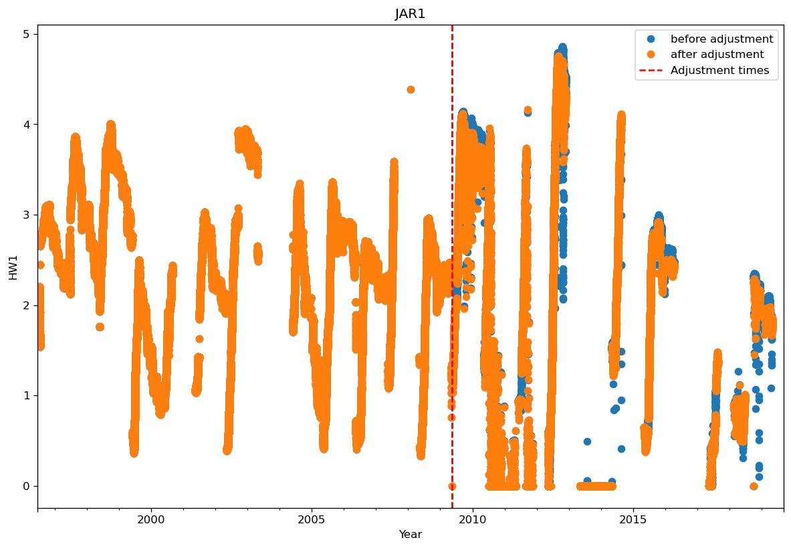
 
### Adjusting HW2
|start time|end time|operation|value|number of removed samples|
|-|-|-|-|-|
|2009-05-15T00:00:00+00:00|2019-09-08T01:00:00+00:00|air_temp_sonic_correction|0|0|
|2009-05-15T00:00:00+00:00|2019-09-08T01:00:00+00:00|hampel_filter|2|6338|
 
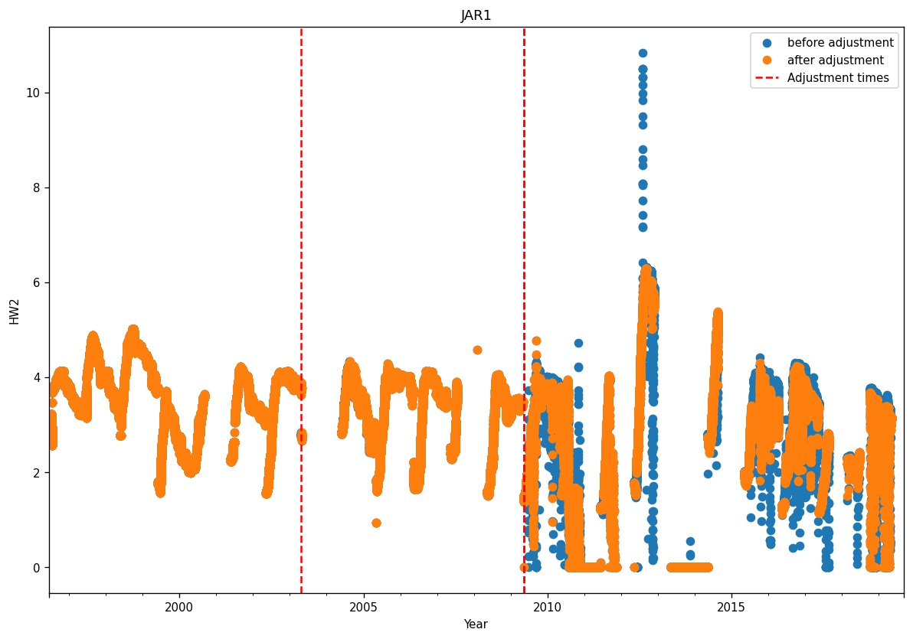
 
## Adjusting data at JAR1
### Adjusting TA3
|start time|end time|operation|value|number of removed samples|
|-|-|-|-|-|
|2018-02-01T00:00:00+00:00|2019-12-20T00:00:00+00:00|max_filter|9|127|
 
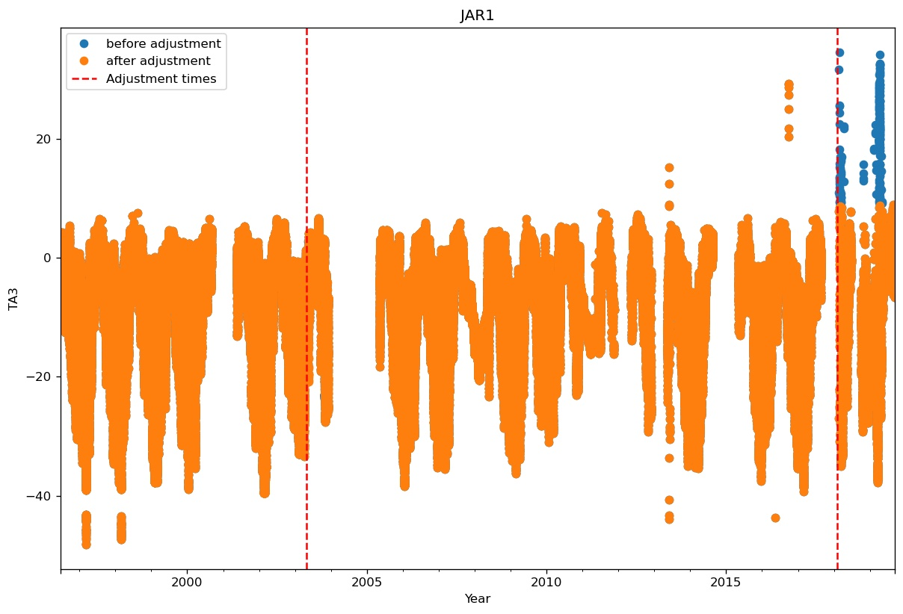
 
### Adjusting TA4
|start time|end time|operation|value|number of removed samples|
|-|-|-|-|-|
|2013-02-01T00:00:00+00:00|2015-12-20T00:00:00+00:00|max_filter|9|414|
 
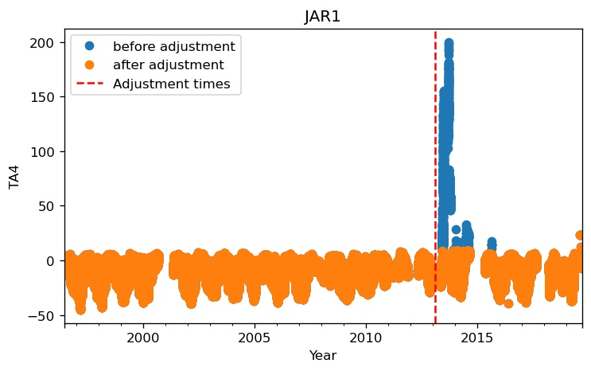
 
# 10 Saddle
## Manual flagging of data at Saddle
Flagging data:
|start time|end time|variable|
|-|-|-|
|2014-10-09 00:00:00+00:00|2016-05-15 00:00:00+00:00|HW1|
|2017-08-16 00:00:00+00:00|2018-05-26 00:00:00+00:00|HW1|
 
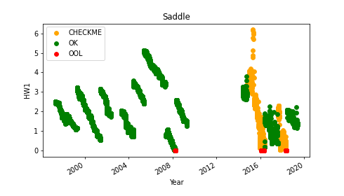
 
|start time|end time|variable|
|-|-|-|
|2012-09-18 00:00:00+00:00|2013-05-19 00:00:00+00:00|HW2|
 
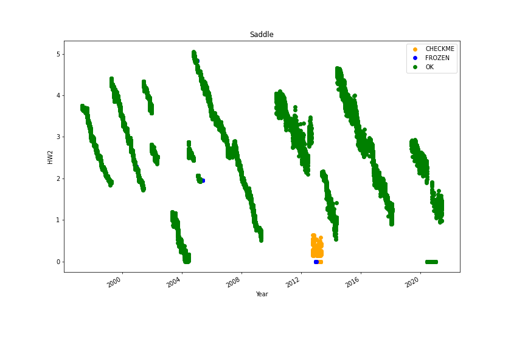
 
|start time|end time|variable|
|-|-|-|
|2010-01-01 00:00:00+00:00|2020-01-01 00:00:00+00:00|RH2|
 
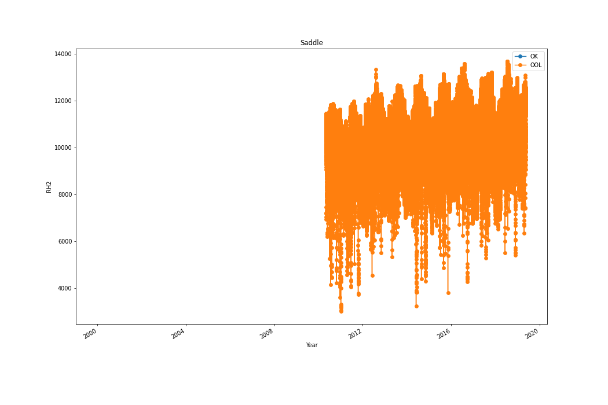
 
|start time|end time|variable|
|-|-|-|
|2010-01-01 00:00:00+00:00|2016-01-01 00:00:00+00:00|TA1|
 
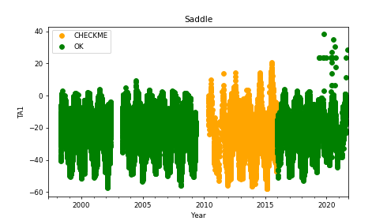
 
|start time|end time|variable|
|-|-|-|
|2009-01-01 00:00:00+00:00|2010-01-01 00:00:00+00:00|VW1|
 

 
|start time|end time|variable|
|-|-|-|
|2009-01-01 00:00:00+00:00|2010-01-01 00:00:00+00:00|VW2|
 
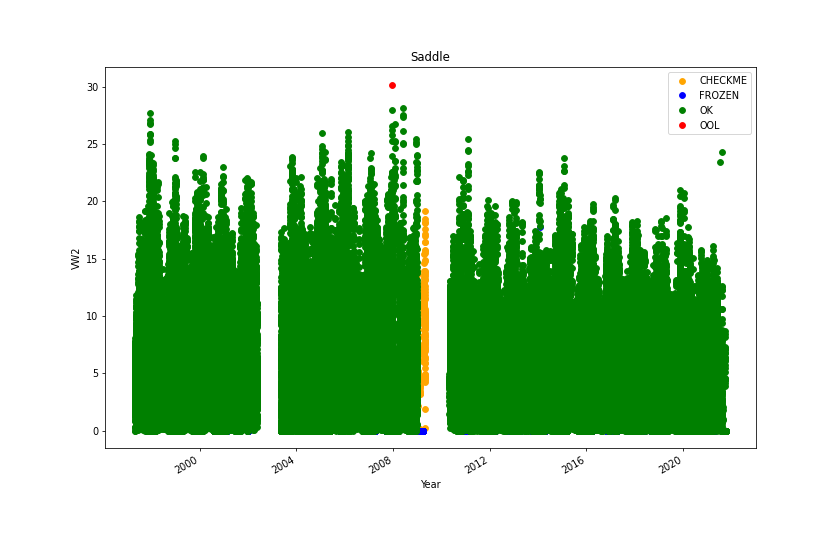
 
## Adjusting data at Saddle
### Adjusting HW1
|start time|end time|operation|value|number of removed samples|
|-|-|-|-|-|
|2009-05-15T00:00:00+00:00|2021-10-16T17:00:00+00:00|air_temp_sonic_correction|0.0|0|
|2009-05-15T00:00:00+00:00|2021-10-16T17:00:00+00:00|biweekly_upper_range_filter|0.5|4487|
|2009-05-15T00:00:00+00:00|2021-10-16T17:00:00+00:00|hampel_filter|2.0|955|
 
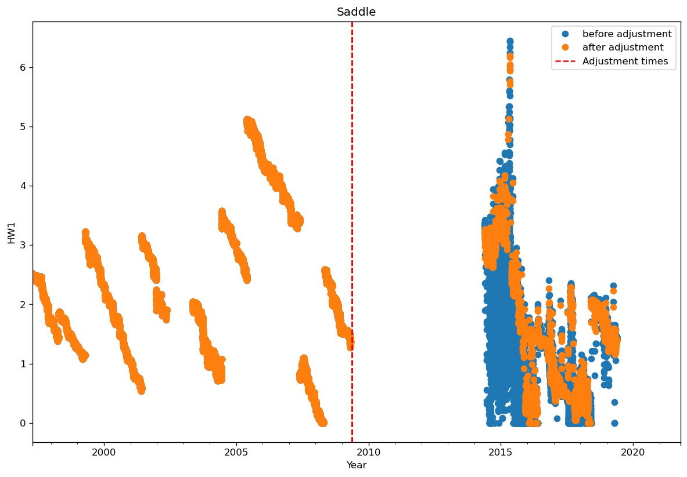
 
### Adjusting HW2
|start time|end time|operation|value|number of removed samples|
|-|-|-|-|-|
|2009-05-15T00:00:00+00:00|2021-10-16T17:00:00+00:00|air_temp_sonic_correction|0.0|0|
|2009-05-15T00:00:00+00:00|2021-10-16T17:00:00+00:00|biweekly_upper_range_filter|0.5|9170|
|2009-05-15T00:00:00+00:00|2021-10-16T17:00:00+00:00|hampel_filter|2.0|1080|
 
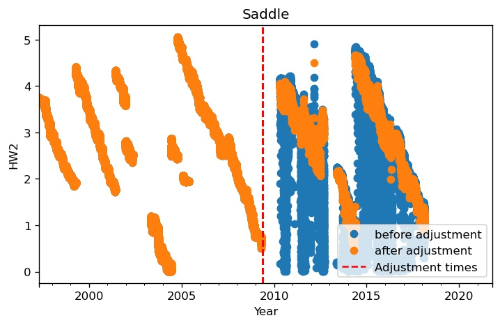
 
## Adjusting data at Saddle
### Adjusting HS1
|start time|end time|operation|value|number of removed samples|
|-|-|-|-|-|
|19980421T16:00:00+00:00|2021-10-16T17:00:00+00:00|add|0.5|0|
|19990420T16:00:00+00:00|2021-10-16T17:00:00+00:00|add|1.5|0|
|20010605T16:00:00+00:00|2021-10-16T17:00:00+00:00|add|2.0|0|
|20020607T16:00:00+00:00|2021-10-16T17:00:00+00:00|add|0.5|0|
|20040611T16:00:00+00:00|2021-10-16T17:00:00+00:00|add|2.5|0|
|20050530T16:00:00+00:00|2021-10-16T17:00:00+00:00|add|2.5|0|
|20070522T16:00:00+00:00|2021-10-16T17:00:00+00:00|add|-2.5|0|
|20080428T16:00:00+00:00|2021-10-16T17:00:00+00:00|add|2.5|0|
|20130607T16:00:00+00:00|2021-10-16T17:00:00+00:00|add|4.0|0|
|20170607T16:00:00+00:00|2021-10-16T17:00:00+00:00|add|1.5|0|
 
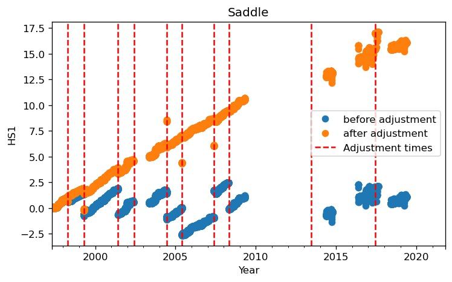
 
### Adjusting HS2
|start time|end time|operation|value|number of removed samples|
|-|-|-|-|-|
|19980503T16:00:00+00:00|2021-10-16T17:00:00+00:00|add|-0.5|0|
|19990416T11:00:00+00:00|2021-10-16T17:00:00+00:00|add|2.5|0|
|20010523T16:00:00+00:00|2021-10-16T17:00:00+00:00|add|2.0|0|
|20040614T16:00:00+00:00|2021-10-16T17:00:00+00:00|add|2.5|0|
|20050327T16:00:00+00:00|2021-10-16T17:00:00+00:00|add|2.5|0|
|20100107T16:00:00+00:00|2021-10-16T17:00:00+00:00|add|4.0|0|
|20140521T16:00:00+00:00|2021-10-16T17:00:00+00:00|add|4.0|0|
 
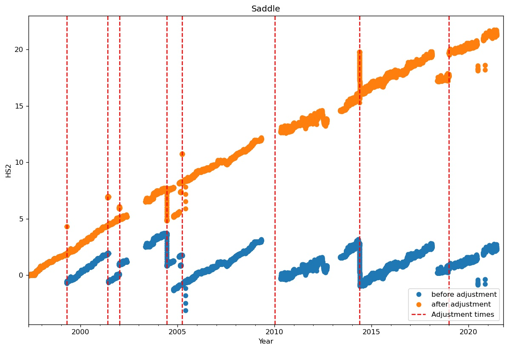
 
### Adjusting TA3
|start time|end time|operation|value|number of removed samples|
|-|-|-|-|-|
|19900101T00:00:00+00:00|2021-10-16T17:00:00+00:00|swap_with_TA4|0.0|-866|
 
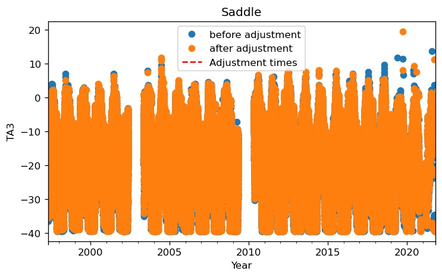
 
# 11 South Dome
## Manual flagging of data at South Dome
Flagging data:
|start time|end time|variable|
|-|-|-|
|2011-11-01 00:00:00+00:00|2012-03-12 00:00:00+00:00|HW1|
|2012-09-01 00:00:00+00:00|2014-05-12 00:00:00+00:00|HW1|
|2018-01-01 00:00:00+00:00|2018-05-12 00:00:00+00:00|HW1|
 
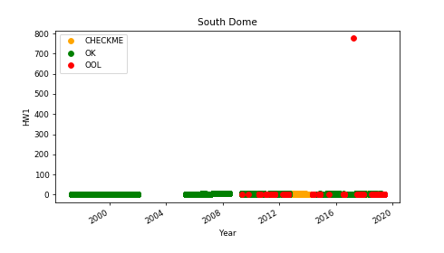
 
|start time|end time|variable|
|-|-|-|
|2018-12-15 00:00:00+00:00|2020-01-01 00:00:00+00:00|HW2|
 
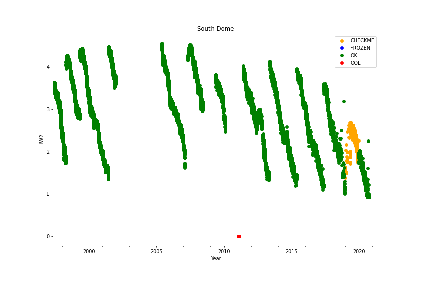
 
|start time|end time|variable|
|-|-|-|
|2000-10-01 00:00:00+00:00|2010-01-01 00:00:00+00:00|P|
 
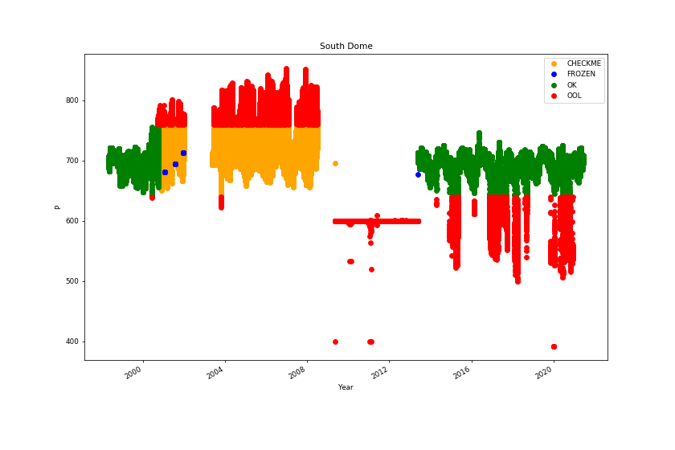
 
|start time|end time|variable|
|-|-|-|
|1996-01-01 00:00:00+00:00|1999-06-01 00:00:00+00:00|RH2|
|2010-05-01 00:00:00+00:00|2011-06-01 00:00:00+00:00|RH2|
 
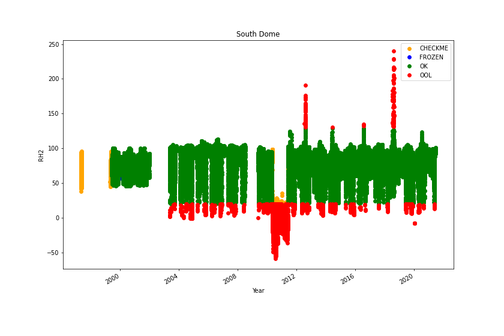
 
|start time|end time|variable|
|-|-|-|
|2010-05-01 00:00:00+00:00|2011-06-01 00:00:00+00:00|TA2|
 
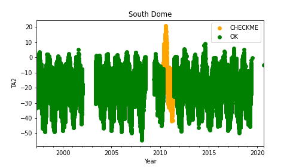
 
|start time|end time|variable|
|-|-|-|
|1996-01-01 00:00:00+00:00|1999-06-01 00:00:00+00:00|TA4|
|2010-05-01 00:00:00+00:00|2011-06-01 00:00:00+00:00|TA4|
 
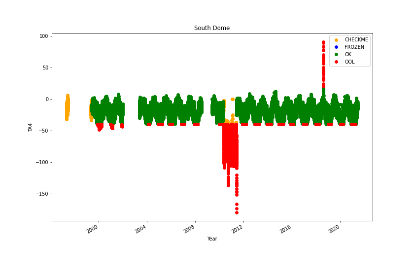
 
|start time|end time|variable|
|-|-|-|
|2008-06-05 00:00:00+00:00|2021-01-01 00:00:00+00:00|TS10|
|1997-04-15 00:00:00+00:00|1997-06-05 00:00:00+00:00|TS10|
 
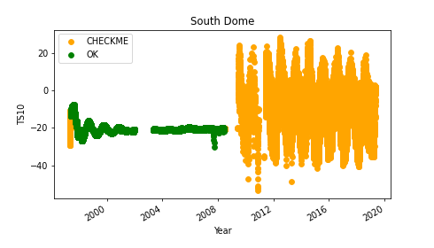
 
|start time|end time|variable|
|-|-|-|
|2008-06-05 00:00:00+00:00|2021-01-01 00:00:00+00:00|TS2|
 
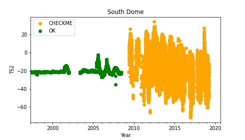
 
|start time|end time|variable|
|-|-|-|
|2008-06-05 00:00:00+00:00|2021-01-01 00:00:00+00:00|TS3|
 
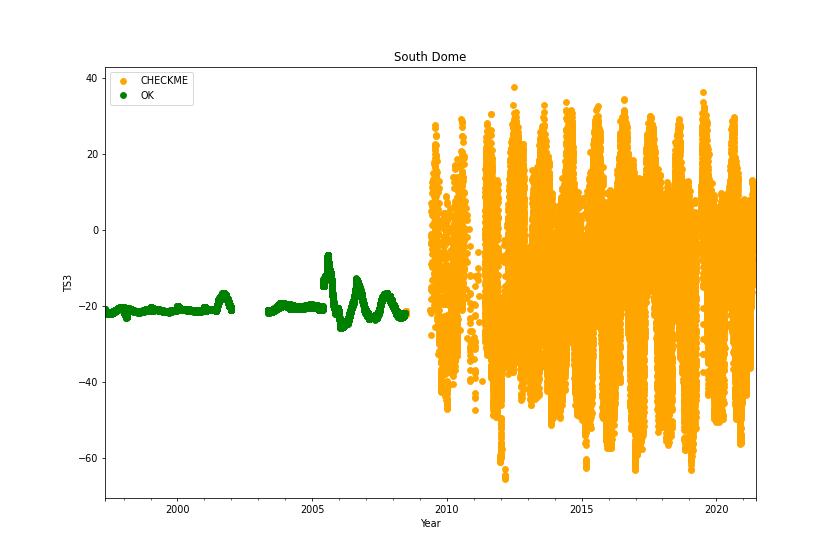
 
|start time|end time|variable|
|-|-|-|
|2008-06-05 00:00:00+00:00|2021-01-01 00:00:00+00:00|TS4|
|2007-06-28 00:00:00+00:00|2007-07-05 00:00:00+00:00|TS4|
 
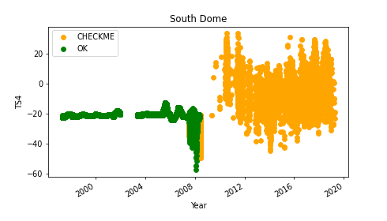
 
|start time|end time|variable|
|-|-|-|
|2008-06-05 00:00:00+00:00|2021-01-01 00:00:00+00:00|TS5|
 

 
|start time|end time|variable|
|-|-|-|
|2008-06-05 00:00:00+00:00|2021-01-01 00:00:00+00:00|TS6|
 
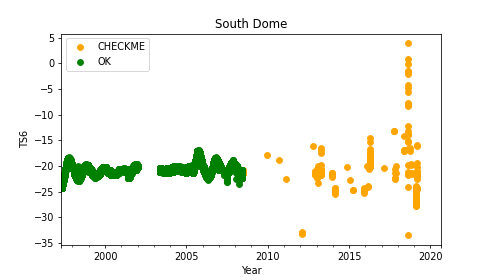
 
|start time|end time|variable|
|-|-|-|
|2008-06-05 00:00:00+00:00|2021-01-01 00:00:00+00:00|TS7|
|1997-04-15 00:00:00+00:00|1997-06-05 00:00:00+00:00|TS7|
 

 
|start time|end time|variable|
|-|-|-|
|2008-06-05 00:00:00+00:00|2021-01-01 00:00:00+00:00|TS8|
|1997-04-15 00:00:00+00:00|1997-06-05 00:00:00+00:00|TS8|
 
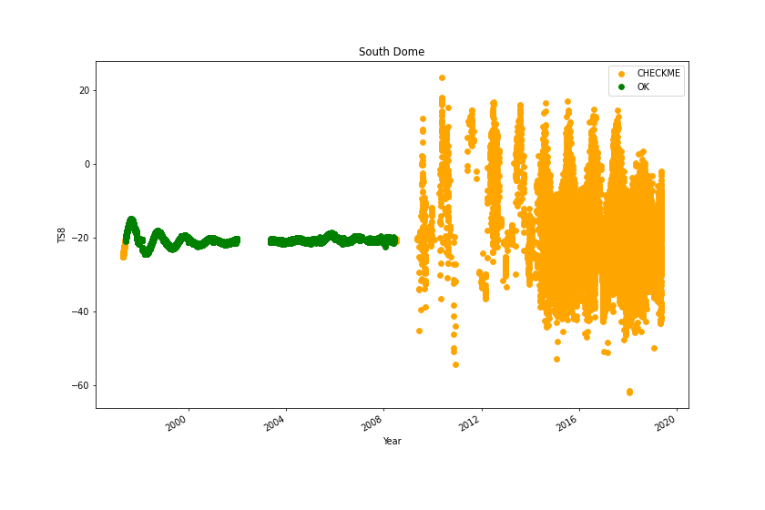
 
|start time|end time|variable|
|-|-|-|
|2008-06-05 00:00:00+00:00|2021-01-01 00:00:00+00:00|TS9|
|1997-04-15 00:00:00+00:00|1997-06-05 00:00:00+00:00|TS9|
 
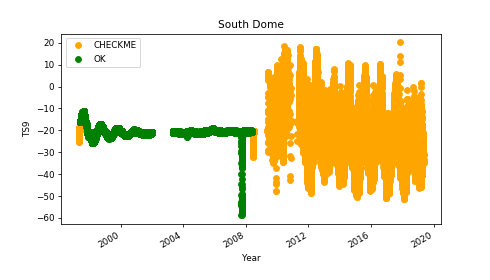
 
## Adjusting data at South Dome
### Adjusting HW1
|start time|end time|operation|value|number of removed samples|
|-|-|-|-|-|
|1995-05-26T20:00:00+00:00|2020-08-24T19:00:00+00:00|max_filter|20.0|0|
|1996-05-15T00:00:00+00:00|2020-08-24T19:00:00+00:00|air_temp_sonic_correction|0.0|0|
|2009-05-15T00:00:00+00:00|2020-08-24T19:00:00+00:00|biweekly_upper_range_filter|0.3|25631|
|2009-05-15T00:00:00+00:00|2020-08-24T19:00:00+00:00|hampel_filter|2.0|1023|
 
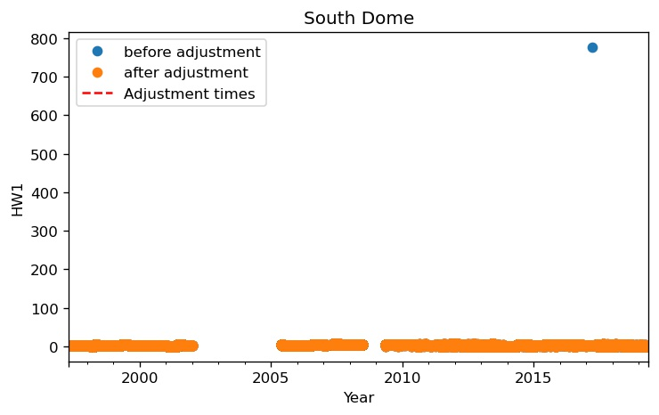
 
### Adjusting HW2
|start time|end time|operation|value|number of removed samples|
|-|-|-|-|-|
|1995-05-26T20:00:00+00:00|2020-08-24T19:00:00+00:00|max_filter|20.0|0|
|1996-05-15T00:00:00+00:00|2020-08-24T19:00:00+00:00|air_temp_sonic_correction|0.0|0|
|2009-05-15T00:00:00+00:00|2020-08-24T19:00:00+00:00|biweekly_upper_range_filter|0.3|5601|
|2009-05-15T00:00:00+00:00|2020-08-24T19:00:00+00:00|hampel_filter|2.0|82|
 
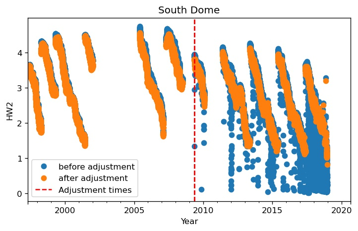
 
## Adjusting data at South Dome
### Adjusting HS1
|start time|end time|operation|value|number of removed samples|
|-|-|-|-|-|
|1998-04-06T00:00:00+00:00|2020-08-24T19:00:00+00:00|add|2.5|0|
|1999-04-29T00:00:00+00:00|2020-08-24T19:00:00+00:00|add|2.0|0|
|2001-02-03T00:00:00+00:00|2020-08-24T19:00:00+00:00|add|4.0|0|
|2005-05-26T20:00:00+00:00|2020-08-24T19:00:00+00:00|add|12.25|0|
|2006-07-18T01:00:00+00:00|2020-08-24T19:00:00+00:00|add|2.5|0|
|2007-04-23T01:00:00+00:00|2020-08-24T19:00:00+00:00|add|3.4|0|
|2009-05-16T18:00:00+00:00|2020-08-24T19:00:00+00:00|add|0.4|0|
|2014-05-25T20:00:00+00:00|2020-08-24T19:00:00+00:00|add|9.9|0|
|2017-05-23T00:00:00+00:00|2020-08-24T19:00:00+00:00|add|2.3|0|
 
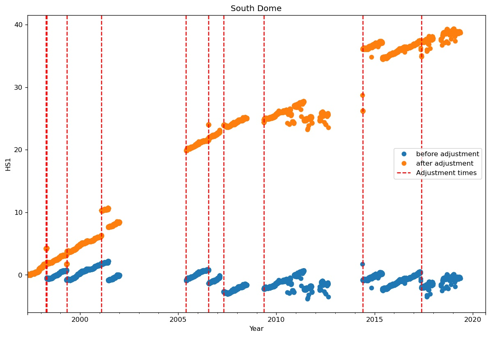
 
### Adjusting HS2
|start time|end time|operation|value|number of removed samples|
|-|-|-|-|-|
|1998-04-06T00:00:00+00:00|2020-08-24T19:00:00+00:00|add|2.5|0|
|1999-04-29T00:00:00+00:00|2020-08-24T19:00:00+00:00|add|2.0|0|
|2005-05-26T20:00:00+00:00|2020-08-24T19:00:00+00:00|add|12.25|0|
|2007-04-23T01:00:00+00:00|2020-08-24T19:00:00+00:00|add|3.4|0|
|2009-05-16T18:00:00+00:00|2020-08-24T19:00:00+00:00|add|0.4|0|
|2011-03-25T18:00:00+00:00|2020-08-24T19:00:00+00:00|add|3.0|0|
|2013-04-22T18:00:00+00:00|2020-08-24T19:00:00+00:00|add|3.0|0|
|2015-04-29T18:00:00+00:00|2020-08-24T19:00:00+00:00|add|3.0|0|
|2017-05-23T00:00:00+00:00|2020-08-24T19:00:00+00:00|add|2.3|0|
 

 
# 12 NASA-E
## Manual flagging of data at NASA-E
Flagging data:
|start time|end time|variable|
|-|-|-|
|2015-09-29 00:00:00+00:00|2019-03-01 00:00:00+00:00|HW2|
|2016-08-29 00:00:00+00:00|2019-01-01 00:00:00+00:00|HW2|
 
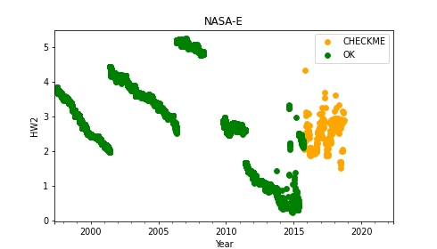
 
|start time|end time|variable|
|-|-|-|
|2012-02-01 00:00:00+00:00|2013-06-01 00:00:00+00:00|RH1|
 
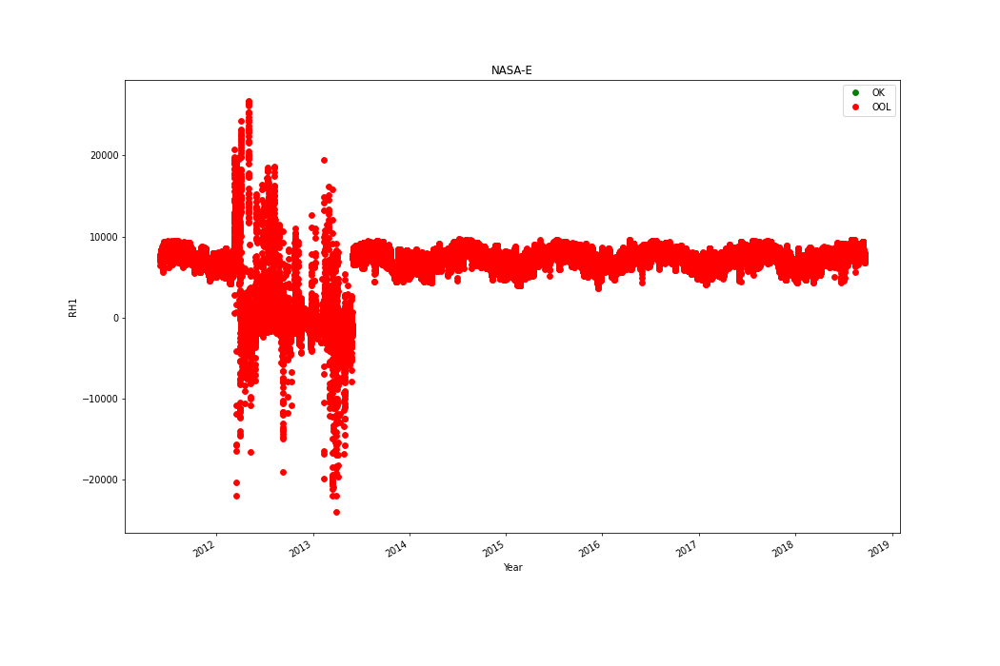
 
|start time|end time|variable|
|-|-|-|
|2012-02-01 00:00:00+00:00|2013-06-01 00:00:00+00:00|TA3|
|1998-04-12 00:00:00+00:00|1998-11-15 00:00:00+00:00|TA3|
 
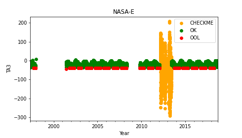
 
|start time|end time|variable|
|-|-|-|
|2001-06-07 00:00:00+00:00|2001-06-08 00:00:00+00:00|TA4|
 
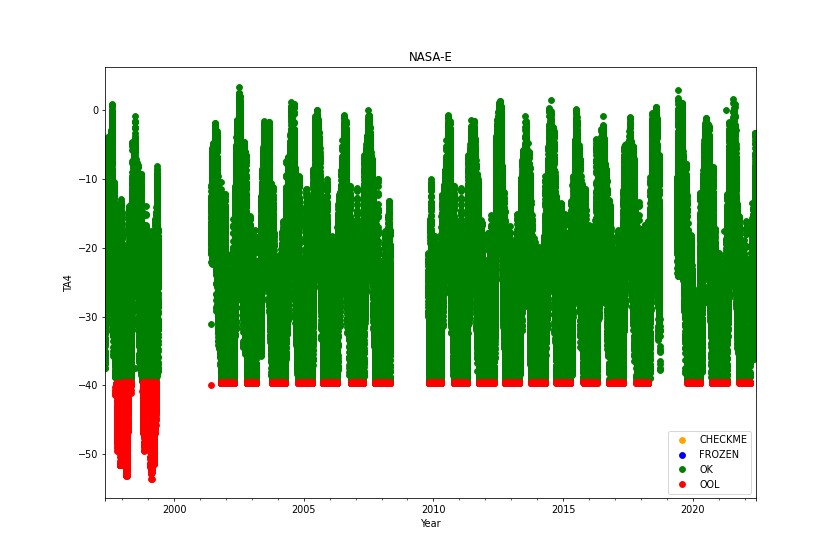
 
## Adjusting data at NASA-E
### Adjusting HW1
|start time|end time|operation|value|number of removed samples|
|-|-|-|-|-|
|2009-05-15T00:00:00+00:00|2022-04-25T23:00:00+00:00|air_temp_sonic_correction|0.0|0|
|2009-05-15T00:00:00+00:00|2022-04-25T23:00:00+00:00|biweekly_upper_range_filter|0.2|5720|
|2009-05-15T00:00:00+00:00|2022-04-25T23:00:00+00:00|hampel_filter|2.0|4764|
|2011-05-15T00:00:00+00:00|2019-05-15T00:00:00+00:00|min_filter|1.5|800|
 

 
### Adjusting HW2
|start time|end time|operation|value|number of removed samples|
|-|-|-|-|-|
|2009-05-15T00:00:00+00:00|2022-04-25T23:00:00+00:00|air_temp_sonic_correction|0.0|0|
|2009-05-15T00:00:00+00:00|2022-04-25T23:00:00+00:00|biweekly_upper_range_filter|0.2|9315|
|2009-05-15T00:00:00+00:00|2022-04-25T23:00:00+00:00|hampel_filter|2.0|3198|
 
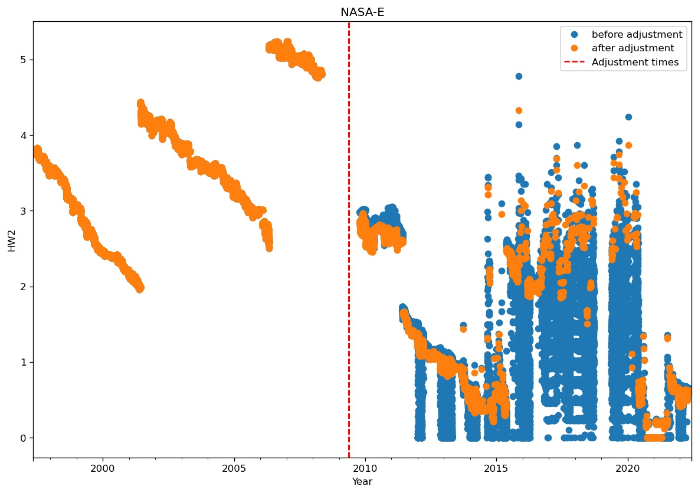
 
## Adjusting data at NASA-E
### Adjusting HS1
|start time|end time|operation|value|number of removed samples|
|-|-|-|-|-|
|2001-06-09T00:00:00+00:00|2022-04-25T23:00:00+00:00|add|2.0|0|
|2006-05-09T00:00:00+00:00|2022-04-25T23:00:00+00:00|add|2.0|0|
|2009-05-09T00:00:00+00:00|2022-04-25T23:00:00+00:00|add|-1.5|0|
|2011-06-09T00:00:00+00:00|2022-04-25T23:00:00+00:00|add|1.5|0|
|2015-06-09T00:00:00+00:00|2022-04-25T23:00:00+00:00|add|2.0|0|
 
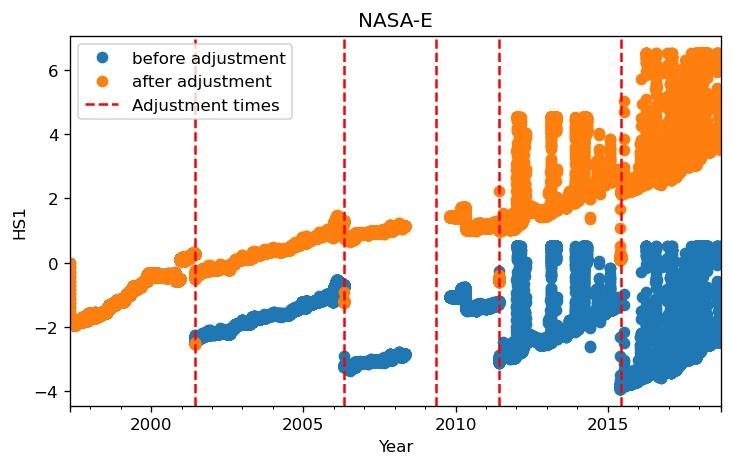
 
### Adjusting HS2
|start time|end time|operation|value|number of removed samples|
|-|-|-|-|-|
|2001-06-09T00:00:00+00:00|2022-04-25T23:00:00+00:00|add|2.0|0|
|2006-05-09T00:00:00+00:00|2022-04-25T23:00:00+00:00|add|2.0|0|
|2009-05-09T00:00:00+00:00|2022-04-25T23:00:00+00:00|add|-1.5|0|
|2011-06-09T00:00:00+00:00|2022-04-25T23:00:00+00:00|add|-1.5|0|
|2015-06-09T00:00:00+00:00|2022-04-25T23:00:00+00:00|add|2.0|0|
 
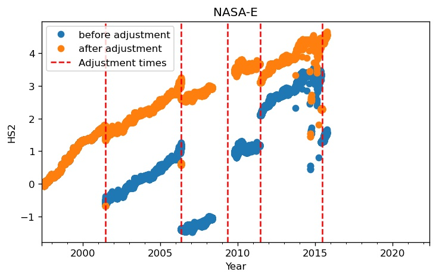
 
# 13 CP2
Warning: No file for station 13 CP2
# 14 NGRIP
Warning: No file for station 14 NGRIP
# 15 NASA-SE
## Manual flagging of data at NASA-SE
Flagging data:
|start time|end time|variable|
|-|-|-|
|2009-01-01 00:00:00+00:00|2011-05-19 00:00:00+00:00|HW1|
|2015-07-01 00:00:00+00:00|2016-05-19 00:00:00+00:00|HW1|
 
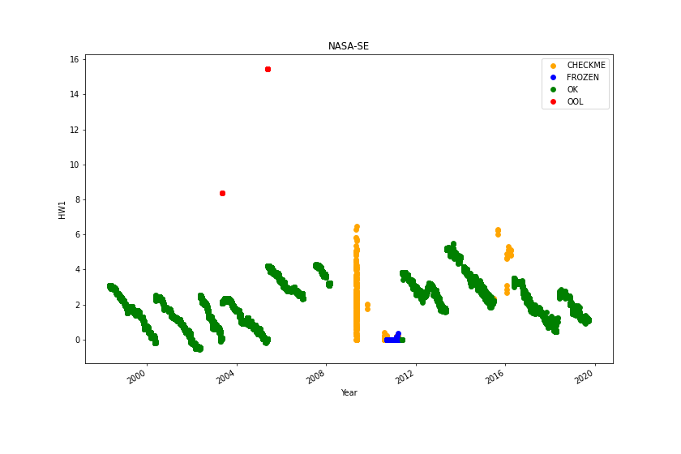
 
|start time|end time|variable|
|-|-|-|
|2011-01-01 00:00:00+00:00|2011-05-26 00:00:00+00:00|HW2|
|2016-01-15 00:00:00+00:00|2016-05-19 00:00:00+00:00|HW2|
|2017-08-18 00:00:00+00:00|2018-05-26 00:00:00+00:00|HW2|
 
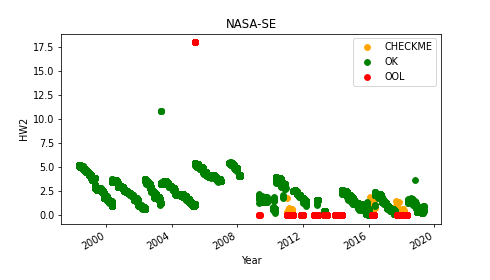
 
|start time|end time|variable|
|-|-|-|
|2012-01-08 00:00:00+00:00|2021-06-01 00:00:00+00:00|TA1|
 
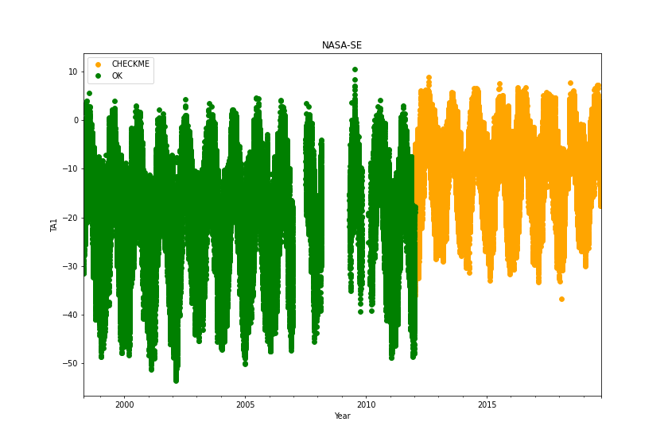
 
|start time|end time|variable|
|-|-|-|
|2012-01-08 00:00:00+00:00|2021-06-01 00:00:00+00:00|TA2|
 
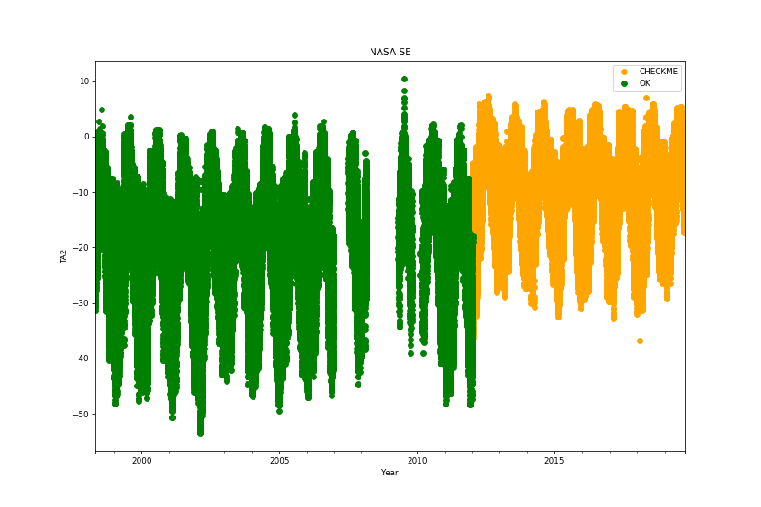
 
## Adjusting data at NASA-SE
### Adjusting HW1
|start time|end time|operation|value|number of removed samples|
|-|-|-|-|-|
|2009-05-15T00:00:00+00:00|2019-05-19T10:00:00+00:00|air_temp_sonic_correction|0.0|0|
|2009-05-15T00:00:00+00:00|2019-05-19T10:00:00+00:00|biweekly_upper_range_filter|0.5|6764|
|2009-05-15T00:00:00+00:00|2019-05-19T10:00:00+00:00|hampel_filter|2.0|4661|
 
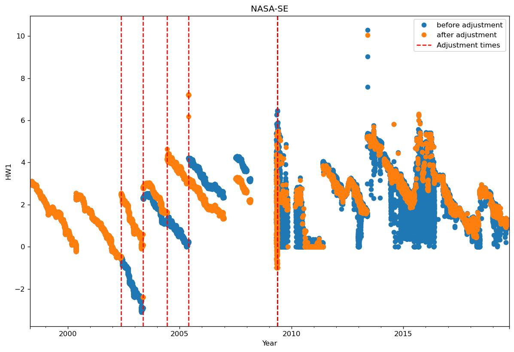
 
### Adjusting HW2
|start time|end time|operation|value|number of removed samples|
|-|-|-|-|-|
|2009-05-15T00:00:00+00:00|2019-05-19T10:00:00+00:00|air_temp_sonic_correction|0.0|0|
|2009-05-15T00:00:00+00:00|2019-05-19T10:00:00+00:00|biweekly_upper_range_filter|0.5|3265|
|2009-05-15T00:00:00+00:00|2019-05-19T10:00:00+00:00|hampel_filter|2.0|2873|
 
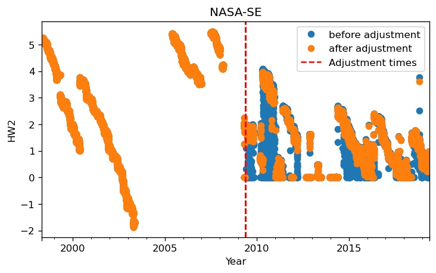
 
## Adjusting data at NASA-SE
### Adjusting HS1
|start time|end time|operation|value|number of removed samples|
|-|-|-|-|-|
|2007-06-09T00:00:00+00:00|2019-05-19T10:00:00+00:00|add|2.0|0|
|2008-06-09T00:00:00+00:00|2019-05-19T10:00:00+00:00|add|2.0|0|
|2012-06-09T00:00:00+00:00|2019-05-19T10:00:00+00:00|add|2.0|0|
|2013-06-09T00:00:00+00:00|2019-05-19T10:00:00+00:00|add|2.0|0|
|2016-06-09T00:00:00+00:00|2019-05-19T10:00:00+00:00|add|2.0|0|
|2018-06-09T00:00:00+00:00|2019-05-19T10:00:00+00:00|add|2.0|0|
 
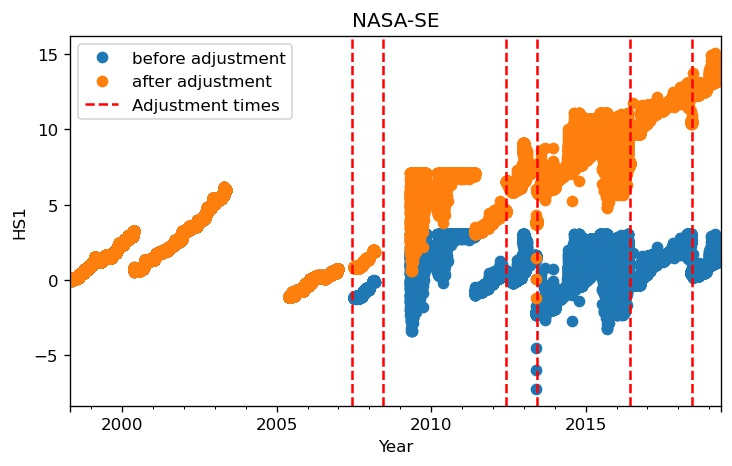
 
### Adjusting HS2
|start time|end time|operation|value|number of removed samples|
|-|-|-|-|-|
|2007-06-09T00:00:00+00:00|2019-05-19T10:00:00+00:00|add|2.0|0|
|2008-06-09T00:00:00+00:00|2019-05-19T10:00:00+00:00|add|2.0|0|
|2012-06-09T00:00:00+00:00|2019-05-19T10:00:00+00:00|add|2.0|0|
|2013-06-09T00:00:00+00:00|2019-05-19T10:00:00+00:00|add|2.0|0|
|2016-06-09T00:00:00+00:00|2019-05-19T10:00:00+00:00|add|2.0|0|
|2018-06-09T00:00:00+00:00|2019-05-19T10:00:00+00:00|add|2.0|0|
 
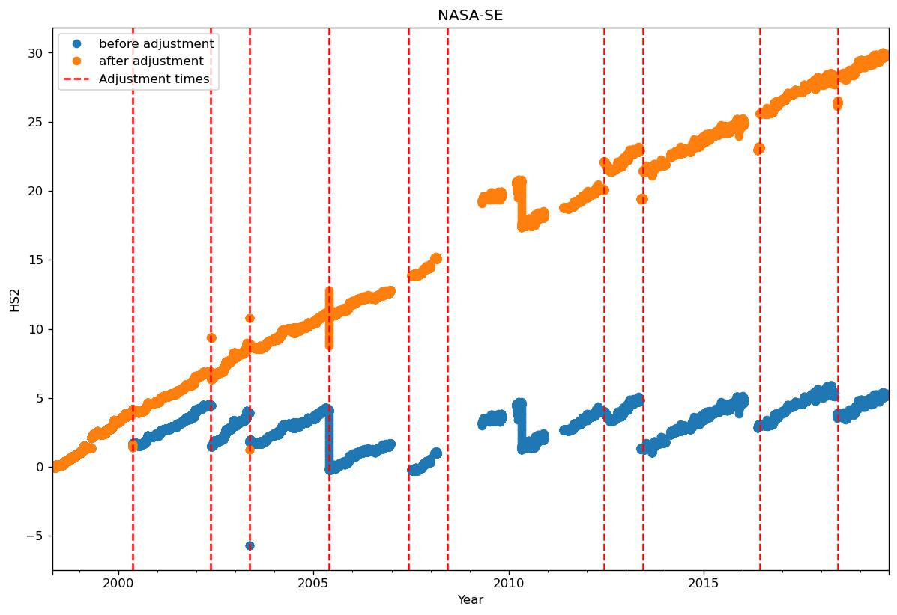
 
# 16 KAR
Warning: No file for station 16 KAR
# 17 JAR 2
Warning: No file for station 17 JAR 2
# 18 KULU
Warning: No file for station 18 KULU
# 22 Petermann ELA
## Manual flagging of data at Petermann ELA
Flagging data:
|start time|end time|variable|
|-|-|-|
|2003-01-01 00:00:00+00:00|2011-05-23 00:00:00+00:00|RH1|
 
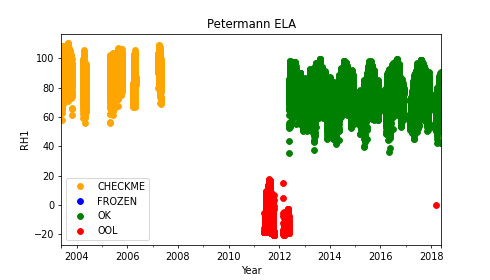
 
|start time|end time|variable|
|-|-|-|
|2003-01-01 00:00:00+00:00|2011-05-01 00:00:00+00:00|RH2|
 
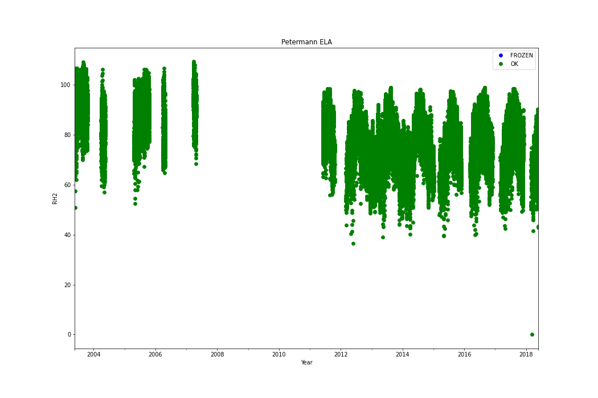
 
|start time|end time|variable|
|-|-|-|
|2011-01-01 00:00:00+00:00|2015-01-01 00:00:00+00:00|TA1|
 
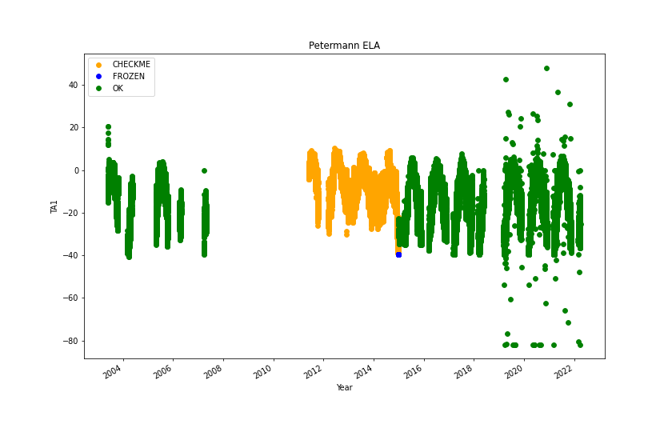
 
|start time|end time|variable|
|-|-|-|
|2011-01-01 00:00:00+00:00|2015-01-01 00:00:00+00:00|TA2|
 
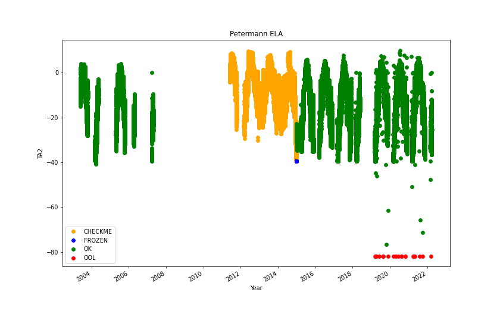
 
## Adjusting data at Petermann ELA
### Adjusting HW1
|start time|end time|operation|value|number of removed samples|
|-|-|-|-|-|
|2009-05-15T00:00:00+00:00|2022-04-12T18:00:00+00:00|air_temp_sonic_correction|0.0|0|
|2016-01-01T00:00:00+00:00|2022-04-12T18:00:00+00:00|biweekly_upper_range_filter|0.5|5|
|2016-01-01T00:00:00+00:00|2022-04-12T18:00:00+00:00|hampel_filter|2.0|1515|
 
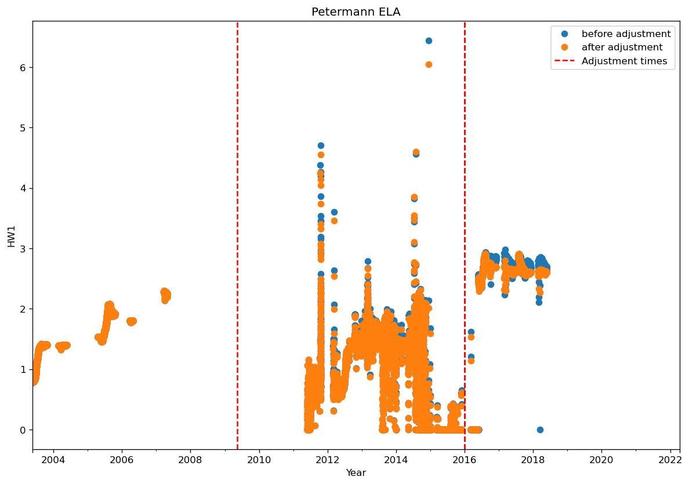
 
### Adjusting HW2
|start time|end time|operation|value|number of removed samples|
|-|-|-|-|-|
|2009-05-15T00:00:00+00:00|2022-04-12T18:00:00+00:00|air_temp_sonic_correction|0.0|0|
|2015-07-01T00:00:00+00:00|2016-01-01T00:00:00+00:00|min_filter|1.4|3|
|2016-01-01T00:00:00+00:00|2022-04-12T18:00:00+00:00|biweekly_upper_range_filter|0.5|4978|
|2016-01-01T00:00:00+00:00|2019-01-01T00:00:00+00:00|max_filter|3.12|156|
|2016-01-01T00:00:00+00:00|2019-01-01T00:00:00+00:00|min_filter|2.4|117|
|2016-01-01T00:00:00+00:00|2022-04-12T18:00:00+00:00|hampel_filter|2.0|22|
 
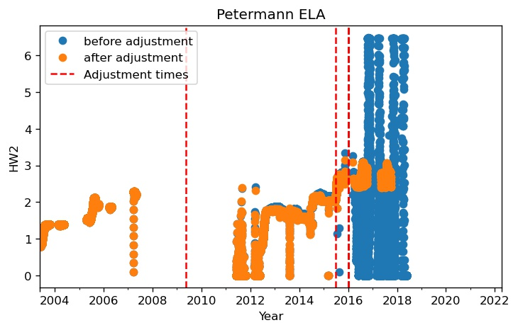
 
## Adjusting data at Petermann ELA
### Adjusting TA2
|start time|end time|operation|value|number of removed samples|
|-|-|-|-|-|
|2003-05-23T07:00:00+00:00|2022-04-12T18:00:00+00:00|max_filter|11.0|9|
 
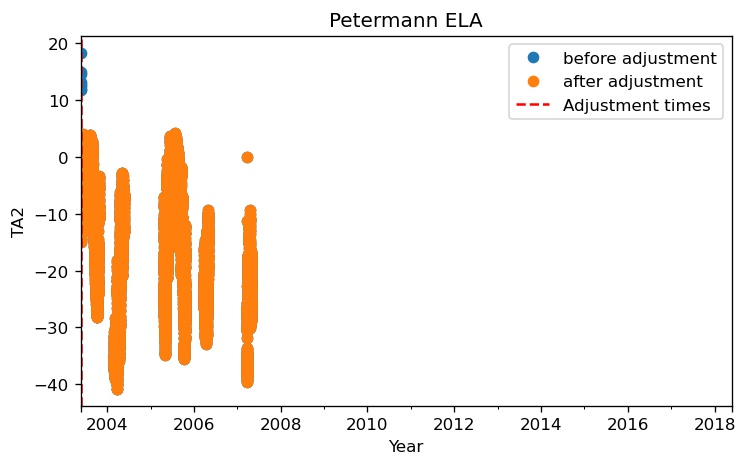
 
### Adjusting TA3
|start time|end time|operation|value|number of removed samples|
|-|-|-|-|-|
|2003-05-23T07:00:00+00:00|2022-04-12T18:00:00+00:00|max_filter|11.0|14|
 
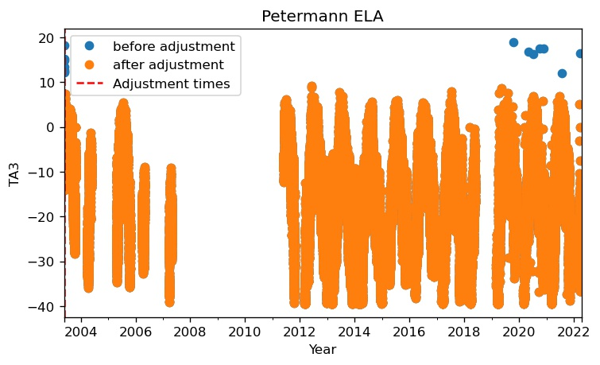
 
### Adjusting TA4
|start time|end time|operation|value|number of removed samples|
|-|-|-|-|-|
|2003-05-23T07:00:00+00:00|2022-04-12T18:00:00+00:00|max_filter|11.0|13|
 
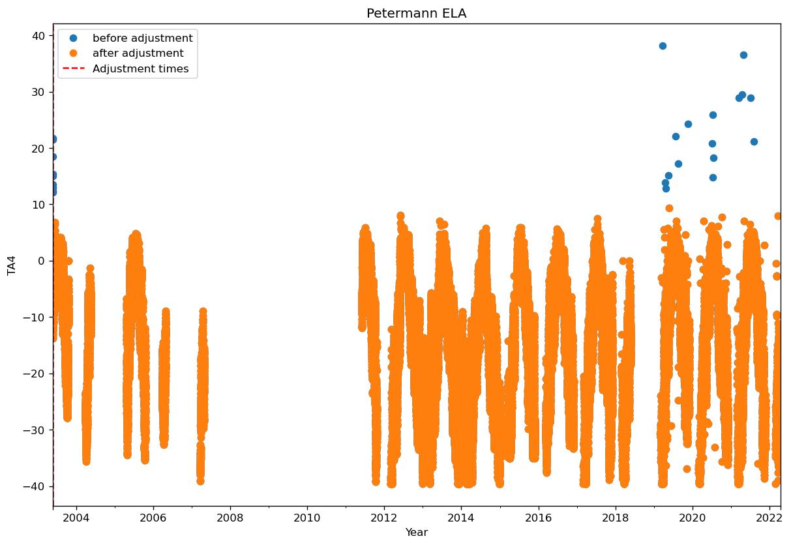
 
# 23 NEEM
## Manual flagging of data at NEEM
Flagging data:
|start time|end time|variable|
|-|-|-|
|2010-07-15 00:00:00+00:00|2010-12-01 00:00:00+00:00|HW1|
 
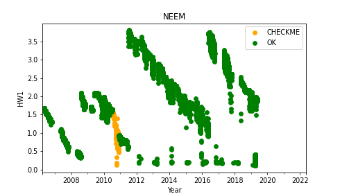
 
|start time|end time|variable|
|-|-|-|
|2010-07-15 00:00:00+00:00|2011-09-24 00:00:00+00:00|HW2|
|2013-02-05 00:00:00+00:00|2013-03-17 00:00:00+00:00|HW2|
|2017-12-26 00:00:00+00:00|2018-04-01 00:00:00+00:00|HW2|
|2019-01-01 00:00:00+00:00|2019-04-10 00:00:00+00:00|HW2|
 
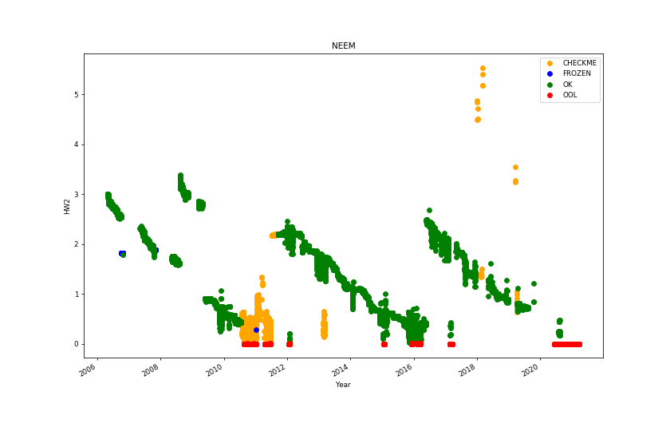
 
|start time|end time|variable|
|-|-|-|
|2009-01-01 00:00:00+00:00|2017-01-01 00:00:00+00:00|P|
 
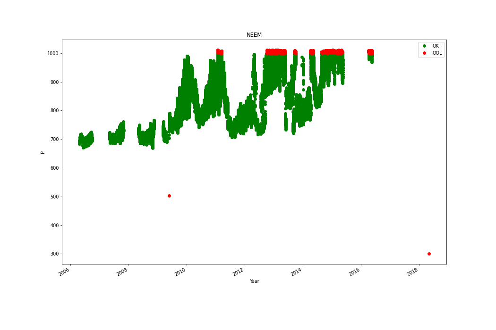
 
|start time|end time|variable|
|-|-|-|
|2017-02-01 00:00:00+00:00|2018-05-01 00:00:00+00:00|RH2|
 
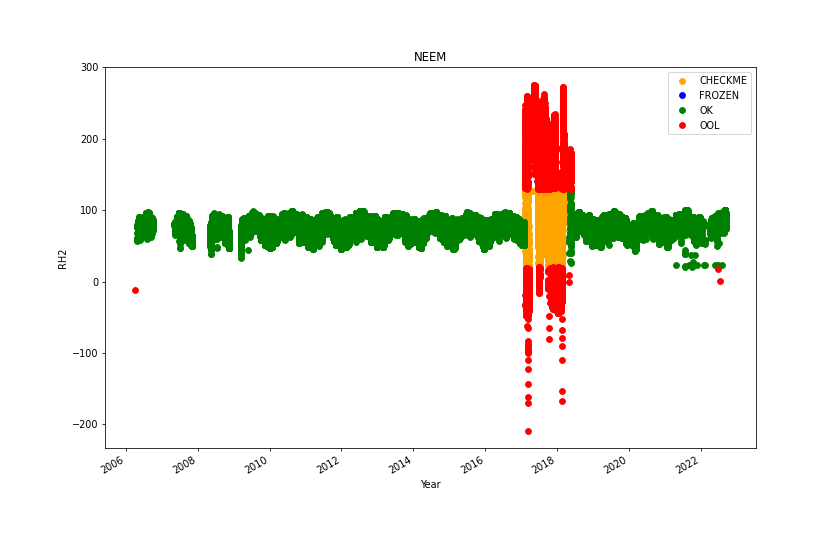
 
|start time|end time|variable|
|-|-|-|
|2017-02-01 00:00:00+00:00|2018-05-09 00:00:00+00:00|TA3|
 
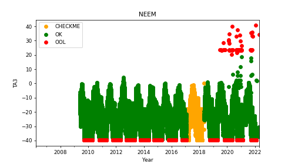
 
|start time|end time|variable|
|-|-|-|
|2018-05-04 00:00:00+00:00|2018-05-24 00:00:00+00:00|TA4|
 
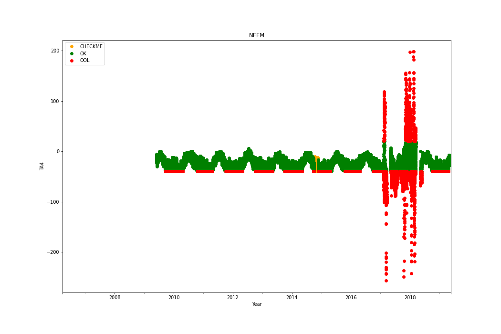
 
## Adjusting data at NEEM
### Adjusting HW1
|start time|end time|operation|value|number of removed samples|
|-|-|-|-|-|
|2009-05-15T00:00:00+00:00|2022-04-25T23:00:00+00:00|air_temp_sonic_correction|0.0|0|
|2009-05-15T00:00:00+00:00|2022-04-25T23:00:00+00:00|biweekly_upper_range_filter|0.5|4409|
|2009-05-15T00:00:00+00:00|2022-04-25T23:00:00+00:00|min_filter|0.1|56|
|2009-05-15T00:00:00+00:00|2022-04-25T23:00:00+00:00|hampel_filter|2.0|4281|
 
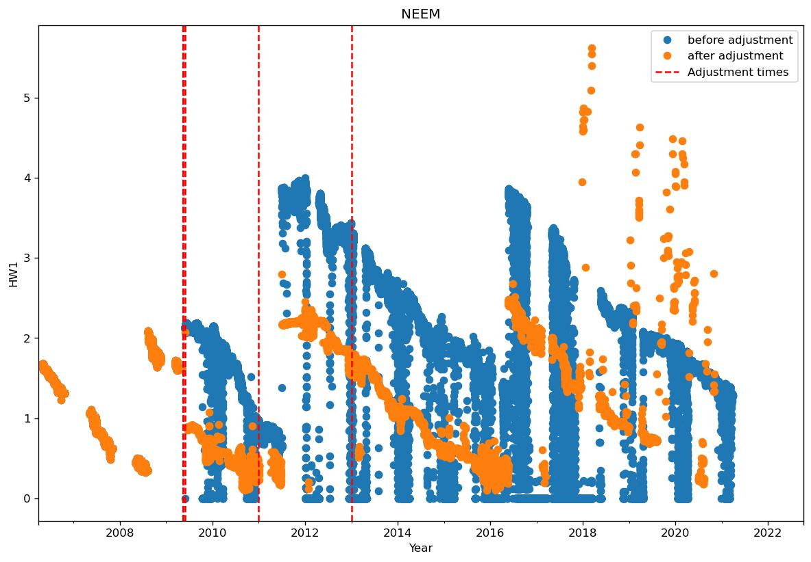
 
### Adjusting HW2
|start time|end time|operation|value|number of removed samples|
|-|-|-|-|-|
|2009-05-15T00:00:00+00:00|2022-04-25T23:00:00+00:00|air_temp_sonic_correction|0.0|0|
|2009-05-15T00:00:00+00:00|2022-04-25T23:00:00+00:00|biweekly_upper_range_filter|0.5|1657|
|2009-05-15T00:00:00+00:00|2022-04-25T23:00:00+00:00|hampel_filter|2.0|6174|
 
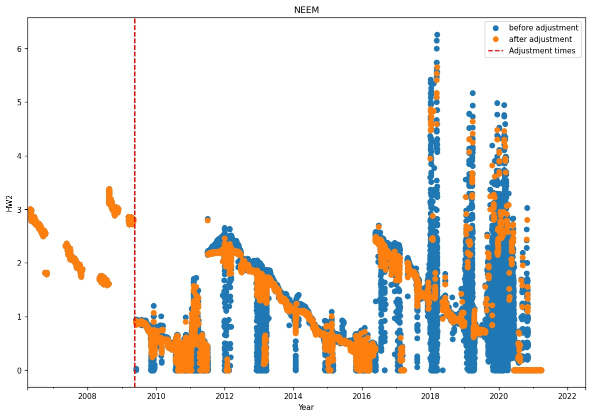
 
## Adjusting data at NEEM
### Adjusting HS1
|start time|end time|operation|value|number of removed samples|
|-|-|-|-|-|
|20080706T00:00:00+00:00|2022-04-25T23:00:00+00:00|add|2.0|0|
|20090706T00:00:00+00:00|2022-04-25T23:00:00+00:00|add|0.5|0|
|20110706T00:00:00+00:00|2022-04-25T23:00:00+00:00|add|3.0|0|
|20160406T00:00:00+00:00|2022-04-25T23:00:00+00:00|add|2.0|0|
 
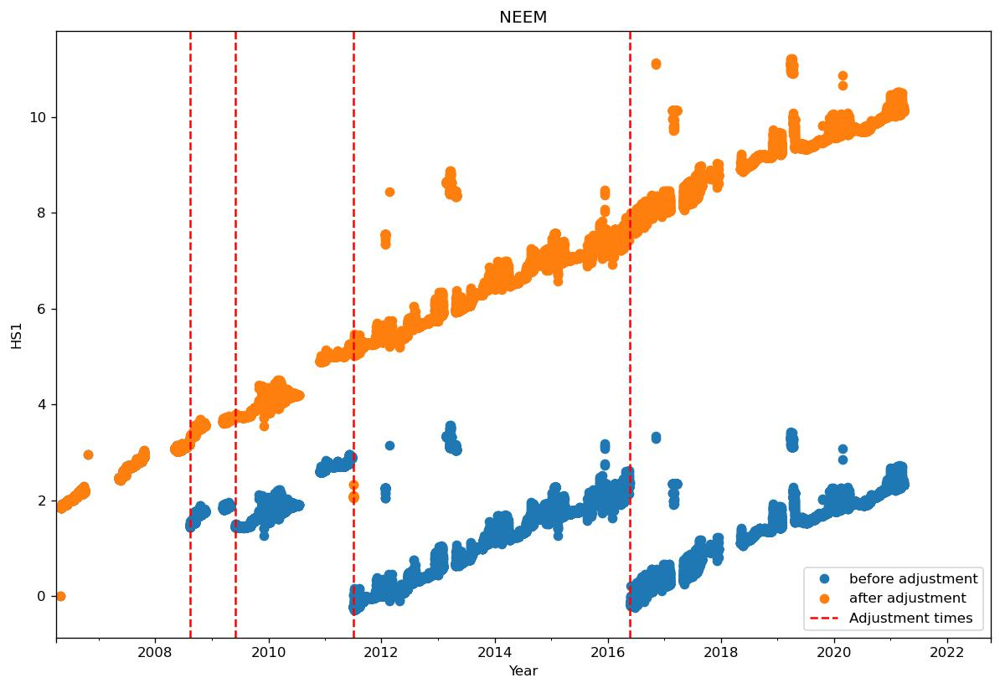
 
### Adjusting HS2
|start time|end time|operation|value|number of removed samples|
|-|-|-|-|-|
|20080706T00:00:00+00:00|2022-04-25T23:00:00+00:00|add|1.0|0|
|20090706T00:00:00+00:00|2022-04-25T23:00:00+00:00|add|-1.5|0|
|20110706T00:00:00+00:00|2022-04-25T23:00:00+00:00|add|2.0|0|
|20160406T00:00:00+00:00|2022-04-25T23:00:00+00:00|add|2.0|0|
 
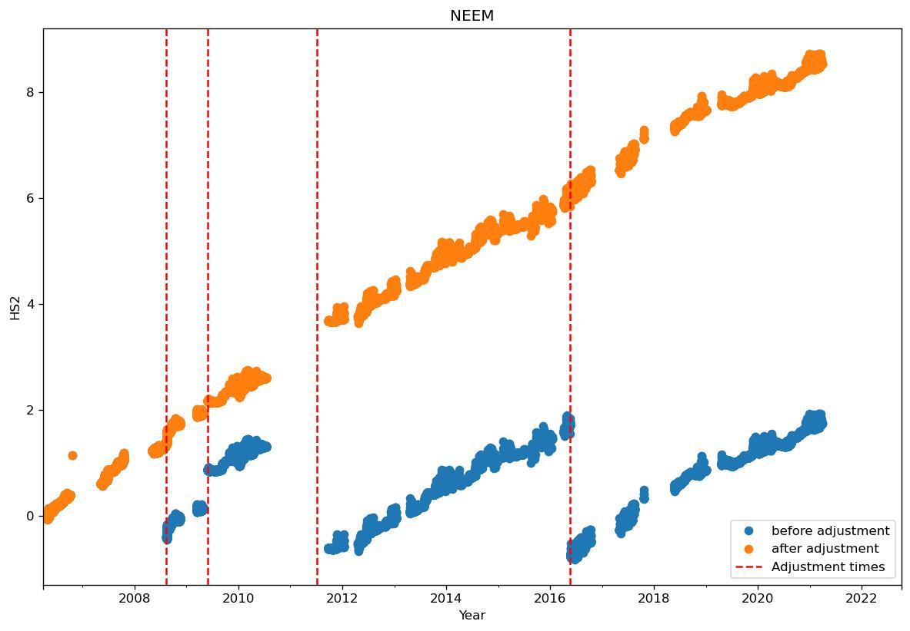
 
# 24 E-GRIP
## Manual flagging of data at E-GRIP
Flagging data:
|start time|end time|variable|
|-|-|-|
|2016-01-01 00:00:00+00:00|2019-10-01 00:00:00+00:00|ISWR|
 
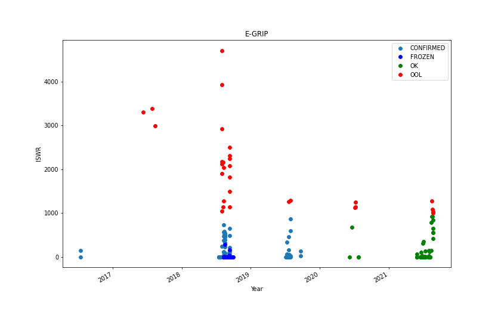
 
|start time|end time|variable|
|-|-|-|
|2016-01-01 00:00:00+00:00|2019-10-01 00:00:00+00:00|OSWR|
 
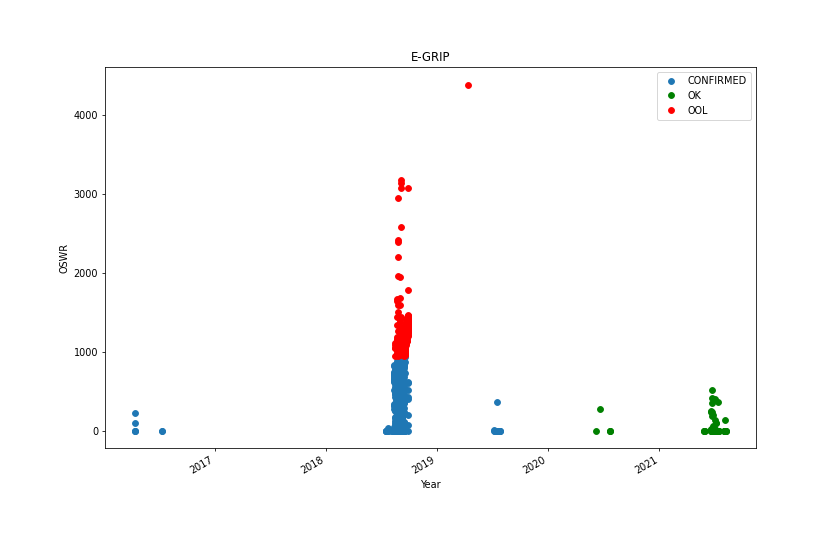
 
## Adjusting data at E-GRIP
### Adjusting HW1
|start time|end time|operation|value|number of removed samples|
|-|-|-|-|-|
|2014-01-01T00:00:00+00:00|2022-04-25T23:00:00+00:00|air_temp_sonic_correction|0.0|0|
|2014-01-01T00:00:00+00:00|2022-04-25T23:00:00+00:00|biweekly_upper_range_filter|0.4|2439|
|2014-01-01T00:00:00+00:00|2022-04-25T23:00:00+00:00|hampel_filter|2.0|3351|
 
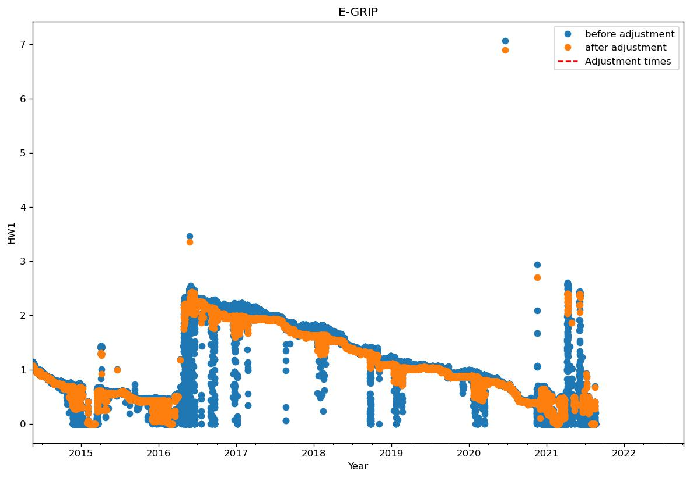
 
### Adjusting HW2
|start time|end time|operation|value|number of removed samples|
|-|-|-|-|-|
|2014-01-01T00:00:00+00:00|2022-04-25T23:00:00+00:00|air_temp_sonic_correction|0.0|0|
|2014-01-01T00:00:00+00:00|2022-04-25T23:00:00+00:00|biweekly_upper_range_filter|0.4|3205|
|2014-01-01T00:00:00+00:00|2022-04-25T23:00:00+00:00|hampel_filter|2.0|3592|
 
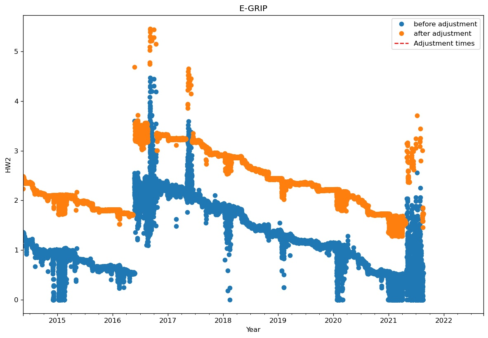
 
## Adjusting data at E-GRIP
### Adjusting HS1
|start time|end time|operation|value|number of removed samples|
|-|-|-|-|-|
|20160523T00:00:00+00:00|2022-04-25T23:00:00+00:00|add|2.0|0|
 
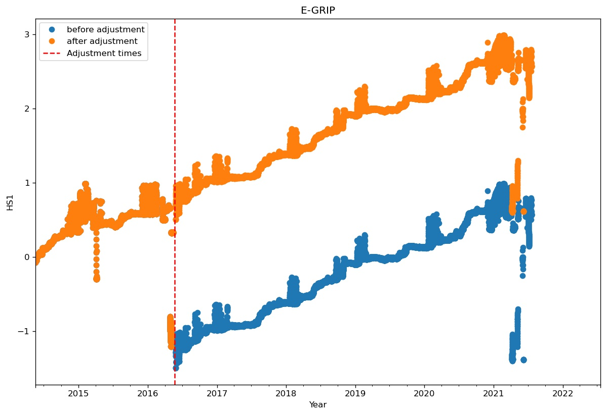
 
### Adjusting HS2
|start time|end time|operation|value|number of removed samples|
|-|-|-|-|-|
|20160523T00:00:00+00:00|2022-04-25T23:00:00+00:00|add|2.0|0|
 
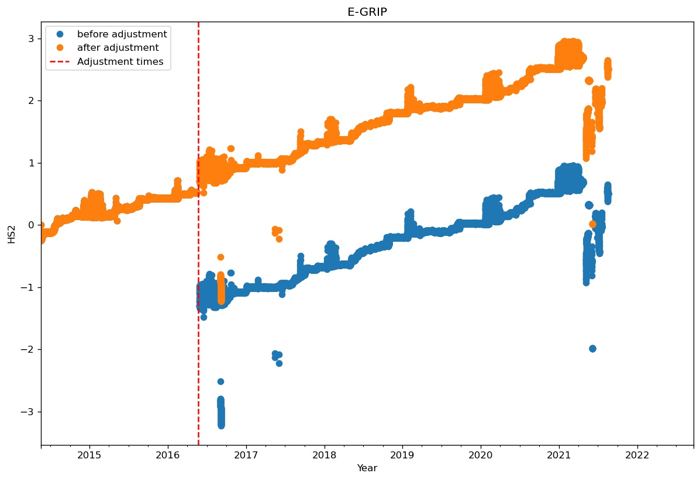
 
