# 0 Swiss Camp 10m
## Manual flagging of data at Swiss Camp 10m
Flagging data:
|start time|end time|variable|
|-|-|-|
|2017-08-21 00:00:00+00:00|2018-05-05 00:00:00+00:00|HW2|
 

 
|start time|end time|variable|
|-|-|-|
|2016-05-01 00:00:00+00:00|2017-06-01 00:00:00+00:00|OSWR|
 

 
|start time|end time|variable|
|-|-|-|
|2018-02-15 00:00:00+00:00|2018-05-05 00:00:00+00:00|P|
 

 
|start time|end time|variable|
|-|-|-|
|2015-05-15 00:00:00+00:00|2016-05-15 00:00:00+00:00|TA2|
 

 
|start time|end time|variable|
|-|-|-|
|2015-05-15 00:00:00+00:00|2016-05-15 00:00:00+00:00|TA3|
 

 
## Adjusting data at Swiss Camp 10m
### Adjusting HW1
|start time|end time|operation|value|number of removed samples|
|-|-|-|-|-|
|2014-01-01T00:00:00+00:00|2022-01-23T07:00:00+00:00|air_temp_sonic_correction|0.0|0|
|2014-01-01T00:00:00+00:00|2022-01-23T07:00:00+00:00|biweekly_upper_range_filter|0.5|2448|
|2014-01-01T00:00:00+00:00|2022-01-23T07:00:00+00:00|hampel_filter|2.0|3817|
 

 
### Adjusting HW2
|start time|end time|operation|value|number of removed samples|
|-|-|-|-|-|
|2014-01-01T00:00:00+00:00|2022-01-23T07:00:00+00:00|air_temp_sonic_correction|0.0|0|
|2014-01-01T00:00:00+00:00|2022-01-23T07:00:00+00:00|biweekly_upper_range_filter|0.5|8997|
|2014-01-01T00:00:00+00:00|2022-01-23T07:00:00+00:00|hampel_filter|2.0|2635|
 

 
## Adjusting data at Swiss Camp 10m
### Adjusting P
|start time|end time|operation|value|number of removed samples|
|-|-|-|-|-|
|2014-01-01T00:00:00+00:00|2022-01-23T07:00:00+00:00|add|-96.5|0|
 

 
# 1 Swiss Camp
## Manual flagging of data at Swiss Camp
Flagging data:
Warning: HS1 not found
Warning: HS2 not found
|start time|end time|variable|
|-|-|-|
|1995-01-01 00:00:00+00:00|1996-06-23 00:00:00+00:00|HW1|
|1998-06-04 00:00:00+00:00|1999-04-02 00:00:00+00:00|HW1|
 

 
|start time|end time|variable|
|-|-|-|
|2011-08-14 00:00:00+00:00|2012-05-24 00:00:00+00:00|HW2|
 

 
|start time|end time|variable|
|-|-|-|
|2009-07-01 00:00:00+00:00|2009-07-01 00:00:00+00:00|ISWR|
|2011-02-15 00:00:00+00:00|2011-05-10 00:00:00+00:00|ISWR|
 

 
|start time|end time|variable|
|-|-|-|
|2009-07-01 00:00:00+00:00|2009-07-01 00:00:00+00:00|OSWR|
|2011-02-15 00:00:00+00:00|2011-05-10 00:00:00+00:00|OSWR|
|2011-08-01 00:00:00+00:00|2012-05-10 00:00:00+00:00|OSWR|
 

 
|start time|end time|variable|
|-|-|-|
|2015-06-01 00:00:00+00:00|2016-05-01 00:00:00+00:00|RH2|
 

 
|start time|end time|variable|
|-|-|-|
|2015-06-01 00:00:00+00:00|2016-05-01 00:00:00+00:00|VW1|
 

 
## Adjusting data at Swiss Camp
### Adjusting HW1
|start time|end time|operation|value|number of removed samples|
|-|-|-|-|-|
|2009-05-15T00:00:00+00:00|2021-08-05T14:00:00+00:00|air_temp_sonic_correction|0.0|0|
|2009-05-15T00:00:00+00:00|2021-08-05T14:00:00+00:00|biweekly_upper_range_filter|0.5|9242|
|2009-05-15T00:00:00+00:00|2021-08-05T14:00:00+00:00|hampel_filter|2.0|732|
 

 
### Adjusting HW2
|start time|end time|operation|value|number of removed samples|
|-|-|-|-|-|
|1995-01-12T00:00:00+00:00|2000-01-01T00:00:00+00:00|max_filter|8.0|19148|
|2009-05-15T00:00:00+00:00|2021-08-05T14:00:00+00:00|air_temp_sonic_correction|0.0|0|
|2009-05-15T00:00:00+00:00|2021-08-05T14:00:00+00:00|biweekly_upper_range_filter|0.5|10880|
|2009-05-15T00:00:00+00:00|2021-08-05T14:00:00+00:00|hampel_filter|2.0|3274|
|2018-03-12T00:00:00+00:00|2018-05-12T00:00:00+00:00|max_filter|0.77|13|
 

 
## Adjusting data at Swiss Camp
### Adjusting HS1
|start time|end time|operation|value|number of removed samples|
|-|-|-|-|-|
|2002-01-19T00:00:00+00:00|2021-08-05T14:00:00+00:00|add|1.5|0|
|2003-01-19T00:00:00+00:00|2021-08-05T14:00:00+00:00|add|-0.6|0|
|2003-04-27T00:00:00+00:00|2021-08-05T14:00:00+00:00|add|0.4|0|
|2014-05-08T00:00:00+00:00|2021-08-05T14:00:00+00:00|add|-2.0|0|
 

 
### Adjusting HS2
|start time|end time|operation|value|number of removed samples|
|-|-|-|-|-|
|2014-05-08T00:00:00+00:00|2021-08-05T14:00:00+00:00|add|-2.0|0|
 

 
### Adjusting P
|start time|end time|operation|value|number of removed samples|
|-|-|-|-|-|
|2019-11-15T00:00:00+00:00|2021-08-05T14:00:00+00:00|min_filter|856.0|13334|
 

 
### Adjusting RH1
|start time|end time|operation|value|number of removed samples|
|-|-|-|-|-|
|1996-01-01T00:00:00+00:00|2011-01-01T00:00:00+00:00|ice_to_water|0.0|0|
 

 
### Adjusting RH2
|start time|end time|operation|value|number of removed samples|
|-|-|-|-|-|
|1996-01-01T00:00:00+00:00|2011-01-01T00:00:00+00:00|ice_to_water|0.0|0|
 

 
# 2 Crawford Point 1
## Manual flagging of data at Crawford Point 1
Flagging data:
|start time|end time|variable|
|-|-|-|
|2017-07-26 00:00:00+00:00|2020-01-01 00:00:00+00:00|HW2|
 

 
|start time|end time|variable|
|-|-|-|
|2011-05-25 00:00:00+00:00|2012-11-01 00:00:00+00:00|P|
 

 
|start time|end time|variable|
|-|-|-|
|2005-01-01 00:00:00+00:00|2007-05-10 00:00:00+00:00|TA1|
 

 
|start time|end time|variable|
|-|-|-|
|2017-03-10 00:00:00+00:00|2017-05-22 00:00:00+00:00|TA3|
 

 
|start time|end time|variable|
|-|-|-|
|1998-01-01 00:00:00+00:00|1999-01-01 00:00:00+00:00|TS1|
|2000-07-29 18:00:00+00:00|2000-08-10 00:00:00+00:00|TS1|
|2008-06-01 00:00:00+00:00|2020-07-22 09:00:00+00:00|TS1|
 

 
|start time|end time|variable|
|-|-|-|
|2000-08-01 00:00:00+00:00|2000-08-10 00:00:00+00:00|TS10|
|2000-08-01 00:00:00+00:00|2000-08-10 00:00:00+00:00|TS10|
|1998-01-01 00:00:00+00:00|1999-01-01 00:00:00+00:00|TS10|
|2008-06-01 00:00:00+00:00|2020-07-22 09:00:00+00:00|TS10|
 

 
|start time|end time|variable|
|-|-|-|
|2000-08-01 00:00:00+00:00|2000-08-10 00:00:00+00:00|TS2|
|1998-01-01 00:00:00+00:00|1999-01-01 00:00:00+00:00|TS2|
|2008-06-01 00:00:00+00:00|2020-07-22 09:00:00+00:00|TS2|
 

 
|start time|end time|variable|
|-|-|-|
|2000-08-01 00:00:00+00:00|2000-08-10 00:00:00+00:00|TS3|
|1998-01-01 00:00:00+00:00|1999-01-01 00:00:00+00:00|TS3|
|2000-10-26 04:00:00+00:00|2000-11-08 00:00:00+00:00|TS3|
|2001-09-05 06:00:00+00:00|2002-08-14 00:00:00+00:00|TS3|
|2003-10-14 08:00:00+00:00|2004-04-21 00:00:00+00:00|TS3|
|2008-06-01 00:00:00+00:00|2020-07-22 09:00:00+00:00|TS3|
 

 
|start time|end time|variable|
|-|-|-|
|2000-08-01 00:00:00+00:00|2000-08-10 00:00:00+00:00|TS4|
|2002-10-15 00:00:00+00:00|2002-11-05 00:00:00+00:00|TS4|
|2003-10-05 00:00:00+00:00|2003-11-30 00:00:00+00:00|TS4|
|1998-01-01 00:00:00+00:00|1999-01-01 00:00:00+00:00|TS4|
|2008-06-01 00:00:00+00:00|2020-07-22 09:00:00+00:00|TS4|
 

 
|start time|end time|variable|
|-|-|-|
|2000-08-01 00:00:00+00:00|2000-08-10 00:00:00+00:00|TS5|
|1998-01-01 00:00:00+00:00|1999-01-01 00:00:00+00:00|TS5|
|2008-06-01 00:00:00+00:00|2020-07-22 09:00:00+00:00|TS5|
 

 
|start time|end time|variable|
|-|-|-|
|2000-08-01 00:00:00+00:00|2000-08-10 00:00:00+00:00|TS6|
|1998-01-01 00:00:00+00:00|1999-01-01 00:00:00+00:00|TS6|
|2008-06-01 00:00:00+00:00|2020-07-22 09:00:00+00:00|TS6|
 

 
|start time|end time|variable|
|-|-|-|
|2000-08-01 00:00:00+00:00|2000-08-10 00:00:00+00:00|TS7|
|1998-01-01 00:00:00+00:00|1999-01-01 00:00:00+00:00|TS7|
|2003-09-30 17:00:00+00:00|2003-12-13 00:00:00+00:00|TS7|
|2008-06-01 00:00:00+00:00|2020-07-22 09:00:00+00:00|TS7|
 

 
|start time|end time|variable|
|-|-|-|
|2000-08-01 00:00:00+00:00|2000-08-10 00:00:00+00:00|TS8|
|2001-09-10 00:00:00+00:00|2001-12-01 00:00:00+00:00|TS8|
|2002-02-01 00:00:00+00:00|2002-07-20 00:00:00+00:00|TS8|
|2000-10-20 00:00:00+00:00|2000-11-10 00:00:00+00:00|TS8|
|2002-10-15 00:00:00+00:00|2002-11-05 00:00:00+00:00|TS8|
|2003-10-05 00:00:00+00:00|2004-06-30 00:00:00+00:00|TS8|
|1998-01-01 00:00:00+00:00|1999-01-01 00:00:00+00:00|TS8|
|2008-06-01 00:00:00+00:00|2020-07-22 09:00:00+00:00|TS8|
 

 
|start time|end time|variable|
|-|-|-|
|2000-08-01 00:00:00+00:00|2000-08-10 00:00:00+00:00|TS9|
|1998-01-01 00:00:00+00:00|1999-01-01 00:00:00+00:00|TS9|
|2008-06-01 00:00:00+00:00|2020-07-22 09:00:00+00:00|TS9|
 

 
## Adjusting data at Crawford Point 1
### Adjusting HW1
|start time|end time|operation|value|number of removed samples|
|-|-|-|-|-|
|2002-01-01T00:00:00+00:00|2003-01-01T00:00:00+00:00|add|-0.3|0|
|2002-09-24T00:00:00+00:00|2003-01-01T00:00:00+00:00|add|-0.94|0|
|2009-05-15T00:00:00+00:00|2020-07-22T09:00:00+00:00|air_temp_sonic_correction|0.0|0|
|2009-05-15T00:00:00+00:00|2020-07-22T09:00:00+00:00|biweekly_upper_range_filter|0.5|19346|
|2009-05-15T00:00:00+00:00|2020-07-22T09:00:00+00:00|hampel_filter|2.0|2185|
|2008-06-12 00:00:00+00:00|2009-04-27 00:00:00+00:00|time_shift|24.0|25|
|2003-04-19 14:00:00+00:00|2004-06-09 00:00:00+00:00|time_shift|24.0|24|
|1999-08-09 00:00:00+00:00|2000-06-04 06:00:00+00:00|time_shift|24.0|25|
|1990-01-01 16:00:00+00:00|1990-09-26 14:00:00+00:00|time_shift|180552.0|6431|
 

 
### Adjusting HW2
|start time|end time|operation|value|number of removed samples|
|-|-|-|-|-|
|2002-01-01T00:00:00+00:00|2003-01-01T00:00:00+00:00|add|-1.0|0|
|2009-05-15T00:00:00+00:00|2020-07-22T09:00:00+00:00|air_temp_sonic_correction|0.0|0|
|2009-05-15T00:00:00+00:00|2020-07-22T09:00:00+00:00|biweekly_upper_range_filter|0.5|6643|
|2009-05-15T00:00:00+00:00|2020-07-22T09:00:00+00:00|hampel_filter|2.0|1943|
|2008-06-12 00:00:00+00:00|2009-04-27 00:00:00+00:00|time_shift|24.0|25|
|2003-04-19 14:00:00+00:00|2004-06-09 00:00:00+00:00|time_shift|24.0|24|
|1999-08-09 00:00:00+00:00|2000-06-04 06:00:00+00:00|time_shift|24.0|25|
|1990-01-01 16:00:00+00:00|1990-09-26 14:00:00+00:00|time_shift|180552.0|5857|
 

 
## Adjusting data at Crawford Point 1
### Adjusting DW1
|start time|end time|operation|value|number of removed samples|
|-|-|-|-|-|
|2008-06-12 00:00:00+00:00|2009-04-27 00:00:00+00:00|time_shift|24.0|19|
|2003-04-19 14:00:00+00:00|2004-06-09 00:00:00+00:00|time_shift|24.0|25|
|1999-08-09 00:00:00+00:00|2000-06-04 06:00:00+00:00|time_shift|24.0|7|
|1990-01-01 16:00:00+00:00|1990-09-26 14:00:00+00:00|time_shift|180552.0|6431|
 
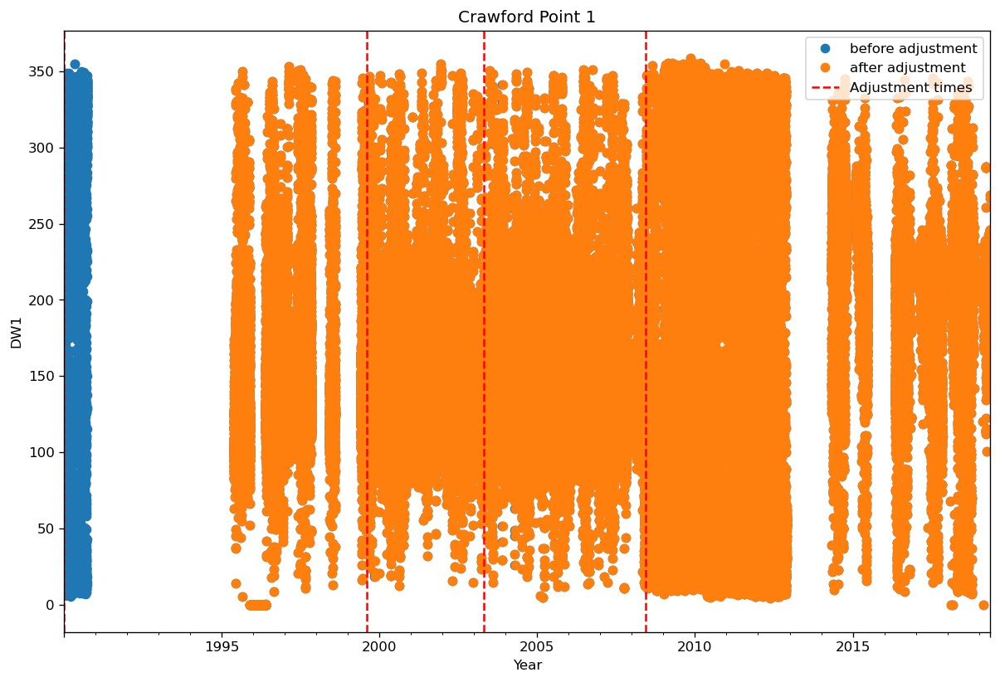
 
### Adjusting DW2
|start time|end time|operation|value|number of removed samples|
|-|-|-|-|-|
|2008-06-12 00:00:00+00:00|2009-04-27 00:00:00+00:00|time_shift|24.0|19|
|2003-04-19 14:00:00+00:00|2004-06-09 00:00:00+00:00|time_shift|24.0|25|
|1999-08-09 00:00:00+00:00|2000-06-04 06:00:00+00:00|time_shift|24.0|7|
|1990-01-01 16:00:00+00:00|1990-09-26 14:00:00+00:00|time_shift|180552.0|6431|
 
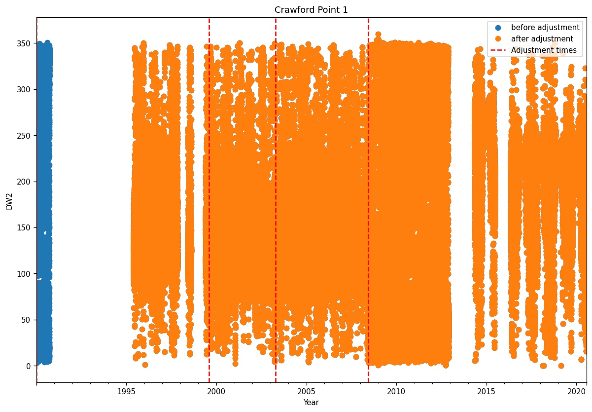
 
### Adjusting HS1
|start time|end time|operation|value|number of removed samples|
|-|-|-|-|-|
|1997-05-13T09:00:00+00:00|2020-07-22T09:00:00+00:00|add|2.5|0|
|1998-09-05T00:00:00+00:00|2020-07-22T09:00:00+00:00|add|3.0|0|
|2001-05-26T00:00:00+00:00|2020-07-22T09:00:00+00:00|add|2.0|0|
|2003-04-11T00:00:00+00:00|2020-07-22T09:00:00+00:00|add|2.5|0|
|2005-05-01T03:00:00+00:00|2020-07-22T09:00:00+00:00|add|3.0|0|
|2008-05-05T00:00:00+00:00|2020-07-22T09:00:00+00:00|add|2.7|0|
|2009-12-13T00:00:00+00:00|2020-07-22T09:00:00+00:00|add|1.0|0|
|2011-01-01T00:00:00+00:00|2020-07-22T09:00:00+00:00|add|3.5|0|
|2017-05-21T00:00:00+00:00|2020-07-22T09:00:00+00:00|add|3.0|0|
|2008-06-12 00:00:00+00:00|2009-04-27 00:00:00+00:00|time_shift|24.0|24|
|2003-04-19 14:00:00+00:00|2004-06-09 00:00:00+00:00|time_shift|24.0|24|
|1999-08-09 00:00:00+00:00|2000-06-04 06:00:00+00:00|time_shift|24.0|24|
|1990-01-01 16:00:00+00:00|1990-09-26 14:00:00+00:00|time_shift|180552.0|0|
 

 
### Adjusting HS2
|start time|end time|operation|value|number of removed samples|
|-|-|-|-|-|
|1997-05-13T09:00:00+00:00|2020-07-22T09:00:00+00:00|add|2.5|0|
|1998-09-05T00:00:00+00:00|2020-07-22T09:00:00+00:00|add|3.0|0|
|2001-05-26T00:00:00+00:00|2020-07-22T09:00:00+00:00|add|2.0|0|
|2003-04-11T00:00:00+00:00|2020-07-22T09:00:00+00:00|add|2.8|0|
|2005-05-01T03:00:00+00:00|2020-07-22T09:00:00+00:00|add|3.6|0|
|2008-05-05T00:00:00+00:00|2020-07-22T09:00:00+00:00|add|3.0|0|
|2009-12-10T00:00:00+00:00|2020-07-22T09:00:00+00:00|add|0.3|0|
|2010-05-11T00:00:00+00:00|2020-07-22T09:00:00+00:00|add|-2.5|0|
|2011-04-28T00:00:00+00:00|2020-07-22T09:00:00+00:00|add|2.5|0|
|2008-06-12 00:00:00+00:00|2009-04-27 00:00:00+00:00|time_shift|24.0|24|
|2003-04-19 14:00:00+00:00|2004-06-09 00:00:00+00:00|time_shift|24.0|24|
|1999-08-09 00:00:00+00:00|2000-06-04 06:00:00+00:00|time_shift|24.0|24|
|1990-01-01 16:00:00+00:00|1990-09-26 14:00:00+00:00|time_shift|180552.0|0|
 

 
### Adjusting ISWR
|start time|end time|operation|value|number of removed samples|
|-|-|-|-|-|
|2008-06-12 00:00:00+00:00|2009-04-27 00:00:00+00:00|time_shift|24.0|19|
|2003-04-19 14:00:00+00:00|2004-06-09 00:00:00+00:00|time_shift|24.0|25|
|1999-08-09 00:00:00+00:00|2000-06-04 06:00:00+00:00|time_shift|24.0|7|
|1990-01-01 16:00:00+00:00|1990-09-26 14:00:00+00:00|time_shift|180552.0|14|
 
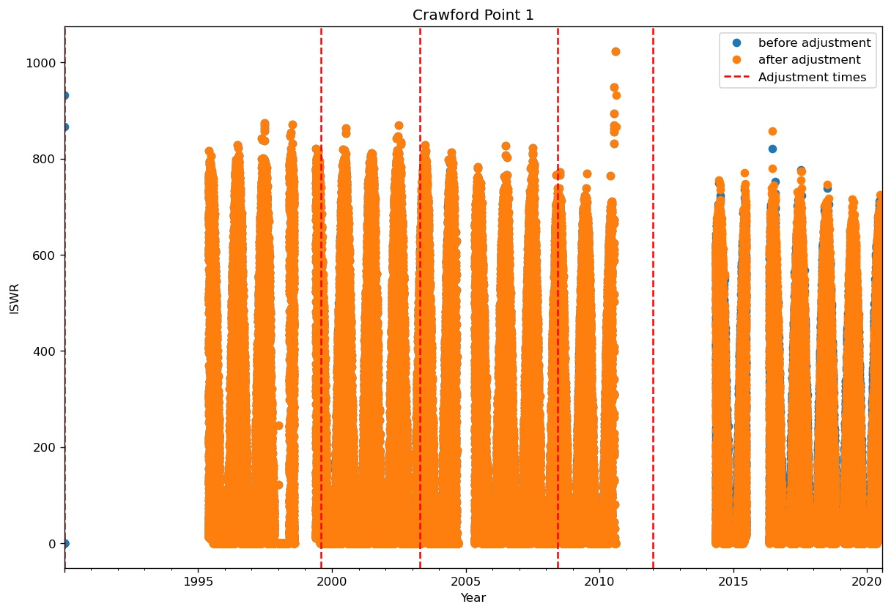
 
### Adjusting NSWR
|start time|end time|operation|value|number of removed samples|
|-|-|-|-|-|
|2008-06-12 00:00:00+00:00|2009-04-27 00:00:00+00:00|time_shift|24.0|19|
|2003-04-19 14:00:00+00:00|2004-06-09 00:00:00+00:00|time_shift|24.0|25|
|1999-08-09 00:00:00+00:00|2000-06-04 06:00:00+00:00|time_shift|24.0|7|
|1990-01-01 16:00:00+00:00|1990-09-26 14:00:00+00:00|time_shift|180552.0|1769|
 
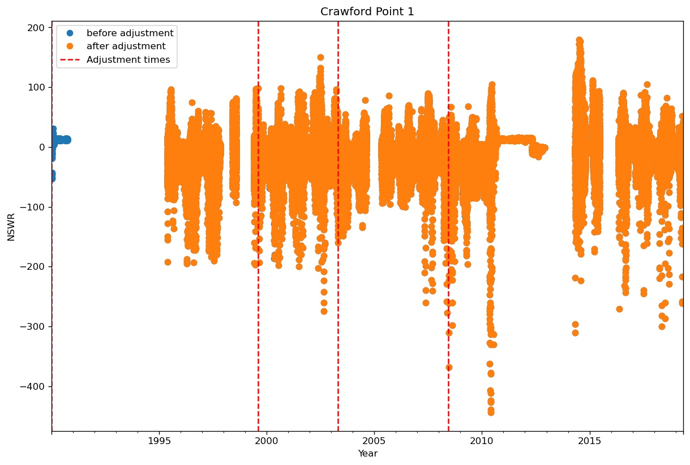
 
### Adjusting OSWR
|start time|end time|operation|value|number of removed samples|
|-|-|-|-|-|
|2008-06-12 00:00:00+00:00|2009-04-27 00:00:00+00:00|time_shift|24.0|19|
|2003-04-19 14:00:00+00:00|2004-06-09 00:00:00+00:00|time_shift|24.0|25|
|1999-08-09 00:00:00+00:00|2000-06-04 06:00:00+00:00|time_shift|24.0|7|
|1990-01-01 16:00:00+00:00|1990-09-26 14:00:00+00:00|time_shift|180552.0|22|
 

 
### Adjusting P
|start time|end time|operation|value|number of removed samples|
|-|-|-|-|-|
|2008-06-12 00:00:00+00:00|2009-04-27 00:00:00+00:00|time_shift|24.0|25|
|1999-01-01T00:00:00+00:00|2010-05-09T19:00:00+00:00|add|-12.0|0|
|2003-04-19 14:00:00+00:00|2004-06-09 00:00:00+00:00|time_shift|24.0|24|
|1999-08-09 00:00:00+00:00|2000-06-04 06:00:00+00:00|time_shift|24.0|1|
|1990-01-01 16:00:00+00:00|1990-09-26 14:00:00+00:00|time_shift|180552.0|6431|
 
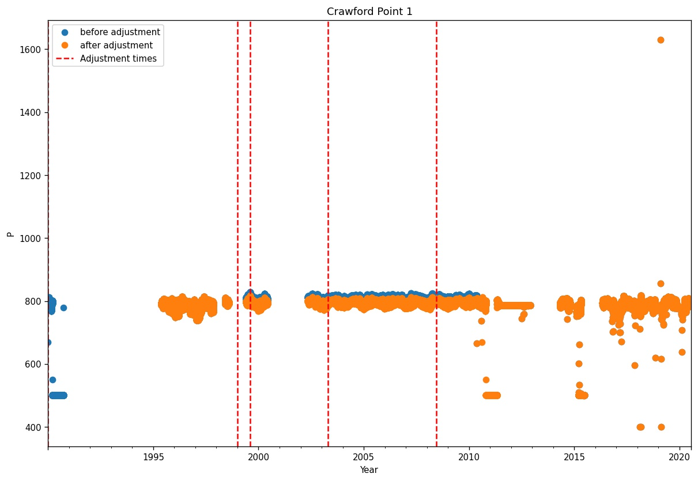
 
### Adjusting RH1
|start time|end time|operation|value|number of removed samples|
|-|-|-|-|-|
|2008-06-12 00:00:00+00:00|2009-04-27 00:00:00+00:00|time_shift|24.0|19|
|1996-01-01T00:00:00+00:00|2010-05-16T00:00:00+00:00|ice_to_water|0.0|0|
|2003-04-19 14:00:00+00:00|2004-06-09 00:00:00+00:00|time_shift|24.0|25|
|1999-08-09 00:00:00+00:00|2000-06-04 06:00:00+00:00|time_shift|24.0|7|
|1990-01-01 16:00:00+00:00|1990-09-26 14:00:00+00:00|time_shift|180552.0|6419|
 
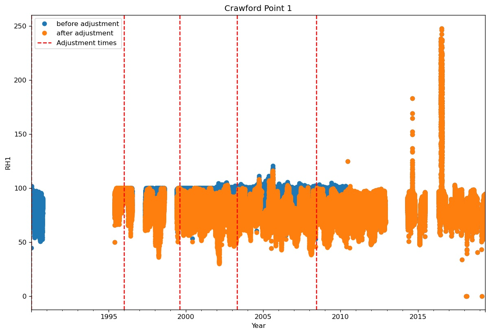
 
### Adjusting RH2
|start time|end time|operation|value|number of removed samples|
|-|-|-|-|-|
|2008-06-12 00:00:00+00:00|2009-04-27 00:00:00+00:00|time_shift|24.0|19|
|1996-01-01T00:00:00+00:00|2010-05-16T00:00:00+00:00|ice_to_water|0.0|0|
|2003-04-19 14:00:00+00:00|2004-06-09 00:00:00+00:00|time_shift|24.0|25|
|1999-08-09 00:00:00+00:00|2000-06-04 06:00:00+00:00|time_shift|24.0|4|
|1990-01-01 16:00:00+00:00|1990-09-26 14:00:00+00:00|time_shift|180552.0|6431|
 
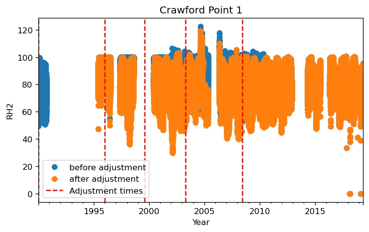
 
### Adjusting TA1
|start time|end time|operation|value|number of removed samples|
|-|-|-|-|-|
|2008-06-12 00:00:00+00:00|2009-04-27 00:00:00+00:00|time_shift|24.0|19|
|2003-04-19 14:00:00+00:00|2004-06-09 00:00:00+00:00|time_shift|24.0|25|
|1999-08-09 00:00:00+00:00|2000-06-04 06:00:00+00:00|time_shift|24.0|25|
|1990-01-01 16:00:00+00:00|1990-09-26 14:00:00+00:00|time_shift|180552.0|0|
 
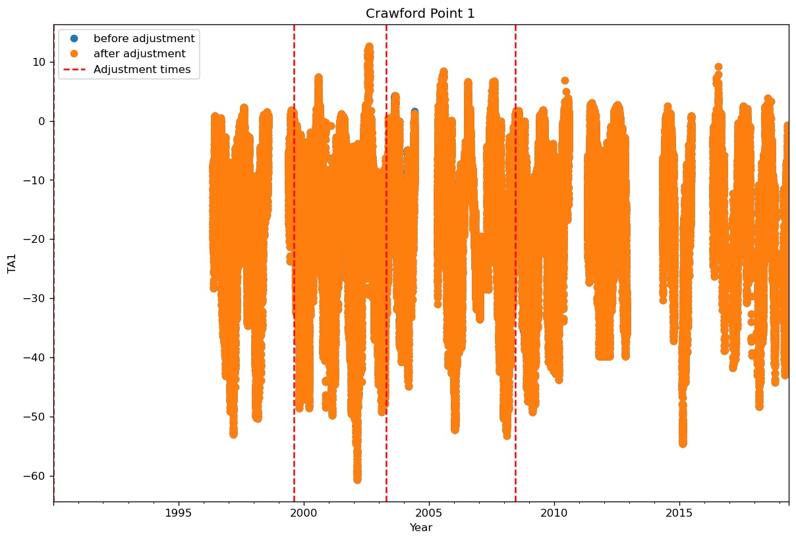
 
### Adjusting TA2
|start time|end time|operation|value|number of removed samples|
|-|-|-|-|-|
|2008-06-12 00:00:00+00:00|2009-04-27 00:00:00+00:00|time_shift|24.0|19|
|2003-04-19 14:00:00+00:00|2004-06-09 00:00:00+00:00|time_shift|24.0|25|
|1999-08-09 00:00:00+00:00|2000-06-04 06:00:00+00:00|time_shift|24.0|25|
|1990-01-01 16:00:00+00:00|1990-09-26 14:00:00+00:00|time_shift|180552.0|0|
 
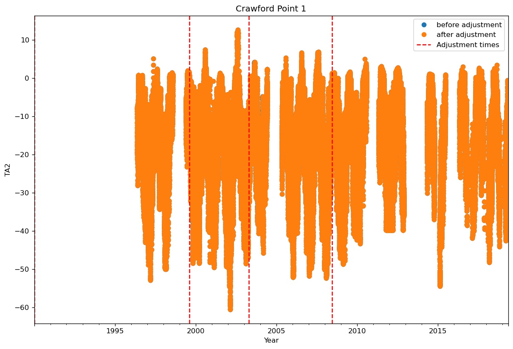
 
### Adjusting TA3
|start time|end time|operation|value|number of removed samples|
|-|-|-|-|-|
|2008-06-12 00:00:00+00:00|2009-04-27 00:00:00+00:00|time_shift|24.0|19|
|2003-04-19 14:00:00+00:00|2004-06-09 00:00:00+00:00|time_shift|24.0|25|
|1999-08-09 00:00:00+00:00|2000-06-04 06:00:00+00:00|time_shift|24.0|25|
|1990-01-01 16:00:00+00:00|1990-09-26 14:00:00+00:00|time_shift|180552.0|6429|
 
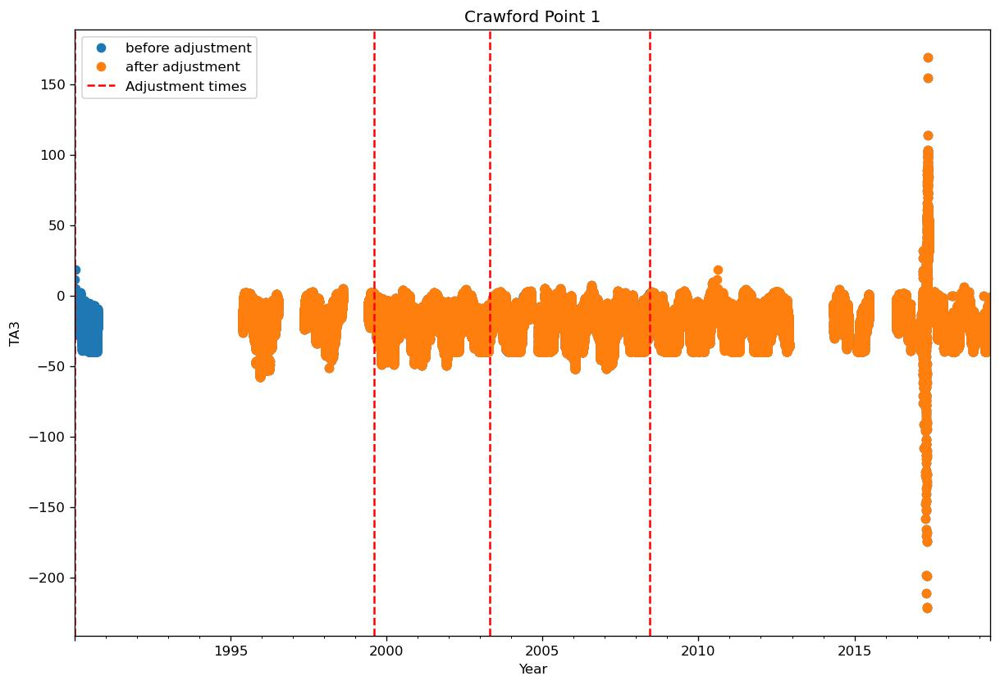
 
### Adjusting TA4
|start time|end time|operation|value|number of removed samples|
|-|-|-|-|-|
|2008-06-12 00:00:00+00:00|2009-04-27 00:00:00+00:00|time_shift|24.0|19|
|2003-04-19 14:00:00+00:00|2004-06-09 00:00:00+00:00|time_shift|24.0|25|
|1999-08-09 00:00:00+00:00|2000-06-04 06:00:00+00:00|time_shift|24.0|25|
|1990-01-01 16:00:00+00:00|1990-09-26 14:00:00+00:00|time_shift|180552.0|6431|
 
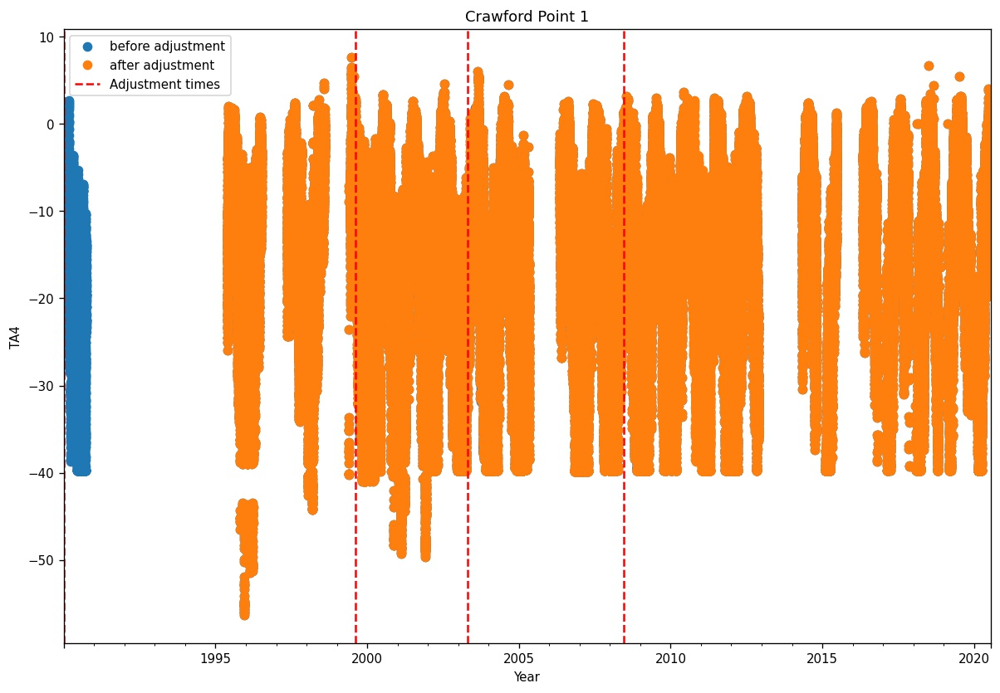
 
### Adjusting TA5
|start time|end time|operation|value|number of removed samples|
|-|-|-|-|-|
|2008-06-12 00:00:00+00:00|2009-04-27 00:00:00+00:00|time_shift|24.0|0|
|2003-04-19 14:00:00+00:00|2004-06-09 00:00:00+00:00|time_shift|24.0|0|
|1999-08-09 00:00:00+00:00|2000-06-04 06:00:00+00:00|time_shift|24.0|0|
|1990-01-01 16:00:00+00:00|1990-09-26 14:00:00+00:00|time_shift|180552.0|0|
 
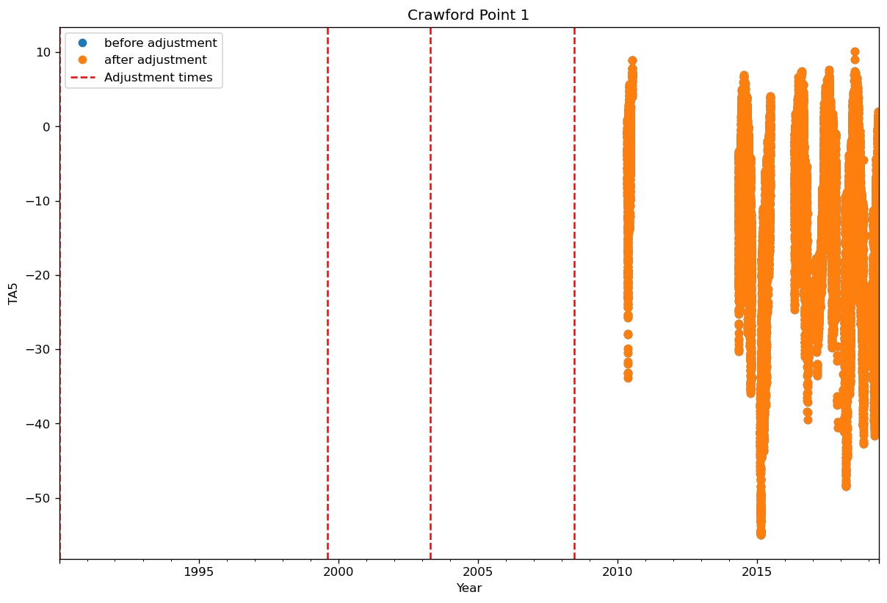
 
### Adjusting TS1
|start time|end time|operation|value|number of removed samples|
|-|-|-|-|-|
|2008-06-12 00:00:00+00:00|2009-04-27 00:00:00+00:00|time_shift|24.0|0|
|2003-04-19 14:00:00+00:00|2004-06-09 00:00:00+00:00|time_shift|24.0|25|
|1999-08-09 00:00:00+00:00|2000-06-04 06:00:00+00:00|time_shift|24.0|25|
|1990-01-01 16:00:00+00:00|1990-09-26 14:00:00+00:00|time_shift|180552.0|0|
 
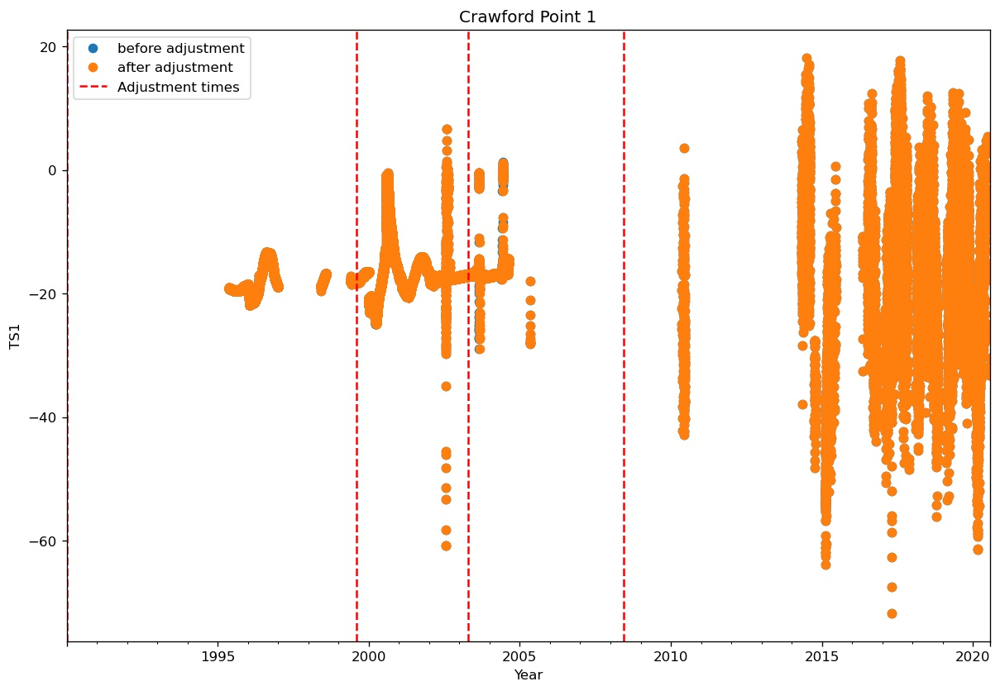
 
### Adjusting TS10
|start time|end time|operation|value|number of removed samples|
|-|-|-|-|-|
|2008-06-12 00:00:00+00:00|2009-04-27 00:00:00+00:00|time_shift|24.0|0|
|2003-04-19 14:00:00+00:00|2004-06-09 00:00:00+00:00|time_shift|24.0|25|
|1999-08-09 00:00:00+00:00|2000-06-04 06:00:00+00:00|time_shift|24.0|25|
|1990-01-01 16:00:00+00:00|1990-09-26 14:00:00+00:00|time_shift|180552.0|0|
 
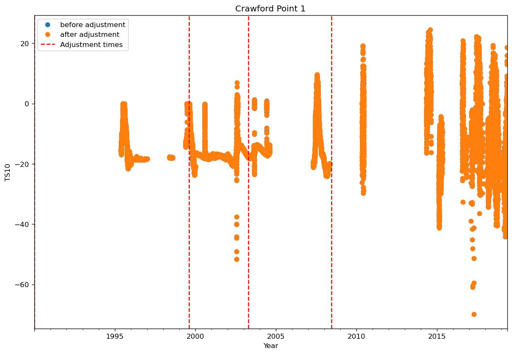
 
### Adjusting TS2
|start time|end time|operation|value|number of removed samples|
|-|-|-|-|-|
|2008-06-12 00:00:00+00:00|2009-04-27 00:00:00+00:00|time_shift|24.0|0|
|2003-04-19 14:00:00+00:00|2004-06-09 00:00:00+00:00|time_shift|24.0|25|
|1999-08-09 00:00:00+00:00|2000-06-04 06:00:00+00:00|time_shift|24.0|25|
|1990-01-01 16:00:00+00:00|1990-09-26 14:00:00+00:00|time_shift|180552.0|0|
 
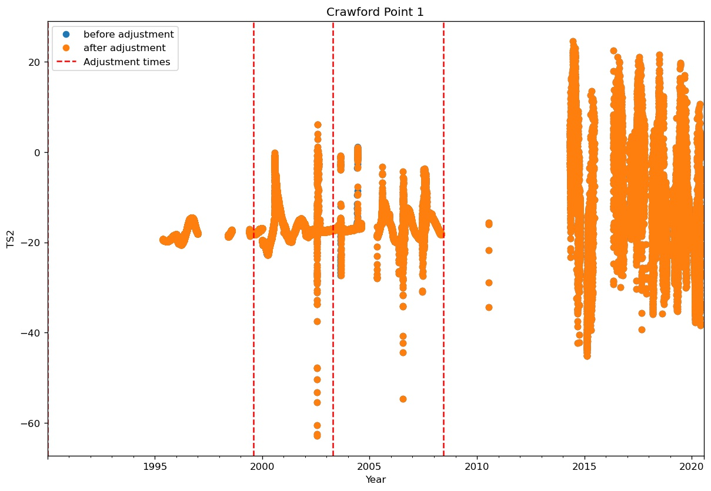
 
### Adjusting TS3
|start time|end time|operation|value|number of removed samples|
|-|-|-|-|-|
|2008-06-12 00:00:00+00:00|2009-04-27 00:00:00+00:00|time_shift|24.0|0|
|2003-04-19 14:00:00+00:00|2004-06-09 00:00:00+00:00|time_shift|24.0|25|
|1999-08-09 00:00:00+00:00|2000-06-04 06:00:00+00:00|time_shift|24.0|25|
|1990-01-01 16:00:00+00:00|1990-09-26 14:00:00+00:00|time_shift|180552.0|0|
 
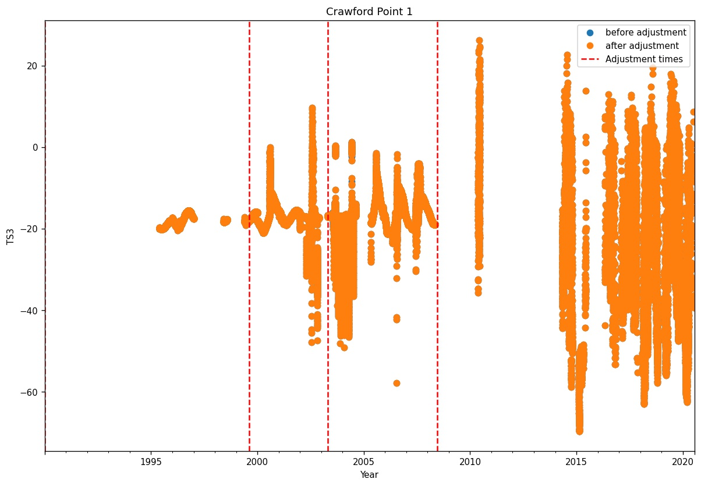
 
### Adjusting TS4
|start time|end time|operation|value|number of removed samples|
|-|-|-|-|-|
|2008-06-12 00:00:00+00:00|2009-04-27 00:00:00+00:00|time_shift|24.0|0|
|2003-04-19 14:00:00+00:00|2004-06-09 00:00:00+00:00|time_shift|24.0|25|
|1999-08-09 00:00:00+00:00|2000-06-04 06:00:00+00:00|time_shift|24.0|25|
|1990-01-01 16:00:00+00:00|1990-09-26 14:00:00+00:00|time_shift|180552.0|0|
 
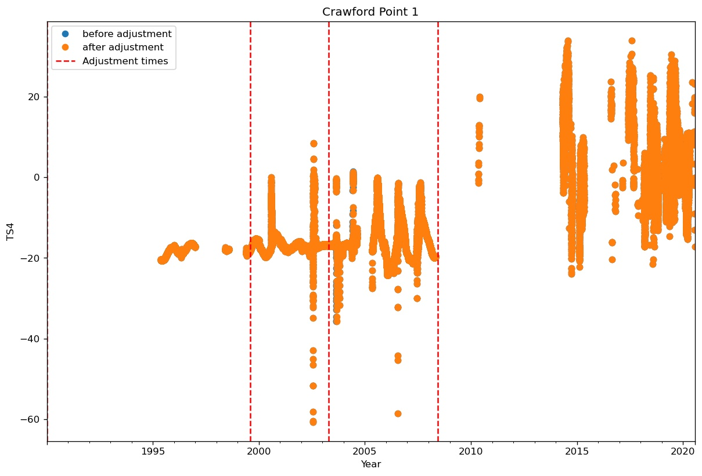
 
### Adjusting TS5
|start time|end time|operation|value|number of removed samples|
|-|-|-|-|-|
|2008-06-12 00:00:00+00:00|2009-04-27 00:00:00+00:00|time_shift|24.0|0|
|2003-04-19 14:00:00+00:00|2004-06-09 00:00:00+00:00|time_shift|24.0|25|
|1999-08-09 00:00:00+00:00|2000-06-04 06:00:00+00:00|time_shift|24.0|25|
|1990-01-01 16:00:00+00:00|1990-09-26 14:00:00+00:00|time_shift|180552.0|0|
 
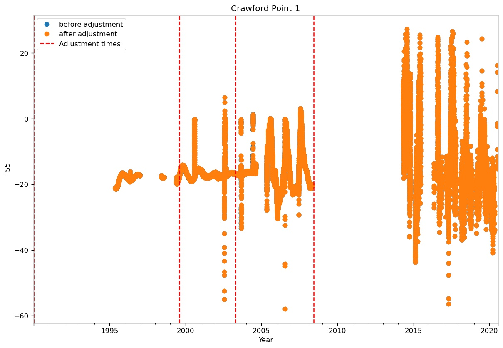
 
### Adjusting TS6
|start time|end time|operation|value|number of removed samples|
|-|-|-|-|-|
|2008-06-12 00:00:00+00:00|2009-04-27 00:00:00+00:00|time_shift|24.0|0|
|2003-04-19 14:00:00+00:00|2004-06-09 00:00:00+00:00|time_shift|24.0|25|
|1999-08-09 00:00:00+00:00|2000-06-04 06:00:00+00:00|time_shift|24.0|25|
|1990-01-01 16:00:00+00:00|1990-09-26 14:00:00+00:00|time_shift|180552.0|0|
 
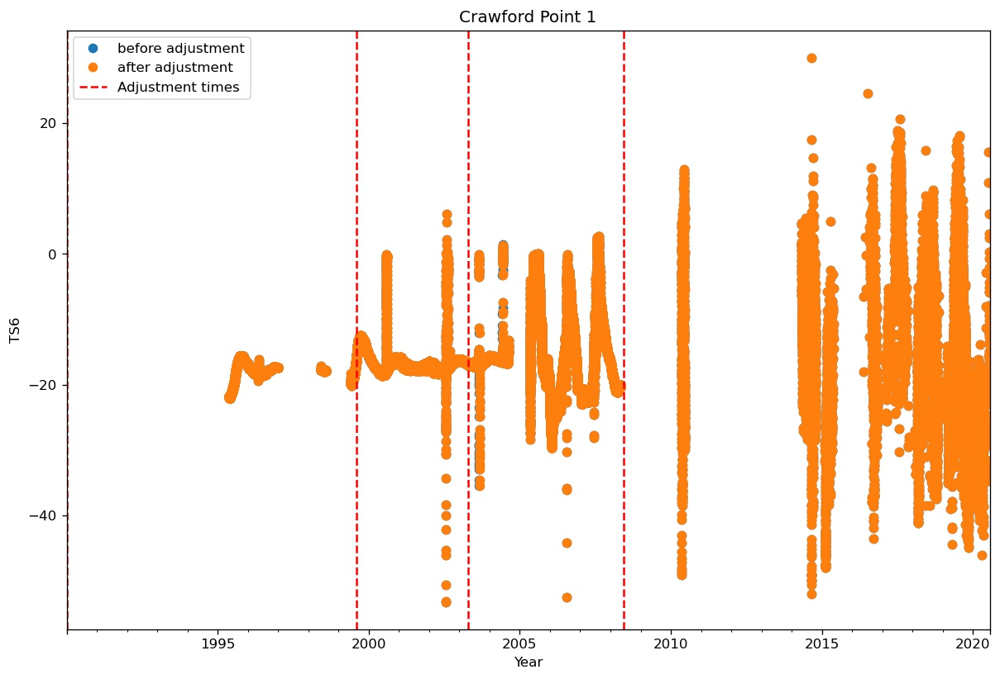
 
### Adjusting TS7
|start time|end time|operation|value|number of removed samples|
|-|-|-|-|-|
|2008-06-12 00:00:00+00:00|2009-04-27 00:00:00+00:00|time_shift|24.0|0|
|2003-04-19 14:00:00+00:00|2004-06-09 00:00:00+00:00|time_shift|24.0|25|
|1999-08-09 00:00:00+00:00|2000-06-04 06:00:00+00:00|time_shift|24.0|25|
|1990-01-01 16:00:00+00:00|1990-09-26 14:00:00+00:00|time_shift|180552.0|0|
 
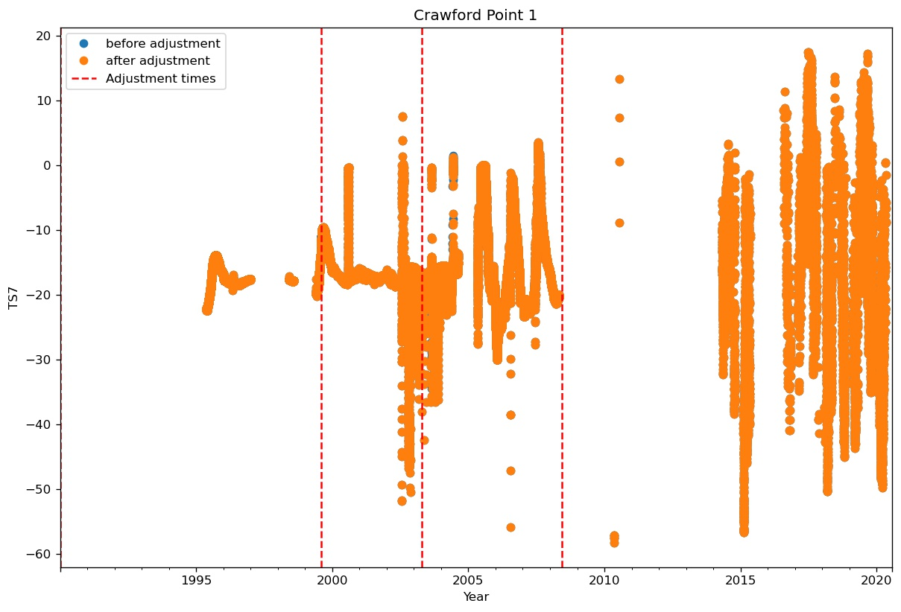
 
### Adjusting TS8
|start time|end time|operation|value|number of removed samples|
|-|-|-|-|-|
|2008-06-12 00:00:00+00:00|2009-04-27 00:00:00+00:00|time_shift|24.0|0|
|2003-04-19 14:00:00+00:00|2004-06-09 00:00:00+00:00|time_shift|24.0|25|
|1999-08-09 00:00:00+00:00|2000-06-04 06:00:00+00:00|time_shift|24.0|25|
|1990-01-01 16:00:00+00:00|1990-09-26 14:00:00+00:00|time_shift|180552.0|0|
 
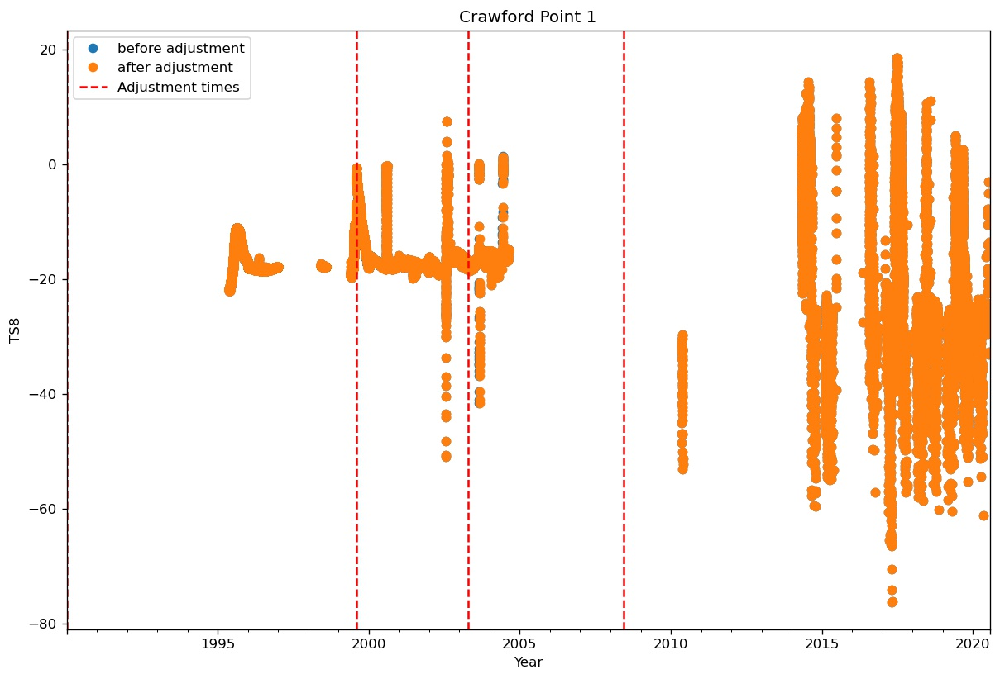
 
### Adjusting TS9
|start time|end time|operation|value|number of removed samples|
|-|-|-|-|-|
|2008-06-12 00:00:00+00:00|2009-04-27 00:00:00+00:00|time_shift|24.0|0|
|2003-04-19 14:00:00+00:00|2004-06-09 00:00:00+00:00|time_shift|24.0|25|
|1999-08-09 00:00:00+00:00|2000-06-04 06:00:00+00:00|time_shift|24.0|25|
|1990-01-01 16:00:00+00:00|1990-09-26 14:00:00+00:00|time_shift|180552.0|0|
 
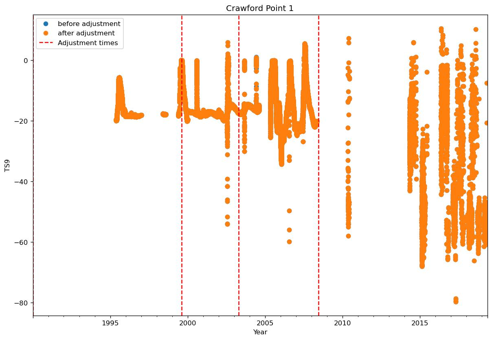
 
### Adjusting V
|start time|end time|operation|value|number of removed samples|
|-|-|-|-|-|
|2008-06-12 00:00:00+00:00|2009-04-27 00:00:00+00:00|time_shift|24.0|0|
|2003-04-19 14:00:00+00:00|2004-06-09 00:00:00+00:00|time_shift|24.0|0|
|1999-08-09 00:00:00+00:00|2000-06-04 06:00:00+00:00|time_shift|24.0|25|
|1990-01-01 16:00:00+00:00|1990-09-26 14:00:00+00:00|time_shift|180552.0|6431|
 
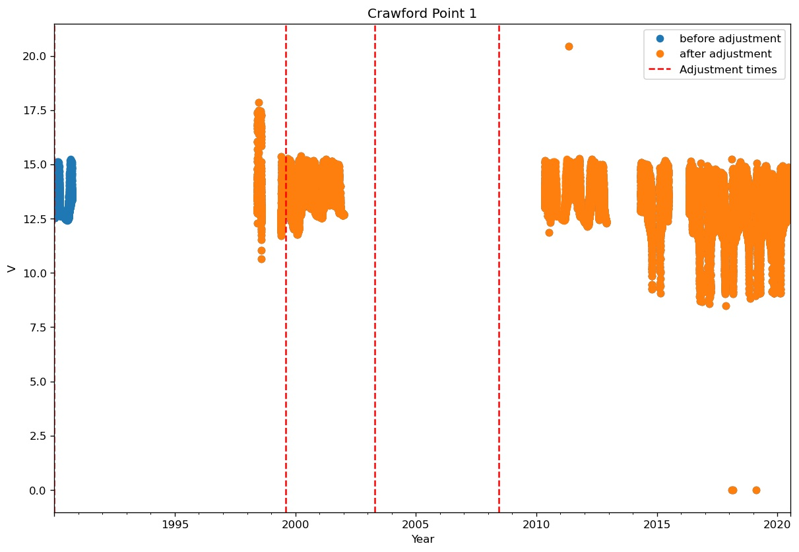
 
### Adjusting VW1
|start time|end time|operation|value|number of removed samples|
|-|-|-|-|-|
|2008-06-12 00:00:00+00:00|2009-04-27 00:00:00+00:00|time_shift|24.0|19|
|2003-04-19 14:00:00+00:00|2004-06-09 00:00:00+00:00|time_shift|24.0|25|
|1999-08-09 00:00:00+00:00|2000-06-04 06:00:00+00:00|time_shift|24.0|7|
|1990-01-01 16:00:00+00:00|1990-09-26 14:00:00+00:00|time_shift|180552.0|6431|
 

 
### Adjusting VW2
|start time|end time|operation|value|number of removed samples|
|-|-|-|-|-|
|2008-06-12 00:00:00+00:00|2009-04-27 00:00:00+00:00|time_shift|24.0|19|
|2003-04-19 14:00:00+00:00|2004-06-09 00:00:00+00:00|time_shift|24.0|25|
|1999-08-09 00:00:00+00:00|2000-06-04 06:00:00+00:00|time_shift|24.0|7|
|1990-01-01 16:00:00+00:00|1990-09-26 14:00:00+00:00|time_shift|180552.0|6431|
 
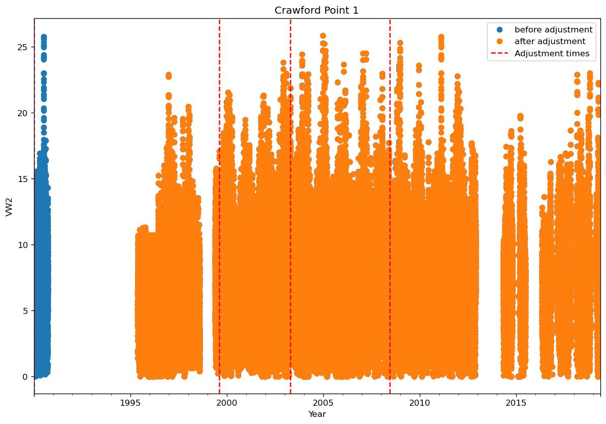
 
# 3 NASA-U
## Manual flagging of data at NASA-U
Flagging data:
|start time|end time|variable|
|-|-|-|
|2013-09-01 00:00:00+00:00|2014-05-21 00:00:00+00:00|HW1|
|2016-10-10 00:00:00+00:00|2018-07-01 00:00:00+00:00|HW1|
 

 
|start time|end time|variable|
|-|-|-|
|2016-10-10 00:00:00+00:00|2018-07-01 00:00:00+00:00|HW2|
 

 
|start time|end time|variable|
|-|-|-|
|2011-01-01 00:00:00+00:00|2016-07-01 00:00:00+00:00|P|
|2017-08-01 00:00:00+00:00|2018-12-31 00:00:00+00:00|P|
 

 
|start time|end time|variable|
|-|-|-|
|2017-10-01 00:00:00+00:00|2018-07-01 00:00:00+00:00|RH1|
 

 
|start time|end time|variable|
|-|-|-|
|2011-01-01 00:00:00+00:00|2012-07-01 00:00:00+00:00|RH2|
 

 
|start time|end time|variable|
|-|-|-|
|2017-12-11 00:00:00+00:00|2019-07-01 00:00:00+00:00|TA3|
 

 
|start time|end time|variable|
|-|-|-|
|2011-01-01 00:00:00+00:00|2012-05-25 00:00:00+00:00|TA4|
 

 
|start time|end time|variable|
|-|-|-|
|2010-01-01 00:00:00+00:00|2022-06-09 23:00:00+00:00|TS1|
 
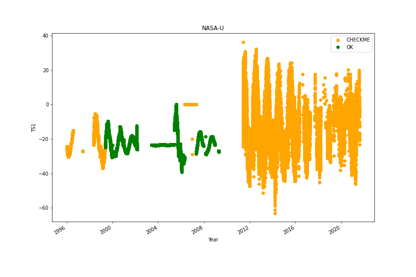
 
|start time|end time|variable|
|-|-|-|
|2013-07-01 00:00:00+00:00|2022-06-09 23:00:00+00:00|TS10|
 
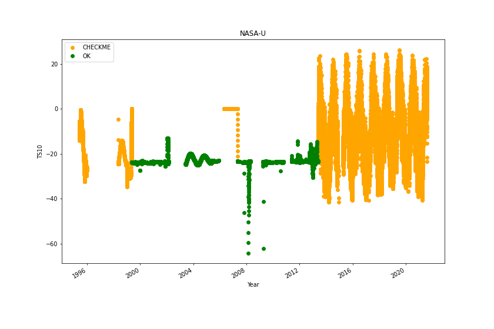
 
|start time|end time|variable|
|-|-|-|
|2010-01-01 00:00:00+00:00|2022-06-09 23:00:00+00:00|TS2|
 
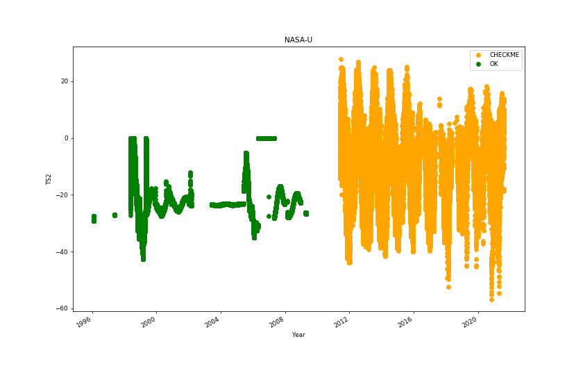
 
|start time|end time|variable|
|-|-|-|
|2010-01-01 00:00:00+00:00|2022-06-09 23:00:00+00:00|TS3|
 
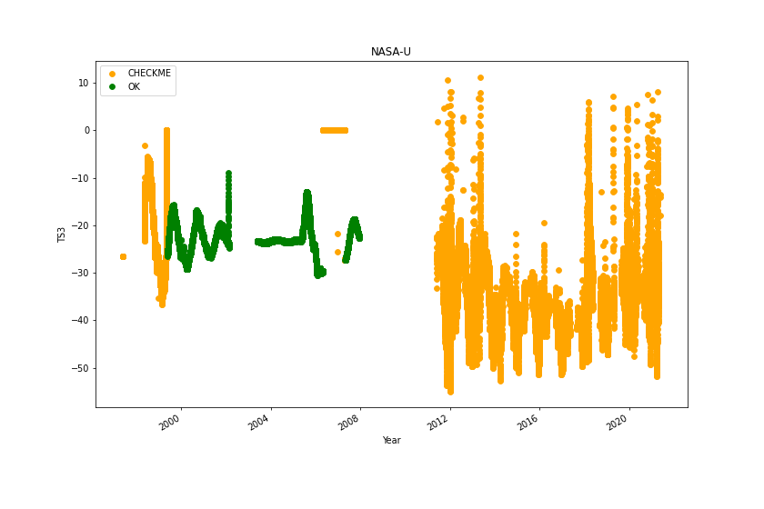
 
|start time|end time|variable|
|-|-|-|
|2013-07-01 00:00:00+00:00|2022-06-09 23:00:00+00:00|TS4|
 
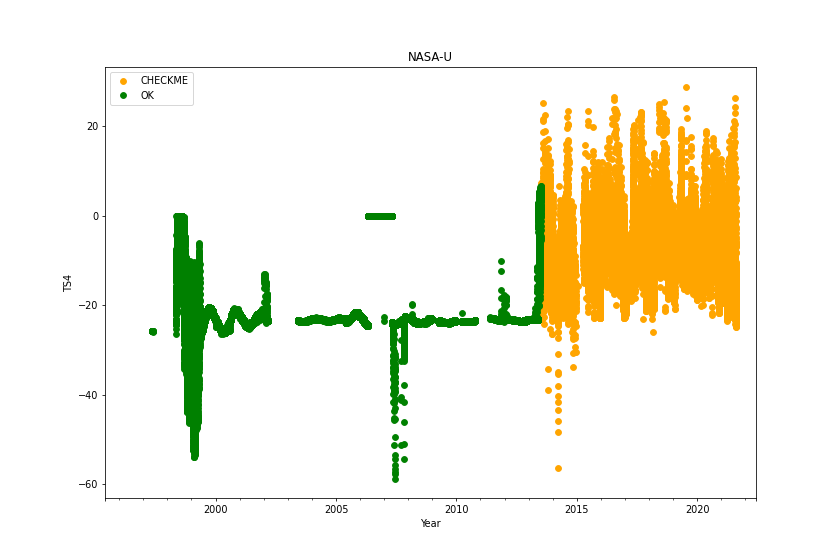
 
|start time|end time|variable|
|-|-|-|
|2013-07-01 00:00:00+00:00|2022-06-09 23:00:00+00:00|TS5|
 
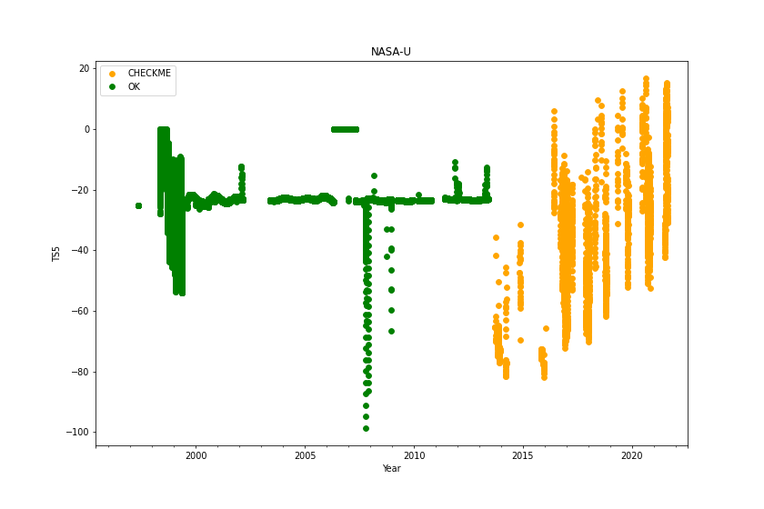
 
|start time|end time|variable|
|-|-|-|
|2013-07-01 00:00:00+00:00|2022-06-09 23:00:00+00:00|TS6|
 
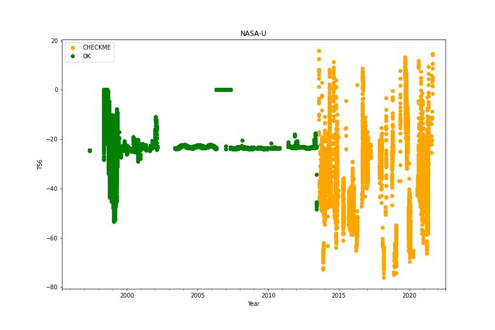
 
|start time|end time|variable|
|-|-|-|
|2013-07-01 00:00:00+00:00|2022-06-09 23:00:00+00:00|TS7|
 
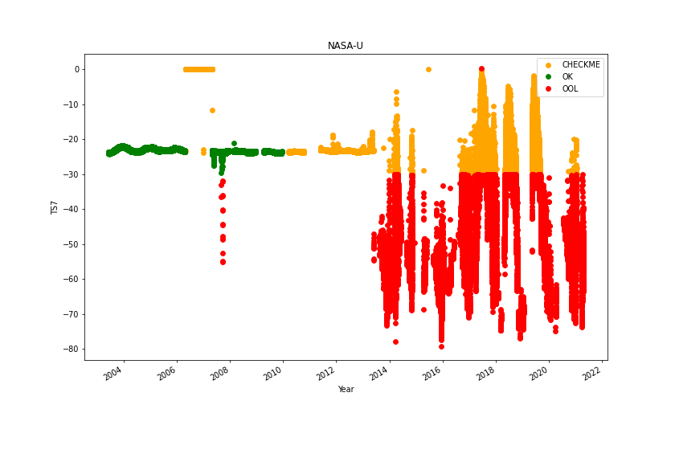
 
|start time|end time|variable|
|-|-|-|
|2013-07-01 00:00:00+00:00|2022-06-09 23:00:00+00:00|TS8|
 
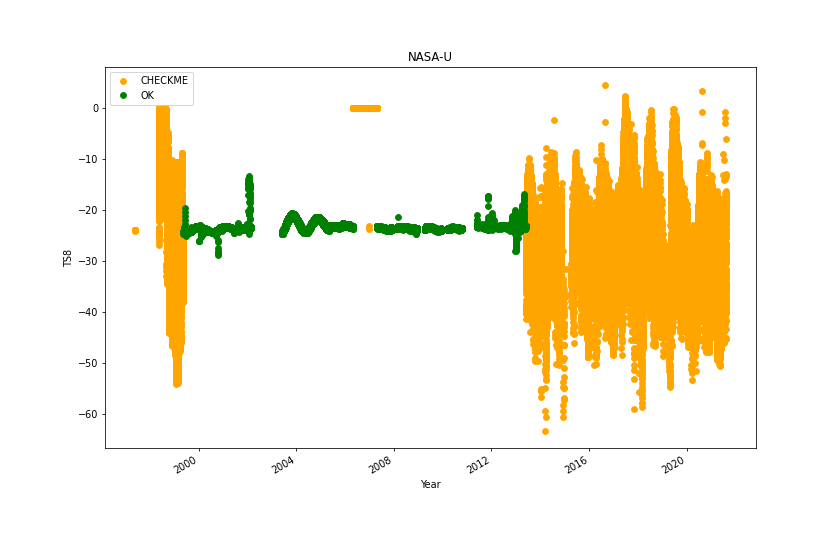
 
|start time|end time|variable|
|-|-|-|
|2013-07-01 00:00:00+00:00|2022-06-09 23:00:00+00:00|TS9|
 

 
## Adjusting data at NASA-U
### Adjusting HW1
|start time|end time|operation|value|number of removed samples|
|-|-|-|-|-|
|2009-05-15T00:00:00+00:00|2022-06-09T23:00:00+00:00|air_temp_sonic_correction|0.0|0|
|2009-05-15T00:00:00+00:00|2022-06-09T23:00:00+00:00|biweekly_upper_range_filter|0.3|20189|
|2009-05-15T00:00:00+00:00|2022-06-09T23:00:00+00:00|hampel_filter|2.0|2547|
|2010-03-20 00:00:00+00:00|2010-10-11 00:00:00+00:00|time_shift|48.0|3|
 

 
### Adjusting HW2
|start time|end time|operation|value|number of removed samples|
|-|-|-|-|-|
|2009-05-15T00:00:00+00:00|2022-06-09T23:00:00+00:00|air_temp_sonic_correction|0.0|0|
|2009-05-15T00:00:00+00:00|2022-06-09T23:00:00+00:00|biweekly_upper_range_filter|0.3|22656|
|2009-05-15T00:00:00+00:00|2022-06-09T23:00:00+00:00|hampel_filter|2.0|3429|
|2010-03-20 00:00:00+00:00|2010-10-11 00:00:00+00:00|time_shift|48.0|0|
 

 
## Adjusting data at NASA-U
### Adjusting DW1
|start time|end time|operation|value|number of removed samples|
|-|-|-|-|-|
|2010-03-20 00:00:00+00:00|2010-10-11 00:00:00+00:00|time_shift|48.0|4|
 

 
### Adjusting DW2
|start time|end time|operation|value|number of removed samples|
|-|-|-|-|-|
|2010-03-20 00:00:00+00:00|2010-10-11 00:00:00+00:00|time_shift|48.0|4|
 

 
### Adjusting HS1
|start time|end time|operation|value|number of removed samples|
|-|-|-|-|-|
|1997-01-01T00:00:00+00:00|2022-06-09T23:00:00+00:00|add|1.25|0|
|1999-05-14T16:00:00+00:00|2022-06-09T23:00:00+00:00|add|2.25|0|
|2003-06-03T16:00:00+00:00|2022-06-09T23:00:00+00:00|add|4.0|0|
|2005-05-25T00:00:00+00:00|2022-06-09T23:00:00+00:00|add|2.5|0|
|2009-04-20T16:00:00+00:00|2022-06-09T23:00:00+00:00|add|1.5|0|
|2011-06-01T22:00:00+00:00|2022-06-09T23:00:00+00:00|add|0.7|0|
|2014-05-31T00:00:00+00:00|2022-06-09T23:00:00+00:00|add|2.0|0|
|2018-01-01T00:00:00+00:00|2022-06-09T23:00:00+00:00|add|2.0|0|
|2010-03-20 00:00:00+00:00|2010-10-11 00:00:00+00:00|time_shift|48.0|48|
 

 
### Adjusting HS2
|start time|end time|operation|value|number of removed samples|
|-|-|-|-|-|
|1997-01-01T00:00:00+00:00|2022-06-09T23:00:00+00:00|add|1.25|0|
|1997-05-01T00:00:00+00:00|2022-06-09T23:00:00+00:00|add|1.25|0|
|1999-05-14T16:00:00+00:00|2022-06-09T23:00:00+00:00|add|2.25|0|
|2003-06-03T16:00:00+00:00|2022-06-09T23:00:00+00:00|add|4.0|0|
|2005-05-25T00:00:00+00:00|2022-06-09T23:00:00+00:00|add|2.8|0|
|2009-04-20T16:00:00+00:00|2022-06-09T23:00:00+00:00|add|2.0|0|
|2011-06-01T22:00:00+00:00|2022-06-09T23:00:00+00:00|add|0.58|0|
|2013-06-04T00:00:00+00:00|2022-06-09T23:00:00+00:00|add|2.5|0|
|2017-01-15T00:00:00+00:00|2022-06-09T23:00:00+00:00|add|1.5|0|
|2010-03-20 00:00:00+00:00|2010-10-11 00:00:00+00:00|time_shift|48.0|44|
 

 
### Adjusting ISWR
|start time|end time|operation|value|number of removed samples|
|-|-|-|-|-|
|2010-03-20 00:00:00+00:00|2010-10-11 00:00:00+00:00|time_shift|48.0|4|
 

 
### Adjusting NSWR
|start time|end time|operation|value|number of removed samples|
|-|-|-|-|-|
|2010-03-20 00:00:00+00:00|2010-10-11 00:00:00+00:00|time_shift|48.0|4|
 
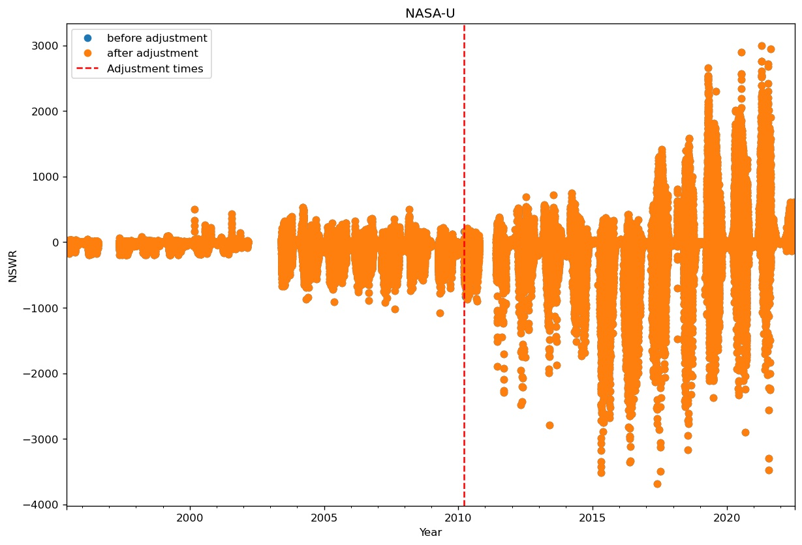
 
### Adjusting OSWR
|start time|end time|operation|value|number of removed samples|
|-|-|-|-|-|
|2003-01-01T00:00:00+00:00|2019-01-01T00:00:00+00:00|multiply|2.76205|0|
|2010-03-20 00:00:00+00:00|2010-10-11 00:00:00+00:00|time_shift|48.0|4|
 

 
### Adjusting P
|start time|end time|operation|value|number of removed samples|
|-|-|-|-|-|
|1999-05-14T00:00:00+00:00|2000-01-01T00:00:00+00:00|add|-30.0|0|
|2000-01-01T00:00:00+00:00|2005-05-26T00:00:00+00:00|add|-15.0|0|
|2016-07-01T00:00:00+00:00|2022-06-09T23:00:00+00:00|add|-40.0|0|
|2010-03-20 00:00:00+00:00|2010-10-11 00:00:00+00:00|time_shift|48.0|0|
 

 
### Adjusting RH1
|start time|end time|operation|value|number of removed samples|
|-|-|-|-|-|
|2010-03-20 00:00:00+00:00|2010-10-11 00:00:00+00:00|time_shift|48.0|4|
 

 
### Adjusting RH2
|start time|end time|operation|value|number of removed samples|
|-|-|-|-|-|
|2010-03-20 00:00:00+00:00|2010-10-11 00:00:00+00:00|time_shift|48.0|0|
 

 
### Adjusting TA1
|start time|end time|operation|value|number of removed samples|
|-|-|-|-|-|
|2010-03-20 00:00:00+00:00|2010-10-11 00:00:00+00:00|time_shift|48.0|4|
 

 
### Adjusting TA2
|start time|end time|operation|value|number of removed samples|
|-|-|-|-|-|
|2010-03-20 00:00:00+00:00|2010-10-11 00:00:00+00:00|time_shift|48.0|4|
 

 
### Adjusting TA3
|start time|end time|operation|value|number of removed samples|
|-|-|-|-|-|
|2010-03-20 00:00:00+00:00|2010-10-11 00:00:00+00:00|time_shift|48.0|4|
 

 
### Adjusting TA4
|start time|end time|operation|value|number of removed samples|
|-|-|-|-|-|
|2010-03-20 00:00:00+00:00|2010-10-11 00:00:00+00:00|time_shift|48.0|0|
 

 
### Adjusting TA5
|start time|end time|operation|value|number of removed samples|
|-|-|-|-|-|
|2010-03-20 00:00:00+00:00|2010-10-11 00:00:00+00:00|time_shift|48.0|0|
 

 
### Adjusting TS1
|start time|end time|operation|value|number of removed samples|
|-|-|-|-|-|
|2010-03-20 00:00:00+00:00|2010-10-11 00:00:00+00:00|time_shift|48.0|0|
 

 
### Adjusting TS10
|start time|end time|operation|value|number of removed samples|
|-|-|-|-|-|
|2010-03-20 00:00:00+00:00|2010-10-11 00:00:00+00:00|time_shift|48.0|4|
 

 
### Adjusting TS2
|start time|end time|operation|value|number of removed samples|
|-|-|-|-|-|
|2010-03-20 00:00:00+00:00|2010-10-11 00:00:00+00:00|time_shift|48.0|0|
 

 
### Adjusting TS3
|start time|end time|operation|value|number of removed samples|
|-|-|-|-|-|
|2010-03-20 00:00:00+00:00|2010-10-11 00:00:00+00:00|time_shift|48.0|0|
 

 
### Adjusting TS4
|start time|end time|operation|value|number of removed samples|
|-|-|-|-|-|
|2010-03-20 00:00:00+00:00|2010-10-11 00:00:00+00:00|time_shift|48.0|4|
 

 
### Adjusting TS5
|start time|end time|operation|value|number of removed samples|
|-|-|-|-|-|
|2010-03-20 00:00:00+00:00|2010-10-11 00:00:00+00:00|time_shift|48.0|4|
 

 
### Adjusting TS6
|start time|end time|operation|value|number of removed samples|
|-|-|-|-|-|
|2010-03-20 00:00:00+00:00|2010-10-11 00:00:00+00:00|time_shift|48.0|4|
 

 
### Adjusting TS7
|start time|end time|operation|value|number of removed samples|
|-|-|-|-|-|
|2010-03-20 00:00:00+00:00|2010-10-11 00:00:00+00:00|time_shift|48.0|4|
 

 
### Adjusting TS8
|start time|end time|operation|value|number of removed samples|
|-|-|-|-|-|
|2010-03-20 00:00:00+00:00|2010-10-11 00:00:00+00:00|time_shift|48.0|4|
 

 
### Adjusting TS9
|start time|end time|operation|value|number of removed samples|
|-|-|-|-|-|
|2010-03-20 00:00:00+00:00|2010-10-11 00:00:00+00:00|time_shift|48.0|4|
 

 
### Adjusting V
|start time|end time|operation|value|number of removed samples|
|-|-|-|-|-|
|2010-03-20 00:00:00+00:00|2010-10-11 00:00:00+00:00|time_shift|48.0|4|
 

 
### Adjusting VW1
|start time|end time|operation|value|number of removed samples|
|-|-|-|-|-|
|2010-03-20 00:00:00+00:00|2010-10-11 00:00:00+00:00|time_shift|48.0|4|
 

 
### Adjusting VW2
|start time|end time|operation|value|number of removed samples|
|-|-|-|-|-|
|2010-03-20 00:00:00+00:00|2010-10-11 00:00:00+00:00|time_shift|48.0|4|
 

 
# 4 GITS
## Manual flagging of data at GITS
Flagging data:
|start time|end time|variable|
|-|-|-|
|2015-08-23 00:00:00+00:00|2016-04-06 00:00:00+00:00|HW1|
|2016-06-07 00:00:00+00:00|2018-05-15 00:00:00+00:00|HW1|
 

 
|start time|end time|variable|
|-|-|-|
|2011-05-25 00:00:00+00:00|2013-01-01 00:00:00+00:00|P|
|2007-01-01 00:00:00+00:00|2014-05-01 00:00:00+00:00|P|
|1995-01-01 00:00:00+00:00|1996-05-01 00:00:00+00:00|P|
 

 
|start time|end time|variable|
|-|-|-|
|2010-01-01 00:00:00+00:00|2012-05-26 00:00:00+00:00|RH1|
|2020-08-23 00:00:00+00:00|2021-08-30 00:00:00+00:00|RH1|
 

 
|start time|end time|variable|
|-|-|-|
|2006-06-28 00:00:00+00:00|2007-07-05 00:00:00+00:00|TA1|
|2013-09-04 00:00:00+00:00|2014-05-21 00:00:00+00:00|TA1|
|2010-01-01 00:00:00+00:00|2012-05-26 00:00:00+00:00|TA1|
 

 
|start time|end time|variable|
|-|-|-|
|2010-01-01 00:00:00+00:00|2012-05-26 00:00:00+00:00|TA2|
 
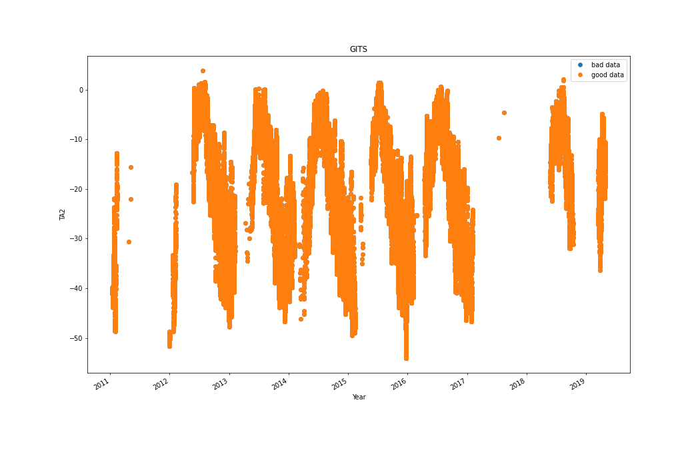
 
|start time|end time|variable|
|-|-|-|
|2010-01-01 00:00:00+00:00|2012-05-26 00:00:00+00:00|TA3|
|2014-04-15 00:00:00+00:00|2014-05-21 00:00:00+00:00|TA3|
 

 
|start time|end time|variable|
|-|-|-|
|2010-01-01 00:00:00+00:00|2021-08-13 12:00:00+00:00|TS1|
 
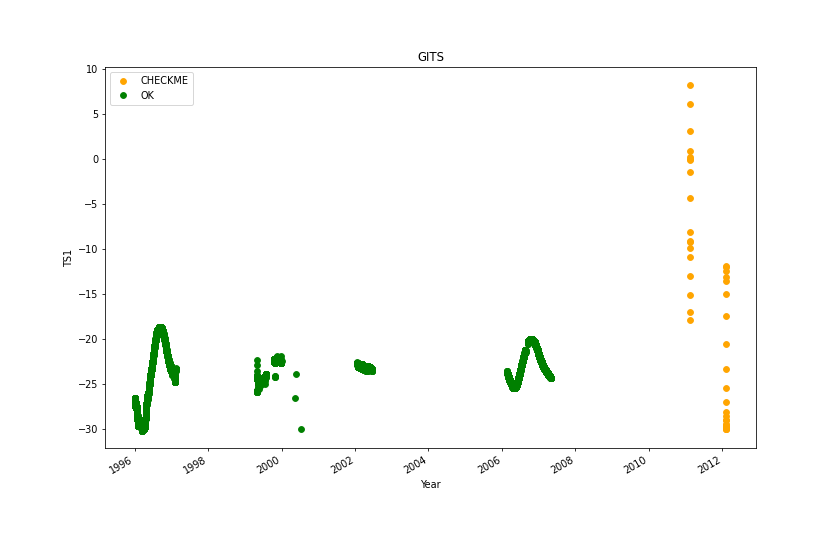
 
|start time|end time|variable|
|-|-|-|
|2010-01-01 00:00:00+00:00|2021-08-13 12:00:00+00:00|TS10|
 
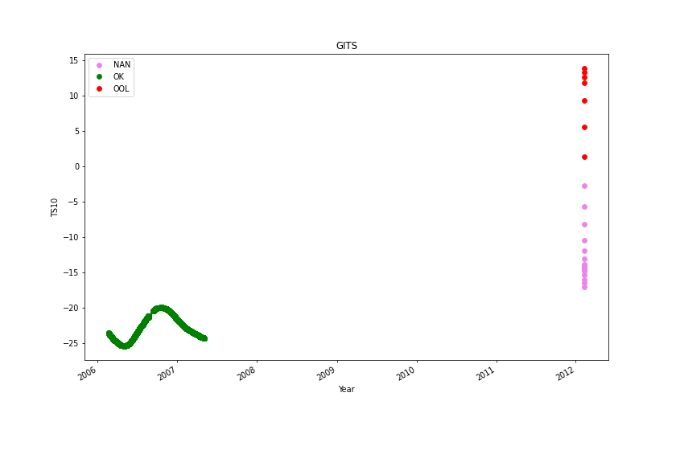
 
|start time|end time|variable|
|-|-|-|
|2010-01-01 00:00:00+00:00|2021-08-13 12:00:00+00:00|TS2|
 
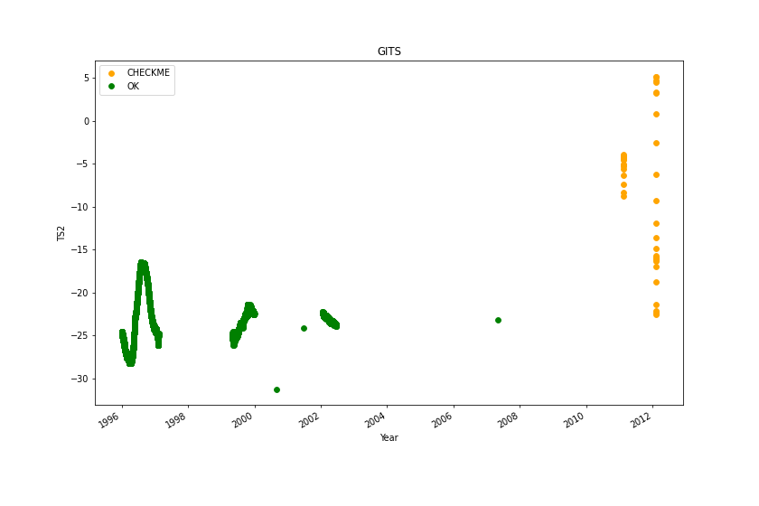
 
|start time|end time|variable|
|-|-|-|
|2010-01-01 00:00:00+00:00|2021-08-13 12:00:00+00:00|TS3|
 
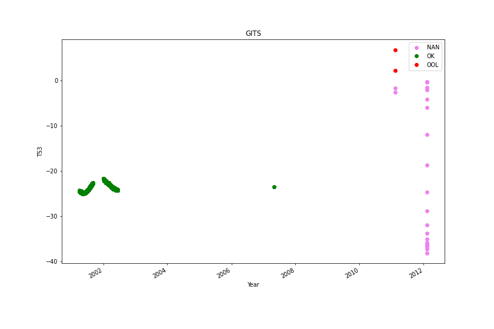
 
|start time|end time|variable|
|-|-|-|
|2010-01-01 00:00:00+00:00|2021-08-13 12:00:00+00:00|TS4|
 
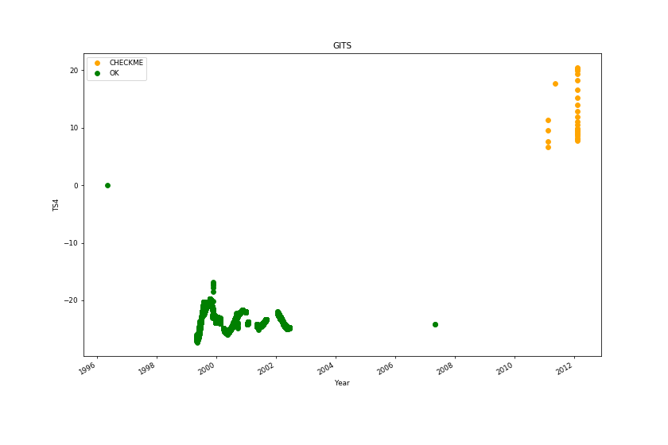
 
|start time|end time|variable|
|-|-|-|
|2010-01-01 00:00:00+00:00|2021-08-13 12:00:00+00:00|TS5|
 
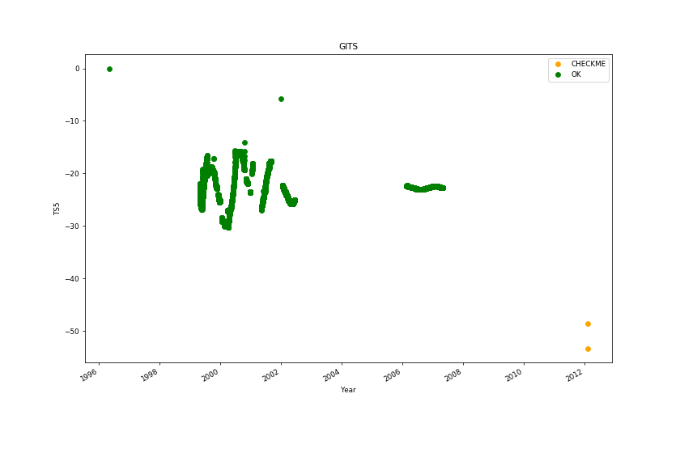
 
|start time|end time|variable|
|-|-|-|
|2010-01-01 00:00:00+00:00|2021-08-13 12:00:00+00:00|TS6|
 
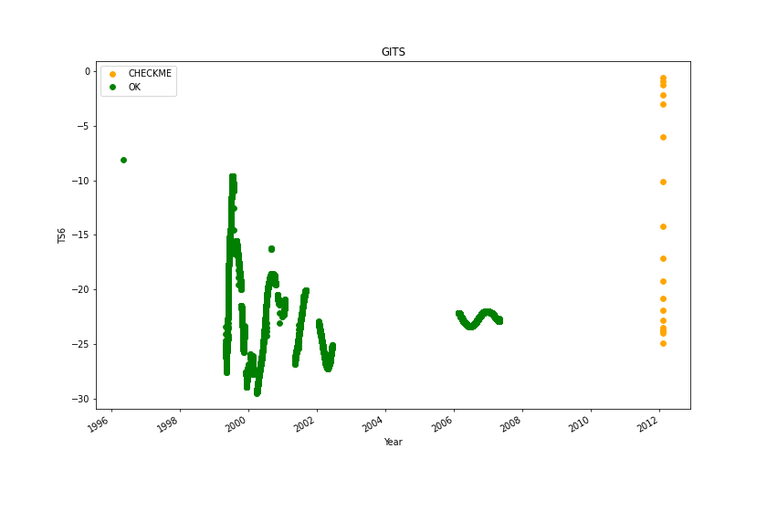
 
|start time|end time|variable|
|-|-|-|
|2010-01-01 00:00:00+00:00|2021-08-13 12:00:00+00:00|TS7|
 
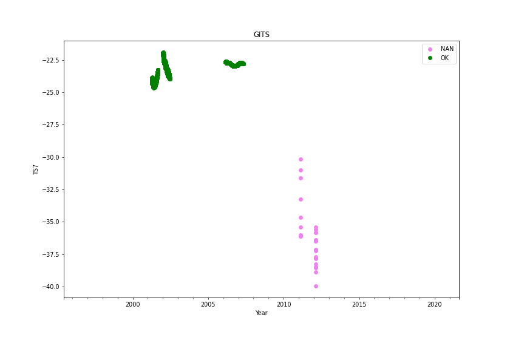
 
|start time|end time|variable|
|-|-|-|
|2010-01-01 00:00:00+00:00|2021-08-13 12:00:00+00:00|TS8|
 
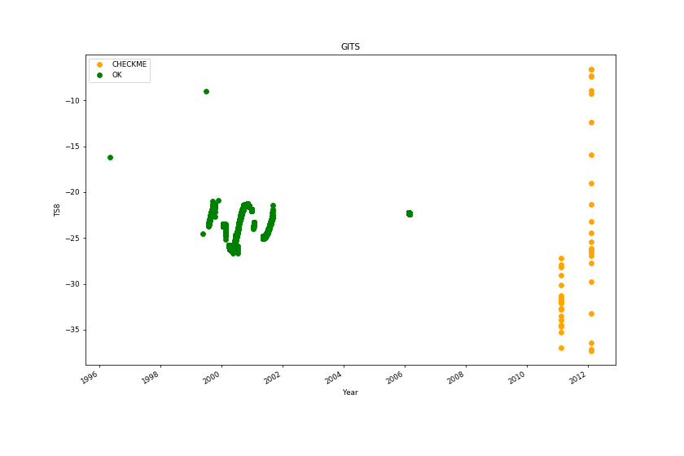
 
|start time|end time|variable|
|-|-|-|
|2010-01-01 00:00:00+00:00|2021-08-13 12:00:00+00:00|TS9|
 
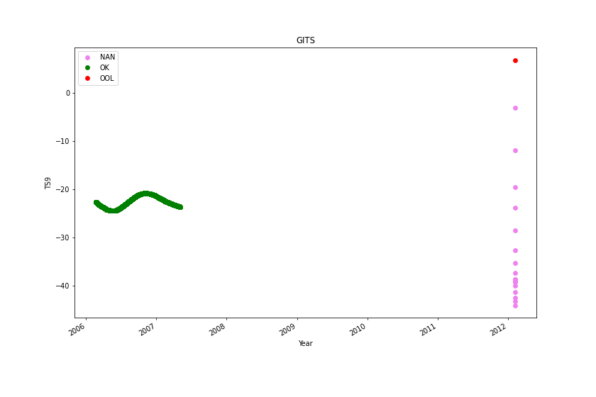
 
|start time|end time|variable|
|-|-|-|
|2007-01-01 00:00:00+00:00|2014-05-01 00:00:00+00:00|VW2|
 

 
## Adjusting data at GITS
### Adjusting HW1
|start time|end time|operation|value|number of removed samples|
|-|-|-|-|-|
|2009-05-15T00:00:00+00:00|2021-08-13T12:00:00+00:00|air_temp_sonic_correction|0.0|0|
|2009-05-15T00:00:00+00:00|2021-08-13T12:00:00+00:00|biweekly_upper_range_filter|0.5|23462|
|2009-05-15T00:00:00+00:00|2021-08-13T12:00:00+00:00|hampel_filter|2.0|2683|
|2019-03-14 00:00:00+00:00|2019-04-29 01:00:00+00:00|time_shift|520.0|520|
 

 
### Adjusting HW2
|start time|end time|operation|value|number of removed samples|
|-|-|-|-|-|
|2009-05-15T00:00:00+00:00|2021-08-13T12:00:00+00:00|air_temp_sonic_correction|0.0|0|
|2009-05-15T00:00:00+00:00|2021-08-13T12:00:00+00:00|biweekly_upper_range_filter|0.5|5690|
|2009-05-15T00:00:00+00:00|2021-08-13T12:00:00+00:00|hampel_filter|2.0|2311|
|2019-03-14 00:00:00+00:00|2019-04-29 01:00:00+00:00|time_shift|520.0|8|
 

 
## Adjusting data at GITS
### Adjusting DW1
|start time|end time|operation|value|number of removed samples|
|-|-|-|-|-|
|2019-03-14 00:00:00+00:00|2019-04-29 01:00:00+00:00|time_shift|520.0|520|
 

 
### Adjusting DW2
|start time|end time|operation|value|number of removed samples|
|-|-|-|-|-|
|2019-03-14 00:00:00+00:00|2019-04-29 01:00:00+00:00|time_shift|520.0|520|
 

 
### Adjusting HS1
|start time|end time|operation|value|number of removed samples|
|-|-|-|-|-|
|1996-05-07T00:00:00+00:00|2021-08-13T12:00:00+00:00|add|0.8|0|
|1997-05-17T00:00:00+00:00|2021-08-13T12:00:00+00:00|add|0.8|0|
|1999-05-15T00:00:00+00:00|2021-08-13T12:00:00+00:00|add|3.5|0|
|2010-05-15T00:00:00+00:00|2021-08-13T12:00:00+00:00|add|10.25|0|
|2014-05-15T00:00:00+00:00|2021-08-13T12:00:00+00:00|add|2.25|0|
|2016-05-15T00:00:00+00:00|2021-08-13T12:00:00+00:00|add|1.25|0|
|2019-03-14 00:00:00+00:00|2019-04-29 01:00:00+00:00|time_shift|520.0|502|
 

 
### Adjusting HS2
|start time|end time|operation|value|number of removed samples|
|-|-|-|-|-|
|1997-05-17T00:00:00+00:00|2021-08-13T12:00:00+00:00|add|0.8|0|
|1999-05-15T00:00:00+00:00|2021-08-13T12:00:00+00:00|add|3.5|0|
|2010-05-15T00:00:00+00:00|2021-08-13T12:00:00+00:00|add|10.25|0|
|2014-05-15T00:00:00+00:00|2021-08-13T12:00:00+00:00|add|1.25|0|
|2016-05-15T00:00:00+00:00|2021-08-13T12:00:00+00:00|add|1.25|0|
|2019-03-14 00:00:00+00:00|2019-04-29 01:00:00+00:00|time_shift|520.0|8|
 

 
### Adjusting ISWR
|start time|end time|operation|value|number of removed samples|
|-|-|-|-|-|
|2012-01-01T00:00:00+00:00|2021-08-13T12:00:00+00:00|multiply|0.385|0|
|2019-03-14 00:00:00+00:00|2019-04-29 01:00:00+00:00|time_shift|520.0|520|
 

 
### Adjusting NSWR
|start time|end time|operation|value|number of removed samples|
|-|-|-|-|-|
|2019-03-14 00:00:00+00:00|2019-04-29 01:00:00+00:00|time_shift|520.0|520|
 
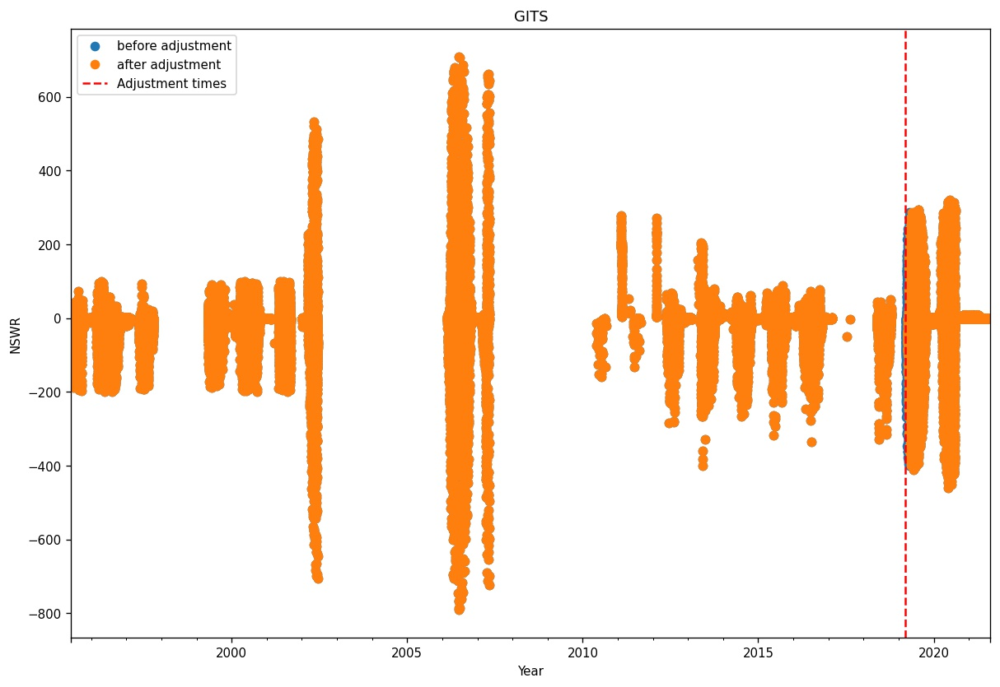
 
### Adjusting OSWR
|start time|end time|operation|value|number of removed samples|
|-|-|-|-|-|
|2012-01-01T00:00:00+00:00|2021-08-13T12:00:00+00:00|multiply|0.385|0|
|2019-03-14 00:00:00+00:00|2019-04-29 01:00:00+00:00|time_shift|520.0|520|
 

 
### Adjusting P
|start time|end time|operation|value|number of removed samples|
|-|-|-|-|-|
|2019-03-14 00:00:00+00:00|2019-04-29 01:00:00+00:00|time_shift|520.0|520|
 

 
### Adjusting RH1
|start time|end time|operation|value|number of removed samples|
|-|-|-|-|-|
|1995-01-01T00:00:00+00:00|2010-01-01T00:00:00+00:00|ice_to_water|0.0|0|
|2019-03-14 00:00:00+00:00|2019-04-29 01:00:00+00:00|time_shift|520.0|520|
 

 
### Adjusting RH2
|start time|end time|operation|value|number of removed samples|
|-|-|-|-|-|
|1995-01-01T00:00:00+00:00|2010-01-01T00:00:00+00:00|ice_to_water|0.0|0|
|2019-03-14 00:00:00+00:00|2019-04-29 01:00:00+00:00|time_shift|520.0|520|
 

 
### Adjusting TA1
|start time|end time|operation|value|number of removed samples|
|-|-|-|-|-|
|2019-03-14 00:00:00+00:00|2019-04-29 01:00:00+00:00|time_shift|520.0|520|
 

 
### Adjusting TA2
|start time|end time|operation|value|number of removed samples|
|-|-|-|-|-|
|2019-03-14 00:00:00+00:00|2019-04-29 01:00:00+00:00|time_shift|520.0|520|
 

 
### Adjusting TA3
|start time|end time|operation|value|number of removed samples|
|-|-|-|-|-|
|1990-01-01T00:00:00+00:00|2021-08-13T12:00:00+00:00|min_filter|-39.4|7184|
|2005-01-01T00:00:00+00:00|2008-01-01T00:00:00+00:00|add|-2.8|0|
|2019-03-14 00:00:00+00:00|2019-04-29 01:00:00+00:00|time_shift|520.0|520|
 

 
### Adjusting TA4
|start time|end time|operation|value|number of removed samples|
|-|-|-|-|-|
|1990-01-01T00:00:00+00:00|2021-08-13T12:00:00+00:00|min_filter|-39.4|5789|
|2001-01-01T00:00:00+00:00|2008-01-01T00:00:00+00:00|add|-2.8|0|
|2019-03-14 00:00:00+00:00|2019-04-29 01:00:00+00:00|time_shift|520.0|520|
 

 
### Adjusting TA5
|start time|end time|operation|value|number of removed samples|
|-|-|-|-|-|
|2019-03-14 00:00:00+00:00|2019-04-29 01:00:00+00:00|time_shift|520.0|0|
 

 
### Adjusting TS1
|start time|end time|operation|value|number of removed samples|
|-|-|-|-|-|
|2019-03-14 00:00:00+00:00|2019-04-29 01:00:00+00:00|time_shift|520.0|0|
 

 
### Adjusting TS10
|start time|end time|operation|value|number of removed samples|
|-|-|-|-|-|
|2019-03-14 00:00:00+00:00|2019-04-29 01:00:00+00:00|time_shift|520.0|0|
 

 
### Adjusting TS2
|start time|end time|operation|value|number of removed samples|
|-|-|-|-|-|
|2019-03-14 00:00:00+00:00|2019-04-29 01:00:00+00:00|time_shift|520.0|0|
 

 
### Adjusting TS3
|start time|end time|operation|value|number of removed samples|
|-|-|-|-|-|
|2019-03-14 00:00:00+00:00|2019-04-29 01:00:00+00:00|time_shift|520.0|0|
 

 
### Adjusting TS4
|start time|end time|operation|value|number of removed samples|
|-|-|-|-|-|
|2019-03-14 00:00:00+00:00|2019-04-29 01:00:00+00:00|time_shift|520.0|0|
 

 
### Adjusting TS5
|start time|end time|operation|value|number of removed samples|
|-|-|-|-|-|
|2019-03-14 00:00:00+00:00|2019-04-29 01:00:00+00:00|time_shift|520.0|0|
 

 
### Adjusting TS6
|start time|end time|operation|value|number of removed samples|
|-|-|-|-|-|
|2019-03-14 00:00:00+00:00|2019-04-29 01:00:00+00:00|time_shift|520.0|0|
 

 
### Adjusting TS7
|start time|end time|operation|value|number of removed samples|
|-|-|-|-|-|
|2019-03-14 00:00:00+00:00|2019-04-29 01:00:00+00:00|time_shift|520.0|0|
 

 
### Adjusting TS8
|start time|end time|operation|value|number of removed samples|
|-|-|-|-|-|
|2019-03-14 00:00:00+00:00|2019-04-29 01:00:00+00:00|time_shift|520.0|0|
 

 
### Adjusting TS9
|start time|end time|operation|value|number of removed samples|
|-|-|-|-|-|
|2019-03-14 00:00:00+00:00|2019-04-29 01:00:00+00:00|time_shift|520.0|0|
 

 
### Adjusting V
|start time|end time|operation|value|number of removed samples|
|-|-|-|-|-|
|2019-03-14 00:00:00+00:00|2019-04-29 01:00:00+00:00|time_shift|520.0|520|
 

 
### Adjusting VW1
|start time|end time|operation|value|number of removed samples|
|-|-|-|-|-|
|2019-03-14 00:00:00+00:00|2019-04-29 01:00:00+00:00|time_shift|520.0|520|
 

 
### Adjusting VW2
|start time|end time|operation|value|number of removed samples|
|-|-|-|-|-|
|2019-03-14 00:00:00+00:00|2019-04-29 01:00:00+00:00|time_shift|520.0|520|
 

 
# 5 Humboldt
## Manual flagging of data at Humboldt
Flagging data:
|start time|end time|variable|
|-|-|-|
|1990-01-01 00:00:00+00:00|1996-07-01 00:00:00+00:00|TA1|
 

 
|start time|end time|variable|
|-|-|-|
|2007-03-01 00:00:00+00:00|2007-05-04 00:00:00+00:00|TA3|
 

 
Warning: TS1 not found
Warning: TS10 not found
Warning: TS2 not found
Warning: TS3 not found
Warning: TS4 not found
Warning: TS5 not found
Warning: TS6 not found
Warning: TS7 not found
Warning: TS8 not found
Warning: TS9 not found
## Adjusting data at Humboldt
### Adjusting HW1
|start time|end time|operation|value|number of removed samples|
|-|-|-|-|-|
|2021-08-14 00:00:00+00:00|2021-12-24 20:00:00+00:00|time_shift|-3360.0|0|
|2009-05-15T00:00:00+00:00|2021-12-24T20:00:00+00:00|air_temp_sonic_correction|0.0|0|
|2009-05-15T00:00:00+00:00|2021-12-24T20:00:00+00:00|biweekly_upper_range_filter|0.3|11076|
|2009-05-15T00:00:00+00:00|2021-12-24T20:00:00+00:00|hampel_filter|2.0|2695|
|2020-08-10 00:00:00+00:00|2021-01-01 00:00:00+00:00|time_shift|5424.0|982|
|2019-12-10 00:00:00+00:00|2020-08-10 00:00:00+00:00|time_shift|2954.0|1102|
|2018-12-06 00:00:00+00:00|2019-01-19 20:00:00+00:00|time_shift|2954.0|984|
|2017-08-10 00:00:00+00:00|2017-10-04 00:00:00+00:00|time_shift|5611.0|1093|
|2016-12-03 00:00:00+00:00|2017-08-10 00:00:00+00:00|time_shift|2943.0|1242|
|2015-01-01 00:00:00+00:00|2015-02-18 06:00:00+00:00|time_shift|2198.0|785|
|2005-01-02 00:00:00+00:00|2006-05-04 00:00:00+00:00|time_shift|-48.0|48|
|2004-08-08 00:00:00+00:00|2005-01-01 00:00:00+00:00|time_shift|-24.0|25|
 

 
### Adjusting HW2
|start time|end time|operation|value|number of removed samples|
|-|-|-|-|-|
|2021-08-14 00:00:00+00:00|2021-12-24 20:00:00+00:00|time_shift|-3360.0|0|
|2009-05-15T00:00:00+00:00|2021-12-24T20:00:00+00:00|air_temp_sonic_correction|0.0|0|
|2009-05-15T00:00:00+00:00|2021-12-24T20:00:00+00:00|biweekly_upper_range_filter|0.3|7149|
|2009-05-15T00:00:00+00:00|2021-12-24T20:00:00+00:00|hampel_filter|2.0|3876|
|2020-08-10 00:00:00+00:00|2021-01-01 00:00:00+00:00|time_shift|5424.0|1518|
|2019-12-10 00:00:00+00:00|2020-08-10 00:00:00+00:00|time_shift|2954.0|1826|
|2018-12-06 00:00:00+00:00|2019-01-19 20:00:00+00:00|time_shift|2954.0|1012|
|2017-08-10 00:00:00+00:00|2017-10-04 00:00:00+00:00|time_shift|5611.0|1157|
|2016-12-03 00:00:00+00:00|2017-08-10 00:00:00+00:00|time_shift|2943.0|2196|
|2015-01-01 00:00:00+00:00|2015-02-18 06:00:00+00:00|time_shift|2198.0|747|
|2005-01-02 00:00:00+00:00|2006-05-04 00:00:00+00:00|time_shift|-48.0|48|
|2004-08-08 00:00:00+00:00|2005-01-01 00:00:00+00:00|time_shift|-24.0|25|
 

 
## Adjusting data at Humboldt
### Adjusting DW1
|start time|end time|operation|value|number of removed samples|
|-|-|-|-|-|
|2021-08-14 00:00:00+00:00|2021-12-24 20:00:00+00:00|time_shift|-3360.0|2966|
|2020-08-10 00:00:00+00:00|2021-01-01 00:00:00+00:00|time_shift|5424.0|3335|
|2019-12-10 00:00:00+00:00|2020-08-10 00:00:00+00:00|time_shift|2954.0|2824|
|2018-12-06 00:00:00+00:00|2019-01-19 20:00:00+00:00|time_shift|2954.0|1047|
|2017-08-10 00:00:00+00:00|2017-10-04 00:00:00+00:00|time_shift|5611.0|1272|
|2016-12-03 00:00:00+00:00|2017-08-10 00:00:00+00:00|time_shift|2943.0|2802|
|2015-01-01 00:00:00+00:00|2015-02-18 06:00:00+00:00|time_shift|2198.0|845|
|2005-01-02 00:00:00+00:00|2006-05-04 00:00:00+00:00|time_shift|-48.0|48|
|2004-08-08 00:00:00+00:00|2005-01-01 00:00:00+00:00|time_shift|-24.0|25|
 

 
### Adjusting DW2
|start time|end time|operation|value|number of removed samples|
|-|-|-|-|-|
|2021-08-14 00:00:00+00:00|2021-12-24 20:00:00+00:00|time_shift|-3360.0|3004|
|2020-08-10 00:00:00+00:00|2021-01-01 00:00:00+00:00|time_shift|5424.0|3334|
|2019-12-10 00:00:00+00:00|2020-08-10 00:00:00+00:00|time_shift|2954.0|2824|
|2018-12-06 00:00:00+00:00|2019-01-19 20:00:00+00:00|time_shift|2954.0|1047|
|2017-08-10 00:00:00+00:00|2017-10-04 00:00:00+00:00|time_shift|5611.0|1272|
|2016-12-03 00:00:00+00:00|2017-08-10 00:00:00+00:00|time_shift|2943.0|2802|
|2015-01-01 00:00:00+00:00|2015-02-18 06:00:00+00:00|time_shift|2198.0|845|
|2005-01-02 00:00:00+00:00|2006-05-04 00:00:00+00:00|time_shift|-48.0|48|
|2004-08-08 00:00:00+00:00|2005-01-01 00:00:00+00:00|time_shift|-24.0|25|
 

 
### Adjusting HS1
|start time|end time|operation|value|number of removed samples|
|-|-|-|-|-|
|2021-08-14 00:00:00+00:00|2021-12-24 20:00:00+00:00|time_shift|-3360.0|0|
|1999-05-03T00:00:00+00:00|2021-12-24T20:00:00+00:00|add|1.2|0|
|2003-05-22T00:00:00+00:00|2021-12-24T20:00:00+00:00|add|3.0|0|
|2010-03-01T00:00:00+00:00|2021-12-24T20:00:00+00:00|add|3.0|0|
|2015-03-26T00:00:00+00:00|2021-12-24T20:00:00+00:00|add|2.0|0|
|2020-08-10 00:00:00+00:00|2021-01-01 00:00:00+00:00|time_shift|5424.0|1103|
|2019-12-10 00:00:00+00:00|2020-08-10 00:00:00+00:00|time_shift|2954.0|1770|
|2018-12-06 00:00:00+00:00|2019-01-19 20:00:00+00:00|time_shift|2954.0|0|
|2017-08-10 00:00:00+00:00|2017-10-04 00:00:00+00:00|time_shift|5611.0|812|
|2016-12-03 00:00:00+00:00|2017-08-10 00:00:00+00:00|time_shift|2943.0|2347|
|2015-01-01 00:00:00+00:00|2015-02-18 06:00:00+00:00|time_shift|2198.0|0|
|2005-01-02 00:00:00+00:00|2006-05-04 00:00:00+00:00|time_shift|-48.0|48|
|2004-08-08 00:00:00+00:00|2005-01-01 00:00:00+00:00|time_shift|-24.0|25|
 

 
### Adjusting HS2
|start time|end time|operation|value|number of removed samples|
|-|-|-|-|-|
|2021-08-14 00:00:00+00:00|2021-12-24 20:00:00+00:00|time_shift|-3360.0|0|
|1999-05-03T00:00:00+00:00|2021-12-24T20:00:00+00:00|add|0.6|0|
|2003-05-22T00:00:00+00:00|2021-12-24T20:00:00+00:00|add|3.0|0|
|2010-03-01T00:00:00+00:00|2021-12-24T20:00:00+00:00|add|3.0|0|
|2012-05-25T00:00:00+00:00|2021-12-24T20:00:00+00:00|add|-1.0|0|
|2015-03-26T00:00:00+00:00|2021-12-24T20:00:00+00:00|add|2.0|0|
|2020-08-10 00:00:00+00:00|2021-01-01 00:00:00+00:00|time_shift|5424.0|1827|
|2019-12-10 00:00:00+00:00|2020-08-10 00:00:00+00:00|time_shift|2954.0|2505|
|2018-12-06 00:00:00+00:00|2019-01-19 20:00:00+00:00|time_shift|2954.0|0|
|2017-08-10 00:00:00+00:00|2017-10-04 00:00:00+00:00|time_shift|5611.0|1158|
|2016-12-03 00:00:00+00:00|2017-08-10 00:00:00+00:00|time_shift|2943.0|2576|
|2015-01-01 00:00:00+00:00|2015-02-18 06:00:00+00:00|time_shift|2198.0|0|
|2005-01-02 00:00:00+00:00|2006-05-04 00:00:00+00:00|time_shift|-48.0|48|
|2004-08-08 00:00:00+00:00|2005-01-01 00:00:00+00:00|time_shift|-24.0|25|
 

 
### Adjusting ISWR
|start time|end time|operation|value|number of removed samples|
|-|-|-|-|-|
|2021-08-14 00:00:00+00:00|2021-12-24 20:00:00+00:00|time_shift|-3360.0|3034|
|2020-08-10 00:00:00+00:00|2021-01-01 00:00:00+00:00|time_shift|5424.0|3335|
|2019-12-10 00:00:00+00:00|2020-08-10 00:00:00+00:00|time_shift|2954.0|2824|
|2018-12-06 00:00:00+00:00|2019-01-19 20:00:00+00:00|time_shift|2954.0|1047|
|2017-08-10 00:00:00+00:00|2017-10-04 00:00:00+00:00|time_shift|5611.0|1272|
|2016-12-03 00:00:00+00:00|2017-08-10 00:00:00+00:00|time_shift|2943.0|2802|
|2015-01-01 00:00:00+00:00|2015-02-18 06:00:00+00:00|time_shift|2198.0|845|
|2005-01-02 00:00:00+00:00|2006-05-04 00:00:00+00:00|time_shift|-48.0|48|
|2004-08-08 00:00:00+00:00|2005-01-01 00:00:00+00:00|time_shift|-24.0|25|
 

 
### Adjusting NSWR
|start time|end time|operation|value|number of removed samples|
|-|-|-|-|-|
|2021-08-14 00:00:00+00:00|2021-12-24 20:00:00+00:00|time_shift|-3360.0|3041|
|2020-08-10 00:00:00+00:00|2021-01-01 00:00:00+00:00|time_shift|5424.0|3335|
|2019-12-10 00:00:00+00:00|2020-08-10 00:00:00+00:00|time_shift|2954.0|2824|
|2018-12-06 00:00:00+00:00|2019-01-19 20:00:00+00:00|time_shift|2954.0|1047|
|2017-08-10 00:00:00+00:00|2017-10-04 00:00:00+00:00|time_shift|5611.0|1272|
|2016-12-03 00:00:00+00:00|2017-08-10 00:00:00+00:00|time_shift|2943.0|2802|
|2015-01-01 00:00:00+00:00|2015-02-18 06:00:00+00:00|time_shift|2198.0|845|
|2005-01-02 00:00:00+00:00|2006-05-04 00:00:00+00:00|time_shift|-48.0|48|
|2004-08-08 00:00:00+00:00|2005-01-01 00:00:00+00:00|time_shift|-24.0|25|
 
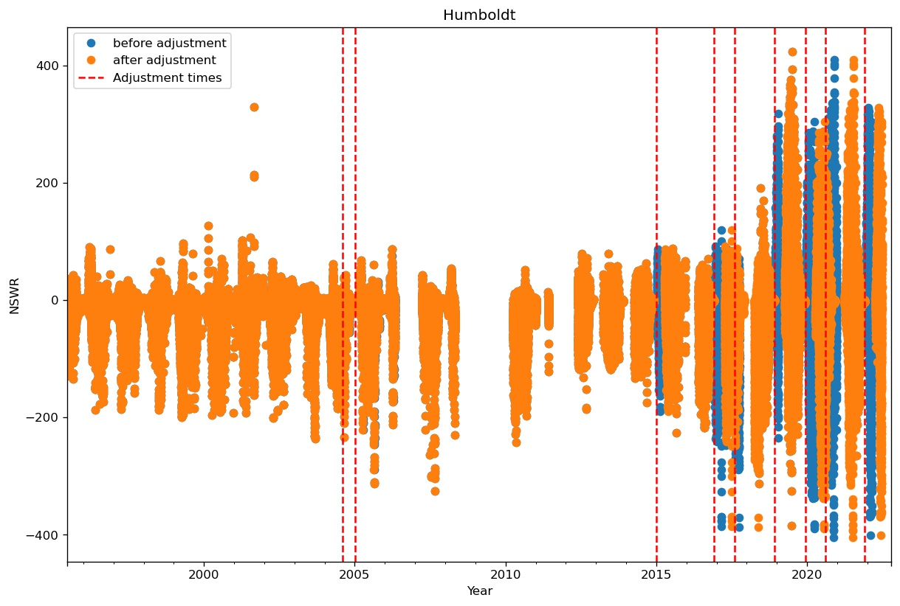
 
### Adjusting OSWR
|start time|end time|operation|value|number of removed samples|
|-|-|-|-|-|
|2021-08-14 00:00:00+00:00|2021-12-24 20:00:00+00:00|time_shift|-3360.0|3036|
|2020-08-10 00:00:00+00:00|2021-01-01 00:00:00+00:00|time_shift|5424.0|3332|
|2019-12-10 00:00:00+00:00|2020-08-10 00:00:00+00:00|time_shift|2954.0|2824|
|2018-12-06 00:00:00+00:00|2019-01-19 20:00:00+00:00|time_shift|2954.0|1047|
|2017-08-10 00:00:00+00:00|2017-10-04 00:00:00+00:00|time_shift|5611.0|1272|
|2016-12-03 00:00:00+00:00|2017-08-10 00:00:00+00:00|time_shift|2943.0|2802|
|2015-01-01 00:00:00+00:00|2015-02-18 06:00:00+00:00|time_shift|2198.0|845|
|2005-01-02 00:00:00+00:00|2006-05-04 00:00:00+00:00|time_shift|-48.0|48|
|2004-08-08 00:00:00+00:00|2005-01-01 00:00:00+00:00|time_shift|-24.0|25|
 

 
### Adjusting P
|start time|end time|operation|value|number of removed samples|
|-|-|-|-|-|
|2021-08-14 00:00:00+00:00|2021-12-24 20:00:00+00:00|time_shift|-3360.0|2706|
|2020-08-10 00:00:00+00:00|2021-01-01 00:00:00+00:00|time_shift|5424.0|3323|
|2019-12-10 00:00:00+00:00|2020-08-10 00:00:00+00:00|time_shift|2954.0|2824|
|2018-12-06 00:00:00+00:00|2019-01-19 20:00:00+00:00|time_shift|2954.0|1047|
|2017-08-10 00:00:00+00:00|2017-10-04 00:00:00+00:00|time_shift|5611.0|1272|
|2016-12-03 00:00:00+00:00|2017-08-10 00:00:00+00:00|time_shift|2943.0|2802|
|2015-01-01 00:00:00+00:00|2015-02-18 06:00:00+00:00|time_shift|2198.0|845|
|2005-01-02 00:00:00+00:00|2006-05-04 00:00:00+00:00|time_shift|-48.0|48|
|2004-08-08 00:00:00+00:00|2005-01-01 00:00:00+00:00|time_shift|-24.0|25|
 

 
### Adjusting RH1
|start time|end time|operation|value|number of removed samples|
|-|-|-|-|-|
|2021-08-14 00:00:00+00:00|2021-12-24 20:00:00+00:00|time_shift|-3360.0|3025|
|2020-08-10 00:00:00+00:00|2021-01-01 00:00:00+00:00|time_shift|5424.0|3334|
|2019-12-10 00:00:00+00:00|2020-08-10 00:00:00+00:00|time_shift|2954.0|2824|
|2018-12-06 00:00:00+00:00|2019-01-19 20:00:00+00:00|time_shift|2954.0|1047|
|1995-01-01T00:00:00+00:00|2012-08-19T00:00:00+00:00|ice_to_water|0.0|0|
|2017-08-10 00:00:00+00:00|2017-10-04 00:00:00+00:00|time_shift|5611.0|1272|
|2016-12-03 00:00:00+00:00|2017-08-10 00:00:00+00:00|time_shift|2943.0|2802|
|2015-01-01 00:00:00+00:00|2015-02-18 06:00:00+00:00|time_shift|2198.0|845|
|2005-01-02 00:00:00+00:00|2006-05-04 00:00:00+00:00|time_shift|-48.0|48|
|2004-08-08 00:00:00+00:00|2005-01-01 00:00:00+00:00|time_shift|-24.0|25|
 

 
### Adjusting RH2
|start time|end time|operation|value|number of removed samples|
|-|-|-|-|-|
|2021-08-14 00:00:00+00:00|2021-12-24 20:00:00+00:00|time_shift|-3360.0|3022|
|2020-08-10 00:00:00+00:00|2021-01-01 00:00:00+00:00|time_shift|5424.0|3333|
|2019-12-10 00:00:00+00:00|2020-08-10 00:00:00+00:00|time_shift|2954.0|2824|
|2018-12-06 00:00:00+00:00|2019-01-19 20:00:00+00:00|time_shift|2954.0|1047|
|1995-01-01T00:00:00+00:00|2012-08-19T00:00:00+00:00|ice_to_water|0.0|0|
|2017-08-10 00:00:00+00:00|2017-10-04 00:00:00+00:00|time_shift|5611.0|1272|
|2016-12-03 00:00:00+00:00|2017-08-10 00:00:00+00:00|time_shift|2943.0|2802|
|2015-01-01 00:00:00+00:00|2015-02-18 06:00:00+00:00|time_shift|2198.0|845|
|2005-01-02 00:00:00+00:00|2006-05-04 00:00:00+00:00|time_shift|-48.0|0|
|2004-08-08 00:00:00+00:00|2005-01-01 00:00:00+00:00|time_shift|-24.0|0|
 

 
### Adjusting TA1
|start time|end time|operation|value|number of removed samples|
|-|-|-|-|-|
|2021-08-14 00:00:00+00:00|2021-12-24 20:00:00+00:00|time_shift|-3360.0|3043|
|2020-08-10 00:00:00+00:00|2021-01-01 00:00:00+00:00|time_shift|5424.0|3335|
|2019-12-10 00:00:00+00:00|2020-08-10 00:00:00+00:00|time_shift|2954.0|2824|
|2018-12-06 00:00:00+00:00|2019-01-19 20:00:00+00:00|time_shift|2954.0|1047|
|2017-08-10 00:00:00+00:00|2017-10-04 00:00:00+00:00|time_shift|5611.0|1272|
|2016-12-03 00:00:00+00:00|2017-08-10 00:00:00+00:00|time_shift|2943.0|2802|
|2015-01-01 00:00:00+00:00|2015-02-18 06:00:00+00:00|time_shift|2198.0|845|
|2005-01-02 00:00:00+00:00|2006-05-04 00:00:00+00:00|time_shift|-48.0|48|
|2004-08-08 00:00:00+00:00|2005-01-01 00:00:00+00:00|time_shift|-24.0|25|
 

 
### Adjusting TA2
|start time|end time|operation|value|number of removed samples|
|-|-|-|-|-|
|2021-08-14 00:00:00+00:00|2021-12-24 20:00:00+00:00|time_shift|-3360.0|3043|
|2020-08-10 00:00:00+00:00|2021-01-01 00:00:00+00:00|time_shift|5424.0|3335|
|2019-12-10 00:00:00+00:00|2020-08-10 00:00:00+00:00|time_shift|2954.0|2824|
|2018-12-06 00:00:00+00:00|2019-01-19 20:00:00+00:00|time_shift|2954.0|1047|
|2017-08-10 00:00:00+00:00|2017-10-04 00:00:00+00:00|time_shift|5611.0|1272|
|2016-12-03 00:00:00+00:00|2017-08-10 00:00:00+00:00|time_shift|2943.0|2802|
|2015-01-01 00:00:00+00:00|2015-02-18 06:00:00+00:00|time_shift|2198.0|845|
|2005-01-02 00:00:00+00:00|2006-05-04 00:00:00+00:00|time_shift|-48.0|48|
|2004-08-08 00:00:00+00:00|2005-01-01 00:00:00+00:00|time_shift|-24.0|25|
 

 
### Adjusting TA3
|start time|end time|operation|value|number of removed samples|
|-|-|-|-|-|
|2021-08-14 00:00:00+00:00|2021-12-24 20:00:00+00:00|time_shift|-3360.0|3033|
|2020-08-10 00:00:00+00:00|2021-01-01 00:00:00+00:00|time_shift|5424.0|3335|
|2019-12-10 00:00:00+00:00|2020-08-10 00:00:00+00:00|time_shift|2954.0|2824|
|2018-12-06 00:00:00+00:00|2019-01-19 20:00:00+00:00|time_shift|2954.0|1047|
|2017-08-10 00:00:00+00:00|2017-10-04 00:00:00+00:00|time_shift|5611.0|1272|
|2016-12-03 00:00:00+00:00|2017-08-10 00:00:00+00:00|time_shift|2943.0|2802|
|2015-01-01 00:00:00+00:00|2015-02-18 06:00:00+00:00|time_shift|2198.0|845|
|2005-01-02 00:00:00+00:00|2006-05-04 00:00:00+00:00|time_shift|-48.0|0|
|2004-08-08 00:00:00+00:00|2005-01-01 00:00:00+00:00|time_shift|-24.0|0|
 

 
### Adjusting TA4
|start time|end time|operation|value|number of removed samples|
|-|-|-|-|-|
|2021-08-14 00:00:00+00:00|2021-12-24 20:00:00+00:00|time_shift|-3360.0|3034|
|2020-08-10 00:00:00+00:00|2021-01-01 00:00:00+00:00|time_shift|5424.0|3333|
|2019-12-10 00:00:00+00:00|2020-08-10 00:00:00+00:00|time_shift|2954.0|2824|
|2018-12-06 00:00:00+00:00|2019-01-19 20:00:00+00:00|time_shift|2954.0|1047|
|2017-08-10 00:00:00+00:00|2017-10-04 00:00:00+00:00|time_shift|5611.0|1272|
|2016-12-03 00:00:00+00:00|2017-08-10 00:00:00+00:00|time_shift|2943.0|2802|
|2015-01-01 00:00:00+00:00|2015-02-18 06:00:00+00:00|time_shift|2198.0|845|
|2005-01-02 00:00:00+00:00|2006-05-04 00:00:00+00:00|time_shift|-48.0|48|
|2004-08-08 00:00:00+00:00|2005-01-01 00:00:00+00:00|time_shift|-24.0|25|
 

 
### Adjusting V
|start time|end time|operation|value|number of removed samples|
|-|-|-|-|-|
|2021-08-14 00:00:00+00:00|2021-12-24 20:00:00+00:00|time_shift|-3360.0|2921|
|2020-08-10 00:00:00+00:00|2021-01-01 00:00:00+00:00|time_shift|5424.0|3333|
|2019-12-10 00:00:00+00:00|2020-08-10 00:00:00+00:00|time_shift|2954.0|2824|
|2018-12-06 00:00:00+00:00|2019-01-19 20:00:00+00:00|time_shift|2954.0|1047|
|2017-08-10 00:00:00+00:00|2017-10-04 00:00:00+00:00|time_shift|5611.0|1272|
|2016-12-03 00:00:00+00:00|2017-08-10 00:00:00+00:00|time_shift|2943.0|2802|
|2015-01-01 00:00:00+00:00|2015-02-18 06:00:00+00:00|time_shift|2198.0|845|
|2005-01-02 00:00:00+00:00|2006-05-04 00:00:00+00:00|time_shift|-48.0|48|
|2004-08-08 00:00:00+00:00|2005-01-01 00:00:00+00:00|time_shift|-24.0|25|
 

 
### Adjusting VW1
|start time|end time|operation|value|number of removed samples|
|-|-|-|-|-|
|2021-08-14 00:00:00+00:00|2021-12-24 20:00:00+00:00|time_shift|-3360.0|3029|
|2020-08-10 00:00:00+00:00|2021-01-01 00:00:00+00:00|time_shift|5424.0|3334|
|2019-12-10 00:00:00+00:00|2020-08-10 00:00:00+00:00|time_shift|2954.0|2824|
|2018-12-06 00:00:00+00:00|2019-01-19 20:00:00+00:00|time_shift|2954.0|1047|
|2017-08-10 00:00:00+00:00|2017-10-04 00:00:00+00:00|time_shift|5611.0|1272|
|2016-12-03 00:00:00+00:00|2017-08-10 00:00:00+00:00|time_shift|2943.0|2802|
|2015-01-01 00:00:00+00:00|2015-02-18 06:00:00+00:00|time_shift|2198.0|845|
|2005-01-02 00:00:00+00:00|2006-05-04 00:00:00+00:00|time_shift|-48.0|48|
|2004-08-08 00:00:00+00:00|2005-01-01 00:00:00+00:00|time_shift|-24.0|25|
 

 
### Adjusting VW2
|start time|end time|operation|value|number of removed samples|
|-|-|-|-|-|
|2021-08-14 00:00:00+00:00|2021-12-24 20:00:00+00:00|time_shift|-3360.0|3031|
|2020-08-10 00:00:00+00:00|2021-01-01 00:00:00+00:00|time_shift|5424.0|3334|
|2019-12-10 00:00:00+00:00|2020-08-10 00:00:00+00:00|time_shift|2954.0|2824|
|2018-12-06 00:00:00+00:00|2019-01-19 20:00:00+00:00|time_shift|2954.0|1047|
|2017-08-10 00:00:00+00:00|2017-10-04 00:00:00+00:00|time_shift|5611.0|1272|
|2016-12-03 00:00:00+00:00|2017-08-10 00:00:00+00:00|time_shift|2943.0|2802|
|2015-01-01 00:00:00+00:00|2015-02-18 06:00:00+00:00|time_shift|2198.0|845|
|2005-01-02 00:00:00+00:00|2006-05-04 00:00:00+00:00|time_shift|-48.0|48|
|2004-08-08 00:00:00+00:00|2005-01-01 00:00:00+00:00|time_shift|-24.0|25|
 

 
# 6 Summit
## Manual flagging of data at Summit
Flagging data:
|start time|end time|variable|
|-|-|-|
|2017-11-17 00:00:00+00:00|2018-02-23 00:00:00+00:00|HW1|
|2018-11-10 00:00:00+00:00|2019-06-09 00:00:00+00:00|HW1|
 

 
|start time|end time|variable|
|-|-|-|
|2017-12-17 00:00:00+00:00|2018-02-19 00:00:00+00:00|HW2|
|2018-11-20 00:00:00+00:00|2019-04-09 00:00:00+00:00|HW2|
 

 
|start time|end time|variable|
|-|-|-|
|1997-05-21 00:00:00+00:00|1998-07-01 00:00:00+00:00|TA3|
 

 
|start time|end time|variable|
|-|-|-|
|2010-05-18 00:00:00+00:00|2022-01-01 00:00:00+00:00|TS1|
|1999-05-01 00:00:00+00:00|1999-05-15 00:00:00+00:00|TS1|
 

 
|start time|end time|variable|
|-|-|-|
|2010-05-18 00:00:00+00:00|2022-01-01 00:00:00+00:00|TS10|
|1999-05-01 00:00:00+00:00|1999-05-15 00:00:00+00:00|TS10|
 

 
|start time|end time|variable|
|-|-|-|
|2010-05-18 00:00:00+00:00|2022-01-01 00:00:00+00:00|TS2|
|1999-05-01 00:00:00+00:00|1999-05-15 00:00:00+00:00|TS2|
 

 
|start time|end time|variable|
|-|-|-|
|2010-05-18 00:00:00+00:00|2022-01-01 00:00:00+00:00|TS3|
|1999-05-01 00:00:00+00:00|1999-05-15 00:00:00+00:00|TS3|
 

 
|start time|end time|variable|
|-|-|-|
|2010-05-18 00:00:00+00:00|2022-01-01 00:00:00+00:00|TS4|
|1999-05-01 00:00:00+00:00|1999-05-15 00:00:00+00:00|TS4|
 

 
|start time|end time|variable|
|-|-|-|
|2010-05-18 00:00:00+00:00|2022-01-01 00:00:00+00:00|TS5|
|1999-05-01 00:00:00+00:00|1999-05-15 00:00:00+00:00|TS5|
 

 
|start time|end time|variable|
|-|-|-|
|2010-05-18 00:00:00+00:00|2022-01-01 00:00:00+00:00|TS6|
|1999-05-01 00:00:00+00:00|1999-05-15 00:00:00+00:00|TS6|
 

 
|start time|end time|variable|
|-|-|-|
|2010-05-18 00:00:00+00:00|2022-01-01 00:00:00+00:00|TS7|
|1999-05-01 00:00:00+00:00|1999-05-15 00:00:00+00:00|TS7|
 

 
|start time|end time|variable|
|-|-|-|
|2010-05-18 00:00:00+00:00|2022-01-01 00:00:00+00:00|TS8|
|1999-05-01 00:00:00+00:00|1999-05-15 00:00:00+00:00|TS8|
 

 
|start time|end time|variable|
|-|-|-|
|2010-05-18 00:00:00+00:00|2022-01-01 00:00:00+00:00|TS9|
|1999-05-01 00:00:00+00:00|1999-05-15 00:00:00+00:00|TS9|
 

 
## Adjusting data at Summit
### Adjusting HW1
|start time|end time|operation|value|number of removed samples|
|-|-|-|-|-|
|2001-06-15T16:00:00+00:00|2003-12-13T17:00:00+00:00|add|0.78|0|
|2003-12-13T17:05:00+00:00|2005-05-04T19:00:00+00:00|add|0.37|0|
|2004-12-13T17:05:00+00:00|2005-07-04T19:00:00+00:00|min_filter|-4.0|852|
|2005-05-26T07:00:00+00:00|2008-09-13T01:05:00+00:00|add|0.72|0|
|2009-05-15T00:00:00+00:00|2022-06-09T23:00:00+00:00|air_temp_sonic_correction|0.0|0|
|2009-05-15T00:00:00+00:00|2022-06-09T23:00:00+00:00|biweekly_upper_range_filter|0.3|13009|
|2009-05-15T00:00:00+00:00|2022-06-09T23:00:00+00:00|hampel_filter|2.0|5776|
|2009-05-19T19:00:00+00:00|2010-08-06T23:05:00+00:00|add|-0.39|0|
 

 
### Adjusting HW2
|start time|end time|operation|value|number of removed samples|
|-|-|-|-|-|
|2001-06-15T16:00:00+00:00|2003-12-13T17:00:00+00:00|add|0.62|0|
|2003-12-13T17:05:00+00:00|2004-03-02T16:05:00+00:00|add|0.84|0|
|2004-08-19T17:05:00+00:00|2005-05-04T21:00:00+00:00|add|0.84|0|
|2005-05-26T07:00:00+00:00|2010-08-06T23:05:00+00:00|add|0.39|0|
|2005-10-08T14:00:00+00:00|2006-03-17T14:05:00+00:00|add|0.87|0|
|2009-05-15T00:00:00+00:00|2022-06-09T23:00:00+00:00|air_temp_sonic_correction|0.0|0|
|2009-05-15T00:00:00+00:00|2022-06-09T23:00:00+00:00|biweekly_upper_range_filter|0.3|18067|
|2009-05-15T00:00:00+00:00|2022-06-09T23:00:00+00:00|hampel_filter|2.0|4119|
|2009-05-19T19:00:00+00:00|2010-08-06T23:05:00+00:00|add|-0.39|0|
 

 
## Adjusting data at Summit
### Adjusting HS1
|start time|end time|operation|value|number of removed samples|
|-|-|-|-|-|
|1999-05-15T00:00:00+00:00|2022-06-09T23:00:00+00:00|add|0.8|0|
|2001-06-10T00:00:00+00:00|2022-06-09T23:00:00+00:00|add|2.0|0|
|2005-05-23T00:00:00+00:00|2022-06-09T23:00:00+00:00|add|3.0|0|
|2010-08-16T21:00:00+00:00|2022-06-09T23:00:00+00:00|add|3.6|0|
|2016-05-22T21:00:00+00:00|2022-06-09T23:00:00+00:00|add|2.6|0|
 

 
### Adjusting HS2
|start time|end time|operation|value|number of removed samples|
|-|-|-|-|-|
|1999-05-15T00:00:00+00:00|2022-06-09T23:00:00+00:00|add|0.8|0|
|2001-06-10T12:00:00+00:00|2022-06-09T23:00:00+00:00|add|2.1|0|
|2005-05-26T14:00:00+00:00|2022-06-09T23:00:00+00:00|add|3.0|0|
|2010-08-18T14:00:00+00:00|2022-06-09T23:00:00+00:00|add|3.4|0|
|2016-05-22T14:00:00+00:00|2022-06-09T23:00:00+00:00|add|2.5|0|
 

 
### Adjusting P
|start time|end time|operation|value|number of removed samples|
|-|-|-|-|-|
|2016-05-22T00:00:00+00:00|2022-06-09T23:00:00+00:00|add|-61.0|0|
 

 
### Adjusting RH1
|start time|end time|operation|value|number of removed samples|
|-|-|-|-|-|
|1996-01-01T00:00:00+00:00|2009-05-19T00:00:00+00:00|ice_to_water|0.0|0|
 

 
### Adjusting RH2
|start time|end time|operation|value|number of removed samples|
|-|-|-|-|-|
|1996-01-01T00:00:00+00:00|2009-05-19T00:00:00+00:00|ice_to_water|0.0|0|
 

 
# 7 Tunu-N
## Manual flagging of data at Tunu-N
Flagging data:
|start time|end time|variable|
|-|-|-|
|2011-06-10 00:00:00+00:00|2013-05-23 00:00:00+00:00|HW1|
 

 
|start time|end time|variable|
|-|-|-|
|2011-06-10 00:00:00+00:00|2013-05-23 00:00:00+00:00|HW2|
 

 
|start time|end time|variable|
|-|-|-|
|2011-01-01 00:00:00+00:00|2013-01-01 00:00:00+00:00|TA1|
 

 
|start time|end time|variable|
|-|-|-|
|2011-01-01 00:00:00+00:00|2013-01-01 00:00:00+00:00|TA2|
 

 
|start time|end time|variable|
|-|-|-|
|2011-01-01 00:00:00+00:00|2013-01-01 00:00:00+00:00|TA3|
 

 
|start time|end time|variable|
|-|-|-|
|2011-01-01 00:00:00+00:00|2013-01-01 00:00:00+00:00|TA4|
 

 
|start time|end time|variable|
|-|-|-|
|2011-01-01 00:00:00+00:00|2013-01-01 00:00:00+00:00|VW1|
 

 
## Adjusting data at Tunu-N
### Adjusting HW1
|start time|end time|operation|value|number of removed samples|
|-|-|-|-|-|
|2009-05-15T00:00:00+00:00|2022-05-27T13:00:00+00:00|air_temp_sonic_correction|0.0|0|
|2009-05-15T00:00:00+00:00|2022-05-27T13:00:00+00:00|biweekly_upper_range_filter|0.2|12892|
|2009-05-15T00:00:00+00:00|2022-05-27T13:00:00+00:00|hampel_filter|2.0|3515|
 

 
### Adjusting HW2
|start time|end time|operation|value|number of removed samples|
|-|-|-|-|-|
|2009-05-15T00:00:00+00:00|2022-05-27T13:00:00+00:00|air_temp_sonic_correction|0.0|0|
|2009-05-15T00:00:00+00:00|2022-05-27T13:00:00+00:00|biweekly_upper_range_filter|0.2|39524|
|2009-05-15T00:00:00+00:00|2022-05-27T13:00:00+00:00|hampel_filter|2.0|1416|
 

 
## Adjusting data at Tunu-N
### Adjusting HS1
|start time|end time|operation|value|number of removed samples|
|-|-|-|-|-|
|2001-06-07T16:00:00+00:00|2022-05-27T13:00:00+00:00|add|1.7|0|
|2002-02-27T00:00:00+00:00|2022-05-27T13:00:00+00:00|add|0.9|0|
|2008-04-26T16:00:00+00:00|2022-05-27T13:00:00+00:00|add|3.0|0|
|2018-05-19T00:00:00+00:00|2022-05-27T13:00:00+00:00|add|2.5|0|
|2019-06-26T00:00:00+00:00|2022-05-27T13:00:00+00:00|add|-2.5|0|
 

 
### Adjusting HS2
|start time|end time|operation|value|number of removed samples|
|-|-|-|-|-|
|2001-06-07T16:00:00+00:00|2022-05-27T13:00:00+00:00|add|1.5|0|
|2004-05-13T16:00:00+00:00|2022-05-27T13:00:00+00:00|add|1.0|0|
|2007-04-05T16:00:00+00:00|2022-05-27T13:00:00+00:00|add|-0.5|0|
|2008-05-01T00:00:00+00:00|2022-05-27T13:00:00+00:00|add|3.2|0|
|2013-02-13T16:00:00+00:00|2022-05-27T13:00:00+00:00|add|-0.5|0|
|2015-05-25T16:00:00+00:00|2022-05-27T13:00:00+00:00|add|1.0|0|
 

 
### Adjusting P
|start time|end time|operation|value|number of removed samples|
|-|-|-|-|-|
|2021-01-05T00:00:00+00:00|2022-09-09T00:00:00+00:00|grad_filter|5.0|0|
 

 
### Adjusting RH1
|start time|end time|operation|value|number of removed samples|
|-|-|-|-|-|
|1996-01-01T00:00:00+00:00|2011-01-01T00:00:00+00:00|ice_to_water|0.0|0|
 

 
### Adjusting RH2
|start time|end time|operation|value|number of removed samples|
|-|-|-|-|-|
|1996-01-01T00:00:00+00:00|2011-01-01T00:00:00+00:00|ice_to_water|0.0|0|
 

 
# 8 DYE2
## Manual flagging of data at DYE2
Flagging data:
|start time|end time|variable|
|-|-|-|
|2002-05-19 01:00:00+00:00|2003-05-09 00:00:00+00:00|HW1|
|2015-06-07 01:00:00+00:00|2018-05-07 00:00:00+00:00|HW1|
 

 
|start time|end time|variable|
|-|-|-|
|2002-01-01 01:00:00+00:00|2003-05-09 00:00:00+00:00|HW2|
|2010-03-25 01:00:00+00:00|2014-05-23 00:00:00+00:00|HW2|
|2018-06-01 01:00:00+00:00|2019-05-20 00:00:00+00:00|HW2|
 

 
|start time|end time|variable|
|-|-|-|
|2004-06-15 01:00:00+00:00|2004-08-25 00:00:00+00:00|ISWR|
|2012-05-07 18:00:00+00:00|2012-05-12 00:00:00+00:00|ISWR|
|2004-05-09 15:00:00+00:00|2005-06-10 00:00:00+00:00|ISWR|
 

 
Warning: OSR not found
|start time|end time|variable|
|-|-|-|
|2004-05-09 15:00:00+00:00|2005-06-10 00:00:00+00:00|OSWR|
 

 
|start time|end time|variable|
|-|-|-|
|2011-05-26 09:00:00+00:00|2013-12-28 00:00:00+00:00|P|
|2010-05-21 07:00:02+00:00|2010-09-25 00:00:00+00:00|P|
|2013-06-13 01:00:00+00:00|2014-10-26 00:00:00+00:00|P|
|2002-01-14 10:00:00+00:00|2003-04-29 00:00:00+00:00|P|
 

 
|start time|end time|variable|
|-|-|-|
|2009-09-09 12:00:00+00:00|2010-05-02 00:00:00+00:00|RH1|
|1999-04-19 21:00:00+00:00|1999-10-17 00:00:00+00:00|RH1|
|2021-06-01 00:00:00+00:00|2022-06-09 23:00:00+00:00|RH1|
 

 
|start time|end time|variable|
|-|-|-|
|2010-02-09 12:00:00+00:00|2010-05-02 00:00:00+00:00|RH2|
|2012-11-06 22:00:00+00:00|2013-08-14 00:00:00+00:00|RH2|
|2013-10-27 07:59:57+00:00|2014-05-20 00:00:00+00:00|RH2|
|2012-02-11 04:59:00+00:00|2012-11-06 00:00:00+00:00|RH2|
|2016-01-01 00:00:00+00:00|2018-01-01 00:00:00+00:00|RH2|
|2010-01-01 00:00:00+00:00|2022-06-09 23:00:00+00:00|RH2|
 

 
|start time|end time|variable|
|-|-|-|
|1999-10-15 01:00:00+00:00|2000-05-15 00:00:00+00:00|TA3|
|2009-06-15 01:00:00+00:00|2010-05-02 00:00:00+00:00|TA3|
|2018-09-27 01:00:00+00:00|2018-10-05 00:00:00+00:00|TA3|
 

 
|start time|end time|variable|
|-|-|-|
|1996-09-14 22:00:00+00:00|1996-10-10 00:00:00+00:00|TA4|
|2009-05-19 21:00:00+00:00|2009-07-19 00:00:00+00:00|TA4|
 

 
|start time|end time|variable|
|-|-|-|
|2010-01-01 00:00:00+00:00|2022-06-09 23:00:00+00:00|TS1|
|2000-05-12 00:00:00+00:00|2000-05-18 00:00:00+00:00|TS1|
 

 
|start time|end time|variable|
|-|-|-|
|2010-01-01 00:00:00+00:00|2022-06-09 23:00:00+00:00|TS10|
|2000-05-01 00:00:00+00:00|2001-04-17 00:00:00+00:00|TS10|
|2000-05-12 00:00:00+00:00|2000-05-18 00:00:00+00:00|TS10|
 

 
|start time|end time|variable|
|-|-|-|
|2010-01-01 00:00:00+00:00|2022-06-09 23:00:00+00:00|TS2|
|2000-05-12 00:00:00+00:00|2000-05-18 00:00:00+00:00|TS2|
 

 
|start time|end time|variable|
|-|-|-|
|2010-01-01 00:00:00+00:00|2022-06-09 23:00:00+00:00|TS3|
|2000-05-12 00:00:00+00:00|2000-05-18 00:00:00+00:00|TS3|
 

 
|start time|end time|variable|
|-|-|-|
|2010-01-01 00:00:00+00:00|2022-06-09 23:00:00+00:00|TS4|
|2000-05-12 00:00:00+00:00|2000-05-18 00:00:00+00:00|TS4|
 

 
|start time|end time|variable|
|-|-|-|
|2010-01-01 00:00:00+00:00|2022-06-09 23:00:00+00:00|TS5|
|2001-03-10 00:00:00+00:00|2001-04-20 00:00:00+00:00|TS5|
|2000-05-12 00:00:00+00:00|2000-05-18 00:00:00+00:00|TS5|
 

 
|start time|end time|variable|
|-|-|-|
|2010-01-01 00:00:00+00:00|2022-06-09 23:00:00+00:00|TS6|
|2000-05-12 00:00:00+00:00|2000-05-18 00:00:00+00:00|TS6|
 

 
|start time|end time|variable|
|-|-|-|
|2010-01-01 00:00:00+00:00|2022-06-09 23:00:00+00:00|TS7|
|2000-05-12 00:00:00+00:00|2000-05-18 00:00:00+00:00|TS7|
 

 
|start time|end time|variable|
|-|-|-|
|2010-01-01 00:00:00+00:00|2022-06-09 23:00:00+00:00|TS8|
|2000-05-12 00:00:00+00:00|2000-05-18 00:00:00+00:00|TS8|
 

 
|start time|end time|variable|
|-|-|-|
|2010-01-01 00:00:00+00:00|2022-06-09 23:00:00+00:00|TS9|
|1999-12-01 00:00:00+00:00|1999-12-10 00:00:00+00:00|TS9|
|2000-05-01 00:00:00+00:00|2001-04-17 00:00:00+00:00|TS9|
|2000-05-12 00:00:00+00:00|2000-05-18 00:00:00+00:00|TS9|
 

 
|start time|end time|variable|
|-|-|-|
|2016-01-01 00:00:00+00:00|2018-01-01 00:00:00+00:00|VW2|
 

 
## Adjusting data at DYE2
### Adjusting HW1
|start time|end time|operation|value|number of removed samples|
|-|-|-|-|-|
|1999-12-29T00:00:00+00:00|1999-12-31T00:00:00+00:00|min_filter|0.63|20|
|2001-06-04T00:00:00+00:00|2001-06-06T00:00:00+00:00|min_filter|1.45|1|
|2001-06-15T00:00:00+00:00|2002-05-20T12:00:00+00:00|add|-1.5|0|
|2009-05-16T00:00:00+00:00|2022-06-09T23:00:00+00:00|air_temp_sonic_correction|0.0|10|
|2009-05-16T00:00:00+00:00|2010-01-01T00:00:00+00:00|biweekly_upper_range_filter|0.15|626|
|2009-05-16T00:00:00+00:00|2020-09-20T00:00:00+00:00|hampel_filter|2.0|6454|
|2010-01-01T00:00:00+00:00|2010-05-12T00:00:00+00:00|biweekly_upper_range_filter|0.3|345|
|2010-05-12T00:00:00+00:00|2020-09-20T00:00:00+00:00|biweekly_upper_range_filter|0.4|6022|
 

 
### Adjusting HW2
|start time|end time|operation|value|number of removed samples|
|-|-|-|-|-|
|1999-12-29T00:00:00+00:00|1999-12-31T00:00:00+00:00|min_filter|1.75|20|
|2001-06-04T00:00:00+00:00|2001-06-06T00:00:00+00:00|max_filter|2.7|4|
|2001-06-15T00:00:00+00:00|2002-05-20T12:00:00+00:00|add|-0.86|0|
|2003-05-10T00:00:00+00:00|2004-06-13T00:00:00+00:00|add|0.49|0|
|2009-05-16T00:00:00+00:00|2022-06-09T23:00:00+00:00|air_temp_sonic_correction|0.0|9|
|2009-05-16T00:00:00+00:00|2010-05-12T00:00:00+00:00|biweekly_upper_range_filter|0.2|443|
|2009-05-16T00:00:00+00:00|2020-09-20T00:00:00+00:00|hampel_filter|2.0|5701|
|2010-05-12T00:00:00+00:00|2020-09-20T00:00:00+00:00|biweekly_upper_range_filter|0.4|4540|
 

 
## Adjusting data at DYE2
### Adjusting HS1
|start time|end time|operation|value|number of removed samples|
|-|-|-|-|-|
|1998-04-28T00:00:00+00:00|2022-06-09T23:00:00+00:00|add|1.0|0|
|2000-05-12T00:00:00+00:00|2022-06-09T23:00:00+00:00|add|2.2|0|
|2003-05-09T00:00:00+00:00|2022-06-09T23:00:00+00:00|add|4.0|0|
|2006-05-10T00:00:00+00:00|2022-06-09T23:00:00+00:00|add|2.2|0|
|2010-04-28T00:00:00+00:00|2022-06-09T23:00:00+00:00|add|2.6|0|
 

 
### Adjusting HS2
|start time|end time|operation|value|number of removed samples|
|-|-|-|-|-|
|1998-04-20T00:00:00+00:00|2022-06-09T23:00:00+00:00|add|1.0|0|
|2000-05-12T13:00:00+00:00|2022-06-09T23:00:00+00:00|add|2.2|0|
|2003-05-09T00:00:00+00:00|2022-06-09T23:00:00+00:00|add|4.0|0|
|2004-06-01T00:00:00+00:00|2022-06-09T23:00:00+00:00|add|0.75|0|
|2006-05-07T00:00:00+00:00|2022-06-09T23:00:00+00:00|add|2.5|0|
|2014-05-25T16:00:00+00:00|2022-06-09T23:00:00+00:00|add|6.0|0|
|2017-05-25T00:00:00+00:00|2022-06-09T23:00:00+00:00|add|2.0|0|
 

 
### Adjusting P
|start time|end time|operation|value|number of removed samples|
|-|-|-|-|-|
|2008-01-01T00:00:00+00:00|2022-06-09T23:00:00+00:00|add|-199.653|0|
 

 
### Adjusting RH1
|start time|end time|operation|value|number of removed samples|
|-|-|-|-|-|
|1996-01-01T00:00:00+00:00|2010-01-01T00:00:00+00:00|ice_to_water|0.0|0|
 
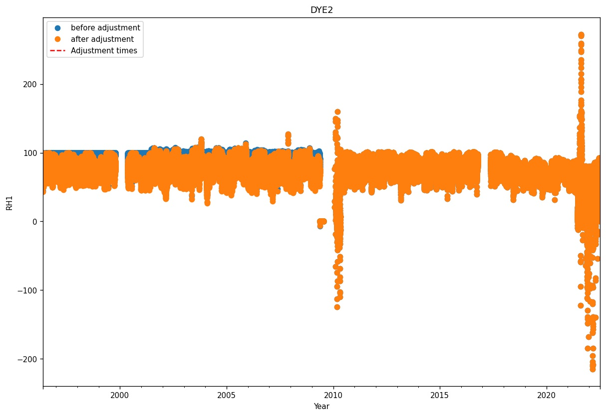
 
### Adjusting RH2
|start time|end time|operation|value|number of removed samples|
|-|-|-|-|-|
|1996-01-01T00:00:00+00:00|2010-01-01T00:00:00+00:00|ice_to_water|0.0|0|
 

 
### Adjusting TA1
|start time|end time|operation|value|number of removed samples|
|-|-|-|-|-|
|1990-01-01T00:00:00+00:00|2022-06-09T23:00:00+00:00|min_filter|-80.0|10|
|2020-10-01T00:00:00+00:00|2021-12-31T00:00:00+00:00|max_filter|4.0|19|
 

 
### Adjusting TA2
|start time|end time|operation|value|number of removed samples|
|-|-|-|-|-|
|2020-10-01T00:00:00+00:00|2021-12-31T00:00:00+00:00|max_filter|4.0|16|
 

 
# 9 JAR1
## Manual flagging of data at JAR1
Flagging data:
|start time|end time|variable|
|-|-|-|
|2007-10-01 00:00:00+00:00|2008-05-07 00:00:00+00:00|TA2|
|2010-10-01 00:00:00+00:00|2012-05-04 00:00:00+00:00|TA2|
 

 
|start time|end time|variable|
|-|-|-|
|2007-10-01 00:00:00+00:00|2008-05-07 00:00:00+00:00|TA4|
|2010-10-01 00:00:00+00:00|2011-06-05 00:00:00+00:00|TA4|
 

 
|start time|end time|variable|
|-|-|-|
|2011-06-01 00:00:00+00:00|2019-09-08 01:00:00+00:00|TS1|
 
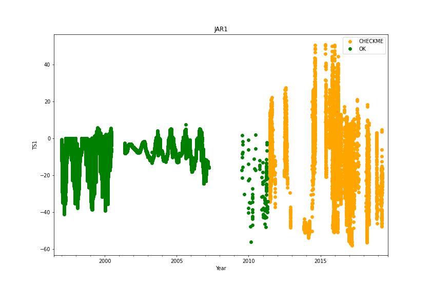
 
|start time|end time|variable|
|-|-|-|
|2011-06-01 00:00:00+00:00|2019-09-08 01:00:00+00:00|TS10|
 
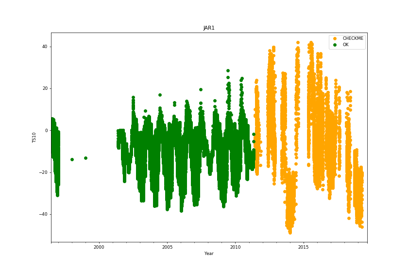
 
|start time|end time|variable|
|-|-|-|
|2011-06-01 00:00:00+00:00|2019-09-08 01:00:00+00:00|TS2|
 
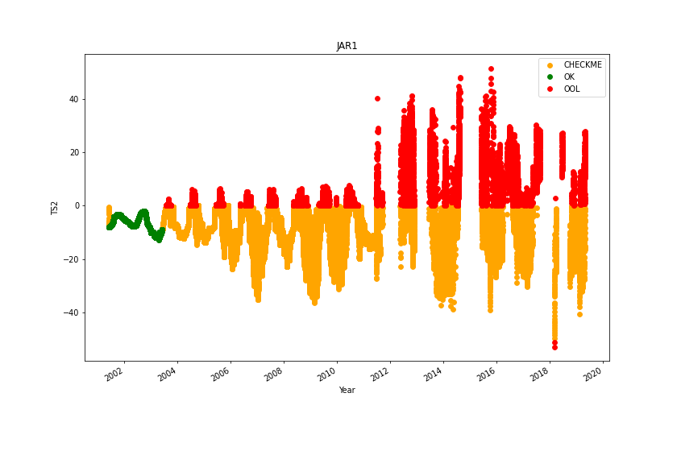
 
|start time|end time|variable|
|-|-|-|
|2011-06-01 00:00:00+00:00|2019-09-08 01:00:00+00:00|TS3|
 
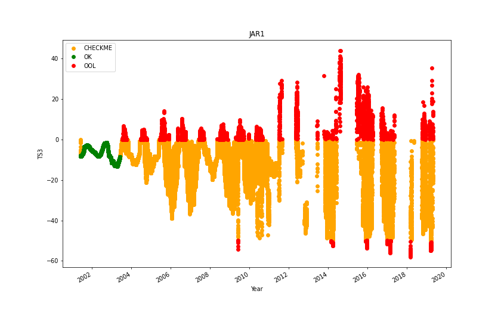
 
|start time|end time|variable|
|-|-|-|
|2011-06-01 00:00:00+00:00|2019-09-08 01:00:00+00:00|TS4|
 
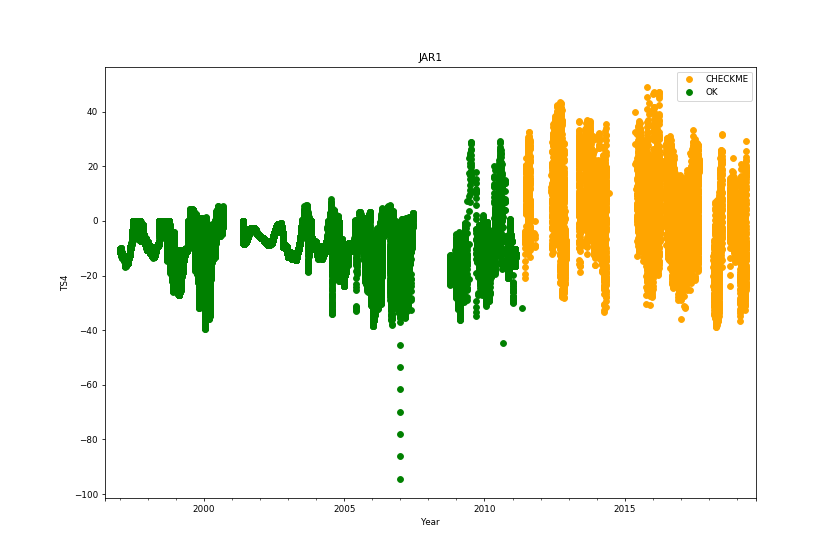
 
|start time|end time|variable|
|-|-|-|
|2011-06-01 00:00:00+00:00|2019-09-08 01:00:00+00:00|TS5|
 
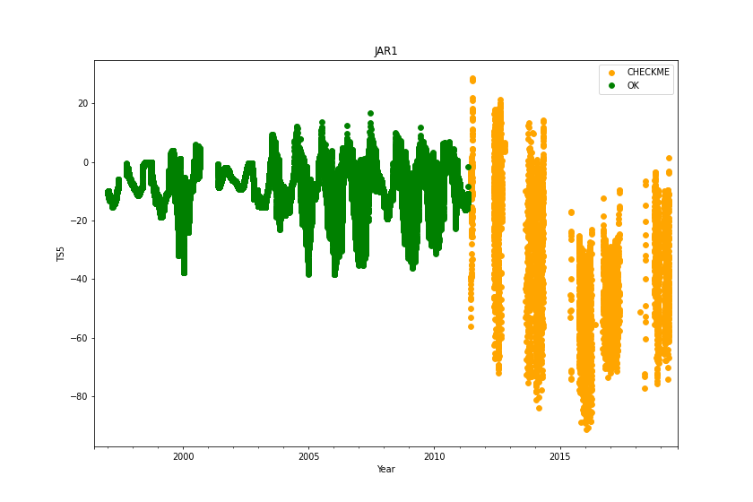
 
|start time|end time|variable|
|-|-|-|
|2011-06-01 00:00:00+00:00|2019-09-08 01:00:00+00:00|TS6|
 
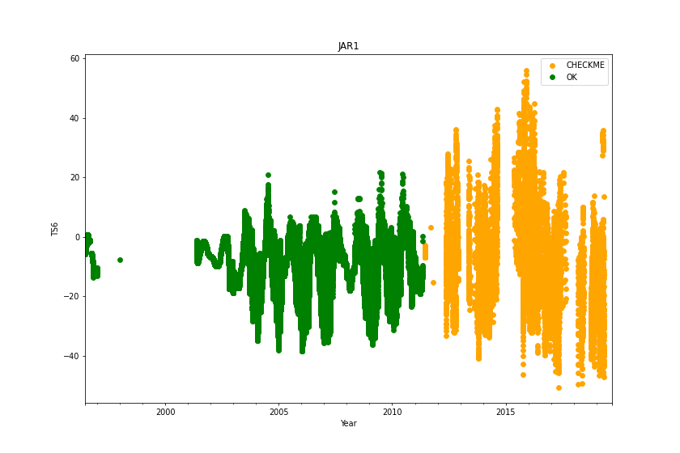
 
|start time|end time|variable|
|-|-|-|
|2011-06-01 00:00:00+00:00|2019-09-08 01:00:00+00:00|TS7|
 
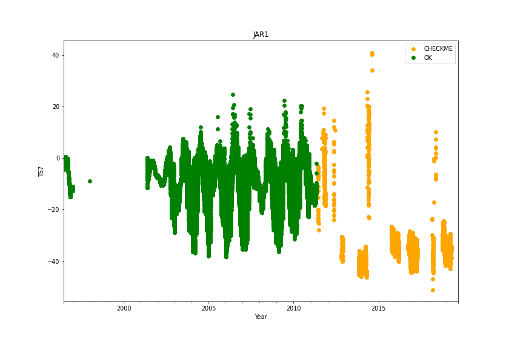
 
|start time|end time|variable|
|-|-|-|
|2011-06-01 00:00:00+00:00|2019-09-08 01:00:00+00:00|TS8|
 
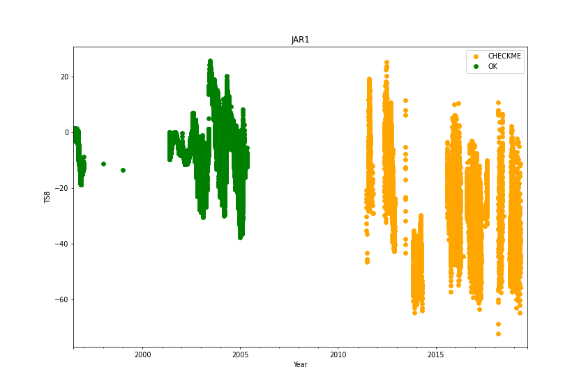
 
|start time|end time|variable|
|-|-|-|
|2011-06-01 00:00:00+00:00|2019-09-08 01:00:00+00:00|TS9|
 
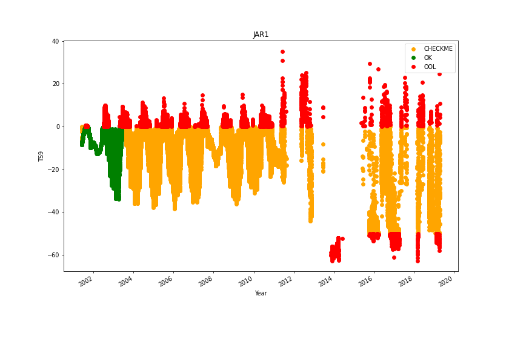
 
## Adjusting data at JAR1
### Adjusting HW1
|start time|end time|operation|value|number of removed samples|
|-|-|-|-|-|
|2009-05-15T00:00:00+00:00|2019-09-08T01:00:00+00:00|air_temp_sonic_correction|0.0|0|
|2009-05-15T00:00:00+00:00|2019-09-08T01:00:00+00:00|hampel_filter|2.0|3173|
|2003-04-24 00:00:00+00:00|2005-05-07 00:00:00+00:00|time_shift|24.0|17|
 

 
### Adjusting HW2
|start time|end time|operation|value|number of removed samples|
|-|-|-|-|-|
|2009-05-15T00:00:00+00:00|2019-09-08T01:00:00+00:00|air_temp_sonic_correction|0.0|0|
|2009-05-15T00:00:00+00:00|2019-09-08T01:00:00+00:00|hampel_filter|2.0|7573|
|2003-04-24 00:00:00+00:00|2005-05-07 00:00:00+00:00|time_shift|24.0|17|
 

 
## Adjusting data at JAR1
### Adjusting DW1
|start time|end time|operation|value|number of removed samples|
|-|-|-|-|-|
|2003-04-24 00:00:00+00:00|2005-05-07 00:00:00+00:00|time_shift|24.0|17|
 

 
### Adjusting DW2
|start time|end time|operation|value|number of removed samples|
|-|-|-|-|-|
|2003-04-24 00:00:00+00:00|2005-05-07 00:00:00+00:00|time_shift|24.0|17|
 

 
### Adjusting HS1
|start time|end time|operation|value|number of removed samples|
|-|-|-|-|-|
|1999-05-24T00:00:00+00:00|2019-09-08T01:00:00+00:00|add|-2.0|0|
|2002-05-03T00:00:00+00:00|2019-09-08T01:00:00+00:00|add|-1.5|0|
|2002-09-14T00:00:00+00:00|2019-09-08T01:00:00+00:00|add|1.0|0|
|2003-04-24T00:00:00+00:00|2019-09-08T01:00:00+00:00|add|-1.0|0|
|2008-04-24T00:00:00+00:00|2019-09-08T01:00:00+00:00|add|-2.0|0|
|2010-04-24T00:00:00+00:00|2019-09-08T01:00:00+00:00|add|-2.0|0|
|2011-04-24T00:00:00+00:00|2019-09-08T01:00:00+00:00|add|-2.0|0|
|2014-04-24T00:00:00+00:00|2019-09-08T01:00:00+00:00|add|-2.0|0|
|2015-04-24T00:00:00+00:00|2019-09-08T01:00:00+00:00|add|-2.0|0|
|2017-04-24T00:00:00+00:00|2019-09-08T01:00:00+00:00|add|-2.0|0|
|2003-04-24 00:00:00+00:00|2005-05-07 00:00:00+00:00|time_shift|24.0|24|
 

 
### Adjusting HS2
|start time|end time|operation|value|number of removed samples|
|-|-|-|-|-|
|1999-05-24T00:00:00+00:00|2019-09-08T01:00:00+00:00|add|-2.0|0|
|2002-05-03T00:00:00+00:00|2019-09-08T01:00:00+00:00|add|-1.5|0|
|2003-04-24T00:00:00+00:00|2019-09-08T01:00:00+00:00|add|-1.0|0|
|2008-04-24T00:00:00+00:00|2019-09-08T01:00:00+00:00|add|-2.0|0|
|2010-04-24T00:00:00+00:00|2019-09-08T01:00:00+00:00|add|-2.0|0|
|2011-04-24T00:00:00+00:00|2019-09-08T01:00:00+00:00|add|-2.0|0|
|2014-04-24T00:00:00+00:00|2019-09-08T01:00:00+00:00|add|-2.0|0|
|2015-04-24T00:00:00+00:00|2019-09-08T01:00:00+00:00|add|-2.0|0|
|2017-04-24T00:00:00+00:00|2019-09-08T01:00:00+00:00|add|-2.0|0|
|2003-04-24 00:00:00+00:00|2005-05-07 00:00:00+00:00|time_shift|24.0|24|
 
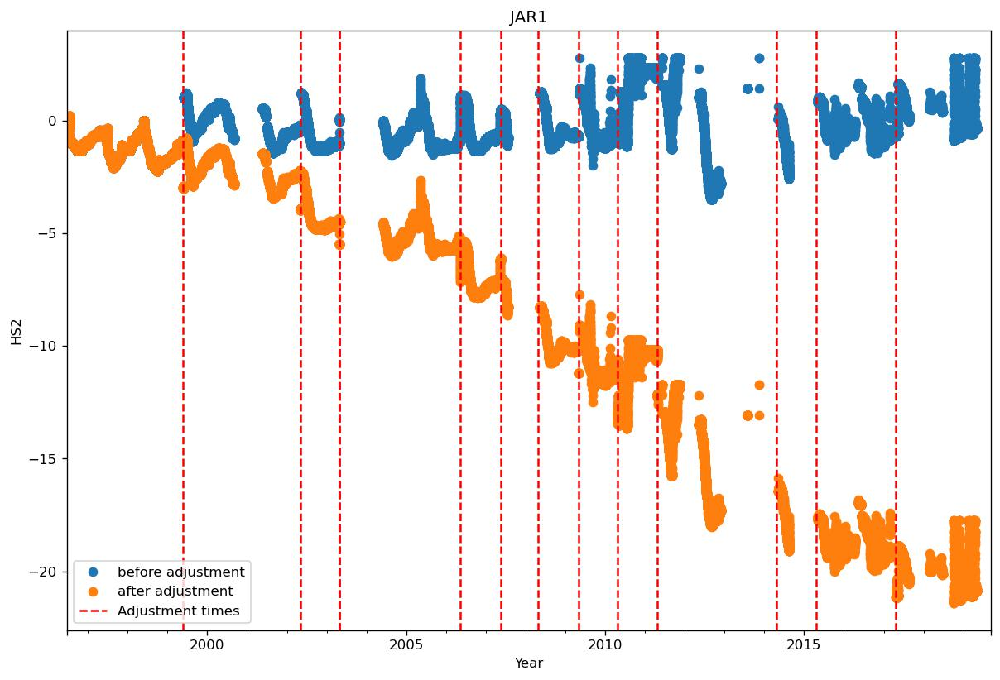
 
### Adjusting ISWR
|start time|end time|operation|value|number of removed samples|
|-|-|-|-|-|
|2003-04-24 00:00:00+00:00|2005-05-07 00:00:00+00:00|time_shift|24.0|16|
 

 
### Adjusting NSWR
|start time|end time|operation|value|number of removed samples|
|-|-|-|-|-|
|2003-04-24 00:00:00+00:00|2005-05-07 00:00:00+00:00|time_shift|24.0|14|
 
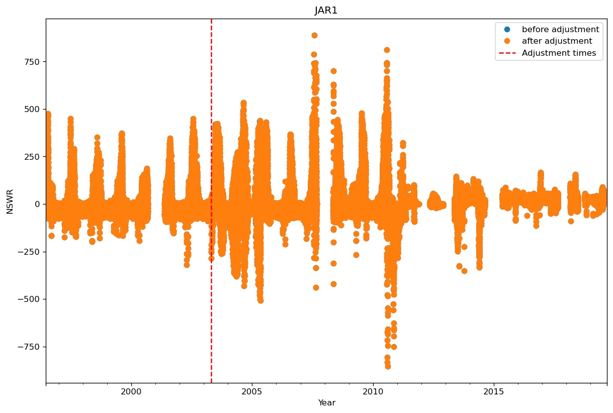
 
### Adjusting OSWR
|start time|end time|operation|value|number of removed samples|
|-|-|-|-|-|
|2003-04-24 00:00:00+00:00|2005-05-07 00:00:00+00:00|time_shift|24.0|17|
 

 
### Adjusting P
|start time|end time|operation|value|number of removed samples|
|-|-|-|-|-|
|2009-05-13T00:00:00+00:00|2016-04-11T00:00:00+00:00|add|-400.0|0|
|2003-04-24 00:00:00+00:00|2005-05-07 00:00:00+00:00|time_shift|24.0|17|
 

 
### Adjusting RH1
|start time|end time|operation|value|number of removed samples|
|-|-|-|-|-|
|2003-04-24 00:00:00+00:00|2005-05-07 00:00:00+00:00|time_shift|24.0|1|
 

 
### Adjusting RH2
|start time|end time|operation|value|number of removed samples|
|-|-|-|-|-|
|2003-04-24 00:00:00+00:00|2005-05-07 00:00:00+00:00|time_shift|24.0|1|
 

 
### Adjusting TA1
|start time|end time|operation|value|number of removed samples|
|-|-|-|-|-|
|2003-04-24 00:00:00+00:00|2005-05-07 00:00:00+00:00|time_shift|24.0|17|
 

 
### Adjusting TA2
|start time|end time|operation|value|number of removed samples|
|-|-|-|-|-|
|2003-04-24 00:00:00+00:00|2005-05-07 00:00:00+00:00|time_shift|24.0|17|
 

 
### Adjusting TA3
|start time|end time|operation|value|number of removed samples|
|-|-|-|-|-|
|2018-02-01T00:00:00+00:00|2019-12-20T00:00:00+00:00|max_filter|9.0|233|
|2003-04-24 00:00:00+00:00|2005-05-07 00:00:00+00:00|time_shift|24.0|1|
 

 
### Adjusting TA4
|start time|end time|operation|value|number of removed samples|
|-|-|-|-|-|
|2003-04-24 00:00:00+00:00|2005-05-07 00:00:00+00:00|time_shift|24.0|1|
|2013-02-01T00:00:00+00:00|2015-12-20T00:00:00+00:00|max_filter|9.0|3469|
 

 
### Adjusting TA5
|start time|end time|operation|value|number of removed samples|
|-|-|-|-|-|
|2003-04-24 00:00:00+00:00|2005-05-07 00:00:00+00:00|time_shift|24.0|0|
 

 
### Adjusting TS1
|start time|end time|operation|value|number of removed samples|
|-|-|-|-|-|
|2003-04-24 00:00:00+00:00|2005-05-07 00:00:00+00:00|time_shift|24.0|17|
 

 
### Adjusting TS10
|start time|end time|operation|value|number of removed samples|
|-|-|-|-|-|
|2003-04-24 00:00:00+00:00|2005-05-07 00:00:00+00:00|time_shift|24.0|17|
 

 
### Adjusting TS2
|start time|end time|operation|value|number of removed samples|
|-|-|-|-|-|
|2003-04-24 00:00:00+00:00|2005-05-07 00:00:00+00:00|time_shift|24.0|17|
 

 
### Adjusting TS3
|start time|end time|operation|value|number of removed samples|
|-|-|-|-|-|
|2003-04-24 00:00:00+00:00|2005-05-07 00:00:00+00:00|time_shift|24.0|17|
 

 
### Adjusting TS4
|start time|end time|operation|value|number of removed samples|
|-|-|-|-|-|
|2003-04-24 00:00:00+00:00|2005-05-07 00:00:00+00:00|time_shift|24.0|17|
 

 
### Adjusting TS5
|start time|end time|operation|value|number of removed samples|
|-|-|-|-|-|
|2003-04-24 00:00:00+00:00|2005-05-07 00:00:00+00:00|time_shift|24.0|17|
 

 
### Adjusting TS6
|start time|end time|operation|value|number of removed samples|
|-|-|-|-|-|
|2003-04-24 00:00:00+00:00|2005-05-07 00:00:00+00:00|time_shift|24.0|17|
 

 
### Adjusting TS7
|start time|end time|operation|value|number of removed samples|
|-|-|-|-|-|
|2003-04-24 00:00:00+00:00|2005-05-07 00:00:00+00:00|time_shift|24.0|17|
 

 
### Adjusting TS8
|start time|end time|operation|value|number of removed samples|
|-|-|-|-|-|
|2003-04-24 00:00:00+00:00|2005-05-07 00:00:00+00:00|time_shift|24.0|17|
 

 
### Adjusting TS9
|start time|end time|operation|value|number of removed samples|
|-|-|-|-|-|
|2003-04-24 00:00:00+00:00|2005-05-07 00:00:00+00:00|time_shift|24.0|17|
 

 
### Adjusting V
|start time|end time|operation|value|number of removed samples|
|-|-|-|-|-|
|2003-04-24 00:00:00+00:00|2005-05-07 00:00:00+00:00|time_shift|24.0|17|
 

 
### Adjusting VW1
|start time|end time|operation|value|number of removed samples|
|-|-|-|-|-|
|2003-04-24 00:00:00+00:00|2005-05-07 00:00:00+00:00|time_shift|24.0|17|
 

 
### Adjusting VW2
|start time|end time|operation|value|number of removed samples|
|-|-|-|-|-|
|2003-04-24 00:00:00+00:00|2005-05-07 00:00:00+00:00|time_shift|24.0|17|
 

 
# 10 Saddle
## Manual flagging of data at Saddle
Flagging data:
|start time|end time|variable|
|-|-|-|
|2014-10-09 00:00:00+00:00|2016-05-15 00:00:00+00:00|HW1|
|2017-08-16 00:00:00+00:00|2018-05-26 00:00:00+00:00|HW1|
 

 
|start time|end time|variable|
|-|-|-|
|2012-09-18 00:00:00+00:00|2013-05-19 00:00:00+00:00|HW2|
 

 
|start time|end time|variable|
|-|-|-|
|2010-01-01 00:00:00+00:00|2021-10-16 17:00:00+00:00|RH2|
 

 
|start time|end time|variable|
|-|-|-|
|2010-01-01 00:00:00+00:00|2016-01-01 00:00:00+00:00|TA1|
 

 
|start time|end time|variable|
|-|-|-|
|2010-06-01 00:00:00+00:00|2021-10-16 17:00:00+00:00|TS1|
 
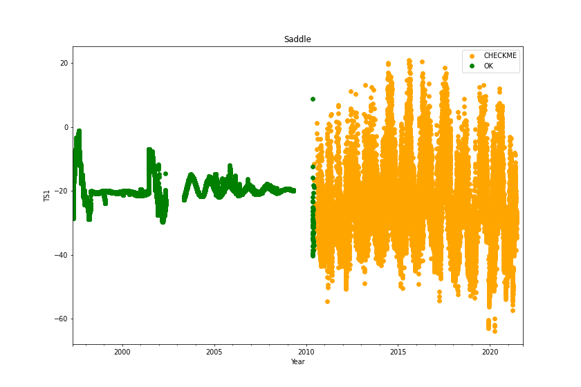
 
|start time|end time|variable|
|-|-|-|
|2010-06-01 00:00:00+00:00|2021-10-16 17:00:00+00:00|TS10|
 
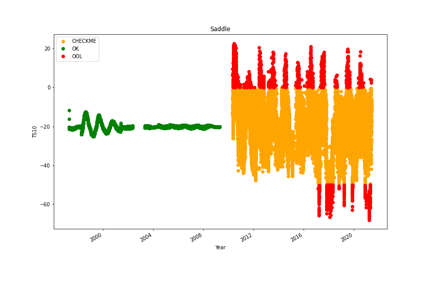
 
|start time|end time|variable|
|-|-|-|
|2010-06-01 00:00:00+00:00|2021-10-16 17:00:00+00:00|TS2|
 
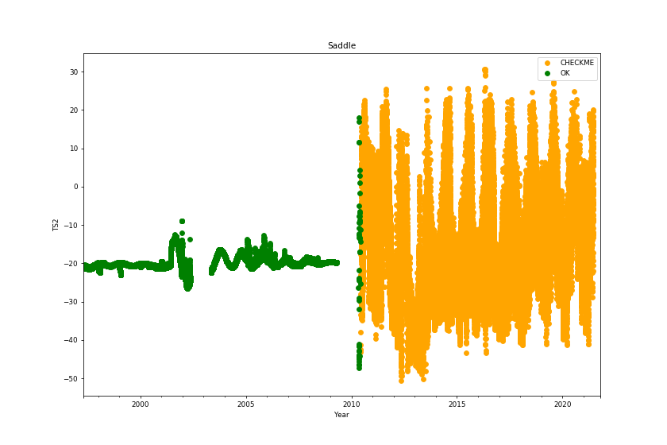
 
|start time|end time|variable|
|-|-|-|
|2010-06-01 00:00:00+00:00|2021-10-16 17:00:00+00:00|TS3|
 

 
|start time|end time|variable|
|-|-|-|
|2010-06-01 00:00:00+00:00|2021-10-16 17:00:00+00:00|TS4|
 
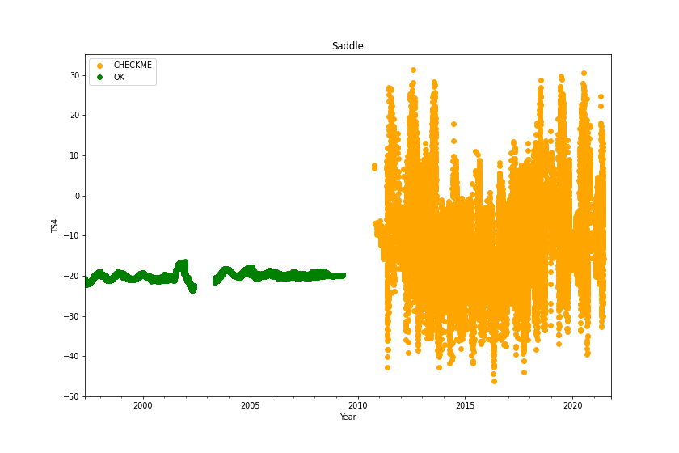
 
|start time|end time|variable|
|-|-|-|
|2010-06-01 00:00:00+00:00|2021-10-16 17:00:00+00:00|TS5|
 
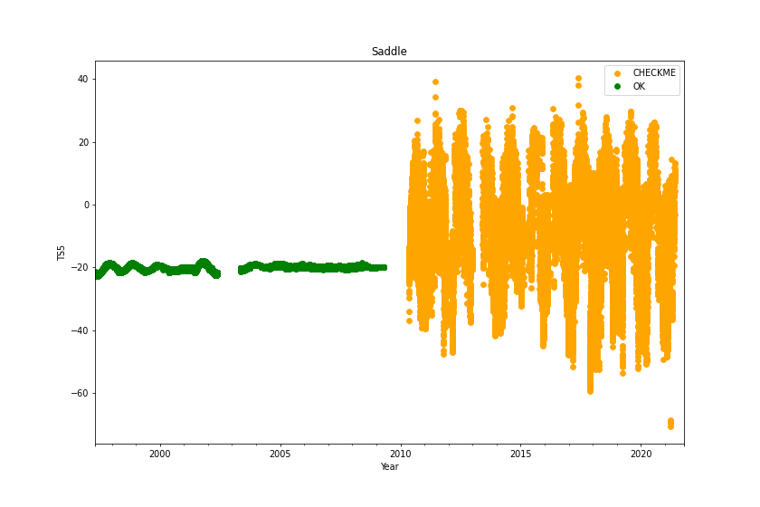
 
|start time|end time|variable|
|-|-|-|
|2010-06-01 00:00:00+00:00|2021-10-16 17:00:00+00:00|TS6|
 

 
|start time|end time|variable|
|-|-|-|
|2010-06-01 00:00:00+00:00|2021-10-16 17:00:00+00:00|TS7|
 
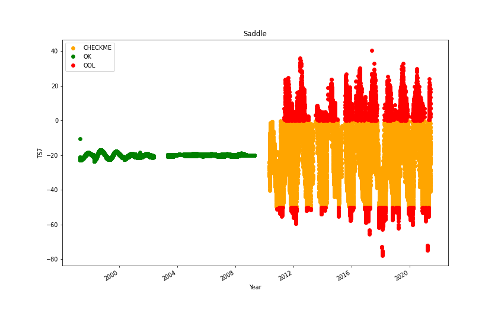
 
|start time|end time|variable|
|-|-|-|
|2010-06-01 00:00:00+00:00|2021-10-16 17:00:00+00:00|TS8|
 
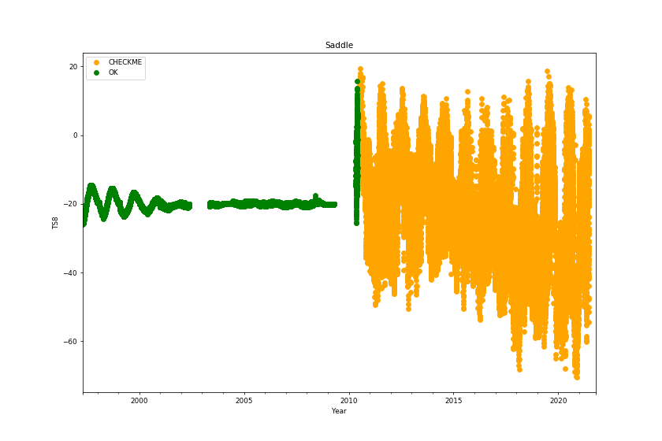
 
|start time|end time|variable|
|-|-|-|
|2010-06-01 00:00:00+00:00|2021-10-16 17:00:00+00:00|TS9|
 
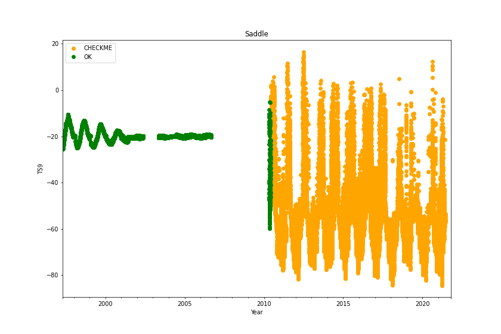
 
|start time|end time|variable|
|-|-|-|
|2009-01-01 00:00:00+00:00|2010-01-01 00:00:00+00:00|VW1|
 

 
|start time|end time|variable|
|-|-|-|
|2009-01-01 00:00:00+00:00|2010-01-01 00:00:00+00:00|VW2|
 

 
## Adjusting data at Saddle
### Adjusting HW1
|start time|end time|operation|value|number of removed samples|
|-|-|-|-|-|
|2009-05-15T00:00:00+00:00|2021-10-16T17:00:00+00:00|air_temp_sonic_correction|0.0|0|
|2009-05-15T00:00:00+00:00|2021-10-16T17:00:00+00:00|biweekly_upper_range_filter|0.5|34735|
|2009-05-15T00:00:00+00:00|2021-10-16T17:00:00+00:00|hampel_filter|2.0|1091|
 

 
### Adjusting HW2
|start time|end time|operation|value|number of removed samples|
|-|-|-|-|-|
|2009-05-15T00:00:00+00:00|2021-10-16T17:00:00+00:00|air_temp_sonic_correction|0.0|0|
|2009-05-15T00:00:00+00:00|2021-10-16T17:00:00+00:00|biweekly_upper_range_filter|0.5|17172|
|2009-05-15T00:00:00+00:00|2021-10-16T17:00:00+00:00|hampel_filter|2.0|1092|
 

 
## Adjusting data at Saddle
### Adjusting HS1
|start time|end time|operation|value|number of removed samples|
|-|-|-|-|-|
|1998-04-21T16:00:00+00:00|2021-10-16T17:00:00+00:00|add|0.4|0|
|1999-04-20T16:00:00+00:00|2021-10-16T17:00:00+00:00|add|1.9|0|
|2001-06-05T16:00:00+00:00|2021-10-16T17:00:00+00:00|add|2.6|0|
|2002-06-07T16:00:00+00:00|2021-10-16T17:00:00+00:00|add|0.5|0|
|2004-06-11T16:00:00+00:00|2021-10-16T17:00:00+00:00|add|2.5|0|
|2005-05-30T16:00:00+00:00|2021-10-16T17:00:00+00:00|add|2.5|0|
|2007-05-22T16:00:00+00:00|2021-10-16T17:00:00+00:00|add|-2.5|0|
|2008-04-28T16:00:00+00:00|2021-10-16T17:00:00+00:00|add|2.5|0|
|2013-06-07T16:00:00+00:00|2021-10-16T17:00:00+00:00|add|4.0|0|
|2017-09-07T16:00:00+00:00|2021-10-16T17:00:00+00:00|add|1.5|0|
 

 
### Adjusting HS2
|start time|end time|operation|value|number of removed samples|
|-|-|-|-|-|
|1999-04-16T11:00:00+00:00|2021-10-16T17:00:00+00:00|add|2.5|0|
|2001-05-23T16:00:00+00:00|2021-10-16T17:00:00+00:00|add|2.5|0|
|2002-01-01T16:00:00+00:00|2021-10-16T17:00:00+00:00|add|-1.0|0|
|2004-06-14T16:00:00+00:00|2021-10-16T17:00:00+00:00|add|2.5|0|
|2005-03-27T16:00:00+00:00|2021-10-16T17:00:00+00:00|add|2.5|0|
|2010-01-07T16:00:00+00:00|2021-10-16T17:00:00+00:00|add|4.0|0|
|2014-05-21T16:00:00+00:00|2021-10-16T17:00:00+00:00|add|4.0|0|
|2019-01-01T16:00:00+00:00|2021-10-16T17:00:00+00:00|add|2.0|0|
 

 
### Adjusting RH1
|start time|end time|operation|value|number of removed samples|
|-|-|-|-|-|
|1996-01-01T00:00:00+00:00|2010-01-01T00:00:00+00:00|ice_to_water|0.0|0|
 

 
### Adjusting RH2
|start time|end time|operation|value|number of removed samples|
|-|-|-|-|-|
|1996-01-01T00:00:00+00:00|2010-01-01T00:00:00+00:00|ice_to_water|0.0|0|
 

 
### Adjusting TA3
|start time|end time|operation|value|number of removed samples|
|-|-|-|-|-|
|1990-01-01T00:00:00+00:00|2021-10-16T17:00:00+00:00|swap_with_TA4|0.0|601|
 

 
# 11 South Dome
## Manual flagging of data at South Dome
Flagging data:
|start time|end time|variable|
|-|-|-|
|2011-11-01 00:00:00+00:00|2012-03-12 00:00:00+00:00|HW1|
|2012-09-01 00:00:00+00:00|2014-05-12 00:00:00+00:00|HW1|
|2018-01-01 00:00:00+00:00|2018-05-12 00:00:00+00:00|HW1|
 

 
|start time|end time|variable|
|-|-|-|
|2018-12-15 00:00:00+00:00|2020-01-01 00:00:00+00:00|HW2|
 

 
|start time|end time|variable|
|-|-|-|
|2000-10-01 00:00:00+00:00|2010-01-01 00:00:00+00:00|P|
 

 
|start time|end time|variable|
|-|-|-|
|1996-01-01 00:00:00+00:00|1999-06-01 00:00:00+00:00|RH2|
|2010-05-01 00:00:00+00:00|2011-06-01 00:00:00+00:00|RH2|
 

 
|start time|end time|variable|
|-|-|-|
|2010-05-01 00:00:00+00:00|2011-06-01 00:00:00+00:00|TA2|
 

 
|start time|end time|variable|
|-|-|-|
|1996-01-01 00:00:00+00:00|1999-06-01 00:00:00+00:00|TA4|
|2010-05-01 00:00:00+00:00|2011-06-01 00:00:00+00:00|TA4|
 

 
|start time|end time|variable|
|-|-|-|
|2008-06-05 00:00:00+00:00|2021-06-21 16:00:00+00:00|TS1|
 
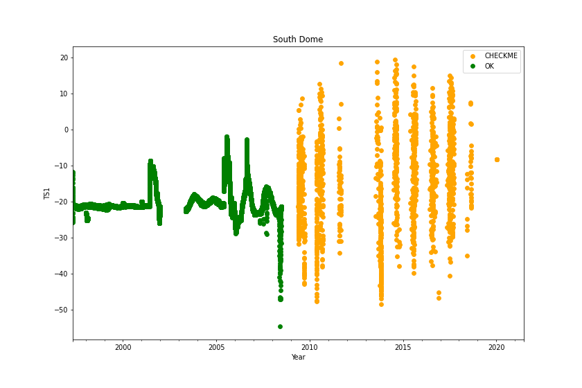
 
|start time|end time|variable|
|-|-|-|
|2008-06-05 00:00:00+00:00|2021-06-21 16:00:00+00:00|TS10|
|1997-04-15 00:00:00+00:00|1997-06-05 00:00:00+00:00|TS10|
 

 
|start time|end time|variable|
|-|-|-|
|2008-06-05 00:00:00+00:00|2021-06-21 16:00:00+00:00|TS2|
 

 
|start time|end time|variable|
|-|-|-|
|2008-06-05 00:00:00+00:00|2021-06-21 16:00:00+00:00|TS3|
 

 
|start time|end time|variable|
|-|-|-|
|2008-06-05 00:00:00+00:00|2021-06-21 16:00:00+00:00|TS4|
|2007-06-28 00:00:00+00:00|2007-07-05 00:00:00+00:00|TS4|
 

 
|start time|end time|variable|
|-|-|-|
|2008-06-05 00:00:00+00:00|2021-06-21 16:00:00+00:00|TS5|
 

 
|start time|end time|variable|
|-|-|-|
|2008-06-05 00:00:00+00:00|2021-06-21 16:00:00+00:00|TS6|
 

 
|start time|end time|variable|
|-|-|-|
|2008-06-05 00:00:00+00:00|2021-06-21 16:00:00+00:00|TS7|
|1997-04-15 00:00:00+00:00|1997-06-05 00:00:00+00:00|TS7|
 

 
|start time|end time|variable|
|-|-|-|
|2008-06-05 00:00:00+00:00|2021-06-21 16:00:00+00:00|TS8|
|1997-04-15 00:00:00+00:00|1997-06-05 00:00:00+00:00|TS8|
 

 
|start time|end time|variable|
|-|-|-|
|2008-06-05 00:00:00+00:00|2021-06-21 16:00:00+00:00|TS9|
|1997-04-15 00:00:00+00:00|1997-06-05 00:00:00+00:00|TS9|
 

 
## Adjusting data at South Dome
### Adjusting HW1
|start time|end time|operation|value|number of removed samples|
|-|-|-|-|-|
|1995-05-26T20:00:00+00:00|2021-06-21T16:00:00+00:00|max_filter|20.0|1|
|1996-05-15T00:00:00+00:00|2021-06-21T16:00:00+00:00|air_temp_sonic_correction|0.0|0|
|2009-05-15T00:00:00+00:00|2021-06-21T16:00:00+00:00|biweekly_upper_range_filter|0.3|58166|
|2009-05-15T00:00:00+00:00|2021-06-21T16:00:00+00:00|hampel_filter|2.0|1032|
|1998-04-20 03:00:00+00:00|1999-04-23 03:00:00+00:00|time_shift|-3.0|4|
 

 
### Adjusting HW2
|start time|end time|operation|value|number of removed samples|
|-|-|-|-|-|
|1995-05-26T20:00:00+00:00|2021-06-21T16:00:00+00:00|max_filter|20.0|1|
|1996-05-15T00:00:00+00:00|2021-06-21T16:00:00+00:00|air_temp_sonic_correction|0.0|0|
|2009-05-15T00:00:00+00:00|2021-06-21T16:00:00+00:00|biweekly_upper_range_filter|0.3|11549|
|2009-05-15T00:00:00+00:00|2021-06-21T16:00:00+00:00|hampel_filter|2.0|82|
|1998-04-20 03:00:00+00:00|1999-04-23 03:00:00+00:00|time_shift|-3.0|4|
 

 
## Adjusting data at South Dome
### Adjusting DW1
|start time|end time|operation|value|number of removed samples|
|-|-|-|-|-|
|1998-04-20 03:00:00+00:00|1999-04-23 03:00:00+00:00|time_shift|-3.0|4|
 
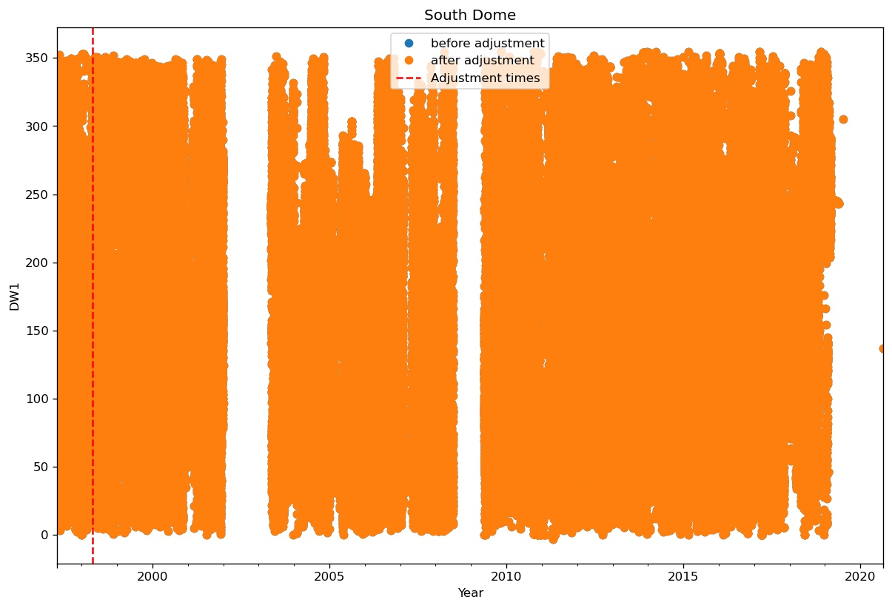
 
### Adjusting DW2
|start time|end time|operation|value|number of removed samples|
|-|-|-|-|-|
|1998-04-20 03:00:00+00:00|1999-04-23 03:00:00+00:00|time_shift|-3.0|4|
 
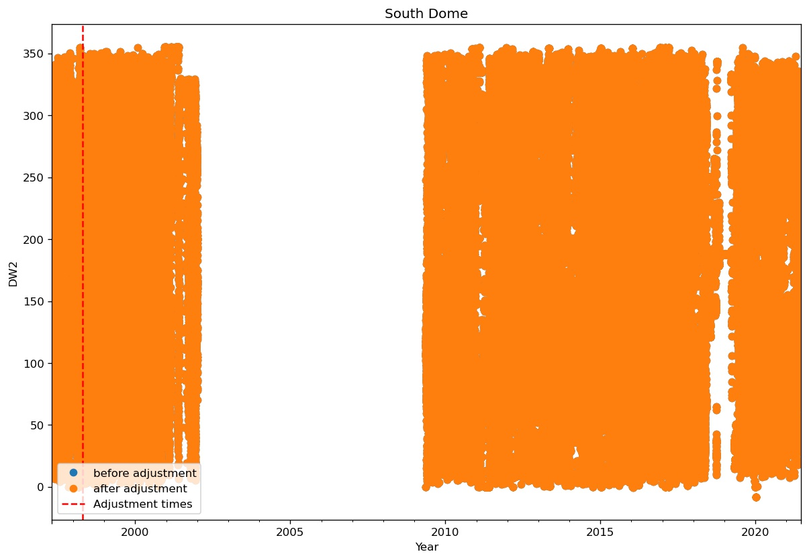
 
### Adjusting HS1
|start time|end time|operation|value|number of removed samples|
|-|-|-|-|-|
|1998-04-17T00:00:00+00:00|2021-06-21T16:00:00+00:00|add|2.5|0|
|1999-04-22T15:00:00+00:00|2021-06-21T16:00:00+00:00|add|2.0|0|
|2001-06-07T00:00:00+00:00|2021-06-21T16:00:00+00:00|add|3.0|0|
|2005-05-26T20:00:00+00:00|2021-06-21T16:00:00+00:00|add|6.0|0|
|2006-07-18T01:00:00+00:00|2021-06-21T16:00:00+00:00|add|2.5|0|
|2007-04-23T01:00:00+00:00|2021-06-21T16:00:00+00:00|add|3.4|0|
|2009-05-16T18:00:00+00:00|2021-06-21T16:00:00+00:00|add|2.0|0|
|2014-05-25T20:00:00+00:00|2021-06-21T16:00:00+00:00|add|5.0|0|
|2015-05-25T20:00:00+00:00|2021-06-21T16:00:00+00:00|add|2.5|0|
|2017-05-23T00:00:00+00:00|2021-06-21T16:00:00+00:00|add|2.3|0|
|1998-04-20 03:00:00+00:00|1999-04-23 03:00:00+00:00|time_shift|-3.0|3|
 

 
### Adjusting HS2
|start time|end time|operation|value|number of removed samples|
|-|-|-|-|-|
|1998-04-17T00:00:00+00:00|2021-06-21T16:00:00+00:00|add|2.5|0|
|1999-04-22T15:00:00+00:00|2021-06-21T16:00:00+00:00|add|2.0|0|
|2001-06-07T00:00:00+00:00|2021-06-21T16:00:00+00:00|add|3.0|0|
|2005-05-26T20:00:00+00:00|2021-06-21T16:00:00+00:00|add|6.0|0|
|2007-04-23T01:00:00+00:00|2021-06-21T16:00:00+00:00|add|3.4|0|
|2009-05-16T18:00:00+00:00|2021-06-21T16:00:00+00:00|add|1.5|0|
|2011-03-25T18:00:00+00:00|2021-06-21T16:00:00+00:00|add|3.0|0|
|2013-04-22T18:00:00+00:00|2021-06-21T16:00:00+00:00|add|3.0|0|
|2015-04-29T18:00:00+00:00|2021-06-21T16:00:00+00:00|add|3.0|0|
|2017-05-23T00:00:00+00:00|2021-06-21T16:00:00+00:00|add|2.3|0|
|2020-01-23T00:00:00+00:00|2021-06-21T16:00:00+00:00|add|2.3|0|
|1998-04-20 03:00:00+00:00|1999-04-23 03:00:00+00:00|time_shift|-3.0|3|
 

 
### Adjusting ISWR
|start time|end time|operation|value|number of removed samples|
|-|-|-|-|-|
|1998-04-20 03:00:00+00:00|1999-04-23 03:00:00+00:00|time_shift|-3.0|4|
 
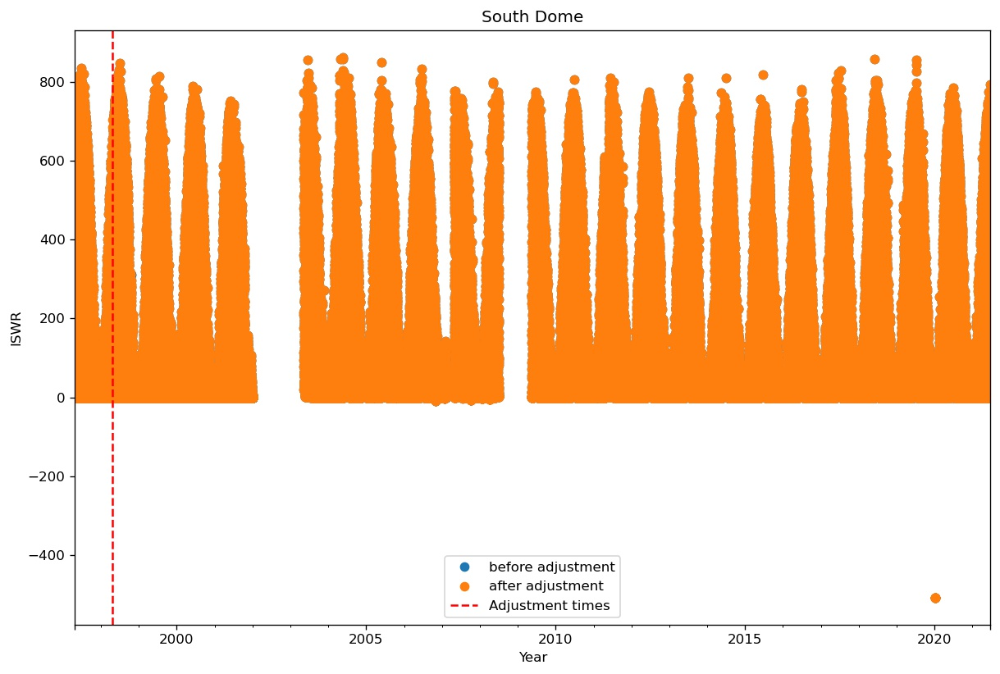
 
### Adjusting NSWR
|start time|end time|operation|value|number of removed samples|
|-|-|-|-|-|
|1998-04-20 03:00:00+00:00|1999-04-23 03:00:00+00:00|time_shift|-3.0|4|
 
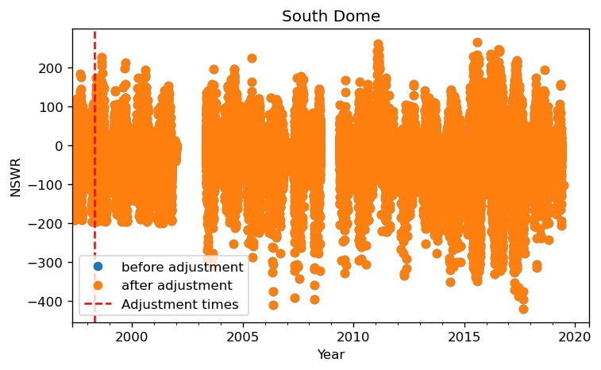
 
### Adjusting OSWR
|start time|end time|operation|value|number of removed samples|
|-|-|-|-|-|
|1998-04-20 03:00:00+00:00|1999-04-23 03:00:00+00:00|time_shift|-3.0|4|
 
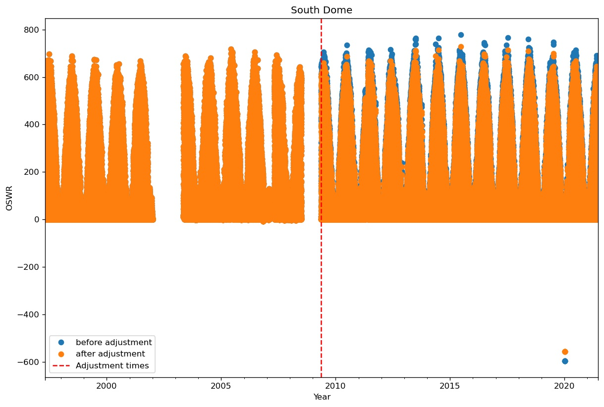
 
### Adjusting P
|start time|end time|operation|value|number of removed samples|
|-|-|-|-|-|
|1998-04-20 03:00:00+00:00|1999-04-23 03:00:00+00:00|time_shift|-3.0|4|
 
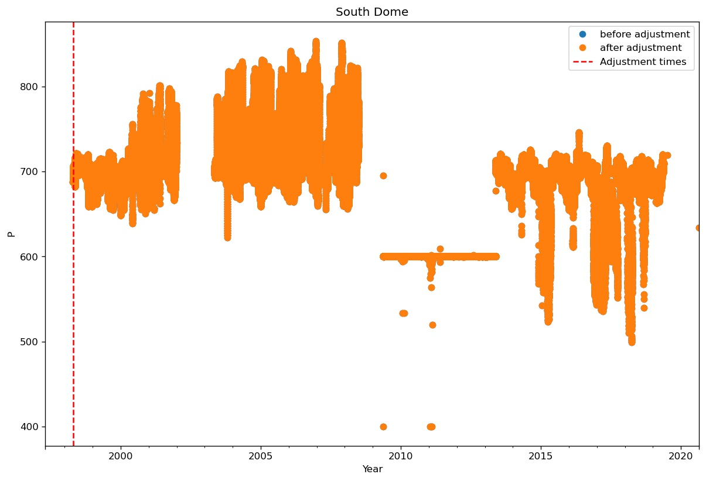
 
### Adjusting RH1
|start time|end time|operation|value|number of removed samples|
|-|-|-|-|-|
|1996-01-01T00:00:00+00:00|2003-01-01T00:00:00+00:00|ice_to_water|0.0|0|
|1998-04-20 03:00:00+00:00|1999-04-23 03:00:00+00:00|time_shift|-3.0|4|
 
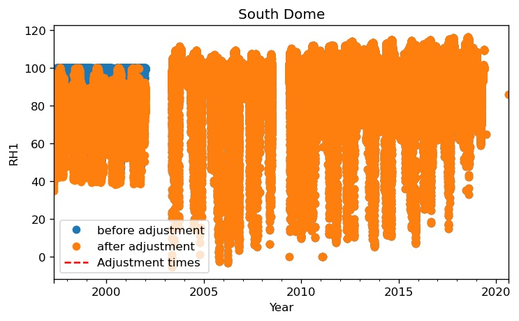
 
### Adjusting RH2
|start time|end time|operation|value|number of removed samples|
|-|-|-|-|-|
|1996-01-01T00:00:00+00:00|2003-01-01T00:00:00+00:00|ice_to_water|0.0|0|
|1998-04-20 03:00:00+00:00|1999-04-23 03:00:00+00:00|time_shift|-3.0|1|
 
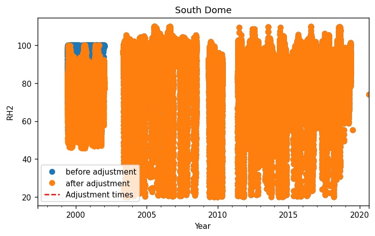
 
### Adjusting TA1
|start time|end time|operation|value|number of removed samples|
|-|-|-|-|-|
|1998-04-20 03:00:00+00:00|1999-04-23 03:00:00+00:00|time_shift|-3.0|4|
 
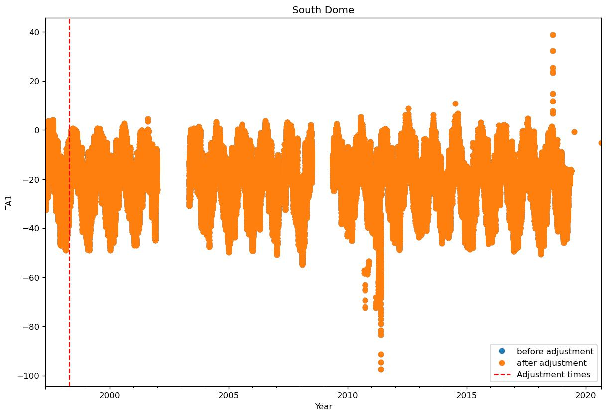
 
### Adjusting TA2
|start time|end time|operation|value|number of removed samples|
|-|-|-|-|-|
|1998-04-20 03:00:00+00:00|1999-04-23 03:00:00+00:00|time_shift|-3.0|4|
 
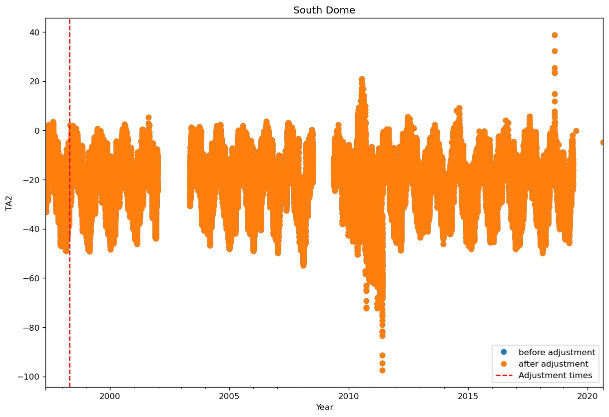
 
### Adjusting TA3
|start time|end time|operation|value|number of removed samples|
|-|-|-|-|-|
|1998-04-20 03:00:00+00:00|1999-04-23 03:00:00+00:00|time_shift|-3.0|4|
 
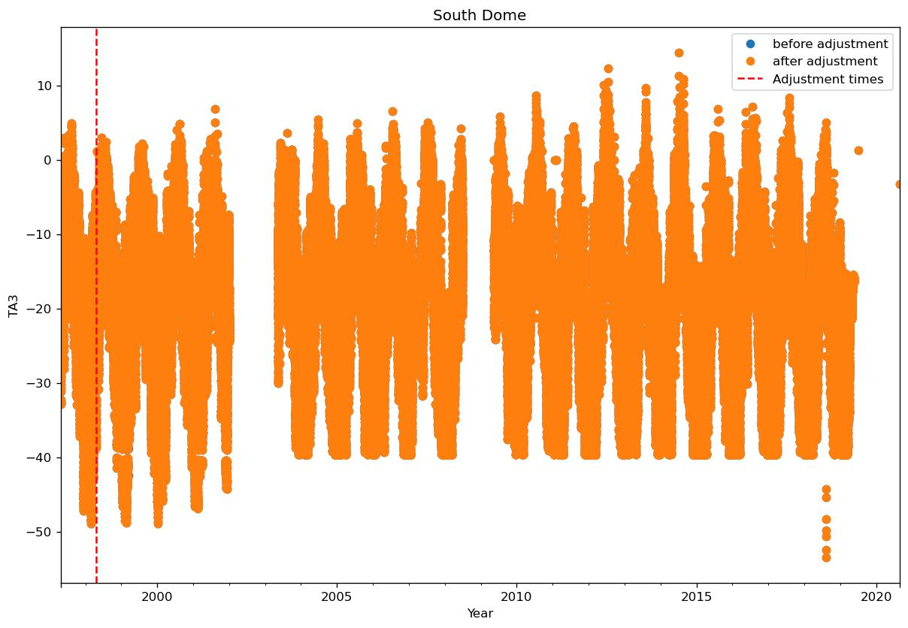
 
### Adjusting TA4
|start time|end time|operation|value|number of removed samples|
|-|-|-|-|-|
|1998-04-20 03:00:00+00:00|1999-04-23 03:00:00+00:00|time_shift|-3.0|1|
 
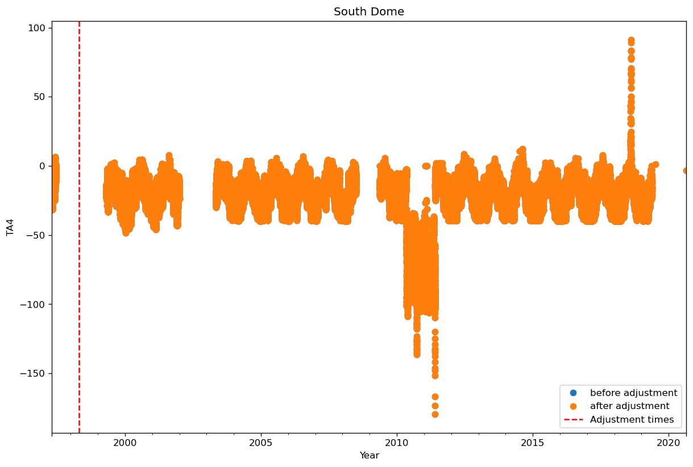
 
### Adjusting TA5
|start time|end time|operation|value|number of removed samples|
|-|-|-|-|-|
|1998-04-20 03:00:00+00:00|1999-04-23 03:00:00+00:00|time_shift|-3.0|0|
 
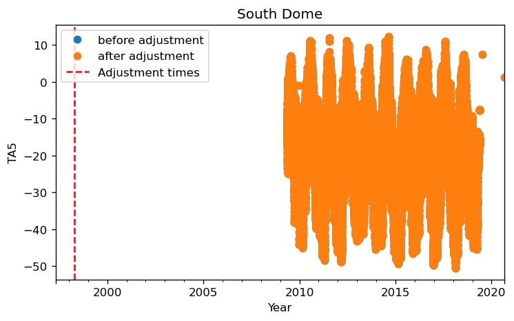
 
### Adjusting TS1
|start time|end time|operation|value|number of removed samples|
|-|-|-|-|-|
|1998-04-20 03:00:00+00:00|1999-04-23 03:00:00+00:00|time_shift|-3.0|4|
 
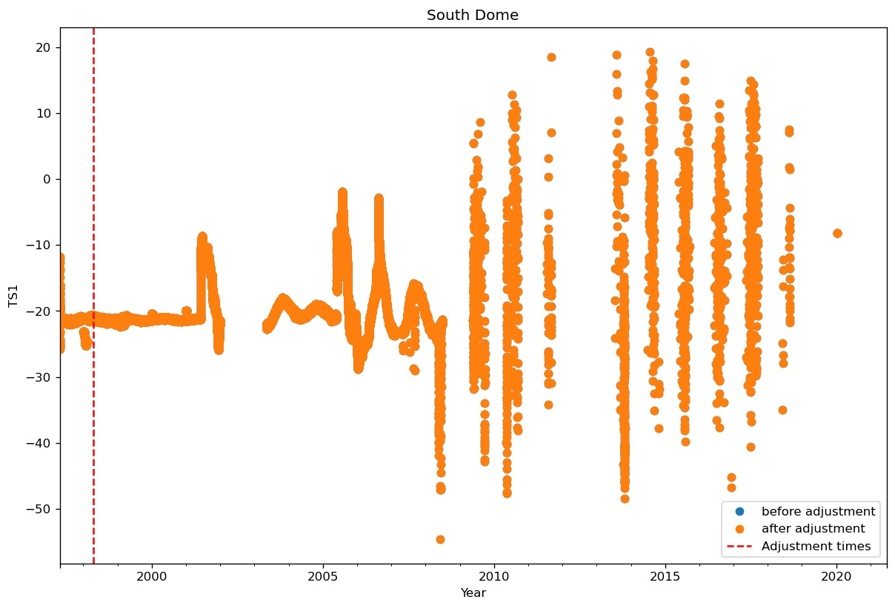
 
### Adjusting TS10
|start time|end time|operation|value|number of removed samples|
|-|-|-|-|-|
|1998-04-20 03:00:00+00:00|1999-04-23 03:00:00+00:00|time_shift|-3.0|4|
 
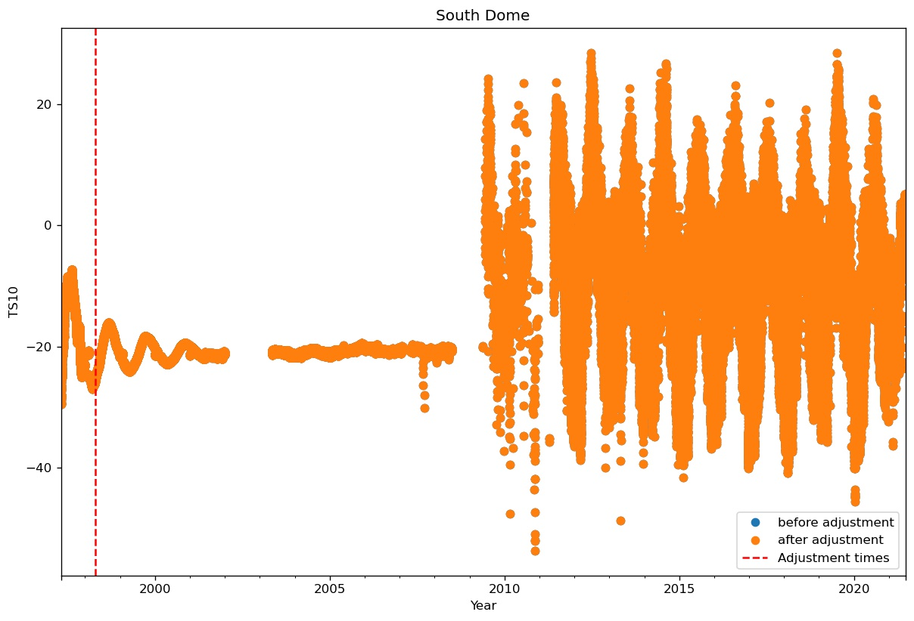
 
### Adjusting TS2
|start time|end time|operation|value|number of removed samples|
|-|-|-|-|-|
|1998-04-20 03:00:00+00:00|1999-04-23 03:00:00+00:00|time_shift|-3.0|4|
 
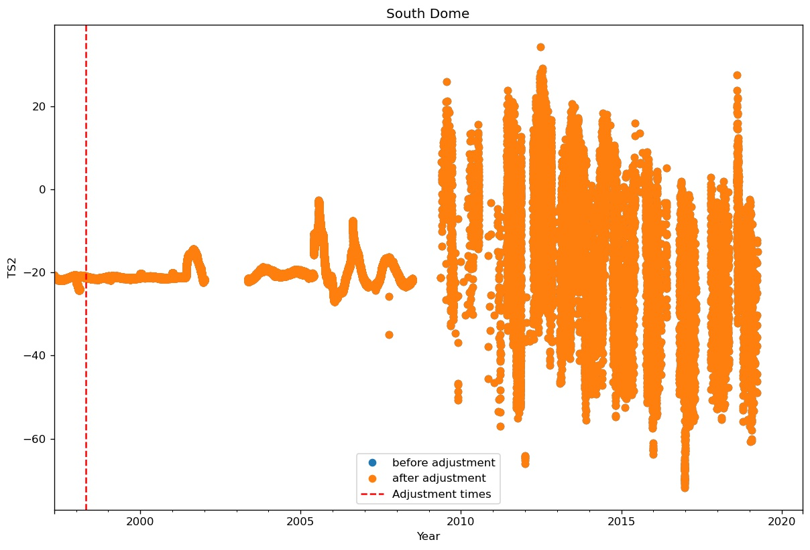
 
### Adjusting TS3
|start time|end time|operation|value|number of removed samples|
|-|-|-|-|-|
|1998-04-20 03:00:00+00:00|1999-04-23 03:00:00+00:00|time_shift|-3.0|4|
 
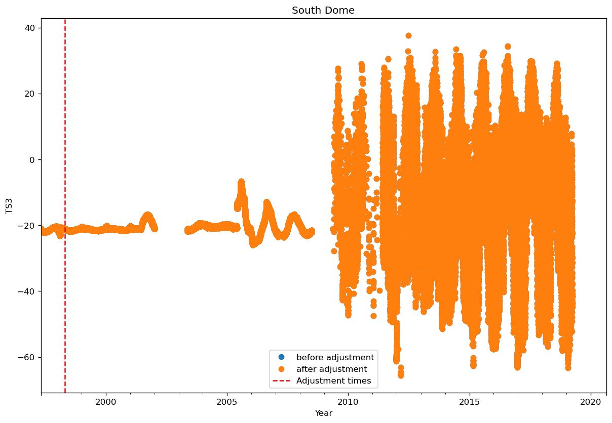
 
### Adjusting TS4
|start time|end time|operation|value|number of removed samples|
|-|-|-|-|-|
|1998-04-20 03:00:00+00:00|1999-04-23 03:00:00+00:00|time_shift|-3.0|4|
 

 
### Adjusting TS5
|start time|end time|operation|value|number of removed samples|
|-|-|-|-|-|
|1998-04-20 03:00:00+00:00|1999-04-23 03:00:00+00:00|time_shift|-3.0|4|
 
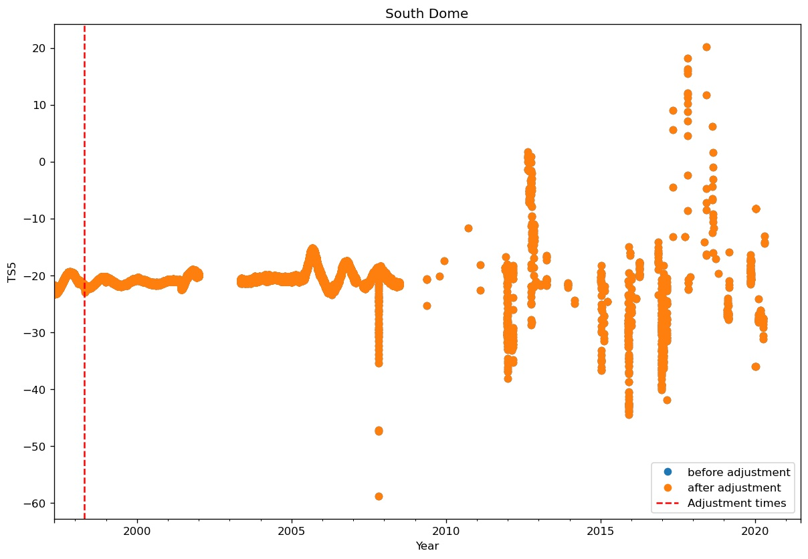
 
### Adjusting TS6
|start time|end time|operation|value|number of removed samples|
|-|-|-|-|-|
|1998-04-20 03:00:00+00:00|1999-04-23 03:00:00+00:00|time_shift|-3.0|4|
 
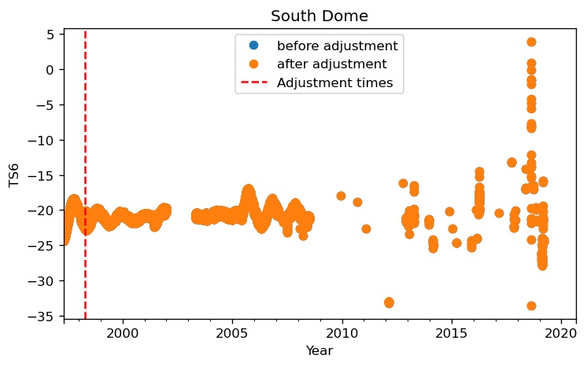
 
### Adjusting TS7
|start time|end time|operation|value|number of removed samples|
|-|-|-|-|-|
|1998-04-20 03:00:00+00:00|1999-04-23 03:00:00+00:00|time_shift|-3.0|4|
 
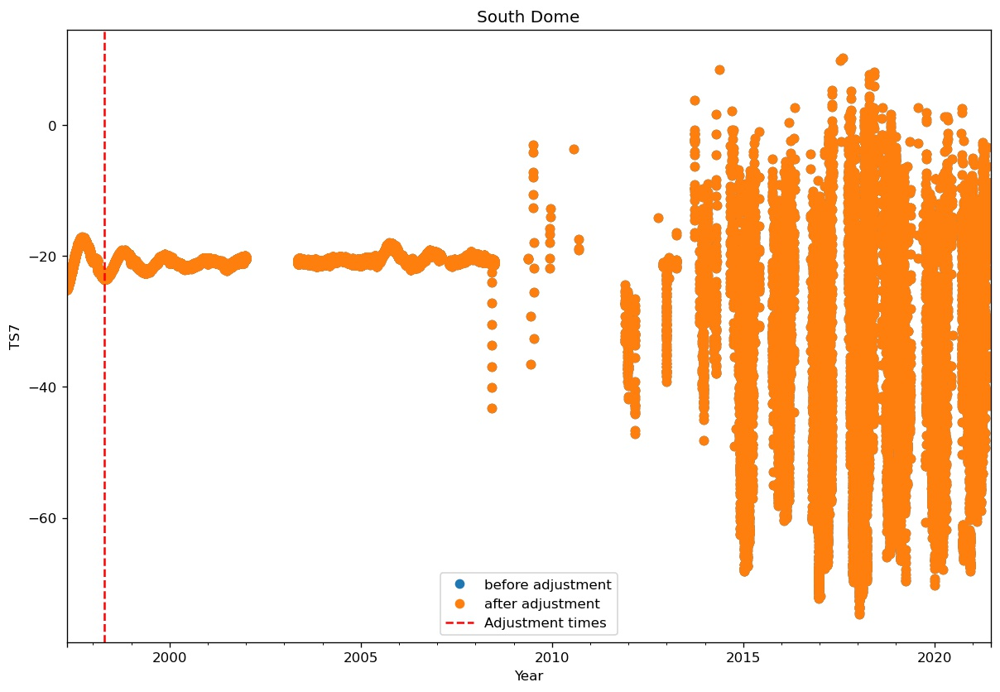
 
### Adjusting TS8
|start time|end time|operation|value|number of removed samples|
|-|-|-|-|-|
|1998-04-20 03:00:00+00:00|1999-04-23 03:00:00+00:00|time_shift|-3.0|4|
 
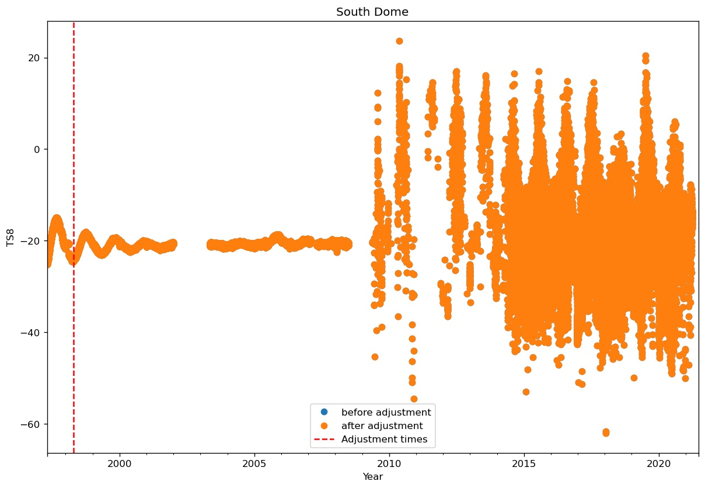
 
### Adjusting TS9
|start time|end time|operation|value|number of removed samples|
|-|-|-|-|-|
|1998-04-20 03:00:00+00:00|1999-04-23 03:00:00+00:00|time_shift|-3.0|4|
 
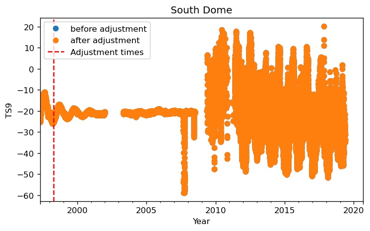
 
### Adjusting V
|start time|end time|operation|value|number of removed samples|
|-|-|-|-|-|
|1998-04-20 03:00:00+00:00|1999-04-23 03:00:00+00:00|time_shift|-3.0|0|
 
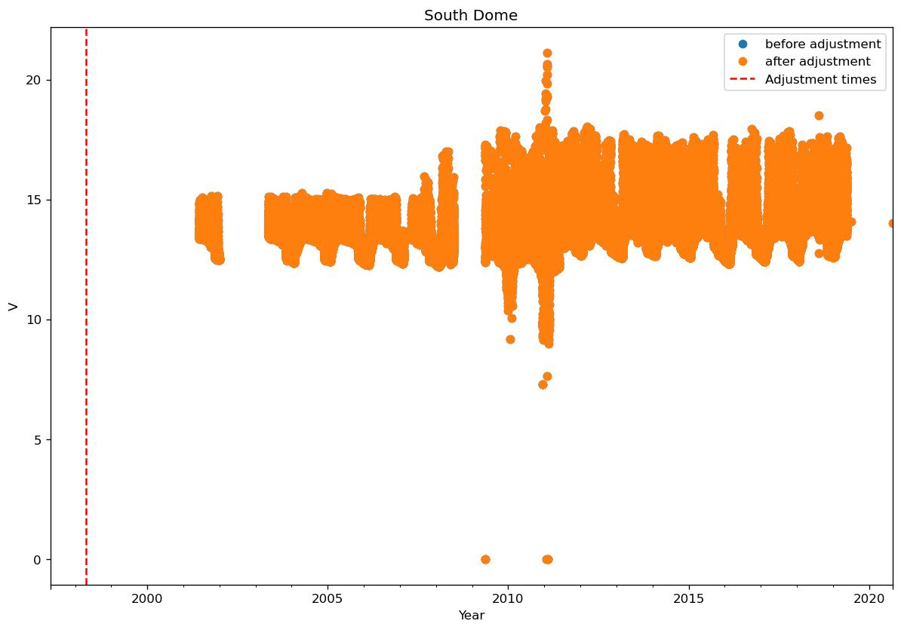
 
### Adjusting VW1
|start time|end time|operation|value|number of removed samples|
|-|-|-|-|-|
|1998-04-20 03:00:00+00:00|1999-04-23 03:00:00+00:00|time_shift|-3.0|4|
 
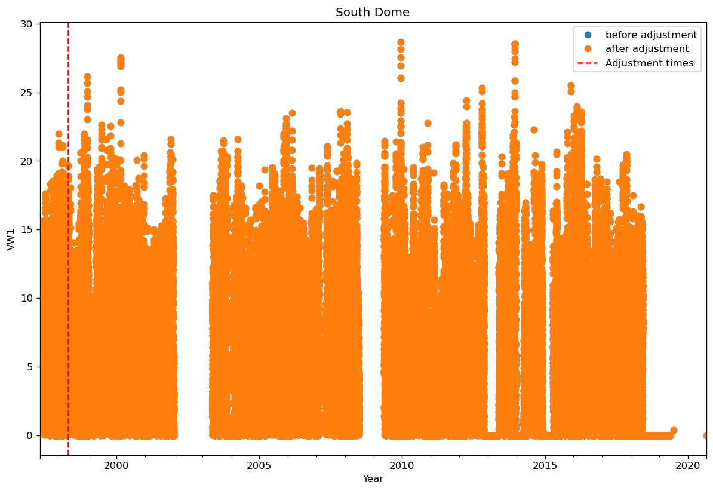
 
### Adjusting VW2
|start time|end time|operation|value|number of removed samples|
|-|-|-|-|-|
|1998-04-20 03:00:00+00:00|1999-04-23 03:00:00+00:00|time_shift|-3.0|4|
 
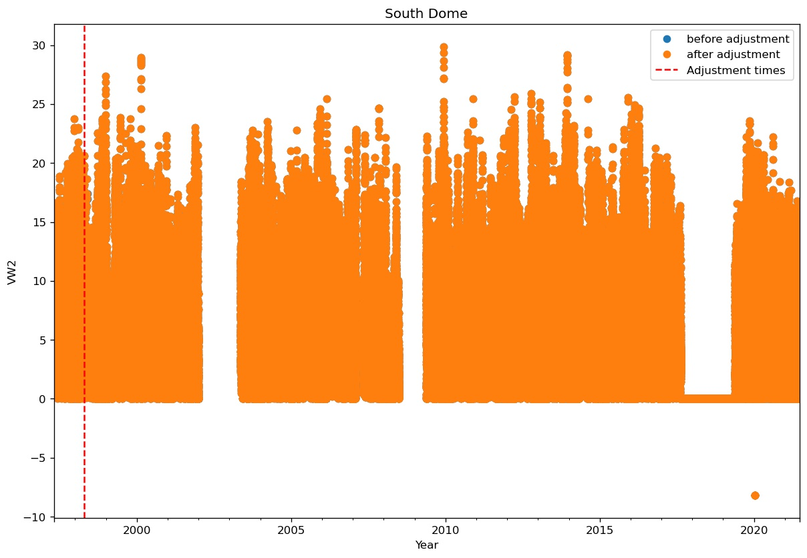
 
# 12 NASA-E
## Manual flagging of data at NASA-E
Flagging data:
|start time|end time|variable|
|-|-|-|
|2015-09-29 00:00:00+00:00|2019-03-01 00:00:00+00:00|HW2|
|2016-08-29 00:00:00+00:00|2019-01-01 00:00:00+00:00|HW2|
 

 
|start time|end time|variable|
|-|-|-|
|2012-02-01 00:00:00+00:00|2013-06-01 00:00:00+00:00|RH1|
 

 
|start time|end time|variable|
|-|-|-|
|2012-02-01 00:00:00+00:00|2013-06-01 00:00:00+00:00|TA3|
|1998-04-12 00:00:00+00:00|1998-11-15 00:00:00+00:00|TA3|
 

 
|start time|end time|variable|
|-|-|-|
|2001-06-07 00:00:00+00:00|2001-06-08 00:00:00+00:00|TA4|
 

 
## Adjusting data at NASA-E
### Adjusting HW1
|start time|end time|operation|value|number of removed samples|
|-|-|-|-|-|
|2009-05-15T00:00:00+00:00|2022-06-09T23:00:00+00:00|air_temp_sonic_correction|0.0|0|
|2009-05-15T00:00:00+00:00|2022-06-09T23:00:00+00:00|biweekly_upper_range_filter|0.2|10206|
|2009-05-15T00:00:00+00:00|2022-06-09T23:00:00+00:00|hampel_filter|2.0|5622|
|2011-05-15T00:00:00+00:00|2019-05-15T00:00:00+00:00|min_filter|1.5|1470|
 

 
### Adjusting HW2
|start time|end time|operation|value|number of removed samples|
|-|-|-|-|-|
|2009-05-15T00:00:00+00:00|2022-06-09T23:00:00+00:00|air_temp_sonic_correction|0.0|0|
|2009-05-15T00:00:00+00:00|2022-06-09T23:00:00+00:00|biweekly_upper_range_filter|0.2|47161|
|2009-05-15T00:00:00+00:00|2022-06-09T23:00:00+00:00|hampel_filter|2.0|3774|
 

 
## Adjusting data at NASA-E
### Adjusting HS1
|start time|end time|operation|value|number of removed samples|
|-|-|-|-|-|
|2001-06-09T00:00:00+00:00|2022-06-09T23:00:00+00:00|add|2.5|0|
|2006-05-09T00:00:00+00:00|2022-06-09T23:00:00+00:00|add|2.4|0|
|2009-05-09T00:00:00+00:00|2022-06-09T23:00:00+00:00|add|-1.0|0|
|2011-06-09T00:00:00+00:00|2022-06-09T23:00:00+00:00|add|1.5|0|
|2015-06-09T00:00:00+00:00|2022-06-09T23:00:00+00:00|add|2.5|0|
 

 
### Adjusting HS2
|start time|end time|operation|value|number of removed samples|
|-|-|-|-|-|
|2001-06-09T00:00:00+00:00|2022-06-09T23:00:00+00:00|add|2.5|0|
|2006-05-09T00:00:00+00:00|2022-06-09T23:00:00+00:00|add|2.4|0|
|2009-05-09T00:00:00+00:00|2022-06-09T23:00:00+00:00|add|-1.0|0|
|2011-06-09T00:00:00+00:00|2022-06-09T23:00:00+00:00|add|-1.0|0|
|2015-06-09T00:00:00+00:00|2022-06-09T23:00:00+00:00|add|2.0|0|
 

 
### Adjusting RH1
|start time|end time|operation|value|number of removed samples|
|-|-|-|-|-|
|1996-01-01T00:00:00+00:00|2011-06-01T00:00:00+00:00|ice_to_water|0.0|0|
 

 
### Adjusting RH2
|start time|end time|operation|value|number of removed samples|
|-|-|-|-|-|
|1996-01-01T00:00:00+00:00|2011-06-01T00:00:00+00:00|ice_to_water|0.0|0|
 

 
# 13 CP2
Warning: No file for station 13 CP2
# 14 NGRIP
Warning: No file for station 14 NGRIP
# 15 NASA-SE
## Manual flagging of data at NASA-SE
Flagging data:
|start time|end time|variable|
|-|-|-|
|2009-01-01 00:00:00+00:00|2011-05-19 00:00:00+00:00|HW1|
|2015-07-01 00:00:00+00:00|2016-05-19 00:00:00+00:00|HW1|
 

 
|start time|end time|variable|
|-|-|-|
|2011-01-01 00:00:00+00:00|2011-05-26 00:00:00+00:00|HW2|
|2016-01-15 00:00:00+00:00|2016-05-19 00:00:00+00:00|HW2|
|2017-08-18 00:00:00+00:00|2018-05-26 00:00:00+00:00|HW2|
 

 
|start time|end time|variable|
|-|-|-|
|2012-01-08 00:00:00+00:00|2021-06-01 00:00:00+00:00|TA1|
 

 
|start time|end time|variable|
|-|-|-|
|2012-01-08 00:00:00+00:00|2021-06-01 00:00:00+00:00|TA2|
 

 
|start time|end time|variable|
|-|-|-|
|2010-06-01 00:00:00+00:00|2019-09-26 09:00:00+00:00|TS1|
 
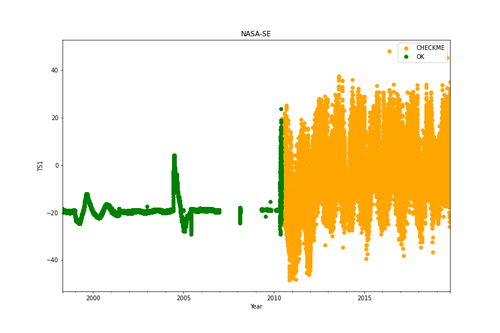
 
|start time|end time|variable|
|-|-|-|
|2010-06-01 00:00:00+00:00|2019-09-26 09:00:00+00:00|TS10|
 
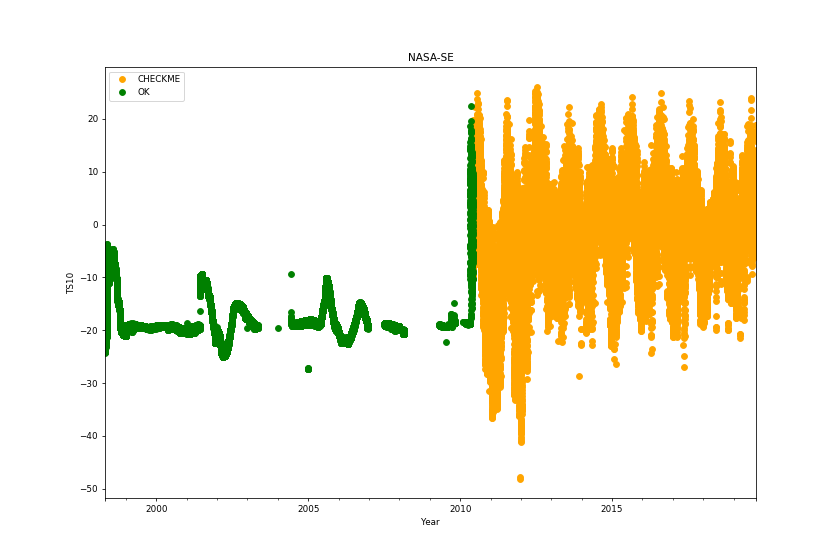
 
|start time|end time|variable|
|-|-|-|
|2010-06-01 00:00:00+00:00|2019-09-26 09:00:00+00:00|TS2|
 
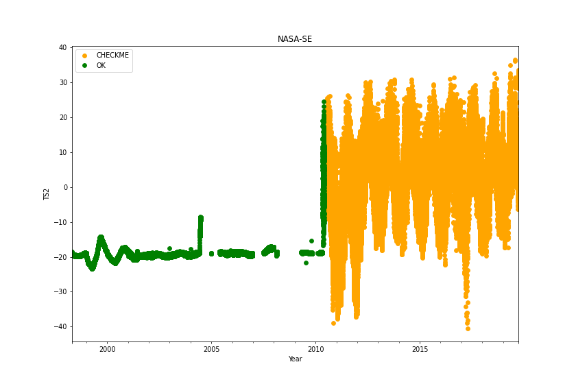
 
|start time|end time|variable|
|-|-|-|
|2010-06-01 00:00:00+00:00|2019-09-26 09:00:00+00:00|TS3|
 
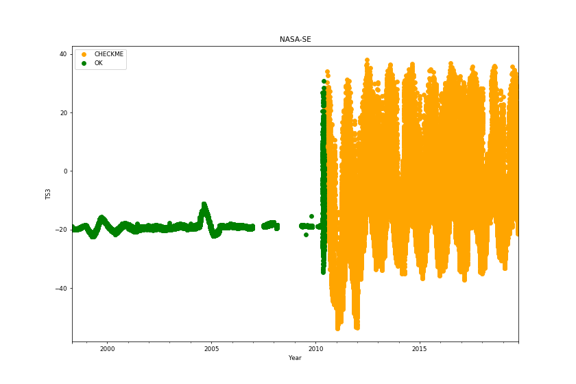
 
|start time|end time|variable|
|-|-|-|
|2010-06-01 00:00:00+00:00|2019-09-26 09:00:00+00:00|TS4|
 
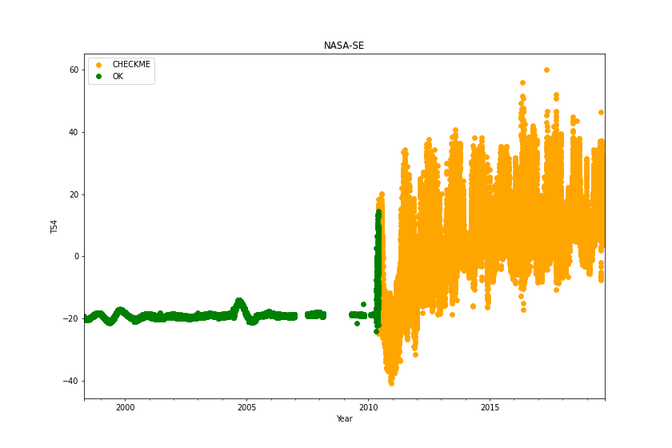
 
|start time|end time|variable|
|-|-|-|
|2010-06-01 00:00:00+00:00|2019-09-26 09:00:00+00:00|TS5|
 
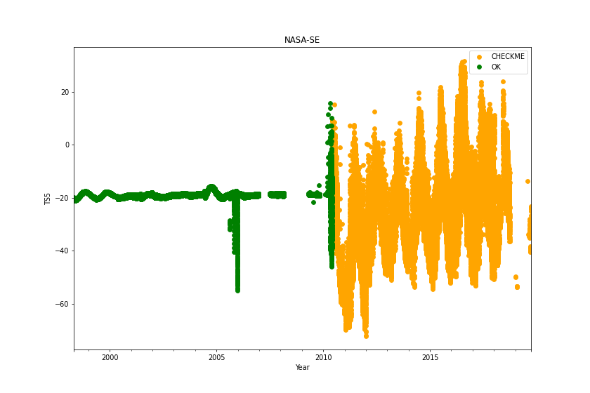
 
|start time|end time|variable|
|-|-|-|
|2010-06-01 00:00:00+00:00|2019-09-26 09:00:00+00:00|TS6|
 
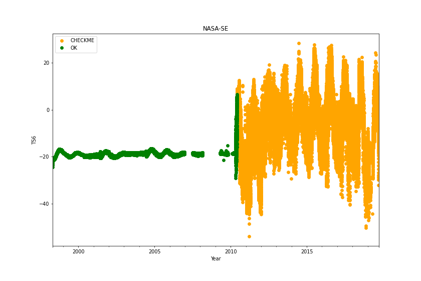
 
|start time|end time|variable|
|-|-|-|
|2010-06-01 00:00:00+00:00|2019-09-26 09:00:00+00:00|TS7|
 
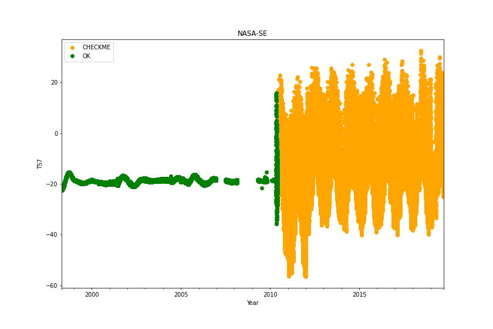
 
|start time|end time|variable|
|-|-|-|
|2010-06-01 00:00:00+00:00|2019-09-26 09:00:00+00:00|TS8|
 
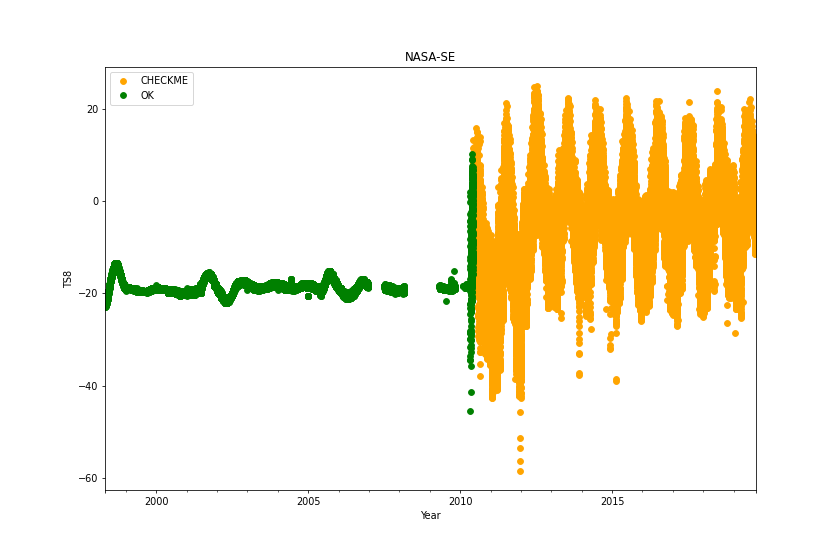
 
|start time|end time|variable|
|-|-|-|
|2010-06-01 00:00:00+00:00|2019-09-26 09:00:00+00:00|TS9|
 
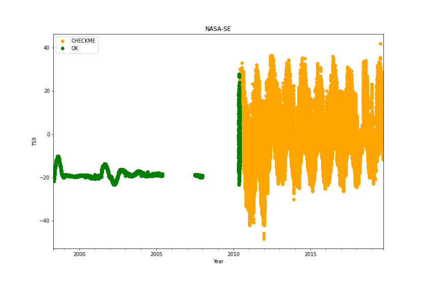
 
## Adjusting data at NASA-SE
### Adjusting HW1
|start time|end time|operation|value|number of removed samples|
|-|-|-|-|-|
|2002-05-18T00:00:00+00:00|2005-05-27T09:00:00+00:00|add|3.0|0|
|2003-05-10T09:00:00+00:00|2005-05-27T09:00:00+00:00|add|8.26|0|
|2009-05-15T00:00:00+00:00|2019-09-26T09:00:00+00:00|air_temp_sonic_correction|0.0|0|
|2009-05-15T00:00:00+00:00|2019-09-26T09:00:00+00:00|biweekly_upper_range_filter|0.5|20074|
|2009-05-15T00:00:00+00:00|2019-09-26T09:00:00+00:00|hampel_filter|2.0|4380|
 

 
### Adjusting HW2
|start time|end time|operation|value|number of removed samples|
|-|-|-|-|-|
|2002-05-18T00:00:00+00:00|2005-05-27T09:00:00+00:00|add|3.0|0|
|2003-05-10T09:00:00+00:00|2005-05-27T09:00:00+00:00|add|9.56|0|
|2009-05-15T00:00:00+00:00|2019-09-26T09:00:00+00:00|air_temp_sonic_correction|0.0|0|
|2009-05-15T00:00:00+00:00|2019-09-26T09:00:00+00:00|biweekly_upper_range_filter|0.5|15533|
|2009-05-15T00:00:00+00:00|2019-09-26T09:00:00+00:00|hampel_filter|2.0|2943|
 

 
## Adjusting data at NASA-SE
### Adjusting HS1
|start time|end time|operation|value|number of removed samples|
|-|-|-|-|-|
|2000-05-17T00:00:00+00:00|2019-09-26T09:00:00+00:00|add|2.4|0|
|2002-05-17T00:00:00+00:00|2019-09-26T09:00:00+00:00|add|2.5|0|
|2003-05-10T00:00:00+00:00|2019-09-26T09:00:00+00:00|add|2.0|0|
|2005-05-27T00:00:00+00:00|2019-09-26T09:00:00+00:00|add|4.2|0|
|2007-06-09T00:00:00+00:00|2019-09-26T09:00:00+00:00|add|3.0|0|
|2008-06-09T00:00:00+00:00|2019-09-26T09:00:00+00:00|add|2.0|0|
|2012-06-09T00:00:00+00:00|2019-09-26T09:00:00+00:00|add|2.0|0|
|2013-06-09T00:00:00+00:00|2019-09-26T09:00:00+00:00|add|2.0|0|
|2016-06-09T00:00:00+00:00|2019-09-26T09:00:00+00:00|add|2.5|0|
|2018-06-09T00:00:00+00:00|2019-09-26T09:00:00+00:00|add|2.0|0|
 

 
### Adjusting HS2
|start time|end time|operation|value|number of removed samples|
|-|-|-|-|-|
|2000-05-17T00:00:00+00:00|2019-09-26T09:00:00+00:00|add|2.4|0|
|2002-05-17T00:00:00+00:00|2019-09-26T09:00:00+00:00|add|2.5|0|
|2003-05-10T00:00:00+00:00|2019-09-26T09:00:00+00:00|add|2.0|0|
|2005-05-27T00:00:00+00:00|2019-09-26T09:00:00+00:00|add|4.2|0|
|2007-06-09T00:00:00+00:00|2019-09-26T09:00:00+00:00|add|3.0|0|
|2008-06-09T00:00:00+00:00|2019-09-26T09:00:00+00:00|add|2.0|0|
|2012-06-09T00:00:00+00:00|2019-09-26T09:00:00+00:00|add|2.0|0|
|2013-06-09T00:00:00+00:00|2019-09-26T09:00:00+00:00|add|2.0|0|
|2016-06-09T00:00:00+00:00|2019-09-26T09:00:00+00:00|add|2.5|0|
|2018-06-09T00:00:00+00:00|2019-09-26T09:00:00+00:00|add|2.0|0|
 

 
### Adjusting RH1
|start time|end time|operation|value|number of removed samples|
|-|-|-|-|-|
|1996-01-01T00:00:00+00:00|2009-01-01T00:00:00+00:00|ice_to_water|0.0|0|
 

 
### Adjusting RH2
|start time|end time|operation|value|number of removed samples|
|-|-|-|-|-|
|1996-01-01T00:00:00+00:00|2009-01-01T00:00:00+00:00|ice_to_water|0.0|0|
 

 
# 16 KAR
Warning: No file for station 16 KAR
# 17 JAR 2
Warning: No file for station 17 JAR 2
# 18 KULU
Warning: No file for station 18 KULU
# 22 Petermann ELA
## Manual flagging of data at Petermann ELA
Flagging data:
|start time|end time|variable|
|-|-|-|
|2003-01-01 00:00:00+00:00|2011-05-23 00:00:00+00:00|RH1|
 

 
|start time|end time|variable|
|-|-|-|
|2003-01-01 00:00:00+00:00|2011-05-01 00:00:00+00:00|RH2|
 

 
|start time|end time|variable|
|-|-|-|
|2011-01-01 00:00:00+00:00|2015-01-01 00:00:00+00:00|TA1|
 

 
|start time|end time|variable|
|-|-|-|
|2011-01-01 00:00:00+00:00|2015-01-01 00:00:00+00:00|TA2|
 

 
## Adjusting data at Petermann ELA
### Adjusting HW1
|start time|end time|operation|value|number of removed samples|
|-|-|-|-|-|
|2009-05-15T00:00:00+00:00|2022-04-12T18:00:00+00:00|air_temp_sonic_correction|0.0|0|
|2016-01-01T00:00:00+00:00|2022-04-12T18:00:00+00:00|biweekly_upper_range_filter|0.5|196|
|2016-01-01T00:00:00+00:00|2022-04-12T18:00:00+00:00|hampel_filter|2.0|1515|
 

 
### Adjusting HW2
|start time|end time|operation|value|number of removed samples|
|-|-|-|-|-|
|2009-05-15T00:00:00+00:00|2022-04-12T18:00:00+00:00|air_temp_sonic_correction|0.0|0|
|2015-07-01T00:00:00+00:00|2016-01-01T00:00:00+00:00|min_filter|1.4|3|
|2016-01-01T00:00:00+00:00|2022-04-12T18:00:00+00:00|biweekly_upper_range_filter|0.5|7096|
|2016-01-01T00:00:00+00:00|2019-01-01T00:00:00+00:00|max_filter|3.12|156|
|2016-01-01T00:00:00+00:00|2019-01-01T00:00:00+00:00|min_filter|2.4|927|
|2016-01-01T00:00:00+00:00|2022-04-12T18:00:00+00:00|hampel_filter|2.0|22|
 

 
## Adjusting data at Petermann ELA
### Adjusting TA2
|start time|end time|operation|value|number of removed samples|
|-|-|-|-|-|
|2003-05-23T07:00:00+00:00|2022-04-12T18:00:00+00:00|max_filter|11.0|32|
 

 
### Adjusting TA3
|start time|end time|operation|value|number of removed samples|
|-|-|-|-|-|
|2003-05-23T07:00:00+00:00|2022-04-12T18:00:00+00:00|max_filter|11.0|33|
 

 
### Adjusting TA4
|start time|end time|operation|value|number of removed samples|
|-|-|-|-|-|
|2003-05-23T07:00:00+00:00|2022-04-12T18:00:00+00:00|max_filter|11.0|25|
 

 
# 23 NEEM
## Manual flagging of data at NEEM
Flagging data:
|start time|end time|variable|
|-|-|-|
|2010-07-15 00:00:00+00:00|2010-12-01 00:00:00+00:00|HW1|
 

 
|start time|end time|variable|
|-|-|-|
|2010-07-15 00:00:00+00:00|2011-09-24 00:00:00+00:00|HW2|
|2013-02-05 00:00:00+00:00|2013-03-17 00:00:00+00:00|HW2|
|2017-12-26 00:00:00+00:00|2018-04-01 00:00:00+00:00|HW2|
|2019-01-01 00:00:00+00:00|2019-04-10 00:00:00+00:00|HW2|
 

 
|start time|end time|variable|
|-|-|-|
|2009-01-01 00:00:00+00:00|2017-01-01 00:00:00+00:00|P|
 

 
|start time|end time|variable|
|-|-|-|
|2017-02-01 00:00:00+00:00|2018-05-01 00:00:00+00:00|RH2|
 

 
|start time|end time|variable|
|-|-|-|
|2017-02-01 00:00:00+00:00|2018-05-09 00:00:00+00:00|TA3|
 

 
|start time|end time|variable|
|-|-|-|
|2018-05-04 00:00:00+00:00|2018-05-24 00:00:00+00:00|TA4|
 

 
|start time|end time|variable|
|-|-|-|
|2007-06-01 00:00:00+00:00|2022-06-09 23:00:00+00:00|TS1|
 
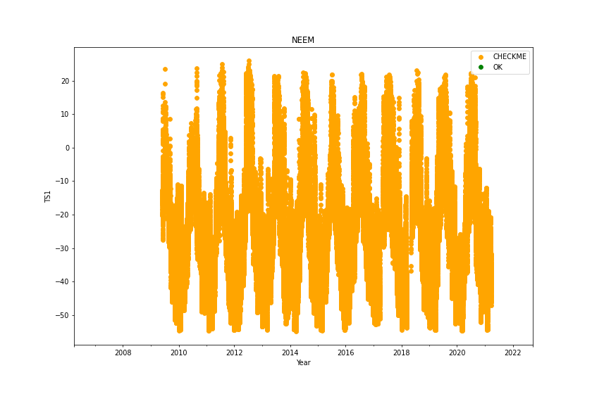
 
|start time|end time|variable|
|-|-|-|
|2007-06-01 00:00:00+00:00|2022-06-09 23:00:00+00:00|TS10|
 
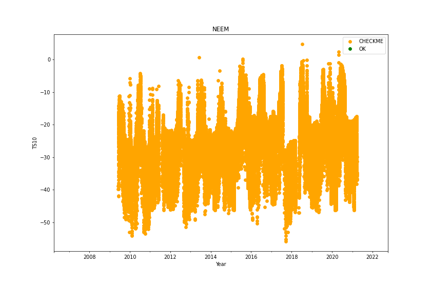
 
|start time|end time|variable|
|-|-|-|
|2007-06-01 00:00:00+00:00|2022-06-09 23:00:00+00:00|TS2|
 
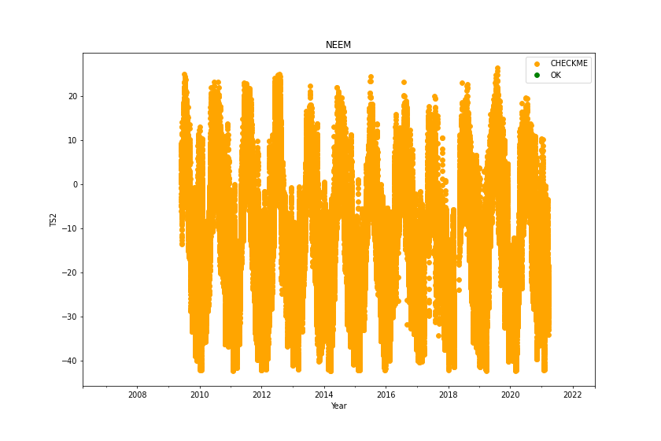
 
|start time|end time|variable|
|-|-|-|
|2007-06-01 00:00:00+00:00|2022-06-09 23:00:00+00:00|TS3|
 
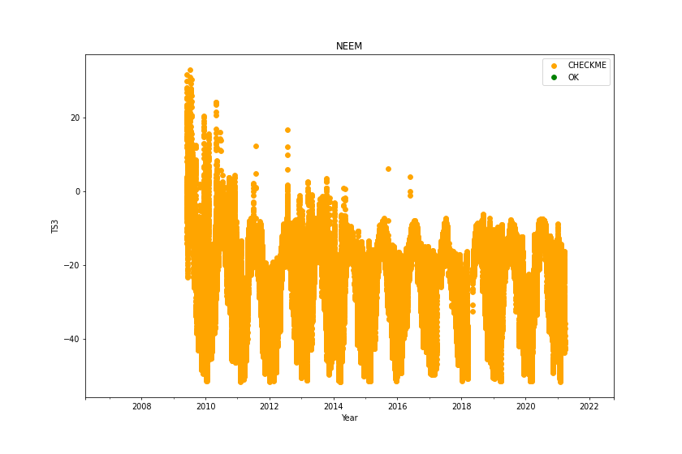
 
|start time|end time|variable|
|-|-|-|
|2007-06-01 00:00:00+00:00|2022-06-09 23:00:00+00:00|TS4|
 

 
|start time|end time|variable|
|-|-|-|
|2007-06-01 00:00:00+00:00|2022-06-09 23:00:00+00:00|TS5|
 
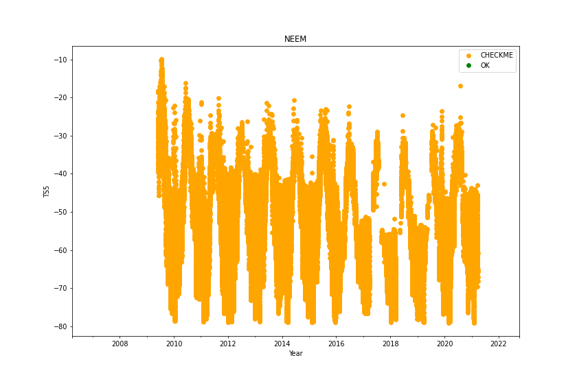
 
|start time|end time|variable|
|-|-|-|
|2007-06-01 00:00:00+00:00|2022-06-09 23:00:00+00:00|TS6|
 

 
|start time|end time|variable|
|-|-|-|
|2007-06-01 00:00:00+00:00|2022-06-09 23:00:00+00:00|TS7|
 
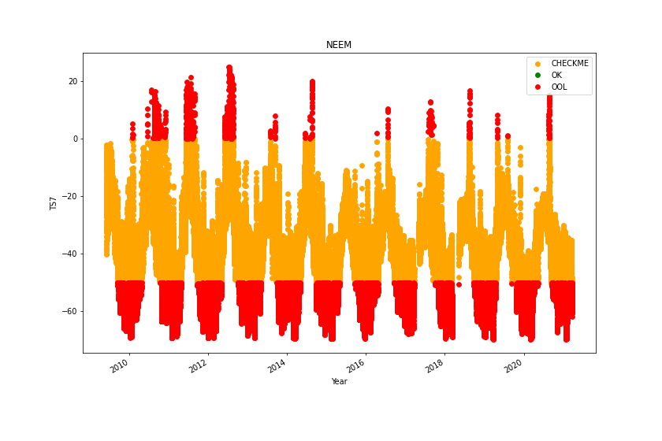
 
|start time|end time|variable|
|-|-|-|
|2007-06-01 00:00:00+00:00|2022-06-09 23:00:00+00:00|TS8|
 
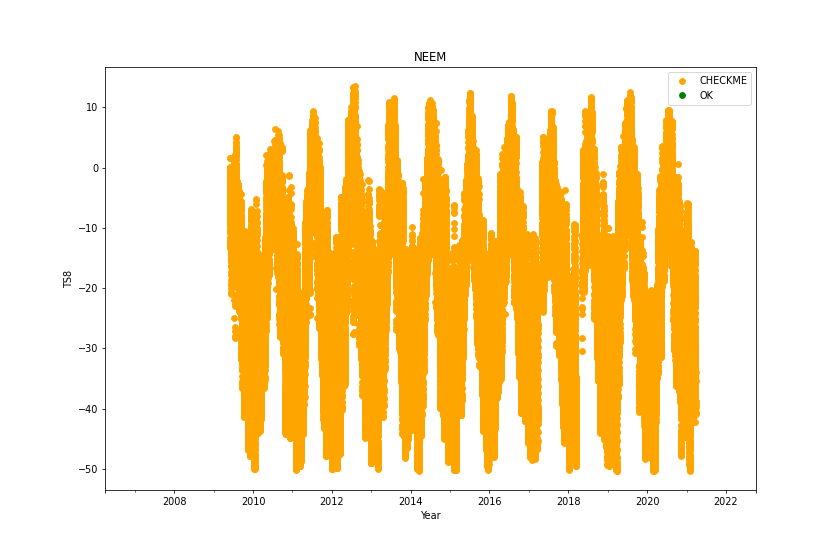
 
|start time|end time|variable|
|-|-|-|
|2007-06-01 00:00:00+00:00|2022-06-09 23:00:00+00:00|TS9|
 
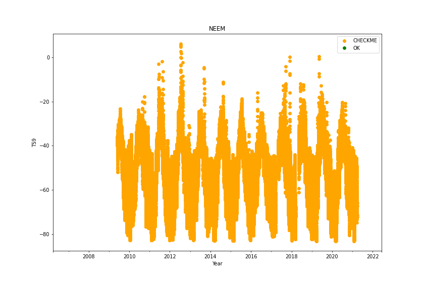
 
## Adjusting data at NEEM
### Adjusting HW1
|start time|end time|operation|value|number of removed samples|
|-|-|-|-|-|
|2009-05-15T00:00:00+00:00|2022-06-09T23:00:00+00:00|air_temp_sonic_correction|0.0|0|
|2009-05-15T00:00:00+00:00|2022-06-09T23:00:00+00:00|biweekly_upper_range_filter|0.5|14836|
|2009-05-15T00:00:00+00:00|2022-06-09T23:00:00+00:00|min_filter|0.1|15195|
|2009-05-15T00:00:00+00:00|2022-06-09T23:00:00+00:00|hampel_filter|2.0|6262|
 

 
### Adjusting HW2
|start time|end time|operation|value|number of removed samples|
|-|-|-|-|-|
|2009-05-15T00:00:00+00:00|2022-06-09T23:00:00+00:00|air_temp_sonic_correction|0.0|0|
|2009-05-15T00:00:00+00:00|2022-06-09T23:00:00+00:00|biweekly_upper_range_filter|0.5|22328|
|2009-05-15T00:00:00+00:00|2022-06-09T23:00:00+00:00|hampel_filter|2.0|7037|
 

 
## Adjusting data at NEEM
### Adjusting HS1
|start time|end time|operation|value|number of removed samples|
|-|-|-|-|-|
|2008-08-13T00:00:00+00:00|2022-06-09T23:00:00+00:00|add|1.8|0|
|2009-05-30T00:00:00+00:00|2022-06-09T23:00:00+00:00|add|0.5|0|
|2011-07-06T00:00:00+00:00|2022-06-09T23:00:00+00:00|add|3.0|0|
|2016-05-23T00:00:00+00:00|2022-06-09T23:00:00+00:00|add|2.5|0|
 

 
### Adjusting HS2
|start time|end time|operation|value|number of removed samples|
|-|-|-|-|-|
|2008-08-13T00:00:00+00:00|2022-06-09T23:00:00+00:00|add|1.8|0|
|2009-05-30T00:00:00+00:00|2022-06-09T23:00:00+00:00|add|-1.5|0|
|2011-07-06T00:00:00+00:00|2022-06-09T23:00:00+00:00|add|2.0|0|
|2016-05-23T00:00:00+00:00|2022-06-09T23:00:00+00:00|add|2.0|0|
 

 
### Adjusting RH1
|start time|end time|operation|value|number of removed samples|
|-|-|-|-|-|
|1996-01-01T00:00:00+00:00|2009-05-15T00:00:00+00:00|ice_to_water|0.0|0|
 

 
### Adjusting RH2
|start time|end time|operation|value|number of removed samples|
|-|-|-|-|-|
|1996-01-01T00:00:00+00:00|2009-05-15T00:00:00+00:00|ice_to_water|0.0|0|
 

 
# 24 E-GRIP
## Manual flagging of data at E-GRIP
Flagging data:
|start time|end time|variable|
|-|-|-|
|2016-01-01 00:00:00+00:00|2019-10-01 00:00:00+00:00|ISWR|
 

 
|start time|end time|variable|
|-|-|-|
|2016-01-01 00:00:00+00:00|2019-10-01 00:00:00+00:00|OSWR|
 

 
## Adjusting data at E-GRIP
### Adjusting HW1
|start time|end time|operation|value|number of removed samples|
|-|-|-|-|-|
|2014-01-01T00:00:00+00:00|2022-06-09T23:00:00+00:00|air_temp_sonic_correction|0.0|0|
|2014-01-01T00:00:00+00:00|2022-06-09T23:00:00+00:00|biweekly_upper_range_filter|0.4|4683|
|2014-01-01T00:00:00+00:00|2022-06-09T23:00:00+00:00|hampel_filter|2.0|3352|
 

 
### Adjusting HW2
|start time|end time|operation|value|number of removed samples|
|-|-|-|-|-|
|2014-01-01T00:00:00+00:00|2022-06-09T23:00:00+00:00|air_temp_sonic_correction|0.0|0|
|2014-01-01T00:00:00+00:00|2022-06-09T23:00:00+00:00|biweekly_upper_range_filter|0.4|3404|
|2014-01-01T00:00:00+00:00|2022-06-09T23:00:00+00:00|hampel_filter|2.0|3592|
 

 
## Adjusting data at E-GRIP
### Adjusting HS1
|start time|end time|operation|value|number of removed samples|
|-|-|-|-|-|
|2016-05-23T00:00:00+00:00|2022-06-09T23:00:00+00:00|add|2.0|0|
 

 
### Adjusting HS2
|start time|end time|operation|value|number of removed samples|
|-|-|-|-|-|
|2016-05-23T00:00:00+00:00|2022-06-09T23:00:00+00:00|add|2.0|0|
 

 
