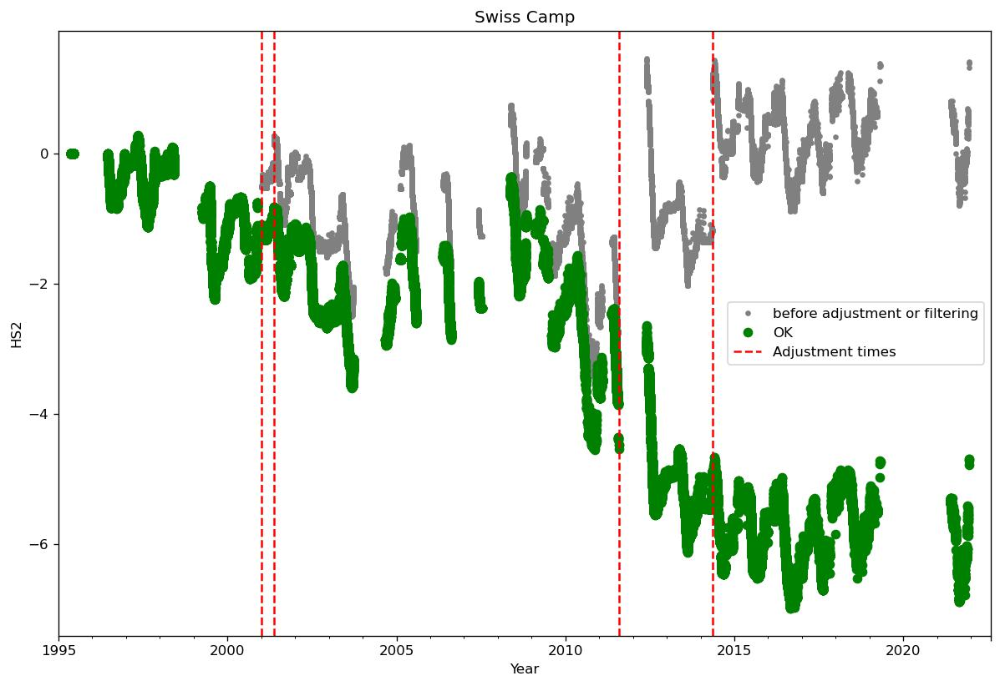

# 1 Swiss Camp
## Manual flagging of data at Swiss Camp
Flagging data:
|start time|end time|variable|
|-|-|-|
|2015-06-01 00:00:00+00:00|2016-05-01 00:00:00+00:00|RH1|
|2009-07-01 00:00:00+00:00|2009-07-01 00:00:00+00:00|ISWR|
|2009-07-01 00:00:00+00:00|2009-07-01 00:00:00+00:00|OSWR|
|2011-02-15 00:00:00+00:00|2011-05-10 00:00:00+00:00|OSWR|
|2011-08-01 00:00:00+00:00|2012-05-10 00:00:00+00:00|OSWR|
|2011-02-15 00:00:00+00:00|2011-05-10 00:00:00+00:00|ISWR|
|2015-06-01 00:00:00+00:00|2016-05-01 00:00:00+00:00|VW1|
Warning: HS1 not found
Warning: HS1 not found
Warning: HS2 not found
Warning: HS2 not found
Warning: HS1 not found
|1995-01-01 00:00:00+00:00|1996-06-23 00:00:00+00:00|HW1|
|1998-06-03 12:00:00+00:00|1999-04-06 00:00:00+00:00|HW1|
|2004-05-28 00:00:00+00:00|2004-05-29 00:00:00+00:00|HW1|
|2011-08-14 00:00:00+00:00|2012-05-31 21:00:00+00:00|HW1|
|2017-05-17 00:00:00+00:00|2018-04-28 00:00:00+00:00|HW1|
|2011-08-14 00:00:00+00:00|2012-05-24 00:00:00+00:00|HW2|
|2003-09-21 00:00:00+00:00|2004-05-01 00:00:00+00:00|TA1|
|2003-09-21 00:00:00+00:00|2004-05-01 00:00:00+00:00|TA2|
|2003-09-21 00:00:00+00:00|2004-05-01 00:00:00+00:00|TA3|
|2003-09-21 00:00:00+00:00|2004-05-01 00:00:00+00:00|TA4|
|2020-09-21 00:00:00+00:00|2022-08-03 19:00:00+00:00|TA4|
## Adjusting data at Swiss Camp
|start time|end time|variable|operation|value|number of removed samples|
|-|-|-|-|-|-|
|1996-01-01 00:00:00+00:00|1996-08-01 00:00:00+00:00|HW1|air_temp_sonic_anticorrection|0.0|0|
|2009-01-01 00:00:00+00:00|2011-07-15 00:00:00+00:00|HW1|min_filter|1.0|7677|
|2009-05-01 00:00:00+00:00|2022-08-03 19:00:00+00:00|HW1|add|-0.5|0|
|2009-05-15 00:00:00+00:00|2022-08-03 19:00:00+00:00|HW1|air_temp_sonic_correction|0.0|0|
|2009-05-15 00:00:00+00:00|2022-08-03 19:00:00+00:00|HW1|biweekly_upper_range_filter|0.5|5337|
|2009-05-15 00:00:00+00:00|2022-08-03 19:00:00+00:00|HW1|hampel_filter|2.0|706|
|1995-01-12 00:00:00+00:00|2000-01-01 00:00:00+00:00|HW2|max_filter|8.0|19148|
|1996-01-01 00:00:00+00:00|1996-08-01 00:00:00+00:00|HW2|air_temp_sonic_anticorrection|0.0|0|
|2009-01-01 00:00:00+00:00|2012-01-15 00:00:00+00:00|HW2|min_filter|1.0|2949|
|2009-05-01 00:00:00+00:00|2022-08-03 19:00:00+00:00|HW2|add|0.3|0|
|2009-05-15 00:00:00+00:00|2022-08-03 19:00:00+00:00|HW2|air_temp_sonic_correction|0.0|0|
|2009-05-15 00:00:00+00:00|2022-08-03 19:00:00+00:00|HW2|biweekly_upper_range_filter|0.5|12071|
|2009-05-15 00:00:00+00:00|2022-08-03 19:00:00+00:00|HW2|hampel_filter|2.0|3607|
|2018-03-12 00:00:00+00:00|2018-05-12 00:00:00+00:00|HW2|max_filter|0.77|430|
|2012-05-10 00:00:00+00:00|2022-08-03 19:00:00+00:00|ISWR|swap_with_OSWR|0.0|0|
|2009-05-07 00:00:00+00:00|2022-08-03 19:00:00+00:00|OSWR|multiply|0.934|0|
|2019-11-15 00:00:00+00:00|2022-08-03 19:00:00+00:00|P|min_filter|856.0|5228|
|2005-05-09 00:00:00+00:00|2022-08-03 19:00:00+00:00|RH1|swap_with_RH2|0.0|0|
|1996-01-01 00:00:00+00:00|2011-01-01 00:00:00+00:00|RH1|ice_to_water|0.0|0|
|1996-01-01 00:00:00+00:00|2011-01-01 00:00:00+00:00|RH2|ice_to_water|0.0|0|
|start time|end time|variable|operation|value|number of removed samples|
|-|-|-|-|-|-|
|1999-01-01 00:00:00+00:00|2022-08-03 19:00:00+00:00|HS1|add|-0.75|0|
|2000-12-31 08:00:00+00:00|2022-08-03 19:00:00+00:00|HS1|add|-0.7|0|
|2001-05-17 17:00:00+00:00|2022-08-03 19:00:00+00:00|HS1|add|-0.3|0|
|2002-01-25 19:30:00+00:00|2022-08-03 19:00:00+00:00|HS1|add|1.5|0|
|2003-01-24 01:00:00+00:00|2022-08-03 19:00:00+00:00|HS1|add|-0.6|0|
|2003-04-26 16:00:00+00:00|2022-08-03 19:00:00+00:00|HS1|add|0.4|0|
|2004-01-01 00:00:00+00:00|2022-08-03 19:00:00+00:00|HS1|add|-0.5|0|
|2011-08-01 00:00:00+00:00|2022-08-03 19:00:00+00:00|HS1|add|-3.0|0|
|2014-05-08 00:00:00+00:00|2022-08-03 19:00:00+00:00|HS1|add|-2.0|0|
 

 
|start time|end time|variable|operation|value|number of removed samples|
|-|-|-|-|-|-|
|2000-12-31 08:00:00+00:00|2022-08-03 19:00:00+00:00|HS2|add|-0.8|0|
|2001-05-17 17:00:00+00:00|2022-08-03 19:00:00+00:00|HS2|add|-0.3|0|
|2011-08-01 00:00:00+00:00|2022-08-03 19:00:00+00:00|HS2|add|-3.0|0|
|2014-05-08 00:00:00+00:00|2022-08-03 19:00:00+00:00|HS2|add|-2.0|0|
 

 
