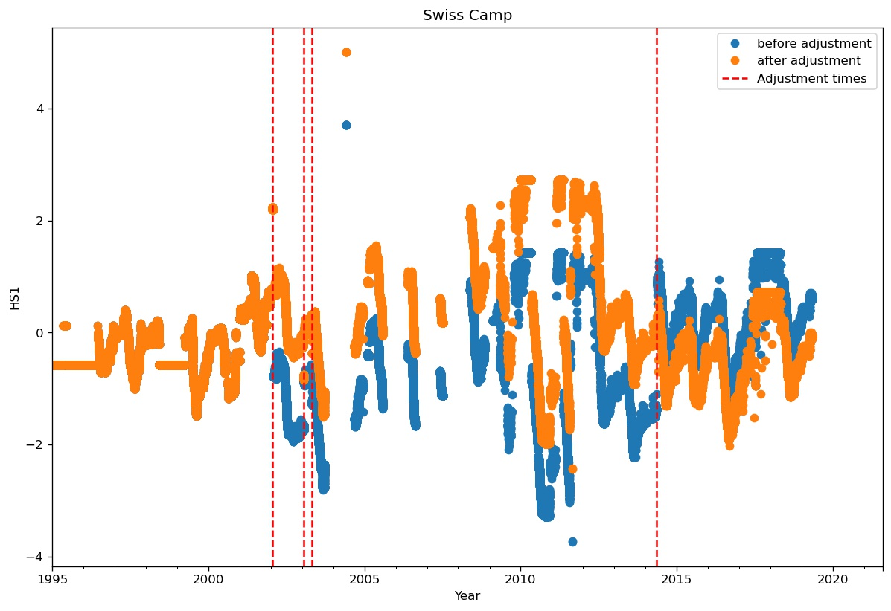
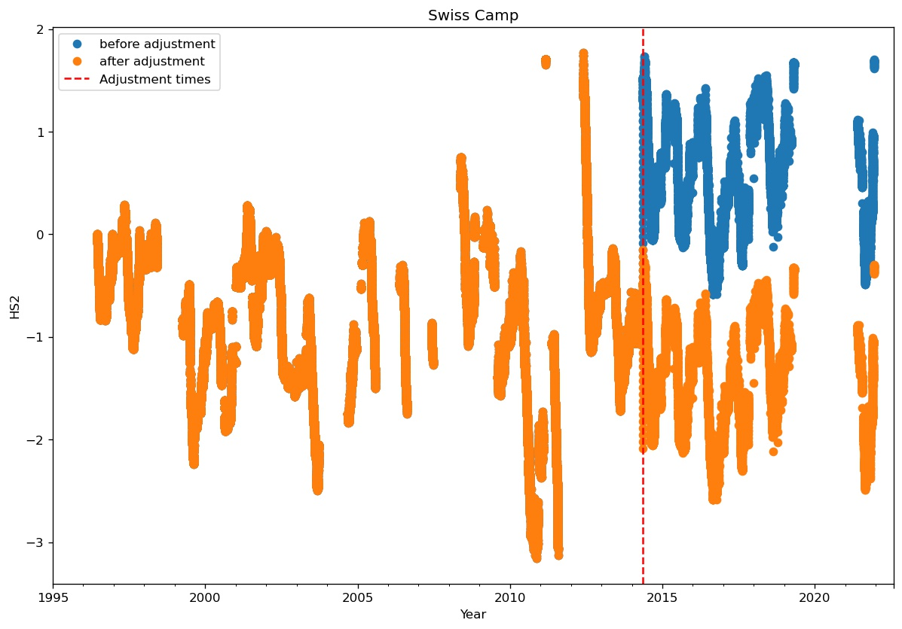
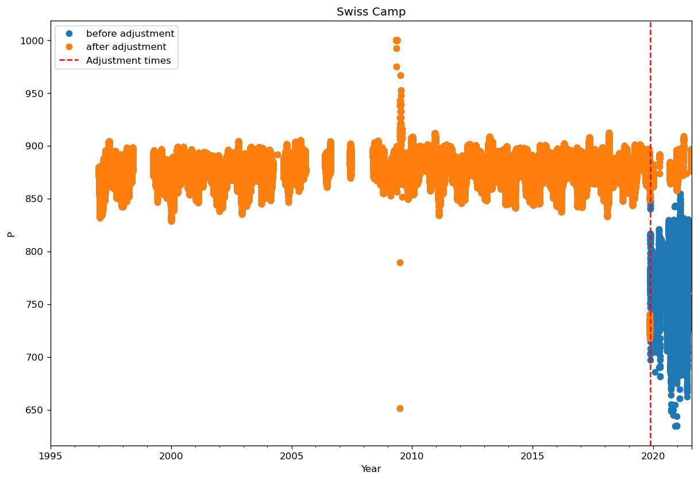
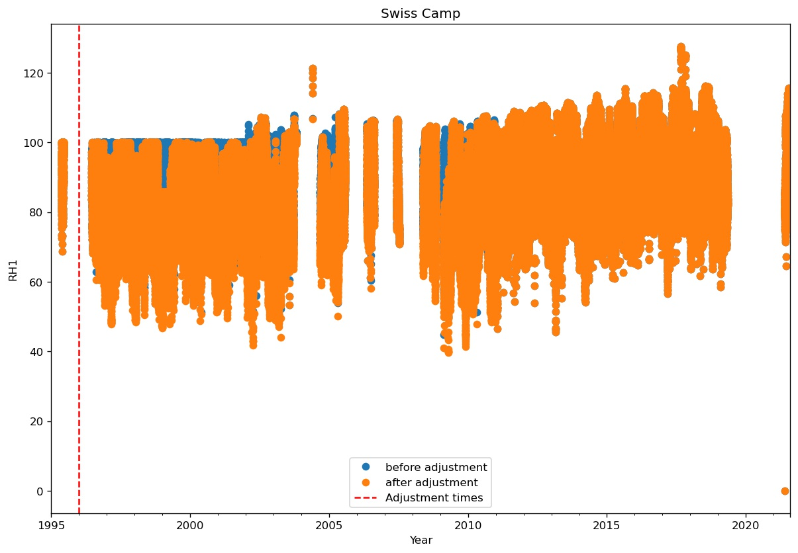
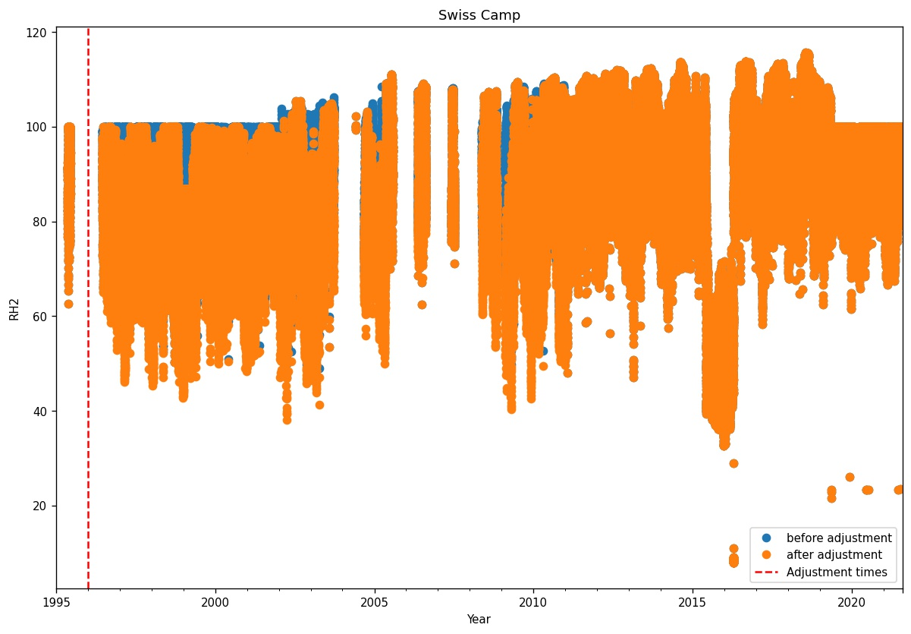

* [1 Swiss Camp](#s1)
  * [Manual flagging of data at Swiss Camp](#s1-1)
  * [Adjusting data at Swiss Camp](#s1-2)
      * [Adjusting HW1](#s1-2-1)
      * [Adjusting HW2](#s1-2-2)
  * [Adjusting data at Swiss Camp](#s1-3)
      * [Adjusting HS1](#s1-3-1)
      * [Adjusting HS2](#s1-3-2)
      * [Adjusting P](#s1-3-3)
      * [Adjusting RH1](#s1-3-4)
      * [Adjusting RH2](#s1-3-5)
# <a id='s1' />1 Swiss Camp
## <a id='s1-1' />Manual flagging of data at Swiss Camp
Flagging data:
Warning: HS1 not found
Warning: HS2 not found
|start time|end time|variable|
|-|-|-|
|1995-01-01 00:00:00+00:00|1996-06-23 00:00:00+00:00|HW1|
|1998-06-04 00:00:00+00:00|1999-04-02 00:00:00+00:00|HW1|
 

 
|start time|end time|variable|
|-|-|-|
|2011-08-14 00:00:00+00:00|2012-05-24 00:00:00+00:00|HW2|
 

 
|start time|end time|variable|
|-|-|-|
|2009-07-01 00:00:00+00:00|2009-07-01 00:00:00+00:00|ISWR|
|2011-02-15 00:00:00+00:00|2011-05-10 00:00:00+00:00|ISWR|
 

 
|start time|end time|variable|
|-|-|-|
|2009-07-01 00:00:00+00:00|2009-07-01 00:00:00+00:00|OSWR|
|2011-02-15 00:00:00+00:00|2011-05-10 00:00:00+00:00|OSWR|
|2011-08-01 00:00:00+00:00|2012-05-10 00:00:00+00:00|OSWR|
 

 
|start time|end time|variable|
|-|-|-|
|2015-06-01 00:00:00+00:00|2016-05-01 00:00:00+00:00|RH2|
 

 
|start time|end time|variable|
|-|-|-|
|2015-06-01 00:00:00+00:00|2016-05-01 00:00:00+00:00|VW1|
 

 
## <a id='s1-2' />Adjusting data at Swiss Camp
### <a id='s1-2-1' />Adjusting HW1
|start time|end time|operation|value|number of removed samples|
|-|-|-|-|-|
|2009-05-15T00:00:00+00:00|2021-08-05T14:00:00+00:00|air_temp_sonic_correction|0.0|0|
|2009-05-15T00:00:00+00:00|2021-08-05T14:00:00+00:00|biweekly_upper_range_filter|0.5|9242|
|2009-05-15T00:00:00+00:00|2021-08-05T14:00:00+00:00|hampel_filter|2.0|732|
 

 
### <a id='s1-2-2' />Adjusting HW2
|start time|end time|operation|value|number of removed samples|
|-|-|-|-|-|
|1995-01-12T00:00:00+00:00|2000-01-01T00:00:00+00:00|max_filter|8.0|19148|
|2009-05-15T00:00:00+00:00|2021-08-05T14:00:00+00:00|air_temp_sonic_correction|0.0|0|
|2009-05-15T00:00:00+00:00|2021-08-05T14:00:00+00:00|biweekly_upper_range_filter|0.5|10880|
|2009-05-15T00:00:00+00:00|2021-08-05T14:00:00+00:00|hampel_filter|2.0|3274|
|2018-03-12T00:00:00+00:00|2018-05-12T00:00:00+00:00|max_filter|0.77|13|
 

 
## <a id='s1-3' />Adjusting data at Swiss Camp
### <a id='s1-3-1' />Adjusting HS1
|start time|end time|operation|value|number of removed samples|
|-|-|-|-|-|
|2002-01-19T00:00:00+00:00|2021-08-05T14:00:00+00:00|add|1.5|0|
|2003-01-19T00:00:00+00:00|2021-08-05T14:00:00+00:00|add|-0.6|0|
|2003-04-27T00:00:00+00:00|2021-08-05T14:00:00+00:00|add|0.4|0|
|2014-05-08T00:00:00+00:00|2021-08-05T14:00:00+00:00|add|-2.0|0|
 

 
### <a id='s1-3-2' />Adjusting HS2
|start time|end time|operation|value|number of removed samples|
|-|-|-|-|-|
|2014-05-08T00:00:00+00:00|2021-08-05T14:00:00+00:00|add|-2.0|0|
 

 
### <a id='s1-3-3' />Adjusting P
|start time|end time|operation|value|number of removed samples|
|-|-|-|-|-|
|2019-11-15T00:00:00+00:00|2021-08-05T14:00:00+00:00|min_filter|856.0|0|
 

 
### <a id='s1-3-4' />Adjusting RH1
|start time|end time|operation|value|number of removed samples|
|-|-|-|-|-|
|1996-01-01T00:00:00+00:00|2011-01-01T00:00:00+00:00|ice_to_water|0.0|0|
 

 
### <a id='s1-3-5' />Adjusting RH2
|start time|end time|operation|value|number of removed samples|
|-|-|-|-|-|
|1996-01-01T00:00:00+00:00|2011-01-01T00:00:00+00:00|ice_to_water|0.0|0|
 

 
