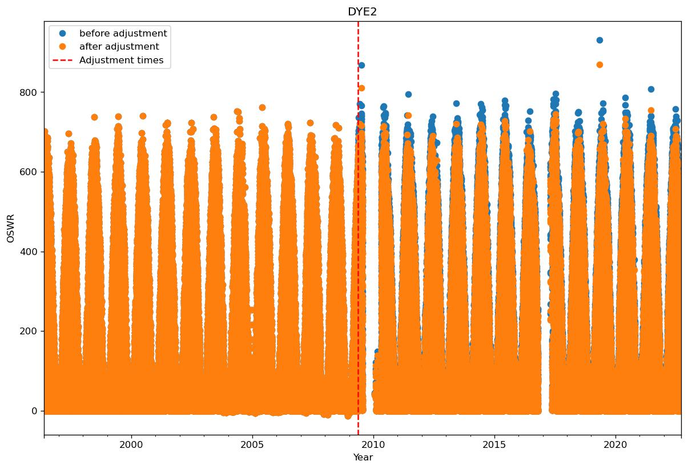
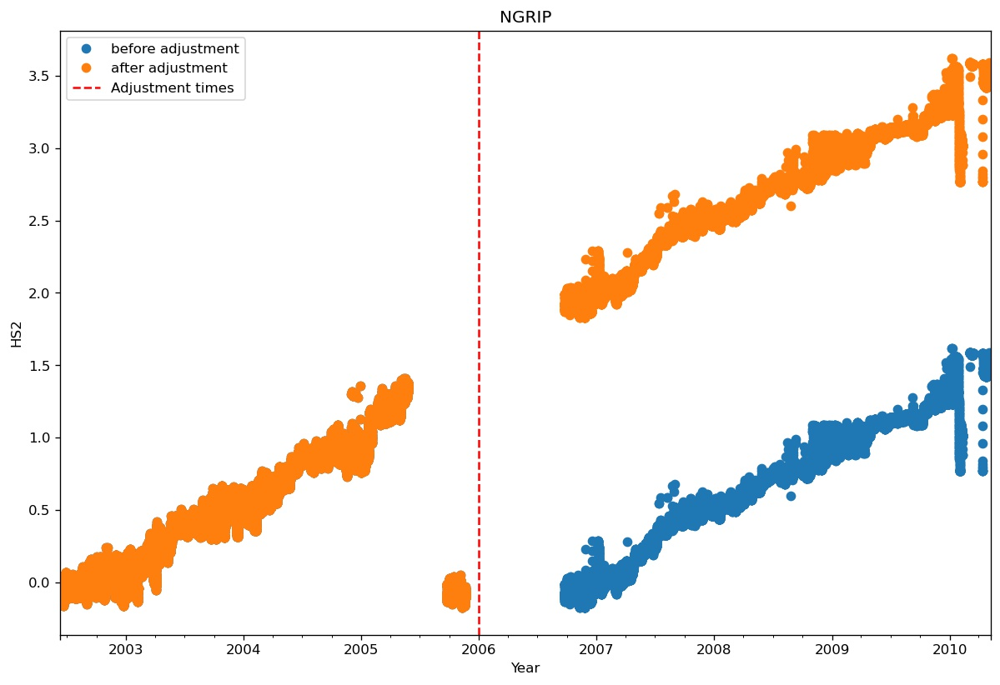
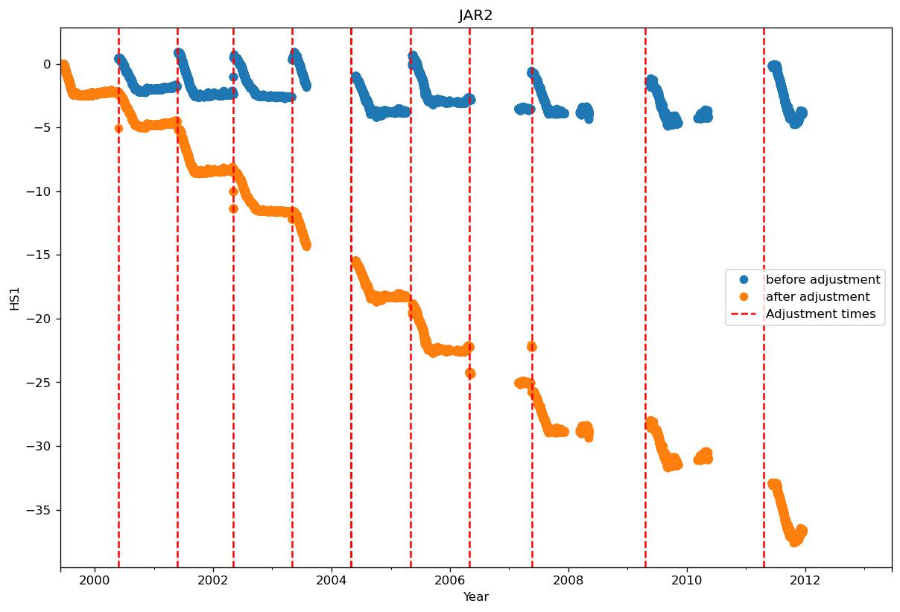
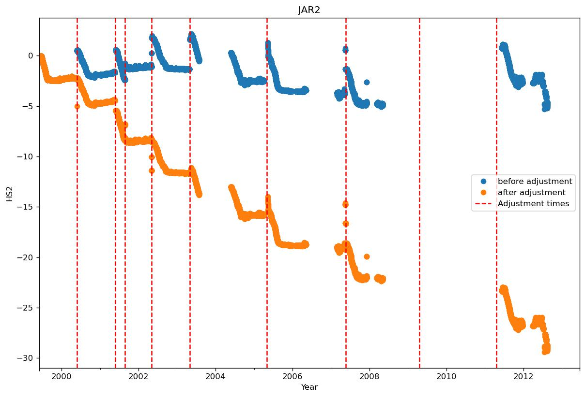
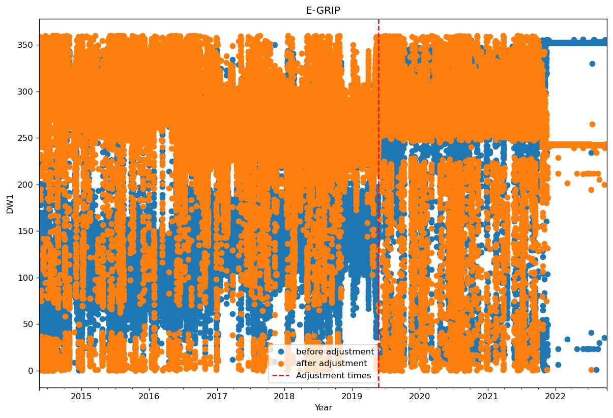
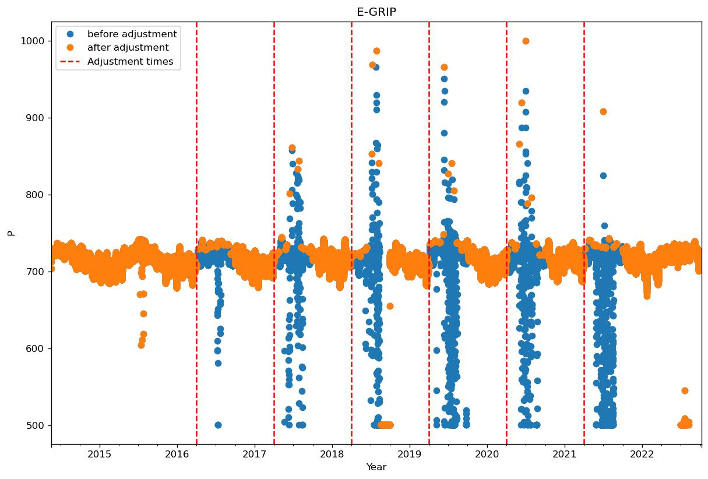
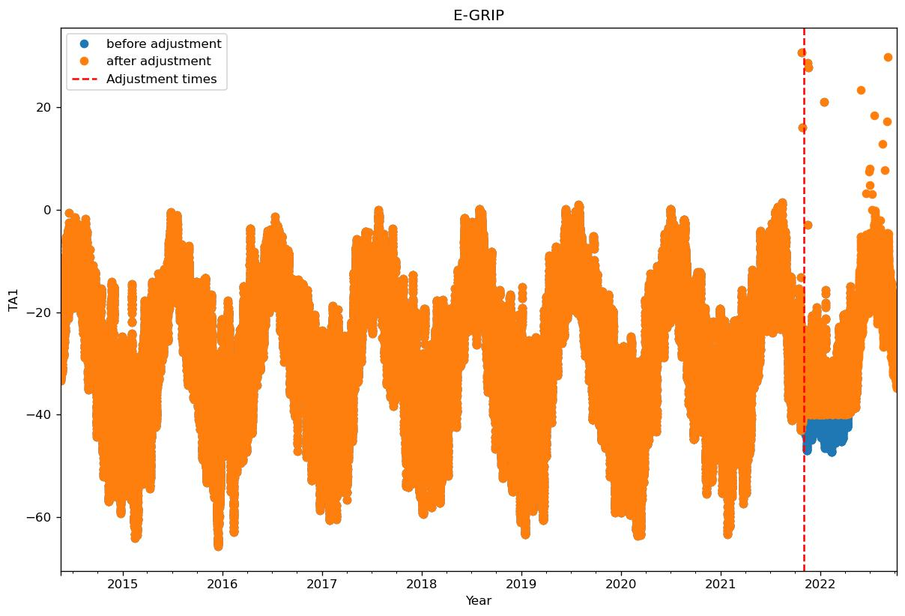

* [0 Swiss Camp 10m](#s1)
  * [Manual flagging of data at Swiss Camp 10m](#s1-1)
  * [Adjusting data at Swiss Camp 10m](#s1-2)
      * [Adjusting DW1](#s1-2-1)
      * [Adjusting DW2](#s1-2-2)
      * [Adjusting HW1](#s1-2-3)
      * [Adjusting HW2](#s1-2-4)
      * [Adjusting P](#s1-2-5)
      * [Adjusting TA1](#s1-2-6)
* [1 Swiss Camp](#s2)
  * [Manual flagging of data at Swiss Camp](#s2-1)
  * [Adjusting data at Swiss Camp](#s2-2)
      * [Adjusting HW1](#s2-2-1)
      * [Adjusting HW2](#s2-2-2)
      * [Adjusting ISWR](#s2-2-3)
      * [Adjusting OSWR](#s2-2-4)
      * [Adjusting P](#s2-2-5)
      * [Adjusting RH1](#s2-2-6)
      * [Adjusting RH2](#s2-2-7)
      * [Adjusting HS1](#s2-2-8)
      * [Adjusting HS2](#s2-2-9)
* [2 Crawford Point 1](#s3)
  * [Manual flagging of data at Crawford Point 1](#s3-1)
  * [Adjusting data at Crawford Point 1](#s3-2)
      * [Adjusting HW1](#s3-2-1)
      * [Adjusting HW2](#s3-2-2)
      * [Adjusting ISWR](#s3-2-3)
      * [Adjusting OSWR](#s3-2-4)
      * [Adjusting P](#s3-2-5)
      * [Adjusting RH1](#s3-2-6)
      * [Adjusting RH2](#s3-2-7)
      * [Adjusting HS1](#s3-2-8)
      * [Adjusting HS2](#s3-2-9)
* [3 NASA-U](#s4)
  * [Manual flagging of data at NASA-U](#s4-1)
  * [Adjusting data at NASA-U](#s4-2)
      * [Adjusting HW1](#s4-2-1)
      * [Adjusting HW2](#s4-2-2)
      * [Adjusting OSWR](#s4-2-3)
      * [Adjusting P](#s4-2-4)
      * [Adjusting RH1](#s4-2-5)
      * [Adjusting RH2](#s4-2-6)
      * [Adjusting HS1](#s4-2-7)
      * [Adjusting HS2](#s4-2-8)
* [4 GITS](#s5)
  * [Manual flagging of data at GITS](#s5-1)
  * [Adjusting data at GITS](#s5-2)
      * [Adjusting HW1](#s5-2-1)
      * [Adjusting HW2](#s5-2-2)
      * [Adjusting OSWR](#s5-2-3)
      * [Adjusting RH1](#s5-2-4)
      * [Adjusting RH2](#s5-2-5)
      * [Adjusting TA3](#s5-2-6)
      * [Adjusting TA4](#s5-2-7)
      * [Adjusting HS1](#s5-2-8)
      * [Adjusting HS2](#s5-2-9)
* [5 Humboldt](#s6)
  * [Manual flagging of data at Humboldt](#s6-1)
  * [Adjusting data at Humboldt](#s6-2)
      * [Adjusting HW1](#s6-2-1)
      * [Adjusting HW2](#s6-2-2)
      * [Adjusting OSWR](#s6-2-3)
      * [Adjusting RH1](#s6-2-4)
      * [Adjusting RH2](#s6-2-5)
      * [Adjusting HS1](#s6-2-6)
      * [Adjusting HS2](#s6-2-7)
* [6 Summit](#s7)
  * [Manual flagging of data at Summit](#s7-1)
  * [Adjusting data at Summit](#s7-2)
      * [Adjusting HW1](#s7-2-1)
      * [Adjusting HW2](#s7-2-2)
      * [Adjusting OSWR](#s7-2-3)
      * [Adjusting P](#s7-2-4)
      * [Adjusting RH1](#s7-2-5)
      * [Adjusting RH2](#s7-2-6)
      * [Adjusting HS1](#s7-2-7)
      * [Adjusting HS2](#s7-2-8)
* [7 Tunu-N](#s8)
  * [Manual flagging of data at Tunu-N](#s8-1)
  * [Adjusting data at Tunu-N](#s8-2)
      * [Adjusting DW1](#s8-2-1)
      * [Adjusting DW2](#s8-2-2)
      * [Adjusting HW1](#s8-2-3)
      * [Adjusting HW2](#s8-2-4)
      * [Adjusting P](#s8-2-5)
      * [Adjusting RH1](#s8-2-6)
      * [Adjusting RH2](#s8-2-7)
      * [Adjusting HS1](#s8-2-8)
      * [Adjusting HS2](#s8-2-9)
* [8 DYE2](#s9)
  * [Manual flagging of data at DYE2](#s9-1)
  * [Adjusting data at DYE2](#s9-2)
      * [Adjusting HW1](#s9-2-1)
      * [Adjusting HW2](#s9-2-2)
      * [Adjusting OSWR](#s9-2-3)
      * [Adjusting RH1](#s9-2-4)
      * [Adjusting RH2](#s9-2-5)
      * [Adjusting TA1](#s9-2-6)
      * [Adjusting TA2](#s9-2-7)
      * [Adjusting HS1](#s9-2-8)
      * [Adjusting HS2](#s9-2-9)
* [9 JAR1](#s10)
  * [Manual flagging of data at JAR1](#s10-1)
  * [Adjusting data at JAR1](#s10-2)
      * [Adjusting HW1](#s10-2-1)
      * [Adjusting HW2](#s10-2-2)
      * [Adjusting OSWR](#s10-2-3)
      * [Adjusting TA3](#s10-2-4)
      * [Adjusting TA4](#s10-2-5)
      * [Adjusting HS1](#s10-2-6)
      * [Adjusting HS2](#s10-2-7)
* [10 Saddle](#s11)
  * [Manual flagging of data at Saddle](#s11-1)
  * [Adjusting data at Saddle](#s11-2)
      * [Adjusting HW1](#s11-2-1)
      * [Adjusting HW2](#s11-2-2)
      * [Adjusting OSWR](#s11-2-3)
      * [Adjusting RH1](#s11-2-4)
      * [Adjusting RH2](#s11-2-5)
      * [Adjusting TA1](#s11-2-6)
      * [Adjusting HS1](#s11-2-7)
      * [Adjusting HS2](#s11-2-8)
* [11 South Dome](#s12)
  * [Manual flagging of data at South Dome](#s12-1)
  * [Adjusting data at South Dome](#s12-2)
      * [Adjusting HW1](#s12-2-1)
      * [Adjusting HW2](#s12-2-2)
      * [Adjusting OSWR](#s12-2-3)
      * [Adjusting RH1](#s12-2-4)
      * [Adjusting RH2](#s12-2-5)
      * [Adjusting TS4](#s12-2-6)
      * [Adjusting HS1](#s12-2-7)
      * [Adjusting HS2](#s12-2-8)
* [12 NASA-E](#s13)
  * [Manual flagging of data at NASA-E](#s13-1)
  * [Adjusting data at NASA-E](#s13-2)
      * [Adjusting DW2](#s13-2-1)
      * [Adjusting HW1](#s13-2-2)
      * [Adjusting HW2](#s13-2-3)
      * [Adjusting OSWR](#s13-2-4)
      * [Adjusting RH1](#s13-2-5)
      * [Adjusting RH2](#s13-2-6)
      * [Adjusting HS1](#s13-2-7)
      * [Adjusting HS2](#s13-2-8)
* [13 CP2](#s14)
  * [Manual flagging of data at CP2](#s14-1)
  * [Adjusting data at CP2](#s14-2)
      * [Adjusting HW1](#s14-2-1)
      * [Adjusting HW2](#s14-2-2)
      * [Adjusting RH1](#s14-2-3)
      * [Adjusting RH2](#s14-2-4)
      * [Adjusting TA1](#s14-2-5)
      * [Adjusting HS1](#s14-2-6)
      * [Adjusting HS2](#s14-2-7)
* [14 NGRIP](#s15)
  * [Manual flagging of data at NGRIP](#s15-1)
  * [Adjusting data at NGRIP](#s15-2)
      * [Adjusting RH1](#s15-2-1)
      * [Adjusting RH2](#s15-2-2)
      * [Adjusting HS1](#s15-2-3)
      * [Adjusting HS2](#s15-2-4)
* [15 NASA-SE](#s16)
  * [Manual flagging of data at NASA-SE](#s16-1)
  * [Adjusting data at NASA-SE](#s16-2)
      * [Adjusting HW1](#s16-2-1)
      * [Adjusting HW2](#s16-2-2)
      * [Adjusting OSWR](#s16-2-3)
      * [Adjusting RH1](#s16-2-4)
      * [Adjusting RH2](#s16-2-5)
      * [Adjusting HS1](#s16-2-6)
      * [Adjusting HS2](#s16-2-7)
* [16 KAR](#s17)
  * [Manual flagging of data at KAR](#s17-1)
  * [Adjusting data at KAR](#s17-2)
      * [Adjusting RH1](#s17-2-1)
      * [Adjusting RH2](#s17-2-2)
* [17 JAR2](#s18)
  * [Manual flagging of data at JAR2](#s18-1)
  * [Adjusting data at JAR2](#s18-2)
      * [Adjusting HW1](#s18-2-1)
      * [Adjusting HW2](#s18-2-2)
      * [Adjusting ISWR](#s18-2-3)
      * [Adjusting OSWR](#s18-2-4)
      * [Adjusting RH1](#s18-2-5)
      * [Adjusting RH2](#s18-2-6)
      * [Adjusting HS1](#s18-2-7)
      * [Adjusting HS2](#s18-2-8)
* [18 KULU](#s19)
  * [Manual flagging of data at KULU](#s19-1)
  * [Adjusting data at KULU](#s19-2)
      * [Adjusting RH1](#s19-2-1)
      * [Adjusting RH2](#s19-2-2)
* [19 JAR3](#s20)
  * [Manual flagging of data at JAR3](#s20-1)
  * [Adjusting data at JAR3](#s20-2)
      * [Adjusting P](#s20-2-1)
* [20 Aurora](#s21)
  * [Manual flagging of data at Aurora](#s21-1)
  * [Adjusting data at Aurora](#s21-2)
      * [Adjusting RH1](#s21-2-1)
      * [Adjusting RH2](#s21-2-2)
* [21 Petermann Gl](#s22)
* [22 Petermann ELA](#s23)
  * [Manual flagging of data at Petermann ELA](#s23-1)
  * [Adjusting data at Petermann ELA](#s23-2)
      * [Adjusting HW1](#s23-2-1)
      * [Adjusting HW2](#s23-2-2)
      * [Adjusting TA2](#s23-2-3)
      * [Adjusting TA3](#s23-2-4)
      * [Adjusting TA4](#s23-2-5)
* [23 NEEM](#s24)
  * [Manual flagging of data at NEEM](#s24-1)
  * [Adjusting data at NEEM](#s24-2)
      * [Adjusting DW1](#s24-2-1)
      * [Adjusting HW1](#s24-2-2)
      * [Adjusting HW2](#s24-2-3)
      * [Adjusting OSWR](#s24-2-4)
      * [Adjusting RH1](#s24-2-5)
      * [Adjusting RH2](#s24-2-6)
      * [Adjusting HS1](#s24-2-7)
      * [Adjusting HS2](#s24-2-8)
* [24 E-GRIP](#s25)
  * [Manual flagging of data at E-GRIP](#s25-1)
  * [Adjusting data at E-GRIP](#s25-2)
      * [Adjusting DW1](#s25-2-1)
      * [Adjusting HW1](#s25-2-2)
      * [Adjusting HW2](#s25-2-3)
      * [Adjusting P](#s25-2-4)
      * [Adjusting TA1](#s25-2-5)
      * [Adjusting HS1](#s25-2-6)
      * [Adjusting HS2](#s25-2-7)
* [25 SMS1](#s26)
* [26 SMS2](#s27)
* [27 SMS3](#s28)
* [28 SMS4](#s29)
* [29 SMS5](#s30)
* [30 LAR1](#s31)
  * [Manual flagging of data at LAR1](#s31-1)
  * [Adjusting data at LAR1](#s31-2)
      * [Adjusting ISWR](#s31-2-1)
      * [Adjusting RH1](#s31-2-2)
      * [Adjusting RH2](#s31-2-3)
* [31 LAR2](#s32)
  * [Manual flagging of data at LAR2](#s32-1)
  * [Adjusting data at LAR2](#s32-2)
      * [Adjusting RH1](#s32-2-1)
      * [Adjusting RH2](#s32-2-2)
* [32 LAR3](#s33)
  * [Manual flagging of data at LAR3](#s33-1)
  * [Adjusting data at LAR3](#s33-2)
      * [Adjusting RH1](#s33-2-1)
      * [Adjusting RH2](#s33-2-2)
* [33 SMS-PET](#s34)
# <a id='s1' />0 Swiss Camp 10m
## <a id='s1-1' />Manual flagging of data at Swiss Camp 10m
Flagging data:
|start time|end time|variable|
|-|-|-|
|1997-05-22 00:00:00+00:00|1998-05-22 00:00:00+00:00|OSWR|
|start time|end time|variable|
|-|-|-|
|2001-06-03 00:00:00+00:00|2002-05-11 00:00:00+00:00|ISWR|
|start time|end time|variable|
|-|-|-|
|2001-06-03 00:00:00+00:00|2002-05-11 00:00:00+00:00|OSWR|
|start time|end time|variable|
|-|-|-|
|2001-06-03 00:00:00+00:00|2002-05-11 00:00:00+00:00|TA1|
|start time|end time|variable|
|-|-|-|
|2001-06-03 00:00:00+00:00|2002-05-11 00:00:00+00:00|TA2|
|start time|end time|variable|
|-|-|-|
|2001-06-03 00:00:00+00:00|2002-05-11 00:00:00+00:00|DW1|
|start time|end time|variable|
|-|-|-|
|2001-06-03 00:00:00+00:00|2002-05-11 00:00:00+00:00|DW2|
|start time|end time|variable|
|-|-|-|
|2011-01-01 00:00:00+00:00|2012-12-31 00:00:00+00:00|DW2|
|start time|end time|variable|
|-|-|-|
|2001-06-03 00:00:00+00:00|2002-05-11 00:00:00+00:00|VW1|
|start time|end time|variable|
|-|-|-|
|2001-06-03 00:00:00+00:00|2002-05-11 00:00:00+00:00|RH1|
|start time|end time|variable|
|-|-|-|
|2001-06-03 00:00:00+00:00|2002-05-11 00:00:00+00:00|RH2|
|start time|end time|variable|
|-|-|-|
|2005-02-04 00:00:00+00:00|2005-05-15 00:00:00+00:00|RH1|
|start time|end time|variable|
|-|-|-|
|2016-05-01 00:00:00+00:00|2017-06-01 00:00:00+00:00|OSWR|
|start time|end time|variable|
|-|-|-|
|2015-05-15 00:00:00+00:00|2016-05-15 00:00:00+00:00|TA3|
|start time|end time|variable|
|-|-|-|
|2015-05-15 00:00:00+00:00|2016-05-15 00:00:00+00:00|TA2|
|start time|end time|variable|
|-|-|-|
|2018-02-15 00:00:00+00:00|2018-05-05 00:00:00+00:00|P|
|start time|end time|variable|
|-|-|-|
|2017-08-21 00:00:00+00:00|2018-05-05 00:00:00+00:00|HW2|
## <a id='s1-2' />Adjusting data at Swiss Camp 10m
### <a id='s1-2-1' />Adjusting DW1
|start time|end time|operation|value|number of removed samples|
|-|-|-|-|-|
|1998-05-01 00:00:00+00:00|2002-01-01 00:00:00+00:00|rotate|-100.0|0|
 

 
### <a id='s1-2-2' />Adjusting DW2
|start time|end time|operation|value|number of removed samples|
|-|-|-|-|-|
|1998-05-01 00:00:00+00:00|2002-01-01 00:00:00+00:00|rotate|-100.0|0|
 

 
### <a id='s1-2-3' />Adjusting HW1
|start time|end time|operation|value|number of removed samples|
|-|-|-|-|-|
|2014-01-01 00:00:00+00:00|2020-11-03 21:00:00+00:00|air_temp_sonic_correction|0.0|0|
|2014-01-01 00:00:00+00:00|2020-11-03 21:00:00+00:00|biweekly_upper_range_filter|0.5|2602|
|2014-01-01 00:00:00+00:00|2020-11-03 21:00:00+00:00|hampel_filter|2.0|3797|
 

 
### <a id='s1-2-4' />Adjusting HW2
|start time|end time|operation|value|number of removed samples|
|-|-|-|-|-|
|2014-01-01 00:00:00+00:00|2020-11-03 21:00:00+00:00|air_temp_sonic_correction|0.0|0|
|2014-01-01 00:00:00+00:00|2020-11-03 21:00:00+00:00|biweekly_upper_range_filter|0.5|8516|
|2014-01-01 00:00:00+00:00|2020-11-03 21:00:00+00:00|hampel_filter|2.0|2730|
|2014-05-09 21:00:00+00:00|2020-11-03 21:00:00+00:00|add|9.0|0|
 

 
### <a id='s1-2-5' />Adjusting P
|start time|end time|operation|value|number of removed samples|
|-|-|-|-|-|
|2014-01-01 00:00:00+00:00|2019-05-05 00:00:00+00:00|add|-96.5|0|
 

 
### <a id='s1-2-6' />Adjusting TA1
|start time|end time|operation|value|number of removed samples|
|-|-|-|-|-|
|2014-01-01 00:00:00+00:00|2020-11-03 21:00:00+00:00|swap_with_TA2|0.0|0|
 

 
# <a id='s2' />1 Swiss Camp
## <a id='s2-1' />Manual flagging of data at Swiss Camp
Flagging data:
|start time|end time|variable|
|-|-|-|
|2015-06-01 00:00:00+00:00|2016-05-01 00:00:00+00:00|RH2|
|start time|end time|variable|
|-|-|-|
|2009-07-01 00:00:00+00:00|2009-07-01 00:00:00+00:00|ISWR|
|start time|end time|variable|
|-|-|-|
|2009-07-01 00:00:00+00:00|2009-07-01 00:00:00+00:00|OSWR|
|start time|end time|variable|
|-|-|-|
|2011-02-15 00:00:00+00:00|2011-05-10 00:00:00+00:00|OSWR|
|start time|end time|variable|
|-|-|-|
|2011-08-01 00:00:00+00:00|2012-05-10 00:00:00+00:00|OSWR|
|start time|end time|variable|
|-|-|-|
|2011-02-15 00:00:00+00:00|2011-05-10 00:00:00+00:00|ISWR|
|start time|end time|variable|
|-|-|-|
|2015-06-01 00:00:00+00:00|2016-05-01 00:00:00+00:00|VW1|
Warning: HS1 not found
Warning: HS1 not found
Warning: HS2 not found
Warning: HS2 not found
Warning: HS1 not found
|start time|end time|variable|
|-|-|-|
|1995-01-01 00:00:00+00:00|1996-06-23 00:00:00+00:00|HW1|
|start time|end time|variable|
|-|-|-|
|1998-06-04 00:00:00+00:00|1999-04-02 00:00:00+00:00|HW1|
|start time|end time|variable|
|-|-|-|
|2017-07-29 00:00:00+00:00|2018-04-28 00:00:00+00:00|HW1|
|start time|end time|variable|
|-|-|-|
|2011-08-14 00:00:00+00:00|2012-05-24 00:00:00+00:00|HW2|
|start time|end time|variable|
|-|-|-|
|2003-09-21 00:00:00+00:00|2004-05-01 00:00:00+00:00|TA1|
|start time|end time|variable|
|-|-|-|
|2003-09-21 00:00:00+00:00|2004-05-01 00:00:00+00:00|TA2|
|start time|end time|variable|
|-|-|-|
|2003-09-21 00:00:00+00:00|2004-05-01 00:00:00+00:00|TA3|
|start time|end time|variable|
|-|-|-|
|2003-09-21 00:00:00+00:00|2004-05-01 00:00:00+00:00|TA4|
|start time|end time|variable|
|-|-|-|
|2020-09-21 00:00:00+00:00|2022-08-03 19:00:00+00:00|TA4|
## <a id='s2-2' />Adjusting data at Swiss Camp
### <a id='s2-2-1' />Adjusting HW1
|start time|end time|operation|value|number of removed samples|
|-|-|-|-|-|
|1996-01-01 00:00:00+00:00|1996-08-01 00:00:00+00:00|air_temp_sonic_anticorrection|0.0|0|
|2009-01-01 00:00:00+00:00|2011-07-15 00:00:00+00:00|min_filter|1.0|7677|
|2009-05-01 00:00:00+00:00|2022-08-03 19:00:00+00:00|add|-0.5|0|
|2009-05-15 00:00:00+00:00|2022-08-03 19:00:00+00:00|air_temp_sonic_correction|0.0|0|
|2009-05-15 00:00:00+00:00|2022-08-03 19:00:00+00:00|biweekly_upper_range_filter|0.5|5337|
|2009-05-15 00:00:00+00:00|2022-08-03 19:00:00+00:00|hampel_filter|2.0|706|
 

 
### <a id='s2-2-2' />Adjusting HW2
|start time|end time|operation|value|number of removed samples|
|-|-|-|-|-|
|1995-01-12 00:00:00+00:00|2000-01-01 00:00:00+00:00|max_filter|8.0|19148|
|1996-01-01 00:00:00+00:00|1996-08-01 00:00:00+00:00|air_temp_sonic_anticorrection|0.0|0|
|2009-01-01 00:00:00+00:00|2012-01-15 00:00:00+00:00|min_filter|1.0|2949|
|2009-05-01 00:00:00+00:00|2022-08-03 19:00:00+00:00|add|0.3|0|
|2009-05-15 00:00:00+00:00|2022-08-03 19:00:00+00:00|air_temp_sonic_correction|0.0|0|
|2009-05-15 00:00:00+00:00|2022-08-03 19:00:00+00:00|biweekly_upper_range_filter|0.5|12071|
|2009-05-15 00:00:00+00:00|2022-08-03 19:00:00+00:00|hampel_filter|2.0|3607|
|2018-03-12 00:00:00+00:00|2018-05-12 00:00:00+00:00|max_filter|0.77|430|
 

 
### <a id='s2-2-3' />Adjusting ISWR
|start time|end time|operation|value|number of removed samples|
|-|-|-|-|-|
|2012-05-10 00:00:00+00:00|2022-08-03 19:00:00+00:00|swap_with_OSWR|0.0|0|
 

 
### <a id='s2-2-4' />Adjusting OSWR
|start time|end time|operation|value|number of removed samples|
|-|-|-|-|-|
|2009-05-07 00:00:00+00:00|2022-08-03 19:00:00+00:00|multiply|0.934|0|
 

 
### <a id='s2-2-5' />Adjusting P
|start time|end time|operation|value|number of removed samples|
|-|-|-|-|-|
|2019-11-15 00:00:00+00:00|2022-08-03 19:00:00+00:00|min_filter|856.0|5228|
 

 
### <a id='s2-2-6' />Adjusting RH1
|start time|end time|operation|value|number of removed samples|
|-|-|-|-|-|
|1996-01-01 00:00:00+00:00|2011-01-01 00:00:00+00:00|ice_to_water|0.0|0|
 

 
### <a id='s2-2-7' />Adjusting RH2
|start time|end time|operation|value|number of removed samples|
|-|-|-|-|-|
|1996-01-01 00:00:00+00:00|2011-01-01 00:00:00+00:00|ice_to_water|0.0|0|
 

 
### <a id='s2-2-8' />Adjusting HS1
|start time|end time|operation|value|number of removed samples|
|-|-|-|-|-|
|1999-01-01 00:00:00+00:00|2022-08-03 19:00:00+00:00|add|-0.75|0|
|2000-12-31 00:00:00+00:00|2022-08-03 19:00:00+00:00|add|-0.7|0|
|2002-01-25 00:00:00+00:00|2022-08-03 19:00:00+00:00|add|1.5|0|
|2003-01-19 00:00:00+00:00|2022-08-03 19:00:00+00:00|add|-0.6|0|
|2003-04-27 00:00:00+00:00|2022-08-03 19:00:00+00:00|add|0.4|0|
|2004-01-01 00:00:00+00:00|2022-08-03 19:00:00+00:00|add|-0.5|0|
|2011-08-01 00:00:00+00:00|2022-08-03 19:00:00+00:00|add|-3.0|0|
|2014-05-08 00:00:00+00:00|2022-08-03 19:00:00+00:00|add|-2.0|0|
 

 
### <a id='s2-2-9' />Adjusting HS2
|start time|end time|operation|value|number of removed samples|
|-|-|-|-|-|
|2000-12-31 00:00:00+00:00|2022-08-03 19:00:00+00:00|add|-0.8|0|
|2001-05-17 00:00:00+00:00|2022-08-03 19:00:00+00:00|add|-0.3|0|
|2011-08-01 00:00:00+00:00|2022-08-03 19:00:00+00:00|add|-3.0|0|
|2014-05-08 00:00:00+00:00|2022-08-03 19:00:00+00:00|add|-2.0|0|
 

 
# <a id='s3' />2 Crawford Point 1
## <a id='s3-1' />Manual flagging of data at Crawford Point 1
Flagging data:
|start time|end time|variable|
|-|-|-|
|2011-05-25 00:00:00+00:00|2012-11-01 00:00:00+00:00|P|
|start time|end time|variable|
|-|-|-|
|2008-06-01 00:00:00+00:00|2013-01-01 00:00:00+00:00|DW1|
|start time|end time|variable|
|-|-|-|
|2008-06-01 00:00:00+00:00|2013-01-01 00:00:00+00:00|DW2|
|start time|end time|variable|
|-|-|-|
|2004-11-16 00:00:00+00:00|2005-05-04 00:00:00+00:00|RH1|
|start time|end time|variable|
|-|-|-|
|2004-11-16 00:00:00+00:00|2005-05-04 00:00:00+00:00|RH2|
|start time|end time|variable|
|-|-|-|
|2005-01-01 00:00:00+00:00|2007-05-10 00:00:00+00:00|TA1|
|start time|end time|variable|
|-|-|-|
|2017-03-10 00:00:00+00:00|2017-05-22 00:00:00+00:00|TA3|
|start time|end time|variable|
|-|-|-|
|2015-06-01 00:00:00+00:00|2015-07-01 00:00:00+00:00|HW1|
|start time|end time|variable|
|-|-|-|
|2017-07-26 00:00:00+00:00|2020-01-01 00:00:00+00:00|HW2|
|start time|end time|variable|
|-|-|-|
|2000-08-01 00:00:00+00:00|2000-08-10 00:00:00+00:00|TS1|
|2000-08-01 00:00:00+00:00|2000-08-10 00:00:00+00:00|TS2|
|2000-08-01 00:00:00+00:00|2000-08-10 00:00:00+00:00|TS3|
|2000-08-01 00:00:00+00:00|2000-08-10 00:00:00+00:00|TS4|
|2000-08-01 00:00:00+00:00|2000-08-10 00:00:00+00:00|TS5|
|2000-08-01 00:00:00+00:00|2000-08-10 00:00:00+00:00|TS6|
|2000-08-01 00:00:00+00:00|2000-08-10 00:00:00+00:00|TS7|
|2000-08-01 00:00:00+00:00|2000-08-10 00:00:00+00:00|TS8|
|2000-08-01 00:00:00+00:00|2000-08-10 00:00:00+00:00|TS9|
|2000-08-01 00:00:00+00:00|2000-08-10 00:00:00+00:00|TS10|
|start time|end time|variable|
|-|-|-|
|2002-10-15 00:00:00+00:00|2002-11-05 00:00:00+00:00|TS4|
|start time|end time|variable|
|-|-|-|
|2003-10-05 00:00:00+00:00|2003-11-30 00:00:00+00:00|TS4|
|start time|end time|variable|
|-|-|-|
|2001-09-10 00:00:00+00:00|2001-12-01 00:00:00+00:00|TS8|
|start time|end time|variable|
|-|-|-|
|2002-02-01 00:00:00+00:00|2002-07-20 00:00:00+00:00|TS8|
|start time|end time|variable|
|-|-|-|
|2000-10-20 00:00:00+00:00|2000-11-10 00:00:00+00:00|TS8|
|start time|end time|variable|
|-|-|-|
|2002-10-15 00:00:00+00:00|2002-11-05 00:00:00+00:00|TS8|
|start time|end time|variable|
|-|-|-|
|2003-10-05 00:00:00+00:00|2004-06-30 00:00:00+00:00|TS8|
|start time|end time|variable|
|-|-|-|
|1998-01-01 00:00:00+00:00|1999-01-01 00:00:00+00:00|TS1|
|1998-01-01 00:00:00+00:00|1999-01-01 00:00:00+00:00|TS2|
|1998-01-01 00:00:00+00:00|1999-01-01 00:00:00+00:00|TS3|
|1998-01-01 00:00:00+00:00|1999-01-01 00:00:00+00:00|TS4|
|1998-01-01 00:00:00+00:00|1999-01-01 00:00:00+00:00|TS5|
|1998-01-01 00:00:00+00:00|1999-01-01 00:00:00+00:00|TS6|
|1998-01-01 00:00:00+00:00|1999-01-01 00:00:00+00:00|TS7|
|1998-01-01 00:00:00+00:00|1999-01-01 00:00:00+00:00|TS8|
|1998-01-01 00:00:00+00:00|1999-01-01 00:00:00+00:00|TS9|
|1998-01-01 00:00:00+00:00|1999-01-01 00:00:00+00:00|TS10|
|start time|end time|variable|
|-|-|-|
|2000-10-26 04:00:00+00:00|2000-11-08 00:00:00+00:00|TS3|
|start time|end time|variable|
|-|-|-|
|2001-09-05 06:00:00+00:00|2002-08-14 00:00:00+00:00|TS3|
|start time|end time|variable|
|-|-|-|
|2003-10-14 08:00:00+00:00|2004-04-21 00:00:00+00:00|TS3|
|start time|end time|variable|
|-|-|-|
|2000-07-29 18:00:00+00:00|2000-08-10 00:00:00+00:00|TS1|
|start time|end time|variable|
|-|-|-|
|2003-09-30 17:00:00+00:00|2003-12-13 00:00:00+00:00|TS7|
|start time|end time|variable|
|-|-|-|
|2008-06-01 00:00:00+00:00|2020-07-22 09:00:00+00:00|TA1|
|2008-06-01 00:00:00+00:00|2020-07-22 09:00:00+00:00|TA2|
|2008-06-01 00:00:00+00:00|2020-07-22 09:00:00+00:00|TA3|
|2008-06-01 00:00:00+00:00|2020-07-22 09:00:00+00:00|TA4|
|2008-06-01 00:00:00+00:00|2020-07-22 09:00:00+00:00|TA5|
|2008-06-01 00:00:00+00:00|2020-07-22 09:00:00+00:00|TS1|
|2008-06-01 00:00:00+00:00|2020-07-22 09:00:00+00:00|TS2|
|2008-06-01 00:00:00+00:00|2020-07-22 09:00:00+00:00|TS3|
|2008-06-01 00:00:00+00:00|2020-07-22 09:00:00+00:00|TS4|
|2008-06-01 00:00:00+00:00|2020-07-22 09:00:00+00:00|TS5|
|2008-06-01 00:00:00+00:00|2020-07-22 09:00:00+00:00|TS6|
|2008-06-01 00:00:00+00:00|2020-07-22 09:00:00+00:00|TS7|
|2008-06-01 00:00:00+00:00|2020-07-22 09:00:00+00:00|TS8|
|2008-06-01 00:00:00+00:00|2020-07-22 09:00:00+00:00|TS9|
|2008-06-01 00:00:00+00:00|2020-07-22 09:00:00+00:00|TS10|
## <a id='s3-2' />Adjusting data at Crawford Point 1
### <a id='s3-2-1' />Adjusting HW1
|start time|end time|operation|value|number of removed samples|
|-|-|-|-|-|
|2002-01-01 00:00:00+00:00|2003-01-01 00:00:00+00:00|add|-0.3|0|
|2002-09-24 00:00:00+00:00|2003-01-01 00:00:00+00:00|add|-0.94|0|
|2009-05-15 00:00:00+00:00|2020-07-22 09:00:00+00:00|air_temp_sonic_correction|0.0|0|
|2009-05-15 00:00:00+00:00|2020-07-22 09:00:00+00:00|biweekly_upper_range_filter|0.5|19346|
|2009-05-15 00:00:00+00:00|2020-07-22 09:00:00+00:00|hampel_filter|2.0|2185|
 

 
### <a id='s3-2-2' />Adjusting HW2
|start time|end time|operation|value|number of removed samples|
|-|-|-|-|-|
|2002-01-01 00:00:00+00:00|2003-01-01 00:00:00+00:00|add|-1.0|0|
|2009-05-15 00:00:00+00:00|2020-07-22 09:00:00+00:00|air_temp_sonic_correction|0.0|0|
|2009-05-15 00:00:00+00:00|2020-07-22 09:00:00+00:00|biweekly_upper_range_filter|0.5|6643|
|2009-05-15 00:00:00+00:00|2020-07-22 09:00:00+00:00|hampel_filter|2.0|1943|
 

 
### <a id='s3-2-3' />Adjusting ISWR
|start time|end time|operation|value|number of removed samples|
|-|-|-|-|-|
|2012-01-01 00:00:00+00:00|2020-07-22 09:00:00+00:00|swap_with_OSWR|0.0|0|
 

 
### <a id='s3-2-4' />Adjusting OSWR
|start time|end time|operation|value|number of removed samples|
|-|-|-|-|-|
|2010-05-09 00:00:00+00:00|2020-07-22 09:00:00+00:00|multiply|0.934|0|
 

 
### <a id='s3-2-5' />Adjusting P
|start time|end time|operation|value|number of removed samples|
|-|-|-|-|-|
|1999-01-01 00:00:00+00:00|2010-05-09 19:00:00+00:00|add|-12.0|0|
 

 
### <a id='s3-2-6' />Adjusting RH1
|start time|end time|operation|value|number of removed samples|
|-|-|-|-|-|
|1996-01-01 00:00:00+00:00|2010-05-16 00:00:00+00:00|ice_to_water|0.0|0|
 

 
### <a id='s3-2-7' />Adjusting RH2
|start time|end time|operation|value|number of removed samples|
|-|-|-|-|-|
|1996-01-01 00:00:00+00:00|2010-05-16 00:00:00+00:00|ice_to_water|0.0|0|
 

 
### <a id='s3-2-8' />Adjusting HS1
|start time|end time|operation|value|number of removed samples|
|-|-|-|-|-|
|1997-05-13 09:00:00+00:00|2020-07-22 09:00:00+00:00|add|2.5|0|
|1998-09-05 00:00:00+00:00|2020-07-22 09:00:00+00:00|add|3.0|0|
|2001-05-28 18:00:00+00:00|2020-07-22 09:00:00+00:00|add|2.0|0|
|2003-04-11 00:00:00+00:00|2020-07-22 09:00:00+00:00|add|2.8|0|
|2005-05-03 08:00:00+00:00|2020-07-22 09:00:00+00:00|add|3.0|0|
|2008-05-05 14:00:00+00:00|2020-07-22 09:00:00+00:00|add|2.7|0|
|2009-12-13 00:00:00+00:00|2020-07-22 09:00:00+00:00|add|1.0|0|
|2010-05-08 00:00:00+00:00|2020-07-22 09:00:00+00:00|add|0.7|0|
|2011-01-01 00:00:00+00:00|2020-07-22 09:00:00+00:00|add|3.5|0|
|2017-05-21 00:00:00+00:00|2020-07-22 09:00:00+00:00|add|3.0|0|
 

 
### <a id='s3-2-9' />Adjusting HS2
|start time|end time|operation|value|number of removed samples|
|-|-|-|-|-|
|1997-05-13 09:00:00+00:00|2020-07-22 09:00:00+00:00|add|2.5|0|
|1998-09-05 00:00:00+00:00|2020-07-22 09:00:00+00:00|add|3.0|0|
|2001-05-28 18:00:00+00:00|2020-07-22 09:00:00+00:00|add|2.0|0|
|2003-04-11 00:00:00+00:00|2020-07-22 09:00:00+00:00|add|2.5|0|
|2005-05-03 08:00:00+00:00|2020-07-22 09:00:00+00:00|add|3.6|0|
|2008-05-05 14:00:00+00:00|2020-07-22 09:00:00+00:00|add|3.0|0|
|2009-12-10 00:00:00+00:00|2020-07-22 09:00:00+00:00|add|0.3|0|
|2010-05-11 00:00:00+00:00|2020-07-22 09:00:00+00:00|add|-2.5|0|
|2011-05-02 22:00:00+00:00|2020-07-22 09:00:00+00:00|add|3.5|0|
|2017-05-21 00:00:00+00:00|2020-07-22 09:00:00+00:00|add|2.2|0|
 

 
# <a id='s4' />3 NASA-U
## <a id='s4-1' />Manual flagging of data at NASA-U
Flagging data:
|start time|end time|variable|
|-|-|-|
|2017-12-11 00:00:00+00:00|2019-07-01 00:00:00+00:00|TA3|
|start time|end time|variable|
|-|-|-|
|2011-01-01 00:00:00+00:00|2012-05-25 00:00:00+00:00|TA4|
|start time|end time|variable|
|-|-|-|
|2011-01-01 00:00:00+00:00|2016-07-01 00:00:00+00:00|P|
|start time|end time|variable|
|-|-|-|
|2017-08-01 00:00:00+00:00|2018-12-31 00:00:00+00:00|P|
|start time|end time|variable|
|-|-|-|
|2017-10-01 00:00:00+00:00|2018-07-01 00:00:00+00:00|RH1|
|start time|end time|variable|
|-|-|-|
|2011-01-01 00:00:00+00:00|2012-07-01 00:00:00+00:00|RH2|
|start time|end time|variable|
|-|-|-|
|2013-09-01 00:00:00+00:00|2014-05-21 00:00:00+00:00|HW1|
|start time|end time|variable|
|-|-|-|
|2016-11-14 00:00:00+00:00|2018-07-01 00:00:00+00:00|HW1|
|start time|end time|variable|
|-|-|-|
|2015-10-10 00:00:00+00:00|2016-02-14 00:00:00+00:00|HW2|
|start time|end time|variable|
|-|-|-|
|2016-09-04 00:00:00+00:00|2017-05-02 00:00:00+00:00|HW2|
|start time|end time|variable|
|-|-|-|
|2017-10-07 00:00:00+00:00|2018-05-19 00:00:00+00:00|HW2|
|start time|end time|variable|
|-|-|-|
|2017-01-01 00:00:00+00:00|2017-04-09 00:00:00+00:00|ISWR|
|start time|end time|variable|
|-|-|-|
|2022-01-01 00:00:00+00:00|2022-10-07 05:00:00+00:00|DW1|
|start time|end time|variable|
|-|-|-|
|2022-01-01 00:00:00+00:00|2022-10-07 05:00:00+00:00|DW2|
|start time|end time|variable|
|-|-|-|
|2010-01-01 00:00:00+00:00|2022-10-07 05:00:00+00:00|TS1|
|2010-01-01 00:00:00+00:00|2022-10-07 05:00:00+00:00|TS2|
|2010-01-01 00:00:00+00:00|2022-10-07 05:00:00+00:00|TS3|
|2010-01-01 00:00:00+00:00|2022-10-07 05:00:00+00:00|TS4|
|2010-01-01 00:00:00+00:00|2022-10-07 05:00:00+00:00|TS5|
|2010-01-01 00:00:00+00:00|2022-10-07 05:00:00+00:00|TS6|
|2010-01-01 00:00:00+00:00|2022-10-07 05:00:00+00:00|TS7|
|2010-01-01 00:00:00+00:00|2022-10-07 05:00:00+00:00|TS8|
|2010-01-01 00:00:00+00:00|2022-10-07 05:00:00+00:00|TS9|
|2010-01-01 00:00:00+00:00|2022-10-07 05:00:00+00:00|TS10|
|start time|end time|variable|
|-|-|-|
|1995-01-01 00:00:00+00:00|1999-05-21 00:00:00+00:00|TA1|
|1995-01-01 00:00:00+00:00|1999-05-21 00:00:00+00:00|TA2|
|1995-01-01 00:00:00+00:00|1999-05-21 00:00:00+00:00|TA3|
|1995-01-01 00:00:00+00:00|1999-05-21 00:00:00+00:00|TA4|
|1995-01-01 00:00:00+00:00|1999-05-21 00:00:00+00:00|TA5|
|1995-01-01 00:00:00+00:00|1999-05-21 00:00:00+00:00|TS1|
|1995-01-01 00:00:00+00:00|1999-05-21 00:00:00+00:00|TS2|
|1995-01-01 00:00:00+00:00|1999-05-21 00:00:00+00:00|TS3|
|1995-01-01 00:00:00+00:00|1999-05-21 00:00:00+00:00|TS4|
|1995-01-01 00:00:00+00:00|1999-05-21 00:00:00+00:00|TS5|
|1995-01-01 00:00:00+00:00|1999-05-21 00:00:00+00:00|TS6|
|1995-01-01 00:00:00+00:00|1999-05-21 00:00:00+00:00|TS7|
|1995-01-01 00:00:00+00:00|1999-05-21 00:00:00+00:00|TS8|
|1995-01-01 00:00:00+00:00|1999-05-21 00:00:00+00:00|TS9|
|1995-01-01 00:00:00+00:00|1999-05-21 00:00:00+00:00|TS10|
|start time|end time|variable|
|-|-|-|
|2006-04-26 00:00:00+00:00|2007-04-28 00:00:00+00:00|TA1|
|2006-04-26 00:00:00+00:00|2007-04-28 00:00:00+00:00|TA2|
|2006-04-26 00:00:00+00:00|2007-04-28 00:00:00+00:00|TA3|
|2006-04-26 00:00:00+00:00|2007-04-28 00:00:00+00:00|TA4|
|2006-04-26 00:00:00+00:00|2007-04-28 00:00:00+00:00|TA5|
|2006-04-26 00:00:00+00:00|2007-04-28 00:00:00+00:00|TS1|
|2006-04-26 00:00:00+00:00|2007-04-28 00:00:00+00:00|TS2|
|2006-04-26 00:00:00+00:00|2007-04-28 00:00:00+00:00|TS3|
|2006-04-26 00:00:00+00:00|2007-04-28 00:00:00+00:00|TS4|
|2006-04-26 00:00:00+00:00|2007-04-28 00:00:00+00:00|TS5|
|2006-04-26 00:00:00+00:00|2007-04-28 00:00:00+00:00|TS6|
|2006-04-26 00:00:00+00:00|2007-04-28 00:00:00+00:00|TS7|
|2006-04-26 00:00:00+00:00|2007-04-28 00:00:00+00:00|TS8|
|2006-04-26 00:00:00+00:00|2007-04-28 00:00:00+00:00|TS9|
|2006-04-26 00:00:00+00:00|2007-04-28 00:00:00+00:00|TS10|
## <a id='s4-2' />Adjusting data at NASA-U
### <a id='s4-2-1' />Adjusting HW1
|start time|end time|operation|value|number of removed samples|
|-|-|-|-|-|
|2007-02-12 00:00:00+00:00|2007-04-16 00:00:00+00:00|min_filter|3.2|168|
|2007-08-01 00:00:00+00:00|2007-12-16 00:00:00+00:00|min_filter|2.75|21|
|2008-02-01 00:00:00+00:00|2008-04-30 00:00:00+00:00|min_filter|2.46|797|
|2009-05-15 00:00:00+00:00|2022-10-07 05:00:00+00:00|air_temp_sonic_correction|0.0|0|
|2009-05-15 00:00:00+00:00|2016-10-09 00:00:00+00:00|biweekly_upper_range_filter|0.3|5873|
|2009-05-15 00:00:00+00:00|2022-10-07 05:00:00+00:00|hampel_filter|2.0|4828|
|2011-04-01 00:00:00+00:00|2023-01-01 00:00:00+00:00|min_filter|1.39|8199|
|2013-07-01 00:00:00+00:00|2014-07-01 00:00:00+00:00|min_filter|3.0|1|
|2018-05-21 00:00:00+00:00|2022-10-07 05:00:00+00:00|biweekly_upper_range_filter|0.3|1424|
 

 
### <a id='s4-2-2' />Adjusting HW2
|start time|end time|operation|value|number of removed samples|
|-|-|-|-|-|
|2007-02-12 00:00:00+00:00|2007-04-16 00:00:00+00:00|min_filter|4.3|204|
|2007-08-01 00:00:00+00:00|2007-12-16 00:00:00+00:00|min_filter|3.72|19|
|2008-02-01 00:00:00+00:00|2008-04-30 00:00:00+00:00|min_filter|3.44|791|
|2009-05-15 00:00:00+00:00|2022-10-07 05:00:00+00:00|air_temp_sonic_correction|0.0|0|
|2009-05-15 00:00:00+00:00|2022-10-07 05:00:00+00:00|biweekly_upper_range_filter|0.3|22656|
|2009-05-15 00:00:00+00:00|2022-10-07 05:00:00+00:00|hampel_filter|2.0|3429|
|2011-04-01 00:00:00+00:00|2023-01-01 00:00:00+00:00|min_filter|2.23|10|
|2011-04-01 00:00:00+00:00|2023-01-01 00:00:00+00:00|max_filter|5.6|42|
 

 
### <a id='s4-2-3' />Adjusting OSWR
|start time|end time|operation|value|number of removed samples|
|-|-|-|-|-|
|2003-01-01 00:00:00+00:00|2018-05-22 00:00:00+00:00|multiply|2.76205|0|
|2011-05-31 00:00:00+00:00|2022-10-07 05:00:00+00:00|multiply|0.934|0|
 

 
### <a id='s4-2-4' />Adjusting P
|start time|end time|operation|value|number of removed samples|
|-|-|-|-|-|
|1999-05-14 00:00:00+00:00|2000-01-01 00:00:00+00:00|add|-30.0|0|
|2000-01-01 00:00:00+00:00|2005-05-26 00:00:00+00:00|add|-15.0|0|
|2016-07-01 00:00:00+00:00|2022-10-07 05:00:00+00:00|add|-40.0|0|
|2021-08-17 00:00:00+00:00|2022-05-17 00:00:00+00:00|add|45.0|0|
 

 
### <a id='s4-2-5' />Adjusting RH1
|start time|end time|operation|value|number of removed samples|
|-|-|-|-|-|
|1995-01-01 00:00:00+00:00|2011-05-30 00:00:00+00:00|ice_to_water|0.0|0|
 

 
### <a id='s4-2-6' />Adjusting RH2
|start time|end time|operation|value|number of removed samples|
|-|-|-|-|-|
|1995-01-01 00:00:00+00:00|2011-05-30 00:00:00+00:00|ice_to_water|0.0|0|
 

 
### <a id='s4-2-7' />Adjusting HS1
|start time|end time|operation|value|number of removed samples|
|-|-|-|-|-|
|1997-01-01 00:00:00+00:00|2022-10-07 05:00:00+00:00|add|1.7|0|
|1999-05-14 16:00:00+00:00|2022-10-07 05:00:00+00:00|add|2.3|0|
|2003-06-02 17:00:00+00:00|2022-10-07 05:00:00+00:00|add|4.0|0|
|2005-05-25 00:00:00+00:00|2022-10-07 05:00:00+00:00|add|2.8|0|
|2009-04-20 16:00:00+00:00|2022-10-07 05:00:00+00:00|add|1.8|0|
|2011-05-31 22:00:00+00:00|2022-10-07 05:00:00+00:00|add|0.7|0|
|2013-05-25 22:00:00+00:00|2022-10-07 05:00:00+00:00|add|2.3|0|
|2018-01-01 00:00:00+00:00|2022-10-07 05:00:00+00:00|add|2.7|0|
 

 
### <a id='s4-2-8' />Adjusting HS2
|start time|end time|operation|value|number of removed samples|
|-|-|-|-|-|
|1997-01-01 00:00:00+00:00|2022-10-07 05:00:00+00:00|add|2.0|0|
|1999-05-14 16:00:00+00:00|2022-10-07 05:00:00+00:00|add|1.9|0|
|2003-06-02 17:00:00+00:00|2022-10-07 05:00:00+00:00|add|4.0|0|
|2005-05-25 00:00:00+00:00|2022-10-07 05:00:00+00:00|add|2.7|0|
|2009-04-20 16:00:00+00:00|2022-10-07 05:00:00+00:00|add|2.0|0|
|2011-05-31 22:00:00+00:00|2022-10-07 05:00:00+00:00|add|0.58|0|
|2013-06-04 00:00:00+00:00|2022-10-07 05:00:00+00:00|add|2.5|0|
|2018-01-01 00:00:00+00:00|2022-10-07 05:00:00+00:00|add|2.5|0|
 

 
# <a id='s5' />4 GITS
## <a id='s5-1' />Manual flagging of data at GITS
Flagging data:
|start time|end time|variable|
|-|-|-|
|1997-02-15 00:00:00+00:00|1997-05-18 00:00:00+00:00|HW1|
|start time|end time|variable|
|-|-|-|
|2016-04-21 00:00:00+00:00|2016-04-25 00:00:00+00:00|HW1|
|start time|end time|variable|
|-|-|-|
|2016-04-21 00:00:00+00:00|2016-04-25 00:00:00+00:00|HW2|
Warning: HS2 not found
|start time|end time|variable|
|-|-|-|
|2011-05-25 00:00:00+00:00|2013-01-01 00:00:00+00:00|P|
|start time|end time|variable|
|-|-|-|
|2006-06-28 00:00:00+00:00|2007-07-05 00:00:00+00:00|TA1|
|start time|end time|variable|
|-|-|-|
|2006-06-28 00:00:00+00:00|2007-07-05 00:00:00+00:00|TA3|
|start time|end time|variable|
|-|-|-|
|2006-06-28 00:00:00+00:00|2007-07-05 00:00:00+00:00|RH1|
|start time|end time|variable|
|-|-|-|
|2013-09-04 00:00:00+00:00|2014-05-21 00:00:00+00:00|TA1|
|start time|end time|variable|
|-|-|-|
|2010-01-01 00:00:00+00:00|2012-05-26 00:00:00+00:00|TA1|
|start time|end time|variable|
|-|-|-|
|2010-01-01 00:00:00+00:00|2012-05-26 00:00:00+00:00|TA2|
|start time|end time|variable|
|-|-|-|
|2010-01-01 00:00:00+00:00|2012-05-26 00:00:00+00:00|TA3|
|start time|end time|variable|
|-|-|-|
|2014-04-15 00:00:00+00:00|2014-05-21 00:00:00+00:00|TA3|
|start time|end time|variable|
|-|-|-|
|2010-01-01 00:00:00+00:00|2012-05-26 00:00:00+00:00|RH1|
|start time|end time|variable|
|-|-|-|
|2020-08-23 00:00:00+00:00|2021-08-30 00:00:00+00:00|RH1|
|start time|end time|variable|
|-|-|-|
|2007-01-01 00:00:00+00:00|2014-05-01 00:00:00+00:00|VW2|
|start time|end time|variable|
|-|-|-|
|2007-01-01 00:00:00+00:00|2014-05-01 00:00:00+00:00|P|
|start time|end time|variable|
|-|-|-|
|1995-01-01 00:00:00+00:00|1996-05-01 00:00:00+00:00|P|
|start time|end time|variable|
|-|-|-|
|2012-01-01 00:00:00+00:00|2014-06-01 00:00:00+00:00|DW2|
|start time|end time|variable|
|-|-|-|
|2014-01-01 00:00:00+00:00|2014-04-26 00:00:00+00:00|ISWR|
|start time|end time|variable|
|-|-|-|
|2015-08-23 00:00:00+00:00|2016-04-06 00:00:00+00:00|HW1|
|start time|end time|variable|
|-|-|-|
|2016-06-07 00:00:00+00:00|2018-05-15 00:00:00+00:00|HW1|
|start time|end time|variable|
|-|-|-|
|2010-01-01 00:00:00+00:00|2021-08-13 12:00:00+00:00|TS1|
|2010-01-01 00:00:00+00:00|2021-08-13 12:00:00+00:00|TS2|
|2010-01-01 00:00:00+00:00|2021-08-13 12:00:00+00:00|TS3|
|2010-01-01 00:00:00+00:00|2021-08-13 12:00:00+00:00|TS4|
|2010-01-01 00:00:00+00:00|2021-08-13 12:00:00+00:00|TS5|
|2010-01-01 00:00:00+00:00|2021-08-13 12:00:00+00:00|TS6|
|2010-01-01 00:00:00+00:00|2021-08-13 12:00:00+00:00|TS7|
|2010-01-01 00:00:00+00:00|2021-08-13 12:00:00+00:00|TS8|
|2010-01-01 00:00:00+00:00|2021-08-13 12:00:00+00:00|TS9|
|2010-01-01 00:00:00+00:00|2021-08-13 12:00:00+00:00|TS10|
|start time|end time|variable|
|-|-|-|
|2019-10-28 00:00:00+00:00|2021-08-13 12:00:00+00:00|DW2|
|start time|end time|variable|
|-|-|-|
|2020-08-10 00:00:00+00:00|2021-08-13 12:00:00+00:00|ISWR|
|start time|end time|variable|
|-|-|-|
|2020-08-10 00:00:00+00:00|2021-08-13 12:00:00+00:00|OSWR|
|start time|end time|variable|
|-|-|-|
|2020-08-29 00:00:00+00:00|2021-08-13 12:00:00+00:00|TA1|
|start time|end time|variable|
|-|-|-|
|2020-08-29 00:00:00+00:00|2021-08-13 12:00:00+00:00|TA2|
|start time|end time|variable|
|-|-|-|
|2020-08-29 00:00:00+00:00|2021-08-13 12:00:00+00:00|TA3|
|start time|end time|variable|
|-|-|-|
|2020-08-29 00:00:00+00:00|2021-08-13 12:00:00+00:00|RH2|
## <a id='s5-2' />Adjusting data at GITS
### <a id='s5-2-1' />Adjusting HW1
|start time|end time|operation|value|number of removed samples|
|-|-|-|-|-|
|2009-05-15 00:00:00+00:00|2021-08-13 12:00:00+00:00|air_temp_sonic_correction|0.0|0|
|2009-05-15 00:00:00+00:00|2021-08-13 12:00:00+00:00|biweekly_upper_range_filter|0.5|23462|
|2009-05-15 00:00:00+00:00|2021-08-13 12:00:00+00:00|hampel_filter|2.0|2683|
|2019-01-01 00:00:00+00:00|2021-08-13 12:00:00+00:00|max_filter|2.6|1197|
 

 
### <a id='s5-2-2' />Adjusting HW2
|start time|end time|operation|value|number of removed samples|
|-|-|-|-|-|
|2009-05-15 00:00:00+00:00|2021-08-13 12:00:00+00:00|biweekly_upper_range_filter|0.5|4776|
|2009-05-15 00:00:00+00:00|2021-08-13 12:00:00+00:00|hampel_filter|2.0|3173|
|2019-01-01 00:00:00+00:00|2021-08-13 12:00:00+00:00|max_filter|2.6|0|
 

 
### <a id='s5-2-3' />Adjusting OSWR
|start time|end time|operation|value|number of removed samples|
|-|-|-|-|-|
|2012-01-01 00:00:00+00:00|2021-08-13 12:00:00+00:00|multiply|0.934|0|
 

 
### <a id='s5-2-4' />Adjusting RH1
|start time|end time|operation|value|number of removed samples|
|-|-|-|-|-|
|1995-01-01 00:00:00+00:00|2010-01-01 00:00:00+00:00|ice_to_water|0.0|0|
 

 
### <a id='s5-2-5' />Adjusting RH2
|start time|end time|operation|value|number of removed samples|
|-|-|-|-|-|
|1995-01-01 00:00:00+00:00|2010-01-01 00:00:00+00:00|ice_to_water|0.0|0|
 

 
### <a id='s5-2-6' />Adjusting TA3
|start time|end time|operation|value|number of removed samples|
|-|-|-|-|-|
|1990-01-01 00:00:00+00:00|2021-08-13 12:00:00+00:00|min_filter|-39.4|7184|
|2005-01-01 00:00:00+00:00|2008-01-01 00:00:00+00:00|add|-2.8|0|
 

 
### <a id='s5-2-7' />Adjusting TA4
|start time|end time|operation|value|number of removed samples|
|-|-|-|-|-|
|1990-01-01 00:00:00+00:00|2021-08-13 12:00:00+00:00|min_filter|-39.4|5789|
|2001-01-01 00:00:00+00:00|2008-01-01 00:00:00+00:00|add|-2.8|0|
 

 
### <a id='s5-2-8' />Adjusting HS1
|start time|end time|operation|value|number of removed samples|
|-|-|-|-|-|
|1996-05-07 00:00:00+00:00|2021-08-13 12:00:00+00:00|add|0.8|0|
|1997-05-01 11:00:00+00:00|2021-08-13 12:00:00+00:00|add|1.0|0|
|1999-05-01 00:00:00+00:00|2021-08-13 12:00:00+00:00|add|3.5|0|
|2010-05-03 00:00:00+00:00|2021-08-13 12:00:00+00:00|add|12.25|0|
|2010-05-03 00:00:00+00:00|2010-05-10 00:00:00+00:00|add|-2.5|0|
|2014-05-15 00:00:00+00:00|2021-08-13 12:00:00+00:00|add|2.25|0|
|2016-05-23 00:00:00+00:00|2021-08-13 12:00:00+00:00|add|2.0|0|
 

 
### <a id='s5-2-9' />Adjusting HS2
|start time|end time|operation|value|number of removed samples|
|-|-|-|-|-|
|1997-05-01 00:00:00+00:00|2021-08-13 12:00:00+00:00|add|1.0|0|
|1999-05-01 00:00:00+00:00|2021-08-13 12:00:00+00:00|add|3.5|0|
|2010-05-03 00:00:00+00:00|2021-08-13 12:00:00+00:00|add|9.0|0|
|2014-05-15 00:00:00+00:00|2021-08-13 12:00:00+00:00|add|1.25|0|
|2016-05-15 00:00:00+00:00|2021-08-13 12:00:00+00:00|add|3.0|0|
 

 
# <a id='s6' />5 Humboldt
## <a id='s6-1' />Manual flagging of data at Humboldt
Flagging data:
|start time|end time|variable|
|-|-|-|
|1990-01-01 00:00:00+00:00|1996-07-01 00:00:00+00:00|TA1|
|start time|end time|variable|
|-|-|-|
|2007-03-01 00:00:00+00:00|2007-05-04 00:00:00+00:00|TA3|
|start time|end time|variable|
|-|-|-|
|2010-05-18 00:00:00+00:00|2022-01-01 00:00:00+00:00|TS1|
|2010-05-18 00:00:00+00:00|2022-01-01 00:00:00+00:00|TS2|
|2010-05-18 00:00:00+00:00|2022-01-01 00:00:00+00:00|TS3|
|2010-05-18 00:00:00+00:00|2022-01-01 00:00:00+00:00|TS4|
|2010-05-18 00:00:00+00:00|2022-01-01 00:00:00+00:00|TS5|
|2010-05-18 00:00:00+00:00|2022-01-01 00:00:00+00:00|TS6|
|2010-05-18 00:00:00+00:00|2022-01-01 00:00:00+00:00|TS7|
|2010-05-18 00:00:00+00:00|2022-01-01 00:00:00+00:00|TS8|
|2010-05-18 00:00:00+00:00|2022-01-01 00:00:00+00:00|TS9|
|2010-05-18 00:00:00+00:00|2022-01-01 00:00:00+00:00|TS10|
## <a id='s6-2' />Adjusting data at Humboldt
### <a id='s6-2-1' />Adjusting HW1
|start time|end time|operation|value|number of removed samples|
|-|-|-|-|-|
|2009-05-15 00:00:00+00:00|2022-02-23 06:00:00+00:00|air_temp_sonic_correction|0.0|0|
|2009-05-15 00:00:00+00:00|2022-02-23 06:00:00+00:00|biweekly_upper_range_filter|0.3|10801|
|2009-05-15 00:00:00+00:00|2022-02-23 06:00:00+00:00|hampel_filter|2.0|2758|
 

 
### <a id='s6-2-2' />Adjusting HW2
|start time|end time|operation|value|number of removed samples|
|-|-|-|-|-|
|2009-05-15 00:00:00+00:00|2022-02-23 06:00:00+00:00|air_temp_sonic_correction|0.0|0|
|2009-05-15 00:00:00+00:00|2022-02-23 06:00:00+00:00|biweekly_upper_range_filter|0.3|9388|
|2009-05-15 00:00:00+00:00|2022-02-23 06:00:00+00:00|hampel_filter|2.0|3877|
 

 
### <a id='s6-2-3' />Adjusting OSWR
|start time|end time|operation|value|number of removed samples|
|-|-|-|-|-|
|2011-06-01 00:00:00+00:00|2022-02-23 06:00:00+00:00|multiply|0.93|0|
 

 
### <a id='s6-2-4' />Adjusting RH1
|start time|end time|operation|value|number of removed samples|
|-|-|-|-|-|
|1995-01-01 00:00:00+00:00|2012-08-19 00:00:00+00:00|ice_to_water|0.0|0|
 

 
### <a id='s6-2-5' />Adjusting RH2
|start time|end time|operation|value|number of removed samples|
|-|-|-|-|-|
|1995-01-01 00:00:00+00:00|2012-08-19 00:00:00+00:00|ice_to_water|0.0|0|
 

 
### <a id='s6-2-6' />Adjusting HS1
|start time|end time|operation|value|number of removed samples|
|-|-|-|-|-|
|1999-05-03 00:00:00+00:00|2022-02-23 06:00:00+00:00|add|1.2|0|
|2003-05-22 00:00:00+00:00|2022-02-23 06:00:00+00:00|add|3.0|0|
|2007-05-13 00:00:00+00:00|2022-02-23 06:00:00+00:00|add|1.0|0|
|2010-03-01 00:00:00+00:00|2022-02-23 06:00:00+00:00|add|3.0|0|
|2015-03-26 00:00:00+00:00|2022-02-23 06:00:00+00:00|add|2.0|0|
 

 
### <a id='s6-2-7' />Adjusting HS2
|start time|end time|operation|value|number of removed samples|
|-|-|-|-|-|
|1999-05-03 00:00:00+00:00|2022-02-23 06:00:00+00:00|add|0.6|0|
|2003-05-22 00:00:00+00:00|2022-02-23 06:00:00+00:00|add|3.0|0|
|2010-03-01 00:00:00+00:00|2022-02-23 06:00:00+00:00|add|3.0|0|
|2011-02-25 00:00:00+00:00|2022-02-23 06:00:00+00:00|add|-1.0|0|
|2015-03-26 00:00:00+00:00|2022-02-23 06:00:00+00:00|add|2.0|0|
 

 
# <a id='s7' />6 Summit
## <a id='s7-1' />Manual flagging of data at Summit
Flagging data:
|start time|end time|variable|
|-|-|-|
|1997-05-21 00:00:00+00:00|1998-07-01 00:00:00+00:00|TA3|
|start time|end time|variable|
|-|-|-|
|2017-11-17 00:00:00+00:00|2018-02-23 00:00:00+00:00|HW1|
|start time|end time|variable|
|-|-|-|
|2018-11-10 00:00:00+00:00|2019-06-09 00:00:00+00:00|HW1|
|start time|end time|variable|
|-|-|-|
|2017-12-17 00:00:00+00:00|2018-02-19 00:00:00+00:00|HW2|
|start time|end time|variable|
|-|-|-|
|2018-11-20 00:00:00+00:00|2019-04-09 00:00:00+00:00|HW2|
|start time|end time|variable|
|-|-|-|
|2010-05-18 00:00:00+00:00|2022-01-01 00:00:00+00:00|TS1|
|2010-05-18 00:00:00+00:00|2022-01-01 00:00:00+00:00|TS2|
|2010-05-18 00:00:00+00:00|2022-01-01 00:00:00+00:00|TS3|
|2010-05-18 00:00:00+00:00|2022-01-01 00:00:00+00:00|TS4|
|2010-05-18 00:00:00+00:00|2022-01-01 00:00:00+00:00|TS5|
|2010-05-18 00:00:00+00:00|2022-01-01 00:00:00+00:00|TS6|
|2010-05-18 00:00:00+00:00|2022-01-01 00:00:00+00:00|TS7|
|2010-05-18 00:00:00+00:00|2022-01-01 00:00:00+00:00|TS8|
|2010-05-18 00:00:00+00:00|2022-01-01 00:00:00+00:00|TS9|
|2010-05-18 00:00:00+00:00|2022-01-01 00:00:00+00:00|TS10|
|start time|end time|variable|
|-|-|-|
|1999-05-01 00:00:00+00:00|1999-05-15 00:00:00+00:00|TS1|
|1999-05-01 00:00:00+00:00|1999-05-15 00:00:00+00:00|TS2|
|1999-05-01 00:00:00+00:00|1999-05-15 00:00:00+00:00|TS3|
|1999-05-01 00:00:00+00:00|1999-05-15 00:00:00+00:00|TS4|
|1999-05-01 00:00:00+00:00|1999-05-15 00:00:00+00:00|TS5|
|1999-05-01 00:00:00+00:00|1999-05-15 00:00:00+00:00|TS6|
|1999-05-01 00:00:00+00:00|1999-05-15 00:00:00+00:00|TS7|
|1999-05-01 00:00:00+00:00|1999-05-15 00:00:00+00:00|TS8|
|1999-05-01 00:00:00+00:00|1999-05-15 00:00:00+00:00|TS9|
|1999-05-01 00:00:00+00:00|1999-05-15 00:00:00+00:00|TS10|
## <a id='s7-2' />Adjusting data at Summit
### <a id='s7-2-1' />Adjusting HW1
|start time|end time|operation|value|number of removed samples|
|-|-|-|-|-|
|2001-06-15 16:00:00+00:00|2003-12-13 17:00:00+00:00|add|0.78|0|
|2003-12-13 17:05:00+00:00|2005-05-04 19:00:00+00:00|add|0.37|0|
|2004-12-13 17:05:00+00:00|2005-07-04 19:00:00+00:00|min_filter|-4.0|0|
|2005-05-26 07:00:00+00:00|2008-09-13 01:05:00+00:00|add|0.72|0|
|2009-05-15 00:00:00+00:00|2022-10-07 03:00:00+00:00|air_temp_sonic_correction|0.0|0|
|2009-05-15 00:00:00+00:00|2022-10-07 03:00:00+00:00|biweekly_upper_range_filter|0.3|13009|
|2009-05-15 00:00:00+00:00|2022-10-07 03:00:00+00:00|hampel_filter|2.0|5776|
|2009-05-19 19:00:00+00:00|2010-08-06 23:05:00+00:00|add|-0.39|0|
 

 
### <a id='s7-2-2' />Adjusting HW2
|start time|end time|operation|value|number of removed samples|
|-|-|-|-|-|
|2001-06-15 16:00:00+00:00|2003-12-13 17:00:00+00:00|add|0.62|0|
|2003-12-13 17:05:00+00:00|2004-03-02 16:05:00+00:00|add|0.84|0|
|2004-08-19 17:05:00+00:00|2005-05-04 21:00:00+00:00|add|0.84|0|
|2005-05-26 07:00:00+00:00|2010-08-06 23:05:00+00:00|add|0.39|0|
|2005-10-08 14:00:00+00:00|2006-03-17 14:05:00+00:00|add|0.87|0|
|2009-05-15 00:00:00+00:00|2022-10-07 03:00:00+00:00|air_temp_sonic_correction|0.0|0|
|2009-05-15 00:00:00+00:00|2022-10-07 03:00:00+00:00|biweekly_upper_range_filter|0.3|18067|
|2009-05-15 00:00:00+00:00|2022-10-07 03:00:00+00:00|hampel_filter|2.0|4119|
|2009-05-19 19:00:00+00:00|2010-08-06 23:05:00+00:00|add|-0.39|0|
 

 
### <a id='s7-2-3' />Adjusting OSWR
|start time|end time|operation|value|number of removed samples|
|-|-|-|-|-|
|2009-05-19 00:00:00+00:00|2022-10-07 03:00:00+00:00|multiply|0.91|0|
 

 
### <a id='s7-2-4' />Adjusting P
|start time|end time|operation|value|number of removed samples|
|-|-|-|-|-|
|2016-05-22 00:00:00+00:00|2022-10-07 03:00:00+00:00|add|-61.0|0|
|2019-04-28 00:00:00+00:00|2022-10-07 03:00:00+00:00|add|38.0|0|
|2019-04-29 00:00:00+00:00|2022-10-07 03:00:00+00:00|add|21.0|0|
|2022-04-29 00:00:00+00:00|2022-10-07 03:00:00+00:00|add|-61.0|0|
 

 
### <a id='s7-2-5' />Adjusting RH1
|start time|end time|operation|value|number of removed samples|
|-|-|-|-|-|
|1996-01-01 00:00:00+00:00|2009-05-19 00:00:00+00:00|ice_to_water|0.0|0|
 

 
### <a id='s7-2-6' />Adjusting RH2
|start time|end time|operation|value|number of removed samples|
|-|-|-|-|-|
|1996-01-01 00:00:00+00:00|2009-05-19 00:00:00+00:00|ice_to_water|0.0|0|
 

 
### <a id='s7-2-7' />Adjusting HS1
|start time|end time|operation|value|number of removed samples|
|-|-|-|-|-|
|1997-05-22 00:00:00+00:00|2022-10-07 03:00:00+00:00|add|0.12|0|
|1999-01-01 14:00:00+00:00|2022-10-07 03:00:00+00:00|add|0.27|0|
|1999-05-09 15:00:00+00:00|2022-10-07 03:00:00+00:00|add|0.85|0|
|2001-06-15 16:00:00+00:00|2022-10-07 03:00:00+00:00|add|2.0|0|
|2005-05-26 06:00:00+00:00|2022-10-07 03:00:00+00:00|add|3.0|0|
|2010-08-16 19:00:00+00:00|2022-10-07 03:00:00+00:00|add|3.6|0|
|2016-05-22 14:00:00+00:00|2022-10-07 03:00:00+00:00|add|2.6|0|
 

 
### <a id='s7-2-8' />Adjusting HS2
|start time|end time|operation|value|number of removed samples|
|-|-|-|-|-|
|1999-01-01 14:00:00+00:00|2022-10-07 03:00:00+00:00|add|0.27|0|
|1999-05-09 15:00:00+00:00|2022-10-07 03:00:00+00:00|add|0.93|0|
|2001-06-15 15:00:00+00:00|2022-10-07 03:00:00+00:00|add|2.1|0|
|2005-05-26 06:00:00+00:00|2022-10-07 03:00:00+00:00|add|3.0|0|
|2010-08-16 19:00:00+00:00|2022-10-07 03:00:00+00:00|add|3.05|0|
|2016-05-22 14:00:00+00:00|2022-10-07 03:00:00+00:00|add|2.5|0|
 

 
# <a id='s8' />7 Tunu-N
## <a id='s8-1' />Manual flagging of data at Tunu-N
Flagging data:
|start time|end time|variable|
|-|-|-|
|2011-01-01 00:00:00+00:00|2013-01-01 00:00:00+00:00|VW1|
|start time|end time|variable|
|-|-|-|
|2011-01-01 00:00:00+00:00|2013-01-01 00:00:00+00:00|TA1|
|start time|end time|variable|
|-|-|-|
|2011-01-01 00:00:00+00:00|2013-01-01 00:00:00+00:00|TA2|
|start time|end time|variable|
|-|-|-|
|2011-01-01 00:00:00+00:00|2013-01-01 00:00:00+00:00|TA3|
|start time|end time|variable|
|-|-|-|
|2011-01-01 00:00:00+00:00|2013-01-01 00:00:00+00:00|TA4|
|start time|end time|variable|
|-|-|-|
|2014-01-01 00:00:00+00:00|2014-04-26 00:00:00+00:00|ISWR|
|start time|end time|variable|
|-|-|-|
|2014-01-01 00:00:00+00:00|2014-04-26 00:00:00+00:00|OSWR|
|start time|end time|variable|
|-|-|-|
|2011-06-10 00:00:00+00:00|2013-05-23 00:00:00+00:00|HW1|
|start time|end time|variable|
|-|-|-|
|2011-06-10 00:00:00+00:00|2013-05-23 00:00:00+00:00|HW2|
|start time|end time|variable|
|-|-|-|
|2013-01-10 00:00:00+00:00|2022-05-27 13:00:00+00:00|DW2|
|start time|end time|variable|
|-|-|-|
|2020-01-10 00:00:00+00:00|2022-05-27 13:00:00+00:00|HW1|
|start time|end time|variable|
|-|-|-|
|2020-01-10 00:00:00+00:00|2022-05-27 13:00:00+00:00|HW2|
## <a id='s8-2' />Adjusting data at Tunu-N
### <a id='s8-2-1' />Adjusting DW1
|start time|end time|operation|value|number of removed samples|
|-|-|-|-|-|
|2011-06-01 00:00:00+00:00|2012-06-01 00:00:00+00:00|rotate|90.0|0|
 

 
### <a id='s8-2-2' />Adjusting DW2
|start time|end time|operation|value|number of removed samples|
|-|-|-|-|-|
|2011-06-01 00:00:00+00:00|2012-06-01 00:00:00+00:00|rotate|90.0|0|
 

 
### <a id='s8-2-3' />Adjusting HW1
|start time|end time|operation|value|number of removed samples|
|-|-|-|-|-|
|2009-05-15 00:00:00+00:00|2022-05-27 13:00:00+00:00|air_temp_sonic_correction|0.0|0|
|2009-05-15 00:00:00+00:00|2022-05-27 13:00:00+00:00|biweekly_upper_range_filter|0.2|13942|
|2009-05-15 00:00:00+00:00|2022-05-27 13:00:00+00:00|hampel_filter|2.0|3757|
 

 
### <a id='s8-2-4' />Adjusting HW2
|start time|end time|operation|value|number of removed samples|
|-|-|-|-|-|
|2009-05-15 00:00:00+00:00|2022-05-27 13:00:00+00:00|air_temp_sonic_correction|0.0|0|
|2009-05-15 00:00:00+00:00|2022-05-27 13:00:00+00:00|biweekly_upper_range_filter|0.2|39546|
|2009-05-15 00:00:00+00:00|2022-05-27 13:00:00+00:00|hampel_filter|2.0|1656|
 

 
### <a id='s8-2-5' />Adjusting P
|start time|end time|operation|value|number of removed samples|
|-|-|-|-|-|
|2021-01-05 00:00:00+00:00|2022-09-09 00:00:00+00:00|grad_filter|5.0|0|
 

 
### <a id='s8-2-6' />Adjusting RH1
|start time|end time|operation|value|number of removed samples|
|-|-|-|-|-|
|1990-01-01 00:00:00+00:00|2012-01-01 00:00:00+00:00|swap_with_RH2|0.0|2656|
|1996-01-01 00:00:00+00:00|2011-01-01 00:00:00+00:00|ice_to_water|0.0|0|
 

 
### <a id='s8-2-7' />Adjusting RH2
|start time|end time|operation|value|number of removed samples|
|-|-|-|-|-|
|1996-01-01 00:00:00+00:00|2011-01-01 00:00:00+00:00|ice_to_water|0.0|0|
 

 
### <a id='s8-2-8' />Adjusting HS1
|start time|end time|operation|value|number of removed samples|
|-|-|-|-|-|
|2001-06-07 16:00:00+00:00|2022-05-27 13:00:00+00:00|add|1.7|0|
|2002-02-27 00:00:00+00:00|2022-05-27 13:00:00+00:00|add|0.9|0|
|2008-04-26 16:00:00+00:00|2022-05-27 13:00:00+00:00|add|3.0|0|
|2015-05-25 16:00:00+00:00|2022-05-27 13:00:00+00:00|add|1.0|0|
|2018-05-19 00:00:00+00:00|2022-05-27 13:00:00+00:00|add|2.5|0|
 

 
### <a id='s8-2-9' />Adjusting HS2
|start time|end time|operation|value|number of removed samples|
|-|-|-|-|-|
|2001-06-07 16:00:00+00:00|2022-05-27 13:00:00+00:00|add|1.5|0|
|2002-02-27 00:00:00+00:00|2022-05-27 13:00:00+00:00|add|0.6|0|
|2002-06-26 00:00:00+00:00|2022-05-27 13:00:00+00:00|add|-0.6|0|
|2004-05-13 16:00:00+00:00|2022-05-27 13:00:00+00:00|add|1.0|0|
|2007-04-05 16:00:00+00:00|2022-05-27 13:00:00+00:00|add|-0.5|0|
|2008-05-01 00:00:00+00:00|2022-05-27 13:00:00+00:00|add|3.2|0|
|2012-01-01 16:00:00+00:00|2022-05-27 13:00:00+00:00|add|-0.8|0|
|2013-02-13 16:00:00+00:00|2022-05-27 13:00:00+00:00|add|-0.5|0|
|2015-05-25 16:00:00+00:00|2022-05-27 13:00:00+00:00|add|1.0|0|
|2018-05-19 00:00:00+00:00|2022-05-27 13:00:00+00:00|add|2.5|0|
 

 
# <a id='s9' />8 DYE2
## <a id='s9-1' />Manual flagging of data at DYE2
Flagging data:
|start time|end time|variable|
|-|-|-|
|2002-05-19 01:00:00+00:00|2003-05-09 00:00:00+00:00|HW1|
|start time|end time|variable|
|-|-|-|
|2015-06-07 01:00:00+00:00|2018-05-07 00:00:00+00:00|HW1|
|start time|end time|variable|
|-|-|-|
|2002-01-01 01:00:00+00:00|2003-05-09 00:00:00+00:00|HW2|
|start time|end time|variable|
|-|-|-|
|2010-03-25 01:00:00+00:00|2014-05-23 00:00:00+00:00|HW2|
|start time|end time|variable|
|-|-|-|
|2018-06-01 01:00:00+00:00|2019-05-20 00:00:00+00:00|HW2|
|start time|end time|variable|
|-|-|-|
|1999-10-15 01:00:00+00:00|2000-05-15 00:00:00+00:00|TA3|
|start time|end time|variable|
|-|-|-|
|2009-06-15 01:00:00+00:00|2010-05-02 00:00:00+00:00|TA3|
|start time|end time|variable|
|-|-|-|
|2018-09-27 01:00:00+00:00|2018-10-05 00:00:00+00:00|TA3|
Warning: OSR not found
|start time|end time|variable|
|-|-|-|
|2004-06-15 01:00:00+00:00|2004-08-25 00:00:00+00:00|ISWR|
|start time|end time|variable|
|-|-|-|
|2011-05-26 09:00:00+00:00|2013-12-28 00:00:00+00:00|P|
|start time|end time|variable|
|-|-|-|
|2010-05-21 07:00:02+00:00|2010-09-25 00:00:00+00:00|P|
|start time|end time|variable|
|-|-|-|
|1996-09-14 22:00:00+00:00|1996-10-10 00:00:00+00:00|TA4|
|start time|end time|variable|
|-|-|-|
|2009-05-19 21:00:00+00:00|2009-07-19 00:00:00+00:00|TA4|
|start time|end time|variable|
|-|-|-|
|2009-09-09 12:00:00+00:00|2010-05-02 00:00:00+00:00|RH1|
|start time|end time|variable|
|-|-|-|
|2010-02-09 12:00:00+00:00|2010-05-02 00:00:00+00:00|RH2|
|start time|end time|variable|
|-|-|-|
|2012-11-06 22:00:00+00:00|2013-08-14 00:00:00+00:00|RH2|
|start time|end time|variable|
|-|-|-|
|2013-10-27 07:59:57+00:00|2014-05-20 00:00:00+00:00|RH2|
|start time|end time|variable|
|-|-|-|
|2013-06-13 01:00:00+00:00|2014-10-26 00:00:00+00:00|P|
|start time|end time|variable|
|-|-|-|
|2002-01-14 10:00:00+00:00|2003-04-29 00:00:00+00:00|P|
|start time|end time|variable|
|-|-|-|
|1999-04-19 21:00:00+00:00|1999-10-17 00:00:00+00:00|RH1|
|start time|end time|variable|
|-|-|-|
|2012-02-11 04:59:00+00:00|2012-11-06 00:00:00+00:00|RH2|
|start time|end time|variable|
|-|-|-|
|2012-05-07 18:00:00+00:00|2012-05-12 00:00:00+00:00|ISWR|
|start time|end time|variable|
|-|-|-|
|2004-05-09 15:00:00+00:00|2005-06-10 00:00:00+00:00|ISWR|
|start time|end time|variable|
|-|-|-|
|2004-05-09 15:00:00+00:00|2005-06-10 00:00:00+00:00|OSWR|
|start time|end time|variable|
|-|-|-|
|2016-01-01 00:00:00+00:00|2018-01-01 00:00:00+00:00|VW2|
|start time|end time|variable|
|-|-|-|
|2016-01-01 00:00:00+00:00|2018-01-01 00:00:00+00:00|RH2|
|start time|end time|variable|
|-|-|-|
|2021-06-01 00:00:00+00:00|2022-10-07 05:00:00+00:00|RH1|
|start time|end time|variable|
|-|-|-|
|2010-01-01 00:00:00+00:00|2022-10-07 05:00:00+00:00|RH2|
|start time|end time|variable|
|-|-|-|
|2022-06-15 00:00:00+00:00|2022-10-07 05:00:00+00:00|P|
|start time|end time|variable|
|-|-|-|
|2017-06-15 00:00:00+00:00|2022-10-07 05:00:00+00:00|VW2|
|start time|end time|variable|
|-|-|-|
|2010-01-01 00:00:00+00:00|2022-10-07 05:00:00+00:00|TA1|
|2010-01-01 00:00:00+00:00|2022-10-07 05:00:00+00:00|TA2|
|2010-01-01 00:00:00+00:00|2022-10-07 05:00:00+00:00|TA3|
|2010-01-01 00:00:00+00:00|2022-10-07 05:00:00+00:00|TA4|
|2010-01-01 00:00:00+00:00|2022-10-07 05:00:00+00:00|TA5|
|2010-01-01 00:00:00+00:00|2022-10-07 05:00:00+00:00|TS1|
|2010-01-01 00:00:00+00:00|2022-10-07 05:00:00+00:00|TS2|
|2010-01-01 00:00:00+00:00|2022-10-07 05:00:00+00:00|TS3|
|2010-01-01 00:00:00+00:00|2022-10-07 05:00:00+00:00|TS4|
|2010-01-01 00:00:00+00:00|2022-10-07 05:00:00+00:00|TS5|
|2010-01-01 00:00:00+00:00|2022-10-07 05:00:00+00:00|TS6|
|2010-01-01 00:00:00+00:00|2022-10-07 05:00:00+00:00|TS7|
|2010-01-01 00:00:00+00:00|2022-10-07 05:00:00+00:00|TS8|
|2010-01-01 00:00:00+00:00|2022-10-07 05:00:00+00:00|TS9|
|2010-01-01 00:00:00+00:00|2022-10-07 05:00:00+00:00|TS10|
|start time|end time|variable|
|-|-|-|
|2001-03-10 00:00:00+00:00|2001-04-20 00:00:00+00:00|TS5|
|start time|end time|variable|
|-|-|-|
|1999-12-01 00:00:00+00:00|1999-12-10 00:00:00+00:00|TS9|
|start time|end time|variable|
|-|-|-|
|2000-05-01 00:00:00+00:00|2001-04-17 00:00:00+00:00|TS9|
|start time|end time|variable|
|-|-|-|
|2000-05-01 00:00:00+00:00|2001-04-17 00:00:00+00:00|TS10|
|start time|end time|variable|
|-|-|-|
|2000-05-12 00:00:00+00:00|2000-05-18 00:00:00+00:00|TA1|
|2000-05-12 00:00:00+00:00|2000-05-18 00:00:00+00:00|TA2|
|2000-05-12 00:00:00+00:00|2000-05-18 00:00:00+00:00|TA3|
|2000-05-12 00:00:00+00:00|2000-05-18 00:00:00+00:00|TA4|
|2000-05-12 00:00:00+00:00|2000-05-18 00:00:00+00:00|TA5|
|2000-05-12 00:00:00+00:00|2000-05-18 00:00:00+00:00|TS1|
|2000-05-12 00:00:00+00:00|2000-05-18 00:00:00+00:00|TS2|
|2000-05-12 00:00:00+00:00|2000-05-18 00:00:00+00:00|TS3|
|2000-05-12 00:00:00+00:00|2000-05-18 00:00:00+00:00|TS4|
|2000-05-12 00:00:00+00:00|2000-05-18 00:00:00+00:00|TS5|
|2000-05-12 00:00:00+00:00|2000-05-18 00:00:00+00:00|TS6|
|2000-05-12 00:00:00+00:00|2000-05-18 00:00:00+00:00|TS7|
|2000-05-12 00:00:00+00:00|2000-05-18 00:00:00+00:00|TS8|
|2000-05-12 00:00:00+00:00|2000-05-18 00:00:00+00:00|TS9|
|2000-05-12 00:00:00+00:00|2000-05-18 00:00:00+00:00|TS10|
## <a id='s9-2' />Adjusting data at DYE2
### <a id='s9-2-1' />Adjusting HW1
|start time|end time|operation|value|number of removed samples|
|-|-|-|-|-|
|1999-12-29 00:00:00+00:00|1999-12-31 00:00:00+00:00|min_filter|0.63|20|
|2001-06-04 00:00:00+00:00|2001-06-06 00:00:00+00:00|min_filter|1.45|1|
|2001-06-15 00:00:00+00:00|2002-05-20 12:00:00+00:00|add|-1.5|0|
|2009-05-16 00:00:00+00:00|2022-10-07 05:00:00+00:00|air_temp_sonic_correction|0.0|10|
|2009-05-16 00:00:00+00:00|2010-01-01 00:00:00+00:00|biweekly_upper_range_filter|0.15|626|
|2009-05-16 00:00:00+00:00|2022-09-20 00:00:00+00:00|hampel_filter|2.0|7865|
|2010-01-01 00:00:00+00:00|2010-05-12 00:00:00+00:00|biweekly_upper_range_filter|0.3|345|
|2010-05-10 00:00:00+00:00|2022-09-20 00:00:00+00:00|min_filter|1.4|26158|
|2010-05-12 00:00:00+00:00|2020-09-20 00:00:00+00:00|biweekly_upper_range_filter|0.4|694|
 

 
### <a id='s9-2-2' />Adjusting HW2
|start time|end time|operation|value|number of removed samples|
|-|-|-|-|-|
|1999-12-29 00:00:00+00:00|1999-12-31 00:00:00+00:00|min_filter|1.75|20|
|2001-06-04 00:00:00+00:00|2001-06-06 00:00:00+00:00|max_filter|2.7|4|
|2001-06-15 00:00:00+00:00|2002-05-20 12:00:00+00:00|add|-0.86|0|
|2003-05-10 00:00:00+00:00|2004-06-13 00:00:00+00:00|add|0.49|0|
|2009-05-16 00:00:00+00:00|2022-10-07 05:00:00+00:00|air_temp_sonic_correction|0.0|9|
|2009-05-16 00:00:00+00:00|2010-05-12 00:00:00+00:00|biweekly_upper_range_filter|0.2|443|
|2009-05-16 00:00:00+00:00|2020-09-20 00:00:00+00:00|hampel_filter|2.0|5701|
|2010-05-12 00:00:00+00:00|2020-09-20 00:00:00+00:00|biweekly_upper_range_filter|0.4|4540|
|2017-05-21 00:00:00+00:00|2022-09-20 00:00:00+00:00|min_filter|1.8|5245|
|2018-10-01 00:00:00+00:00|2022-12-31 00:00:00+00:00|max_filter|100.0|1|
 

 
### <a id='s9-2-3' />Adjusting OSWR
|start time|end time|operation|value|number of removed samples|
|-|-|-|-|-|
|2009-05-16 00:00:00+00:00|2022-10-07 05:00:00+00:00|multiply|0.934|0|
 

 
### <a id='s9-2-4' />Adjusting RH1
|start time|end time|operation|value|number of removed samples|
|-|-|-|-|-|
|1996-01-01 00:00:00+00:00|2010-01-01 00:00:00+00:00|ice_to_water|0.0|0|
 

 
### <a id='s9-2-5' />Adjusting RH2
|start time|end time|operation|value|number of removed samples|
|-|-|-|-|-|
|1996-01-01 00:00:00+00:00|2010-01-01 00:00:00+00:00|ice_to_water|0.0|0|
 

 
### <a id='s9-2-6' />Adjusting TA1
|start time|end time|operation|value|number of removed samples|
|-|-|-|-|-|
|1990-01-01 00:00:00+00:00|2022-10-07 05:00:00+00:00|min_filter|-80.0|10|
|2019-10-01 00:00:00+00:00|2022-12-31 00:00:00+00:00|max_filter|4.0|26|
|2022-06-14 00:00:00+00:00|2022-10-07 05:00:00+00:00|min_filter|-25.0|70|
 

 
### <a id='s9-2-7' />Adjusting TA2
|start time|end time|operation|value|number of removed samples|
|-|-|-|-|-|
|2019-10-01 00:00:00+00:00|2022-12-31 00:00:00+00:00|max_filter|4.0|24|
|2022-06-14 00:00:00+00:00|2022-10-07 05:00:00+00:00|min_filter|-25.0|71|
 

 
### <a id='s9-2-8' />Adjusting HS1
|start time|end time|operation|value|number of removed samples|
|-|-|-|-|-|
|1998-04-26 17:00:00+00:00|2022-10-07 05:00:00+00:00|add|1.24|0|
|2000-05-13 00:00:00+00:00|2022-10-07 05:00:00+00:00|add|2.4|0|
|2003-05-09 00:00:00+00:00|2022-10-07 05:00:00+00:00|add|4.0|0|
|2006-05-07 16:00:00+00:00|2022-10-07 05:00:00+00:00|add|2.5|0|
|2009-05-16 20:00:00+00:00|2022-10-07 05:00:00+00:00|add|0.5|0|
|2010-05-01 03:00:00+00:00|2022-10-07 05:00:00+00:00|add|2.6|0|
|2017-05-22 20:00:00+00:00|2022-10-07 05:00:00+00:00|add|2.3|0|
|2021-06-15 10:00:00+00:00|2022-10-07 05:00:00+00:00|add|2.1|0|
 

 
### <a id='s9-2-9' />Adjusting HS2
|start time|end time|operation|value|number of removed samples|
|-|-|-|-|-|
|1998-04-26 17:00:00+00:00|2022-10-07 05:00:00+00:00|add|0.9|0|
|2000-05-13 00:00:00+00:00|2022-10-07 05:00:00+00:00|add|2.45|0|
|2003-05-09 00:00:00+00:00|2022-10-07 05:00:00+00:00|add|3.65|0|
|2006-05-07 16:00:00+00:00|2022-10-07 05:00:00+00:00|add|2.5|0|
|2010-05-01 03:00:00+00:00|2022-10-07 05:00:00+00:00|add|2.6|0|
|2017-05-22 20:00:00+00:00|2022-10-07 05:00:00+00:00|add|2.5|0|
|2021-06-15 10:00:00+00:00|2022-10-07 05:00:00+00:00|add|2.1|0|
 

 
# <a id='s10' />9 JAR1
## <a id='s10-1' />Manual flagging of data at JAR1
Flagging data:
|start time|end time|variable|
|-|-|-|
|2007-09-02 00:00:00+00:00|2008-05-08 00:00:00+00:00|TA1|
|start time|end time|variable|
|-|-|-|
|2007-09-02 00:00:00+00:00|2008-05-08 00:00:00+00:00|TA2|
|start time|end time|variable|
|-|-|-|
|2007-09-02 00:00:00+00:00|2008-05-08 00:00:00+00:00|TA3|
|start time|end time|variable|
|-|-|-|
|2007-09-02 00:00:00+00:00|2008-05-08 00:00:00+00:00|TA4|
|start time|end time|variable|
|-|-|-|
|2007-09-02 00:00:00+00:00|2008-05-08 00:00:00+00:00|RH1|
|start time|end time|variable|
|-|-|-|
|2007-09-02 00:00:00+00:00|2008-05-08 00:00:00+00:00|RH2|
|start time|end time|variable|
|-|-|-|
|2010-10-01 00:00:00+00:00|2011-05-04 00:00:00+00:00|RH1|
|start time|end time|variable|
|-|-|-|
|2010-10-01 00:00:00+00:00|2011-05-04 00:00:00+00:00|RH2|
|start time|end time|variable|
|-|-|-|
|2010-10-01 00:00:00+00:00|2012-05-04 00:00:00+00:00|TA2|
|start time|end time|variable|
|-|-|-|
|2010-10-01 00:00:00+00:00|2011-06-05 00:00:00+00:00|TA4|
|start time|end time|variable|
|-|-|-|
|2010-10-01 00:00:00+00:00|2011-06-05 00:00:00+00:00|TA3|
|start time|end time|variable|
|-|-|-|
|2013-10-01 00:00:00+00:00|2014-10-05 00:00:00+00:00|TA4|
|start time|end time|variable|
|-|-|-|
|2011-08-16 00:00:00+00:00|2012-01-01 00:00:00+00:00|ISWR|
|start time|end time|variable|
|-|-|-|
|2011-08-16 00:00:00+00:00|2012-01-01 00:00:00+00:00|OSWR|
|start time|end time|variable|
|-|-|-|
|2010-07-19 00:00:00+00:00|2011-01-01 00:00:00+00:00|ISWR|
|start time|end time|variable|
|-|-|-|
|2010-07-19 00:00:00+00:00|2011-01-01 00:00:00+00:00|OSWR|
|start time|end time|variable|
|-|-|-|
|1999-06-01 00:00:00+00:00|2001-06-01 00:00:00+00:00|TS1|
|1999-06-01 00:00:00+00:00|2001-06-01 00:00:00+00:00|TS2|
|1999-06-01 00:00:00+00:00|2001-06-01 00:00:00+00:00|TS3|
|1999-06-01 00:00:00+00:00|2001-06-01 00:00:00+00:00|TS4|
|1999-06-01 00:00:00+00:00|2001-06-01 00:00:00+00:00|TS5|
|1999-06-01 00:00:00+00:00|2001-06-01 00:00:00+00:00|TS6|
|1999-06-01 00:00:00+00:00|2001-06-01 00:00:00+00:00|TS7|
|1999-06-01 00:00:00+00:00|2001-06-01 00:00:00+00:00|TS8|
|1999-06-01 00:00:00+00:00|2001-06-01 00:00:00+00:00|TS9|
|1999-06-01 00:00:00+00:00|2001-06-01 00:00:00+00:00|TS10|
|start time|end time|variable|
|-|-|-|
|2003-06-01 00:00:00+00:00|2019-09-08 01:00:00+00:00|TA1|
|2003-06-01 00:00:00+00:00|2019-09-08 01:00:00+00:00|TA2|
|2003-06-01 00:00:00+00:00|2019-09-08 01:00:00+00:00|TA3|
|2003-06-01 00:00:00+00:00|2019-09-08 01:00:00+00:00|TA4|
|2003-06-01 00:00:00+00:00|2019-09-08 01:00:00+00:00|TA5|
|2003-06-01 00:00:00+00:00|2019-09-08 01:00:00+00:00|TS1|
|2003-06-01 00:00:00+00:00|2019-09-08 01:00:00+00:00|TS2|
|2003-06-01 00:00:00+00:00|2019-09-08 01:00:00+00:00|TS3|
|2003-06-01 00:00:00+00:00|2019-09-08 01:00:00+00:00|TS4|
|2003-06-01 00:00:00+00:00|2019-09-08 01:00:00+00:00|TS5|
|2003-06-01 00:00:00+00:00|2019-09-08 01:00:00+00:00|TS6|
|2003-06-01 00:00:00+00:00|2019-09-08 01:00:00+00:00|TS7|
|2003-06-01 00:00:00+00:00|2019-09-08 01:00:00+00:00|TS8|
|2003-06-01 00:00:00+00:00|2019-09-08 01:00:00+00:00|TS9|
|2003-06-01 00:00:00+00:00|2019-09-08 01:00:00+00:00|TS10|
## <a id='s10-2' />Adjusting data at JAR1
### <a id='s10-2-1' />Adjusting HW1
|start time|end time|operation|value|number of removed samples|
|-|-|-|-|-|
|2009-05-15 00:00:00+00:00|2019-09-08 01:00:00+00:00|air_temp_sonic_correction|0.0|0|
|2009-05-15 00:00:00+00:00|2019-09-08 01:00:00+00:00|hampel_filter|2.0|3173|
 

 
### <a id='s10-2-2' />Adjusting HW2
|start time|end time|operation|value|number of removed samples|
|-|-|-|-|-|
|2009-05-15 00:00:00+00:00|2019-09-08 01:00:00+00:00|air_temp_sonic_correction|0.0|0|
|2009-05-15 00:00:00+00:00|2019-09-08 01:00:00+00:00|hampel_filter|2.0|7573|
 

 
### <a id='s10-2-3' />Adjusting OSWR
|start time|end time|operation|value|number of removed samples|
|-|-|-|-|-|
|2009-05-06 00:00:00+00:00|2019-09-08 01:00:00+00:00|multiply|0.934|0|
 

 
### <a id='s10-2-4' />Adjusting TA3
|start time|end time|operation|value|number of removed samples|
|-|-|-|-|-|
|2018-02-01 00:00:00+00:00|2019-12-20 00:00:00+00:00|max_filter|9.0|215|
 

 
### <a id='s10-2-5' />Adjusting TA4
|start time|end time|operation|value|number of removed samples|
|-|-|-|-|-|
|2005-01-01 00:00:00+00:00|2013-01-01 00:00:00+00:00|swap_with_TA3|0.0|654|
|2013-02-01 00:00:00+00:00|2015-12-20 00:00:00+00:00|max_filter|9.0|3469|
 

 
### <a id='s10-2-6' />Adjusting HS1
|start time|end time|operation|value|number of removed samples|
|-|-|-|-|-|
|1999-05-24 00:00:00+00:00|2019-09-08 01:00:00+00:00|add|-2.0|0|
|2002-05-03 00:00:00+00:00|2019-09-08 01:00:00+00:00|add|-1.5|0|
|2002-09-14 00:00:00+00:00|2019-09-08 01:00:00+00:00|add|1.0|0|
|2003-04-24 00:00:00+00:00|2019-09-08 01:00:00+00:00|add|-1.0|0|
|2006-05-11 00:00:00+00:00|2019-09-08 01:00:00+00:00|add|-2.0|0|
|2007-05-17 00:00:00+00:00|2019-09-08 01:00:00+00:00|add|-1.0|0|
|2008-04-24 00:00:00+00:00|2019-09-08 01:00:00+00:00|add|-2.0|0|
|2009-04-29 00:00:00+00:00|2019-09-08 01:00:00+00:00|add|-0.5|0|
|2010-04-24 00:00:00+00:00|2019-09-08 01:00:00+00:00|add|-2.0|0|
|2011-04-24 00:00:00+00:00|2019-09-08 01:00:00+00:00|add|-2.0|0|
|2014-04-24 00:00:00+00:00|2019-09-08 01:00:00+00:00|add|-2.0|0|
|2015-04-24 00:00:00+00:00|2019-09-08 01:00:00+00:00|add|-2.0|0|
|2017-04-24 00:00:00+00:00|2019-09-08 01:00:00+00:00|add|-2.0|0|
 

 
### <a id='s10-2-7' />Adjusting HS2
|start time|end time|operation|value|number of removed samples|
|-|-|-|-|-|
|1999-05-24 00:00:00+00:00|2019-09-08 01:00:00+00:00|add|-2.0|0|
|2002-05-03 00:00:00+00:00|2019-09-08 01:00:00+00:00|add|-1.5|0|
|2003-04-24 00:00:00+00:00|2019-09-08 01:00:00+00:00|add|-1.0|0|
|2006-05-11 00:00:00+00:00|2019-09-08 01:00:00+00:00|add|-2.0|0|
|2007-05-17 00:00:00+00:00|2019-09-08 01:00:00+00:00|add|-1.0|0|
|2008-04-24 00:00:00+00:00|2019-09-08 01:00:00+00:00|add|-2.0|0|
|2009-04-29 00:00:00+00:00|2019-09-08 01:00:00+00:00|add|-1.0|0|
|2010-04-24 00:00:00+00:00|2019-09-08 01:00:00+00:00|add|-2.0|0|
|2011-04-24 00:00:00+00:00|2019-09-08 01:00:00+00:00|add|-2.0|0|
|2014-04-24 00:00:00+00:00|2019-09-08 01:00:00+00:00|add|-2.0|0|
|2015-04-24 00:00:00+00:00|2019-09-08 01:00:00+00:00|add|-2.0|0|
|2017-04-24 00:00:00+00:00|2019-09-08 01:00:00+00:00|add|-2.0|0|
 

 
# <a id='s11' />10 Saddle
## <a id='s11-1' />Manual flagging of data at Saddle
Flagging data:
|start time|end time|variable|
|-|-|-|
|2010-01-01 00:00:00+00:00|2016-01-01 00:00:00+00:00|TA1|
|start time|end time|variable|
|-|-|-|
|2010-01-01 00:00:00+00:00|2021-10-16 17:00:00+00:00|RH2|
|start time|end time|variable|
|-|-|-|
|2009-01-01 00:00:00+00:00|2010-01-01 00:00:00+00:00|VW1|
|start time|end time|variable|
|-|-|-|
|2009-01-01 00:00:00+00:00|2010-01-01 00:00:00+00:00|VW2|
|start time|end time|variable|
|-|-|-|
|2012-09-18 00:00:00+00:00|2013-05-19 00:00:00+00:00|HW2|
|start time|end time|variable|
|-|-|-|
|2014-10-09 00:00:00+00:00|2016-05-15 00:00:00+00:00|HW1|
|start time|end time|variable|
|-|-|-|
|2017-08-16 00:00:00+00:00|2018-05-26 00:00:00+00:00|HW1|
|start time|end time|variable|
|-|-|-|
|2010-04-01 00:00:00+00:00|2021-10-16 17:00:00+00:00|TA1|
|2010-04-01 00:00:00+00:00|2021-10-16 17:00:00+00:00|TA2|
|2010-04-01 00:00:00+00:00|2021-10-16 17:00:00+00:00|TA3|
|2010-04-01 00:00:00+00:00|2021-10-16 17:00:00+00:00|TA4|
|2010-04-01 00:00:00+00:00|2021-10-16 17:00:00+00:00|TA5|
|2010-04-01 00:00:00+00:00|2021-10-16 17:00:00+00:00|TS1|
|2010-04-01 00:00:00+00:00|2021-10-16 17:00:00+00:00|TS2|
|2010-04-01 00:00:00+00:00|2021-10-16 17:00:00+00:00|TS3|
|2010-04-01 00:00:00+00:00|2021-10-16 17:00:00+00:00|TS4|
|2010-04-01 00:00:00+00:00|2021-10-16 17:00:00+00:00|TS5|
|2010-04-01 00:00:00+00:00|2021-10-16 17:00:00+00:00|TS6|
|2010-04-01 00:00:00+00:00|2021-10-16 17:00:00+00:00|TS7|
|2010-04-01 00:00:00+00:00|2021-10-16 17:00:00+00:00|TS8|
|2010-04-01 00:00:00+00:00|2021-10-16 17:00:00+00:00|TS9|
|2010-04-01 00:00:00+00:00|2021-10-16 17:00:00+00:00|TS10|
|start time|end time|variable|
|-|-|-|
|1999-01-01 00:00:00+00:00|2006-05-01 00:00:00+00:00|DW1|
|start time|end time|variable|
|-|-|-|
|1999-01-01 00:00:00+00:00|2006-05-01 00:00:00+00:00|DW2|
|start time|end time|variable|
|-|-|-|
|2007-01-01 00:00:00+00:00|2010-01-01 00:00:00+00:00|DW1|
|start time|end time|variable|
|-|-|-|
|2007-01-01 00:00:00+00:00|2010-01-01 00:00:00+00:00|DW2|
|start time|end time|variable|
|-|-|-|
|2021-06-14 00:00:00+00:00|2021-10-16 17:00:00+00:00|TA1|
|start time|end time|variable|
|-|-|-|
|2021-06-14 00:00:00+00:00|2021-10-16 17:00:00+00:00|TA2|
|start time|end time|variable|
|-|-|-|
|2021-06-14 00:00:00+00:00|2021-10-16 17:00:00+00:00|TA3|
|start time|end time|variable|
|-|-|-|
|2021-06-14 00:00:00+00:00|2021-10-16 17:00:00+00:00|RH1|
|start time|end time|variable|
|-|-|-|
|2021-06-14 00:00:00+00:00|2021-10-16 17:00:00+00:00|VW1|
|start time|end time|variable|
|-|-|-|
|2021-06-14 00:00:00+00:00|2021-10-16 17:00:00+00:00|DW1|
|start time|end time|variable|
|-|-|-|
|2004-01-03 00:00:00+00:00|2004-06-11 00:00:00+00:00|TA1|
|start time|end time|variable|
|-|-|-|
|2004-01-03 00:00:00+00:00|2004-06-11 00:00:00+00:00|VW1|
|start time|end time|variable|
|-|-|-|
|2004-01-03 00:00:00+00:00|2004-06-11 00:00:00+00:00|TA3|
|start time|end time|variable|
|-|-|-|
|2004-01-03 00:00:00+00:00|2004-06-11 00:00:00+00:00|RH1|
## <a id='s11-2' />Adjusting data at Saddle
### <a id='s11-2-1' />Adjusting HW1
|start time|end time|operation|value|number of removed samples|
|-|-|-|-|-|
|2009-05-15 00:00:00+00:00|2021-10-16 17:00:00+00:00|air_temp_sonic_correction|0.0|0|
|2009-05-15 00:00:00+00:00|2021-10-16 17:00:00+00:00|biweekly_upper_range_filter|0.5|34735|
|2009-05-15 00:00:00+00:00|2021-10-16 17:00:00+00:00|hampel_filter|2.0|1091|
 

 
### <a id='s11-2-2' />Adjusting HW2
|start time|end time|operation|value|number of removed samples|
|-|-|-|-|-|
|2009-05-15 00:00:00+00:00|2021-10-16 17:00:00+00:00|air_temp_sonic_correction|0.0|0|
|2009-05-15 00:00:00+00:00|2021-10-16 17:00:00+00:00|biweekly_upper_range_filter|0.5|17172|
|2009-05-15 00:00:00+00:00|2021-10-16 17:00:00+00:00|hampel_filter|2.0|1092|
 

 
### <a id='s11-2-3' />Adjusting OSWR
|start time|end time|operation|value|number of removed samples|
|-|-|-|-|-|
|2010-04-30 00:00:00+00:00|2021-10-16 17:00:00+00:00|multiply|0.934|0|
 

 
### <a id='s11-2-4' />Adjusting RH1
|start time|end time|operation|value|number of removed samples|
|-|-|-|-|-|
|1996-01-01 00:00:00+00:00|2010-01-01 00:00:00+00:00|ice_to_water|0.0|0|
 

 
### <a id='s11-2-5' />Adjusting RH2
|start time|end time|operation|value|number of removed samples|
|-|-|-|-|-|
|1996-01-01 00:00:00+00:00|2010-01-01 00:00:00+00:00|ice_to_water|0.0|0|
 

 
### <a id='s11-2-6' />Adjusting TA1
|start time|end time|operation|value|number of removed samples|
|-|-|-|-|-|
|1990-01-01 00:00:00+00:00|2021-10-16 17:00:00+00:00|swap_with_TA2|0.0|0|
 

 
### <a id='s11-2-7' />Adjusting HS1
|start time|end time|operation|value|number of removed samples|
|-|-|-|-|-|
|1998-04-21 16:00:00+00:00|2021-10-16 17:00:00+00:00|add|0.4|0|
|1999-04-20 16:00:00+00:00|2021-10-16 17:00:00+00:00|add|1.9|0|
|2001-06-05 16:00:00+00:00|2021-10-16 17:00:00+00:00|add|2.6|0|
|2002-06-07 16:00:00+00:00|2021-10-16 17:00:00+00:00|add|0.5|0|
|2004-06-11 16:00:00+00:00|2021-10-16 17:00:00+00:00|add|2.5|0|
|2005-05-30 16:00:00+00:00|2021-10-16 17:00:00+00:00|add|2.5|0|
|2007-05-22 16:00:00+00:00|2021-10-16 17:00:00+00:00|add|-2.5|0|
|2008-04-28 16:00:00+00:00|2021-10-16 17:00:00+00:00|add|2.5|0|
|2010-01-07 16:00:00+00:00|2021-10-16 17:00:00+00:00|add|4.0|0|
|2014-05-21 16:00:00+00:00|2021-10-16 17:00:00+00:00|add|1.5|0|
|2018-04-24 16:00:00+00:00|2021-10-16 17:00:00+00:00|add|1.5|0|
 

 
### <a id='s11-2-8' />Adjusting HS2
|start time|end time|operation|value|number of removed samples|
|-|-|-|-|-|
|1999-04-16 11:00:00+00:00|2021-10-16 17:00:00+00:00|add|2.5|0|
|2001-05-23 16:00:00+00:00|2021-10-16 17:00:00+00:00|add|2.5|0|
|2002-01-01 16:00:00+00:00|2021-10-16 17:00:00+00:00|add|-1.0|0|
|2004-06-14 16:00:00+00:00|2021-10-16 17:00:00+00:00|add|2.5|0|
|2005-03-27 16:00:00+00:00|2021-10-16 17:00:00+00:00|add|2.5|0|
|2010-01-07 16:00:00+00:00|2021-10-16 17:00:00+00:00|add|4.0|0|
|2014-05-21 16:00:00+00:00|2021-10-16 17:00:00+00:00|add|4.0|0|
|2018-03-01 16:00:00+00:00|2021-10-16 17:00:00+00:00|add|2.0|0|
 

 
# <a id='s12' />11 South Dome
## <a id='s12-1' />Manual flagging of data at South Dome
Flagging data:
|start time|end time|variable|
|-|-|-|
|2000-10-01 00:00:00+00:00|2013-05-21 00:00:00+00:00|P|
|start time|end time|variable|
|-|-|-|
|1996-01-01 00:00:00+00:00|1999-06-01 00:00:00+00:00|TA4|
|start time|end time|variable|
|-|-|-|
|2010-05-01 00:00:00+00:00|2011-06-01 00:00:00+00:00|TA4|
|start time|end time|variable|
|-|-|-|
|2010-05-01 00:00:00+00:00|2011-06-01 00:00:00+00:00|TA1|
|start time|end time|variable|
|-|-|-|
|2010-05-01 00:00:00+00:00|2011-06-01 00:00:00+00:00|TA2|
|start time|end time|variable|
|-|-|-|
|2011-11-01 00:00:00+00:00|2012-03-12 00:00:00+00:00|HW1|
|start time|end time|variable|
|-|-|-|
|2012-09-01 00:00:00+00:00|2014-05-12 00:00:00+00:00|HW1|
|start time|end time|variable|
|-|-|-|
|2018-01-01 00:00:00+00:00|2018-05-12 00:00:00+00:00|HW1|
|start time|end time|variable|
|-|-|-|
|1996-01-01 00:00:00+00:00|1999-06-01 00:00:00+00:00|RH2|
|start time|end time|variable|
|-|-|-|
|2010-05-01 00:00:00+00:00|2011-06-01 00:00:00+00:00|RH2|
|start time|end time|variable|
|-|-|-|
|2017-08-26 00:00:00+00:00|2021-06-21 16:00:00+00:00|HW1|
|start time|end time|variable|
|-|-|-|
|2010-10-01 00:00:00+00:00|2010-12-01 00:00:00+00:00|HW1|
|start time|end time|variable|
|-|-|-|
|2011-10-13 00:00:00+00:00|2012-10-01 00:00:00+00:00|HW1|
|start time|end time|variable|
|-|-|-|
|2020-11-01 00:00:00+00:00|2021-06-21 16:00:00+00:00|TA1|
|start time|end time|variable|
|-|-|-|
|2020-11-01 00:00:00+00:00|2021-06-21 16:00:00+00:00|TA3|
|start time|end time|variable|
|-|-|-|
|2019-03-01 00:00:00+00:00|2021-06-21 16:00:00+00:00|VW1|
|start time|end time|variable|
|-|-|-|
|2019-03-01 00:00:00+00:00|2021-06-21 16:00:00+00:00|DW1|
|start time|end time|variable|
|-|-|-|
|2019-03-01 00:00:00+00:00|2019-05-15 00:00:00+00:00|TA3|
|start time|end time|variable|
|-|-|-|
|2008-07-01 00:00:00+00:00|2021-06-21 16:00:00+00:00|TS1|
|2008-07-01 00:00:00+00:00|2021-06-21 16:00:00+00:00|TS2|
|2008-07-01 00:00:00+00:00|2021-06-21 16:00:00+00:00|TS3|
|2008-07-01 00:00:00+00:00|2021-06-21 16:00:00+00:00|TS4|
|2008-07-01 00:00:00+00:00|2021-06-21 16:00:00+00:00|TS5|
|2008-07-01 00:00:00+00:00|2021-06-21 16:00:00+00:00|TS6|
|2008-07-01 00:00:00+00:00|2021-06-21 16:00:00+00:00|TS7|
|2008-07-01 00:00:00+00:00|2021-06-21 16:00:00+00:00|TS8|
|2008-07-01 00:00:00+00:00|2021-06-21 16:00:00+00:00|TS9|
|2008-07-01 00:00:00+00:00|2021-06-21 16:00:00+00:00|TS10|
## <a id='s12-2' />Adjusting data at South Dome
### <a id='s12-2-1' />Adjusting HW1
|start time|end time|operation|value|number of removed samples|
|-|-|-|-|-|
|1995-05-26 20:00:00+00:00|2021-06-21 16:00:00+00:00|max_filter|20.0|1|
|1996-05-15 00:00:00+00:00|2021-06-21 16:00:00+00:00|air_temp_sonic_correction|0.0|0|
|2009-05-15 00:00:00+00:00|2021-06-21 16:00:00+00:00|biweekly_upper_range_filter|0.3|58166|
|2009-05-15 00:00:00+00:00|2021-06-21 16:00:00+00:00|hampel_filter|2.0|1032|
 

 
### <a id='s12-2-2' />Adjusting HW2
|start time|end time|operation|value|number of removed samples|
|-|-|-|-|-|
|1995-05-26 20:00:00+00:00|2021-06-21 16:00:00+00:00|max_filter|20.0|1|
|1996-05-15 00:00:00+00:00|2021-06-21 16:00:00+00:00|air_temp_sonic_correction|0.0|0|
|2009-05-15 00:00:00+00:00|2021-06-21 16:00:00+00:00|biweekly_upper_range_filter|0.3|11549|
|2009-05-15 00:00:00+00:00|2021-06-21 16:00:00+00:00|hampel_filter|2.0|82|
 

 
### <a id='s12-2-3' />Adjusting OSWR
|start time|end time|operation|value|number of removed samples|
|-|-|-|-|-|
|2009-05-15 00:00:00+00:00|2021-06-21 16:00:00+00:00|multiply|0.934|0|
 

 
### <a id='s12-2-4' />Adjusting RH1
|start time|end time|operation|value|number of removed samples|
|-|-|-|-|-|
|1996-01-01 00:00:00+00:00|2009-01-01 00:00:00+00:00|ice_to_water|0.0|0|
 

 
### <a id='s12-2-5' />Adjusting RH2
|start time|end time|operation|value|number of removed samples|
|-|-|-|-|-|
|1996-01-01 00:00:00+00:00|2009-01-01 00:00:00+00:00|ice_to_water|0.0|0|
 

 
### <a id='s12-2-6' />Adjusting TS4
|start time|end time|operation|value|number of removed samples|
|-|-|-|-|-|
|2007-06-13 16:00:00+00:00|2008-07-01 00:00:00+00:00|biweekly_upper_range_filter|1.3|1600|
 

 
### <a id='s12-2-7' />Adjusting HS1
|start time|end time|operation|value|number of removed samples|
|-|-|-|-|-|
|1998-04-17 17:00:00+00:00|2021-06-21 16:00:00+00:00|add|2.35|0|
|1999-04-22 21:30:00+00:00|2021-06-21 16:00:00+00:00|add|1.55|0|
|2001-06-07 11:00:00+00:00|2021-06-21 16:00:00+00:00|add|3.0|0|
|2005-05-26 20:00:00+00:00|2021-06-21 16:00:00+00:00|add|6.0|0|
|2006-07-20 21:30:00+00:00|2021-06-21 16:00:00+00:00|add|2.1|0|
|2007-04-23 01:00:00+00:00|2021-06-21 16:00:00+00:00|add|3.4|0|
|2009-05-15 22:00:00+00:00|2021-06-21 16:00:00+00:00|add|2.0|0|
|2011-05-28 18:00:00+00:00|2021-06-21 16:00:00+00:00|add|3.0|0|
|2013-05-19 20:00:00+00:00|2021-06-21 16:00:00+00:00|add|2.6|0|
|2015-05-25 20:00:00+00:00|2021-06-21 16:00:00+00:00|add|2.5|0|
|2017-05-22 15:00:00+00:00|2021-06-21 16:00:00+00:00|add|2.3|0|
|2019-05-01 00:00:00+00:00|2021-06-21 16:00:00+00:00|add|2.0|0|
 

 
### <a id='s12-2-8' />Adjusting HS2
|start time|end time|operation|value|number of removed samples|
|-|-|-|-|-|
|1998-04-17 17:00:00+00:00|2021-06-21 16:00:00+00:00|add|2.4|0|
|1999-04-22 21:30:00+00:00|2021-06-21 16:00:00+00:00|add|1.55|0|
|2001-06-07 11:00:00+00:00|2021-06-21 16:00:00+00:00|add|3.0|0|
|2005-05-26 20:00:00+00:00|2021-06-21 16:00:00+00:00|add|6.0|0|
|2007-04-23 01:00:00+00:00|2021-06-21 16:00:00+00:00|add|3.4|0|
|2009-05-15 22:00:00+00:00|2021-06-21 16:00:00+00:00|add|1.5|0|
|2011-05-28 18:00:00+00:00|2021-06-21 16:00:00+00:00|add|3.0|0|
|2013-05-19 18:00:00+00:00|2021-06-21 16:00:00+00:00|add|3.0|0|
|2015-05-23 00:00:00+00:00|2021-06-21 16:00:00+00:00|add|3.0|0|
|2017-05-22 15:00:00+00:00|2021-06-21 16:00:00+00:00|add|2.3|0|
|2019-05-01 00:00:00+00:00|2021-06-21 16:00:00+00:00|add|2.0|0|
 

 
# <a id='s13' />12 NASA-E
## <a id='s13-1' />Manual flagging of data at NASA-E
Flagging data:
|start time|end time|variable|
|-|-|-|
|2012-02-01 00:00:00+00:00|2013-06-01 00:00:00+00:00|TA3|
|start time|end time|variable|
|-|-|-|
|2012-02-01 00:00:00+00:00|2013-06-01 00:00:00+00:00|RH1|
|start time|end time|variable|
|-|-|-|
|1998-04-12 00:00:00+00:00|1998-11-15 00:00:00+00:00|TA3|
|start time|end time|variable|
|-|-|-|
|2001-06-07 00:00:00+00:00|2001-06-08 00:00:00+00:00|TA4|
|start time|end time|variable|
|-|-|-|
|2015-09-29 00:00:00+00:00|2019-03-01 00:00:00+00:00|HW2|
|start time|end time|variable|
|-|-|-|
|2016-08-29 00:00:00+00:00|2019-01-01 00:00:00+00:00|HW2|
|start time|end time|variable|
|-|-|-|
|2011-06-05 00:00:00+00:00|2019-05-22 00:00:00+00:00|DW2|
|start time|end time|variable|
|-|-|-|
|2013-03-14 00:00:00+00:00|2019-05-22 00:00:00+00:00|DW1|
|start time|end time|variable|
|-|-|-|
|2013-03-14 00:00:00+00:00|2019-05-22 00:00:00+00:00|VW1|
|start time|end time|variable|
|-|-|-|
|2019-05-22 00:00:00+00:00|2022-10-07 06:00:00+00:00|DW1|
|start time|end time|variable|
|-|-|-|
|2011-06-05 00:00:00+00:00|2022-10-07 06:00:00+00:00|TS9|
|start time|end time|variable|
|-|-|-|
|2011-06-05 00:00:00+00:00|2022-10-07 06:00:00+00:00|TS10|
## <a id='s13-2' />Adjusting data at NASA-E
### <a id='s13-2-1' />Adjusting DW2
|start time|end time|operation|value|number of removed samples|
|-|-|-|-|-|
|2019-05-22 00:00:00+00:00|2022-10-07 06:00:00+00:00|swap_with_DW1|0.0|1|
 

 
### <a id='s13-2-2' />Adjusting HW1
|start time|end time|operation|value|number of removed samples|
|-|-|-|-|-|
|2009-05-15 00:00:00+00:00|2022-10-07 06:00:00+00:00|hampel_filter|2.0|11891|
|2009-05-15 00:00:00+00:00|2022-10-07 06:00:00+00:00|air_temp_sonic_correction|0.0|0|
|2009-05-15 00:00:00+00:00|2022-10-07 06:00:00+00:00|biweekly_upper_range_filter|0.2|3763|
|2009-05-15 00:00:00+00:00|2022-10-07 06:00:00+00:00|hampel_filter|2.0|357|
|2011-05-15 00:00:00+00:00|2019-05-15 00:00:00+00:00|min_filter|1.5|2880|
 

 
### <a id='s13-2-3' />Adjusting HW2
|start time|end time|operation|value|number of removed samples|
|-|-|-|-|-|
|2009-05-15 00:00:00+00:00|2022-10-07 06:00:00+00:00|hampel_filter|2.0|13490|
|2009-05-15 00:00:00+00:00|2022-10-07 06:00:00+00:00|air_temp_sonic_correction|0.0|0|
|2009-05-15 00:00:00+00:00|2022-10-07 06:00:00+00:00|biweekly_upper_range_filter|0.2|27489|
|2009-05-15 00:00:00+00:00|2022-10-07 06:00:00+00:00|hampel_filter|2.0|167|
 

 
### <a id='s13-2-4' />Adjusting OSWR
|start time|end time|operation|value|number of removed samples|
|-|-|-|-|-|
|2011-06-02 00:00:00+00:00|2022-10-07 06:00:00+00:00|multiply|0.934|0|
 

 
### <a id='s13-2-5' />Adjusting RH1
|start time|end time|operation|value|number of removed samples|
|-|-|-|-|-|
|1996-01-01 00:00:00+00:00|2011-06-01 00:00:00+00:00|ice_to_water|0.0|0|
 

 
### <a id='s13-2-6' />Adjusting RH2
|start time|end time|operation|value|number of removed samples|
|-|-|-|-|-|
|1996-01-01 00:00:00+00:00|2011-06-01 00:00:00+00:00|ice_to_water|0.0|0|
 

 
### <a id='s13-2-7' />Adjusting HS1
|start time|end time|operation|value|number of removed samples|
|-|-|-|-|-|
|2001-06-09 00:00:00+00:00|2022-10-07 06:00:00+00:00|add|2.5|0|
|2006-05-09 00:00:00+00:00|2022-10-07 06:00:00+00:00|add|2.4|0|
|2009-05-09 00:00:00+00:00|2022-10-07 06:00:00+00:00|add|-1.0|0|
|2011-06-09 00:00:00+00:00|2022-10-07 06:00:00+00:00|add|1.5|0|
|2015-06-09 00:00:00+00:00|2022-10-07 06:00:00+00:00|add|2.5|0|
 

 
### <a id='s13-2-8' />Adjusting HS2
|start time|end time|operation|value|number of removed samples|
|-|-|-|-|-|
|2001-06-09 00:00:00+00:00|2022-10-07 06:00:00+00:00|add|2.5|0|
|2006-05-09 00:00:00+00:00|2022-10-07 06:00:00+00:00|add|2.4|0|
|2009-05-09 00:00:00+00:00|2022-10-07 06:00:00+00:00|add|-1.0|0|
|2011-06-09 00:00:00+00:00|2022-10-07 06:00:00+00:00|add|-1.0|0|
|2015-06-09 00:00:00+00:00|2022-10-07 06:00:00+00:00|add|2.0|0|
 

 
# <a id='s14' />13 CP2
## <a id='s14-1' />Manual flagging of data at CP2
No erroneous data listed for CP2
## <a id='s14-2' />Adjusting data at CP2
### <a id='s14-2-1' />Adjusting HW1
|start time|end time|operation|value|number of removed samples|
|-|-|-|-|-|
|1997-01-01 00:00:00+00:00|2001-05-29 13:00:00+00:00|add|-3.0|0|
|1998-05-30 00:00:00+00:00|2001-05-29 13:00:00+00:00|add|1.0|0|
|1999-05-27 00:00:00+00:00|2001-05-29 13:00:00+00:00|add|1.0|0|
|2000-06-02 00:00:00+00:00|2001-05-29 13:00:00+00:00|add|1.7|0|
 

 
### <a id='s14-2-2' />Adjusting HW2
|start time|end time|operation|value|number of removed samples|
|-|-|-|-|-|
|1997-01-01 00:00:00+00:00|2001-05-29 13:00:00+00:00|add|-3.0|0|
|1998-05-30 00:00:00+00:00|2001-05-29 13:00:00+00:00|add|1.0|0|
|1999-05-27 00:00:00+00:00|2001-05-29 13:00:00+00:00|add|1.0|0|
|2000-06-02 00:00:00+00:00|2001-05-29 13:00:00+00:00|add|1.7|0|
 

 
### <a id='s14-2-3' />Adjusting RH1
|start time|end time|operation|value|number of removed samples|
|-|-|-|-|-|
|1995-01-01 00:00:00+00:00|2011-05-30 00:00:00+00:00|ice_to_water|0.0|0|
 

 
### <a id='s14-2-4' />Adjusting RH2
|start time|end time|operation|value|number of removed samples|
|-|-|-|-|-|
|1995-01-01 00:00:00+00:00|2011-05-30 00:00:00+00:00|ice_to_water|0.0|0|
 

 
### <a id='s14-2-5' />Adjusting TA1
|start time|end time|operation|value|number of removed samples|
|-|-|-|-|-|
|1997-01-01 00:00:00+00:00|2001-05-29 13:00:00+00:00|swap_with_TA2|0.0|0|
 

 
### <a id='s14-2-6' />Adjusting HS1
|start time|end time|operation|value|number of removed samples|
|-|-|-|-|-|
|1998-05-30 00:00:00+00:00|2001-05-29 13:00:00+00:00|add|1.0|0|
|1999-05-27 00:00:00+00:00|2001-05-29 13:00:00+00:00|add|1.0|0|
|2000-06-02 00:00:00+00:00|2001-05-29 13:00:00+00:00|add|1.7|0|
 

 
### <a id='s14-2-7' />Adjusting HS2
|start time|end time|operation|value|number of removed samples|
|-|-|-|-|-|
|1998-05-30 00:00:00+00:00|2001-05-29 13:00:00+00:00|add|1.0|0|
|1999-05-27 00:00:00+00:00|2001-05-29 13:00:00+00:00|add|1.0|0|
|2000-06-02 00:00:00+00:00|2001-05-29 13:00:00+00:00|add|1.7|0|
 

 
# <a id='s15' />14 NGRIP
## <a id='s15-1' />Manual flagging of data at NGRIP
Flagging data:
|start time|end time|variable|
|-|-|-|
|2005-09-01 00:00:00+00:00|2006-01-01 00:00:00+00:00|HS1|
|start time|end time|variable|
|-|-|-|
|2005-09-01 00:00:00+00:00|2006-01-01 00:00:00+00:00|HS2|
|start time|end time|variable|
|-|-|-|
|2008-01-01 00:00:00+00:00|2010-05-08 13:00:00+00:00|TA1|
|start time|end time|variable|
|-|-|-|
|2008-01-01 00:00:00+00:00|2010-05-08 13:00:00+00:00|VW1|
|start time|end time|variable|
|-|-|-|
|2008-01-01 00:00:00+00:00|2010-05-08 13:00:00+00:00|RH1|
|start time|end time|variable|
|-|-|-|
|2002-10-01 00:00:00+00:00|2003-04-01 00:00:00+00:00|VW1|
|start time|end time|variable|
|-|-|-|
|2002-10-01 00:00:00+00:00|2003-04-01 00:00:00+00:00|VW2|
|start time|end time|variable|
|-|-|-|
|2002-10-01 00:00:00+00:00|2003-04-01 00:00:00+00:00|DW1|
|start time|end time|variable|
|-|-|-|
|2002-10-01 00:00:00+00:00|2003-04-01 00:00:00+00:00|DW2|
## <a id='s15-2' />Adjusting data at NGRIP
### <a id='s15-2-1' />Adjusting RH1
|start time|end time|operation|value|number of removed samples|
|-|-|-|-|-|
|1995-01-01 00:00:00+00:00|2011-05-30 00:00:00+00:00|ice_to_water|0.0|0|
 

 
### <a id='s15-2-2' />Adjusting RH2
|start time|end time|operation|value|number of removed samples|
|-|-|-|-|-|
|1995-01-01 00:00:00+00:00|2011-05-30 00:00:00+00:00|ice_to_water|0.0|0|
 

 
### <a id='s15-2-3' />Adjusting HS1
|start time|end time|operation|value|number of removed samples|
|-|-|-|-|-|
|2005-07-01 00:00:00+00:00|2006-01-01 00:00:00+00:00|add|-0.5|0|
|2007-11-16 12:00:00+00:00|2008-04-02 14:00:00+00:00|add|1.5|0|
|2009-08-12 18:00:00+00:00|2010-05-08 13:00:00+00:00|add|1.5|0|
 

 
### <a id='s15-2-4' />Adjusting HS2
|start time|end time|operation|value|number of removed samples|
|-|-|-|-|-|
|2005-07-01 00:00:00+00:00|2006-01-01 00:00:00+00:00|add|-0.5|0|
 

 
# <a id='s16' />15 NASA-SE
## <a id='s16-1' />Manual flagging of data at NASA-SE
Flagging data:
|start time|end time|variable|
|-|-|-|
|2012-01-08 00:00:00+00:00|2021-06-01 00:00:00+00:00|TA1|
|start time|end time|variable|
|-|-|-|
|2012-01-08 00:00:00+00:00|2021-06-01 00:00:00+00:00|TA2|
|start time|end time|variable|
|-|-|-|
|2018-02-15 00:00:00+00:00|2018-05-31 00:00:00+00:00|TA3|
|start time|end time|variable|
|-|-|-|
|2009-01-01 00:00:00+00:00|2011-05-19 00:00:00+00:00|HW1|
|start time|end time|variable|
|-|-|-|
|2015-07-01 00:00:00+00:00|2016-05-19 00:00:00+00:00|HW1|
|start time|end time|variable|
|-|-|-|
|2011-01-01 00:00:00+00:00|2011-05-26 00:00:00+00:00|HW2|
|start time|end time|variable|
|-|-|-|
|2016-01-15 00:00:00+00:00|2016-05-19 00:00:00+00:00|HW2|
|start time|end time|variable|
|-|-|-|
|2017-08-18 00:00:00+00:00|2018-05-26 00:00:00+00:00|HW2|
|start time|end time|variable|
|-|-|-|
|2019-01-01 00:00:00+00:00|2019-05-26 00:00:00+00:00|VW1|
|start time|end time|variable|
|-|-|-|
|2017-11-01 00:00:00+00:00|2019-05-26 00:00:00+00:00|VW2|
|start time|end time|variable|
|-|-|-|
|2017-11-01 00:00:00+00:00|2019-05-26 00:00:00+00:00|DW1|
|start time|end time|variable|
|-|-|-|
|2010-05-01 00:00:00+00:00|2019-09-26 09:00:00+00:00|TS1|
|2010-05-01 00:00:00+00:00|2019-09-26 09:00:00+00:00|TS2|
|2010-05-01 00:00:00+00:00|2019-09-26 09:00:00+00:00|TS3|
|2010-05-01 00:00:00+00:00|2019-09-26 09:00:00+00:00|TS4|
|2010-05-01 00:00:00+00:00|2019-09-26 09:00:00+00:00|TS5|
|2010-05-01 00:00:00+00:00|2019-09-26 09:00:00+00:00|TS6|
|2010-05-01 00:00:00+00:00|2019-09-26 09:00:00+00:00|TS7|
|2010-05-01 00:00:00+00:00|2019-09-26 09:00:00+00:00|TS8|
|2010-05-01 00:00:00+00:00|2019-09-26 09:00:00+00:00|TS9|
|2010-05-01 00:00:00+00:00|2019-09-26 09:00:00+00:00|TS10|
## <a id='s16-2' />Adjusting data at NASA-SE
### <a id='s16-2-1' />Adjusting HW1
|start time|end time|operation|value|number of removed samples|
|-|-|-|-|-|
|2002-05-18 00:00:00+00:00|2005-05-27 09:00:00+00:00|add|3.0|0|
|2003-05-10 09:00:00+00:00|2005-05-27 09:00:00+00:00|add|8.26|0|
|2009-05-15 00:00:00+00:00|2019-09-26 09:00:00+00:00|air_temp_sonic_correction|0.0|0|
|2009-05-15 00:00:00+00:00|2019-09-26 09:00:00+00:00|biweekly_upper_range_filter|0.5|20074|
|2009-05-15 00:00:00+00:00|2019-09-26 09:00:00+00:00|hampel_filter|2.0|4380|
 

 
### <a id='s16-2-2' />Adjusting HW2
|start time|end time|operation|value|number of removed samples|
|-|-|-|-|-|
|2002-05-18 00:00:00+00:00|2005-05-27 09:00:00+00:00|add|3.0|0|
|2003-05-10 09:00:00+00:00|2005-05-27 09:00:00+00:00|add|9.56|0|
|2009-05-15 00:00:00+00:00|2019-09-26 09:00:00+00:00|air_temp_sonic_correction|0.0|0|
|2009-05-15 00:00:00+00:00|2019-09-26 09:00:00+00:00|biweekly_upper_range_filter|0.5|15533|
|2009-05-15 00:00:00+00:00|2019-09-26 09:00:00+00:00|hampel_filter|2.0|2943|
 

 
### <a id='s16-2-3' />Adjusting OSWR
|start time|end time|operation|value|number of removed samples|
|-|-|-|-|-|
|2009-04-26 00:00:00+00:00|2019-09-26 09:00:00+00:00|multiply|0.934|0|
 

 
### <a id='s16-2-4' />Adjusting RH1
|start time|end time|operation|value|number of removed samples|
|-|-|-|-|-|
|1996-01-01 00:00:00+00:00|2009-01-01 00:00:00+00:00|ice_to_water|0.0|0|
 

 
### <a id='s16-2-5' />Adjusting RH2
|start time|end time|operation|value|number of removed samples|
|-|-|-|-|-|
|1996-01-01 00:00:00+00:00|2009-01-01 00:00:00+00:00|ice_to_water|0.0|0|
 

 
### <a id='s16-2-6' />Adjusting HS1
|start time|end time|operation|value|number of removed samples|
|-|-|-|-|-|
|2000-05-17 00:00:00+00:00|2019-09-26 09:00:00+00:00|add|2.4|0|
|2002-05-17 00:00:00+00:00|2019-09-26 09:00:00+00:00|add|2.5|0|
|2003-05-10 00:00:00+00:00|2019-09-26 09:00:00+00:00|add|2.0|0|
|2005-05-27 00:00:00+00:00|2019-09-26 09:00:00+00:00|add|4.2|0|
|2007-06-09 00:00:00+00:00|2019-09-26 09:00:00+00:00|add|3.0|0|
|2008-06-09 00:00:00+00:00|2019-09-26 09:00:00+00:00|add|2.0|0|
|2010-04-29 00:00:00+00:00|2019-09-26 09:00:00+00:00|add|3.0|0|
|2011-01-01 00:00:00+00:00|2019-09-26 09:00:00+00:00|add|3.0|0|
|2012-06-09 00:00:00+00:00|2019-09-26 09:00:00+00:00|add|2.0|0|
|2013-06-09 00:00:00+00:00|2019-09-26 09:00:00+00:00|add|3.5|0|
|2016-06-09 00:00:00+00:00|2019-09-26 09:00:00+00:00|add|2.5|0|
|2018-06-09 00:00:00+00:00|2019-09-26 09:00:00+00:00|add|2.0|0|
 

 
### <a id='s16-2-7' />Adjusting HS2
|start time|end time|operation|value|number of removed samples|
|-|-|-|-|-|
|2000-05-17 00:00:00+00:00|2019-09-26 09:00:00+00:00|add|2.4|0|
|2002-05-17 00:00:00+00:00|2019-09-26 09:00:00+00:00|add|2.5|0|
|2003-05-10 00:00:00+00:00|2019-09-26 09:00:00+00:00|add|2.0|0|
|2005-05-27 00:00:00+00:00|2019-09-26 09:00:00+00:00|add|4.2|0|
|2007-06-09 00:00:00+00:00|2019-09-26 09:00:00+00:00|add|3.0|0|
|2008-06-09 00:00:00+00:00|2019-09-26 09:00:00+00:00|add|2.0|0|
|2010-04-29 00:00:00+00:00|2019-09-26 09:00:00+00:00|add|3.0|0|
|2013-06-09 00:00:00+00:00|2019-09-26 09:00:00+00:00|add|3.5|0|
|2016-06-09 00:00:00+00:00|2019-09-26 09:00:00+00:00|add|2.5|0|
|2018-06-09 00:00:00+00:00|2019-09-26 09:00:00+00:00|add|2.0|0|
 

 
# <a id='s17' />16 KAR
## <a id='s17-1' />Manual flagging of data at KAR
Flagging data:
|start time|end time|variable|
|-|-|-|
|1999-05-17 17:00:00+00:00|2001-06-07 13:00:00+00:00|RH2|
## <a id='s17-2' />Adjusting data at KAR
### <a id='s17-2-1' />Adjusting RH1
|start time|end time|operation|value|number of removed samples|
|-|-|-|-|-|
|1995-01-01 00:00:00+00:00|2011-05-30 00:00:00+00:00|ice_to_water|0.0|0|
 

 
### <a id='s17-2-2' />Adjusting RH2
|start time|end time|operation|value|number of removed samples|
|-|-|-|-|-|
|1995-01-01 00:00:00+00:00|2011-05-30 00:00:00+00:00|ice_to_water|0.0|0|
 

 
# <a id='s18' />17 JAR2
## <a id='s18-1' />Manual flagging of data at JAR2
Flagging data:
|start time|end time|variable|
|-|-|-|
|2011-01-01 00:00:00+00:00|2013-06-16 08:00:00+00:00|VW1|
|start time|end time|variable|
|-|-|-|
|2011-01-01 00:00:00+00:00|2013-06-16 08:00:00+00:00|DW1|
|start time|end time|variable|
|-|-|-|
|2012-07-15 00:00:00+00:00|2012-07-17 00:00:00+00:00|HW2|
|start time|end time|variable|
|-|-|-|
|2012-08-16 00:00:00+00:00|2013-06-16 08:00:00+00:00|HW2|
|start time|end time|variable|
|-|-|-|
|2004-05-01 00:00:00+00:00|2004-05-27 11:00:00+00:00|HW1|
|start time|end time|variable|
|-|-|-|
|2004-05-01 00:00:00+00:00|2004-05-27 11:00:00+00:00|HW2|
|start time|end time|variable|
|-|-|-|
|2007-01-01 00:00:00+00:00|2013-06-16 08:00:00+00:00|TS1|
|2007-01-01 00:00:00+00:00|2013-06-16 08:00:00+00:00|TS2|
|2007-01-01 00:00:00+00:00|2013-06-16 08:00:00+00:00|TS3|
|2007-01-01 00:00:00+00:00|2013-06-16 08:00:00+00:00|TS4|
|2007-01-01 00:00:00+00:00|2013-06-16 08:00:00+00:00|TS5|
|2007-01-01 00:00:00+00:00|2013-06-16 08:00:00+00:00|TS6|
|2007-01-01 00:00:00+00:00|2013-06-16 08:00:00+00:00|TS7|
|2007-01-01 00:00:00+00:00|2013-06-16 08:00:00+00:00|TS8|
|2007-01-01 00:00:00+00:00|2013-06-16 08:00:00+00:00|TS9|
|2007-01-01 00:00:00+00:00|2013-06-16 08:00:00+00:00|TS10|
## <a id='s18-2' />Adjusting data at JAR2
### <a id='s18-2-1' />Adjusting HW1
|start time|end time|operation|value|number of removed samples|
|-|-|-|-|-|
|1999-04-19 00:00:00+00:00|2000-01-01 00:00:00+00:00|min_filter|0.5|10|
|2007-01-01 00:00:00+00:00|2013-06-16 08:00:00+00:00|max_filter|5.9|520|
|2008-01-01 00:00:00+00:00|2013-06-16 08:00:00+00:00|min_filter|1.05|4183|
|2008-01-01 00:00:00+00:00|2013-06-16 08:00:00+00:00|biweekly_upper_range_filter|0.7|732|
 

 
### <a id='s18-2-2' />Adjusting HW2
|start time|end time|operation|value|number of removed samples|
|-|-|-|-|-|
|1999-04-19 00:00:00+00:00|2000-01-01 00:00:00+00:00|min_filter|0.5|10|
|2008-01-01 00:00:00+00:00|2013-06-16 08:00:00+00:00|min_filter|0.5|9993|
|2008-01-01 00:00:00+00:00|2013-06-16 08:00:00+00:00|max_filter|7.5|58|
|2008-01-01 00:00:00+00:00|2013-06-16 08:00:00+00:00|biweekly_upper_range_filter|0.7|3917|
 

 
### <a id='s18-2-3' />Adjusting ISWR
|start time|end time|operation|value|number of removed samples|
|-|-|-|-|-|
|2009-01-01 00:00:00+00:00|2013-06-16 08:00:00+00:00|multiply|0.5|0|
 

 
### <a id='s18-2-4' />Adjusting OSWR
|start time|end time|operation|value|number of removed samples|
|-|-|-|-|-|
|2009-01-01 00:00:00+00:00|2013-06-16 08:00:00+00:00|multiply|0.5|0|
 

 
### <a id='s18-2-5' />Adjusting RH1
|start time|end time|operation|value|number of removed samples|
|-|-|-|-|-|
|1999-06-02 03:00:00+00:00|2013-06-16 08:00:00+00:00|ice_to_water|0.0|0|
 

 
### <a id='s18-2-6' />Adjusting RH2
|start time|end time|operation|value|number of removed samples|
|-|-|-|-|-|
|1999-06-02 03:00:00+00:00|2013-06-16 08:00:00+00:00|ice_to_water|0.0|0|
 

 
### <a id='s18-2-7' />Adjusting HS1
|start time|end time|operation|value|number of removed samples|
|-|-|-|-|-|
|2000-05-27 00:00:00+00:00|2013-06-16 08:00:00+00:00|add|-2.8|0|
|2001-05-26 00:00:00+00:00|2013-06-16 08:00:00+00:00|add|-3.2|0|
|2002-05-06 00:00:00+00:00|2013-06-16 08:00:00+00:00|add|-3.0|0|
|2003-05-01 00:00:00+00:00|2013-06-16 08:00:00+00:00|add|-3.5|0|
|2004-05-01 00:00:00+00:00|2013-06-16 08:00:00+00:00|add|-1.0|0|
|2004-05-01 00:00:00+00:00|2013-06-16 08:00:00+00:00|add|-1.0|0|
|2005-05-01 00:00:00+00:00|2013-06-16 08:00:00+00:00|add|-5.0|0|
|2006-05-01 00:00:00+00:00|2013-06-16 08:00:00+00:00|add|-2.0|0|
|2007-05-21 00:00:00+00:00|2013-06-16 08:00:00+00:00|add|-3.5|0|
|2009-04-19 00:00:00+00:00|2013-06-16 08:00:00+00:00|add|-1.8|0|
|2011-04-19 00:00:00+00:00|2013-06-16 08:00:00+00:00|add|-6.0|0|
 

 
### <a id='s18-2-8' />Adjusting HS2
|start time|end time|operation|value|number of removed samples|
|-|-|-|-|-|
|2000-05-27 00:00:00+00:00|2013-06-16 08:00:00+00:00|add|-2.8|0|
|2001-05-26 00:00:00+00:00|2013-06-16 08:00:00+00:00|add|-3.2|0|
|2001-08-26 00:00:00+00:00|2013-06-16 08:00:00+00:00|add|-1.3|0|
|2002-05-06 00:00:00+00:00|2013-06-16 08:00:00+00:00|add|-3.0|0|
|2003-05-01 00:00:00+00:00|2013-06-16 08:00:00+00:00|add|-3.0|0|
|2005-05-01 00:00:00+00:00|2013-06-16 08:00:00+00:00|add|-2.0|0|
|2007-05-21 00:00:00+00:00|2013-06-16 08:00:00+00:00|add|-2.0|0|
|2009-04-19 00:00:00+00:00|2013-06-16 08:00:00+00:00|add|-2.8|0|
|2011-04-19 00:00:00+00:00|2013-06-16 08:00:00+00:00|add|-4.0|0|
 

 
# <a id='s19' />18 KULU
## <a id='s19-1' />Manual flagging of data at KULU
No erroneous data listed for KULU
## <a id='s19-2' />Adjusting data at KULU
### <a id='s19-2-1' />Adjusting RH1
|start time|end time|operation|value|number of removed samples|
|-|-|-|-|-|
|1995-01-01 00:00:00+00:00|2011-05-30 00:00:00+00:00|ice_to_water|0.0|0|
 

 
### <a id='s19-2-2' />Adjusting RH2
|start time|end time|operation|value|number of removed samples|
|-|-|-|-|-|
|1995-01-01 00:00:00+00:00|2011-05-30 00:00:00+00:00|ice_to_water|0.0|0|
 

 
# <a id='s20' />19 JAR3
## <a id='s20-1' />Manual flagging of data at JAR3
Flagging data:
|start time|end time|variable|
|-|-|-|
|2011-01-01 00:00:00+00:00|2004-05-25 13:00:00+00:00|VW1|
|start time|end time|variable|
|-|-|-|
|2011-01-01 00:00:00+00:00|2004-05-25 13:00:00+00:00|DW1|
|start time|end time|variable|
|-|-|-|
|2007-01-01 00:00:00+00:00|2004-05-25 13:00:00+00:00|TS1|
|2007-01-01 00:00:00+00:00|2004-05-25 13:00:00+00:00|TS2|
|2007-01-01 00:00:00+00:00|2004-05-25 13:00:00+00:00|TS3|
|2007-01-01 00:00:00+00:00|2004-05-25 13:00:00+00:00|TS4|
|2007-01-01 00:00:00+00:00|2004-05-25 13:00:00+00:00|TS5|
|2007-01-01 00:00:00+00:00|2004-05-25 13:00:00+00:00|TS6|
|2007-01-01 00:00:00+00:00|2004-05-25 13:00:00+00:00|TS7|
|2007-01-01 00:00:00+00:00|2004-05-25 13:00:00+00:00|TS8|
|2007-01-01 00:00:00+00:00|2004-05-25 13:00:00+00:00|TS9|
|2007-01-01 00:00:00+00:00|2004-05-25 13:00:00+00:00|TS10|
## <a id='s20-2' />Adjusting data at JAR3
### <a id='s20-2-1' />Adjusting P
|start time|end time|operation|value|number of removed samples|
|-|-|-|-|-|
|2002-05-06 15:00:00+00:00|2004-05-25 13:00:00+00:00|add|70.0|0|
 

 
# <a id='s21' />20 Aurora
## <a id='s21-1' />Manual flagging of data at Aurora
Flagging data:
|start time|end time|variable|
|-|-|-|
|2000-06-24 14:00:00+00:00|2001-05-06 00:00:00+00:00|OSWR|
## <a id='s21-2' />Adjusting data at Aurora
### <a id='s21-2-1' />Adjusting RH1
|start time|end time|operation|value|number of removed samples|
|-|-|-|-|-|
|2000-06-24 14:00:00+00:00|2001-05-06 00:00:00+00:00|ice_to_water|0.0|0|
 

 
### <a id='s21-2-2' />Adjusting RH2
|start time|end time|operation|value|number of removed samples|
|-|-|-|-|-|
|2000-06-24 14:00:00+00:00|2001-05-06 00:00:00+00:00|ice_to_water|0.0|0|
# <a id='s22' />21 Petermann Gl
Warning: No file for station 21 Petermann Gl
# <a id='s23' />22 Petermann ELA
## <a id='s23-1' />Manual flagging of data at Petermann ELA
Flagging data:
|start time|end time|variable|
|-|-|-|
|2003-01-01 00:00:00+00:00|2011-05-23 00:00:00+00:00|RH1|
|start time|end time|variable|
|-|-|-|
|2003-01-01 00:00:00+00:00|2011-05-01 00:00:00+00:00|RH2|
|start time|end time|variable|
|-|-|-|
|2011-01-01 00:00:00+00:00|2015-01-01 00:00:00+00:00|TA1|
|start time|end time|variable|
|-|-|-|
|2011-01-01 00:00:00+00:00|2015-01-01 00:00:00+00:00|TA2|
|start time|end time|variable|
|-|-|-|
|2010-01-01 00:00:00+00:00|2022-04-12 18:00:00+00:00|VW1|
## <a id='s23-2' />Adjusting data at Petermann ELA
### <a id='s23-2-1' />Adjusting HW1
|start time|end time|operation|value|number of removed samples|
|-|-|-|-|-|
|2009-05-15 00:00:00+00:00|2022-04-12 18:00:00+00:00|air_temp_sonic_correction|0.0|0|
|2013-01-01 00:00:00+00:00|2022-04-12 18:00:00+00:00|min_filter|1.0|10648|
|2016-01-01 00:00:00+00:00|2022-04-12 18:00:00+00:00|biweekly_upper_range_filter|0.5|5|
|2016-01-01 00:00:00+00:00|2022-04-12 18:00:00+00:00|hampel_filter|2.0|1515|
 

 
### <a id='s23-2-2' />Adjusting HW2
|start time|end time|operation|value|number of removed samples|
|-|-|-|-|-|
|2009-05-15 00:00:00+00:00|2022-04-12 18:00:00+00:00|air_temp_sonic_correction|0.0|0|
|2015-07-01 00:00:00+00:00|2016-01-01 00:00:00+00:00|min_filter|1.4|3|
|2016-01-01 00:00:00+00:00|2022-04-12 18:00:00+00:00|biweekly_upper_range_filter|0.5|7096|
|2016-01-01 00:00:00+00:00|2019-01-01 00:00:00+00:00|max_filter|3.12|156|
|2016-01-01 00:00:00+00:00|2019-01-01 00:00:00+00:00|min_filter|2.4|928|
|2016-01-01 00:00:00+00:00|2022-04-12 18:00:00+00:00|hampel_filter|2.0|22|
 

 
### <a id='s23-2-3' />Adjusting TA2
|start time|end time|operation|value|number of removed samples|
|-|-|-|-|-|
|2003-05-23 07:00:00+00:00|2022-04-12 18:00:00+00:00|max_filter|11.0|20|
 

 
### <a id='s23-2-4' />Adjusting TA3
|start time|end time|operation|value|number of removed samples|
|-|-|-|-|-|
|2003-05-23 07:00:00+00:00|2022-04-12 18:00:00+00:00|max_filter|11.0|9|
 

 
### <a id='s23-2-5' />Adjusting TA4
|start time|end time|operation|value|number of removed samples|
|-|-|-|-|-|
|2003-05-23 07:00:00+00:00|2022-04-12 18:00:00+00:00|max_filter|11.0|9|
 

 
# <a id='s24' />23 NEEM
## <a id='s24-1' />Manual flagging of data at NEEM
Flagging data:
|start time|end time|variable|
|-|-|-|
|2009-01-01 00:00:00+00:00|2017-01-01 00:00:00+00:00|P|
|start time|end time|variable|
|-|-|-|
|2017-02-01 00:00:00+00:00|2018-05-01 00:00:00+00:00|RH1|
|start time|end time|variable|
|-|-|-|
|2017-02-01 00:00:00+00:00|2018-05-01 00:00:00+00:00|RH2|
|start time|end time|variable|
|-|-|-|
|2017-02-01 00:00:00+00:00|2018-05-09 00:00:00+00:00|TA3|
|start time|end time|variable|
|-|-|-|
|2018-05-04 00:00:00+00:00|2018-05-24 00:00:00+00:00|TA4|
|start time|end time|variable|
|-|-|-|
|2010-07-15 00:00:00+00:00|2010-12-01 00:00:00+00:00|HW1|
|start time|end time|variable|
|-|-|-|
|2010-07-15 00:00:00+00:00|2011-09-24 00:00:00+00:00|HW2|
|start time|end time|variable|
|-|-|-|
|2013-02-05 00:00:00+00:00|2013-03-17 00:00:00+00:00|HW2|
|start time|end time|variable|
|-|-|-|
|2017-12-26 00:00:00+00:00|2018-04-01 00:00:00+00:00|HW2|
|start time|end time|variable|
|-|-|-|
|2019-01-01 00:00:00+00:00|2019-04-10 00:00:00+00:00|HW2|
|start time|end time|variable|
|-|-|-|
|2007-06-01 00:00:00+00:00|2022-10-07 05:00:00+00:00|TS1|
|2007-06-01 00:00:00+00:00|2022-10-07 05:00:00+00:00|TS2|
|2007-06-01 00:00:00+00:00|2022-10-07 05:00:00+00:00|TS3|
|2007-06-01 00:00:00+00:00|2022-10-07 05:00:00+00:00|TS4|
|2007-06-01 00:00:00+00:00|2022-10-07 05:00:00+00:00|TS5|
|2007-06-01 00:00:00+00:00|2022-10-07 05:00:00+00:00|TS6|
|2007-06-01 00:00:00+00:00|2022-10-07 05:00:00+00:00|TS7|
|2007-06-01 00:00:00+00:00|2022-10-07 05:00:00+00:00|TS8|
|2007-06-01 00:00:00+00:00|2022-10-07 05:00:00+00:00|TS9|
|2007-06-01 00:00:00+00:00|2022-10-07 05:00:00+00:00|TS10|
|start time|end time|variable|
|-|-|-|
|2022-01-01 00:00:00+00:00|2022-10-07 05:00:00+00:00|RH2|
|start time|end time|variable|
|-|-|-|
|2020-11-01 00:00:00+00:00|2022-10-07 05:00:00+00:00|TA1|
|start time|end time|variable|
|-|-|-|
|2020-11-01 00:00:00+00:00|2022-10-07 05:00:00+00:00|TA3|
|start time|end time|variable|
|-|-|-|
|2020-11-01 00:00:00+00:00|2022-10-07 05:00:00+00:00|RH1|
|start time|end time|variable|
|-|-|-|
|2020-11-01 00:00:00+00:00|2022-10-07 05:00:00+00:00|VW2|
|start time|end time|variable|
|-|-|-|
|2020-11-01 00:00:00+00:00|2022-10-07 05:00:00+00:00|DW2|
|start time|end time|variable|
|-|-|-|
|2015-01-01 00:00:00+00:00|2018-05-01 00:00:00+00:00|TA4|
## <a id='s24-2' />Adjusting data at NEEM
### <a id='s24-2-1' />Adjusting DW1
|start time|end time|operation|value|number of removed samples|
|-|-|-|-|-|
|2022-04-01 00:00:00+00:00|2022-10-07 05:00:00+00:00|rotate|-185.0|0|
 

 
### <a id='s24-2-2' />Adjusting HW1
|start time|end time|operation|value|number of removed samples|
|-|-|-|-|-|
|2009-05-15 00:00:00+00:00|2022-10-07 05:00:00+00:00|air_temp_sonic_correction|0.0|0|
|2009-05-15 00:00:00+00:00|2022-10-07 05:00:00+00:00|biweekly_upper_range_filter|0.5|14836|
|2009-05-15 00:00:00+00:00|2022-10-07 05:00:00+00:00|min_filter|0.1|15195|
|2009-05-15 00:00:00+00:00|2022-10-07 05:00:00+00:00|hampel_filter|2.0|6262|
 

 
### <a id='s24-2-3' />Adjusting HW2
|start time|end time|operation|value|number of removed samples|
|-|-|-|-|-|
|2009-05-15 00:00:00+00:00|2022-10-07 05:00:00+00:00|air_temp_sonic_correction|0.0|0|
|2009-05-15 00:00:00+00:00|2022-10-07 05:00:00+00:00|biweekly_upper_range_filter|0.5|22328|
|2009-05-15 00:00:00+00:00|2022-10-07 05:00:00+00:00|hampel_filter|2.0|7037|
 

 
### <a id='s24-2-4' />Adjusting OSWR
|start time|end time|operation|value|number of removed samples|
|-|-|-|-|-|
|2009-05-30 00:00:00+00:00|2022-10-07 05:00:00+00:00|multiply|0.934|0|
 

 
### <a id='s24-2-5' />Adjusting RH1
|start time|end time|operation|value|number of removed samples|
|-|-|-|-|-|
|1996-01-01 00:00:00+00:00|2009-05-15 00:00:00+00:00|ice_to_water|0.0|0|
|2009-05-01 00:00:00+00:00|2022-10-07 05:00:00+00:00|swap_with_RH2|0.0|-360|
 

 
### <a id='s24-2-6' />Adjusting RH2
|start time|end time|operation|value|number of removed samples|
|-|-|-|-|-|
|1996-01-01 00:00:00+00:00|2009-05-15 00:00:00+00:00|ice_to_water|0.0|0|
 

 
### <a id='s24-2-7' />Adjusting HS1
|start time|end time|operation|value|number of removed samples|
|-|-|-|-|-|
|2008-08-13 00:00:00+00:00|2022-10-07 05:00:00+00:00|add|1.8|0|
|2009-05-30 00:00:00+00:00|2022-10-07 05:00:00+00:00|add|0.5|0|
|2011-07-06 00:00:00+00:00|2022-10-07 05:00:00+00:00|add|3.0|0|
|2016-05-23 00:00:00+00:00|2022-10-07 05:00:00+00:00|add|2.5|0|
 

 
### <a id='s24-2-8' />Adjusting HS2
|start time|end time|operation|value|number of removed samples|
|-|-|-|-|-|
|2008-08-13 00:00:00+00:00|2022-10-07 05:00:00+00:00|add|1.8|0|
|2009-05-30 00:00:00+00:00|2022-10-07 05:00:00+00:00|add|-1.5|0|
|2011-07-06 00:00:00+00:00|2022-10-07 05:00:00+00:00|add|2.0|0|
|2016-05-23 00:00:00+00:00|2022-10-07 05:00:00+00:00|add|2.0|0|
 

 
# <a id='s25' />24 E-GRIP
## <a id='s25-1' />Manual flagging of data at E-GRIP
Flagging data:
Warning: ISWR not found
Warning: OSWR not found
|start time|end time|variable|
|-|-|-|
|2022-04-01 00:00:00+00:00|2022-10-07 05:00:00+00:00|RH1|
|start time|end time|variable|
|-|-|-|
|2022-04-01 00:00:00+00:00|2022-10-07 05:00:00+00:00|TA3|
|start time|end time|variable|
|-|-|-|
|2021-11-11 00:00:00+00:00|2022-10-07 05:00:00+00:00|VW1|
|start time|end time|variable|
|-|-|-|
|2021-11-11 00:00:00+00:00|2022-10-07 05:00:00+00:00|DW1|
## <a id='s25-2' />Adjusting data at E-GRIP
### <a id='s25-2-1' />Adjusting DW1
|start time|end time|operation|value|number of removed samples|
|-|-|-|-|-|
|2014-01-01 00:00:00+00:00|2022-10-07 05:00:00+00:00|multiply|-1.0|0|
|2014-01-01 00:00:00+00:00|2022-10-07 05:00:00+00:00|rotate|20.0|0|
|2014-01-01 00:00:00+00:00|2022-10-07 05:00:00+00:00|rotate|30.0|0|
|2019-05-22 00:00:00+00:00|2022-10-07 05:00:00+00:00|rotate|185.0|0|
 

 
### <a id='s25-2-2' />Adjusting HW1
|start time|end time|operation|value|number of removed samples|
|-|-|-|-|-|
|2014-01-01 00:00:00+00:00|2022-10-07 05:00:00+00:00|air_temp_sonic_correction|0.0|0|
|2014-01-01 00:00:00+00:00|2022-10-07 05:00:00+00:00|biweekly_upper_range_filter|0.4|9327|
|2014-01-01 00:00:00+00:00|2022-10-07 05:00:00+00:00|hampel_filter|2.0|4562|
 

 
### <a id='s25-2-3' />Adjusting HW2
|start time|end time|operation|value|number of removed samples|
|-|-|-|-|-|
|2014-01-01 00:00:00+00:00|2022-10-07 05:00:00+00:00|air_temp_sonic_correction|0.0|0|
|2014-01-01 00:00:00+00:00|2022-10-07 05:00:00+00:00|biweekly_upper_range_filter|0.4|6813|
|2014-01-01 00:00:00+00:00|2022-10-07 05:00:00+00:00|hampel_filter|2.0|5131|
|2014-01-01 00:00:00+00:00|2022-10-07 05:00:00+00:00|add|1.2|0|
 

 
### <a id='s25-2-4' />Adjusting P
|start time|end time|operation|value|number of removed samples|
|-|-|-|-|-|
|2016-04-01 00:00:00+00:00|2016-10-01 00:00:00+00:00|biweekly_upper_range_filter|0.8|4076|
|2017-04-01 00:00:00+00:00|2017-10-01 00:00:00+00:00|biweekly_upper_range_filter|0.8|4098|
|2018-04-01 00:00:00+00:00|2018-10-01 00:00:00+00:00|biweekly_upper_range_filter|0.8|3262|
|2019-04-01 00:00:00+00:00|2019-10-01 00:00:00+00:00|biweekly_upper_range_filter|0.8|4046|
|2020-04-01 00:00:00+00:00|2020-10-01 00:00:00+00:00|biweekly_upper_range_filter|0.8|4272|
|2021-04-01 00:00:00+00:00|2021-10-01 00:00:00+00:00|biweekly_upper_range_filter|0.8|4144|
 

 
### <a id='s25-2-5' />Adjusting TA1
|start time|end time|operation|value|number of removed samples|
|-|-|-|-|-|
|2021-11-01 00:00:00+00:00|2022-04-20 00:00:00+00:00|min_filter|-40.0|1938|
 

 
### <a id='s25-2-6' />Adjusting HS1
|start time|end time|operation|value|number of removed samples|
|-|-|-|-|-|
|2016-05-23 00:00:00+00:00|2022-10-07 05:00:00+00:00|add|2.0|0|
 

 
### <a id='s25-2-7' />Adjusting HS2
|start time|end time|operation|value|number of removed samples|
|-|-|-|-|-|
|2016-05-23 00:00:00+00:00|2022-10-07 05:00:00+00:00|add|2.0|0|
 

 
# <a id='s26' />25 SMS1
Warning: No file for station 25 SMS1
# <a id='s27' />26 SMS2
Warning: No file for station 26 SMS2
# <a id='s28' />27 SMS3
Warning: No file for station 27 SMS3
# <a id='s29' />28 SMS4
Warning: No file for station 28 SMS4
# <a id='s30' />29 SMS5
Warning: No file for station 29 SMS5
# <a id='s31' />30 LAR1
## <a id='s31-1' />Manual flagging of data at LAR1
Flagging data:
|start time|end time|variable|
|-|-|-|
|2008-12-23 00:00:00+00:00|2012-12-25 23:00:00+00:00|HW1|
|start time|end time|variable|
|-|-|-|
|2008-12-23 00:00:00+00:00|2012-12-25 23:00:00+00:00|HW2|
## <a id='s31-2' />Adjusting data at LAR1
### <a id='s31-2-1' />Adjusting ISWR
|start time|end time|operation|value|number of removed samples|
|-|-|-|-|-|
|2000-01-01 00:00:00+00:00|2012-01-01 00:00:00+00:00|swap_with_OSWR|0.0|0|
 

 
### <a id='s31-2-2' />Adjusting RH1
|start time|end time|operation|value|number of removed samples|
|-|-|-|-|-|
|2008-12-23 00:00:00+00:00|2012-12-25 23:00:00+00:00|ice_to_water|0.0|0|
 

 
### <a id='s31-2-3' />Adjusting RH2
|start time|end time|operation|value|number of removed samples|
|-|-|-|-|-|
|2008-12-23 00:00:00+00:00|2012-12-25 23:00:00+00:00|ice_to_water|0.0|0|
 

 
# <a id='s32' />31 LAR2
## <a id='s32-1' />Manual flagging of data at LAR2
No erroneous data listed for LAR2
## <a id='s32-2' />Adjusting data at LAR2
### <a id='s32-2-1' />Adjusting RH1
|start time|end time|operation|value|number of removed samples|
|-|-|-|-|-|
|2008-12-22 20:00:00+00:00|2011-11-15 13:00:00+00:00|ice_to_water|0.0|0|
 

 
### <a id='s32-2-2' />Adjusting RH2
|start time|end time|operation|value|number of removed samples|
|-|-|-|-|-|
|2008-12-22 20:00:00+00:00|2011-11-15 13:00:00+00:00|ice_to_water|0.0|0|
 

 
# <a id='s33' />32 LAR3
## <a id='s33-1' />Manual flagging of data at LAR3
Flagging data:
|start time|end time|variable|
|-|-|-|
|2009-08-10 14:00:00+00:00|2011-11-08 14:00:00+00:00|RH2|
## <a id='s33-2' />Adjusting data at LAR3
### <a id='s33-2-1' />Adjusting RH1
|start time|end time|operation|value|number of removed samples|
|-|-|-|-|-|
|2009-08-10 14:00:00+00:00|2011-11-08 14:00:00+00:00|ice_to_water|0.0|0|
 

 
### <a id='s33-2-2' />Adjusting RH2
|start time|end time|operation|value|number of removed samples|
|-|-|-|-|-|
|2009-08-10 14:00:00+00:00|2011-11-08 14:00:00+00:00|ice_to_water|0.0|0|
 

 
# <a id='s34' />33 SMS-PET
Warning: No file for station 33 SMS-PET
